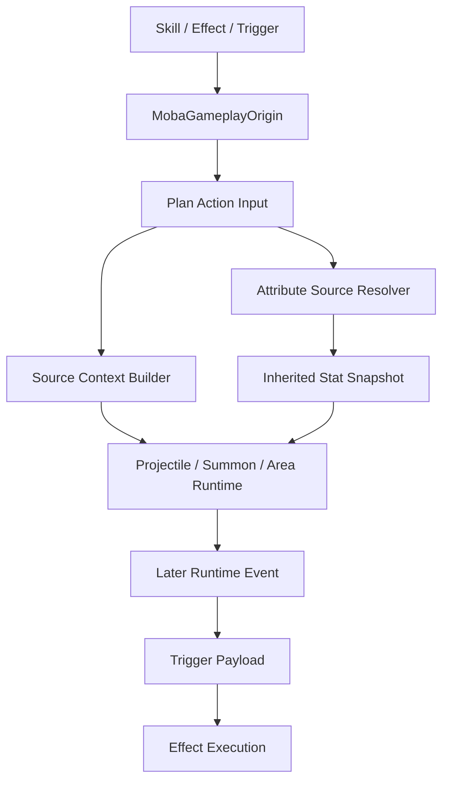
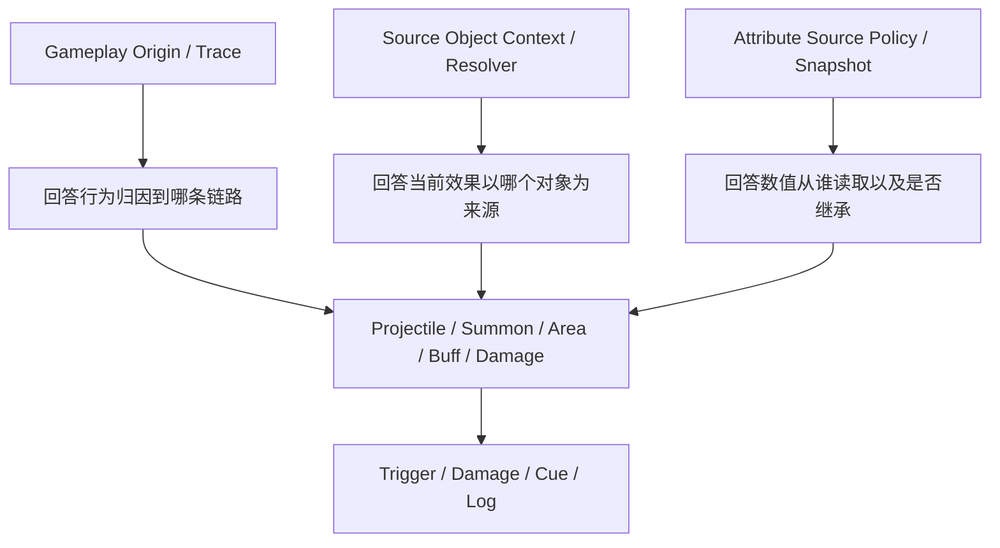

# AbilityKit MOBA 来源对象解析与属性继承设计

> 本文只整理设计方向和开发需求，不做实现。这里讨论的“来源”不是触发效果 trace 溯源；trace 模块已经负责行为归因和链路追踪。本文目标是为 projectile、summon、area、buff、damage 等派生对象建立稳定的来源对象解析、来源属性读取与配置化属性继承规则。

## 1. 背景

当前 MOBA 示例已经具备较完整的执行上下文和 trace 链路，核心模型包括 [`MobaGameplayOrigin`](Unity/Packages/com.abilitykit.demo.moba.runtime/Runtime/Application/Services/Context/Origin/MobaGameplayOrigin.cs:24)、[`MobaTriggerLineageContext`](Unity/Packages/com.abilitykit.demo.moba.runtime/Runtime/Application/Services/Context/Lineage/MobaTriggerLineageContext.cs:20)、[`MobaCombatExecutionContext`](Unity/Packages/com.abilitykit.demo.moba.runtime/Runtime/Application/Services/Context/Execution/MobaCombatExecutionContext.cs:54)、[`MobaContextSourceView`](Unity/Packages/com.abilitykit.demo.moba.runtime/Runtime/Application/Services/Context/Providers/MobaTriggerContextProviders.cs:47)。

这些模型主要解决“本次效果从哪条 trace 链路来”：

- 谁触发了当前行为。
- 当前行为挂在哪个 parent/root/owner context 下。
- 后续触发如何继续进入 effect/trigger pipeline。
- trace 和 skill runtime 如何追踪派生对象生命周期。

但复杂技能还需要另一类能力：派生对象执行效果时，能够稳定拿到“来源对象”并按配置决定是否读取或继承来源对象属性。

典型问题包括：

- projectile、summon、area 造成效果时，效果需要拿到 source actor、owner actor、root actor，还是当前派生对象自身 actor。
- summon/projectile 创建时，哪些属性从来源实体继承，哪些来自自身模板。
- 伤害、护盾、buff tick、area tick 等执行时，哪些字段读取实时来源属性，哪些读取创建时快照。
- 配置层如何表达“继承来源攻击力 30% + 自身基础值 100”这类规则。

因此需要把“trace 归因上下文”、“来源对象解析”和“属性来源策略”正式区分开。

## 2. 阶段性结论

当前示例不是缺少 trace 溯源，而是缺少面向派生对象执行效果的统一来源对象解析、属性来源与继承层。

已有能力：

- projectile 已有 [`ProjectileSourceContext`](Unity/Packages/com.abilitykit.demo.moba.runtime/Runtime/Application/Services/Projectile/ProjectileSourceContext.cs:6)，可保存 source actor、target actor、root context、owner context、skill runtime handle。
- summon 已有 [`SummonSourceContext`](Unity/Packages/com.abilitykit.demo.moba.runtime/Runtime/Application/Services/Summon/SummonSourceContext.cs:3)，可保存 spawn 来源和技能运行时归属。
- area 事件已有 [`AreaEventArgs`](Unity/Packages/com.abilitykit.demo.moba.runtime/Runtime/Application/Services/Projectile/AreaEventArgs.cs:6)，可继续携带 source/root/owner context。
- plan action 输入已经通过 [`MobaPlanActionInput`](Unity/Packages/com.abilitykit.demo.moba.runtime/Runtime/Application/Services/Triggering/PlanActions/Core/MobaPlanActionInput.cs:51) 收敛执行上下文、trace scope、caster/target、aim 等核心事实。
- damage payload 已经通过 [`AttackInfo`](Unity/Packages/com.abilitykit.demo.moba.runtime/Runtime/Application/Services/Combat/Damage/DamagePipelineModels.cs:6) 和 [`DamageResult`](Unity/Packages/com.abilitykit.demo.moba.runtime/Runtime/Application/Services/Combat/Damage/DamagePipelineModels.cs:208) 传递 origin。

主要缺口：

- 缺少统一的“来源对象解析 service”，派生对象执行效果时仍容易各自从 payload、caster、owner 中取值。
- 缺少统一的“属性读取 source policy”。
- 缺少“source/self/owner/root/self snapshot/live source”这些对象和数值语义的配置化表达。
- summon 配置已有 [`SummonMO.AttrScales`](Unity/Packages/com.abilitykit.demo.moba.runtime/Runtime/Infrastructure/Config/BattleDemo/MO/SummonMO.cs:24)，但 [`MobaSummonService`](Unity/Packages/com.abilitykit.demo.moba.runtime/Runtime/Application/Services/Summon/MobaSummonService.cs:128) 当前只按属性模板初始化，没有正式应用继承规则。
- projectile 有 [`ProjectileEffectSnapshotComponent`](Unity/Packages/com.abilitykit.demo.moba.runtime/Runtime/Domain/Components/ProjectileEffectSnapshotComponent.cs:7)，但字段只是局部快照，没有形成通用 attribute snapshot/resolve 体系。
- damage action 当前由 [`GiveDamagePlanActionModule`](Unity/Packages/com.abilitykit.demo.moba.runtime/Runtime/Application/Services/Triggering/PlanActions/Skill/GiveDamagePlanActionModule.cs:62) 直接写入基础伤害，缺少从来源属性计算基础伤害的统一 resolver。
- mitigation 当前在 [`MobaDamageMitigationService`](Unity/Packages/com.abilitykit.demo.moba.runtime/Runtime/Application/Services/Combat/Damage/MobaDamageMitigationService.cs:18) 中按 attacker/target 实体实时读取防御和穿透，但 attacker 对 projectile/summon/self source 的语义尚未配置化。

## 3. 核心原则

1. Trace 归因回答“谁导致了这件事”，来源对象解析回答“当前效果应该以哪个对象作为来源”，属性来源回答“数值从谁身上读”。三者相关，但不能混成同一个字段。
2. 派生对象必须保留 formal source context，但该 context 的第一职责是让后续效果能解析来源对象，不是替代 trace 树。
3. 属性继承必须是显式配置，不应靠 action 自己从 caster、owner、payload 中猜。
4. 创建时继承快照和执行时实时读取是两种不同语义，必须在配置和代码中区分。
5. source/self/owner/root actor 的选择应由统一 resolver 处理，plan action 只声明意图。
6. 任何可跨帧存在的对象，都应同时有 lineage/origin 信息、source object reference 信息和可选的 stat snapshot 信息。

## 4. 概念区分

### 4.1 Trace / Origin Context

Trace/origin context 是归因上下文，用于解释行为挂在哪条技能、效果、派生对象链路下。当前已有模块已经比较完整，不是本文要重新设计的重点。

它适合用于：

- trace 创建子节点。
- 表现 cue 归因。
- 战斗日志。
- owner-bound trigger。
- runtime retain/release。

它不适合直接表达：

- 当前效果要以哪个 actor 作为数值来源。
- 读取来源攻击力还是自身攻击力。
- 继承哪些属性。
- 创建时固化还是执行时实时读取。

### 4.2 Source Object Context

Source object context 是派生对象的来源对象上下文，用于让 projectile、summon、area、buff 等对象在后续执行效果时可以稳定解析 source/self/owner/root 等对象。

典型字段：

- source actor。
- target actor。
- source context id。
- root context id。
- owner context id。
- source config id。
- skill runtime handle。

它适合用于：

- projectile 命中时解析发射来源 actor。
- summon 释放技能时解析 summon self 和 owner/root source。
- area tick 时解析创建该 area 的 source actor。
- buff/shield tick 时解析施加者、承受者和具体 source context 实例。

它不适合直接表达：

- 某个属性是否实时读取还是创建时快照。
- 某个属性继承比例、加值、clamp、apply mode。

### 4.3 Execution Self / Stat Self / Body Actor

大型项目里不建议把 self 简单等同于“当前触发事件的对象”。复杂技能中至少要区分三种 self 语义：

| 语义 | 含义 | 示例 |
| --- | --- | --- |
| ExecutionSelf | 当前正在执行行为的 runtime 对象 | projectile hit、area tick、buff tick |
| StatSelf | 当前效果读取属性时认为的自身 actor | summon 自己攻击时读取 summon 属性 |
| BodyActor / MasterActor | 派生对象背后的本体 actor 或来源本体 | projectile 造成伤害时读取发射者属性 |

这个区分非常关键。projectile、area、trap、buff 这类对象经常是 runtime object，不一定是完整 actor，即使有 actor entity，也不一定拥有完整属性组件。它们行为上的 self 是自己，但属性上的 self 经常应该解析到本体 actor，也就是 source actor、owner actor 或 root actor。

推荐规则：

- hero、monster、summon 这类完整战斗单位：ExecutionSelf 和 StatSelf 通常都是自身 actor。
- projectile：ExecutionSelf 是 projectile runtime，StatSelf 默认不应直接读 projectile actor，通常按配置解析到 BodyActor 或 snapshot。
- area：ExecutionSelf 是 area runtime，StatSelf 通常解析到 source actor 或 area snapshot。
- buff/shield：ExecutionSelf 是 buff runtime，StatSelf 可以是 source actor、target actor、buff snapshot 或 owner actor。
- summon：ExecutionSelf 是 summon actor，StatSelf 默认是 summon 自身 actor，但 BodyActor 仍可指向 owner/root source 供特殊公式使用。

因此，source object resolver 不能只提供一个 SelfActorId。正式版本应提供多角色解析：

```text
ExecutionSelfRuntime
ExecutionSelfActor
StatSelfActor
BodyActor
SourceActor
OwnerActor
RootActor
TargetActor
```

配置层也不要只写 SelfActorLive，而应明确语义：

| Policy | 推荐含义 |
| --- | --- |
| StatSelfLive | 读取当前效果定义下的属性自身 |
| ExecutionSelfLive | 只在执行对象确实是完整 actor 且有属性时可用 |
| BodyActorLive | 读取派生对象背后的本体 actor |
| SourceActorLive | 读取直接来源 actor |
| OwnerActorLive | 读取归属 owner actor |
| RootActorLive | 读取最初 root source actor |

第一阶段如果不想引入太多枚举，也至少要把 SelfActorLive 的默认含义定义为 StatSelfLive，而不是 ExecutionSelfLive。否则 projectile 或 area 场景中“取自身属性”会频繁取错对象。

### 4.4 Attribute Source Policy

Attribute source policy 是数值读取策略，用于解释某个公式、某个继承规则应该读哪个实体或快照。

推荐枚举语义：

| 策略 | 含义 | 典型用途 |
| --- | --- | --- |
| SourceActorLive | 从 source actor 实时读取属性 | 技能伤害、buff tick 需要跟随施法者当前属性 |
| SourceActorSnapshot | 从创建时 source 属性快照读取 | projectile 飞行期间不受施法者后续 buff 影响 |
| StatSelfLive | 从 stat self actor 实时读取属性 | summon 自己攻击、hero 自身技能、monster 自身行为 |
| StatSelfSnapshot | 从 stat self 创建时快照读取 | 固化的机关、陷阱、自身快照公式 |
| BodyActorLive | 从派生对象背后的本体 actor 实时读取属性 | projectile/area 行为写“自身”但实际读发射者或本体 |
| OwnerActorLive | 从 owner/root owner 实时读取 | 召唤物共享主人部分战斗属性 |
| RootActorLive | 从技能根 source 实时读取 | 多层派生仍读最初施法者 |
| ExecutionSelfLive | 从 execution self actor 实时读取属性 | 仅用于执行对象就是完整 actor 的特殊场景 |
| ExplicitActor | 配置或 action 显式指定 actor | 特殊机制 |
| Literal | 不读属性，只用配置值 | 固定伤害、固定护盾 |

### 4.5 Inherited Stat Snapshot

Inherited stat snapshot 是创建派生对象时固化的一组属性或派生数值。

它适合用于：

- projectile 创建时固化伤害倍率、速度倍率、穿透次数。
- summon 创建时把 source 的攻击、防御、生命、攻速按比例写入自身属性。
- area 创建时固化 tick damage、半径、持续时间修正。
- trap/totem 类对象创建后不再跟随 caster 属性变化。

它不应该替代 source object context。snapshot 是数值快照，source object context 是对象解析事实。

## 5. 推荐总体架构



关键点：

- trace/origin 继续负责行为归因，不重新设计。
- source object resolver 负责从派生对象上下文解析 source/self/owner/root actor。
- attribute source resolver 负责按配置读取 live actor attribute 或 stat snapshot。
- runtime event 后续触发时同时带回 source object context 和 stat snapshot。
- plan action 不直接访问 caster attribute，而是通过 resolver 读取。

## 6. 运行时对象设计方向

### 6.1 Projectile

Projectile 的 formal source 应继续沿用 [`ProjectileSourceContext`](Unity/Packages/com.abilitykit.demo.moba.runtime/Runtime/Application/Services/Projectile/ProjectileSourceContext.cs:6)。

需要补充：

- projectile 创建时根据配置生成 projectile stat snapshot。
- snapshot 至少覆盖伤害倍率、速度倍率、穿透、命中衰减、额外系数等 projectile 生命周期内固定值。
- projectile hit payload 需要能暴露 stat snapshot provider，后续 damage action 可读取 projectile 的固化数值。
- 如果配置要求实时读取 source 属性，则 hit 时通过 source context 找到 source actor，再由 attribute source resolver 读取。

建议规则：

- 飞行速度、初始范围、最大命中数通常创建时固化。
- 伤害基础值是否固化由配置决定。
- 穿透、防御穿透是否实时读取由配置决定。
- 多目标命中衰减应放在 skill runtime blackboard 或 projectile runtime snapshot，不放进 source context。

### 6.2 Summon

Summon 的 formal source 应继续沿用 [`SummonSourceContext`](Unity/Packages/com.abilitykit.demo.moba.runtime/Runtime/Application/Services/Summon/SummonSourceContext.cs:3)。

需要补充：

- spawn 时读取 [`SummonMO.StatsMode`](Unity/Packages/com.abilitykit.demo.moba.runtime/Runtime/Infrastructure/Config/BattleDemo/MO/SummonMO.cs:23) 和 [`SummonMO.AttrScales`](Unity/Packages/com.abilitykit.demo.moba.runtime/Runtime/Infrastructure/Config/BattleDemo/MO/SummonMO.cs:24)。
- [`MobaActorAttributeInitializer.ApplyTemplate()`](Unity/Packages/com.abilitykit.demo.moba.runtime/Runtime/Application/Services/EntityConstruction/MobaActorAttributeInitializer.cs:19) 先应用自身模板，再由 summon inheritance applier 叠加来源继承。
- 继承结果应写入 summon 自身 [`AttributeGroupComponent`](Unity/Packages/com.abilitykit.demo.moba.runtime/Runtime/Domain/Components/AttributeSystemComponents.cs:9)，使 summon 后续作为独立 actor 参与战斗。
- summon 自己释放技能时，默认 source actor 应是 summon 自身，但 origin/root 仍可追溯到 owner skill runtime。

建议 StatsMode 语义：

| StatsMode | 含义 |
| --- | --- |
| TemplateOnly | 只使用 summon 自身属性模板 |
| SourceScaledSnapshot | 创建时按 source 属性比例写入自身属性 |
| OwnerScaledSnapshot | 创建时按 owner/root owner 属性比例写入自身属性 |
| SourceLiveProxy | 不写入自身，部分公式实时代理 source 属性 |
| Hybrid | 模板 + 创建时快照 + 少量实时代理混合 |

第一阶段建议优先实现 TemplateOnly、SourceScaledSnapshot、Hybrid，不急于做全量实时代理。

### 6.3 Area / AOE

Area 当前事件使用 [`AreaEventArgs`](Unity/Packages/com.abilitykit.demo.moba.runtime/Runtime/Application/Services/Projectile/AreaEventArgs.cs:6) 携带 source/root/owner context。

需要补充：

- area runtime 创建时保存 area source context。
- area runtime 保存可选 area stat snapshot。
- area tick/enter/exit payload 暴露 source context 和 snapshot provider。
- area 内部 tick 造成伤害时，由 damage action 根据配置选择 source actor live、area snapshot 或 self actor。

建议规则：

- area 的形状、半径、持续时间通常创建时固化。
- area tick damage 可以支持创建时固化或实时读取 source。
- area 自身如果是完整 actor 且有属性组件，可显式支持 ExecutionSelfLive；默认仍建议使用 StatSelfLive、BodyActorLive 或 RuntimeSnapshot。

### 6.4 Buff / Shield

Buff runtime 当前已经保存 source actor、source context、origin 和 runtime context，相关逻辑见 [`BuffRuntime`](Unity/Packages/com.abilitykit.demo.moba.runtime/Runtime/Application/Services/Buffs/Core/BuffRuntimeContexts.cs:105) 和 [`BuffContinuousRuntime`](Unity/Packages/com.abilitykit.demo.moba.runtime/Runtime/Application/Services/Buffs/Runtime/BuffContinuousRuntime.cs:25)。

需要补充：

- buff apply 时可保存 buff stat snapshot，例如护盾基础值、tick 伤害基础值、属性加成来源。
- buff tick action 读取属性时明确使用 source actor live、source snapshot、target self live 或 buff snapshot。
- shield 层应记录 source context id，而不只是 source actor id，避免同一个 source 多次施加同类 shield 时归因混乱。

### 6.5 Damage

Damage 当前由 [`GiveDamagePlanActionModule`](Unity/Packages/com.abilitykit.demo.moba.runtime/Runtime/Application/Services/Triggering/PlanActions/Skill/GiveDamagePlanActionModule.cs:22) 创建 [`AttackInfo`](Unity/Packages/com.abilitykit.demo.moba.runtime/Runtime/Application/Services/Combat/Damage/DamagePipelineModels.cs:6)，再进入 [`DamagePipelineService.Execute()`](Unity/Packages/com.abilitykit.demo.moba.runtime/Runtime/Application/Services/Combat/Damage/DamagePipelineService.cs:46)。

需要补充：

- damage args/schema 支持声明 base damage 的来源策略。
- damage action 通过 attribute source resolver 计算基础伤害，而不是只使用 literal damage value。
- [`AttackInfo`](Unity/Packages/com.abilitykit.demo.moba.runtime/Runtime/Application/Services/Combat/Damage/DamagePipelineModels.cs:6) 可补充 attribute source snapshot 或 formula source metadata，方便后续管线阶段读取。
- [`MobaDamageMitigationService`](Unity/Packages/com.abilitykit.demo.moba.runtime/Runtime/Application/Services/Combat/Damage/MobaDamageMitigationService.cs:18) 中 attacker 属性读取也应可由 attack source policy 决定，不能永远假设 attacker actor 就是属性来源。

## 7. 配置模型建议

### 7.1 Attribute Inheritance Rule

建议配置结构表达为：

```text
TargetAttrId
SourcePolicy
SourceAttrId
Scale
Add
Min
Max
ApplyMode
SnapshotTiming
```

字段语义：

| 字段 | 含义 |
| --- | --- |
| TargetAttrId | 写入哪个目标属性 |
| SourcePolicy | 从谁读取属性 |
| SourceAttrId | 读取哪个来源属性 |
| Scale | 比例 |
| Add | 固定加值 |
| Min/Max | clamp 范围 |
| ApplyMode | set base、add base、modifier、override snapshot |
| SnapshotTiming | spawn、launch、hit、tick、cast |

### 7.2 Damage Formula Source

Damage 不应只配置一个固定 DamageValue，应支持：

```text
BaseLiteral
SourcePolicy
SourceAttrId
AttrScale
FlatAdd
DamageRate
SnapshotTiming
```

典型配置：

- 固定伤害：只填 BaseLiteral。
- 技能伤害：BaseLiteral + SourceActorLive.PhysicsAttack * 0.8。
- projectile 固化伤害：创建时 SourceActorSnapshot.PhysicsAttack * 1.2，命中时直接读 snapshot。
- summon 自己攻击：StatSelfLive.PhysicsAttack。

### 7.3 Runtime Stat Snapshot

建议每类 runtime 都不要各自发明字段名，而是用统一快照结构表达：

```text
SnapshotId
OwnerRuntimeKind
OwnerRuntimeId
SourceContextId
RootContextId
OwnerContextId
Entries[]
```

Entry 字段：

```text
Key
AttrId
Value
SourcePolicy
SourceActorId
SnapshotFrame
```

第一阶段可以不做通用数据表，只要运行时结构和接口先统一。

## 8. 代码层开发需求

### 8.1 新增属性来源解析服务

建议新增服务职责：

- 根据 execution context、source object context、runtime snapshot、policy 解析 actor。
- 读取 [`MobaAttrs`](Unity/Packages/com.abilitykit.demo.moba.runtime/Runtime/Domain/Attributes/MobaAttrs.cs:9) 或 stat snapshot。
- 统一处理 actor missing、attribute missing、snapshot missing 的 fallback。
- 提供诊断日志，说明本次数值从哪个来源解析而来。

建议命名：

- `MobaSourceObjectResolver`
- `MobaAttributeSourceResolver`
- `MobaRuntimeStatSnapshotService`
- `MobaAttributeInheritanceApplier`

### 8.2 新增 provider 接口

建议为派生 payload/runtime 增加可选 provider：

```text
TryGetRuntimeStatSnapshot
TryGetAttributeSourceContext
TryGetSourceActorOverride
```

用途：

- projectile hit payload 暴露 projectile snapshot。
- area tick payload 暴露 area snapshot。
- buff tick payload 暴露 buff snapshot。
- summon action input 可把 spawn source context 与继承规则传给 applier。

### 8.3 改造 summon 初始化链路

当前 [`MobaSummonService`](Unity/Packages/com.abilitykit.demo.moba.runtime/Runtime/Application/Services/Summon/MobaSummonService.cs:128) 在 spawn 后调用 [`ActorEntityInitPipeline.InitializeFromAttributeTemplate()`](Unity/Packages/com.abilitykit.demo.moba.runtime/Runtime/Application/Services/EntityConstruction/ActorEntityInitPipeline.cs:29)。

建议顺序：

1. 创建 actor。
2. 初始化自身属性模板。
3. 构建 spawn source context。
4. 根据 summon stats mode 和 attr scales 应用继承。
5. 初始化默认组件、技能、passive。
6. track source context、retain skill runtime、发布 summon spawned event。

原因：

- summon 自身属性应最终落在 actor attribute group 上。
- summon 后续释放技能时可以像普通 actor 一样读取自身属性。
- source/root/owner 仍由 source context 保留，不依赖属性系统表达。

### 8.4 改造 projectile 创建与命中链路

当前 projectile source 由 [`MobaProjectileLinkService`](Unity/Packages/com.abilitykit.demo.moba.runtime/Runtime/Application/Services/Projectile/MobaProjectileLinkService.cs:32) 绑定，spawn/hit 后由 [`MobaStageTriggerService`](Unity/Packages/com.abilitykit.demo.moba.runtime/Runtime/Application/Services/Triggering/MobaStageTriggerService.cs:118) 派发。

建议补充：

1. launch action 创建 projectile source context。
2. 同时创建 projectile stat snapshot。
3. link service 绑定 projectile id 到 source context 和 stat snapshot。
4. hit payload 同时携带 source context 和 stat snapshot。
5. damage action 根据配置选择 hit 时读取 snapshot 或实时 source actor。

### 8.5 改造 damage action 与 damage pipeline

建议改造范围：

- damage args/schema 增加 attribute formula source。
- damage action 调用 attribute source resolver 得到 base damage。
- attack metadata 保留本次公式来源，便于诊断和后续 pipeline 读取。
- mitigation 阶段读取攻击方穿透时，优先使用 attack source policy，默认 fallback 到 attacker actor。

注意：damage pipeline 不应该知道 projectile/summon/area 的具体类型，它只消费 attack metadata 或 resolver 结果。

### 8.6 配置校验

已有 [`MobaBattleConfigReferenceValidator`](Unity/Packages/com.abilitykit.demo.moba.runtime/Runtime/Application/Services/Validation/MobaBattleConfigReferenceValidator.cs:346) 会检查 summon attr scales。后续需要增加：

- source policy 是否合法。
- attr id 是否存在。
- snapshot timing 是否和 runtime kind 匹配。
- self actor policy 是否要求 runtime 必须有 actor。
- source live policy 是否允许 source actor 死亡或消失后的 fallback。
- scale/add/clamp 是否有效。

## 9. 大型项目正式实现方案

正式版本不要把来源对象和属性继承写进某个 action、projectile service 或 summon service 的局部逻辑里，而应拆成三层稳定能力：

1. 来源对象层：负责把 projectile、summon、area、buff 等派生对象解析回 source/self/owner/root actor。
2. 属性读取层：负责按配置从 live actor 或 snapshot 读取属性和公式输入。
3. 属性继承层：负责在 spawn、launch、apply、tick 等时机把来源属性按规则写入目标属性或 runtime snapshot。

### 9.1 模块边界

建议在 MOBA runtime 内形成以下模块边界：

| 模块 | 职责 | 不负责 |
| --- | --- | --- |
| Source Object Resolver | 解析 source/self/owner/root actor 和 source context | 不计算属性值 |
| Attribute Source Resolver | 按 policy 读取 live attribute 或 snapshot entry | 不关心 projectile/summon 具体业务 |
| Runtime Stat Snapshot Service | 管理 projectile/area/buff 等 runtime snapshot 生命周期 | 不决定公式含义 |
| Attribute Inheritance Applier | 按 inheritance rule 应用属性继承 | 不创建 actor、不派发 trigger |
| Config Validator | 校验 source policy、attr id、snapshot timing、apply mode | 不修复错误配置 |
| Diagnostics | 输出来源对象、属性来源、继承结果 | 不参与战斗结算 |

这个边界的关键是：domain service 可以使用 resolver，但 resolver 不反向依赖 projectile、summon、area 的细节。projectile/summon 只提供 context 和 snapshot，公式和继承规则由配置驱动。

### 9.2 核心数据结构

正式版本建议至少有四组数据结构。

来源对象引用：

```text
MobaSourceObjectRef
ExecutionSelfActorId
StatSelfActorId
BodyActorId
SourceActorId
OwnerActorId
RootActorId
TargetActorId
SourceContextId
RootContextId
OwnerContextId
RuntimeKind
RuntimeId
ConfigId
```

解析请求：

```text
MobaSourceObjectResolveRequest
RequestedRole
ExecutionContext
SourceObjectRef
FallbackPolicy
AllowDeadActor
RequireAttributeGroup
```

属性读取请求：

```text
MobaAttributeSourceRequest
SourcePolicy
AttrId
LiteralValue
SnapshotKey
SnapshotTiming
Scale
Add
Min
Max
FallbackValue
```

继承规则：

```text
MobaAttributeInheritanceRule
TargetAttrId
SourcePolicy
SourceAttrId
Scale
Add
Min
Max
ApplyMode
SnapshotTiming
Required
```

这些结构要做到可序列化、可日志化、可测试。运行时可以先用普通 struct/class，后续再接入 Luban 配置 DTO。

### 9.3 来源对象解析规则

正式解析顺序建议固定下来，避免 action 各自猜来源：

1. 优先使用 runtime payload 显式携带的 source object ref。
2. 如果 payload 没有，则从 [`MobaCombatExecutionContext`](Unity/Packages/com.abilitykit.demo.moba.runtime/Runtime/Application/Services/Context/Execution/MobaCombatExecutionContext.cs:54) 和 [`MobaContextSourceView`](Unity/Packages/com.abilitykit.demo.moba.runtime/Runtime/Application/Services/Context/Providers/MobaTriggerContextProviders.cs:47) 推导。
3. projectile 使用 [`ProjectileSourceContext`](Unity/Packages/com.abilitykit.demo.moba.runtime/Runtime/Application/Services/Projectile/ProjectileSourceContext.cs:6) 补 execution self runtime、body actor、source actor、target、root、owner。
4. summon 使用 [`SummonSourceContext`](Unity/Packages/com.abilitykit.demo.moba.runtime/Runtime/Application/Services/Summon/SummonSourceContext.cs:3) 补 execution self actor、stat self actor、body actor、source、root、owner。
5. area 使用 [`AreaEventArgs`](Unity/Packages/com.abilitykit.demo.moba.runtime/Runtime/Application/Services/Projectile/AreaEventArgs.cs:6) 补 execution self runtime、body actor、source、target、runtime。
6. buff/shield 使用 buff runtime context 补 execution self runtime、source actor、target actor、stat self actor 和 source context id。
7. 最后才 fallback 到 caster/attacker/target。

解析结果必须带诊断字段：最终选择了哪个 actor、来自哪个字段、是否 fallback、是否缺失属性组件。

正式版本中 self 的解析要遵守以下默认值：

| Runtime 类型 | ExecutionSelf | StatSelf 默认值 | BodyActor 默认值 |
| --- | --- | --- | --- |
| Hero / Monster | actor 自身 | actor 自身 | actor 自身 |
| Summon | summon actor | summon actor | owner/root source，可配置覆盖 |
| Projectile | projectile runtime 或 actor | source actor 或 snapshot | source actor |
| Area | area runtime | source actor 或 snapshot | source actor |
| Buff / Shield | buff runtime | target actor、source actor 或 snapshot，由配置决定 | source actor |

也就是说，大型项目里“取自身 actor”通常不是直接读当前 runtime 对象，而是通过角色化 resolver 得到 StatSelfActor。只有配置显式要求 ExecutionSelfLive，并且当前对象确实是完整 actor 且有属性组件时，才直接读取 execution self。

### 9.4 属性读取规则

属性读取不应直接接受 actor id，而应接受 source policy。第一阶段支持：

| Policy | 读取来源 | 失败处理 |
| --- | --- | --- |
| Literal | 配置固定值 | 直接返回 literal |
| SourceActorLive | source actor 当前 [`MobaAttrs`](Unity/Packages/com.abilitykit.demo.moba.runtime/Runtime/Domain/Attributes/MobaAttrs.cs:9) | 按 fallback policy |
| StatSelfLive | stat self actor 当前 [`MobaAttrs`](Unity/Packages/com.abilitykit.demo.moba.runtime/Runtime/Domain/Attributes/MobaAttrs.cs:9) | 按 fallback policy |
| BodyActorLive | body/master actor 当前 [`MobaAttrs`](Unity/Packages/com.abilitykit.demo.moba.runtime/Runtime/Domain/Attributes/MobaAttrs.cs:9) | 按 fallback policy |
| OwnerActorLive | owner/root owner 当前属性 | 按 fallback policy |
| RuntimeSnapshot | runtime stat snapshot entry | 缺失时报配置或运行时错误 |

第二阶段再扩展 SourceActorSnapshot、StatSelfSnapshot、RootActorLive、ExecutionSelfLive、ExplicitActor。不要一开始把所有 policy 做满，否则验证成本会过高。

### 9.5 属性继承规则

继承 applier 的输入应是目标 actor、source object ref、inheritance rules。推荐应用顺序：

1. 目标 actor 先完成自身模板初始化。
2. resolver 按每条 rule 找到来源对象或 snapshot。
3. attribute source resolver 读取 source attr。
4. applier 计算 `final = clamp(sourceValue * scale + add)`。
5. 按 apply mode 写入目标属性：set base、add base、modifier、override snapshot。
6. 记录继承诊断：target attr、source policy、source actor、source attr、source value、final value。

summon 的正式语义应优先让继承结果落到自身 [`AttributeGroupComponent`](Unity/Packages/com.abilitykit.demo.moba.runtime/Runtime/Domain/Components/AttributeSystemComponents.cs:38)，这样 summon 后续作为普通 actor 战斗。projectile、area、buff 这类不一定是完整 actor 的 runtime，则优先写入 runtime stat snapshot。

### 9.6 接入点

推荐按现有代码接入：

| 场景 | 接入点 | 第一阶段目标 |
| --- | --- | --- |
| Summon spawn | [`MobaSummonService`](Unity/Packages/com.abilitykit.demo.moba.runtime/Runtime/Application/Services/Summon/MobaSummonService.cs:74) | 模板初始化后应用 [`SummonMO.AttrScales`](Unity/Packages/com.abilitykit.demo.moba.runtime/Runtime/Infrastructure/Config/BattleDemo/MO/SummonMO.cs:24) |
| Projectile launch | projectile launch action / link service | 创建 source object ref 和 projectile snapshot |
| Projectile hit | [`MobaStageTriggerService`](Unity/Packages/com.abilitykit.demo.moba.runtime/Runtime/Application/Services/Triggering/MobaStageTriggerService.cs:118) | hit payload 带 source object ref 和 snapshot id |
| Damage action | [`GiveDamagePlanActionModule`](Unity/Packages/com.abilitykit.demo.moba.runtime/Runtime/Application/Services/Triggering/PlanActions/Skill/GiveDamagePlanActionModule.cs:62) | base damage 通过 resolver 计算 |
| Damage mitigation | [`MobaDamageMitigationService`](Unity/Packages/com.abilitykit.demo.moba.runtime/Runtime/Application/Services/Combat/Damage/MobaDamageMitigationService.cs:18) | 穿透来源可配置 |
| Area tick | area runtime event | tick payload 带 source object ref 和 snapshot id |
| Buff/shield | buff apply/tick/shield stack | source context id + snapshot 归因 |

### 9.7 触发器行为适配范围

不是所有触发器行为都要逐个做 projectile、summon、area 的专门适配。大型项目里更推荐把适配集中在 action input、resolver、公共 action helper 和配置 schema，具体行为只声明自己需要什么角色或属性来源。

需要适配的行为类型：

| 行为类型 | 是否需要适配 | 原因 |
| --- | --- | --- |
| 造成伤害 | 必须 | 需要解析 attacker、stat source、damage formula source、snapshot |
| 添加 buff / shield | 必须 | 需要记录 source object ref、source context id、属性快照和归因 |
| 召唤 / 创建派生对象 | 必须 | 需要生成派生对象的 source object ref 和继承规则输入 |
| 发射 projectile / 创建 area | 必须 | 需要绑定 source object ref、body actor、runtime snapshot |
| 属性修改 / attribute modifier | 必须 | 需要明确目标 actor、来源 actor、modifier source id |
| 纯表现 cue | 部分需要 | 通常只需要 source/target/context，不需要属性 resolver |
| 播放音效、震屏、简单日志 | 通常不需要 | 不读取 actor 属性，也不创建派生战斗对象 |
| 条件判断 | 取决于条件内容 | 如果条件读属性、阵营、距离、tag 来源，就需要 resolver |

改造边界：

1. [`MobaPlanActionInput`](Unity/Packages/com.abilitykit.demo.moba.runtime/Runtime/Application/Services/Triggering/PlanActions/Core/MobaPlanActionInput.cs:51)、[`MobaEffectActionInput`](Unity/Packages/com.abilitykit.demo.moba.runtime/Runtime/Application/Services/Triggering/PlanActions/Core/MobaPlanActionInput.cs:115)、projectile/summon action input 应提供统一 source object ref 获取入口。
2. plan action module 不直接从 caster、owner、payload 猜 actor，而是调用 `MobaSourceObjectResolver`。
3. 需要属性的 action 不直接读取 [`MobaAttrs`](Unity/Packages/com.abilitykit.demo.moba.runtime/Runtime/Domain/Attributes/MobaAttrs.cs:9)，而是提交 `MobaAttributeSourceRequest` 给 `MobaAttributeSourceResolver`。
4. 创建 runtime 对象的 action 负责把 resolver 结果写入 projectile、summon、area、buff runtime context。
5. 触发器框架底层不需要知道 MOBA 的 source actor 语义；MOBA adapter/action module 负责把通用触发器上下文映射成 MOBA source object ref。

这样后续新增行为时，默认只需要做两件事：声明需要哪个 actor role，声明需要哪个 attribute source policy。只有新增一种 runtime object 类型时，才需要补 provider 和 source object ref 构建逻辑。

### 9.8 分阶段落地步骤

第一阶段：打基础，只做来源对象解析和 summon 继承。

1. 定义 `MobaSourceObjectRole`、`MobaSourceObjectRef`、`MobaSourceObjectResolveResult`。
2. 实现 `MobaSourceObjectResolver`，支持 execution self、stat self、body actor、source、owner、root、target。
3. 定义 `MobaAttributeSourcePolicy` 和最小 `MobaAttributeSourceRequest`。
4. 实现 `MobaAttributeSourceResolver`，只支持 Literal、SourceActorLive、StatSelfLive、BodyActorLive。
5. 实现 `MobaAttributeInheritanceApplier`，支持 set base、add base。
6. 让 summon 正式消费 [`SummonMO.AttrScales`](Unity/Packages/com.abilitykit.demo.moba.runtime/Runtime/Infrastructure/Config/BattleDemo/MO/SummonMO.cs:24)。
7. 增加 summon 继承测试和来源对象解析测试。

第二阶段：支持 projectile snapshot 和 damage 公式来源。

1. 定义 runtime stat snapshot 数据结构和服务。
2. projectile launch 时创建 snapshot。
3. projectile hit payload 携带 snapshot id 和 source object ref。
4. damage args/schema 增加 attribute formula source。
5. [`GiveDamagePlanActionModule`](Unity/Packages/com.abilitykit.demo.moba.runtime/Runtime/Application/Services/Triggering/PlanActions/Skill/GiveDamagePlanActionModule.cs:62) 使用 resolver 计算 base damage。
6. [`AttackInfo`](Unity/Packages/com.abilitykit.demo.moba.runtime/Runtime/Application/Services/Combat/Damage/DamagePipelineModels.cs:6) 增加 formula source metadata。
7. 增加 projectile 固化伤害、source live damage、self live damage 测试。

第三阶段：扩展 area、buff、shield 和 mitigation。

1. area runtime 保存 source object ref 和 snapshot。
2. buff apply/tick 保存或读取 buff snapshot。
3. shield 实例归因使用 source context id。
4. mitigation 读取攻击方穿透时使用 attack metadata 中的 source policy。
5. 增加 area tick、buff tick、shield 多实例归因测试。

第四阶段：配置正式化和工具化。

1. Luban 配置增加 source policy、snapshot timing、apply mode、fallback policy。
2. [`MobaBattleConfigReferenceValidator`](Unity/Packages/com.abilitykit.demo.moba.runtime/Runtime/Application/Services/Validation/MobaBattleConfigReferenceValidator.cs:346) 校验 attr id、policy、timing、apply mode。
3. 增加诊断日志开关，能输出一次伤害或继承的完整解析链。
4. 增加配置样例和 smoke case，覆盖 projectile、summon、area、buff、shield。

### 9.9 验收标准

正式版本至少满足：

1. 任意 projectile/summon/area/buff 触发效果时，不需要 action 手写 caster/owner 猜测逻辑。
2. 同一个 damage action 可以处理 hero skill、projectile hit、summon attack、area tick、buff tick。
3. summon 属性继承由配置控制，继承结果可诊断、可测试。
4. projectile 可以选择创建时固化属性，也可以命中时读取 source live 属性。
5. source actor 缺失、死亡、无属性组件时有明确 fallback 或错误策略。
6. trace 仍只负责行为归因，不被扩展成属性系统。
7. 新增复杂技能时优先新增配置和少量 runtime provider，不需要改 damage pipeline 主体。

## 10. 实现顺序建议

1. 定义 source object reference、attribute source policy、stat snapshot、inheritance rule 的最小代码结构。
2. 新增 source object resolver，先支持 execution self、stat self、body actor、source actor、owner/root actor 的解析。
3. 新增 attribute source resolver，只支持 literal、source actor live、stat self live、body actor live 四种基础策略。
4. 让 summon 正式消费 [`SummonMO.AttrScales`](Unity/Packages/com.abilitykit.demo.moba.runtime/Runtime/Infrastructure/Config/BattleDemo/MO/SummonMO.cs:24)，完成创建时属性继承。
5. 为 projectile 增加 stat snapshot 绑定和 hit payload provider。
6. 改造 damage action，使 base damage 可以从 resolver 计算。
7. 为 area runtime 增加 source object context 和 stat snapshot。
8. 扩展 buff/shield snapshot 与 source context id 归因。
9. 增加配置校验和诊断日志。
10. 补测试：summon 继承、projectile 固化伤害、source live damage、self live damage、多层派生来源对象解析。

## 11. 验收场景

### 11.1 Projectile 固化伤害

1. 角色释放 projectile 时攻击力为 100。
2. projectile 创建时固化 100 * 1.2。
3. projectile 飞行期间角色攻击力变为 200。
4. projectile 命中时仍按 120 基础伤害结算。
5. trace 能追溯到原技能，damage source 说明来自 projectile snapshot。

### 11.2 Projectile 实时来源伤害

1. 角色释放 projectile 时攻击力为 100。
2. projectile 飞行期间角色攻击力变为 200。
3. projectile 命中时按 200 * 配置倍率结算。
4. trace 能追溯到 projectile hit，attribute source 说明来自 source actor live。

### 11.3 Summon 创建继承

1. 角色攻击力为 300。
2. summon 配置继承 source physics attack 30%。
3. summon 自身模板攻击力为 50。
4. spawn 后 summon 攻击力为 140 或按配置 apply mode 得到明确结果。
5. summon 后续自己攻击时默认读取 StatSelfLive，也就是 summon 自身 actor 的属性。
6. summon 造成伤害仍能追溯到原技能/root owner。

### 11.4 Area Tick

1. 技能创建 area。
2. area tick 造成伤害。
3. 配置可选择 tick damage 读 area snapshot 或 source actor live。
4. 每次 tick payload 都能携带 area source context。
5. damage result trace 能看到 skill -> effect -> area -> tick -> damage。

### 11.5 Buff Tick 与 Shield

1. buff apply 时保存 source context 和可选 stat snapshot。
2. buff tick 读取 source actor live 或 buff snapshot。
3. shield 叠层和移除支持 source context id 维度归因。
4. 同一 caster 多次施加同一 shield 时，不会只靠 source actor id 混淆实例。

## 12. 风险点

1. 不要让 [`MobaGameplayOrigin`](Unity/Packages/com.abilitykit.demo.moba.runtime/Runtime/Application/Services/Context/Origin/MobaGameplayOrigin.cs:24) 变成属性系统，它只负责来源事实。
2. 不要让 damage pipeline 识别 projectile/summon/area 具体类型，否则会破坏扩展性。
3. 不要默认所有派生对象都实时读取 caster 属性，很多 projectile/trap 需要创建时固化。
4. 不要默认所有 summon 都代理 owner 属性，summon 应优先是独立 actor。
5. 不要只用 source actor id 做 buff/shield 实例归因，复杂链路中必须使用 source context id。
6. 不要把属性继承写成一次性硬编码逻辑，后续复杂技能会快速膨胀。

## 13. 最终目标

最终应形成三条并行但协作的链路：



达到这个状态后，复杂技能可以稳定表达：

- projectile 命中时，行为 self 是 projectile，但属性 self 可以按配置解析到本体 actor 或 projectile snapshot。
- projectile 命中读原施法者实时攻击力。
- projectile 命中读发射时固化攻击力。
- summon 创建继承主人部分属性，但之后按 StatSelfLive 读取自身属性战斗。
- summon 的技能行为仍能追溯到最初技能。
- area tick 的伤害来源可配置。
- buff tick 和 shield 实例能按 source context 精确归因。
- trace、来源对象解析、属性继承、runtime 四个职责清晰分离。
