# AbilityKit 战斗流程架构设计文档

> 本文档描述 AbilityKit 框架中技能流程的整体数据流向，包括 Pipeline、Triggering、Modifiers 等核心模块的协作关系。

---

## 目录

1. [模块概览](#1-模块概览)
2. [模块依赖关系](#2-模块依赖关系)
3. [技能施法完整流程](#3-技能施法完整流程)
4. [Pipeline 层详解](#4-pipeline-层详解)
5. [Triggering 层详解](#5-triggering-层详解)
6. [Modifiers 层详解](#6-modifiers-层详解)
7. [Attributes 层详解](#7-attributes-层详解)
8. [Buff 层详解](#8-buff-层详解)
9. [数据流向总图](#9-数据流向总图)
10. [时序图](#10-时序图)
11. [关键类型速查](#11-关键类型速查)

---

## 1. 模块概览

### 1.1 模块列表

| 模块 | 路径 | 核心职责 |
|------|------|---------|
| `com.abilitykit.pipeline` | `Unity/Packages/com.abilitykit.pipeline` | 技能管线编排，按阶段和时间轴执行 |
| `com.abilitykit.triggering` | `Unity/Packages/com.abilitykit.triggering` | 触发器系统，条件评估 + 行为执行 |
| `com.abilitykit.modifiers` | `Unity/Packages/com.abilitykit.modifiers` | 修饰器计算，属性数值修改 |
| `com.abilitykit.attributes` | `Unity/Packages/com.abilitykit.attributes` | 属性系统，属性存储和查询 |
| `com.abilitykit.timer` | `Unity/Packages/com.abilitykit.timer` | 定时器框架，时间管理（使用方注入） |
| `com.abilitykit.demo.moba.runtime` | `Unity/Packages/com.abilitykit.demo.moba.runtime` | MOBA 业务实现 |

### 1.2 核心设计思想

```
┌─────────────────────────────────────────────────────────────┐
│                     技能施法流程                              │
├─────────────────────────────────────────────────────────────┤
│  Pipeline    │ 负责「什么时候做什么」—— 时间轴编排            │
│  Triggering  │ 负责「满足条件时执行什么」—— 行为执行          │
│  Modifiers   │ 负责「属性值怎么算」—— 数值计算                │
│  Attributes  │ 负责「属性值存在哪」—— 数据存储                │
└─────────────────────────────────────────────────────────────┘
```

---

## 2. 模块依赖关系

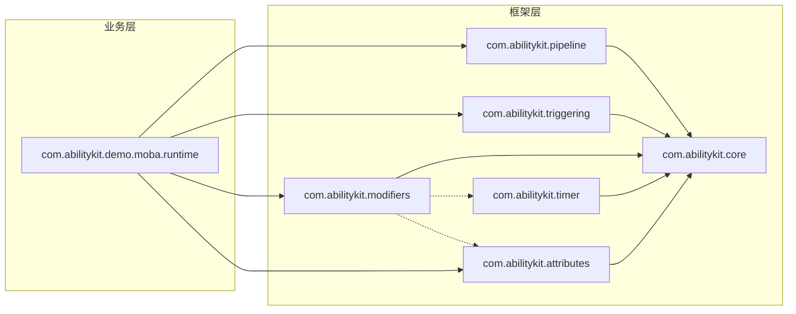

### 2.1 依赖说明

| 依赖方向 | 说明 |
|---------|------|
| MobaRuntime → Pipeline | 业务层使用 SkillPipelineRunner 启动技能 |
| MobaRuntime → Triggering | 业务层使用 TriggerRunner 执行 Effect |
| MobaRuntime → Modifiers | 业务层使用 MobaAttrs 操作属性 |
| Modifiers → Attributes | 修饰器计算需要读取属性值 |
| Modifiers → Timer | 时间衰减修饰器需要计时器（可选） |

---

## 3. 技能施法完整流程

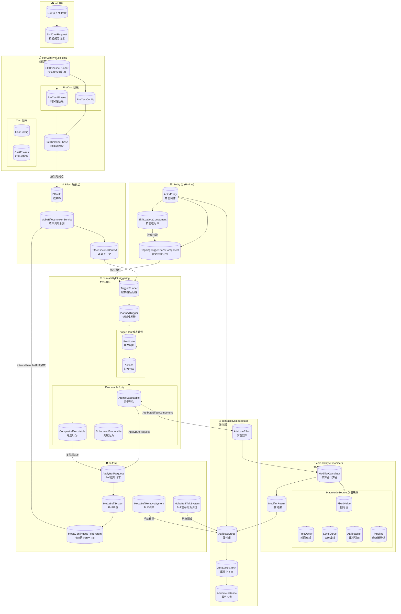

---

## 4. Pipeline 层详解

### 4.1 模块路径

```
com.abilitykit.pipeline/Runtime/Core/
├── Interfaces/                    # 接口定义
│   ├── IAbilityPipeline.cs       # 管线接口
│   ├── IAbilityPipelineContext.cs # 上下文接口
│   ├── IAbilityPipelinePhase.cs  # 阶段接口
│   └── ...
├── Phase/                         # 阶段实现
│   ├── AbilityDelayPhase.cs      # 延迟阶段
│   ├── AbilitySequencePhase.cs   # 顺序执行阶段
│   ├── AbilityParallelPhase.cs   # 并行执行阶段
│   └── ...
└── AbilityPipeline.cs            # 核心抽象管线类
```

### 4.2 核心类型

| 类型 | 说明 |
|------|------|
| `SkillPipelineRunner` | 技能管线运行器，管理 PreCast → Cast 两阶段 |
| `SkillTimelinePhase` | 时间轴阶段，按时间点触发 EffectId |
| `SkillPipelineContext` | 管线执行上下文，存储施法者/目标/技能ID |
| `AbilityPipeline<TCtx>` | 核心抽象管线类 |
| `InstantAbilityPipeline<TCtx>` | 纯瞬时管线，同步执行完毕 |

### 4.3 阶段类型

| 阶段类型 | 说明 |
|---------|------|
| `IAbilityInstantPhase` | 瞬时阶段标记，Execute 后立即完成 |
| `IDurationalPhase` | 持续阶段标记，OnUpdate 驱动 |
| `IInterruptiblePhase` | 可中断阶段标记，支持暂停/继续 |

### 4.4 PreCast → Cast 流程

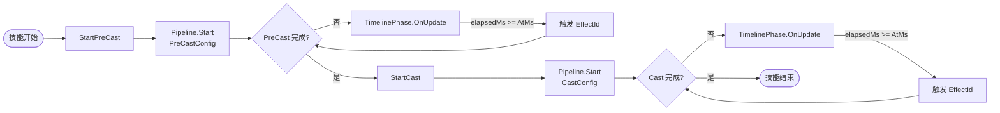

---

## 5. Triggering 层详解

### 5.1 模块路径

```
com.abilitykit.triggering/Runtime/
├── Executable/                    # 行为执行核心
│   ├── IExecutable.cs             # 核心接口
│   ├── AtomicExecutables.cs       # 原子行为实现
│   ├── CompositeExecutables.cs    # 组合行为实现
│   └── ScheduledExecutables.cs   # 调度行为实现
├── Plan/                         # 触发器计划层
│   ├── TriggerPlan.cs            # 触发器数据结构
│   └── PlannedTrigger.cs         # 触发器实现
└── Runtime/                      # 运行时核心
    └── TriggerRunner.cs          # 触发器运行器
```

### 5.2 核心类型

| 类型 | 说明 |
|------|------|
| `TriggerRunner<TCtx>` | 触发器运行管理器，接收事件并执行触发计划 |
| `PlannedTrigger<TArgs, TCtx>` | 基于计划的触发器实现 |
| `IExecutable` | 所有行为的基础接口 |
| `ExecutionResult` | 行为执行结果 |

### 5.3 行为类型层次

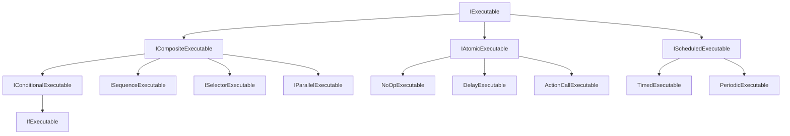

### 5.4 触发器执行流程

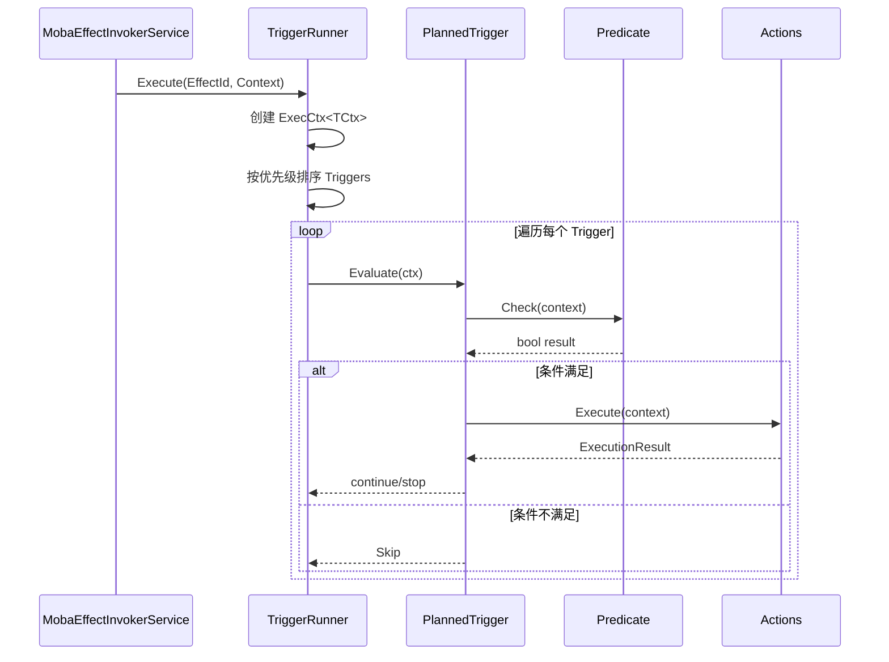

---

## 6. Modifiers 层详解

### 6.1 模块路径

```
com.abilitykit.modifiers/Runtime/Core/
├── Source/                        # 数值来源
│   ├── IValueSource.cs           # 数值来源接口
│   └── MagnitudeSource.cs        # 统一数值来源结构
├── Data/                         # 数据结构
│   ├── ModifierData.cs          # 修改器数据
│   └── ModifierResult.cs        # 计算结果
├── Engine/                       # 计算引擎
│   └── ModifierCalculator.cs   # 修饰器计算器
└── Enums/
    └── ModifierOp.cs            # 操作类型枚举
```

### 6.2 核心类型

| 类型 | 说明 |
|------|------|
| `ModifierCalculator` | 修饰器计算器，支持缓存、来源追踪 |
| `ModifierData` | 修改器数据单元（Key + Op + MagnitudeSource） |
| `MagnitudeSource` | 统一数值来源，支持多种来源类型 |
| `ModifierResult` | 计算结果（BaseValue + AddSum + PercentProduct + MulProduct） |

### 6.3 数值来源类型

| 来源类型 | 说明 |
|---------|------|
| `Fixed` | 恒定值 |
| `Scalable` | 等级曲线插值 |
| `Attribute` | 属性引用 |
| `TimeDecay` | 时间衰减 |
| `Pipeline` | 修饰器管道组合 |

### 6.4 操作类型

| 操作 | 优先级 | 计算公式 |
|------|--------|---------|
| `Override` | 0 | → 直接替换 |
| `Add` | 10 | → Base + Value |
| `PercentAdd` | 15 | → Base × (1 + Value) |
| `Mul` | 20 | → Base × Value |

### 6.5 计算公式

```
FinalValue = OverrideFlag ? OverrideValue
                          : (BaseValue + AddSum) × PercentProduct × MulProduct
```

### 6.6 数据流向

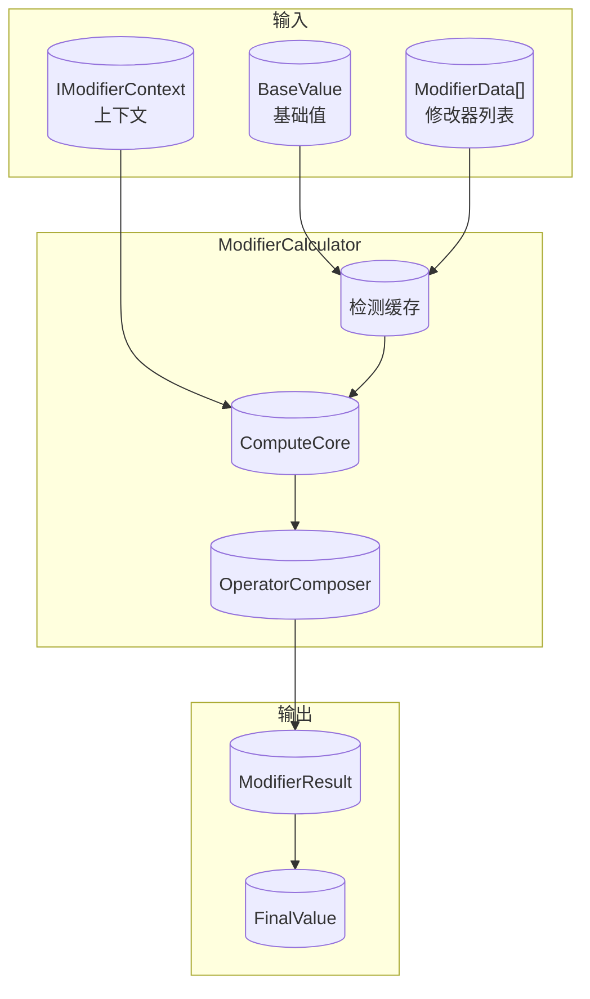

---

## 7. Attributes 层详解

### 7.1 模块路径

```
com.abilitykit.attributes/Runtime/Ability/Share/Common/AttributeSystem/
├── AttributeGroup.cs            # 属性组
├── AttributeContext.cs          # 属性上下文
├── AttributeInstance.cs         # 属性实例
├── AttributeEffect.cs           # 属性效果
└── ...
```

### 7.2 核心类型

| 类型 | 说明 |
|------|------|
| `AttributeGroup` | 属性组，管理一组属性实例 |
| `AttributeContext` | 属性上下文，提供属性访问接口 |
| `AttributeInstance` | 属性实例，存储基础值和计算器 |
| `AttributeEffect` | 属性效果，表示一次属性修改 |

### 7.3 层级关系

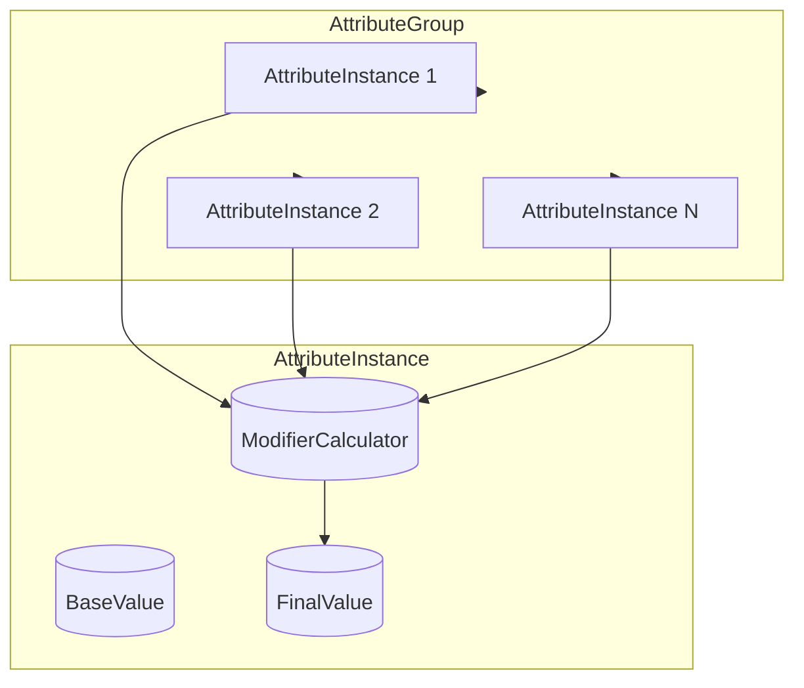

---

## 8. Buff 层详解

### 8.1 模块路径

```
com.abilitykit.demo.moba.runtime/Runtime/Impl/Moba/
├── Services/
│   └── Buffs/
│       ├── BuffContinuousRuntime.cs         # Buff continuous runtime
│       ├── BuffContinuousIntervalHandler.cs # Buff interval handler
│       ├── BuffStageEffectExecutor.cs       # Buff 阶段效果执行器
│       └── BuffEventArgs.cs
└── Systems/
    ├── Continuous/
    │   └── MobaContinuousTickSystem.cs      # continuous 统一 Tick 入口
    └── Buffs/
        ├── MobaBuffApplySystem.cs           # Buff 应用系统
        ├── MobaBuffTickSystem.cs            # Buff 生命周期清理
        └── MobaBuffRemoveSystem.cs          # Buff 移除系统
```

### 8.2 核心类型

| 类型 | 说明 |
|------|------|
| `MobaBuffApplySystem` | 处理 ApplyBuffRequest，应用 Buff 并创建 Buff continuous runtime |
| `MobaContinuousTickSystem` | 每帧驱动 `MobaContinuousManager`，统一推进持续行为 |
| `MobaBuffTickSystem` | 观察 Buff 标签中断与 continuous 结束状态，并执行 Buff 领域清理 |
| `MobaBuffRemoveSystem` | 处理 Buff 手动移除 |
| `MobaContinuousManager` | 统一 tick active continuous，只依赖 continuous 抽象接口，并按所有匹配 interval handler 分发周期触发 |
| `BuffContinuousRuntime` | Buff 对 `IContinuous` 的领域实现，承载 duration、stack、interval config，并自行同步 Buff runtime 状态 |
| `BuffContinuousIntervalHandler` | 承接 Buff interval 触发并调用 `BuffStageEffectExecutor` |
| `BuffStageEffectExecutor` | 执行 Buff 各阶段的效果，并构造正式 Buff trigger context；interval 阶段使用 BuffTick trace 语义 |

### 8.3 Buff 生命周期

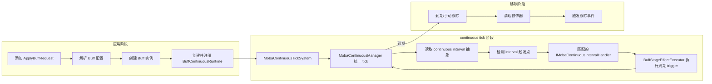

---

## 9. 数据流向总图

```mermaid
flowchart TB
    subgraph Layer0["入口层"]
        Player[("🎮 玩家输入")]
        AI[("🤖 AI 触发")]
        Passive[("⚡ 被动触发")]
    end

    subgraph Layer1["请求层"]
        SkillRequest[("SkillCastRequest"))]
        BuffRequest[("ApplyBuffRequest"))]
        PassiveTrigger[("OngoingTriggerPlans"))]
    end

    subgraph Layer2["Pipeline 层"]
        PipelineRunner[("SkillPipelineRunner"))]
        TimelinePhase[("SkillTimelinePhase"))]
    end

    subgraph Layer3["Effect 层"]
        EffectInvoker[("MobaEffectInvokerService"))]
        EffectId[("EffectId")]
        EffectContext[("EffectPipelineContext"))]
    end

    subgraph Layer4["Triggering 层"]
        TriggerRunner[("TriggerRunner"))]
        PlannedTrigger[("PlannedTrigger"))]
        Executable[("Executable 行为链"))]
    end

    subgraph Layer5["业务行为层"]
        AttrEffect[("AttributeEffect"))]
        BuffAction[("BuffAction"))]
        DamageAction[("DamageAction"))]
        HealAction[("HealAction"))]
    end

    subgraph Layer6["Modifiers 层"]
        ModCalculator[("ModifierCalculator"))]
        ModResult[("ModifierResult"))]
    end

    subgraph Layer7["Attributes 层"]
        AttrGroup[("AttributeGroup"))]
        AttrContext[("AttributeContext"))]
    end

    subgraph Layer8["Entity 层"]
        Entity[("ActorEntity"))]
    end

    Player --> SkillRequest
    AI --> SkillRequest
    Passive --> PassiveTrigger

    SkillRequest --> PipelineRunner
    BuffRequest -.-> PipelineRunner

    PipelineRunner --> TimelinePhase
    TimelinePhase --> EffectId

    EffectId --> EffectInvoker
    EffectInvoker --> EffectContext
    EffectContext --> TriggerRunner

    TriggerRunner --> PlannedTrigger
    PlannedTrigger --> Executable

    Executable --> AttrEffect
    Executable --> BuffAction
    Executable --> DamageAction
    Executable --> HealAction

    AttrEffect --> ModCalculator
    BuffAction --> ModCalculator

    ModCalculator --> ModResult
    ModResult --> AttrGroup

    AttrGroup --> AttrContext
    AttrContext --> Entity
    Entity --> BuffRequest
```

---

## 10. 时序图

### 10.1 技能施法时序图

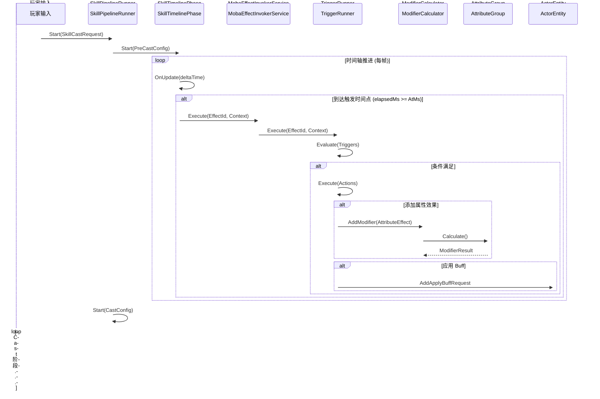

### 10.2 Buff 周期触发时序图

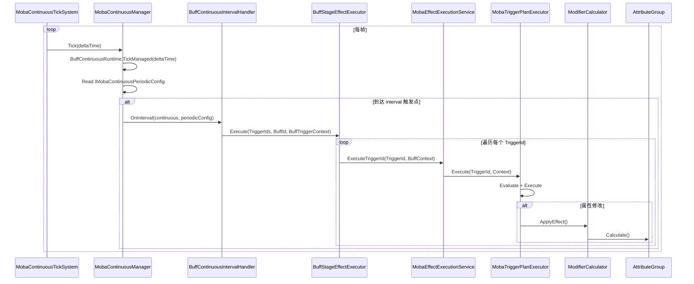

### 10.3 被动技能触发时序图

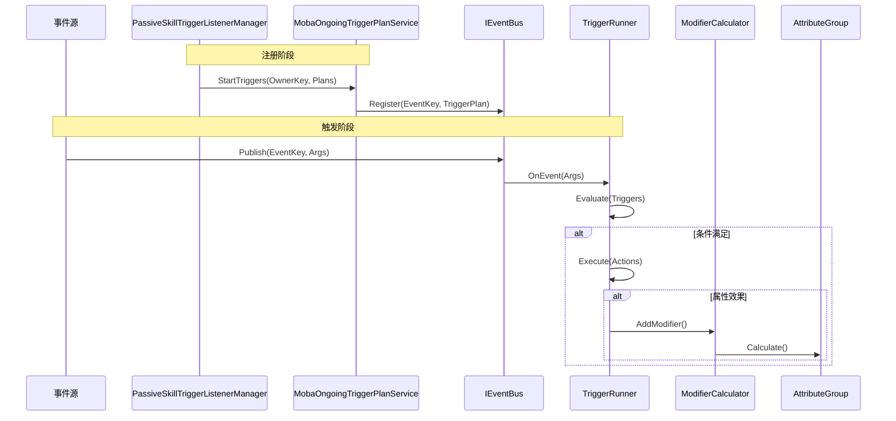

---

## 11. 关键类型速查

### 11.1 Pipeline 模块

| 类型 | 命名空间 | 说明 |
|------|---------|------|
| `SkillPipelineRunner` | Moba.Services.Skill | 技能管线运行器 |
| `SkillPipelineContext` | Moba.Services.Skill | 管线上下文 |
| `SkillTimelinePhase` | Moba.Services.Skill | 时间轴阶段 |
| `AbilityPipeline<TCtx>` | AbilityKit.Pipeline | 核心抽象管线 |
| `IAbilityPipelinePhase` | AbilityKit.Pipeline | 阶段接口 |

### 11.2 Triggering 模块

| 类型 | 命名空间 | 说明 |
|------|---------|------|
| `TriggerRunner<TCtx>` | AbilityKit.Triggering | 触发器运行器 |
| `PlannedTrigger<TArgs, TCtx>` | AbilityKit.Triggering | 计划触发器 |
| `IExecutable` | AbilityKit.Triggering | 行为接口 |
| `ExecutionResult` | AbilityKit.Triggering | 执行结果 |

### 11.3 Modifiers 模块

| 类型 | 命名空间 | 说明 |
|------|---------|------|
| `ModifierCalculator` | AbilityKit.Modifiers | 修饰器计算器 |
| `ModifierData` | AbilityKit.Modifiers | 修改器数据 |
| `MagnitudeSource` | AbilityKit.Modifiers | 数值来源 |
| `ModifierOp` | AbilityKit.Modifiers | 操作类型 |

### 11.4 Attributes 模块

| 类型 | 命名空间 | 说明 |
|------|---------|------|
| `AttributeGroup` | AbilityKit.Attributes | 属性组 |
| `AttributeContext` | AbilityKit.Attributes | 属性上下文 |
| `AttributeEffect` | AbilityKit.Attributes | 属性效果 |

### 11.5 Moba 业务模块

| 类型 | 命名空间 | 说明 |
|------|---------|------|
| `MobaAttrs` | Moba.Attributes | 属性访问包装器 |
| `MobaEffectInvokerService` | Moba.Services.Effect | 效果调用服务 |
| `MobaBuffApplySystem` | Moba.Systems.Buffs | Buff 应用系统 |
| `SkillCastRequest` | AbilityKit.Ability | 技能施法请求 |

---

## 附录 A：名词解释

| 术语 | 解释 |
|------|------|
| Pipeline | 管线/流水线，将复杂流程拆分为多个阶段按序执行 |
| Trigger | 触发器，响应事件并执行相应行为 |
| Modifier | 修改器，对数值进行加成/乘法等操作 |
| Attribute | 属性，角色/单位的数值属性（如攻击力、血量） |
| Buff | 增益效果，通常有时间限制 |
| Effect | 效果，技能的具体表现（伤害、治疗、加 Buff 等） |
| Executable | 可执行行为，Triggering 模块的核心执行单元 |
| Context | 上下文，贯穿整个流程的共享数据容器 |

---

## 附录 B：设计原则

1. **接口驱动** - 核心模块通过接口解耦，便于测试和替换实现
2. **数据驱动** - 技能配置、Buff 配置通过表/资产定义，减少硬编码
3. **分层清晰** - Pipeline 管流程、Triggering 管行为、Modifiers 管数值
4. **可扩展** - 支持自定义行为、自定义修饰器、自定义条件
5. **零 GC** - 核心结构使用值类型，减少堆分配

---

> 文档版本：1.0
> 最后更新：2026-04-09
