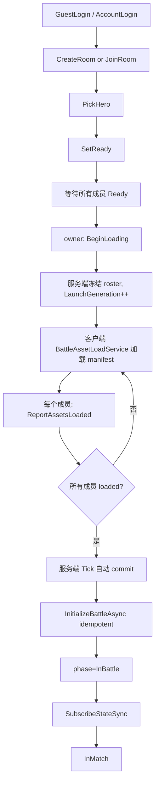

# MOBA Battle Integration Guide

## Purpose

This document defines the formal integration boundary for MOBA battle hosts. A runtime environment such as ET, Orleans, a local test host, or a future network gateway should not rebuild the battle lifecycle from scratch. It should provide only environment-specific adapters and use the shared host extension contracts for battle startup, input submission, and snapshot mapping.

## Package Responsibilities

`moba.runtime` owns battle execution after the game has started.

It is responsible for:

- creating runtime actors from a validated game-start spec
- accepting normalized `PlayerInputCommand` batches
- driving logic systems through the world tick
- emitting runtime `WorldStateSnapshot` values
- exposing the unified runtime port `IMobaBattleRuntimePort`

It should not own:

- room or matchmaking state
- ET or Orleans transport models
- remote call protocol details
- business decisions about local, remote, frame-sync, or state-sync modes

`host.extension` owns reusable host-side orchestration primitives.

It is responsible for:

- generic server BattleHost workflow modules under `Runtime/Server/BattleHost`
- room game-start specs and player loadouts
- `MobaBattleLaunchProfile` and launch spec construction
- conversion from launch spec to runtime start spec
- reusable snapshot mapper registry and snapshot mapping context
- Moba-specific host adapters under `Runtime/Moba`
- common integration contracts that do not depend on one runtime environment

It should not depend on ET, Orleans, or concrete presentation models.

ET owns client-side integration.

It is responsible for:

- converting ET battle start DTOs into `MobaPlayerLoadout` and `MobaBattleLaunchProfile`
- submitting local/client input through `IMobaBattleRuntimePort`
- converting runtime snapshots into ET view snapshots
- dispatching view snapshots to ET presentation handlers

Orleans owns server-side integration.

It is responsible for:

- keeping room/match membership, ready, hero pick, and battle-start RPC boundaries inside Orleans grains
- converting Orleans room DTOs into host.extension `MobaRoomState` and `MobaRoomGameStartSpec`
- converting room/server start specs into battle init parameters for `BattleLogicHostGrain`
- buffering remote input and submitting runtime commands
- driving the server battle world tick
- publishing state-sync and frame-sync data through Orleans contracts
- keeping server lifecycle and observer management inside grains or grain-owned services

## Formal Integration Surface

A new battle environment should implement only the following pieces:

1. Startup adapter

   Build `MobaPlayerLoadout[]` from the environment's room or match DTOs, then create a `MobaBattleLaunchProfile`. Use `MobaBattleLaunchSpecBuilder.FromLoadouts(...)` to produce the formal launch spec, then call `ToGameStartSpec()` for the runtime.

2. Runtime port access

   Resolve `IMobaBattleRuntimePort` from the battle world service container. All game start, input, snapshot, and read-model access should go through this port unless there is a clearly documented lower-level runtime reason.

3. Input adapter

   Convert environment input DTOs into `PlayerInputCommand`. Preserve the runtime protocol opCode and payload shape so local mode and remote network mode can reuse the same protocol definitions.

4. Snapshot adapter

   Register environment-specific snapshot mappers with `MobaRuntimeSnapshotMapperRegistry<TOutput>`. The mapper target type belongs to the environment, for example ET `FrameSnapshotData` or Orleans `ActorSnapshot` lists. The registry and context belong to host.extension.

5. Tick and lifecycle host

   Compose the reusable BattleHost modules from host.extension where possible. Generic host workflow belongs under `Runtime/Server/BattleHost`, including host state, lifecycle runner, structured lifecycle result codes, input buffering, tick-driving, observer registry, snapshot publish loop, and sync policy. The environment provides lifecycle delegates for world creation, runtime resolution, runtime start, snapshot provider resolution, initial snapshot push, timer scheduling, and cleanup. Battle execution itself stays inside `moba.runtime` and is accessed through `IMobaBattleRuntimePort`.

## Snapshot Mapping Rule

Runtime snapshots are protocol outputs, not direct presentation objects. Each environment should map them at its boundary.

Use `MobaRuntimeSnapshotContext` to carry frame and timestamp data. Use `WorldStateSnapshot.OpCode` as the dispatch key. Do not put ET view types, Orleans contract types, or runtime read-model fallback types into host.extension shared contracts.

Expected pattern:

```csharp
var context = new MobaRuntimeSnapshotContext(frame, timestamp);
if (registry.TryMap(in runtimeSnapshot, in context, out var output))
{
    Publish(output);
}
```

Environment-specific fallback is allowed. For example, Orleans can fall back from a missing transform snapshot to `LogicWorldEntityState` read-model data because that fallback belongs to the server output policy, not the shared host contract.

## Current Formal Paths

ET path:

- `ETBattleEnterGameSpecBuilder` builds launch specs through host.extension.
- `ProcessETInputPhase` submits normalized commands through `IMobaBattleRuntimePort`.
- `CollectSnapshotPhase` collects runtime snapshots and maps them through `ETBattleWorldSnapshotAdapter` and the shared snapshot registry.

Orleans path:

- `RoomGrain` owns room membership, ready state, hero selection, and the owner-only battle-start boundary.
- `RoomGrain` mirrors Orleans room members into host.extension `MobaRoomState` and uses `DefaultMobaRoomGameStartSpecBuilder` before starting a battle.
- `OrleansRoomBattleStartMapper` converts `MobaRoomGameStartSpec` into Orleans `BattleInitParams` without pushing Orleans DTOs into host.extension.
- `DefaultOrleansBattleProtocolMapper` builds runtime start specs through host.extension.
- `BattleLogicHostGrain` owns Orleans lifecycle and delegates protocol conversion to `IOrleansBattleProtocolMapper`.
- `DefaultOrleansBattleProtocolMapper` maps actor transform runtime snapshots through the shared snapshot registry and keeps server read-model fallback locally.

## Rules For Future Work

- Do not construct full `MobaBattleLaunchSpec` manually in ET or Orleans entry flows.
- Do not call internal runtime services directly from environment code when `IMobaBattleRuntimePort` covers the operation.
- Do not add snapshot opCode switch logic directly into grains or ET frame phases when it can live in a mapper.
- Do not make host.extension depend on ET, Orleans, or concrete view models.
- Keep protocol payloads reusable between local/direct mode and remote/network mode.
- Preserve both Orleans frame-sync and state-sync server options.

## BattleHost Extension Direction

Reusable battle-host workflow should be implemented in host.extension first, then composed by ET, Orleans, local test hosts, or future server projects. Generic workflow belongs under `Runtime/Server/BattleHost`, not under the Moba-specific directory. Orleans should remain an environment adapter and RPC boundary, not the owner of the reusable host framework.

The current generic host.extension BattleHost direction is:

- `BattleHostState` owns reusable host lifecycle state such as battle id, world id, frame, and tick rate.
- `BattleHostLifecycleResult` and `BattleHostLifecycleErrorCode` define a small structured result model for host startup, cleanup, and failure reporting.
- `BattleHostStartContext` carries environment-neutral startup data: world id, battle id, tick rate, and tick interval.
- `BattleHostLifecycleRunner` owns the formal start/stop sequence and rollback path through environment-provided delegates.
- `BattleInputBuffer<TInput>` owns frame-indexed input buffering without depending on Orleans DTOs or Moba protocol DTOs.
- `BattleTickDriver<TInput>` owns the generic drain-submit-tick-advance workflow through environment-provided delegates.
- `BattleObserverRegistry<TObserver>` owns observer registration and snapshot-safe enumeration.
- `BattleSnapshotSyncPolicy` owns common publish/full-snapshot policy decisions.
- `BattleSnapshotPublisher<TObserver, TSnapshot>` owns the generic snapshot creation and exception-isolated observer push loop.

Moba-specific host.extension modules should remain under `Runtime/Moba` only when they depend on Moba launch specs, player loadouts, room rules, or Moba snapshot mapping. The Orleans grain should remain the Orleans activation and RPC boundary. It should compose generic host.extension modules and provide Orleans-specific mapping, runtime submission, world ticking, observer push, timer scheduling, and lifecycle delegates.

## Server Room To Battle Direction

Server room flow should be formalized as `Room/Match -> MobaRoomState -> MobaRoomGameStartSpec -> BattleInitParams -> BattleHost`.

The current server-side rule is:

- Orleans `RoomGrain` owns account membership, ownership checks, room closure, and RPC-facing DTOs.
- host.extension `MobaRoomState` owns MOBA room readiness rules, hero/loadout selection state, team assignment, min/max player validation, and `CanStart`.
- host.extension `DefaultMobaRoomGameStartSpecBuilder` owns conversion from room state to `MobaRoomGameStartSpec`.
- Orleans mapping code owns conversion from `MobaRoomGameStartSpec` to Orleans `BattleInitParams`.
- `BattleLogicHostGrain` receives only battle init data and starts the single battle through the generic BattleHost lifecycle runner.

Future gameplay modes should add room/start-profile adapters around this flow instead of bypassing `MobaRoomState` or manually constructing runtime start specs inside grains or gateway handlers.

## Orleans Gateway Room Entry

Orleans Gateway exposes the room flow as transport entrypoints, not as a second room implementation. TCP gateway handlers deserialize shared MemoryPack wire DTOs from `AbilityKit.Protocol.Moba.Room`, validate the session token, map the request to Orleans room DTOs, call `IRoomGrain`, and return shared wire responses. HTTP endpoints are debug-friendly wrappers around the same grain calls and validate the session token before deriving the account id.

Room gateway opcodes are centralized in `RoomGatewayOpCodes`:

- `CreateRoom = 101`
- `JoinRoom = 102`
- `SetReady = 104`
- `PickHero = 105`
- `StartBattle = 106`

The expected remote client flow is login, create or join room, pick hero, set ready, owner starts battle, then subscribe to state sync or enter frame-sync flow using the returned battle id/world id. `GatewayRoomClient` should use `WireRoomGatewayBinary` for TCP payloads; it should not send JSON or deserialize Orleans DTOs. Gateway handlers should not rebuild room rules or battle launch specs; they should only validate the transport payload, resolve the current room/account context, map wire DTOs to Orleans DTOs, and delegate to `RoomGrain`.

`NumericRoomId` is derived by `RoomGatewayIds.CreateNumericRoomId(roomId)`. The same rule is used by Gateway room responses and Orleans room-to-battle mapping so the client room id, battle `WorldId`, and state/frame-sync routing remain consistent.

Orleans Gateway owns server-side listening, accepted sessions, connection ids, session registry, token validation, and dispatch into Orleans grains. It should not depend on GameFramework `INetworkChannel`, because that abstraction is a Unity/client outbound channel lifecycle model. Server-side TCP, KCP, WebSocket, or HTTP transports should keep their own listener/session adapters and publish requests through Gateway transport events.

Gateway transports should reuse the shared AbilityKit wire protocol instead of defining local frame/header types. The current TCP Gateway references `AbilityKit.Network.Runtime` and uses `AbilityKit.Network.Protocol.NetworkFrameCodec`, `NetworkPacketHeader`, and `NetworkPacketFlags` for length-prefixed frames, flags, opcode, sequence id, and payload length. Room payloads continue to use `AbilityKit.Protocol.Moba.RoomGatewayOpCodes` and MemoryPack DTOs, so Unity local/direct mode, GameFramework-backed TCP, fallback TCP, and Orleans remote Gateway mode share the same packet semantics.

## Unity Client Network Direction

Unity client networking should use a two-layer boundary:

- GameFramework owns Unity-side network channel lifecycle, channel naming, service type selection, heartbeat integration, and project-level network management.
- AbilityKit.Network owns AbilityKit protocol semantics: length-prefixed frames, `NetworkPacketHeader`, opcode, sequence id, request/response flags, server push flags, and `IConnection`.

The bridge package is `com.abilitykit.gameframework.network`. It adapts GameFramework `INetworkChannel` into AbilityKit `IConnection` through `GameFrameworkNetworkChannelConnection`, and uses `AbilityKitGatewayNetworkChannelHelper` to serialize and deserialize AbilityKit Gateway frames inside GameFramework's packet pipeline.

`moba.view` should not depend on GameFramework packet/header classes directly. `BattleSessionFeature` stores the room connection as `IConnection`; `GatewayRoomClient` continues to consume only `IConnection` and shared MemoryPack room DTOs. If no factory is supplied, the demo-compatible TCP `ConnectionManager` path remains available as a fallback. A project that uses GameFramework should create or resolve its `INetworkManager` at the Unity composition layer and pass a factory that returns `GameFrameworkGatewayConnectionFactory.Create(networkManager, channelName)`.

Unity battle features should resolve network channels through `IAbilityKitConnectionRegistry` using logical roles instead of transport-specific fields:

- `AbilityKitConnectionRole.GatewayReliable` is the reliable gateway/room/login connection. In the current demo it can be backed by GameFramework TCP or the fallback `ConnectionManager` TCP path.
- `AbilityKitConnectionRole.BattleRealtime` is reserved for future high-frequency battle traffic such as KCP input, frame, or state-sync data.
- `AbilityKitConnectionRole.BattleReliable` is reserved for reliable low-frequency battle RPCs when the battle flow needs a separate TCP channel.

This keeps the demo business flow reusable while allowing production Unity projects to standardize channel creation and lifetime around GameFramework. It also leaves room for TCP and KCP to coexist: the composition layer registers providers or concrete `IConnection` instances by role, and battle code asks for the role it needs without knowing whether the underlying transport is GameFramework TCP, fallback TCP, or a future KCP channel.

## 正式多人模式启动流程

正式多人模式启动流程用分阶段协议取代旧的直接 `StartBattle`：Lobby 准备、加载屏障、幂等 Battle commit 与状态推送。这确保所有成员在权威战斗世界创建前完成资源加载。

### 端到端流程



### 关键不变量

| 不变量 | 强制方式 |
|--------|----------|
| LaunchGeneration 单调 | 只增不减。携带不匹配 generation 的过期 `ReportAssetsLoaded` 被幂等忽略 |
| Loading 期间 roster 冻结 | `BeginLoading` 后不允许 Join/Leave 改变参战名单 |
| 单次 Battle commit | `CommitId`（`roomId:LaunchGeneration`）+ `InitSpecHash` 保证 `InitializeBattleAsync` 幂等；重复调用返回 `AlreadyInitialized` |
| Revision 单调推送 | `RoomStateChanged` 携带单调递增的 `Revision`；`ClientRoomStore` 拒绝旧 revision |
| EventSequence 缺口检测 | 客户端检测 `LastEventSequence` 缺口并触发 `GetSnapshot` 补拉 |
| 战斗前资源屏障 | `BattleAssetManifest` 屏障必须在 `ReportAssetsLoaded` 前完成；首帧不再代表资源加载完成 |
| owner 迁移稳定性 | 新 owner 由在线成员中 `JoinOrdinal` 最小者担任 |

### 已废弃入口

| 已废弃 | 替代方案 | 行为 |
|--------|----------|------|
| `StartBattle`（opCode 106） | `BeginLoading` + `ReportAssetsLoaded` | `StartRoomBattleHandler` 返回 `Conflict`，提示 "StartBattle is deprecated" |
| `FirstFrameReceived` 作为加载完成信号 | `BattleAssetManifest` 屏障 + `AssetsLoadCompleted` 信号 | 首帧不再驱动 `LoadingDone`；只有 manifest 屏障完成才允许 `ReportAssetsLoaded` |

### 测试矩阵参考

正式流程由阶段 8 测试套件验证：

| 测试套件 | 源码 | 覆盖范围 |
|----------|------|----------|
| 状态机单元测试 | `Server/Orleans/src/AbilityKit.Orleans.Grains.Tests/Rooms/RoomStateMachineTests.cs` | BeginLoading/ReportAssetsLoaded/CancelLoading/PrepareCommit/CommitBattleStarted/RollbackBattleCommit 转换 |
| 端到端流程测试 | `Server/Orleans/src/AbilityKit.Orleans.Grains.Tests/Rooms/RoomMultiplayerE2EFlowTests.cs` | 双玩家完整流程、超时回滚、owner 迁移 |
| 故障矩阵测试 | `Server/Orleans/src/AbilityKit.Orleans.Grains.Tests/Rooms/RoomFaultMatrixTests.cs` | 重复上报幂等、双重 BeginLoading、非法阶段、取消 generation |
| 协议兼容性 | `Server/Orleans/src/AbilityKit.Orleans.Gateway.Tests/RoomProtocolCompatibilityTests.cs` | opcode 稳定性、wire DTO 往返 |
| 加载 Handler 测试 | `Server/Orleans/src/AbilityKit.Orleans.Gateway.Tests/RoomLoadingHandlersTests.cs` | BeginLoading/ReportAssetsLoaded/CancelLoading/GetSnapshot handler 验证 |
| 客户端 Room 仓库测试 | `Unity/Packages/com.abilitykit.demo.moba.view.runtime/Runtime/Game/Test/UnitTest/ClientRoomStoreTests.cs` | revision 单调性、缺口检测、幂等应用 |
| 客户端加载测试 | `Unity/Packages/com.abilitykit.demo.moba.view.runtime/Runtime/Game/Test/UnitTest/GatewayRoomClientLoadingTests.cs` | GatewayRoomClient 分阶段 API |
| 资源加载测试 | `Unity/Packages/com.abilitykit.demo.moba.view.runtime/Runtime/Game/Test/UnitTest/BattleAssetLoadServiceTests.cs` | manifest 屏障语义 |

### 源码索引

| 组件 | 源码 |
|------|------|
| 房间状态机 | `Server/Orleans/src/AbilityKit.Orleans.Grains/Rooms/RoomStateMachine.cs` |
| 房间 Grain | `Server/Orleans/src/AbilityKit.Orleans.Grains/Rooms/RoomGrain.cs` |
| InitSpec 哈希 | `Server/Orleans/src/AbilityKit.Orleans.Grains/Rooms/RoomBattleInitSpecHasher.cs` |
| 状态推送构建器 | `Server/Orleans/src/AbilityKit.Orleans.Grains/Rooms/RoomStatePushBuilder.cs` |
| 房间模型 | `Server/Orleans/src/AbilityKit.Orleans.Contracts/Rooms/RoomModels.cs` |
| 加载模型 | `Server/Orleans/src/AbilityKit.Orleans.Contracts/Rooms/RoomLoadingModels.cs` |
| Gateway 房间客户端 | `Unity/Packages/com.abilitykit.demo.moba.view.runtime/Runtime/Game/Battle/Client/Gateway/GatewayRoomClient.cs` |
| 客户端 Room 仓库 | `Unity/Packages/com.abilitykit.demo.moba.view.runtime/Runtime/Game/Battle/Client/Gateway/Room/ClientRoomStore.cs` |
| 战斗资源清单 | `Unity/Packages/com.abilitykit.demo.moba.view.runtime/Runtime/Game/Battle/Shared/Assets/BattleAssetManifest.cs` |
| 战斗资源加载服务 | `Unity/Packages/com.abilitykit.demo.moba.view.runtime/Runtime/Game/Battle/Shared/Assets/BattleAssetLoadService.cs` |
| 多人房间流程控制器 | `Unity/Packages/com.abilitykit.demo.moba.view.runtime/Runtime/Game/App/Flow/Core/Multiplayer/MultiplayerRoomFlowController.cs` |
| 正式大厅 Feature | `Unity/Packages/com.abilitykit.demo.moba.view.runtime/Runtime/Game/App/Flow/Boot/FormalLobbyFeature.cs` |
