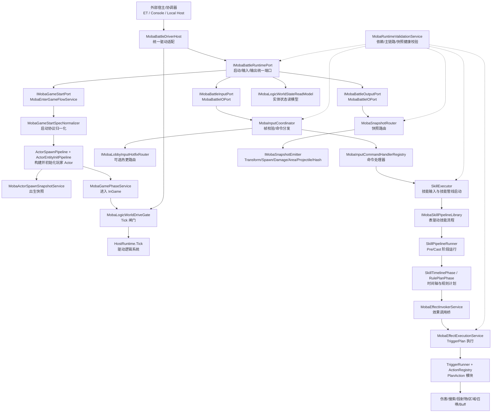
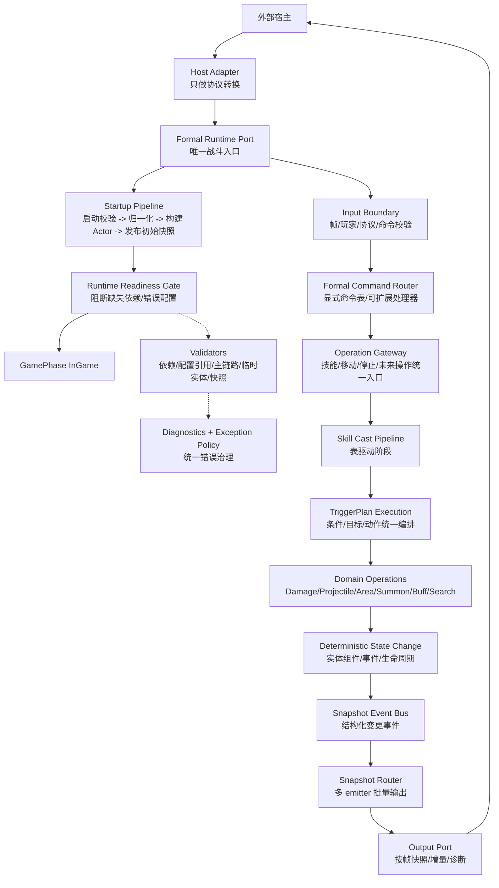

# MOBA 战斗逻辑层整改流程图与分析

本文面向 [`Unity/Packages/com.abilitykit.demo.moba.runtime/Runtime`](../Unity/Packages/com.abilitykit.demo.moba.runtime/Runtime)，先建立战斗逻辑层整改的全局参照，再决定后续代码清理顺序。分析范围聚焦主链路：构建逻辑世界、接受外部输入、执行技能/效果/临时实体操作、输出快照与诊断。

## 1. 当前主流程现状图

### 现状判断

现状已经形成了较好的主链路骨架：外部宿主通过 [`MobaBattleDriverHost`](../Unity/Packages/com.abilitykit.demo.moba.runtime/Runtime/Application/Session/MobaBattleDriverHost.cs:36) 进入，运行时由 [`IMobaBattleRuntimePort`](../Unity/Packages/com.abilitykit.demo.moba.runtime/Runtime/Application/Services/IO/IMobaBattleRuntimePort.cs:49) 汇总启动、输入、快照和读模型，输入通过 [`MobaBattleIOPort`](../Unity/Packages/com.abilitykit.demo.moba.runtime/Runtime/Application/Services/IO/MobaBattleIOPort.cs:15) 和 [`MobaInputCoordinator`](../Unity/Packages/com.abilitykit.demo.moba.runtime/Runtime/Application/Services/Input/MobaInputCoordinator.cs:23) 分发，技能执行收敛到 [`SkillExecutor`](../Unity/Packages/com.abilitykit.demo.moba.runtime/Runtime/Application/Services/Skill/Cast/SkillExecutor.cs:22)，效果执行收敛到 [`MobaEffectExecutionService`](../Unity/Packages/com.abilitykit.demo.moba.runtime/Runtime/Application/Services/Skill/Effects/MobaEffectExecutionService.cs:1)。这是合理方向。

但现状仍混有几类治理缺口：部分服务仍以 `Try`/失败结果承载配置或依赖错误；输入热更路由吞异常后继续走默认分发；技能执行中部分关键辅助能力失败后被静默降级；启动流程仍有默认玩法启动和无效玩家绑定跳过；输出快照对空参数、无发射器、无快照命中的语义还需要更明确地区分。

## 2. 目标整改主流程图

### 目标原则

1. 外部宿主只做适配，不能绕过 [`IMobaBattleRuntimePort`](../Unity/Packages/com.abilitykit.demo.moba.runtime/Runtime/Application/Services/IO/IMobaBattleRuntimePort.cs:49) 直接操作实体或内部服务。
2. 启动、输入、技能、效果、快照的依赖缺失必须在启动校验或调用处显式失败，不能用默认值继续执行。
3. “合法无结果”与“配置/依赖错误”必须分离。例如目标搜索没有目标可以返回无结果，缺少查询模板必须抛错。
4. 技能与效果以表驱动流程为正式路径，旧接口、旧阶段、旧默认行为在确认无正式价值后删除。
5. 快照输出要从“按需捞当前状态”逐步转向“结构化变更事件 + 按帧聚合输出”，便于网络同步、回放和调试。

## 3. 合理设计，应保留并强化

| 模块 | 当前设计 | 判断 | 后续动作 |
|---|---|---|---|
| 运行时统一入口 | [`IMobaBattleRuntimePort`](../Unity/Packages/com.abilitykit.demo.moba.runtime/Runtime/Application/Services/IO/IMobaBattleRuntimePort.cs:49) 聚合启动、输入、输出、读模型 | 合理。它把 host 与 battle runtime 解耦，是主链路治理的核心边界 | 保留，进一步收紧失败语义，避免内部端口缺失时只返回普通失败 |
| Host 驱动适配 | [`MobaBattleDriverHost`](../Unity/Packages/com.abilitykit.demo.moba.runtime/Runtime/Application/Session/MobaBattleDriverHost.cs:36) 只通过运行时端口提交输入和读取快照 | 合理。注释也明确禁止直接访问实体 | 保留，删除未使用的旧输入处理函数或改成正式 trace hook |
| 启动流程聚合 | [`MobaEnterGameFlowService`](../Unity/Packages/com.abilitykit.demo.moba.runtime/Runtime/Application/Services/EnterGame/MobaEnterGameFlowService.cs:66) 负责协议校验、Actor 构建、出生快照、阶段切换 | 方向合理，已经比散落式构建更可控 | 补启动计划对象与严格玩法配置策略 |
| 输入协调基类 | [`LogicWorldInputCoordinatorBase`](../Unity/Packages/com.abilitykit.demo.moba.runtime/Runtime/Application/Services/LogicWorld/Input/LogicWorldInputCoordinatorBase.cs:14) 抽出批次遍历、帧校验、分发顺序 | 合理。能复用到更多玩法输入 | 保留，增加命令处理结果分类与异常策略 |
| 技能表驱动流程 | [`IMobaSkillPipelineLibrary`](../Unity/Packages/com.abilitykit.demo.moba.runtime/Runtime/Application/Services/Skill/Pipeline/IMobaSkillPipelineLibrary.cs:9) 与 [`SkillPipelineRunner`](../Unity/Packages/com.abilitykit.demo.moba.runtime/Runtime/Application/Services/Skill/Pipeline/SkillPipelineRunner.cs:18) 将技能阶段配置化 | 合理，是替代旧条件/消耗/处理器的正式方向 | 保留，继续删除旧兼容阶段与静默降级 |
| 效果触发计划 | [`MobaEffectExecutionService`](../Unity/Packages/com.abilitykit.demo.moba.runtime/Runtime/Application/Services/Skill/Effects/MobaEffectExecutionService.cs:1) 统一走 TriggerPlan 与 ActionRegistry | 合理。前面已收紧缺少计划/模块时的失败语义 | 保留，补齐 PlanAction 的配置校验和溯源诊断 |
| 主链路健康校验 | [`MobaBattleMainFlowHealthValidator`](../Unity/Packages/com.abilitykit.demo.moba.runtime/Runtime/Application/Services/Validation/MobaBattleMainFlowHealthValidator.cs:6) 验证 runtime/input/execute/output | 合理。它可以成为整改后的启动闸门 | 保留并扩展到启动计划、命令路由、快照 emitter 必选集 |
| 快照路由 | [`MobaSnapshotRouter`](../Unity/Packages/com.abilitykit.demo.moba.runtime/Runtime/Application/Services/Snapshot/MobaSnapshotRouter.cs:13) 通过 emitter 收集多类快照 | 合理。比各模块各自暴露输出更可维护 | 保留，收紧空参数和 emitter 注册失败语义 |

## 4. 待优化设计，按优先级处理

### P0：会导致主流程不可控的治理项

1. 启动流程仍有默认玩法启动与可选依赖语义。  
   [`MobaEnterGameFlowService.StartGameplay`](../Unity/Packages/com.abilitykit.demo.moba.runtime/Runtime/Application/Services/EnterGame/MobaEnterGameFlowService.cs:258) 在玩法服务缺失时直接返回，在 `gameplayId <= 0` 时调用默认玩法。作为最佳实践工程，应明确：如果正式战斗需要玩法计划，缺失必须阻断；如果允许无玩法模式，应由启动规格显式声明。

2. 玩家绑定跳过无效 Actor。  
   [`MobaEnterGameFlowService.BindPlayerActors`](../Unity/Packages/com.abilitykit.demo.moba.runtime/Runtime/Application/Services/EnterGame/MobaEnterGameFlowService.cs:274) 遇到 `ActorId <= 0` 会跳过。主链路里玩家到 Actor 的映射是输入执行的前置条件，建议改成启动校验错误。

3. 输入热更路由异常被吞掉。  
   [`MobaInputCoordinator.TryHandleBeforeDispatch`](../Unity/Packages/com.abilitykit.demo.moba.runtime/Runtime/Application/Services/Input/MobaInputCoordinator.cs:53) 捕获异常后返回 `false`，会继续走默认命令分发。热更路由如果是正式扩展点，异常应进入统一异常策略并使当前命令失败，而不是尝试另一条路径。

4. 技能运行时创建与 trace 创建失败被静默忽略。  
   [`SkillExecutor.CastSkillInternal`](../Unity/Packages/com.abilitykit.demo.moba.runtime/Runtime/Application/Services/Skill/Cast/SkillExecutor.cs:236) 中 trace 创建失败会把上下文置为 `0`，运行时创建失败会清空 handle 后继续启动技能。若这些能力已被定义为正式链路能力，应由校验器要求存在，并在失败时阻断技能启动。

5. 技能目标默认回退为自己。  
   [`SkillExecutor.CastSkillInternal`](../Unity/Packages/com.abilitykit.demo.moba.runtime/Runtime/Application/Services/Skill/Cast/SkillExecutor.cs:236) 将缺省目标设为施法者。对于自施法技能这是合法配置，但不应作为所有技能的默认行为。目标来源应由技能配置或 TriggerPlan 的 target request 决定。

6. 快照批量收集参数错误返回空结果。  
   [`MobaBattleIOPort.CollectSnapshots`](../Unity/Packages/com.abilitykit.demo.moba.runtime/Runtime/Application/Services/IO/MobaBattleIOPort.cs:74) 和 [`MobaSnapshotRouter.CollectSnapshots`](../Unity/Packages/com.abilitykit.demo.moba.runtime/Runtime/Application/Services/Snapshot/MobaSnapshotRouter.cs:73) 对 `snapshots == null` 或 `maxSnapshots <= 0` 返回 `0`。这类调用错误应抛异常；真正没有快照才返回 `0`。

### P1：影响扩展性和铺量维护的治理项

1. 命令处理器注册还偏静态默认。  
   [`MobaInputCommandHandlerRegistry.CreateDefault`](../Unity/Packages/com.abilitykit.demo.moba.runtime/Runtime/Application/Services/Input/MobaInputCommandHandlerRegistry.cs:33) 如果继续手写注册，后续移动、技能、表情、交互、镜头、调试命令会膨胀。建议改成可声明的 handler module 或 attribute registry，并在启动校验时要求每个协议 opcode 都有明确处理策略。

2. 输入失败结果缺少结构化错误码穿透。  
   [`LogicWorldInputSubmitResult`](../Unity/Packages/com.abilitykit.demo.moba.runtime/Runtime/Application/Services/LogicWorld/Input/ILogicWorldInputCoordinator.cs:7) 只有 `Succeeded`、计数和消息，导致 [`MobaBattleIOPort.Submit`](../Unity/Packages/com.abilitykit.demo.moba.runtime/Runtime/Application/Services/IO/MobaBattleIOPort.cs:28) 只能归并成 `RejectedByInputCoordinator`。建议加入明确失败码：帧错误、玩家未绑定、命令协议错误、处理器异常、业务拒绝。

3. 启动规格缺少正式 BattleStartPlan。  
   [`MobaGameStartSpec`](../Unity/Packages/com.abilitykit.demo.moba.runtime/Runtime/Application/Services/EnterGame/MobaEnterGameFlowService.cs:84) 当前经过协议归一化后直接构建 Actor。大型项目更适合引入 `BattleStartPlan`：地图、随机种子、玩法规则、参与者、出生点、初始 Buff、快照初始集都先验证成不可变计划，再应用到世界。

4. 状态读模型仍直接遍历 ActorRegistry。  
   [`MobaBattleIOPort.GetAllEntityStates`](../Unity/Packages/com.abilitykit.demo.moba.runtime/Runtime/Application/Services/IO/MobaBattleIOPort.cs:89) 对诊断有用，但如果 host 依赖它做表现同步，会绕开正式快照事件。建议定位为 diagnostics read model，并与正式 snapshot output 分开命名和使用场景。

5. 快照 emitter 缺少必选清单与按玩法声明。  
   [`MobaSnapshotRouter.OnInit`](../Unity/Packages/com.abilitykit.demo.moba.runtime/Runtime/Application/Services/Snapshot/MobaSnapshotRouter.cs:42) 使用默认 registry 解析 emitter，只在没有 emitter 时报警。建议由战斗模式声明需要哪些 emitter，缺失必选 emitter 阻断启动。

6. Tick 闸门只看游戏阶段。  
   [`MobaLogicWorldDriveGate.CanDriveLogicWorld`](../Unity/Packages/com.abilitykit.demo.moba.runtime/Runtime/Application/Services/Core/MobaLogicWorldDriveGate.cs:14) 只判断 `InGame`。建议把 runtime readiness、暂停、结算、回放、预测/权威模式也纳入正式闸门策略。

### P2：结构整理与可维护性提升

1. [`MobaBattleDriverHost`](../Unity/Packages/com.abilitykit.demo.moba.runtime/Runtime/Application/Session/MobaBattleDriverHost.cs:261) 中的旧 `HandleSkillInput`、`HandleMoveInput`、`HandleStopInput` 已不参与正式提交路径，应删除或迁移为明确的 trace/debug hook。
2. [`MobaInputCoordinator.LogResolveDiagnostics`](../Unity/Packages/com.abilitykit.demo.moba.runtime/Runtime/Application/Services/Input/MobaInputCoordinator.cs:91) 是故障排查式代码，后续应下沉到统一诊断工具，避免每个服务各写一份依赖探测。
3. [`MobaRuntimeDependencyHealthValidator`](../Unity/Packages/com.abilitykit.demo.moba.runtime/Runtime/Application/Services/Validation/MobaRuntimeDependencyHealthValidator.cs:17) 现在是大清单式校验，建议拆成能力域 validator 并由主链路 validator 聚合关键能力。
4. [`LogicWorldEntityState`](../Unity/Packages/com.abilitykit.demo.moba.runtime/Runtime/Application/Services/IO/IMobaBattleOutputPort.cs:11) 同时承担诊断、host 读模型、fallback inspection，建议拆成 `BattleDiagnosticsEntityState` 与正式 snapshot DTO。

## 5. 缺失能力清单

| 缺失能力 | 影响 | 建议落地 |
|---|---|---|
| BattleStartPlan | 启动协议归一化、玩法规则、出生、初始状态仍混在服务流程中 | 新增不可变启动计划与 validator，启动服务只负责应用计划 |
| RuntimeReadinessGate | 现有 validator 已有报告，但调用链没有统一闸门对象表达“可启动/可输入/可 Tick/可输出” | 在运行时端口或 driver 绑定阶段接入 readiness gate |
| Command Contract Registry | opcode 到 handler 的合法性、权限、帧策略、payload schema 不够显式 | 建立命令契约注册表，输入端口先按契约校验，再交给 handler |
| OperationGateway | 技能、移动、停止、调试操作未来可能继续散落 | 在输入分发后增加统一操作网关，承接技能/移动/交互等正式能力 |
| Snapshot Contract | 哪些事件必须输出、哪些是诊断、哪些是表现层可选，还没有显式契约 | 为玩法模式声明 snapshot emitter 必选集与 opCode 契约 |
| Exception Policy 覆盖 | 部分服务仍局部 catch 后继续执行 | 将异常策略应用到输入、技能 runtime 创建、trace、snapshot emitter 等扩展点 |
| Config Reference Validator 全覆盖 | 技能、TriggerPlan、搜索、召唤、投射物、区域、快照 emitter 引用还需要全链路校验 | 扩展配置引用校验器，启动前发现缺表、缺 plan、缺模板、缺 action |
| Trace Lineage 强约束 | trace 缺失时部分执行仍能继续 | 决定 trace 是否为必选能力；如果必选，缺失阻断；如果可选，必须显式标记为 diagnostics-only |

## 6. 推荐整改顺序

### 第一轮：主链路失败语义收紧

1. 收紧 [`MobaEnterGameFlowService.StartGameplay`](../Unity/Packages/com.abilitykit.demo.moba.runtime/Runtime/Application/Services/EnterGame/MobaEnterGameFlowService.cs:258)：去掉默认玩法静默启动，要求 `gameplayId` 或启动规格明确声明模式。
2. 收紧 [`MobaEnterGameFlowService.BindPlayerActors`](../Unity/Packages/com.abilitykit.demo.moba.runtime/Runtime/Application/Services/EnterGame/MobaEnterGameFlowService.cs:274)：无效玩家 Actor 映射直接失败。
3. 收紧 [`MobaInputCoordinator.TryHandleBeforeDispatch`](../Unity/Packages/com.abilitykit.demo.moba.runtime/Runtime/Application/Services/Input/MobaInputCoordinator.cs:53)：热更路由异常不再回落默认处理。
4. 收紧 [`SkillExecutor.CastSkillInternal`](../Unity/Packages/com.abilitykit.demo.moba.runtime/Runtime/Application/Services/Skill/Cast/SkillExecutor.cs:236)：运行时创建失败、必选 trace 能力缺失、非法目标默认值不再静默继续。
5. 收紧 [`MobaSnapshotRouter.CollectSnapshots`](../Unity/Packages/com.abilitykit.demo.moba.runtime/Runtime/Application/Services/Snapshot/MobaSnapshotRouter.cs:73) 与 [`MobaBattleIOPort.CollectSnapshots`](../Unity/Packages/com.abilitykit.demo.moba.runtime/Runtime/Application/Services/IO/MobaBattleIOPort.cs:74)：调用参数错误抛异常。

### 第二轮：正式契约补齐

1. 新增 BattleStartPlan 与启动计划 validator。
2. 新增 Command Contract Registry，替代隐式 handler 默认注册。
3. 扩展 [`MobaBattleMainFlowHealthValidator`](../Unity/Packages/com.abilitykit.demo.moba.runtime/Runtime/Application/Services/Validation/MobaBattleMainFlowHealthValidator.cs:6)，将启动计划、命令契约、快照必选 emitter 纳入主链路必选项。
4. 将 [`MobaLogicWorldDriveGate`](../Unity/Packages/com.abilitykit.demo.moba.runtime/Runtime/Application/Services/Core/MobaLogicWorldDriveGate.cs:10) 扩展为状态机驱动闸门，而不是只看 `InGame`。

### 第三轮：结构拆分与工具化

1. 拆分 [`MobaRuntimeDependencyHealthValidator`](../Unity/Packages/com.abilitykit.demo.moba.runtime/Runtime/Application/Services/Validation/MobaRuntimeDependencyHealthValidator.cs:17) 为配置、输入、执行、输出、临时实体等能力域 validator。
2. 抽出统一依赖诊断工具，替代 [`MobaInputCoordinator.LogResolveDiagnostics`](../Unity/Packages/com.abilitykit.demo.moba.runtime/Runtime/Application/Services/Input/MobaInputCoordinator.cs:91) 这类局部诊断代码。
3. 明确读模型与快照模型边界，避免 [`LogicWorldEntityState`](../Unity/Packages/com.abilitykit.demo.moba.runtime/Runtime/Application/Services/IO/IMobaBattleOutputPort.cs:11) 成为表现同步的隐式替代路线。
4. 清理不再参与正式路径的旧函数、旧接口、旧兼容字段。

## 7. 总结

当前战斗逻辑层已经有可保留的正式骨架：统一运行时端口、输入协调基类、表驱动技能管线、TriggerPlan 效果执行、快照路由、主链路健康校验。这些设计方向是合理的。

下一阶段重点不应再零散找旧代码，而是围绕主流程建立硬边界：启动必须有计划，输入必须有契约，技能/效果必须有完整 runtime 与配置引用，快照必须有输出契约，异常必须通过统一策略治理。这样后续铺量新增技能、效果、临时实体、玩法规则时，不会因为隐藏默认值和局部兜底导致主流程失控。
