# MOBA 战斗上下文当前设计文档

本文档描述当前 `com.abilitykit.demo.moba.runtime` 战斗逻辑层在完成上下文归一化、factory 拆分、plan executor 拆分以及旧兼容回流移除后的实际设计。重点用于验证：输入、技能释放、效果执行、上下文生成、trace 跟踪、skill runtime 生命周期、plan action 分支是否符合预期。

## 1. 设计目标

当前设计优先解决一个核心问题：战斗链路中上下文来源过多，导致 plan action、condition、damage、buff、projectile 各自从 payload、origin、snapshot、trace scope、runtime handle、dictionary 中重复推导同一批信息。

第一阶段的目标不是一步到位重构所有上下文模型，而是建立一个统一入口：`MobaCombatExecutionContext`。第二阶段已把构建和 snapshot 合并逻辑外移到 `MobaCombatExecutionContextFactory`。当前阶段进一步移除了统一 context 反向适配旧 provider/data bag 的路径，避免在框架设计阶段固化历史兼容层。

它在当前版本中的定位是：

- 作为 effect/trigger 执行期间的统一 typed execution fact。
- 聚合 payload、lineage、origin、execution snapshot、skill runtime handle、frame。
- 不把 stack count、elapsed、remaining、duration 这类阶段/领域快照提升为基础执行事实；需要时从 `MobaTriggerStageSnapshot`、condition view 或 typed payload/provider 读取。
- 不再持有或代理 `IMobaTriggerDataContext`，避免统一 context 退回 dictionary 式共享数据容器。
- 给新的 plan action resolver 提供稳定读取点，减少 action 内部重复修补逻辑。

当前版本仍应视为过渡期聚合层，但 factory 职责已经从 `MobaCombatExecutionContext` 中剥离，旧 provider/data bag 只允许作为 typed payload 边界输入，action origin 构造已收敛到 `MobaActionOriginBuilder`。action execution context 的正式来源已经收紧为 effect execution session 或显式 payload provider，fallback create 只作为带 warning 的过渡兜底。

## 2. 核心对象关系

```mermaid
classDiagram
    class MobaCombatExecutionContext {
        +object Payload
        +MobaEffectLineageInput LineageInput
        +MobaGameplayOrigin Origin
        +MobaTriggerExecutionSnapshot ExecutionSnapshot
        +MobaSkillCastRuntimeHandle SkillRuntimeHandle
        +int Frame
        +TryGetOrigin(out origin)
        +TryGetLineageContext(out lineageContext)
        +TryGetExecutionSnapshot(out snapshot)
    }

    class MobaCombatExecutionContextFactory {
        +Create(payload, lineage, snapshot, frame)
        +WithSnapshot(context, snapshot, frame)
    }

    class MobaEffectLineageInput {
        +EffectContextKind ContextKind
        +MobaTraceKind OriginKind
        +int SourceActorId
        +int TargetActorId
        +long ParentContextId
        +long EffectiveRootContextId
        +long OwnerKey
        +int OriginConfigId
    }

    class MobaGameplayOrigin {
        +int SourceActorId
        +int TargetActorId
        +MobaTraceKind ImmediateKind
        +int ImmediateConfigId
        +long ImmediateContextId
        +long ParentContextId
        +long RootContextId
        +long OwnerContextId
        +MobaSkillCastRuntimeHandle SkillRuntimeHandle
    }

    class MobaTriggerExecutionSnapshot {
        +EffectContextKind Kind
        +int SourceActorId
        +int TargetActorId
        +long SourceContextId
        +long RootContextId
        +long OwnerContextId
        +int TriggerId
        +int ConfigId
        +int Frame
        +MobaSkillCastRuntimeHandle SkillRuntimeHandle
    }

    class MobaTriggerStageSnapshot {
        +int StackCount
        +float ElapsedSeconds
        +float RemainingSeconds
        +float DurationSeconds
    }

    class MobaTriggerConditionContext {
        +object Payload
        +LineageInput
        +Origin
        +ExecutionSnapshot
        +StageSnapshot
        +SkillRuntimeHandle
        +ToExecutionRequest(triggerId)
        +TryGetBlackboard(out blackboard)
    }

    MobaCombatExecutionContextFactory --> MobaCombatExecutionContext : builds
    MobaCombatExecutionContext --> MobaEffectLineageInput
    MobaCombatExecutionContext --> MobaGameplayOrigin
    MobaCombatExecutionContext --> MobaTriggerExecutionSnapshot
    MobaTriggerConditionContext --> MobaCombatExecutionContext : Create(in context)
    MobaTriggerConditionContext --> MobaTriggerStageSnapshot
    MobaTriggerConditionContext --> IMobaTriggerStageSnapshotProvider : resolves stage facts from payload
    MobaTriggerConditionContext --> IMobaTriggerDataContext : reads original payload data only
```

## 3. 总流程

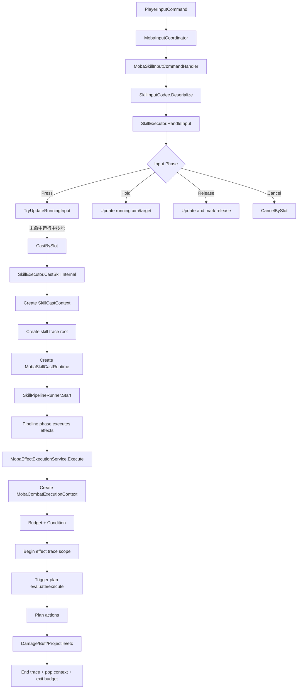

## 4. 输入到技能释放

### 4.1 输入协调

`MobaInputCoordinator` 继承逻辑世界输入协调基类。每帧收到 `PlayerInputCommand` 后，它会：

1. 创建 `MobaInputCommandContext`，注入 phase、player actor map、entity manager、skill executor、service resolver。
2. 先交给可选热更路由 `IMobaLobbyInputHotfixRouter`。
3. 如果热更路由未处理，则通过 `MobaInputCommandHandlerRegistry` 分发到具体 handler。

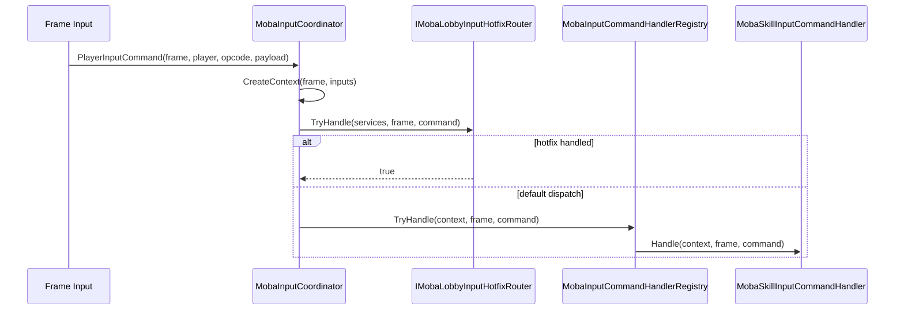

### 4.2 技能输入 handler

`MobaSkillInputCommandHandler` 只做轻量校验和反序列化：

- 检查当前是否在战斗中。
- 通过 player 找 actorId。
- 检查 actor entity 和 transform。
- 反序列化 `SkillInputEvent`。
- 调用 `SkillExecutor.HandleInput(actorId, in evt)`。

### 4.3 SkillExecutor 输入相位

`SkillExecutor.HandleInput` 根据 `SkillInputPhase` 分支：

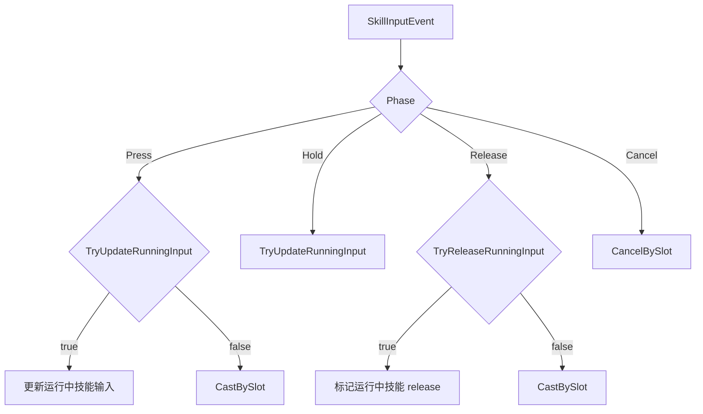

这里的含义是：

- Press 可以启动新技能，也可以被已有 running skill 消费。
- Hold 只更新当前技能输入。
- Release 优先释放 running skill，未命中时退化为释放一次技能。
- Cancel 取消槽位对应运行中技能。

## 5. 技能实例、trace root、skill runtime

`SkillExecutor.CastSkillInternal` 是技能实例创建入口。它完成：

1. 校验 caster 和 skill 配置。
2. 从 actor transform 推导默认 aim position/aim direction。
3. 创建 `SkillCastRequest`。
4. 创建 `SkillCastContext`。
5. 为当前技能创建 trace root。
6. 创建 `MobaSkillCastRuntime` 并把 handle 写回 `SkillCastContext`。
7. 启动 `SkillPipelineRunner`。

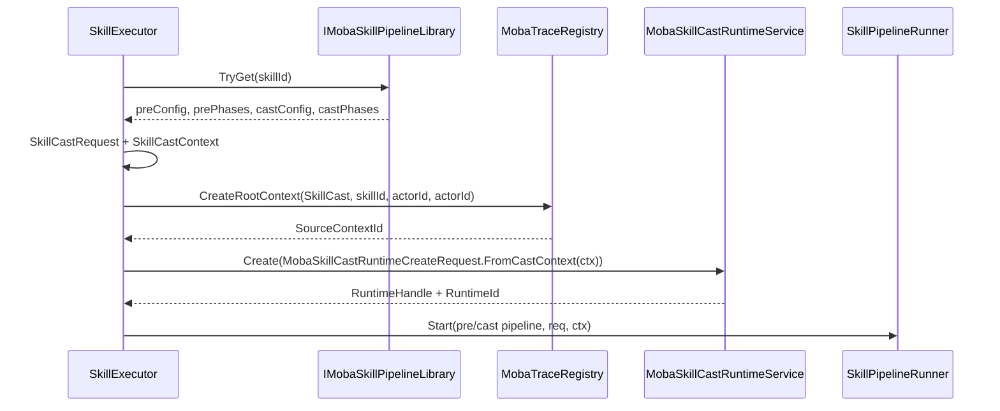

### 5.1 Skill runtime 职责

`MobaSkillCastRuntimeService` 管理一个技能释放聚合生命周期：

- runtimeId/generation 组成稳定 handle。
- skill pipeline 结束后不一定立刻销毁。
- Buff、Projectile、Area、Summon 等子对象可以 retain runtime。
- 子对象结束时 release runtime。
- 当 pipeline 已结束且所有 child retain 释放后，runtime 才 finalize。
- runtime blackboard 记录命中目标、命中次数、loop guard 等跨 action/trigger 状态。

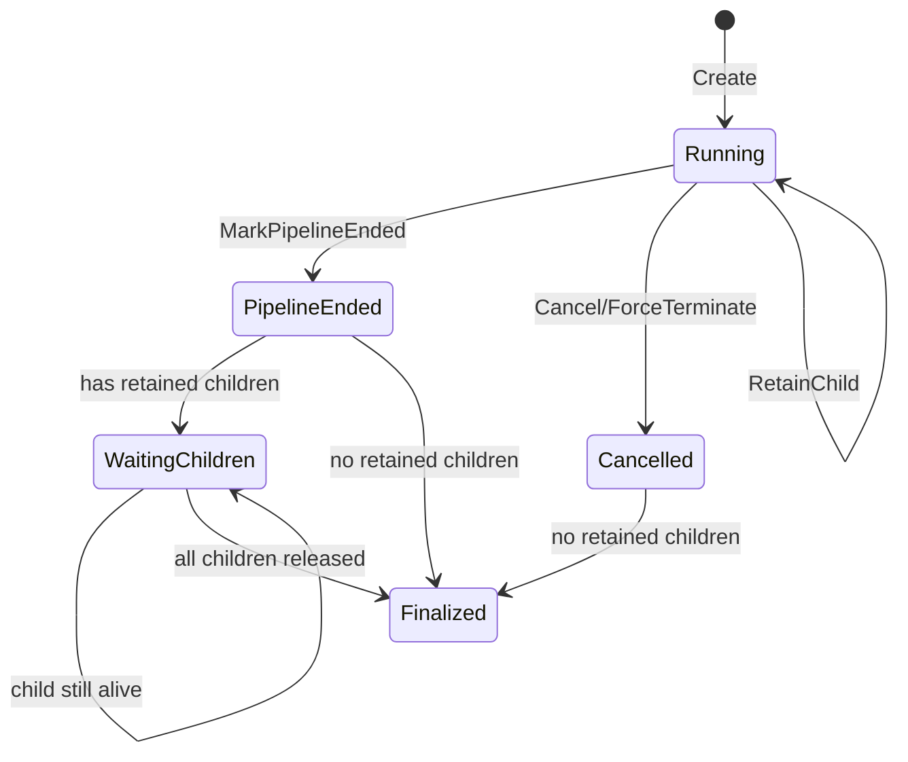

## 6. Effect 执行入口

`MobaEffectExecutionService` 有两个主要入口：

- `Execute(effectId, IAbilityPipelineContext context)`：技能 pipeline 内部 effect 执行。
- `ExecuteTriggerId(triggerId, object payload)`：投射物命中、区域进入、Buff interval 等直接触发执行。

两个入口现在都会先创建 `MobaCombatExecutionContext`，再进入预算、condition、trace、plan action。plan 查询、`ExecCtx<IWorldResolver>` 创建、`PlannedTrigger` evaluate/execute 和缺失 action 修复重试已经拆入 `MobaTriggerPlanExecutor`，`MobaEffectExecutionService` 只保留执行编排和 trace/session 生命周期。plan action 侧不负责创建正式 execution context，只从当前 session 或 typed payload provider 读取；遗留 fallback create 会记录 warning，用于定位绕过正式执行链路的入口。

Buff interval 现在不是独立临时 periodic service，也不再由 Buff 系统直接驱动。Buff 应用时创建 `BuffContinuousRuntime` 并注册到 `IContinuousManager`；每帧由 `MobaContinuousTickSystem` 驱动 `MobaContinuousManager`，manager 统一 tick active continuous，并只通过 `IMobaTickableContinuous`、`IMobaContinuousIntervalState`、`IMobaContinuousRuntimeStateSync`、`IMobaContinuousPeriodicConfig`、`IMobaContinuousIntervalHandler` 这些抽象扩展点推进状态与分发 interval，不直接识别 Buff 业务类型。到达 interval 时通过所有匹配的 interval handler 分发到领域侧，Buff 领域由 `BuffContinuousIntervalHandler` 承接，再走 `BuffStageEffectExecutor.Execute`，payload 继续携带 Buff stage snapshot、origin、lineage、trace、skill runtime 和 live view provider，然后通过 `ExecuteTriggerId` 回到正式触发上下文链路。Buff interval 阶段的 trace kind 映射为 `BuffTick`，不再复用 apply 语义。

```mermaid
flowchart TD
    A1[Execute(effectId, pipeline context)] --> B1[EffectContextWrapper.Wrap]
    A2[ExecuteTriggerId(triggerId, payload)] --> B2[payload]
    B1 --> C[CreateCombatExecutionContext]
    B2 --> C
    C --> D[MobaEffectLineageInputResolver.Resolve]
    D --> E[MobaTriggerExecutionSnapshotBuilder]
    E --> F[MobaCombatExecutionContextFactory.Create]
    F --> G[CreateConditionContext]
    G --> H[MobaTriggerExecutionBudget.TryEnter]
    H -->|blocked| I[Log warning and return]
    H -->|entered| J[Push execution context]
    J --> K[BeginEffectTraceScope]
    K --> L[CreateActionChildNodes]
    L --> M[EvaluateTriggerConditions]
    M -->|failed| N[End trace failed]
    M -->|passed| O[MobaTriggerPlanExecutor.Execute]
    O --> O1[Create ExecCtx + PlannedTrigger]
    O1 --> O2[Evaluate and Execute plan]
    O2 --> P[End trace completed/failed]
    P --> Q[Pop execution context]
    Q --> R[Budget.Exit]
```

## 7. 上下文归一化细节

### 7.1 CreateCombatExecutionContext

当前归一化过程如下：

```mermaid
flowchart TD
    A[payload] --> B[MobaEffectLineageInputResolver.Resolve]
    B --> C[lineageInput]
    C --> D[MobaTriggerExecutionSnapshotBuilder.Create]
    A --> E[FromPayload]
    C --> F[FromLineage]
    D --> F
    F --> E
    E --> G[WithTrigger]
    G --> H[WithFrameIfMissing]
    H --> I[Build snapshot]
    I --> J[MobaCombatExecutionContextFactory.Create]
    J --> K{payload already has context?}
    K -->|yes| L[Factory.WithSnapshot(existing)]
    K -->|no| M[TryResolveOrigin]
    M --> N[merge snapshot/runtime]
    N --> O[return normalized typed context]
```

优先级逻辑：

- lineage 负责回答“这次触发从哪里来”。
- snapshot 负责回答“这次执行状态是什么”。
- origin 负责回答“当前 gameplay 行为的直接来源是什么”。
- skill runtime handle 可能来自 origin、snapshot、payload 边界数据。
- data context 不进入 `MobaCombatExecutionContext`；只有原始 payload 自身实现 `IMobaTriggerDataContext` 时，condition 才按边界数据读取。

### 7.2 Condition context

`MobaTriggerConditionContext` 是 condition 和执行预算使用的只读视图。它从 `MobaCombatExecutionContext` 派生，并额外提供：

- `ToExecutionRequest(triggerId)` 给预算系统使用。
- `TryGetBlackboard` 给命中去重、循环保护等 condition 使用。
- `TryGetData` 只读取原始 payload 暴露的边界 data bag，不从统一 context 反向代理。

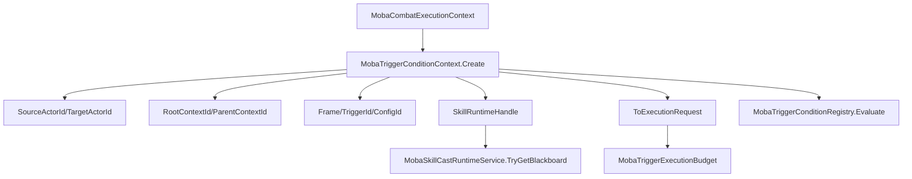

### 7.3 执行会话、Plan executor、Trace scope 与执行上下文栈

`MobaEffectExecutionService` 维护两组栈，并通过一次执行会话统一 enter/exit；plan 运行细节交给 `MobaTriggerPlanExecutor`：

- `_executionContexts`：当前嵌套 effect/trigger 的归一化执行上下文。
- `_traceScopes`：当前嵌套 effect 的 trace scope。
- `MobaEffectExecutionSession`：负责一次执行的 trace 完成、异常失败收尾、context pop、budget exit。
- `MobaTriggerPlanExecutor`：负责按 triggerId 查询 plan，创建 `ExecCtx<IWorldResolver>`，执行 `PlannedTrigger` 的 evaluate/execute，并在 action 注册缺失时触发一次修复重试。

它们的关系是：

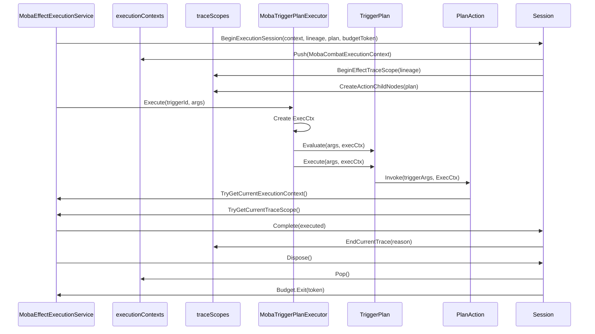

这样 action 不需要从 payload 里重复猜上下文，可以先通过 `MobaPlanActionInputResolver` 得到 action 输入视图，再由 `MobaActionOriginBuilder` 统一生成 action origin。执行会话保证即使 plan action 抛异常，也会用失败原因关闭 trace，并释放 budget 深度。plan executor 则把触发器运行时依赖检查、`ExecutionControl`、`ExecCtx`、缺失 action 修复重试从 effect service 中隔离出去。

## 8. Plan action 分支

当前已迁移的典型 action：

- `GiveDamagePlanActionModule`
- `AddBuffPlanActionModule`
- `ShootProjectilePlanActionModule`
- `PlayPresentationPlanActionModule`
- `SpawnSummonPlanActionModule`
- `ConsumeResourcePlanActionModule`

它们共享 `MobaPlanActionInputResolver` 读取 caster/target/aim/context/scope。需要生成 gameplay origin 的 action 再共享 `MobaActionOriginBuilder.Build`，展示、召唤、资源消耗等 action 则直接消费 typed action input。`MobaPlanActionExecutionContextResolver` 只负责读取当前执行上下文和 trace scope。

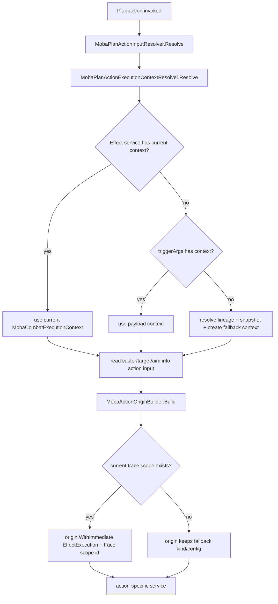

### 8.1 Damage action

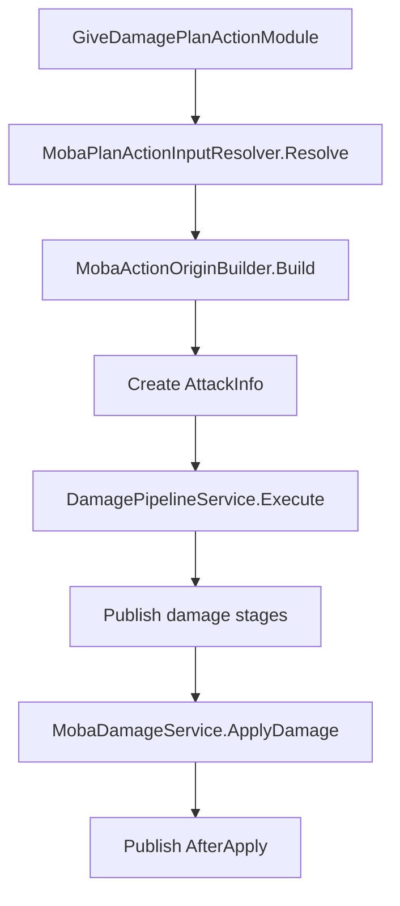

Damage pipeline 当前事件顺序：

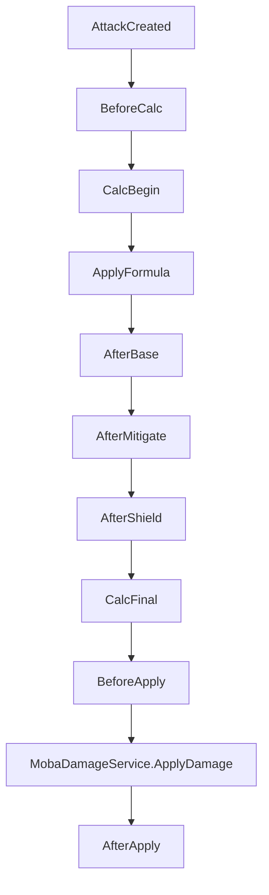

### 8.2 Add buff action

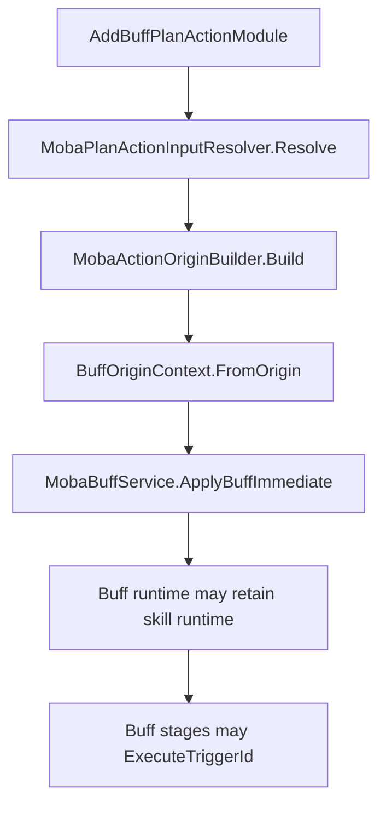

Buff 触发后再次进入 `MobaEffectExecutionService.ExecuteTriggerId`，payload 会携带 origin/lineage/runtime 信息，形成嵌套 trigger 链。

Buff interval 触发已经接入正式 continuous 路径：`BuffContinuousRuntime.Config` 暴露 `IMobaContinuousPeriodicConfig`，`MobaContinuousManager` 只负责按 continuous 抽象统一 tick duration 与 interval，并通过 `IMobaContinuousRuntimeStateSync` 让具体 continuous 自行同步领域 runtime 状态。`BuffContinuousIntervalHandler` 只承接 Buff 领域的 interval 分发并调用 `BuffStageEffectExecutor`；同一个 continuous 可以被多个匹配 handler 观察或处理，manager 不再以第一个 handler 命中后立即结束分发。`MobaBuffTickSystem` 不再推进 continuous，只观察 Buff 标签中断与 continuous 结束状态并执行领域清理。旧的 `MobaPeriodicEffectService`、独立 periodic component/runtime/system 已删除，不再作为 Buff 周期效果的调度入口。

Buff 阶段触发同时保留两类读取语义：触发当帧的层数、剩余时间、总时长进入 `MobaTriggerStageSnapshot`，用于 condition 和 action 获得稳定快照；如果 Buff 仍处于激活状态，payload 还会通过 `IBuffLiveViewProvider` 暴露 `BuffRuntimeView`，action resolver 可显式读取实时层数、实时剩余时间和 interval 剩余时间。两者不能混用：快照回答“触发时是什么”，live view 回答“现在还活着时是什么”。

### 8.3 Shoot projectile action

```mermaid
flowchart TD
    A[ShootProjectilePlanActionModule] --> B[MobaPlanActionInputResolver.Resolve]
    B --> C[MobaActionOriginBuilder.Build]
    C --> D[ProjectileSourceContextBuilder]
    D --> E[MobaProjectileService.Launch]
    E --> F[Projectile runtime may retain skill runtime]
    F --> G[Hit sync handler]
    G --> H[ExecuteTriggerId(hit trigger, ProjectileHitArgs)]
```

Projectile 命中后通常走直接 trigger 入口，继续携带 projectile source context 中的 root/owner/origin。

## 9. 后续扩展接入流程

新增触发事件、行为 action 或新的上下文来源时，核心原则是：先定义 typed payload 和 lineage/origin 语义，再让 effect execution session 统一生成 `MobaCombatExecutionContext`，最后让 action 通过 `MobaPlanActionInputResolver` 消费输入。不要让新 action 直接从 dictionary、旧 provider 或零散 payload 字段中修补上下文。

### 9.1 新增触发事件

新增触发事件通常来自 Buff、Projectile、Area、Summon、Unit State 等运行时模块。推荐接入步骤如下：

1. 定义触发 payload 类型，例如 `XxxTriggerArgs` 或 `XxxEventArgs`。
2. payload 至少实现 `IMobaActorContextProvider`，明确 source/target actor。
3. 如果事件来自已有技能、Buff、Projectile、Summon 或 Area，payload 应继续携带 origin/lineage/runtime 信息，并实现对应的 context provider。
4. 触发点只调用 `MobaEffectExecutionService.ExecuteTriggerId(triggerId, payload)`，不要在触发点手动创建 trace、手动执行 plan 或手动构建 action context。
5. 在 `MobaEffectLineageInputResolver`、`MobaTriggerExecutionSnapshotBuilder` 与 `IMobaTriggerStageSnapshotProvider` 可识别的 provider 边界内补充新 payload 的信息来源；执行事实和阶段事实不要混放。Buff 这类仍可能存活的领域对象，如果后续 action 需要读取实时状态，应额外实现领域 live view provider，例如 `IBuffLiveViewProvider`。
6. 用配置或订阅关系把事件映射到 triggerId，实际 plan 查询仍交给 `MobaTriggerPlanExecutor`。

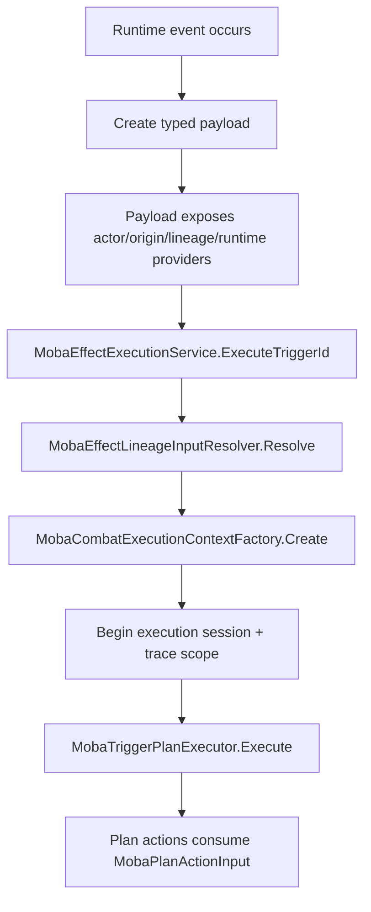

### 9.2 新增 payload 上下文来源

当新系统需要把上下文带入触发链时，优先扩展 typed provider，而不是让 action 认识新 payload 类型。

推荐顺序：

1. actor 身份：实现 `IMobaActorContextProvider`。
2. 溯源信息：实现 `IMobaOriginContextProvider` 或 `IMobaTriggerLineageContextProvider`。
3. trace 信息：实现 `IMobaTriggerTraceContextProvider`。
4. skill runtime：实现 `IMobaTriggerSkillRuntimeContext`，让衍生对象保留技能生命周期 owner。
5. 阶段快照：实现 `IMobaTriggerStageSnapshotProvider`，表达触发当帧的 stack、elapsed、remaining、duration。
6. 领域实时视图：仍可能存活的领域对象实现对应 live view provider，例如 Buff 使用 `IBuffLiveViewProvider` 暴露 `BuffRuntimeView`。
7. 少量历史或特殊字段：仅在 payload 边界实现 `IMobaTriggerDataContext`，condition 可读，action 不应直接依赖。

如果新增 provider 后发现多个 resolver 都要补同一段逻辑，应优先把规则收敛到 `MobaEffectLineageInputResolver`、`MobaTriggerExecutionSnapshotBuilder`、`MobaTriggerStageSnapshotResolver`、领域 live view resolver 或 `MobaCombatExecutionContextFactory`，避免每个 action 自己补全。source/target、root/owner、trigger/config、frame 这类稳定执行事实进入 execution snapshot；stack、elapsed、remaining、duration 等触发时阶段状态进入 stage snapshot；实时 Buff 层数、实时 Buff 剩余时间等运行中状态只通过 `BuffLiveViewResolver` 读取。

### 9.3 新增 plan action

新增行为 action 时，接入流程如下：

1. 在 `PlanActions/Args` 下定义 action args，只放配置参数，不放运行时上下文修补逻辑。
2. 在 `PlanActions/Schemas` 下定义 schema，负责配置解析和编辑器/配置侧字段声明。
3. 新建 `XxxPlanActionModule`，继承 `MobaPlanActionModuleBase<TArgs, TModule>`。
4. 在 action 执行入口先调用 `MobaPlanActionInputResolver.Resolve(triggerArgs, ctx)`。
5. caster、target、aim、execution context、trace scope 都从 `MobaPlanActionInput` 读取。
6. 需要创建 Damage、Buff、Projectile、Summon、Area 等后续对象时，通过 `MobaActionOriginBuilder` 创建或继承 origin。
7. action 只调用对应领域 service，不直接操作 effect trace stack、execution context stack 或 trigger plan executor。
8. 如 action 会创建可延迟触发的子对象，应把 root/owner/origin/runtime handle 写入子对象 source context。

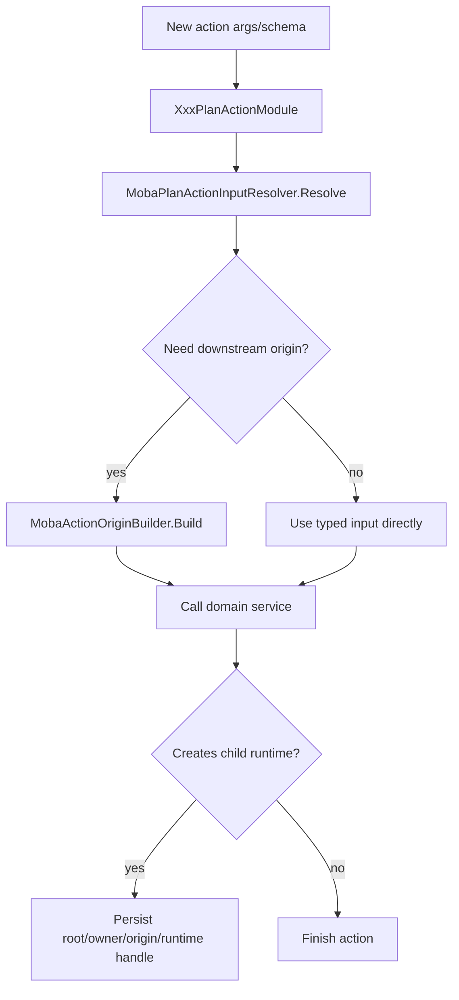

### 9.4 扩展 action 输入字段

如果多个 action 都需要新的运行时输入，例如 team、position、hit point、area id、summon id，不要在每个 action 里各自从 payload 解析，也不要默认追加到 `MobaPlanActionInput`。

推荐做法：

1. 先确认新增数据属于配置参数、核心执行事实、领域派生输入、payload 专属事实，还是 runtime service。
2. 配置参数放到 action 自己的 args/schema，例如 buff id、伤害系数、位移距离。
3. 只有跨领域稳定复用的执行事实才允许进入 `MobaPlanActionInput` 与 `MobaPlanActionInputResolver`。
4. 专用字段拆出领域 resolver，例如 motion action 已通过 `MobaMovementActionInputResolver` 复用 `MobaPlanActionInputResolver` 并集中处理方向、目标和 actor registry。
5. payload 专属事实优先通过 typed provider/interface 暴露，再由领域 resolver 读取，不在 action module 里识别大量具体 payload 类型。
6. runtime service 从 `ExecCtx<IWorldResolver>.Context` 获取，不挂到核心 input 上。
7. `PlanContextValueResolver` 已降级为 internal fallback，只允许 resolver 内部调用；action module 不应新增直接调用。

当前 `MobaPlanActionInput` 的定位是 core action input。它可以承载 caster、target、aim、execution context、trace scope 这类基础事实，但不承载伤害、buff、投射物、召唤、区域、表现等领域字段。后续 targeting 如果扩展到命中列表、区域形状、目标集合、投射物生成点，应优先新增 `MobaTargetingActionInput`，而不是继续扩展 core input。

### 9.5 接入验收清单

每次新增触发事件或 action 后，至少检查：

- trigger 入口是否统一走 `MobaEffectExecutionService.ExecuteTriggerId` 或 pipeline effect `Execute`。
- payload 是否提供 source/target/root/owner/runtime 的最小必要信息。
- `MobaCombatExecutionContext` 是否由 factory/session 生成，action 没有自行构建临时上下文。
- action 是否通过 `MobaPlanActionInputResolver` 读取输入。
- 需要溯源的 action 是否通过 `MobaActionOriginBuilder` 生成或继承 origin。
- 子对象是否携带 root/owner/origin/runtime，保证后续触发链不断裂。
- `PlanContextValueResolver` 的新增调用是否只出现在 resolver 内部。
- 需要读取 Buff 层数/时间时是否明确区分触发快照和实时 live view。

## 10. Root、Parent、Owner 的当前语义

当前链路中三个 context id 的意图如下：

| 字段 | 当前含义 | 典型来源 |
| --- | --- | --- |
| `ParentContextId` | 当前行为直接挂接的父 trace/context | 上一层 effect、skill cast root、projectile/buff source |
| `RootContextId` | 一次技能释放或触发链路的根 | skill cast root，缺失时由 origin/default 补齐 |
| `OwnerContextId` | 生命周期 owner，用于 runtime/child 归属 | skill runtime 或创建该对象的 root/owner |

当前第一阶段的关键约定：

- skill cast 会创建 root trace context。
- effect execution 如果有 parent，则创建 child context。
- action child node 挂在当前 effect context 下。
- buff/projectile 等衍生对象应保留 root/owner，使后续触发能回到同一条链。

## 11. 当前设计的验证点

建议重点验证以下问题：

1. Press/Hold/Release/Cancel 的技能输入语义是否符合预期。
2. 一个技能释放是否应该始终创建 skill cast root trace。
3. `MobaSkillCastRuntime` 是否应该作为 Buff/Projectile/Area/Summon 的统一 owner。
4. Effect trace scope 是否应该总是挂在 lineage parent 下。
5. Plan action child trace 是否需要一 action 一节点，还是只对关键 action 建节点。
6. Damage/Buff/Projectile action 的 origin 统一规则是否都应继续沉淀到 `MobaActionOriginBuilder`。
7. `OwnerContextId` 当前是否应该等同于 skill runtime owner，还是应独立于 trace root。
8. `MobaCombatExecutionContext` 是否应继续从 facade 收敛为只读 execution fact，并继续减少 payload fallback。

## 12. 当前设计中仍然偏重的部分

`MobaCombatExecutionContext` 曾经承担了多重职责，目前构建和 snapshot 合并已经拆给 `MobaCombatExecutionContextFactory`，旧 provider/data bag 反向兼容视图已经移除：

- 数据事实仍由 context 聚合，但 context 不再持有 data bag。
- provider/data bag 只允许作为原始 typed payload 的边界输入。
- action 输入读取已拆入 `MobaPlanActionInputResolver`，movement 专用输入已拆入 `MobaMovementActionInputResolver`，damage/buff/projectile/presentation/summon/resource/motion action 不再直接散落调用 `PlanContextValueResolver`；旧 resolver 已降级为 internal fallback。
- action origin 推导已拆入 `MobaActionOriginBuilder`，resolver 不再负责 origin 构造。
- payload/lineage/snapshot/origin 合并已移入 factory。
- snapshot 合并已移入 factory。
- condition 的 `TryGetData` 只读取原始 payload 自身的 data context。

当前拆分状态为：

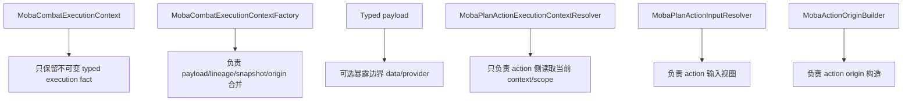

继续拆分的理想方向：

- `MobaCombatExecutionContext` 继续从“会推导的对象”收敛成“已经推导好的事实”。
- `MobaEffectExecutionService` 仍是上下文归一化入口，但执行生命周期已收敛到内部 session，plan 查询和运行已外移到 `MobaTriggerPlanExecutor`。
- motion action 的移动输入语义已拆到 `MobaMovementActionInputResolver`/`MobaMovementActionInput`，dash/blink/pull 不再直接读取旧 resolver。
- `PlanContextValueResolver` 已收紧为 resolver 内部 fallback；下一步重点应继续压缩 execution context resolver 的 payload fallback 创建能力，让 action 更强依赖正式 execution session。
- Condition/action 只消费上下文，不再负责修复上下文。
- 旧 payload/provider 只保留在 typed payload 边界，后续逐步减少直接依赖。

## 13. 代码索引

| 模块 | 文件 |
| --- | --- |
| 输入协调 | `Unity/Packages/com.abilitykit.demo.moba.runtime/Runtime/Application/Services/Input/MobaInputCoordinator.cs` |
| 技能输入 handler | `Unity/Packages/com.abilitykit.demo.moba.runtime/Runtime/Application/Services/Input/MobaSkillInputCommandHandler.cs` |
| 技能执行 | `Unity/Packages/com.abilitykit.demo.moba.runtime/Runtime/Application/Services/Skill/Cast/SkillExecutor.cs` |
| 技能 runtime | `Unity/Packages/com.abilitykit.demo.moba.runtime/Runtime/Application/Services/Skill/Runtime/MobaSkillCastRuntimeService.cs` |
| effect 执行 | `Unity/Packages/com.abilitykit.demo.moba.runtime/Runtime/Application/Services/Skill/Effects/MobaEffectExecutionService.cs` |
| 统一执行上下文 | `Unity/Packages/com.abilitykit.demo.moba.runtime/Runtime/Application/Services/Context/Execution/MobaCombatExecutionContext.cs` |
| 执行上下文 factory | `Unity/Packages/com.abilitykit.demo.moba.runtime/Runtime/Application/Services/Context/Execution/MobaCombatExecutionContextFactory.cs` |
| snapshot builder | `Unity/Packages/com.abilitykit.demo.moba.runtime/Runtime/Application/Services/Context/Snapshots/MobaTriggerExecutionSnapshotBuilder.cs` |
| condition context | `Unity/Packages/com.abilitykit.demo.moba.runtime/Runtime/Application/Services/Effect/MobaTriggerConditionContext.cs` |
| plan action 上下文 resolver | `Unity/Packages/com.abilitykit.demo.moba.runtime/Runtime/Application/Services/Triggering/PlanActions/MobaPlanActionExecutionContextResolver.cs` |
| plan action 输入视图 | `Unity/Packages/com.abilitykit.demo.moba.runtime/Runtime/Application/Services/Triggering/PlanActions/MobaPlanActionInput.cs` |
| plan action 输入 resolver | `Unity/Packages/com.abilitykit.demo.moba.runtime/Runtime/Application/Services/Triggering/PlanActions/MobaPlanActionInputResolver.cs` |
| action origin builder | `Unity/Packages/com.abilitykit.demo.moba.runtime/Runtime/Application/Services/Context/Origin/MobaActionOriginBuilder.cs` |
| damage pipeline | `Unity/Packages/com.abilitykit.demo.moba.runtime/Runtime/Application/Services/Combat/Damage/DamagePipelineService.cs` |
| damage action | `Unity/Packages/com.abilitykit.demo.moba.runtime/Runtime/Application/Services/Triggering/PlanActions/GiveDamagePlanActionModule.cs` |
| buff action | `Unity/Packages/com.abilitykit.demo.moba.runtime/Runtime/Application/Services/Triggering/PlanActions/AddBuffPlanActionModule.cs` |
| projectile action | `Unity/Packages/com.abilitykit.demo.moba.runtime/Runtime/Application/Services/Triggering/PlanActions/ShootProjectilePlanActionModule.cs` |
| presentation action | `Unity/Packages/com.abilitykit.demo.moba.runtime/Runtime/Application/Services/Triggering/PlanActions/PlayPresentationPlanActionModule.cs` |
| summon action | `Unity/Packages/com.abilitykit.demo.moba.runtime/Runtime/Application/Services/Triggering/PlanActions/SpawnSummonPlanActionModule.cs` |
| resource action | `Unity/Packages/com.abilitykit.demo.moba.runtime/Runtime/Application/Services/Triggering/PlanActions/ConsumeResourcePlanActionModule.cs` |
