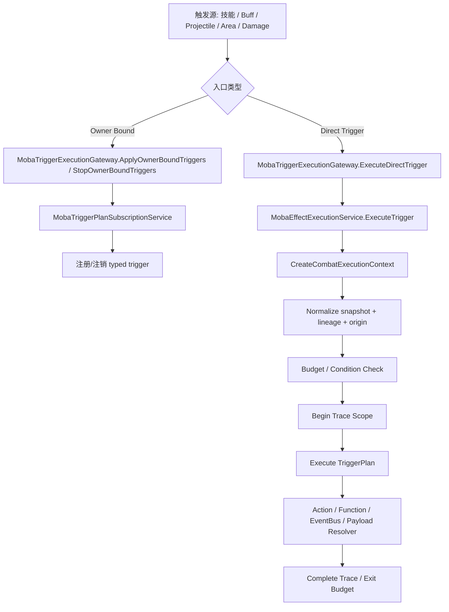
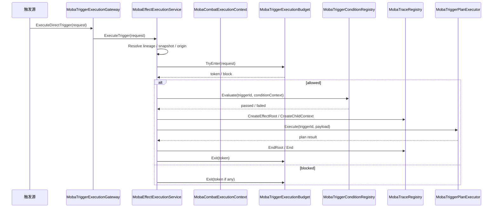
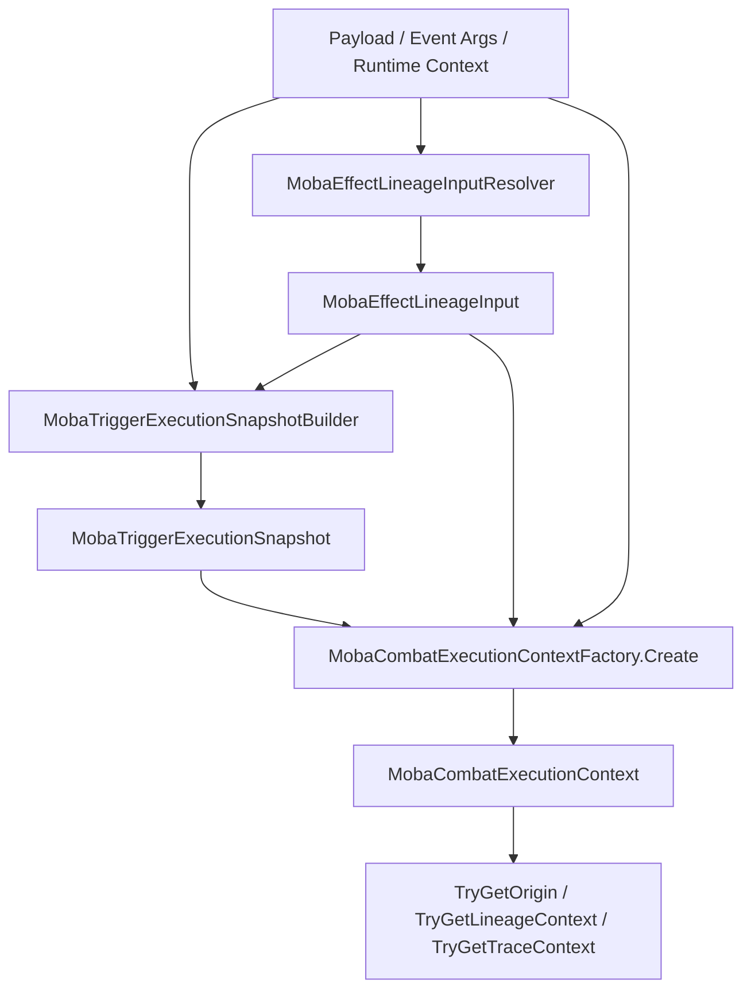
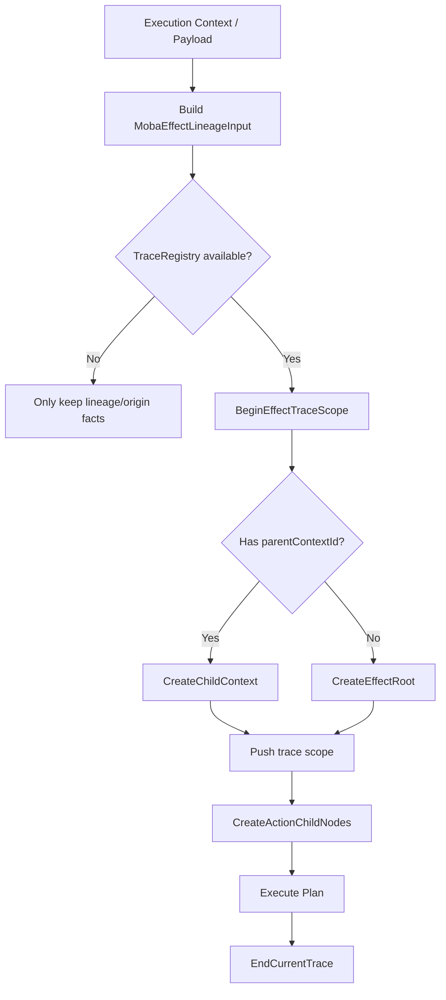
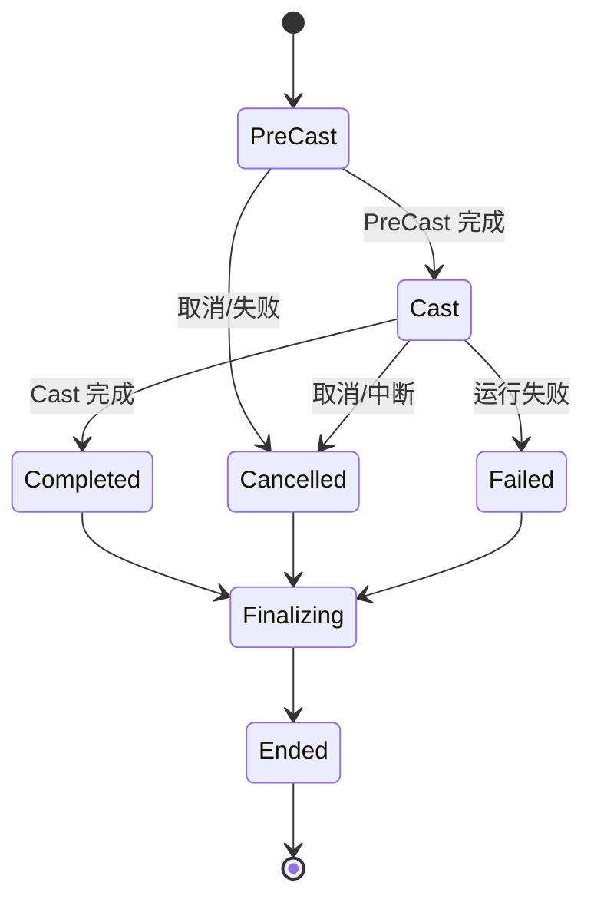
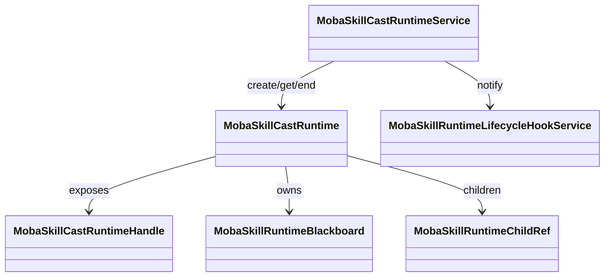
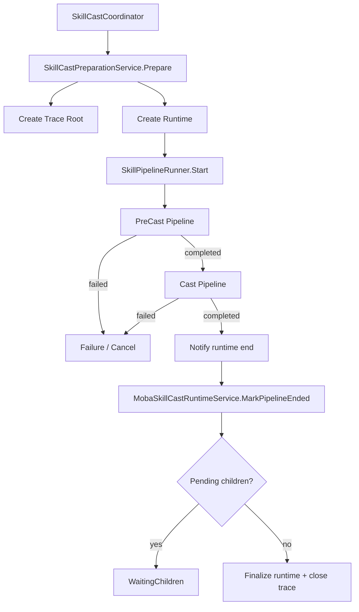
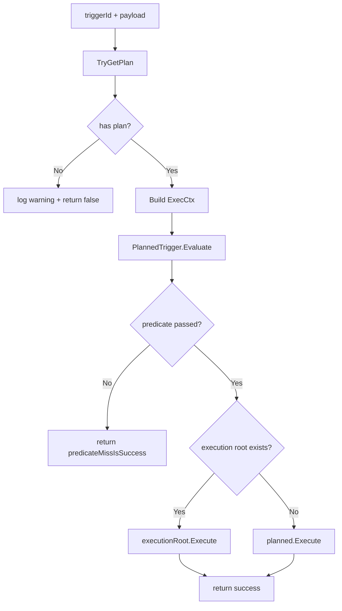
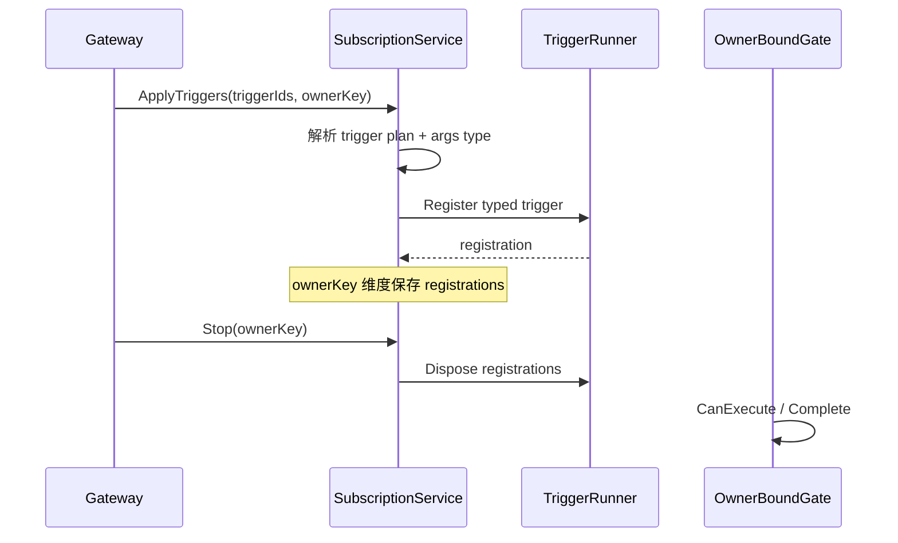

# Moba 效果触发、上下文、溯源与技能释放运行时阶段性设计

> 说明：本文基于当前代码现状整理，目标是让效果触发、执行上下文、溯源/Origin、Trace、技能释放运行时形成一套可扩展、可诊断、可追踪的正式化设计。
> 相关核心实现主要分布在 [`MobaEffectExecutionService.cs`](Unity/Packages/com.abilitykit.demo.moba.runtime/Runtime/Application/Services/Skill/Effects/MobaEffectExecutionService.cs:24)、[`MobaCombatExecutionContext.cs`](Unity/Packages/com.abilitykit.demo.moba.runtime/Runtime/Application/Services/Context/Execution/MobaCombatExecutionContext.cs:1)、[`MobaGameplayOrigin.cs`](Unity/Packages/com.abilitykit.demo.moba.runtime/Runtime/Application/Services/Context/Origin/MobaGameplayOrigin.cs:1)、[`MobaSkillCastRuntimeService.cs`](Unity/Packages/com.abilitykit.demo.moba.runtime/Runtime/Application/Services/Skill/Runtime/MobaSkillCastRuntimeService.cs:13)、[`SkillCastCoordinator.cs`](Unity/Packages/com.abilitykit.demo.moba.runtime/Runtime/Application/Services/Skill/Cast/SkillCastCoordinator.cs:45)。

## 1. 阶段性结论

当前设计已经从“弱类型触发 + 临时上下文拼装 + 兼容桥接”收敛到了“正式 payload + 统一执行上下文 + 明确的 lineage/origin + skill runtime 生命周期”的路线。

核心结论如下：

1. **效果触发入口已经统一**
   - 直接触发与 owner-bound 触发由 [`MobaTriggerExecutionGateway`](Unity/Packages/com.abilitykit.demo.moba.runtime/Runtime/Application/Services/Triggering/MobaTriggerExecutionGateway.cs:154) 收敛。
   - 实际执行落到 [`MobaEffectExecutionService.ExecuteTrigger<TPayload>()`](Unity/Packages/com.abilitykit.demo.moba.runtime/Runtime/Application/Services/Skill/Effects/MobaEffectExecutionService.cs:485) 与 [`MobaTriggerPlanExecutor`](Unity/Packages/com.abilitykit.demo.moba.runtime/Runtime/Application/Services/Skill/Effects/MobaTriggerPlanExecutor.cs:13)。

2. **上下文模型已经有主模型**
   - 运行期主模型是 [`MobaCombatExecutionContext`](Unity/Packages/com.abilitykit.demo.moba.runtime/Runtime/Application/Services/Context/Execution/MobaCombatExecutionContext.cs:1)。
   - [`MobaContextSourceView`](Unity/Packages/com.abilitykit.demo.moba.runtime/Runtime/Application/Services/Context/Providers/MobaTriggerContextProviders.cs:47) 更偏查询/快照/诊断视图，而不是主执行模型。

3. **溯源链路已经标准化**
   - 统一使用 [`MobaGameplayOrigin`](Unity/Packages/com.abilitykit.demo.moba.runtime/Runtime/Application/Services/Context/Origin/MobaGameplayOrigin.cs:1) / [`MobaGameplayOriginBuilder`](Unity/Packages/com.abilitykit.demo.moba.runtime/Runtime/Application/Services/Context/Origin/MobaGameplayOriginBuilder.cs:1) 从 lineage/trace 反推出 origin。
   - 旧的 `FromLegacy()` 兼容入口已经删除，不再作为正式业务路径。

4. **技能释放运行时已从“状态散落”演进到“runtime 实体”**
   - `SkillCastCoordinator` 负责准备、启动、输入分发和 runner 选择。
   - [`MobaSkillCastRuntimeService`](Unity/Packages/com.abilitykit.demo.moba.runtime/Runtime/Application/Services/Skill/Runtime/MobaSkillCastRuntimeService.cs:13) 负责 runtime 注册、查找、终止、children 追踪、blackboard、diagnostics。
   - [`MobaSkillCastRuntime`](Unity/Packages/com.abilitykit.demo.moba.runtime/Runtime/Application/Services/Skill/Runtime/MobaSkillCastRuntime.cs:557) 承载一次技能释放的正式运行状态。

5. **当前设计已经具备工业化项目的关键能力**
   - 强类型载荷。
   - 统一上下文。
   - 溯源/Trace。
   - 可诊断的生命周期。
   - 可回滚/可清理的 runtime。
   - 可扩展的 owner-bound trigger 订阅模型。

---

## 2. 现有模块职责总览

### 2.1 触发执行模块

- [`MobaTriggerExecutionGateway`](Unity/Packages/com.abilitykit.demo.moba.runtime/Runtime/Application/Services/Triggering/MobaTriggerExecutionGateway.cs:154)
  - 统一入口。
  - 分发直接触发与 owner-bound 触发。
  - 统计指标与诊断埋点。
- [`MobaTriggerPlanSubscriptionService`](Unity/Packages/com.abilitykit.demo.moba.runtime/Runtime/Application/Services/Triggering/MobaTriggerPlanSubscriptionService.cs:18)
  - owner-bound trigger 的订阅、注册、注销、门禁。
- [`MobaEffectExecutionService`](Unity/Packages/com.abilitykit.demo.moba.runtime/Runtime/Application/Services/Skill/Effects/MobaEffectExecutionService.cs:24)
  - 效果执行主服务。
  - 负责上下文归一化、预算控制、条件判断、trace 管理、计划执行。
- [`MobaTriggerPlanExecutor`](Unity/Packages/com.abilitykit.demo.moba.runtime/Runtime/Application/Services/Skill/Effects/MobaTriggerPlanExecutor.cs:13)
  - 真正执行 trigger plan。
  - 对接 `ExecCtx<IWorldResolver>`、`PlannedTrigger`、`ExecutionRoot`。

### 2.2 上下文模块

- [`MobaCombatExecutionContext`](Unity/Packages/com.abilitykit.demo.moba.runtime/Runtime/Application/Services/Context/Execution/MobaCombatExecutionContext.cs:1)
  - 当前正式执行上下文。
  - 聚合 payload、lineage、trace、origin、snapshot、runtime handle。
- [`MobaTriggerInvocationContextBase`](Unity/Packages/com.abilitykit.demo.moba.runtime/Runtime/Application/Services/Context/Payload/MobaTriggerInvocationContextBase.cs:1)
  - 统一触发 payload 的抽象基类。
- [`MobaTriggerExecutionSnapshotBuilder`](Unity/Packages/com.abilitykit.demo.moba.runtime/Runtime/Application/Services/Context/Snapshots/MobaTriggerExecutionSnapshotBuilder.cs:1)
  - 从 lineage + payload 构建执行快照。

### 2.3 溯源 / Origin / Trace 模块

- [`MobaTriggerLineageContext`](Unity/Packages/com.abilitykit.demo.moba.runtime/Runtime/Application/Services/Context/Lineage/MobaTriggerLineageContext.cs:1)
  - lineage 基础事实。
- [`MobaTriggerTraceContext`](Unity/Packages/com.abilitykit.demo.moba.runtime/Runtime/Application/Services/Context/Lineage/MobaTriggerTraceContext.cs:1)
  - trace 视角的数据载体。
- [`MobaEffectLineageInput`](Unity/Packages/com.abilitykit.demo.moba.runtime/Runtime/Application/Services/Context/Lineage/MobaEffectLineageInput.cs:1)
  - effect 执行时的 lineage 输入。
- [`MobaGameplayOrigin`](Unity/Packages/com.abilitykit.demo.moba.runtime/Runtime/Application/Services/Context/Origin/MobaGameplayOrigin.cs:1)
  - 最终正式的 origin 实体。
- [`MobaGameplayOriginBuilder`](Unity/Packages/com.abilitykit.demo.moba.runtime/Runtime/Application/Services/Context/Origin/MobaGameplayOriginBuilder.cs:1)
  - origin 组装器。

### 2.4 技能释放运行时模块

- [`SkillCastCoordinator`](Unity/Packages/com.abilitykit.demo.moba.runtime/Runtime/Application/Services/Skill/Cast/SkillCastCoordinator.cs:45)
  - 技能输入、预处理、启动、runner 管理。
- [`SkillCastPreparationService`](Unity/Packages/com.abilitykit.demo.moba.runtime/Runtime/Application/Services/Skill/Cast/SkillCastPreparationService.cs:13)
  - 生成上下文、创建 trace root、创建 runtime。
- [`SkillPipelineRunner`](Unity/Packages/com.abilitykit.demo.moba.runtime/Runtime/Application/Services/Skill/Pipeline/SkillPipelineRunner.cs:18)
  - 执行 PreCast / Cast pipeline。
- [`MobaSkillCastRuntimeService`](Unity/Packages/com.abilitykit.demo.moba.runtime/Runtime/Application/Services/Skill/Runtime/MobaSkillCastRuntimeService.cs:13)
  - runtime 仓储 + 生命周期 + blackboard + trace 关联。
- [`MobaSkillCastRuntime`](Unity/Packages/com.abilitykit.demo.moba.runtime/Runtime/Application/Services/Skill/Runtime/MobaSkillCastRuntime.cs:557)
  - runtime 实体。

---

## 3. 设计目标

### 3.1 统一性

同一种“效果触发”不应在不同模块里重复拼装一套不同格式的上下文。

统一目标：

- 触发入口统一。
- payload 统一。
- lineage 统一。
- origin 统一。
- trace 统一。
- runtime 生命周期统一。

### 3.2 强类型化

触发参数不能长期停留在弱类型 `object`/反射式拼装。
当前已经引入 [`IMobaTriggerExecutionPayload`](Unity/Packages/com.abilitykit.demo.moba.runtime/Runtime/Application/Services/Context/Payload/MobaTriggerInvocationContextBase.cs:1) 与 `MobaTriggerInvocationContextBase` 作为正式载体。

### 3.3 可追踪性

每一次效果执行、技能释放、子动作、children 运行体都应能追到：

- 谁发起。
- 谁是目标。
- 由哪个 skill/runtime/trigger 产生。
- 经过哪一层 plan / action / phase。

### 3.4 可扩展性

buff、projectile、summon、damage、area、periodic tick 等场景应复用同一条 formal pipeline，而不是各自复制“context + origin + trace”的粘合逻辑。

---

## 4. 触发执行总体流程

### 4.1 入口分类

当前入口主要分两类：

1. **直接触发**
   - 外部直接给一个 `MobaTriggerExecutionRequest<TPayload>`。
   - 典型于 projectile hit、area enter/exit、buff interval 等。
   - 入口见 [`MobaEffectExecutionService.ExecuteTrigger<TPayload>()`](Unity/Packages/com.abilitykit.demo.moba.runtime/Runtime/Application/Services/Skill/Effects/MobaEffectExecutionService.cs:485)。

2. **owner-bound 触发**
   - 通过 ownerKey 订阅 trigger plan。
   - 入口见 [`MobaTriggerExecutionGateway.ApplyOwnerBoundTriggers(...)`](Unity/Packages/com.abilitykit.demo.moba.runtime/Runtime/Application/Services/Triggering/MobaTriggerExecutionGateway.cs:213)。
   - 触发注册与注销由 [`MobaTriggerPlanSubscriptionService`](Unity/Packages/com.abilitykit.demo.moba.runtime/Runtime/Application/Services/Triggering/MobaTriggerPlanSubscriptionService.cs:74) 维护。

### 4.2 总体流程图

---

## 5. 效果执行模块设计

### 5.1 `MobaEffectExecutionService` 的定位

[`MobaEffectExecutionService`](Unity/Packages/com.abilitykit.demo.moba.runtime/Runtime/Application/Services/Skill/Effects/MobaEffectExecutionService.cs:24) 是效果执行的主控服务，不是单纯的 plan 执行器。

它负责：

- 构建正式执行上下文。
- 建立/结束 trace scope。
- 创建 execution snapshot。
- 执行预算检查。
- 执行 condition 检查。
- 调用 `MobaTriggerPlanExecutor` 完成 plan 执行。
- 维护当前 execution context 栈。

### 5.2 关键执行步骤

1. 接收 payload。
2. 通过 [`MobaEffectLineageInputResolver`](Unity/Packages/com.abilitykit.demo.moba.runtime/Runtime/Application/Services/Context/Lineage/MobaEffectLineageInputResolver.cs:1) 解析 lineage。
3. 通过 [`MobaTriggerExecutionSnapshotBuilder`](Unity/Packages/com.abilitykit.demo.moba.runtime/Runtime/Application/Services/Context/Snapshots/MobaTriggerExecutionSnapshotBuilder.cs:1) 建快照。
4. 通过 [`MobaCombatExecutionContextFactory`](Unity/Packages/com.abilitykit.demo.moba.runtime/Runtime/Application/Services/Context/Execution/MobaCombatExecutionContextFactory.cs:1) 生成正式执行上下文。
5. 进入预算控制。
6. 评估 trigger condition。
7. 建立 trace scope。
8. 执行 trigger plan。
9. 完成或失败后统一收尾。

### 5.3 触发执行时序图

### 5.4 设计评价

这一层的设计已经比“直接调用 plan”更工业化，原因是：

- 预算、条件、trace 被放在统一服务层处理。
- 上下文归一化集中，不散落在具体触发场景。
- 便于新增场景时只补 payload/lineage 适配，不重写整条执行链。

---

## 6. 上下文管理设计

### 6.1 主执行上下文

[`MobaCombatExecutionContext`](Unity/Packages/com.abilitykit.demo.moba.runtime/Runtime/Application/Services/Context/Execution/MobaCombatExecutionContext.cs:1) 是当前正式执行上下文。

它聚合了：

- payload。
- lineage input。
- execution snapshot。
- frame 信息。
- origin / trace 的推导能力。
- skill runtime handle。
- actor / target / source / root / owner 等关键字段。

### 6.2 上下文职责边界

#### `MobaCombatExecutionContext`

- 适合：执行期、plan 执行、condition 评估、action 执行。
- 不适合：长期存储业务状态。

#### `MobaContextSourceView`

- 适合：诊断、查询、汇总、日志展示、快照导出。
- 不适合作为核心执行上下文主模型。

### 6.3 上下文归一化流程图

### 6.4 上下文来源优先级

当前更推荐的来源顺序为：

1. 显式 payload 中已有 origin / lineage / trace。
2. 执行上下文中已有正式 origin。
3. execution snapshot / lineageInput。
4. 最后才做降级构造。

这个顺序避免了每个模块都重新猜测“这个对象到底从哪里来”。

---

## 7. 溯源 / Origin / Trace 设计

### 7.1 三层概念区分

#### Lineage

表示“事实链路”：

- 来源是谁。
- 目标是谁。
- 父上下文是谁。
- 根上下文是谁。
- 归属上下文是谁。

#### Origin

表示“正式业务起源模型”：

- 面向业务语义的最终对象。
- 可从 lineage / trace 推导而来。
- 用于真正的 runtime 派生。

#### Trace

表示“可视化/诊断/链路树”模型：

- 用于父子上下文树。
- 用于结束理由。
- 用于 runtime / action / effect 关系追踪。

### 7.2 当前正式构造路线

- [`MobaGameplayOrigin.FromLineageContext(...)`](Unity/Packages/com.abilitykit.demo.moba.runtime/Runtime/Application/Services/Context/Origin/MobaGameplayOrigin.cs:1)
- [`MobaGameplayOrigin.FromTraceContext(...)`](Unity/Packages/com.abilitykit.demo.moba.runtime/Runtime/Application/Services/Context/Origin/MobaGameplayOrigin.cs:1)
- [`MobaGameplayOriginBuilder.FromLineageContext(...)`](Unity/Packages/com.abilitykit.demo.moba.runtime/Runtime/Application/Services/Context/Origin/MobaGameplayOriginBuilder.cs:1)

已经不再保留 `FromLegacy()` 作为正式路径。

### 7.3 Trace 关联流程图

### 7.4 现状评价

这套设计是符合工业化项目预期的，因为它满足：

- 统一事实源。
- 可推导正式 origin。
- trace 与业务对象解耦。
- 诊断开关可选，不强耦合。

---

## 8. 技能释放运行时设计

### 8.1 设计目标

技能释放不能只看“是否执行了一个 pipeline”，还要管理：

- 输入阶段。
- 准备阶段。
- PreCast / Cast 阶段。
- children 运行体。
- 结束/取消/失败。
- 黑板数据。
- trace 关闭。
- runtime 生命周期 hook。

### 8.2 技能启动主链路

[`SkillCastCoordinator`](Unity/Packages/com.abilitykit.demo.moba.runtime/Runtime/Application/Services/Skill/Cast/SkillCastCoordinator.cs:45) 负责：

1. 接收输入。
2. 校验 actor / slot / phase。
3. 交给 [`SkillCastPreparationService`](Unity/Packages/com.abilitykit.demo.moba.runtime/Runtime/Application/Services/Skill/Cast/SkillCastPreparationService.cs:36) 做前置准备。
4. 获取技能配置与 pipeline。
5. 通过 [`SkillRunnerRegistry`](Unity/Packages/com.abilitykit.demo.moba.runtime/Runtime/Application/Services/Skill/Cast/SkillRunnerRegistry.cs:1) 管理 runner。
6. 启动 [`SkillPipelineRunner`](Unity/Packages/com.abilitykit.demo.moba.runtime/Runtime/Application/Services/Skill/Pipeline/SkillPipelineRunner.cs:18)。

### 8.3 准备阶段职责

[`SkillCastPreparationService`](Unity/Packages/com.abilitykit.demo.moba.runtime/Runtime/Application/Services/Skill/Cast/SkillCastPreparationService.cs:13) 负责：

- 解析 caster / target。
- 计算 aimPos / aimDir。
- 读取技能等级。
- 创建 `SkillCastContext`。
- 创建 trace root。
- 创建 `MobaSkillCastRuntime`。
- 把 runtime handle 回填到 context。

### 8.4 技能运行时生命周期图

### 8.5 技能运行时结构图

### 8.6 运行时终止策略

[`MobaSkillCastRuntimeService`](Unity/Packages/com.abilitykit.demo.moba.runtime/Runtime/Application/Services/Skill/Runtime/MobaSkillCastRuntimeService.cs:13) 支持：

- `MarkPipelineEnded`
- `Cancel`
- `ForceTerminate`
- `ReleaseChild`
- `RetainChild`

它的核心职责不是执行技能，而是控制 runtime 生命周期与收口时机。

### 8.7 技能 pipeline 运行图

### 8.8 现状评价

技能 runtime 这条链路已经不是简单的“技能流程执行器”，而是具备：

- 生命周期管理。
- trace root 绑定。
- child 维持。
- blackboard。
- diagnostics。

这对于工业化项目是合理的，而且是必要的。

---

## 9. 触发计划执行设计

### 9.1 `MobaTriggerPlanExecutor` 的定位

[`MobaTriggerPlanExecutor`](Unity/Packages/com.abilitykit.demo.moba.runtime/Runtime/Application/Services/Skill/Effects/MobaTriggerPlanExecutor.cs:13) 是“plan 执行适配器”，不是上下文制造器。

它负责：

- 取 plan。
- 构造 `ExecCtx<IWorldResolver>`。
- 包装当前 effect service 到 resolver。
- 执行 `PlannedTrigger`。
- 支持 execution root。

### 9.2 执行路径

- 没有 execution root 时，直接 `planned.Execute(...)`。
- 有 execution root 时，优先执行 root 管道。
- predicate 失败时，可配置是否视为 success。

### 9.3 执行器结构图

---

## 10. owner-bound 触发设计

### 10.1 为什么保留 owner-bound

owner-bound 不是 legacy，它是域模型的一部分：

- 某些触发必须绑定某个 owner。
- owner 消失后，触发应被注销。
- owner 变更时需要重新订阅。

### 10.2 当前责任划分

- [`MobaTriggerExecutionGateway`](Unity/Packages/com.abilitykit.demo.moba.runtime/Runtime/Application/Services/Triggering/MobaTriggerExecutionGateway.cs:154)
  - 统一收口。
- [`MobaTriggerPlanSubscriptionService`](Unity/Packages/com.abilitykit.demo.moba.runtime/Runtime/Application/Services/Triggering/MobaTriggerPlanSubscriptionService.cs:18)
  - 负责注册 / 停止 / 过期清理。
- `MobaOwnerBoundTriggerGateService`
  - 负责执行门禁与完成通知。

### 10.3 owner-bound flow chart

### 10.4 评价

这条链路适合作为工业化项目中的“持续订阅型触发器”框架，因为：

- 注册与执行分离。
- owner 维度可集中清理。
- typed event args 已被引入。
- 具备门禁与完成回调。

---

## 11. Damage / Buff / Projectile / Summon 的统一化含义

### 11.1 统一原则

这些业务不是各自再造一套上下文，而是都应映射到同一套 formal model：

- payload -> lineage input -> execution snapshot -> combat execution context -> origin/trace -> plan action。

### 11.2 典型例子

- Damage:
  - [`MobaCombatEffectService.DealDamage(...)`](Unity/Packages/com.abilitykit.demo.moba.runtime/Runtime/Application/Services/Combat/MobaCombatEffectService.cs:19)
  - Damage payload 已经接入 formal lineage/origin 逻辑。
- Buff:
  - Buff runtime 与上下文源已经通过正式 origin 方式构造。
- Projectile:
  - Projectile source context 也改为直接 formal origin 构造。
- Summon:
  - Summon source context 同样走 formal route。

### 11.3 通用化意义

统一化后，后续新增一个触发时机，通常只需要补：

1. payload contract。
2. lineage resolver。
3. plan/action 绑定。
4. 必要时的 trace 视图适配。

而不需要再补一套“手写 origin + 手写 snapshot + 手写 runtime 兼容桥”。

---

## 12. 当前设计是否符合预期

### 12.1 符合的部分

- 已经从临时兼容逻辑转为正式路径。
- 关键模块职责清晰。
- effect/context/trace/runtime 分层明确。
- 触发类型与 payload 正在强类型化。
- runtime 生命周期与 trace 生命周期能联动。

### 12.2 仍需持续关注的点

1. `OwnerKey` 仍保留在部分数据契约或 owner-bound 语义中。
   - 这不等于 legacy，但文档里必须解释清楚。
2. `MobaContextSourceView` 不要反向侵入执行主链路。
3. 新场景接入时尽量优先复用 `MobaTriggerInvocationContextBase`。
4. 新的触发场景如果还能写出 `FromLegacy`，说明抽象还可以再收敛。

### 12.3 我的判断

如果目标是“工业化、可扩展、可排障”的正式版，这个方向是正确的。
当前架构已经达到了一个比较合理的中间态：

- 核心路径已正式化。
- 兼容路径已收束并清理。
- 后续重点应从“删旧接口”转向“补齐文档、统一接入规范、稳定扩展点”。

---

## 13. 后续建议

1. 补一份**触发 payload 接入规范**。
   - 说明新场景如何实现 `IMobaTriggerExecutionPayload`。
2. 补一份**runtime 生命周期约定**。
   - 什么时候创建、什么时候 retain child、什么时候 finalize。
3. 补一份**owner-bound 订阅规范**。
   - 说明 ownerKey / ownerContextId 的语义边界。
4. 补一份**trace 诊断手册**。
   - 说明如何通过 trace root / child / action chain 回溯问题。
5. 对技能、buff、projectile、damage、summon 写统一接入示例。

---

## 14. 相关代码索引

- [`MobaEffectExecutionService.cs`](Unity/Packages/com.abilitykit.demo.moba.runtime/Runtime/Application/Services/Skill/Effects/MobaEffectExecutionService.cs:24)
- [`MobaTriggerPlanExecutor.cs`](Unity/Packages/com.abilitykit.demo.moba.runtime/Runtime/Application/Services/Skill/Effects/MobaTriggerPlanExecutor.cs:13)
- [`MobaCombatExecutionContext.cs`](Unity/Packages/com.abilitykit.demo.moba.runtime/Runtime/Application/Services/Context/Execution/MobaCombatExecutionContext.cs:1)
- [`MobaTriggerInvocationContextBase.cs`](Unity/Packages/com.abilitykit.demo.moba.runtime/Runtime/Application/Services/Context/Payload/MobaTriggerInvocationContextBase.cs:1)
- [`MobaGameplayOrigin.cs`](Unity/Packages/com.abilitykit.demo.moba.runtime/Runtime/Application/Services/Context/Origin/MobaGameplayOrigin.cs:1)
- [`MobaGameplayOriginBuilder.cs`](Unity/Packages/com.abilitykit.demo.moba.runtime/Runtime/Application/Services/Context/Origin/MobaGameplayOriginBuilder.cs:1)
- [`MobaSkillCastRuntimeService.cs`](Unity/Packages/com.abilitykit.demo.moba.runtime/Runtime/Application/Services/Skill/Runtime/MobaSkillCastRuntimeService.cs:13)
- [`MobaSkillCastRuntime.cs`](Unity/Packages/com.abilitykit.demo.moba.runtime/Runtime/Application/Services/Skill/Runtime/MobaSkillCastRuntime.cs:557)
- [`SkillCastCoordinator.cs`](Unity/Packages/com.abilitykit.demo.moba.runtime/Runtime/Application/Services/Skill/Cast/SkillCastCoordinator.cs:45)
- [`SkillCastPreparationService.cs`](Unity/Packages/com.abilitykit.demo.moba.runtime/Runtime/Application/Services/Skill/Cast/SkillCastPreparationService.cs:13)
- [`SkillPipelineRunner.cs`](Unity/Packages/com.abilitykit.demo.moba.runtime/Runtime/Application/Services/Skill/Pipeline/SkillPipelineRunner.cs:18)
- [`MobaTriggerExecutionGateway.cs`](Unity/Packages/com.abilitykit.demo.moba.runtime/Runtime/Application/Services/Triggering/MobaTriggerExecutionGateway.cs:154)
- [`MobaTriggerPlanSubscriptionService.cs`](Unity/Packages/com.abilitykit.demo.moba.runtime/Runtime/Application/Services/Triggering/MobaTriggerPlanSubscriptionService.cs:18)
- [`MobaCombatEffectService.cs`](Unity/Packages/com.abilitykit.demo.moba.runtime/Runtime/Application/Services/Combat/MobaCombatEffectService.cs:7)

---

## 15. 补充说明

本阶段已经删除 `FromLegacy()` 兼容 API，正式路径已切换到 lineage/origin 体系。
如果后续需要继续压缩历史包袱，建议优先检查：

- 是否还有老的弱类型 trigger payload 接入点。
- 是否还有非必要的 `OwnerKey` 命名残留需要显式文档化。
- 是否还有任何 plan/action 层在做重复的上下文拼装。

总体上，当前实现方向是对的。
