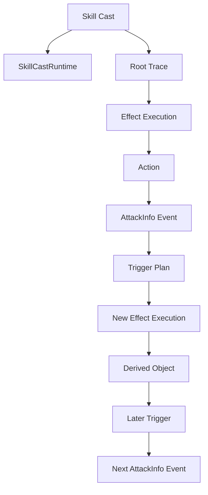
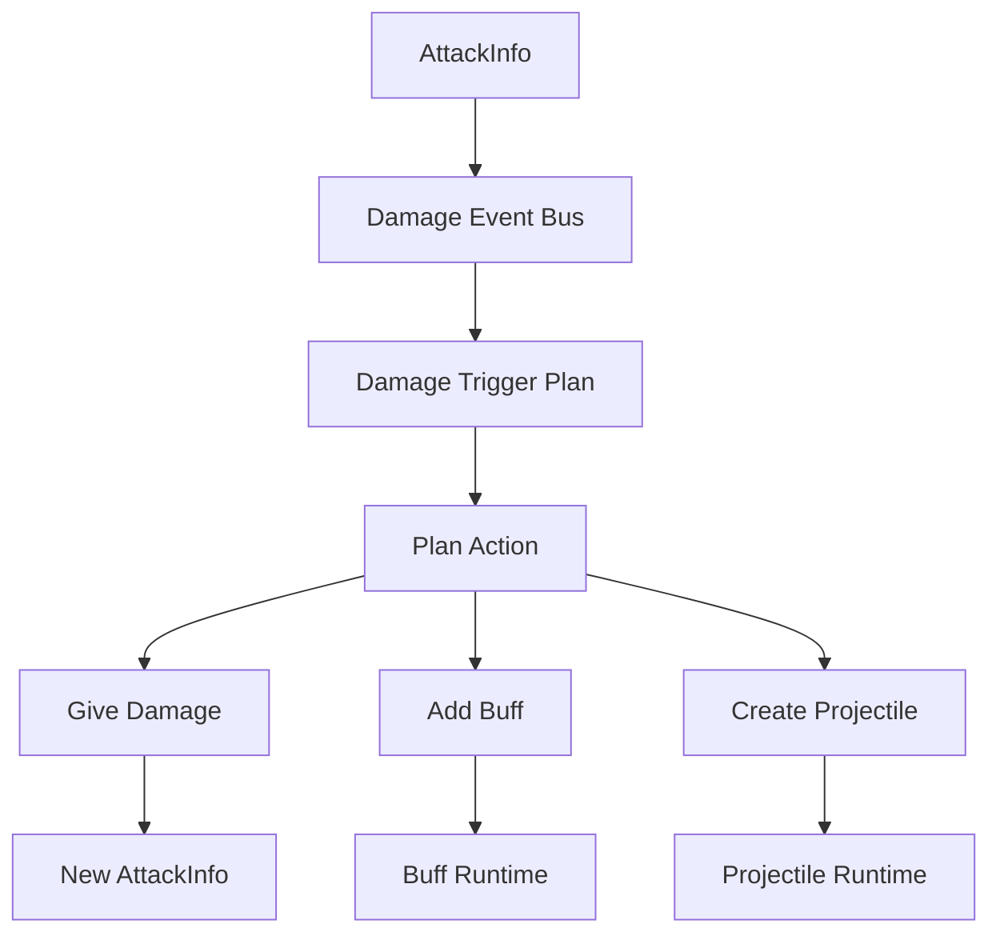
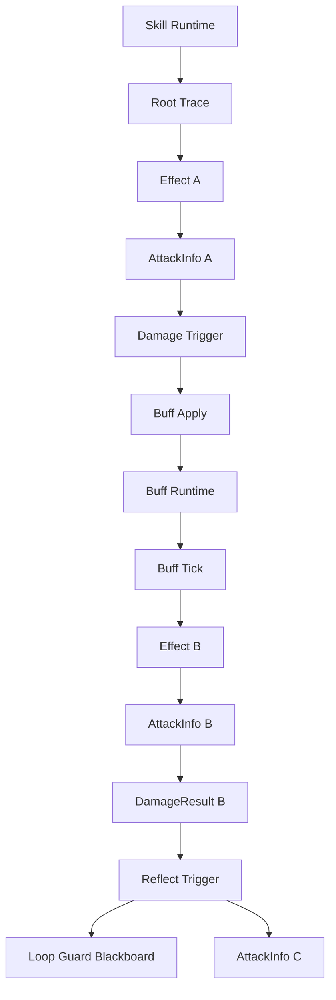

# MOBA 触发器事件上下文与溯源设计

## 1. 背景

当前 MOBA runtime 已经具备几个关键模块：

- 伤害管线通过 `AttackInfo`、`AttackCalcInfo`、`DamageResult` 作为强类型事件参数派发不同阶段事件。
- 触发器系统通过事件 payload 执行配置化 Trigger Plan。
- 效果执行服务会为每次效果执行创建 trace 节点，用于记录效果链路。
- 技能释放已经引入 `MobaSkillCastRuntime`，用于管理一次技能释放的聚合生命周期和技能作用域黑板。
- Buff 等持续对象已经开始保存 `SourceContextId`、`SkillRuntimeHandle` 等运行时来源信息。

但随着触发链路变复杂，单纯在 `AttackInfo` 或 Buff 上继续增加来源字段会逐渐失控。典型路径是：

1. 技能释放创建技能运行时。
2. 技能效果造成伤害，派发 `AttackInfo`。
3. `AttackInfo` 作为强类型事件参数触发其他 Trigger Plan。
4. 新的 Trigger Plan 可能继续造成伤害、添加 Buff、创建子弹、创建区域、创建召唤物。
5. Buff 或子弹后续再次触发效果，又派发新的强类型事件参数。
6. 调试、回放、循环保护、结算归因都需要知道每一层来源。

因此需要明确：事件参数、触发上下文、效果执行上下文、trace、技能运行时、派生对象运行时分别负责什么。

## 2. 核心结论

`AttackInfo` 不是来源管理中心，而是伤害管线某一阶段派发给触发器的强类型事件参数。

它应该表达：

- 本次伤害是谁打谁。
- 本次伤害如何计算。
- 本次伤害的直接结算原因。
- 本次事件可用于继续追溯来源的引用。

它不应该表达：

- 反伤是否已经触发过。
- 某个技能已经命中过哪些目标。
- 某个技能当前衰减因子是多少。
- Buff、子弹、区域、召唤物的生命周期。
- 完整 trace 树结构。
- 任意自定义运行时参数。

这些职责应分别交给 trace、技能运行时黑板、派生对象运行时和触发器执行上下文。

## 3. 概念分层

### 3.1 强类型事件参数

代表某次领域事件的事实数据。

当前例子：

- `AttackInfo`：伤害创建、伤害计算前等阶段的输入事件。
- `AttackCalcInfo`：伤害计算过程事件。
- `DamageResult`：伤害应用完成事件。

职责：

- 作为事件总线派发的 payload。
- 为触发器条件判断和 Action 提供强类型数据。
- 只保存本次事件需要的数据和必要来源引用。

不负责：

- 管理派生效果生命周期。
- 管理技能运行时状态。
- 表达完整溯源树。
- 承载任意业务黑板。

### 3.2 触发器执行上下文

代表某个 Trigger Plan 正在处理某个事件 payload。

职责：

- 读取 payload 中的强类型数据。
- 读取来源引用并转换成效果执行输入。
- 提供当前触发器调用的 source actor、target actor、source context。
- 将当前事件上下文传递给后续 Action。

设计方向：

- 使用强类型接口暴露上下文。
- 避免泛型 KV 和魔法字符串成为主要路径。
- 对不同领域事件提供专门解析器，例如 Damage payload resolver、Buff payload resolver。

### 3.3 效果执行上下文

代表一次效果配置或 Trigger Plan 的执行。

职责：

- 为本次效果执行创建 trace 节点。
- 提供当前 Action 执行时的 trace scope。
- 从 trigger payload 中提取父来源。
- 将本次效果执行作为后续事件或派生对象的直接来源。

当前 `MobaEffectExecutionService` 已经具备这个方向：

- 能从 payload 提取 trace 输入。
- 能创建 root 或 child trace context。
- 能记录 Action 子节点。
- 能暴露当前 trace scope 给 Action 使用。

后续需要补强的是：优先从统一来源模型提取，而不是从多个散落接口和字段推断。

### 3.4 Trace 溯源树

代表行为链路如何发生。

职责：

- 记录技能、效果、Action、Buff、子弹、区域、召唤物、伤害等上下文之间的父子关系。
- 支持调试、回放、战斗日志、归因、问题定位。
- 提供完整来源查询能力。

不负责：

- 保存技能运行时可变黑板。
- 作为派生对象生命周期管理器。
- 作为触发器 payload。

### 3.5 技能运行时聚合

`MobaSkillCastRuntime` 代表一次技能释放的聚合生命周期。

职责：

- 表达一次技能释放的整体生命周期。
- 在技能管线结束后，只要 Buff、子弹、区域、召唤物等派生对象仍然存在，技能运行时仍然可以存活。
- 保存技能作用域黑板。
- 管理派生对象 retain/release。

适合存放：

- 已命中的目标集合。
- 命中次数。
- 伤害衰减因子。
- 连锁或反伤 loop guard。
- 本次技能释放共享的临时状态。

不适合存放：

- 静态配置。
- Actor 长期属性。
- 完整 trace 结构。
- Buff 自己的剩余时间和层数等生命周期状态。

### 3.6 派生对象运行时

代表 Buff、Projectile、Area、Summon 等由效果创建、可以跨帧存在的对象。

职责：

- 管理自己的生命周期。
- 保存自己的直接来源 context。
- 保存所属技能运行时句柄。
- 后续触发效果时，把来源继续传递下去。
- 存活期间 retain 技能运行时，销毁时 release。

## 4. 事件链路模型

### 4.1 主链路




### 4.2 伤害触发派生效果链路




这说明 `AttackInfo` 只是其中一个事件节点。它被触发器消费后，触发器执行行为可能继续产生新的事件或对象。因此来源传递必须放在统一 context/origin 模型中，而不是让每个事件参数都自行扩展一套来源字段。

## 5. 来源模型设计

建议新增统一值对象：`MobaGameplayOrigin`。

### 5.1 命名建议

优先级：

1. `MobaGameplayOrigin`
2. `MobaEffectOriginContext`
3. `MobaSourceContext`

推荐 `MobaGameplayOrigin`，因为它不仅服务效果系统，也服务伤害、Buff、子弹、召唤物、区域、表现、统计和日志。

### 5.2 字段语义

建议字段：

- `SourceActorId`：行为发起者。
- `TargetActorId`：当前主要目标。
- `ImmediateKind`：当前事件的直接来源类型。
- `ImmediateConfigId`：当前直接来源的配置 ID。
- `ImmediateContextId`：当前直接来源的 trace/runtime context ID。
- `ParentContextId`：后续创建 trace 子节点时的父 context。
- `RootContextId`：整条来源链的根 context。
- `OwnerContextId`：当前持续对象或监听器的归属 context。
- `SkillRuntimeHandle`：所属技能释放聚合句柄。

这几个字段解决的问题不同：


| 字段                   | 解决的问题            |
| -------------------- | ---------------- |
| `ImmediateContextId` | 当前事件直接由谁触发       |
| `ParentContextId`    | 后续 trace 挂到哪里    |
| `RootContextId`      | 最早主线来源是谁         |
| `OwnerContextId`     | 当前事件属于哪个持续对象或监听器 |
| `SkillRuntimeHandle` | 如何回到本次技能释放聚合和黑板  |


### 5.3 来源继承规则

每次从旧事件生成新事件或派生对象时，必须遵守以下规则：

1. 新事件的 `ParentContextId` 应指向当前正在执行的效果 trace context。
2. 新事件的 `ImmediateContextId` 应指向直接创建它的行为 context。
3. `RootContextId` 默认从父来源继承。
4. `SkillRuntimeHandle` 默认从父来源继承。
5. 如果新事件来自一个持续对象，例如 Buff tick，则 `OwnerContextId` 应指向该 Buff 的 source context。
6. 如果没有父来源，则创建 root trace，并以当前效果作为 root。

### 5.4 接口设计

建议新增接口：

```csharp
public interface IMobaOriginContextProvider
{
    bool TryGetOrigin(out MobaGameplayOrigin origin);
}
```

已有接口继续保留：

```csharp
public interface IMobaTriggerTraceContextProvider
{
    bool TryGetTraceContext(out MobaTriggerTraceContext traceContext);
}

public interface IMobaTriggerSkillRuntimeContext
{
    bool TryGetSkillRuntimeHandle(out MobaSkillCastRuntimeHandle handle);
}
```

推荐关系：

1. `IMobaOriginContextProvider` 是更高层、更统一的来源入口。
2. `IMobaTriggerTraceContextProvider` 是 trace 输入兼容层。
3. `IMobaTriggerSkillRuntimeContext` 是访问技能运行时的快捷接口。
4. `MobaGameplayOrigin` 可以派生出 `MobaTriggerTraceContext`。

## 6. AttackInfo 应如何调整

### 6.1 当前问题

当前 `AttackInfo` 有：

```csharp
public object OriginSource;
public object OriginTarget;
public MobaTraceKind OriginKind;
public int OriginConfigId;
public long OriginContextId;
```

问题：

- `object` 类型不利于维护。
- 只能表达一个来源点，难以区分 immediate、parent、root、owner。
- 无法直接表达技能运行时句柄。
- `DamageResult` 重复同样字段。
- `GiveDamage`、`TakeDamage` 各自手写来源复制逻辑，容易出现语义漂移。

### 6.2 目标形态

`AttackInfo` 应变成：

```csharp
public sealed class AttackInfo : IMobaOriginContextProvider
{
    public int AttackerActorId;
    public int TargetActorId;
    public MobaGameplayOrigin Origin;
    public DamageType DamageType;
    public CritType CritType;
    public DamageReasonKind ReasonKind;
    public int ReasonParam;
    public int FormulaKind;
    public string FormulaId;
}
```

`DamageResult` 同理携带 `MobaGameplayOrigin`。

这样 `AttackInfo` 仍然是强类型事件参数，但来源字段被收敛成一个规范对象。

## 7. 效果派生事件的规则

当某个 Trigger Plan 消费 `AttackInfo` 后执行 `GiveDamage`：

1. 从当前 payload 读取 `MobaGameplayOrigin`。
2. 从当前 `MobaEffectExecutionService` 读取当前 trace scope。
3. 构建新的 `MobaGameplayOrigin`。
4. 新的 `ImmediateKind` 设置为 `EffectExecution` 或具体 Action 类型。
5. 新的 `ParentContextId` 设置为当前效果 trace context。
6. `RootContextId` 和 `SkillRuntimeHandle` 从旧 origin 继承。
7. 创建新的 `AttackInfo` 并派发。

当某个 Trigger Plan 执行 `AddBuff`：

1. 从当前 payload 读取 `MobaGameplayOrigin`。
2. 从当前效果 trace scope 创建 Buff 来源 context。
3. Buff runtime 保存 `SourceContextId`。
4. Buff runtime 保存 `SkillRuntimeHandle`。
5. Buff 存活时 retain 技能运行时。
6. Buff 后续 tick 或 remove 触发效果时，通过 `IMobaOriginContextProvider` 把来源继续传下去。

当某个 Buff tick 造成伤害：

1. Buff trigger context 提供 origin。
2. `MobaEffectExecutionService` 根据 origin 创建 child trace。
3. `GiveDamage` 根据当前 trace scope 创建新的 `AttackInfo`。
4. 新伤害的直接来源是本次 Buff tick effect。
5. 新伤害的 owner/root/skill runtime 仍能追溯到原技能。

## 8. 反伤和循环保护

反伤不是 `AttackInfo` 的职责。

推荐做法：

1. `DamageResult` 触发反伤 Trigger Plan。
2. 反伤 Action 读取当前 origin。
3. 通过 `SkillRuntimeHandle` 访问技能运行时黑板。
4. 使用 `LoopGuards` 或专门 key 判断当前 context 是否已经处理。
5. 如果没有处理过，则写入 guard，并派发新的 `AttackInfo`。
6. 新 `AttackInfo` 通过 origin 记录直接来源为反伤效果。

这样：

- 事件参数保持干净。
- 循环保护有技能作用域状态。
- trace 树仍能完整看到反伤链路。
- 调试时能知道反伤来自哪个 Buff、Buff 来自哪个技能。

## 9. 当前实现映射


| 当前模块                         | 当前职责                                     | 后续调整                                        |
| ---------------------------- | ---------------------------------------- | ------------------------------------------- |
| `AttackInfo`                 | 伤害事件参数，带散落 origin 字段                     | 改为携带 `MobaGameplayOrigin`                   |
| `DamageResult`               | 伤害结果事件参数，复制 origin 字段                    | 改为携带 `MobaGameplayOrigin`                   |
| `GiveDamagePlanActionModule` | 从当前 trace scope 手写 origin                | 改为通过 origin resolver 创建新 origin             |
| `TakeDamagePlanActionModule` | 从旧伤害 payload 手写复制 origin                 | 改为通过 `IMobaOriginContextProvider` 继承 origin |
| `BuffOriginContext`          | Buff 来源上下文，带 skill runtime handle        | 内含或适配 `MobaGameplayOrigin`                  |
| `BuffTriggerContext`         | Buff 触发时提供 trace 和 runtime handle        | 增加 `IMobaOriginContextProvider`             |
| `MobaEffectExecutionService` | 从 payload 提取 trace input 并创建 trace scope | 优先从 `MobaGameplayOrigin` 提取                 |
| `MobaSkillCastRuntime`       | 技能聚合生命周期和黑板                              | 保持现有方向                                      |


## 10. 推荐落地顺序

1. 新增 `MobaGameplayOrigin` 值对象和 `IMobaOriginContextProvider`。
2. 新增 `MobaGameplayOriginFactory` 或 `MobaGameplayOriginResolver`，统一从 payload、trace scope、actor id 构建来源。
3. 让 `AttackInfo`、`AttackCalcInfo`、`DamageResult` 支持 typed origin。
4. 暂时保留旧 origin 字段作为兼容桥接，但新代码只写 typed origin。
5. 让 `BuffOriginContext` 内含或转换为 `MobaGameplayOrigin`。
6. 让 `BuffTriggerContext` 实现 `IMobaOriginContextProvider`。
7. 改造 `GiveDamagePlanActionModule`。
8. 改造 `TakeDamagePlanActionModule`。
9. 改造 `MobaEffectExecutionService.ExtractTraceInputFromPayload`，优先读取 `IMobaOriginContextProvider`。
10. 扩展 Projectile、Area、Summon、Periodic tick 的 origin 传递。
11. 增加反伤 loop guard 的黑板使用规范。
12. 更新现有设计文档并执行构建验证。

## 11. 设计原则

1. 事件参数只表达事件事实，不承载运行时管理职责。
2. 来源模型统一，不允许每个 payload 自己发明来源字段。
3. trace 负责链路，runtime 负责生命周期和黑板。
4. 派生对象保存来源引用，不复制完整链路。
5. 触发器 Action 创建新事件或对象时，必须通过统一 origin resolver。
6. 任何可跨帧存在的对象，都必须有 owner/source context 和 skill runtime handle。
7. 任何循环保护、命中去重、衰减状态，都应进入技能运行时黑板或专门 guard，不进入事件 payload。

## 12. 最终目标

完成后，一条复杂链路可以被稳定表达：




此时可以回答：

- 当前伤害直接由哪个效果或 Buff tick 产生。
- 当前 Buff 是哪个技能、哪个效果、哪个 Action 创建的。
- 当前反伤是否来自某条已处理过的链路。
- 某次技能释放期间命中过哪些目标。
- 某个派生对象为什么仍然让技能运行时存活。
- trace 树上每个来源节点如何串联。

这才是大型复杂技能系统中比较稳的上下文与溯源规划方式。