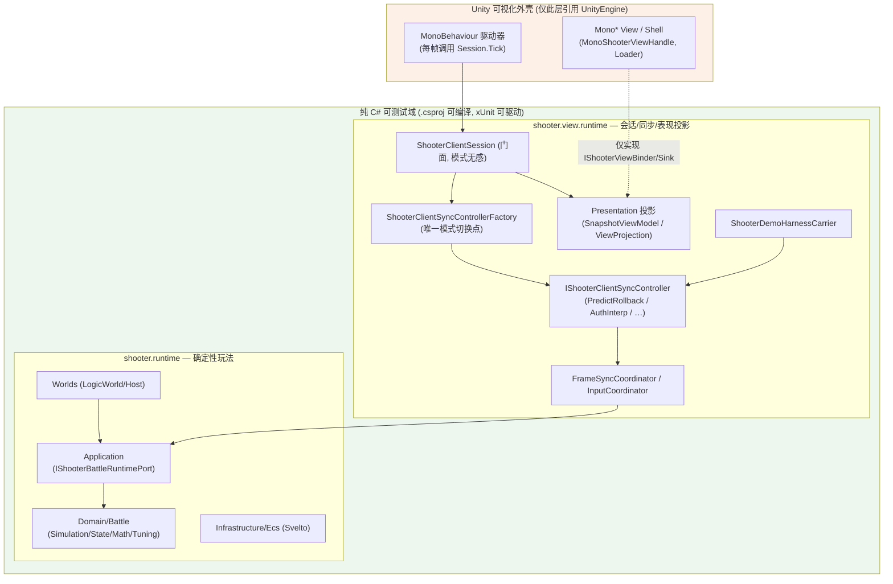
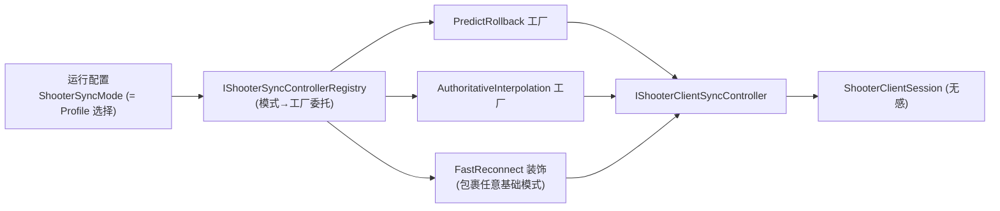
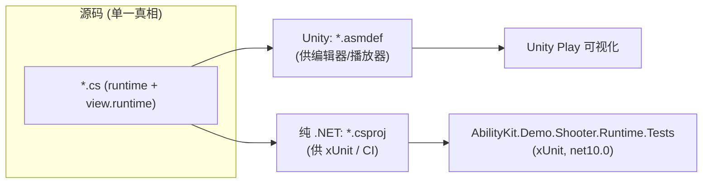
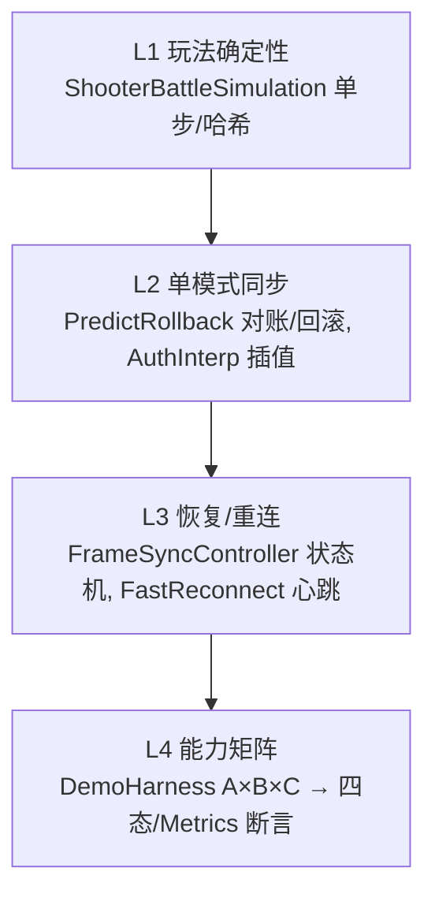
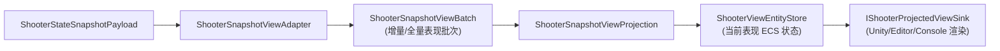
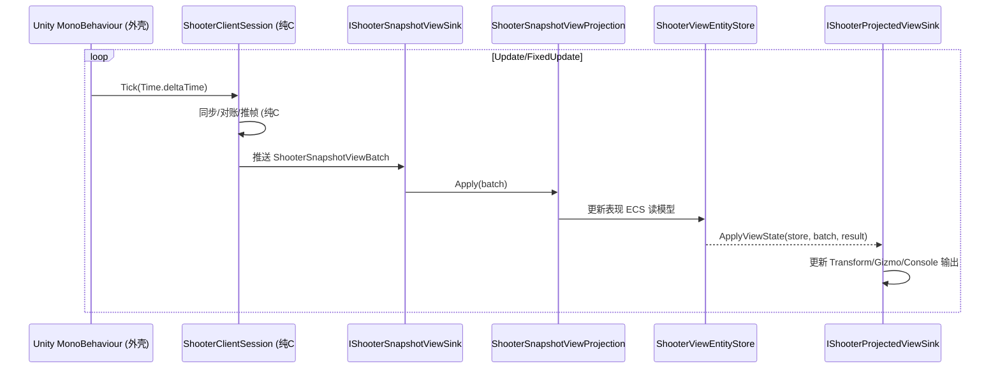
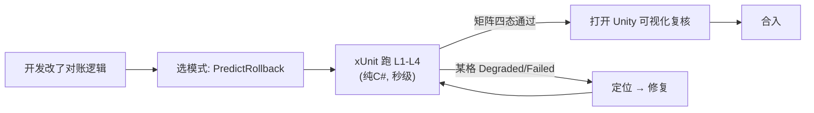

# Shooter View / Runtime 整体设计（可切换同步模式 + 纯 C# 先行测试）

> 本文回答一个架构问题：Shooter 示例既然定位为「框架同步能力展柜」，那么它的 `runtime` 与 `view.runtime` 两层应当如何整体设计，才能做到 ——
>
> 1. **同一份玩法 + 表现，可切换多种同步模式运行**；
> 2. **核心逻辑在纯 C# 层即可先行测试（无需打开 Unity）**；
> 3. **Unity 只是「可视化外壳」，不承载任何同步/玩法语义**。
>
> 配套：[`Docs/Shooter同步能力演示流程与设计.md`](Shooter同步能力演示流程与设计.md)（能力演示流程）、[`Docs/网络同步抽象审计与能力矩阵.md`](网络同步抽象审计与能力矩阵.md)（A 轴能力基线）。

---

## 1. 设计目标与现状判断

### 1.1 三条核心目标

| 目标 | 含义 | 当前达成度 |
|------|------|-----------|
| G1 可切换同步模式 | 同一 runtime+presentation，通过一个开关切换 PredictRollback / AuthoritativeInterpolation / FastReconnect / … | 🟡 已有单一切换点，但仅 2 种模式落地 |
| G2 纯 C# 先行测试 | 不依赖 UnityEngine，xUnit 直接驱动玩法+同步+对账+矩阵 | ✅ 基本达成（已有测试工程在用） |
| G3 Unity 仅可视化 | UnityEngine 依赖只出现在「渲染外壳」边缘，逻辑零耦合 | 🟡 大体达成，存在个别 Mono* 耦合点需收口 |

### 1.2 现状关键事实（已核对）

- **同步模式切换是单一入口**：[`ShooterClientSyncControllerFactory.Create(NetworkSyncModel, ...)`](../Unity/Packages/com.abilitykit.demo.shooter.view.runtime/Runtime/Client/Synchronization/ShooterClientSyncControllerFactory.cs:37) 是唯一选择策略的地方，`ShooterClientSession` 门面对模式无感知。当前 `switch` 只实现 `PredictRollback`、`AuthoritativeInterpolation`，其余 `throw NotSupportedException`。
- **view.runtime 已可纯 C# 编译**：测试工程 [`AbilityKit.Demo.Shooter.Runtime.Tests.csproj`](../src/AbilityKit.Demo.Shooter.Runtime.Tests/AbilityKit.Demo.Shooter.Runtime.Tests.csproj:12) 直接 `ProjectReference` 了 `AbilityKit.Demo.Shooter.View.Runtime.csproj`，说明 view.runtime 存在与 asmdef 平行的 .csproj 镜像，且能脱离 Unity 被 xUnit 引用。
- **核心同步链路已被纯 C# 测试覆盖**：`ShooterDemoHarnessCarrierTests`、`ShooterClientSyncStrategyContractTests` 直接 `new ShooterClientPredictRollbackSyncController(...)` 并跑 DemoHarness 场景 —— 即 G2 已在运转。
- **两层边界清晰**：`runtime` 为纯确定性玩法（Domain/Application/Worlds/Infrastructure(Svelto)），`view.runtime` 为客户端会话+同步适配+表现投影。Unity 耦合集中在 `Presentation/View/Mono*`（如 `MonoShooterViewHandle`）。

结论：**架构骨架是对的，目标基本达成**。需要的是「把已有的单点切换显式上升为一等设计、把 Unity 耦合收口到最薄边缘、把模式矩阵补齐」，而不是推倒重建。

---

## 2. 分层与依赖方向（目标态）

**铁律：依赖只能从 Unity 外壳指向纯 C# 域，反向不允许。** 纯 C# 域内的任何类型都不得 `using UnityEngine`。Unity 外壳通过实现纯 C# 域定义的接口（`IShooterViewBinder` / `IShooterSnapshotViewSink` / `IShooterViewShellLoader`）接入。

---

## 3. G1：可切换同步模式的设计

### 3.1 切换点收敛为一等装配

当前切换点已存在但偏「隐式」（埋在 factory 的 switch 里，且 key 是兼容别名 `NetworkSyncModel`）。目标态把它提升为显式、可注册、与框架 A 轴 `NetworkSyncProfile` 对齐的装配：

设计要点：
- **注册表替代硬 switch**：把 `ShooterClientSyncControllerFactory` 的 `switch` 改造成「模式 → 构造委托」的注册表（`Register(mode, factory)`）。新模式接入只需注册，不改门面、不改既有分支 —— 这正是「设计得好就能扩展」的落点。
- **FastReconnect 作为装饰而非并列模式**：FastReconnect 本质是「在某基础回放模式上叠加断线续帧能力」，已由 `ShooterFastReconnectDriver` 包裹实现。注册表层面应允许「基础模式 × 是否启用 FastReconnect」组合，而非把它当成与 PredictRollback 平级的互斥枚举。
- **门面零分支**：`ShooterClientSession` 仅持有 `IShooterClientSyncController`，所有模式差异在接口后。这一点现状已满足，需保持。

### 3.2 模式契约统一

所有模式都实现同一接口 [`IShooterClientSyncController`](../Unity/Packages/com.abilitykit.demo.shooter.view.runtime/Runtime/Client/Synchronization/IShooterClientSyncController.cs:25)，它已同时绑定框架中性契约 `IClientSyncStrategy<ShooterPlayerCommand, ShooterRemoteSnapshotSample>` 与 `INetworkSyncController`。这保证：

- DemoHarness 通过中性契约统一驱动任意模式（A 轴）；
- 富类型诊断（`LastReconciliationResult` / `FastReconnectPhase` / `LastFastReconnectHealthEvents`）面向演示可观测。

### 3.3 模式能力矩阵（目标补齐）

| 模式 | 现状 | 目标 |
|------|------|------|
| PredictRollback | ✅ 落地 + 测试 | 保持基线 |
| AuthoritativeInterpolation | ✅ 落地 | 补插值诊断断言 |
| FastReconnect（装饰） | ✅ 落地 | 升级为「可叠加任意基础模式」 |
| 服务端回溯命中判定 (LagComp) | 🔴 空转 | 作为下一模式/能力接入（见配套文档 §8） |

---

## 4. G2：纯 C# 先行测试的设计

### 4.1 双投影工程（asmdef ↔ csproj）

这是整个可测试性的基石，现状已采用，应作为强制约定固化：

- 同一份 `.cs` 被两套工程文件消费：Unity 侧 asmdef、.NET 侧 csproj。
- 测试工程只引用 .csproj，因此**任何同步逻辑在 PR 阶段即可被 CI 验证**，无需 Unity License、无需打开编辑器。
- 约定：凡放进 `runtime` / `view.runtime` 的逻辑代码，必须能被 csproj 编译 —— 即不得引入 UnityEngine 符号。违反即破坏 G2。

### 4.2 测试金字塔

- L1–L2 已有（`ShooterClientSyncStrategyContractTests` 等）。
- L4 已有 `ShooterDemoHarnessCarrierTests`，是「展柜」可回归的核心 —— 每种模式 × 网络条件组合的四态结果都能被断言。
- 建议把 L4 升级为「矩阵快照测试」：对整张 A×B×C 的 `DemoHarnessBatchSummary` 做基线快照，回归时一眼看出哪格从 Completed 掉到 Degraded/Failed。

### 4.3 确定性要求

纯 C# 先行测试成立的前提是玩法确定性：`runtime` 内 `ShooterBattleSimulation` 必须无浮点不确定来源、无 `UnityEngine.Random`/`Time`，状态哈希 `ComputeStateHash` 可复现。这也是 PredictRollback 对账与全量快照恢复能被断言的基础。

---

## 5. G3：Unity 仅可视化的设计

### 5.1 边界接口（纯 C# 定义，Unity 实现）

`view.runtime` 已定义了一组面向表现的接口，Unity 外壳实现它们即可，逻辑零下沉：

| 纯 C# 接口（view.runtime） | Unity 外壳实现 | 职责 |
|---------------------------|---------------|------|
| `IShooterSnapshotViewSink` | Snapshot 接收适配层 | 接收 `ShooterSnapshotViewBatch`，不得承载宿主渲染语义 |
| `ShooterProjectedSnapshotViewSink` | Projection 适配器 | 调用 `ShooterSnapshotViewProjection`，把 batch 增量合并进 `ShooterViewEntityStore` |
| `IShooterProjectedViewSink` | Unity / Editor / Console 渲染汇 | 只消费投影后的 `ShooterViewEntityStore` 与 apply 结果，负责渲染/诊断缓存 |
| `IShooterViewBinder` | `MonoShooterViewHandle` 注册 | 实体↔视图绑定 |
| `IShooterViewShellLoader` | `ResourceShooterViewShellLoader` | 资源加载（Unity 资源系统） |

### 5.2 表现投影流水线

Shooter 表现层的正式边界是 **snapshot → view batch → projection/store → render sink**，而不是“宿主直接从 delta batch 里拼 GameObject 状态”：

约束：

- `ShooterSnapshotViewBatch` 是传输批次，可携带增量、移除、事件与来源信息，但不是长期表现状态。
- `ShooterSnapshotViewProjection` 是唯一负责把 batch 应用成当前表现实体状态的层，包括缺失实体清理、显式移除、组件 upsert。
- `ShooterViewEntityStore` 是表现层的 ECS-style 读模型，渲染宿主应从 store 读取实体/组件，而不是重复实现 batch 合并规则。
- Unity Mono、Editor SceneView、Console renderer 都应位于 `IShooterProjectedViewSink` 或等价渲染适配层之后；如果需要保留 `IShooterSnapshotViewSink`，应通过 `ShooterProjectedSnapshotViewSink` 包装。
- 事件仍可从源 batch 缓存为短生命周期视觉提示，但实体当前态必须来自 projection/store。

宿主侧落地约定：Editor SceneView 与 Console 都应把 `ShooterProjectedSnapshotViewSink` 作为 batch 入口；Renderer/Sink 只实现 `IShooterProjectedViewSink` 语义，即读取 `ShooterViewEntityStore` 绘制 Gizmo、文本网格或 GameObject。这保证不同宿主共享同一套增量合并、实体移除、组件 upsert 规则。

### 5.3 驱动方向

- Unity 侧只做两件事：**把 `deltaTime` 喂给 `Session.Tick`**、**把 projection/store 给出的当前表现态画出来**。
- 没有 Unity 的环境（CI/控制台）用一个纯 C# 驱动器替换 MonoBehaviour，配合 `ShooterNullSnapshotViewSink`、`ShooterProjectedSnapshotViewSink` 或断言型 projected sink，即可跑完整流程 —— 这正是 DemoHarness 在做的事。

### 5.4 待收口的耦合点

现状 `Presentation/View/` 下混有 `Mono*` 类型（`MonoShooterViewHandle`、`ResourceShooterViewShellLoader`）。目标态建议：

- 将所有 `Mono*` / 引用 UnityEngine 的类型物理隔离到独立子程序集（如 `AbilityKit.Demo.Shooter.View.Unity`，仅 asmdef、无 csproj 镜像）；
- `view.runtime` 主程序集保持「可被 csproj 纯编译」的纯净度。
- 这样 G2 与 G3 互为保证：能进 csproj 的就是纯逻辑，进不去的就是 Unity 外壳。

---

## 6. 端到端：一次「切模式 + 先测后看」的工作流

价值闭环：**绝大多数同步正确性问题在纯 C# 矩阵测试阶段暴露，Unity 只用于最终视觉复核**，而非调试主场。

---

## 7. 与现状的差距清单（落地建议）

| 项 | 现状 | 目标 | 优先级 |
|----|------|------|--------|
| 模式切换 | factory 硬 switch，2 模式 | 注册表 + FastReconnect 装饰化 | 中 |
| Unity 耦合收口 | Mono* 混在 view.runtime | 拆出 `.View.Unity` 子程序集 | 中 |
| 矩阵回归 | 散点 carrier 测试 | BatchSummary 快照基线 | 高（低成本高收益） |
| 模式补齐 | 缺 LagComp 等 | 按展柜目标逐个接入 | 依路线图 |
| 时间步进 | tickRate 推算 fixedDelta | 接入框架时间锚族 | 中（见配套文档 §8） |

---

## 8. 小结

Shooter 的 view/runtime 已经具备「可切换同步模式 + 纯 C# 先行测试 + Unity 仅可视化」的正确骨架：模式切换有单一入口、view.runtime 可脱 Unity 编译并已被 xUnit 驱动、表现通过接口与 Unity 解耦。

整体设计的方向不是重写，而是**把三件事做实**：(1) 把模式切换从硬 switch 升级为注册表并让 FastReconnect 成为可叠加装饰；(2) 把 `Mono*` 物理拆到独立 Unity 子程序集，确保「能进 csproj = 纯逻辑」这条线干净；(3) 把 DemoHarness 的 A×B×C 矩阵升级为四态快照基线，使「先测后看」的回归闭环真正成型。
