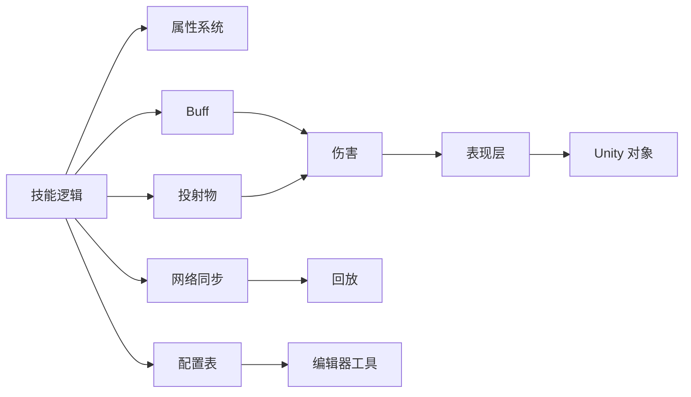
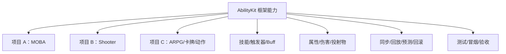
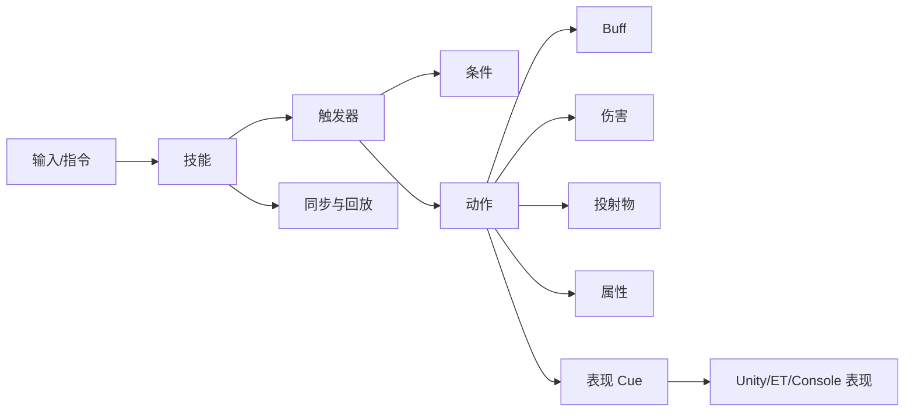
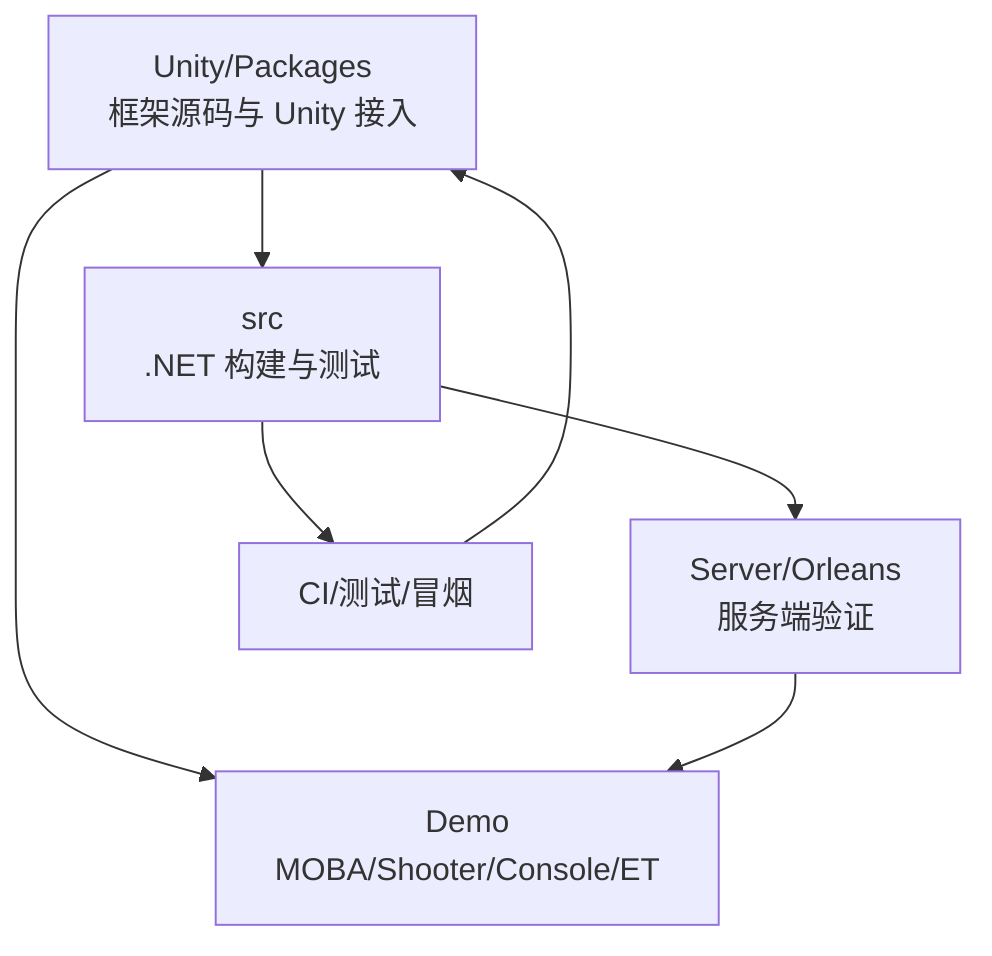
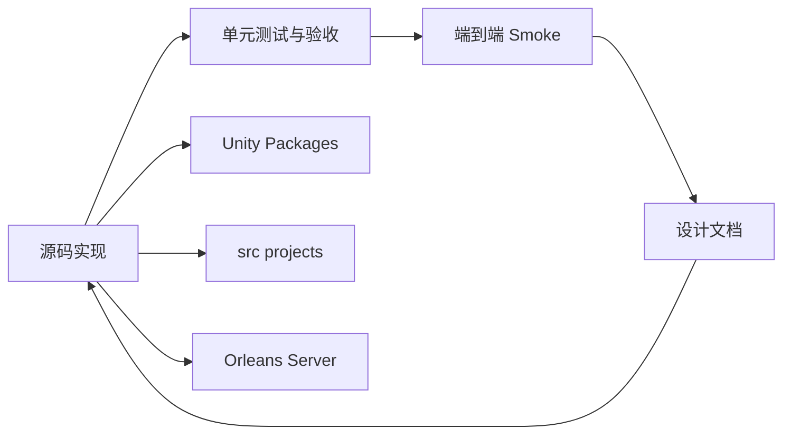
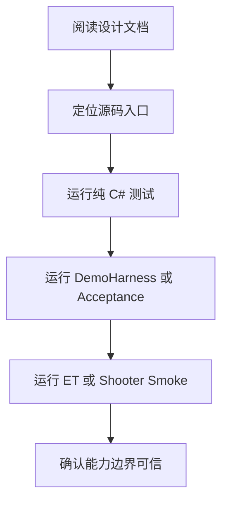

# 序章：为什么需要 AbilityKit

> AbilityKit 的目标不是再造一个“技能系统插件”，而是把项目中最容易越写越重、越重越难改的战斗能力表达，抽象成一套可以跨项目复用、可测试、可组合、可迁移的框架资产。

---

## 1. 问题从哪里来

很多游戏项目的战斗系统并不是从一开始就被完整设计出来的。更常见的过程是：

1. 先为了第一个角色、第一个技能、第一个怪物把功能写出来；
2. 再随着策划需求增加，不断补技能效果、Buff、投射物、触发器、表现、判定、网络同步；
3. 当某个效果实现不了时，在现有代码上打补丁；
4. 当补丁越来越多时，系统开始变得难以理解、难以测试、难以复用；
5. 最后大家都知道需要重构，但重构成本已经高到很难真正开始。

这类问题通常不是某个程序写得不够好，而是游戏开发天然会面对几个压力：

| 压力 | 典型表现 | 长期后果 |
|------|----------|----------|
| 需求变化快 | 技能、Buff、装备、怪物机制经常变 | 代码不断分叉和特判 |
| 玩法堆量快 | 先实现，再补边界 | 抽象滞后于需求增长 |
| 表现绑定深 | 逻辑、动画、特效、UI、音效互相调用 | 想改逻辑会牵动表现层 |
| 配置与代码混杂 | 有些效果写配置，有些效果写代码 | 规则来源不统一 |
| 联机与单机差异 | 单机能跑，联机、回放、预测、回滚又要改一遍 | 后期改造代价大 |
| 项目周期紧 | 没有时间停下来重构 | 补丁继续叠加 |

最终形成的状态是：系统还能跑，但越来越依赖隐性上下文。维护成本持续上升，测试覆盖困难，跨项目复用几乎不可行。

---

## 2. 为什么战斗框架经常越写越难重构

战斗系统是游戏项目里最容易和具体项目绑定的部分。它同时连接：

- 角色属性；
- 技能释放；
- Buff 生命周期；
- 伤害结算；
- 投射物与命中；
- 动画、特效、音效、镜头；
- AI、关卡、怪物机制；
- 网络同步、回放、反作弊；
- 配置表、编辑器、热更新；
- 运营活动和特殊玩法。

当这些内容在一个项目中长期混写后，重构会变得很困难：

看起来只是“改一个技能机制”，实际可能会牵动配置、运行时、表现层、网络消息、回放和测试。很多团队都会经历这样的阶段：

> 想重构，但一动就影响线上内容；想抽象，但旧逻辑太多；想复用，但项目绑定太深。

因此，AbilityKit 的出发点不是等某个项目后期再做一次大重构，而是在框架层提前把容易失控的边界拆出来。

---

## 3. 为什么大型团队应该沉淀战斗框架

如果一个公司持续做多个战斗向项目，那么每个项目都从零开始写技能、Buff、属性、投射物、网络同步和表现解耦，会产生大量重复成本。

这些重复成本不只体现在代码量上，还体现在：

| 重复事项 | 每个项目重新做的代价 |
|----------|----------------------|
| 技能表达 | 每个项目重新定义技能输入、释放、效果、冷却、目标选择 |
| Buff 系统 | 每个项目重新处理叠层、刷新、免疫、驱散、生命周期 |
| 属性与修饰器 | 每个项目重新实现公式、上下限、快照、派生属性 |
| 投射物/命中 | 每个项目重新处理发射、飞行、碰撞、命中过滤 |
| 触发器 | 每个项目重新做事件、条件、动作、优先级、延迟执行 |
| 表现解耦 | 每个项目重新拆逻辑事件和表现事件 |
| 网络同步 | 每个项目重新处理帧同步、状态同步、预测、回滚、回放 |
| 测试体系 | 每个项目重新补单测、冒烟、验收和调试工具 |

大型团队更合理的做法，是把共性能力沉淀成框架，让项目只关注差异化玩法：

AbilityKit 希望沉淀的是“战斗能力表达层”和“运行时组织层”，而不是替每个项目决定具体玩法。框架应该提供稳定边界，项目在边界内组合能力。

---

## 4. 不是只做技能系统，而是做战斗能力框架

传统意义上的技能系统通常关注：

- 技能配置；
- 技能释放；
- 技能效果；
- 冷却、消耗、目标。

但真实项目里，一个技能效果往往会自然扩展到更多系统：

因此 AbilityKit 把“技能”放在更大的能力体系里看待：

1. 技能只是战斗表达的入口之一；
2. 触发器用于表达事件、条件、动作的组合；
3. Buff、Projectile、Damage、Attribute 是常见战斗语义模块；
4. Host、World、DI、ECS 提供运行时组织方式；
5. Snapshot、StateSync、FrameSync、Rollback、Record 支撑联机、回放和确定性验证；
6. Presentation 把逻辑结果转成表现事件，避免逻辑层依赖 Unity 对象。

这也是 AbilityKit 不选择只做一个单点插件的原因：如果技能系统不能和运行时、配置、表现、同步、测试一起设计，后期仍然会回到“边写边补丁”的老路。

---

## 5. 技术选型：为什么要参考 GAS 与 EGamePlay

### 5.1 GAS 带来的启发

Unreal 的 Gameplay Ability System 是游戏战斗框架领域的关键参考。它证明了几件事：

- Ability、Effect、Attribute、Tag 可以形成稳定的玩法表达模型；
- 技能不是孤立逻辑，而是需要和属性、状态、标签、预测、网络复制协作；
- 复杂战斗项目需要一套可组合、可扩展的能力系统，而不是散落在角色脚本里的函数。

但 AbilityKit 不直接复制 GAS，原因是：

| 方面 | GAS | AbilityKit 的取舍 |
|------|-----|-------------------|
| 引擎环境 | 深度绑定 Unreal | 面向 Unity + .NET，多运行时适配 |
| 网络模型 | Unreal 网络复制体系 | 独立支持帧同步、状态同步、预测、回滚、回放 |
| 玩法表达 | Ability/Effect/Tag/Attribute | Ability/Triggering/Combat/Attribute/Presentation 组合 |
| 工程复用 | 依赖 Unreal 项目形态 | 以 Unity Package 和 .NET Project 复用 |
| 服务端 | Unreal Dedicated Server 路线 | 可接 Unity、纯 .NET、ET、Orleans 等多种运行环境 |

GAS 对 AbilityKit 的意义，是提供“战斗能力应该被框架化”的方向，而不是提供可以直接搬运的实现。

### 5.2 EGamePlay 带来的启发

EGamePlay 一类 Unity 侧玩法框架的价值，在于更贴近 Unity 项目常见工作流：

- 用组件、能力、效果、触发条件组织玩法；
- 更容易被 Unity 团队理解和接入；
- 更适合从 Demo 或项目内逐步演进。

AbilityKit 会吸收这类方案的易用性，但进一步强调：

1. 配置、运行时和测试要分层；
2. 逻辑层不能绑定 Unity 表现对象；
3. 框架能力要能被 .NET 单元测试和服务端复用；
4. 同步、回放、预测、回滚不能作为后期补丁，而应作为基础能力预留。

---

## 6. 技术选型：为什么同时考虑 ET 与 Orleans

战斗框架最终必须回答一个问题：逻辑到底运行在哪里？

不同项目会有不同答案：

- 单机游戏可能只运行在 Unity 客户端；
- 小型联机项目可能使用 Unity Headless 或简单 .NET 服务；
- 强联网项目可能有独立房间服、网关、匹配、战斗服；
- 热更新项目可能使用 ET 这类前后端一体框架；
- 大规模在线项目可能使用 Orleans 这类 Actor/Virtual Actor 服务端模型。

### 6.1 ET 的价值

ET 的优势在于：

- 前后端统一 C# 技术栈；
- 热更新和模块化经验丰富；
- Entity/Component/System 模式适合游戏逻辑组织；
- 对国内 Unity 服务端开发生态比较友好。

AbilityKit 不把自己设计成 ET 专属模块，而是保留适配空间：ET 可以作为宿主，AbilityKit 提供战斗能力、触发器、配置、表现事件和同步抽象。

### 6.2 Orleans 的价值

Orleans 的优势在于：

- Virtual Actor 模型适合房间、玩家、会话、战斗实例；
- .NET 生态成熟，方便接入网关、后台、监控和云部署；
- 状态、生命周期、分布式调度有成熟抽象；
- 适合把战斗房间、帧同步协调、状态同步管线服务化。

AbilityKit 引入 Orleans 示例，不是要求所有项目都使用 Orleans，而是验证框架可以脱离 Unity 场景，在 .NET 服务端环境中复用。

---

## 7. 为什么最终选择 Unity Package + .NET Project 的方案

AbilityKit 当前采用“双入口”组织：

| 入口 | 作用 |
|------|------|
| Unity Package | 面向 Unity 项目直接安装、引用和运行 Demo |
| .NET Project | 面向单元测试、服务端、工具链、CI 和跨运行时复用 |

这个方案的核心原因是：

1. **Unity 项目需要 Package 化**：大型团队不能靠复制目录复用框架，应该通过 package 管理依赖和版本；
2. **框架代码需要可测试**：如果所有逻辑只能在 Unity Editor 里验证，反馈速度太慢；
3. **服务端需要复用逻辑**：战斗逻辑、配置、同步协议不应只能在客户端存在；
4. **Demo 需要覆盖多形态**：MOBA、Shooter、ET、Orleans、Console 都可以验证不同宿主；
5. **技术选型要可替换**：框架不能绑死某一个 ECS、某一个服务端、某一种同步模型。

这种组织方式让 AbilityKit 可以同时服务三个目标：

- Unity 项目能直接用；
- .NET 测试能快速跑；
- 服务端和工具链能复用核心能力。

更重要的是，它让设计文档可以拿真实源码和真实测试作证，而不是只停留在愿景层面。当前源码中已经形成四条互相印证的证据链：

| 证据链 | 代表入口 | 说明 |
|--------|----------|------|
| Unity package | `Unity/Packages/com.abilitykit.*` | 项目接入、运行时包、Unity 表现层、包内测试与 asmdef 组织 |
| .NET projects | `src/AbilityKit.*` | 纯 C# 构建、单元测试、Demo runtime、Console/ET/Shooter 复用 |
| Server projects | `Server/Orleans/src` | Gateway、RoomGrain、BattleGrain、FrameSyncGrain 与 smoke 验收 |
| Design docs | `Docs/design` | 把源码入口、设计意图、运行流程、测试门禁组织成稳定的阅读路径 |

因此，阅读 AbilityKit 时不要只看 package，也不要只看 Demo。更稳妥的方式是：先从能力地图理解模块边界，再进入源码入口，最后通过测试和 smoke 验证文档描述是否真实。

---

## 8. AbilityKit 的设计原则

AbilityKit 初版设计遵循以下原则：

| 原则 | 含义 |
|------|------|
| 能力中心 | 文档和代码围绕“提供什么能力”组织，而不是围绕文件夹堆砌 |
| 逻辑表现分离 | 战斗逻辑输出稳定事件或快照，表现层自行消费 |
| 配置与代码协作 | 配置表达常规组合，代码承载复杂扩展点 |
| 可测试优先 | 关键能力要能脱离 Unity Editor 做单元测试和契约测试 |
| 多宿主适配 | Unity、Console、ET、Orleans 都只是宿主，不是框架唯一运行环境 |
| 同步前置 | 帧同步、状态同步、预测、回滚、回放从设计期进入能力地图 |
| 渐进接入 | 项目可以只接入 Triggering、Combat 或 Sync 中的一部分，不要求一次性全量替换 |
| 可替换实现 | ECS、网络、配置加载、表现层都应保留替换空间 |

---

## 9. 如何用测试理解 AbilityKit

AbilityKit 把测试体系当作框架设计的一部分。原因很直接：战斗框架最怕“看起来抽象正确，组合起来却跑不通”。所以源码中同时保留了几种验证层级：

| 验证层级 | 代表入口 | 能证明什么 |
|----------|----------|------------|
| 纯 C# 单测 | `src/AbilityKit.World.DI.Tests`、`src/AbilityKit.Network.Runtime.Tests` | DI、同步时钟、DemoHarness、健康事件等基础契约可以脱离 Unity 验证 |
| Demo runtime 测试 | `src/AbilityKit.Demo.Moba.Tests`、`src/AbilityKit.Demo.Shooter.Runtime.Tests` | MOBA/Shooter 示例不是展示脚本，而是可验收的战斗运行时 |
| Unity 测试工程 | `Unity/AbilityKit.Triggering.Tests.csproj`、`Unity/AbilityKit.Game.UnitTests.csproj` | Unity 包内逻辑、Editor/PlayMode 外壳和生成工程入口可被批处理校验 |
| Orleans 测试 | `Server/Orleans/src/AbilityKit.Orleans.*.Tests` | Gateway、Grain、Shooter smoke 具备服务端级回归入口 |
| Smoke 脚本 | `tools/run_et_battle_smoke.ps1`、`Server/Orleans/tools/run_shooter_smoke.ps1` | ET 与 Orleans 链路能跑过真实输入、快照、重连、回放和状态哈希 |

这也是序章反复强调“可测试”的原因。一个技能框架如果只能在完整游戏场景里手工点按钮验证，就很难沉淀成跨项目资产；而 AbilityKit 希望每个核心能力都能找到对应的自动化验证入口。

---

## 10. 这套框架希望解决什么，不解决什么

### 10.1 希望解决

- 降低每个项目重复建设战斗系统的成本；
- 减少技能、Buff、属性、投射物、伤害、表现之间的硬绑定；
- 给复杂玩法提供稳定扩展点；
- 让核心战斗逻辑可以被单元测试、冒烟测试和验收矩阵覆盖；
- 让客户端、服务端、工具链共享一部分稳定模型；
- 为联机、回放、预测、回滚预留统一路径；
- 让大型团队可以沉淀跨项目框架资产。

### 10.2 暂不试图解决

- 不替代 Unity、ET 或 Orleans 的全部工程体系；
- 不强制所有项目使用同一种 ECS；
- 不规定所有技能必须完全配置化；
- 不直接替项目设计具体战斗数值和玩法规则；
- 不把框架做成无法裁剪的一体化大黑盒。

---

## 11. 序章结论

AbilityKit 的起点是一个非常现实的问题：游戏战斗系统经常在需求增长中越写越重，越重越难改，越难改越只能继续打补丁。

如果一个团队只做一个小项目，局部补丁也许可以接受；但如果要持续生产多个战斗向项目，就需要把重复建设的能力抽象成框架。AbilityKit 选择从 Unity Package 和 .NET Project 双入口出发，参考 GAS 的能力体系、Unity 侧玩法框架的易用性、ET 的游戏逻辑组织经验，以及 Orleans 的服务端 Actor 模型，最终形成一套面向多项目复用的战斗能力框架。

这份设计文档后续的所有章节，都围绕同一个目标展开：如何把战斗能力从具体项目里拆出来，变成稳定、可测试、可组合、可迁移的框架资产。
