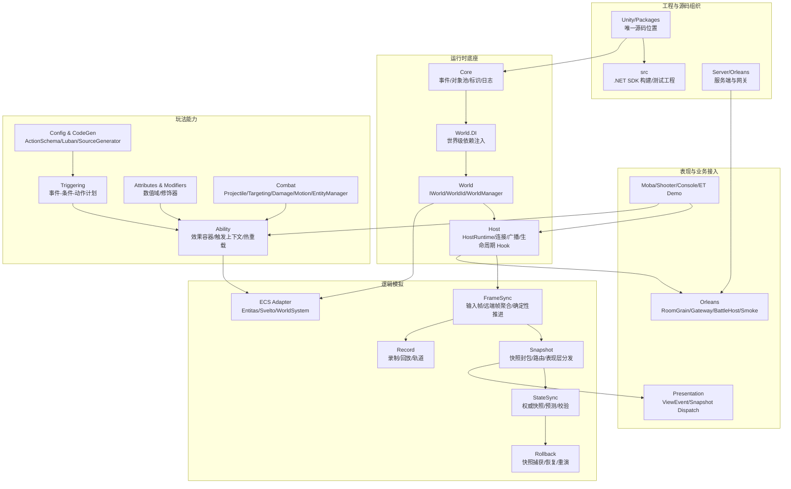

# AbilityKit 框架设计文档

> AbilityKit 是一个以“战斗能力表达”为中心的 Unity + .NET 框架。它不只提供技能系统，而是把逻辑世界、依赖注入、Host 运行时、ECS、触发器、战斗模块、网络同步、回放、表现层解耦和 Orleans 服务端串成一套可组合的能力体系。

---

## 1. 文档组织原则

本目录不再强制按已有文件夹结构解释框架，而是按“框架提供什么能力、为什么这样设计、源码如何落地、关键流程如何运行”组织阅读。

每篇设计文档应尽量包含：

| 内容 | 说明 |
|------|------|
| 能力定位 | 这个模块解决什么问题，不解决什么问题 |
| 设计方案 | 抽象边界、核心对象、生命周期、扩展点 |
| 源码入口 | 对应 Unity package、.NET project、Server project |
| 运行流程 | Mermaid 流程图或时序图 |
| 使用路径 | Demo、测试、运行入口 |
| 风险与约束 | 生命周期、线程、确定性、性能、跨端约束 |

---

## 2. 总体能力地图

---

## 3. 推荐阅读路线

### 3.1 框架使用者路线

1. [序章：为什么需要 AbilityKit](00-Prologue.md)
2. [AbilityKit 能力地图](01-OverviewAndGettingStarted/00-AbilityKitCapabilityMap.md)
3. [AbilityKit 是什么](01-OverviewAndGettingStarted/01-WhatIsAbilityKit.md)
4. [核心概念](01-OverviewAndGettingStarted/02-CoreConcepts.md)
5. [逻辑世界概述](02-LogicalWorldDesign/01-WorldOverview.md)
6. [Host 运行时](03-LogicalWorldHostDesign/01-HostRuntime.md)
7. [技能系统架构](08-GameplayModules/01-SkillSystemArchitecture.md)
8. [触发器系统](08-GameplayModules/02-TriggeringSystem.md)
9. [网络同步能力地图](07-NetworkSynchronization/00-SynchronizationCapabilityMap.md)

### 3.2 框架扩展者路线

1. [服务容器](02-LogicalWorldDesign/05-ServiceContainer.md)
2. [系统设计](02-LogicalWorldDesign/04-SystemDesign.md)
3. [ECS 核心概念](06-ECSArchitecture/01-ECSCoreConcepts.md)
4. [快照分发](04-PresentationLayerDesign/02-SnapshotDispatch.md)
5. [配置系统](05-CommonModules/04-ConfigurationSystem.md)
6. [投射物系统](08-GameplayModules/04-ProjectileSystem.md)
7. [属性系统](08-GameplayModules/05-AttributeSystem.md)

### 3.3 服务端/联机路线

1. [网络同步能力地图](07-NetworkSynchronization/00-SynchronizationCapabilityMap.md)
2. [帧同步机制](07-NetworkSynchronization/01-FrameSync.md)
3. [状态同步](07-NetworkSynchronization/02-StateSync.md)
4. [回滚预测](07-NetworkSynchronization/03-RollbackPrediction.md)
5. [回放系统](07-NetworkSynchronization/04-ReplaySystem.md)
6. [会话协调](07-NetworkSynchronization/05-SessionCoordination.md)

---

## 4. 当前文档目录

### 00 序章

| 文档 | 状态 | 说明 |
|------|------|------|
| [00-序章：为什么需要 AbilityKit](00-Prologue.md) | 已新增 | 项目起因、战斗系统补丁化困境、跨项目复用诉求、GAS/EGamePlay/ET/Orleans 技术选型与 package 方案 |

### 01 概览与入门

| 文档 | 状态 | 说明 |
|------|------|------|
| [00-AbilityKit 能力地图](01-OverviewAndGettingStarted/00-AbilityKitCapabilityMap.md) | 已补充 | 以能力为中心解释整体架构与源码入口 |
| [01-AbilityKit 是什么](01-OverviewAndGettingStarted/01-WhatIsAbilityKit.md) | 已有 | 框架定位、核心能力、解决问题 |
| [02-核心概念](01-OverviewAndGettingStarted/02-CoreConcepts.md) | 已有 | 框架术语体系 |
| 03-快速开始 | 待补充 | 运行第一个 Demo |
| 04-项目结构 | 待补充 | Unity/Packages、src、Server 的关系 |

### 02 逻辑世界设计

| 文档 | 状态 | 说明 |
|------|------|------|
| [01-逻辑世界概述](02-LogicalWorldDesign/01-WorldOverview.md) | 已有 | IWorld 与 WorldId |
| [02-实体设计](02-LogicalWorldDesign/02-EntityDesign.md) | 已有 | 实体的创建与销毁 |
| [03-组件设计](02-LogicalWorldDesign/03-ComponentDesign.md) | 已有 | 组件的定义与使用 |
| [04-系统设计](02-LogicalWorldDesign/04-SystemDesign.md) | 已有 | 系统组织与执行 |
| [05-服务容器](02-LogicalWorldDesign/05-ServiceContainer.md) | 已有 | World.DI、生命周期、作用域 |

### 03 Host 运行时设计

| 文档 | 状态 | 说明 |
|------|------|------|
| [01-Host 运行时](03-LogicalWorldHostDesign/01-HostRuntime.md) | 已有 | HostRuntime、连接、广播、Tick |
| [02-Host 模块系统](03-LogicalWorldHostDesign/02-HostModules.md) | 已有 | 模块扩展机制 |
| [03-World 管理器](03-LogicalWorldHostDesign/03-WorldManager.md) | 已有 | 多世界创建、销毁、查询 |

### 04 表现层设计

| 文档 | 状态 | 说明 |
|------|------|------|
| [01-视图事件抽象](04-PresentationLayerDesign/01-ViewEventAbstraction.md) | 已有 | 逻辑事件与表现事件隔离 |
| [02-快照分发](04-PresentationLayerDesign/02-SnapshotDispatch.md) | 已有 | FrameSnapshotDispatcher 与 SnapshotPipeline |
| [03-跨平台实现](04-PresentationLayerDesign/03-CrossPlatform.md) | 已有 | Console/Unity/ET/Server 接入 |

### 05 通用模块

| 文档 | 状态 | 说明 |
|------|------|------|
| [01-事件系统](05-CommonModules/01-EventSystem.md) | 已有 | EventDispatcher 与发布订阅 |
| [02-对象池](05-CommonModules/02-ObjectPool.md) | 已有 | 对象复用与 GC 控制 |
| [03-定时器框架](05-CommonModules/03-TimerFramework.md) | 已有 | 时间推进和定时任务 |
| [04-配置系统](05-CommonModules/04-ConfigurationSystem.md) | 已重写 | 源码驱动的 ConfigDatabase、MOBA 配置门面、Luban/多源加载、TriggerPlan、ActionSchema、验证与多端接入 |

### 06 ECS 架构

| 文档 | 状态 | 说明 |
|------|------|------|
| [01-ECS 核心概念](06-ECSArchitecture/01-ECSCoreConcepts.md) | 已有 | Entity/Component/System |
| [02-Entitas 实现](06-ECSArchitecture/02-EntitasImplementation.md) | 已新增 | EntitasWorld、EntitasWorldComposer、模块治理、系统生命周期 |
| [03-Svelto 实现](06-ECSArchitecture/03-SveltoImplementation.md) | 已新增 | SveltoWorldModule、SveltoWorldContext、EnginesRoot、EntitiesDB 与提交调度器 |
| [04-查询与遍历](06-ECSArchitecture/04-QueryAndTraversal.md) | 已新增 | EntityQuery、EntityWorld.QueryImpl、Entitas Group、Svelto EntitiesDB 查询策略 |

### 07 网络同步

| 文档 | 状态 | 说明 |
|------|------|------|
| [00-网络同步能力地图](07-NetworkSynchronization/00-SynchronizationCapabilityMap.md) | 已补充 | 帧同步、状态同步、快照、预测、回滚、回放总览 |
| [01-帧同步机制](07-NetworkSynchronization/01-FrameSync.md) | 已有 | Lockstep 与输入帧 |
| [02-状态同步](07-NetworkSynchronization/02-StateSync.md) | 已重写 | 源码驱动的 WorldStateSnapshot、SnapshotBuffer、PredictionCoordinator、快照打包、Shooter packed/pure-state 同步 |
| [03-回滚预测](07-NetworkSynchronization/03-RollbackPrediction.md) | 已重写 | 源码驱动的 IRollbackStateProvider、RollbackCoordinator、环形快照、客户端预测、哈希对账与 Host 回滚重演 |
| [04-回放系统](07-NetworkSynchronization/04-ReplaySystem.md) | 已补充 | RecordContainer、Track、ReplayController、Lockstep 回放、MOBA 回放文件 |
| [05-会话协调](07-NetworkSynchronization/05-SessionCoordination.md) | 已新增 | FramePacket、RemoteFrameAggregator、FramePacketNetAdapter、Room/Battle 协调 |

### 08 玩法模块

| 文档 | 状态 | 说明 |
|------|------|------|
| [00-玩法能力地图](08-GameplayModules/00-GameplayCapabilityMap.md) | 已补充 | Triggering、Ability、Combat、Record 的玩法能力总览 |
| [01-技能系统架构](08-GameplayModules/01-SkillSystemArchitecture.md) | 已重写 | 源码驱动的技能输入、释放准备、Pipeline、Triggering/Effect/Combat 协作 |
| [02-触发器系统](08-GameplayModules/02-TriggeringSystem.md) | 已重写 | 源码驱动的 TriggerPlan、TriggerRunner、JSON 计划库、MOBA 规则计划执行与持续计划调和 |
| [03-Buff 系统](08-GameplayModules/03-BuffSystem.md) | 已重写 | 源码驱动的 Buff 生命周期、叠层、持续行为、标签门禁与 Triggering 协作 |
| [04-投射物系统](08-GameplayModules/04-ProjectileSystem.md) | 已重写 | 源码驱动的 ProjectileWorld、ProjectileService、发射调度、命中策略、回滚与 MOBA 事件转译 |
| [05-属性系统](08-GameplayModules/05-AttributeSystem.md) | 已重写 | 源码驱动的 AttributeRegistry、AttributeContext、AttributeGroup、ModifierData、公式、约束与 MOBA 集成 |
| [06-伤害计算](08-GameplayModules/06-DamageCalculation.md) | 已重写 | 源码驱动的通用 DamageCalculationPipeline、MOBA DamagePipelineService、减伤、护盾、触发事件与快照输出 |

### 09 示例与验收

| 文档 | 状态 | 说明 |
|------|------|------|
| [01-Console Demo 解析](09-ImplementationExamples/01-ConsoleDemoAnalysis.md) | 已有 | Console Demo 架构解析 |
| [02-ET Demo 解析](09-ImplementationExamples/02-ET%20Demo%20Analysis.md) | 已新增 | ET Demo 的热更新层、视图事件 Sink、ActorId 与 ET EntityId 映射 |
| [03-MOBA Demo 解析](09-ImplementationExamples/03-MOBA%20Demo%20Analysis.md) | 已补充 | MOBA Runtime/Share/View 包协作总览 |
| [03.1-MOBA 专题总览](09-ImplementationExamples/MOBA/00-Overview.md) | 已新增 | MOBA 示例拆分阅读入口 |
| [03.2-MOBA 世界启动与运行时装配](09-ImplementationExamples/MOBA/01-WorldAndBootstrap.md) | 已新增 | Blueprint、Module、HostRuntime、服务生命周期 |
| [03.3-MOBA 输入、技能、配置与实体索引](09-ImplementationExamples/MOBA/02-InputSkillConfigEntity.md) | 已新增 | 输入、技能、配置、实体索引的合并说明 |
| [03.4-MOBA Buff、Projectile 与 Damage 管线](09-ImplementationExamples/MOBA/03-BuffProjectileDamage.md) | 已新增 | Buff 命令队列、投射物 Actor 绑定、伤害与治疗快照 |
| [03.5-MOBA 快照、表现层与预测回滚](09-ImplementationExamples/MOBA/04-SnapshotPresentationPrediction.md) | 已新增 | SnapshotEmitter、Dispatcher、Pipeline、远程驱动与预测回滚 |
| [03.6-MOBA 技能执行深潜](09-ImplementationExamples/MOBA/05-SkillExecutionDeepDive.md) | 已新增 | 输入事件、技能槽、释放策略、失败原因与帧同步约束 |
| [03.7-MOBA 配置、实体索引与生成深潜](09-ImplementationExamples/MOBA/06-ConfigEntitySpawnDeepDive.md) | 已新增 | 配置门面、多维实体索引、Actor BuildSpec 与生成注册 |
| [03.8-MOBA Buff 生命周期深潜](09-ImplementationExamples/MOBA/07-BuffLifecycleDeepDive.md) | 已新增 | Buff 命令队列、DrainPending、生命周期调和与重入保护 |
| [03.9-MOBA Projectile 与 Damage 深潜](09-ImplementationExamples/MOBA/08-ProjectileDamageDeepDive.md) | 已新增 | Projectile Actor、命中过滤、Damage/Heal、原因字段与快照 |
| [03.10-MOBA Trace、Context 与 Effect 执行深潜](09-ImplementationExamples/MOBA/09-TraceContextEffectDeepDive.md) | 已新增 | TraceTreeRegistry、MobaTraceRegistry、LineageInput、CombatExecutionContext、EffectInvoker 与验收 trace |
| [03.11-MOBA Trigger、Validation 与 Presentation Cue 深潜](09-ImplementationExamples/MOBA/10-TriggerValidationPresentationDeepDive.md) | 已新增 | TriggerExecutionGateway、Owner-bound Subscription、RuntimeValidation、StageTrigger、PresentationCue |
| [03.12-MOBA PlanActions DSL 与 Continuous Runtime 深潜](09-ImplementationExamples/MOBA/11-PlanActionsAndContinuousRuntimeDeepDive.md) | 已新增 | ActionSchema、PlanActionModule、ContinuousRuntimeView、LifecycleBinder、ContextSourceBoundary |
| [03.13-MOBA DI 与 System/Service 协作深潜](09-ImplementationExamples/MOBA/12-DIAndSystemServiceCollaborationDeepDive.md) | 已新增 | MobaServicesAutoModule、WorldService、WorldInject、System 调度、测试友好协作 |
| [04-Shooter Demo 与 Orleans Smoke](09-ImplementationExamples/04-Shooter%20Demo%20与%20Orleans%20Smoke.md) | 已补充 | Shooter 远程版闭环和烟测总览 |
| [04.1-Shooter 专题总览](09-ImplementationExamples/Shooter/00-Overview.md) | 已新增 | Shooter 示例拆分阅读入口 |
| [04.2-Shooter Runtime、Svelto 与战斗模拟](09-ImplementationExamples/Shooter/01-RuntimeSveltoSimulation.md) | 已新增 | RuntimePort、Svelto EntityManager、Simulation Tick |
| [04.3-Shooter Snapshot、Hash 与同步模型](09-ImplementationExamples/Shooter/02-SnapshotHashSync.md) | 已新增 | packed/pure-state snapshot、状态 hash、客户端同步控制器 |
| [04.4-Shooter Gateway、Orleans 与 Smoke 验收](09-ImplementationExamples/Shooter/03-GatewayOrleansSmoke.md) | 已新增 | RoomFlow、RoomGrain、BattleRuntimeAdapter、FrameSyncGrain、烟测 |
| [04.5-Shooter 客户端同步策略](09-ImplementationExamples/Shooter/04-ClientSyncStrategies.md) | 已新增 | ClientSession、输入协调、同步控制器工厂、packed/pure-state 应用器 |
| [04.6-Shooter 服务端流程与 Smoke 深潜](09-ImplementationExamples/Shooter/05-ServerFlowAndSmokeDeepDive.md) | 已新增 | Gateway、RoomGrain、BattleAdapter、FrameSyncGrain 与 Smoke 验收 |
| [04.7-Shooter 纯状态预算与兴趣范围深潜](09-ImplementationExamples/Shooter/06-PureStateBudgetAndInterest.md) | 已新增 | Budget、InterestScope、Baseline/Delta 与候选排序 |
| [04.8-Shooter Smoke 验证用例深潜](09-ImplementationExamples/Shooter/07-SmokeValidationCases.md) | 已新增 | 帧/哈希校验、stale 保护、late join、reconnect 验收 |
| [04.9-Shooter 网络模块深潜](09-ImplementationExamples/Shooter/08-NetworkModulesDeepDive.md) | 已新增 | Gateway Flow、FrameSyncCoordinator、Snapshot Controller、Lag Compensation、Reconnect |
| [04.10-Shooter Svelto 性能模式深潜](09-ImplementationExamples/Shooter/09-SveltoPerformanceModeDeepDive.md) | 已新增 | struct component、ExclusiveGroup、ScenarioRunner、Benchmark 与大规模预算诊断 |
| [04.11-Shooter 表现会话与视图管线深潜](09-ImplementationExamples/Shooter/10-PresentationSessionAndViewDeepDive.md) | 已新增 | PresentationFacade、Session、Stream、Projection、Binder、Reconnect 驱动 |
| [04.12-Shooter 插值、混合预测与诊断深潜](09-ImplementationExamples/Shooter/11-InterpolationAndPredictionDeepDive.md) | 已新增 | AuthoritativeInterpolation、HybridHeroPrediction、Diagnostics、DOTS Binder、TimeAnchor |

### 10 工程质量与测试

| 文档 | 状态 | 说明 |
|------|------|------|
| [01-正式测试流程、单元测试与冒烟测试](10-EngineeringQuality/01-TestingWorkflow.md) | 已新增 | 纯 C# 单元测试、契约测试、DemoHarness、Acceptance、Unity 自动化、MOBA/ET/Shooter Smoke 与稳定性收益 |

---

## 5. 源码入口索引

| 能力域 | Unity 源码入口 | .NET 构建入口 | 服务端入口 |
|--------|----------------|---------------|------------|
| Core | `Unity/Packages/com.abilitykit.core/Runtime` | `src/AbilityKit.Core` | - |
| World DI | `Unity/Packages/com.abilitykit.world.di/Runtime` | `src/AbilityKit.World.DI` | - |
| Host | `Unity/Packages/com.abilitykit.host/Runtime` | `src/AbilityKit.Host` | - |
| Host Extension | `Unity/Packages/com.abilitykit.host.extension/Runtime` | `src/AbilityKit.Host.Extension` | - |
| FrameSync | `Unity/Packages/com.abilitykit.world.framesync/Runtime` | `src/AbilityKit.World.FrameSync` | `Server/Orleans/src/AbilityKit.Orleans.Contracts/FrameSync` |
| Snapshot | `Unity/Packages/com.abilitykit.world.snapshot/Runtime` | `src/AbilityKit.World.Snapshot` | `Server/Orleans/src/AbilityKit.Orleans.Contracts/Battle` |
| StateSync | `Unity/Packages/com.abilitykit.world.statesync/Runtime` | `src/AbilityKit.World.StateSync` | Gateway state sync handlers |
| Triggering | `Unity/Packages/com.abilitykit.triggering/Runtime` | `src/AbilityKit.Triggering` | - |
| Ability | `Unity/Packages/com.abilitykit.ability/Runtime` | `src/AbilityKit.Ability` | Demo battle host loads runtime assemblies |
| Combat | `Unity/Packages/com.abilitykit.combat.*` | `src/AbilityKit.Combat.*` | Demo battle logic host |
| Record | `Unity/Packages/com.abilitykit.record/Runtime` | `src/AbilityKit.Record` | Smoke/replay tools |
| Orleans | - | - | `Server/Orleans/src` |

---

## 6. 文档更新记录

| 日期 | 版本 | 更新内容 |
|------|------|---------|
| 2026-06-20 | 1.0 | 初始版本，建立文档框架 |
| 2026-06-21 | 1.1 | 按功能模块重新组织目录结构 |
| 2026-06-23 | 2.0 | 调整为能力中心文档体系，补充源码入口和总览流程图 |
| 2026-06-23 | 2.1 | 新增工程质量与测试流程专题，补充单元测试、契约测试、DemoHarness、冒烟测试和稳定性收益 |
| 2026-06-23 | 2.2 | 新增序章文档，说明 AbilityKit 的项目起因、技术选型和 Package 化方向 |

---

本文档将随着源码阅读继续补齐各能力域的详细设计、流程图和源码锚点。
