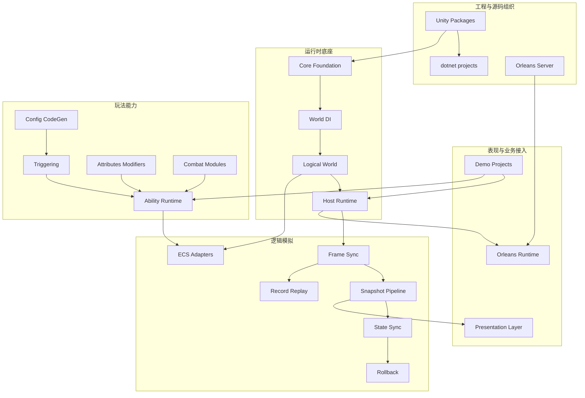

# AbilityKit 框架设计文档

> AbilityKit 是一个以“战斗能力表达”为中心的 Unity + .NET 框架。它不只提供技能系统，而是把逻辑世界、依赖注入、Host 运行时、ECS、触发器、战斗模块、网络同步、回放、表现层解耦和 Orleans 服务端串成一套可组合的能力体系。

---

## 1. 文档组织原则

本目录不再强制按已有文件夹结构解释框架，而是按“框架提供什么能力、为什么这样设计、源码如何落地、关键流程如何运行”组织阅读。

每篇设计文档应尽量包含：

| 内容 | 说明 |
|------|------|
| 能力定位 | 这个模块解决什么问题，不解决什么问题 |
| 设计方案 | 抽象边界、核心对象、生命周期、扩展点 |
| 源码入口 | 对应 Unity package、.NET project、Server project |
| 运行流程 | Mermaid 流程图或时序图 |
| 使用路径 | Demo、测试、运行入口 |
| 风险与约束 | 生命周期、线程、确定性、性能、跨端约束 |

---

## 2. 总体能力地图

---

## 3. 推荐阅读路线

### 3.1 框架使用者路线

1. [序章：为什么需要 AbilityKit](00-Prologue.md)
2. [AbilityKit 能力地图](01-OverviewAndGettingStarted/00-AbilityKitCapabilityMap.md)
3. [AbilityKit 是什么](01-OverviewAndGettingStarted/01-WhatIsAbilityKit.md)
4. [核心概念](01-OverviewAndGettingStarted/02-CoreConcepts.md)
5. [逻辑世界概述](02-LogicalWorldDesign/01-WorldOverview.md)
6. [Host 运行时](03-LogicalWorldHostDesign/01-HostRuntime.md)
7. [技能系统架构](08-GameplayModules/01-SkillSystemArchitecture.md)
8. [触发器系统](08-GameplayModules/02-TriggeringSystem.md)
9. [网络同步能力地图](07-NetworkSynchronization/00-SynchronizationCapabilityMap.md)

### 3.2 框架扩展者路线

1. [服务容器](02-LogicalWorldDesign/05-ServiceContainer.md)
2. [系统设计](02-LogicalWorldDesign/04-SystemDesign.md)
3. [ECS 核心概念](06-ECSArchitecture/01-ECSCoreConcepts.md)
4. [快照分发](04-PresentationLayerDesign/02-SnapshotDispatch.md)
5. [配置系统](05-CommonModules/04-ConfigurationSystem.md)
6. [投射物系统](08-GameplayModules/04-ProjectileSystem.md)
7. [属性系统](08-GameplayModules/05-AttributeSystem.md)

### 3.3 服务端/联机路线

1. [服务端能力地图](12-ServerArchitecture/00-ServerCapabilityMap.md)
2. [Orleans 运行时与部署设计](12-ServerArchitecture/01-OrleansRuntimeAndDeployment.md)
3. [Gateway、Room 与 Battle 主链路设计](12-ServerArchitecture/02-GatewayRoomBattleFlow.md)
4. [Web 后台：Admin Console 技术选型与职责边界](12-ServerArchitecture/03-WebAdminConsoleDesign.md)
5. [网络同步能力地图](07-NetworkSynchronization/00-SynchronizationCapabilityMap.md)
6. [帧同步机制](07-NetworkSynchronization/01-FrameSync.md)
7. [状态同步](07-NetworkSynchronization/02-StateSync.md)
8. [回滚预测](07-NetworkSynchronization/03-RollbackPrediction.md)
9. [回放系统](07-NetworkSynchronization/04-ReplaySystem.md)
10. [会话协调](07-NetworkSynchronization/05-SessionCoordination.md)

---

## 4. 当前文档目录

### 00 序章

| 文档 | 状态 | 说明 |
|------|------|------|
| [00-序章：为什么需要 AbilityKit](00-Prologue.md) | 已补强 | 项目起因、战斗系统补丁化困境、跨项目复用诉求、GAS/EGamePlay/ET/Orleans 技术选型、Unity Package + .NET 双入口、源码证据链与测试验证路线 |

### 01 概览与入门

| 文档 | 状态 | 说明 |
|------|------|------|
| [00-AbilityKit 能力地图](01-OverviewAndGettingStarted/00-AbilityKitCapabilityMap.md) | 已重写 | 源码驱动的 Foundation、SkillCore、BattleRuntime、SyncRuntime、ServerRuntime 能力边界、推荐组合、源码入口和选型速查 |
| [01-AbilityKit 是什么](01-OverviewAndGettingStarted/01-WhatIsAbilityKit.md) | 已重写 | 源码驱动的通用战斗工具集合定位、按需组合、纯 C# 复用、能力分层、适用边界和新手阅读路线 |
| [02-核心概念](01-OverviewAndGettingStarted/02-CoreConcepts.md) | 已重写 | 源码驱动的 World、Entity、Component、System/Feature、Frame/Input/Snapshot、Skill/Pipeline/Runtime、Trigger/Effect/Context、Session/Adapter 术语地图 |
| [03-快速开始](01-OverviewAndGettingStarted/03-QuickStart.md) | 已重写 | 源码驱动的 dotnet 构建、Console Demo CLI、SYNC_MODE、启动阶段、自动测试、测试入口和第一周阅读路线 |
| [04-项目结构](01-OverviewAndGettingStarted/04-ProjectStructure.md) | 已重写 | Unity/Packages 唯一源码、src Compile Include、Server/Orleans 工程、Demo 文档路径、配置生成和目录误区 |

### 02 逻辑世界设计

| 文档 | 状态 | 说明 |
|------|------|------|
| [01-逻辑世界概述](02-LogicalWorldDesign/01-WorldOverview.md) | 已重写 | 源码驱动的 IWorld、WorldManager、WorldCreateOptions、WorldClock、创建/Tick/销毁流程与设计边界 |
| [02-实体设计](02-LogicalWorldDesign/02-EntityDesign.md) | 已重写 | 源码驱动的 IEntityId、IEntity、EntityWorld、实体创建/销毁/递归销毁、父子关系、事件与调试名 |
| [03-组件设计](02-LogicalWorldDesign/03-ComponentDesign.md) | 已重写 | 源码驱动的 ComponentRegistry、TypeId、object[][] 存储、结构体/引用组件、组件索引与 EntityQuery 协作 |
| [04-系统设计](02-LogicalWorldDesign/04-SystemDesign.md) | 已补强 | 源码驱动的 WorldSystemBase、WorldSystemAttribute、阶段排序、AutoSystemInstaller、World DI 集成与 Service + ECS System 组合开发模式 |
| [05-服务容器](02-LogicalWorldDesign/05-ServiceContainer.md) | 已补强 | 源码驱动的 WorldContainerBuilder、WorldContainer、WorldScope、WorldActivator、构造函数注入、WorldInject、生命周期、作用域播种、属性扫描与销毁顺序 |

### 03 Host 运行时设计

| 文档 | 状态 | 说明 |
|------|------|------|
| [01-Host 运行时](03-LogicalWorldHostDesign/01-HostRuntime.md) | 已重写 | 源码驱动的 HostRuntime、IWorldHost、HostRuntimeOptions、Hook、Features、连接发送、广播与 Builder 装配流程 |
| [02-Host 模块系统](03-LogicalWorldHostDesign/02-HostModules.md) | 已重写 | 源码驱动的 IHostRuntimeModule、Install/Uninstall、Hook 订阅、Feature 协作、FrameSync/Time/AutoStart 模块流程 |
| [03-World 管理器](03-LogicalWorldHostDesign/03-WorldManager.md) | 已重写 | 源码驱动的 IWorldManager、WorldManager、IWorldFactory、创建/Tick/销毁/DisposeAll、多世界容器与 Blueprint 工厂 |

### 04 表现层设计

| 文档 | 状态 | 说明 |
|------|------|------|
| [01-视图事件抽象](04-PresentationLayerDesign/01-ViewEventAbstraction.md) | 已重写 | 源码驱动的 IBattleViewEventSink、BattleViewEventSink、Snapshot/Trigger Adapter、ViewEventAdapterLifecycle 与 View Binder 边界 |
| [02-快照分发](04-PresentationLayerDesign/02-SnapshotDispatch.md) | 已重写 | 源码驱动的 FrameSnapshotDispatcher、SnapshotPipeline、SnapshotRoutingBuilder、OpCode 路由、类型保护与 MOBA 快照订阅 |
| [03-跨平台实现](04-PresentationLayerDesign/03-CrossPlatform.md) | 已重写 | 源码驱动的 Unity View Feature、ConsoleBattleView、ETBattleViewEventSink、Server/Headless 观察边界与跨平台适配原则 |

### 05 通用模块

| 文档 | 状态 | 说明 |
|------|------|------|
| [01-事件系统](05-CommonModules/01-EventSystem.md) | 已补强 | EventDispatcher、EventKey、StableStringIdRegistry 稳定哈希、优先级监听、snapshot 派发语义、once 订阅与事件参数自动释放 |
| [02-对象池](05-CommonModules/02-ObjectPool.md) | 已补强 | Pools、PoolScope、PoolManager、ObjectPool、IPoolable、PoolConfigModule、配置仲裁、预热容量、反向归还与调试统计 |
| [03-定时器框架](05-CommonModules/03-TimerFramework.md) | 已重写 | SystemTimer、IWorldClock、DefaultScheduler、Delay/Periodic/ContinuousTask 与任务状态机 |
| [04-配置系统](05-CommonModules/04-ConfigurationSystem.md) | 已补强 | 源码驱动的 ConfigDatabase 原子换表、MOBA 配置门面、Luban 导出/多源加载、TriggerPlan、ActionSchema、Source Generator 边界、验证与多端接入 |

### 06 ECS 架构

| 文档 | 状态 | 说明 |
|------|------|------|
| [01-ECS 核心概念](06-ECSArchitecture/01-ECSCoreConcepts.md) | 已重写 | 源码驱动的 EntityWorld、IECWorld、IEntity、IEntityId、ComponentRegistry、EntityQuery、组件索引、父子层级与世界事件 |
| [02-Entitas 实现](06-ECSArchitecture/02-EntitasImplementation.md) | 已新增 | EntitasWorld、EntitasWorldComposer、模块治理、系统生命周期 |
| [03-查询与遍历源码深潜](06-ECSArchitecture/03-QueryAndIteration.md) | 已新增 | EntityWorld.Query、QueryImpl、组件索引、snapshot、存活版本校验、Entitas/Svelto 查询差异 |
| [04-Svelto 实现](06-ECSArchitecture/03-SveltoImplementation.md) | 已新增 | SveltoWorldModule、SveltoWorldContext、EnginesRoot、EntitiesDB 与提交调度器 |
| [05-查询与遍历总览](06-ECSArchitecture/04-QueryAndTraversal.md) | 已新增 | EntityQuery、EntityWorld.QueryImpl、Entitas Group、Svelto EntitiesDB 查询策略 |

### 07 网络同步

| 文档 | 状态 | 说明 |
|------|------|------|
| [00-网络同步能力地图](07-NetworkSynchronization/00-SynchronizationCapabilityMap.md) | 已重写 | 源码驱动的 FramePacket、RemoteFrameAggregator、SessionCoordinator、RemoteSyncAdapter、Gateway Flow、Room/Battle Grain、回放与 Demo 接入总览 |
| [01-帧同步机制](07-NetworkSynchronization/01-FrameSync.md) | 已重写 | 源码驱动的 FrameIndex、PlayerInputCommand、IWorldInputSink、FrameSyncDriverModule、FramePacket、FramePacketNetAdapter、ServerFrameTimeModule 与 Orleans BattleFrameSyncGrain |
| [02-状态同步](07-NetworkSynchronization/02-StateSync.md) | 已重写 | 源码驱动的 WorldStateSnapshot、SnapshotBuffer、PredictionCoordinator、快照打包、Shooter packed/pure-state 同步 |
| [03-回滚预测](07-NetworkSynchronization/03-RollbackPrediction.md) | 已重写 | 源码驱动的 IRollbackStateProvider、RollbackCoordinator、环形快照、客户端预测、哈希对账与 Host 回滚重演 |
| [04-回放系统](07-NetworkSynchronization/04-ReplaySystem.md) | 已重写 | 源码驱动的 RecordContainer、RecordSession、FrameRecordFile、BasicReplayController、Console akrec 录制与回放格式 |
| [05-会话协调](07-NetworkSynchronization/05-SessionCoordination.md) | 已重写 | 源码驱动的 SessionCoordinator、ExistingWorldSessionCoordinatorHost、RemoteSyncAdapter、RoomGatewaySessionFlow、RoomGrain、BattleLogicHostGrain 与端侧帧包适配 |

### 08 玩法模块

| 文档 | 状态 | 说明 |
|------|------|------|
| [00-玩法能力地图](08-GameplayModules/00-GameplayCapabilityMap.md) | 已补充 | Triggering、Ability、Combat、Record 的玩法能力总览 |
| [01-技能系统架构](08-GameplayModules/01-SkillSystemArchitecture.md) | 已补强 | 源码驱动的技能输入、释放准备、Pipeline 运行实例、MOBA Timeline/RulePlan 阶段、Triggering/Effect/Combat 协作 |
| [02-触发器系统](08-GameplayModules/02-TriggeringSystem.md) | 已补强 | 源码驱动的 TriggerPlan、TriggerRunner、JSON 计划库、MOBA RulePlan 直执行语义、持续计划调和 |
| [03-Buff 系统](08-GameplayModules/03-BuffSystem.md) | 已重写 | 源码驱动的 Buff 生命周期、叠层、持续行为、标签门禁与 Triggering 协作 |
| [04-投射物系统](08-GameplayModules/04-ProjectileSystem.md) | 已重写 | 源码驱动的 ProjectileWorld、ProjectileService、发射调度、命中策略、回滚与 MOBA 事件转译 |
| [05-属性系统](08-GameplayModules/05-AttributeSystem.md) | 已重写 | 源码驱动的 AttributeRegistry、AttributeContext、AttributeGroup、ModifierData、公式、约束与 MOBA 集成 |
| [06-伤害计算](08-GameplayModules/06-DamageCalculation.md) | 已重写 | 源码驱动的通用 DamageCalculationPipeline、MOBA DamagePipelineService、减伤、护盾、触发事件与快照输出 |

### 09 示例与验收

| 文档 | 状态 | 说明 |
|------|------|------|
| [01-Console Demo 解析](09-ImplementationExamples/01-ConsoleDemoAnalysis.md) | 已重写 | 源码驱动的 Program CLI、ConsoleBattleBootstrapper、BattleFlow/InMatchPhase、FeatureHost、ConsoleInputFeature、IWorldInputSink、SyncAdapter、ConsoleBattleView、自动测试与回放链路 |
| [02-ET Demo 解析](09-ImplementationExamples/02-ET%20Demo%20Analysis.md) | 已重写 | 源码驱动的 ET Scene 流转、Room/StartPlan、ETBattleComponent、ETMobaBattleDriver、WorldFactory、输入桥接、快照分发、ETUnit/Cache 与自动化验收 |
| [03-MOBA Demo 解析](09-ImplementationExamples/03-MOBA%20Demo%20Analysis.md) | 已补强 | MOBA Blueprint/Base、Bootstrap Module、Entitas 上下文、输入/技能/配置/实体索引、Buff/Projectile/Damage、快照表现、预测回滚与 ET 宿主复用关系 |
| [03.1-MOBA 专题总览](09-ImplementationExamples/MOBA/00-Overview.md) | 已新增 | MOBA 示例拆分阅读入口 |
| [03.2-MOBA 世界启动与运行时装配](09-ImplementationExamples/MOBA/01-WorldAndBootstrap.md) | 已新增 | Blueprint、Module、HostRuntime、服务生命周期 |
| [03.3-MOBA 输入、技能、配置与实体索引](09-ImplementationExamples/MOBA/02-InputSkillConfigEntity.md) | 已新增 | 输入、技能、配置、实体索引的合并说明 |
| [03.4-MOBA Buff、Projectile 与 Damage 管线](09-ImplementationExamples/MOBA/03-BuffProjectileDamage.md) | 已新增 | Buff 命令队列、投射物 Actor 绑定、伤害与治疗快照 |
| [03.5-MOBA 快照、表现层与预测回滚](09-ImplementationExamples/MOBA/04-SnapshotPresentationPrediction.md) | 已新增 | SnapshotEmitter、Dispatcher、Pipeline、远程驱动与预测回滚 |
| [03.6-MOBA 技能执行深潜](09-ImplementationExamples/MOBA/05-SkillExecutionDeepDive.md) | 已新增 | 输入事件、技能槽、释放策略、失败原因与帧同步约束 |
| [03.7-MOBA 配置、实体索引与生成深潜](09-ImplementationExamples/MOBA/06-ConfigEntitySpawnDeepDive.md) | 已新增 | 配置门面、多维实体索引、Actor BuildSpec 与生成注册 |
| [03.8-MOBA Buff 生命周期深潜](09-ImplementationExamples/MOBA/07-BuffLifecycleDeepDive.md) | 已新增 | Buff 命令队列、DrainPending、生命周期调和与重入保护 |
| [03.9-MOBA Projectile 与 Damage 深潜](09-ImplementationExamples/MOBA/08-ProjectileDamageDeepDive.md) | 已新增 | Projectile Actor、命中过滤、Damage/Heal、原因字段与快照 |
| [03.10-MOBA Trace、Context 与 Effect 执行深潜](09-ImplementationExamples/MOBA/09-TraceContextEffectDeepDive.md) | 已新增 | TraceTreeRegistry、MobaTraceRegistry、LineageInput、CombatExecutionContext、EffectInvoker 与验收 trace |
| [03.11-MOBA Trigger、Validation 与 Presentation Cue 深潜](09-ImplementationExamples/MOBA/10-TriggerValidationPresentationDeepDive.md) | 已新增 | TriggerExecutionGateway、Owner-bound Subscription、RuntimeValidation、StageTrigger、PresentationCue |
| [03.12-MOBA PlanActions DSL 与 Continuous Runtime 深潜](09-ImplementationExamples/MOBA/11-PlanActionsAndContinuousRuntimeDeepDive.md) | 已新增 | ActionSchema、PlanActionModule、ContinuousRuntimeView、LifecycleBinder、ContextSourceBoundary |
| [03.13-MOBA DI 与 System/Service 协作深潜](09-ImplementationExamples/MOBA/12-DIAndSystemServiceCollaborationDeepDive.md) | 已补强 | MobaServicesAutoModule、WorldService、WorldInject、WorldActivator、MobaGameplayTickSystem、MobaSkillPipelineStepSystem、MobaBuffCommandDrainSystem、Service + ECS System 协作边界 |
| [03.14-MOBA 持续行为能力组合设计](09-ImplementationExamples/MOBA/13-ContinuousCapabilityCompositionDesign.md) | 已新增 | stack、periodic、cue、tag、modifier 与 Buff、Projectile、Motion、Skill Pipeline 等领域 runtime 的组合边界 |
| [03.15-MOBA 四英雄技能正式实现设计](09-ImplementationExamples/MOBA/14-HeroSkillFormalDesign.md) | 已新增 | 廉颇、小乔、赵云、墨子的技能/被动需求映射、TriggerPlan、Buff、Projectile、Counter、通用 predicate 与验证路径 |
| [04-Shooter Demo 与 Orleans Smoke](09-ImplementationExamples/04-Shooter%20Demo%20与%20Orleans%20Smoke.md) | 已补强 | Shooter Runtime/Svelto、packed/pure-state snapshot、客户端同步控制器、Unity PlayMode 远程宿主、连接恢复、Gateway/Orleans 与 Smoke/replay 验收 |
| [04.1-Shooter 专题总览](09-ImplementationExamples/Shooter/00-Overview.md) | 已新增 | Shooter 示例拆分阅读入口 |
| [04.2-Shooter Runtime、Svelto 与战斗模拟](09-ImplementationExamples/Shooter/01-RuntimeSveltoSimulation.md) | 已新增 | RuntimePort、Svelto EntityManager、Simulation Tick |
| [04.3-Shooter Snapshot、Hash 与同步模型](09-ImplementationExamples/Shooter/02-SnapshotHashSync.md) | 已新增 | packed/pure-state snapshot、状态 hash、客户端同步控制器 |
| [04.4-Shooter Gateway、Orleans 与 Smoke 验收](09-ImplementationExamples/Shooter/03-GatewayOrleansSmoke.md) | 已新增 | RoomFlow、RoomGrain、BattleRuntimeAdapter、FrameSyncGrain、烟测 |
| [04.5-Shooter 客户端同步策略](09-ImplementationExamples/Shooter/04-ClientSyncStrategies.md) | 已新增 | ClientSession、输入协调、同步控制器工厂、packed/pure-state 应用器 |
| [04.6-Shooter 服务端流程与 Smoke 深潜](09-ImplementationExamples/Shooter/05-ServerFlowAndSmokeDeepDive.md) | 已新增 | Gateway、RoomGrain、BattleAdapter、FrameSyncGrain 与 Smoke 验收 |
| [04.7-Shooter 纯状态预算与兴趣范围深潜](09-ImplementationExamples/Shooter/06-PureStateBudgetAndInterest.md) | 已新增 | Budget、InterestScope、Baseline/Delta 与候选排序 |
| [04.8-Shooter Smoke 验证用例深潜](09-ImplementationExamples/Shooter/07-SmokeValidationCases.md) | 已新增 | 帧/哈希校验、stale 保护、late join、reconnect 验收 |
| [04.9-Shooter 网络模块深潜](09-ImplementationExamples/Shooter/08-NetworkModulesDeepDive.md) | 已新增 | Gateway Flow、FrameSyncCoordinator、Snapshot Controller、Lag Compensation、Reconnect |
| [04.10-Shooter Svelto 性能模式深潜](09-ImplementationExamples/Shooter/09-SveltoPerformanceModeDeepDive.md) | 已新增 | struct component、ExclusiveGroup、ScenarioRunner、Benchmark 与大规模预算诊断 |
| [04.11-Shooter 表现会话与视图管线深潜](09-ImplementationExamples/Shooter/10-PresentationSessionAndViewDeepDive.md) | 已新增 | PresentationFacade、Session、Stream、Projection、Binder、Reconnect 驱动 |
| [04.12-Shooter 插值、混合预测与诊断深潜](09-ImplementationExamples/Shooter/11-InterpolationAndPredictionDeepDive.md) | 已新增 | AuthoritativeInterpolation、HybridHeroPrediction、Diagnostics、DOTS Binder、TimeAnchor |

### 10 工程质量与测试

| 文档 | 状态 | 说明 |
|------|------|------|
| [01-正式测试流程、单元测试与冒烟测试](10-EngineeringQuality/01-TestingWorkflow.md) | 已补强 | 真实测试工程入口、xUnit 分层、DemoHarness 指标、Shooter 30 场景验收矩阵、Orleans Gateway/Grain 测试、Smoke 结果字段、ET/Shooter 命令与 P0/P1/P2 门禁 |

### 11 文档工程计划

| 文档 | 状态 | 说明 |
|------|------|------|
| [01-文档补全路线图](11-DocumentationCompletionPlan.md) | 已补强 | P0-P3 完成状态、源码验证重点、下一轮 P4-P8 优先方向、Batch 12 测试/CI 后续专题、文档验收顺序 |

### 12 服务端架构

| 文档 | 状态 | 说明 |
|------|------|------|
| [00-服务端能力地图](12-ServerArchitecture/00-ServerCapabilityMap.md) | 已新增 | 将 Orleans 服务端从 Shooter 演示支撑提升为正式运行面，梳理 Contracts、Gateway、Grains、Hosting、Smoke、Analyzer 的能力边界 |
| [01-Orleans 运行时与部署设计](12-ServerArchitecture/01-OrleansRuntimeAndDeployment.md) | 已新增 | Host/Gateway 进程拓扑、Local Silo/Client 装配、部署角色、运行 profile、存储策略和后续生产化演进点 |
| [02-Gateway、Room 与 Battle 主链路设计](12-ServerArchitecture/02-GatewayRoomBattleFlow.md) | 已新增 | GatewayRequestRouter、RoomDirectoryGrain、RoomGrain、RoomFrameSyncRoute、BattleLogicHostGrain 和 ServerGameplayModuleCatalog 的主流程 |
| [03-Web 后台：Admin Console 技术选型与职责边界](12-ServerArchitecture/03-WebAdminConsoleDesign.md) | 已新增 | Vite + Vue 3 + TypeScript 后台工程、Hash Router、组合式状态、/api/admin 聚合门面、Gateway 静态托管与运维诊断边界 |

---

## 5. 源码入口索引

| 能力域 | Unity 源码入口 | .NET 构建入口 | 服务端入口 |
|--------|----------------|---------------|------------|
| Core | `Unity/Packages/com.abilitykit.core/Runtime` | `src/AbilityKit.Core` | - |
| World DI | `Unity/Packages/com.abilitykit.world.di/Runtime` | `src/AbilityKit.World.DI` | - |
| Host | `Unity/Packages/com.abilitykit.host/Runtime` | `src/AbilityKit.Host` | - |
| Host Extension | `Unity/Packages/com.abilitykit.host.extension/Runtime` | `src/AbilityKit.Host.Extension` | - |
| FrameSync | `Unity/Packages/com.abilitykit.world.framesync/Runtime` | `src/AbilityKit.World.FrameSync` | `Server/Orleans/src/AbilityKit.Orleans.Contracts/FrameSync` |
| Snapshot | `Unity/Packages/com.abilitykit.world.snapshot/Runtime` | `src/AbilityKit.World.Snapshot` | `Server/Orleans/src/AbilityKit.Orleans.Contracts/Battle` |
| StateSync | `Unity/Packages/com.abilitykit.world.statesync/Runtime` | `src/AbilityKit.World.StateSync` | Gateway state sync handlers |
| Triggering | `Unity/Packages/com.abilitykit.triggering/Runtime` | `src/AbilityKit.Triggering` | - |
| Ability | `Unity/Packages/com.abilitykit.ability/Runtime` | `src/AbilityKit.Ability` | Demo battle host loads runtime assemblies |
| Combat | `Unity/Packages/com.abilitykit.combat.*` | `src/AbilityKit.Combat.*` | Demo battle logic host |
| Record | `Unity/Packages/com.abilitykit.record/Runtime` | `src/AbilityKit.Record` | Smoke/replay tools |
| Orleans Contracts | - | - | `Server/Orleans/src/AbilityKit.Orleans.Contracts` |
| Orleans Gateway | - | - | `Server/Orleans/src/AbilityKit.Orleans.Gateway` |
| Orleans Grains | - | - | `Server/Orleans/src/AbilityKit.Orleans.Grains` |
| Orleans Hosting | - | - | `Server/Orleans/src/AbilityKit.Orleans.Hosting` |
| Orleans Admin Console | - | - | `Server/AdminConsole` |
| Orleans Smoke | - | - | `Server/Orleans/src/AbilityKit.Orleans.ShooterSmoke` |

---

## 6. 文档更新记录

| 日期 | 版本 | 更新内容 |
|------|------|---------|
| 2026-06-20 | 1.0 | 初始版本，建立文档框架 |
| 2026-06-21 | 1.1 | 按功能模块重新组织目录结构 |
| 2026-06-23 | 2.0 | 调整为能力中心文档体系，补充源码入口和总览流程图 |
| 2026-06-23 | 2.1 | 新增工程质量与测试流程专题，补充单元测试、契约测试、DemoHarness、冒烟测试和稳定性收益 |
| 2026-06-23 | 2.2 | 新增序章文档，说明 AbilityKit 的项目起因、技术选型和 Package 化方向 |
| 2026-07-03 | 2.3 | 新增快速开始、项目结构和 ECS 查询遍历源码深潜文档，补充源码入口、运行命令、流程图和新手阅读路线 |
| 2026-07-03 | 2.4 | 重写通用模块事件系统、对象池和定时器框架文档，补充真实源码 API、生命周期、配置链路、状态机和 Mermaid 流程图 |
| 2026-07-03 | 2.5 | 新增文档补全路线图，明确按模块源码阅读顺序、设计意图检查清单、流程图修复规范和每批验收标准 |
| 2026-07-03 | 2.6 | 重写逻辑世界概述和服务容器文档，补充 World DI 源码设计、世界生命周期、作用域播种、销毁顺序，并修复逻辑世界目录异常流程图 |
| 2026-07-03 | 2.7 | 重写逻辑世界实体、组件、系统设计文档，补齐 EntityWorld、IEntityId、ComponentRegistry、组件索引、WorldSystemBase、阶段排序和自动安装流程 |
| 2026-07-03 | 2.8 | 重写 Host 运行时、Host 模块系统和 World 管理器文档，补齐 HostRuntime、HostRuntimeOptions、Hook、Features、IHostRuntimeModule、WorldHostBuilder、FrameSync/Time/AutoStart 模块与多世界生命周期 |
| 2026-07-03 | 2.9 | 重写表现层视图事件、快照分发和跨平台实现文档，补齐 IBattleViewEventSink、FrameSnapshotDispatcher、SnapshotPipeline、ViewEventAdapterLifecycle、BattleViewFeature、BattleViewBinder、Console 与 ET 接入流程 |
| 2026-07-03 | 2.10 | 重写帧同步机制文档，补齐 FrameIndex、PlayerInputCommand、IWorldInputSink、FrameSyncDriverModule、FramePacket、FramePacketNetAdapter、ServerFrameTimeModule、RemoteFrameAggregator 与 Orleans BattleFrameSyncGrain 链路 |
| 2026-07-03 | 2.14 | 重写 AbilityKit 是什么文档，补齐通用战斗工具集合定位、按需组合、纯 C# 逻辑复用、能力分层、工程目录、适用边界、行业方案差异和新手阅读路线 |
| 2026-07-03 | 2.13 | 重写核心概念文档，补齐 World、Entity、Component、System/Feature、Frame/Input/Snapshot、Skill/Pipeline/Runtime、Trigger/Effect/Context、Session/Adapter 的源码边界和新手阅读路线 |
| 2026-07-03 | 2.12 | 重写 ECS 核心概念文档，补齐 EntityWorld、IECWorld、IEntity、IEntityId、ComponentRegistry、EntityQuery、组件索引、父子层级、WorldEventBus 与 Entitas System 边界 |
| 2026-07-03 | 2.11 | 重写 Console Demo 解析文档，补齐 Program CLI、ConsoleBattleBootstrapper、BattleFlow/InMatchPhase、FeatureHost、ConsoleInputFeature、IWorldInputSink、SyncAdapter、ConsoleBattleView、自动测试与回放流程 |
| 2026-07-03 | 2.15 | 新增 MOBA 持续行为能力组合设计文档，说明 stack、periodic、cue、tag、modifier 不强制打包为单体效果资产的项目化设计取舍 |
| 2026-07-03 | 2.16 | 重写 P0 入门文档，补齐能力地图推荐组合、快速开始 Console CLI 与启动阶段、项目结构源码引用关系、Demo/Server 目录边界和新手选型路径 |
| 2026-07-04 | 2.17 | 重写 P1 网络同步文档，补齐同步能力地图、通用 Record/FrameRecord/Console akrec 回放格式、SessionCoordinator、RemoteSyncAdapter、Gateway Flow、Room/Battle Grain、ExistingWorld 接入和端侧帧包适配 |
| 2026-07-04 | 2.18 | 重写与补强 P2 示例总览文档，补齐 ET 宿主接入、MOBA 运行时装配与 Shooter Unity/Gateway/Orleans/Smoke 端到端验收链路 |
| 2026-07-04 | 2.19 | 完成 P3 序章、测试流程与文档路线图补强，补齐源码证据链、测试项目清单、Shooter 验收矩阵、Smoke 结果字段和 P4-P8 后续路线 |
| 2026-07-04 | 2.20 | 完成 P4 Core 基础设施首轮补强，核准 StableStringIdRegistry、EventDispatcher snapshot 语义、PoolRegistry/PoolConfigCenter 配置仲裁、PoolConfigModule 与对象池预热裁剪细节 |
| 2026-07-04 | 2.21 | 完成 P5 World DI、ECS System 与 MOBA Service 协作补强，核准 WorldActivator 构造函数注入、WorldInject 成员注入、AutoSystemInstaller 构造约束与 Service + ECS System 组合开发模式 |
| 2026-07-04 | 2.22 | 完成 P6 Pipeline、技能释放与 Triggering 主链路补强，核准 AbilityPipelinePhaseRuntime 运行实例语义、MOBA SkillTimelinePhase、SkillRulePlanPhase、MobaTriggerPlanExecutor 与 TriggerRunner 边界 |
| 2026-07-04 | 2.23 | 完成 P7 CodeGen、Luban 与配置链路补强，核准 ConfigDatabase 原子重载、Luban JSON/导出链路、Console cfg.Tables 加载、AutoPlanActionGenerator 注册边界与 TriggerPlan ActionSchema 启动门禁 |
| 2026-07-04 | 2.24 | 新增 MOBA 四英雄技能正式实现设计文档，说明廉颇、小乔、赵云、墨子如何通过 TriggerPlan、Buff、Projectile、Counter 与通用 predicate 落地 |
| 2026-07-04 | 2.25 | 新增服务端架构专题，将 Orleans 服务端作为独立运行面补齐能力地图、运行时部署、Gateway/Room/Battle 主链路与源码锚点 |
| 2026-07-04 | 2.26 | 新增 Web 后台设计文档，补齐 Admin Console 技术选型、页面职责、状态/API 边界、Gateway 静态托管和 /api/admin 运维诊断门面 |

---

本文档将随着源码阅读继续补齐各能力域的详细设计、流程图和源码锚点。
