# AbilityKit 能力地图

本文从源码出发说明 AbilityKit 实际提供的能力边界。阅读源码时需要牢记一条工程约束：`Unity/Packages` 是唯一源码位置，`src` 是 .NET SDK 构建和测试工程，`Server/Orleans` 是服务端承载与联机验证工程。

---

## 1. 能力地图的阅读方式

AbilityKit 不是“一个技能类”或“一个完整 MOBA 模板”，而是一组可组合的战斗运行时能力。能力地图需要回答四个问题：

1. 这个能力解决什么问题。
2. 相关源码在哪个 package。
3. 它依赖哪些底座能力。
4. 什么时候应该引入，什么时候不应该引入。

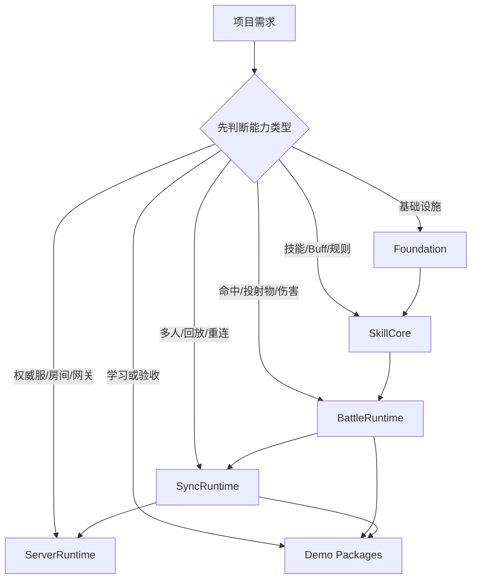

核心原则：能用下层组合解决的问题，不要一开始就接入上层 Demo 或服务端链路。

---

## 2. 总体能力分层

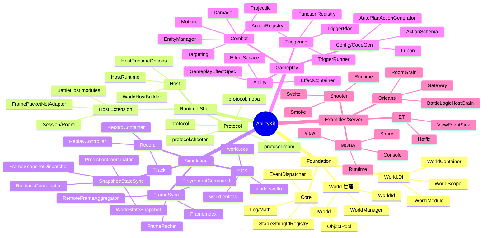

---

## 3. 能力组合与引入边界

`Unity/Packages/README.md` 已经把内部推广顺序拆成组合。设计文档按同一能力层次说明引入边界：

| 组合 | 包含模块 | 适用场景 | 不适用场景 |
|------|----------|----------|------------|
| `Foundation` | `core` + `world.di` | 干净项目启动、事件、对象池、世界级服务生命周期 | 只想看完整技能 Demo，不准备理解底座 |
| `SkillCore` | `Foundation` + `triggering` + `pipeline` + `attributes` | 技能、Buff、被动、事件规则、属性修饰 | 项目还没有稳定的数据化规则需求 |
| `BattleRuntime` | `SkillCore` + `combat.targeting` + `combat.projectile` + `combat.damage` | 中大型战斗玩法、目标选择、投射物、伤害链 | 只有简单数值结算，不需要命中/投射物模型 |
| `SyncRuntime` | `BattleRuntime` + `framesync` + `snapshot` + `statesync` + `record` + `protocol` | 多人同步、回放、重连、状态恢复、快照表现 | 单机项目或只需要本地表现验证 |
| `ServerRuntime` | `protocol` + `host` + `host.extension` + 项目服务端适配 | 权威服、房间服、网关服务、Orleans Smoke | 还没跑通本地 Runtime 和同步测试 |
| `Demo Packages` | `demo.moba.*`、`demo.shooter.*`、Console、ET、Orleans | 学习源码闭环、验收能力组合、参考接入方式 | 直接复制到业务项目并作为默认架构 |

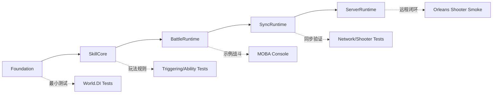

---

## 4. 工程层能力：一份源码，多端构建

### 4.1 设计动机

框架同时服务 Unity 运行时、.NET 测试、服务端 Orleans 承载。若复制源码，会造成 Unity asmdef、.NET csproj、服务端程序集之间行为不一致。因此项目采用“Unity package 存源码，src 工程引用源码”的结构。

### 4.2 分层关系

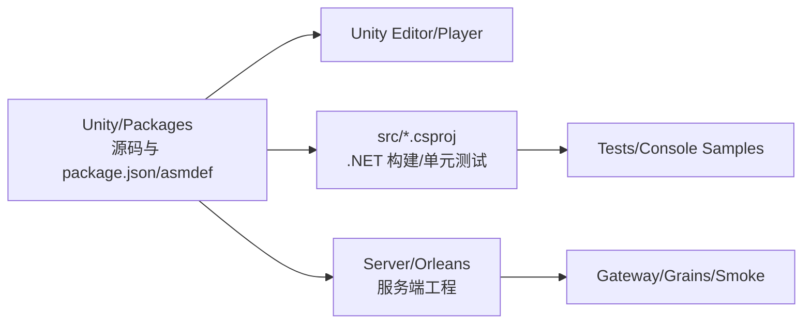

### 4.3 关键源码入口

| 入口 | 作用 |
|------|------|
| `Unity/Packages/README.md` | 包级文档索引、能力组合、内部推广分级 |
| `Unity/Packages/packages-lock.json` | Unity embedded package 依赖图 |
| `src/AbilityKit.sln` | .NET 工程、Demo、测试工程地图 |
| `Server/Orleans/README.md` | Orleans 服务端运行说明 |
| `.cursor/rules/src-unity-packages-relation.mdc` | 源码位置约束 |
| `.cursor/rules/ability-package-structure.mdc` | 包结构和 Runtime/Editor/Samples 边界 |

---

## 5. Foundation：运行时底座能力

### 5.1 Core：稳定、低耦合的基础设施

Core 提供跨模块复用的事件、对象池、标识、日志、基础数学等能力。

| 类型/能力 | 源码 | 设计意义 |
|-----------|------|----------|
| `EventDispatcher` | `Unity/Packages/com.abilitykit.core/Runtime/Event/EventDispatcher.cs` | 支持按事件 ID 和参数类型分 channel，按优先级和注册顺序派发 |
| `StableStringIdRegistry` | `Unity/Packages/com.abilitykit.core/Runtime/Generic/StableStringIdRegistry.cs` | 把字符串事件/标识稳定映射为整数 ID |
| `PoolRegistry` / ObjectPool | `Unity/Packages/com.abilitykit.core/Runtime/Pooling` | 降低帧循环中的 GC 压力 |
| Log/Mathematics | `Unity/Packages/com.abilitykit.core/Runtime` | 为纯 C#、Unity、Demo 提供共同基础类型 |

事件派发主流程：

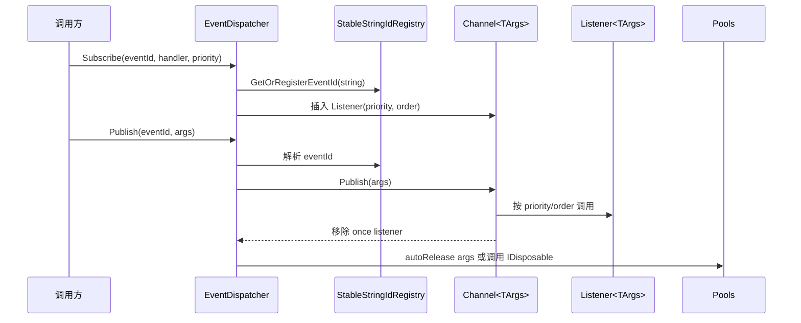

### 5.2 World.DI：世界级依赖注入

World.DI 用于把一个逻辑世界内的服务、系统、上下文和临时输入隔离在自己的生命周期里。

| 类型 | 源码 | 设计意义 |
|------|------|----------|
| `WorldContainer` | `Unity/Packages/com.abilitykit.world.di/Runtime/World/DI/WorldContainer.cs` | Root 容器，管理 Singleton/Transient，并禁止 Root 解析 Scoped |
| `WorldScope` | `Unity/Packages/com.abilitykit.world.di/Runtime/World/DI/WorldScope.cs` | 每次流程/阶段创建独立作用域，缓存 Scoped 实例 |
| `WorldLifetime` | `Unity/Packages/com.abilitykit.world.di/Runtime/World/DI/WorldLifetime.cs` | Singleton/Scoped/Transient 生命周期枚举 |
| `IWorldModule` | `Unity/Packages/com.abilitykit.world.di/Runtime/World/DI/IWorldModule.cs` | 模块化注册入口 |

依赖解析流程：

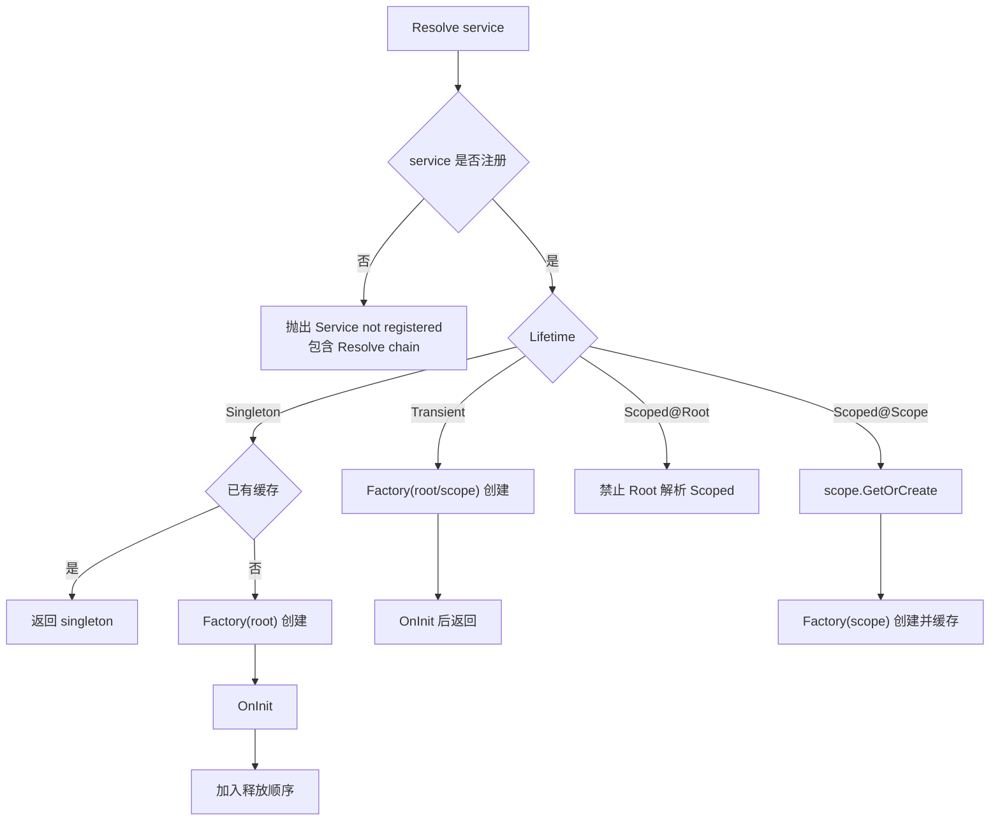

设计约束：

- Root 容器不能直接解析 Scoped 服务。
- Singleton 创建过程中不能捕获 Scoped 服务。
- 解析失败会输出 resolve chain，便于定位依赖链。
- `CreateScope(Action<IWorldScopeSeeder>)` 支持在首次解析前播种阶段输入。

---

## 6. Runtime Shell：Host、协议与会话外壳

Host 是逻辑世界运行、连接管理和消息广播的外壳。它不直接写业务战斗逻辑，而是提供统一生命周期和接入点。

| 类型/能力 | 源码 | 说明 |
|-----------|------|------|
| `HostRuntime` | `Unity/Packages/com.abilitykit.host/Runtime/Host/Framework/HostRuntime.cs` | 创建/销毁 World，Tick WorldManager，广播 ServerMessage |
| `HostRuntimeOptions` | `Unity/Packages/com.abilitykit.host/Runtime/Host/Framework/HostRuntimeOptions.cs` | Before/After hooks 和兼容事件 |
| `WorldHostBuilder` | `Unity/Packages/com.abilitykit.host/Runtime/Host/Builder/WorldHostBuilder.cs` | 组合 TimeDriver、InputDriver、SnapshotProvider 等部件 |
| `FramePacketNetAdapter` | `Unity/Packages/com.abilitykit.host.extension/Runtime/Session/FramePacketNetAdapter.cs` | 把 FramePacket 转成可发送/可接收的会话数据 |
| Protocol packages | `Unity/Packages/com.abilitykit.protocol*` | 房间、MOBA、Shooter 等协议 DTO 和 opCode |

Host Tick 流程：

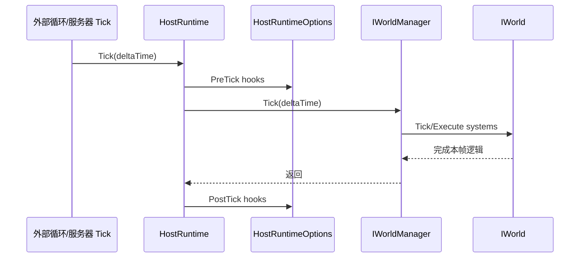

---

## 7. Simulation：逻辑模拟、同步与回放

### 7.1 ECS 适配

AbilityKit 同时保留自研轻量 ECS、Entitas 适配和 Svelto 适配。选择哪种 ECS 不是文档层决定，而取决于项目已有技术栈、性能预算和 Demo 参考。

| 能力 | 源码 | 使用场景 |
|------|------|----------|
| `world.ecs` | `Unity/Packages/com.abilitykit.world.ecs/Runtime/AbilityKit.World.ECS` | 轻量实体、组件、查询、学习 ECS 核心概念 |
| `world.entitas` | `Unity/Packages/com.abilitykit.world.entitas/Runtime` | MOBA 示例和 Entitas 风格上下文 |
| `world.svelto` | `Unity/Packages/com.abilitykit.world.svelto/Runtime` | Shooter 示例、大规模状态和性能模式 |

### 7.2 FrameSync：确定性输入帧

FrameSync 把“玩家操作”变成按帧归档的输入命令，然后由逻辑世界在固定步长下消费。

| 类型 | 源码 | 说明 |
|------|------|------|
| `FrameIndex` | `Unity/Packages/com.abilitykit.world.framesync/Runtime` | 帧号值对象 |
| `PlayerInputCommand` | `Unity/Packages/com.abilitykit.world.framesync/Runtime` | 玩家输入命令 |
| `FramePacket` | `Unity/Packages/com.abilitykit.world.networkfragments/Runtime/Frames/FramePacket.cs` | 一帧内的输入和可选快照封包 |
| `RemoteFrameAggregator` | `Unity/Packages/com.abilitykit.world.networkfragments/Runtime/Frames/RemoteFrameAggregator.cs` | 按 frame 聚合远端输入与快照 |

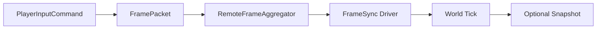

### 7.3 Snapshot、StateSync、Prediction、Rollback

Snapshot 能力把逻辑世界产生的状态片段封装成 `WorldStateSnapshot`，再由路由器按 opCode 解码并分发给不同表现端或状态同步端。

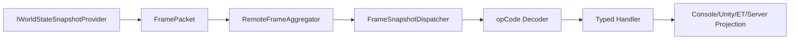

| 类型 | 源码 | 说明 |
|------|------|------|
| `FrameSnapshotDispatcher` | `Unity/Packages/com.abilitykit.world.snapshot/Runtime/SnapshotRouting/FrameSnapshotDispatcher.cs` | 快照解码路由与订阅分发 |
| `PredictionCoordinator` | `Unity/Packages/com.abilitykit.world.statesync/Runtime/StateSync/Prediction/Core/PredictionCoordinator.cs` | 记录输入、执行预测、应用服务器快照、冲突后回滚重演 |
| `RollbackCoordinator` | `Unity/Packages/com.abilitykit.world.framesync/Runtime/FrameSync/Rollback/RollbackCoordinator.cs` | 捕获、存储、恢复回滚快照 |
| `RecordContainer` / `ReplayController` | `Unity/Packages/com.abilitykit.record/Runtime` | 记录轨道、回放控制和调试复现 |

预测校验流程：

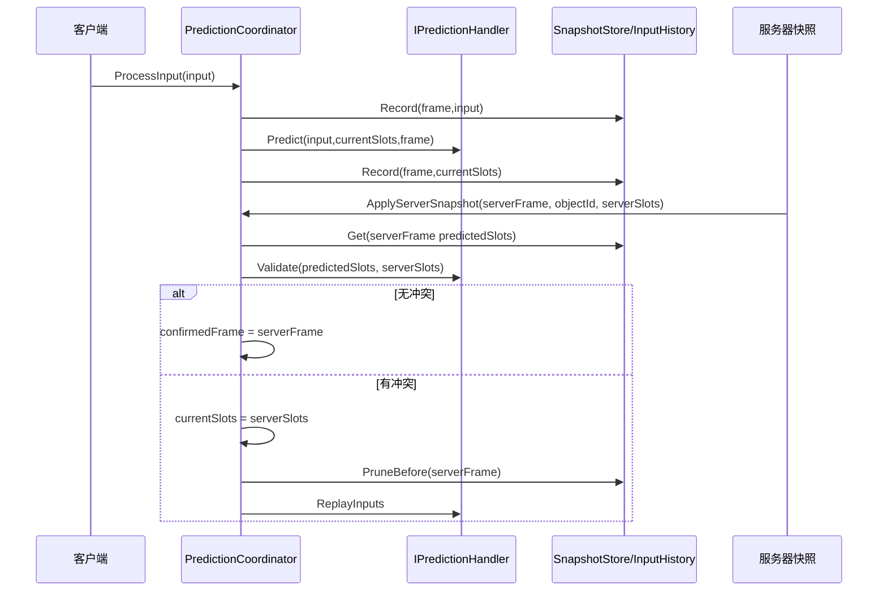

---

## 8. Gameplay：玩法表达能力

### 8.1 Triggering：事件-条件-动作主线

Triggering 是 AbilityKit 的“可数据化玩法逻辑执行器”。它不直接写死 Buff、Projectile、AOE，而是提供事件、条件、动作、黑板、数值域、调度器这些通用执行原语。

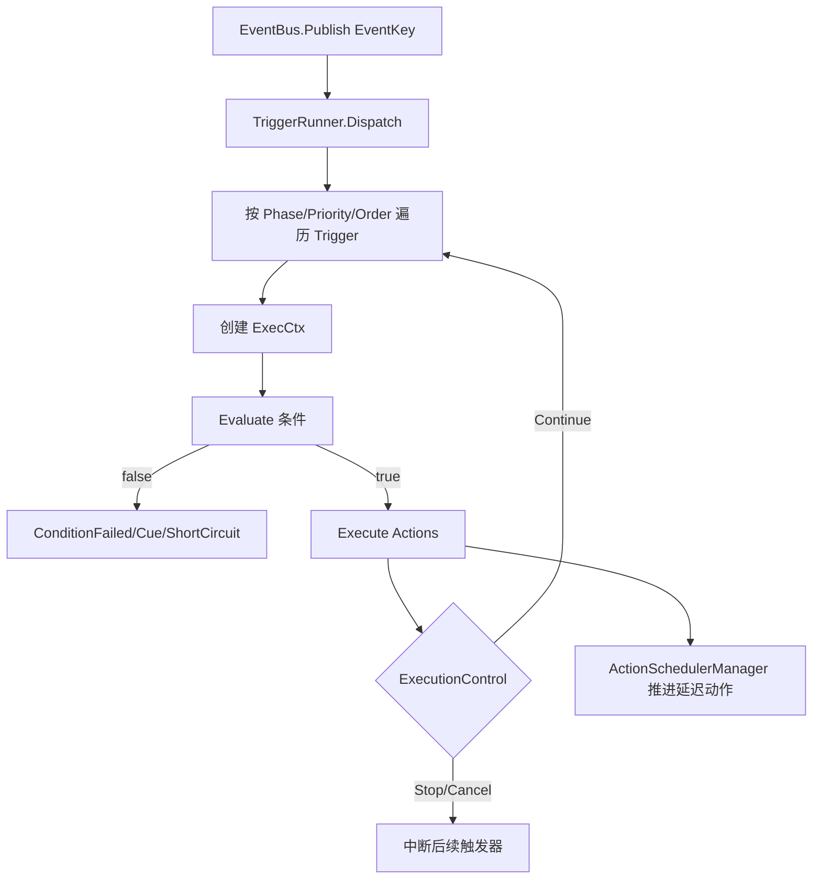

关键源码：

| 类型 | 源码 | 说明 |
|------|------|------|
| `TriggerRunner` | `Unity/Packages/com.abilitykit.triggering/Runtime/Triggering/Runner/TriggerRunner.cs` | 主线编排器，负责订阅、排序、条件评估、执行控制和生命周期回调 |
| `TriggerPlan` | `Unity/Packages/com.abilitykit.triggering/Runtime/Plans` | 数据化触发器计划 |
| `FunctionRegistry` | `Unity/Packages/com.abilitykit.triggering/Runtime/Triggering/Registry` | 条件函数扩展点 |
| `ActionRegistry` | `Unity/Packages/com.abilitykit.triggering/Runtime/Triggering/Registry` | 动作扩展点 |

### 8.2 Ability 与 GameplayEffect

Ability 包把 Triggering、Attributes、Projectile、Area 等模块组合成可落地的效果执行体系。

| 能力 | 典型源码 | 说明 |
|------|----------|------|
| 效果实例 | `Unity/Packages/com.abilitykit.ability/Runtime/Ability/Effect/EffectInstance.cs` | 一次效果施加后的运行时状态 |
| 效果容器 | `Unity/Packages/com.abilitykit.ability/Runtime/Ability/Effect/EffectContainer.cs` | 管理效果集合和生命周期 |
| 效果服务 | `Unity/Packages/com.abilitykit.ability/Runtime/Ability/Effect/EffectService.cs` | 对外施加/移除/更新效果的服务入口 |
| 效果规格 | `Unity/Packages/com.abilitykit.ability/Runtime/Ability/Effect/GameplayEffectSpec.cs` | 数据化效果描述 |
| 属性与修饰器 | `Unity/Packages/com.abilitykit.attributes`、`Unity/Packages/com.abilitykit.modifiers` | 属性表、修饰器和数值计算基础 |

### 8.3 Combat：可组合战斗原语

Combat 包拆成多个原语，避免技能系统变成巨型对象。

| 包 | 能力 | 典型源码 |
|----|------|----------|
| `combat.targeting` | 候选目标、规则过滤、评分、TopK 选择 | `Unity/Packages/com.abilitykit.combat.targeting/Runtime/SearchTarget` |
| `combat.projectile` | 投射物生命周期、发射模式、命中策略、回滚 | `Unity/Packages/com.abilitykit.combat.projectile/Runtime/Projectile` |
| `combat.damage` | 伤害上下文、伤害数据、处理器链 | `Unity/Packages/com.abilitykit.combat.damage/Runtime/Damage` |
| `combat.motion` | 位移、运动和持续运动能力 | `Unity/Packages/com.abilitykit.combat.motion/Runtime` |
| `combat.entitymanager` | 战斗实体注册、索引和查询 | `Unity/Packages/com.abilitykit.combat.entitymanager/Runtime` |
| `combat.skilllibrary` | 战斗技能库和组合能力 | `Unity/Packages/com.abilitykit.combat.skilllibrary/Runtime` |

---

## 9. Example/Server：示例与服务端能力

### 9.1 Console/MOBA/Shooter/ET 示例边界

| 示例 | 源码入口 | 证明的能力 |
|------|----------|------------|
| Console Demo | `src/AbilityKit.Demo.Moba.Console` | 纯 C# 启动、配置加载、World DI、运行时世界、阶段流、自动测试、回放 |
| MOBA Runtime | `Unity/Packages/com.abilitykit.demo.moba.runtime` | 技能、Buff、Projectile、Damage、Trace、Context、系统服务协作 |
| MOBA Share/View | `Unity/Packages/com.abilitykit.demo.moba.share`、`com.abilitykit.demo.moba.view.runtime` | 快照、表现事件、远程驱动、预测回滚、Gateway 客户端 |
| Shooter Runtime | `Unity/Packages/com.abilitykit.demo.shooter.runtime` | Svelto Runtime、状态 hash、packed/pure-state snapshot、大规模预算 |
| ET Demo | `src/AbilityKit.Demo.ET.*` | AbilityKit 接入 ET 热更新层、ViewEventSink、ActorId 映射 |

Console Demo 启动链路：

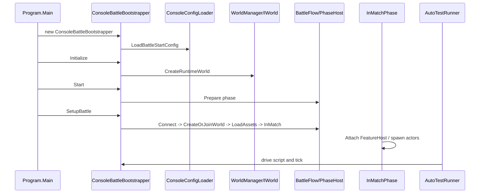

### 9.2 Orleans 服务端能力

Orleans 服务端把房间、网关、战斗逻辑和状态同步接到分布式运行模型中。

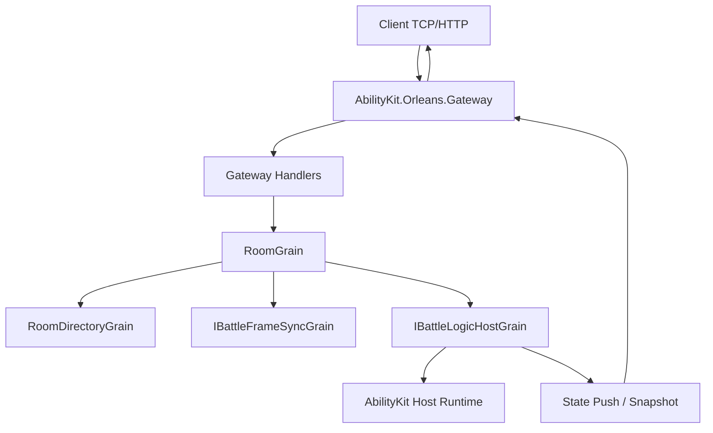

关键源码：

| 类型/工程 | 源码 | 说明 |
|-----------|------|------|
| Gateway | `Server/Orleans/src/AbilityKit.Orleans.Gateway` | Gateway 启动、配置、Orleans Client 和 HTTP/TCP 管线 |
| Contracts | `Server/Orleans/src/AbilityKit.Orleans.Contracts` | Room、FrameSync、Battle、Gateway 协议契约 |
| Grains | `Server/Orleans/src/AbilityKit.Orleans.Grains` | RoomGrain、BattleFrameSyncGrain、BattleLogicHostGrain |
| ShooterSmokeRunner | `Server/Orleans/src/AbilityKit.Orleans.ShooterSmoke/Runner/ShooterSmokeRunner.cs` | Shooter 远程闭环烟测 |

Room 开战流程：

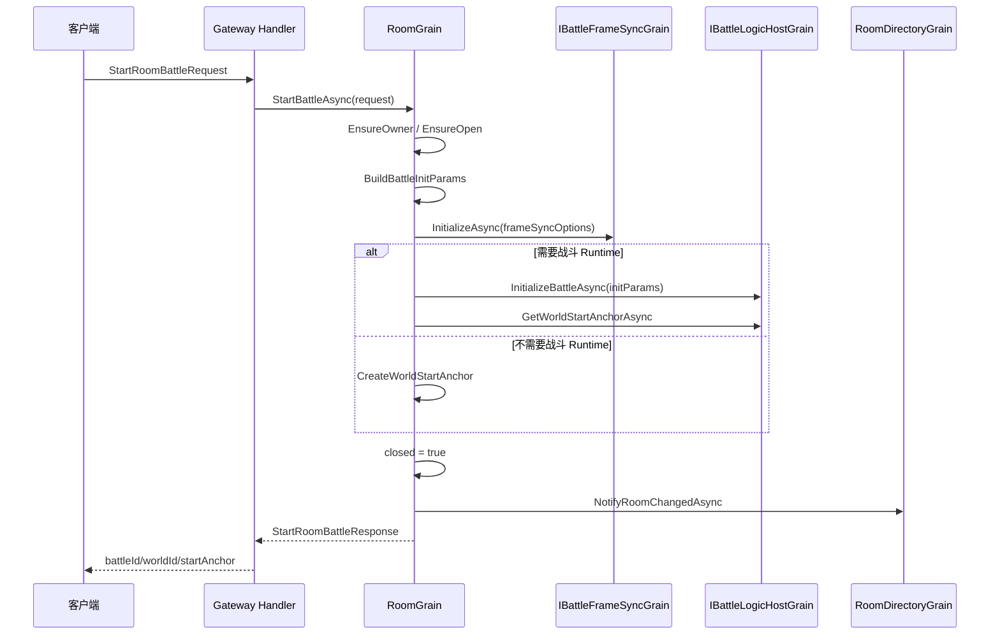

---

## 10. 能力选型速查

| 你要做什么 | 先看哪些包 | 先跑哪个验证 |
|------------|------------|--------------|
| 学会事件、对象池、稳定 ID | `com.abilitykit.core` | `dotnet build src/AbilityKit.Core/AbilityKit.Core.csproj` |
| 学会服务生命周期 | `com.abilitykit.world.di` | `dotnet test src/AbilityKit.World.DI.Tests/AbilityKit.World.DI.Tests.csproj` |
| 学会 Host 和多世界外壳 | `com.abilitykit.host`、`host.extension` | `dotnet build src/AbilityKit.Host/AbilityKit.Host.csproj` |
| 学会 Console 战斗闭环 | `demo.moba.runtime` + `src/AbilityKit.Demo.Moba.Console` | `dotnet run --project src/AbilityKit.Demo.Moba.Console/AbilityKit.Demo.Moba.Console.csproj` |
| 学会状态同步和网络运行时 | `world.snapshot`、`world.statesync`、`network.runtime` | `dotnet test src/AbilityKit.Network.Runtime.Tests/AbilityKit.Network.Runtime.Tests.csproj` |
| 学会 Shooter 大规模同步 | `demo.shooter.runtime`、`world.svelto` | `dotnet test src/AbilityKit.Demo.Shooter.Runtime.Tests/AbilityKit.Demo.Shooter.Runtime.Tests.csproj` |
| 学会服务端房间/网关/Smoke | `protocol.*`、`host.extension`、`Server/Orleans` | `Server/Orleans/src/*Tests` 和 Shooter Smoke |

---

## 11. 关联专题

能力地图与下列专题共同构成从框架入口到工程验收的文档结构：

1. `Docs/design/07-NetworkSynchronization`：状态同步、回滚预测、回放、会话协调。
2. `Docs/design/09-ImplementationExamples`：ET、MOBA、Shooter 的真实闭环。
3. `Docs/design/00-Prologue.md`、`Docs/design/10-EngineeringQuality/01-TestingWorkflow.md`、`Docs/design/11-DocumentationCompletionPlan.md`：项目起因、测试流程和文档治理。

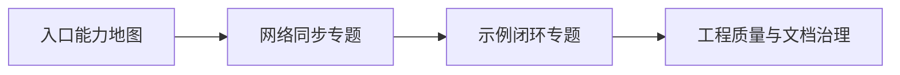
