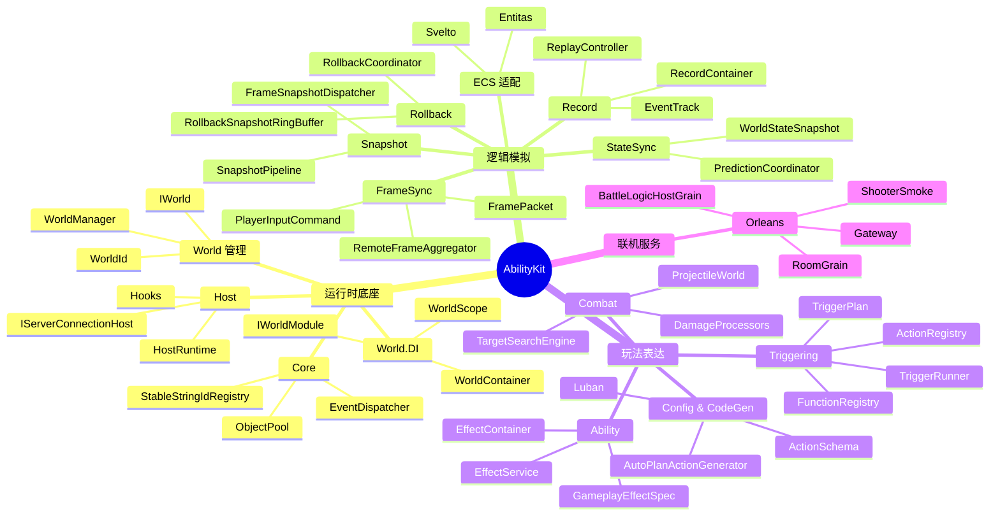
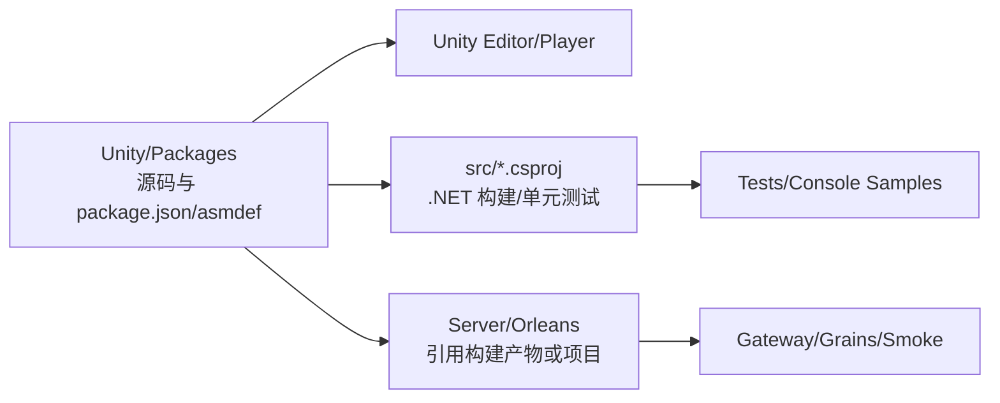
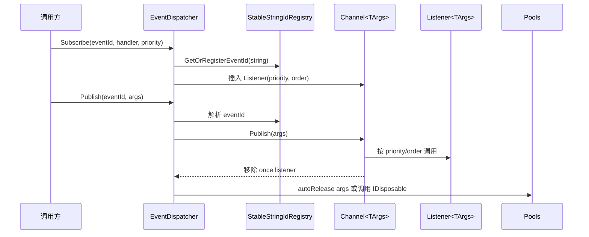
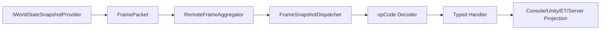
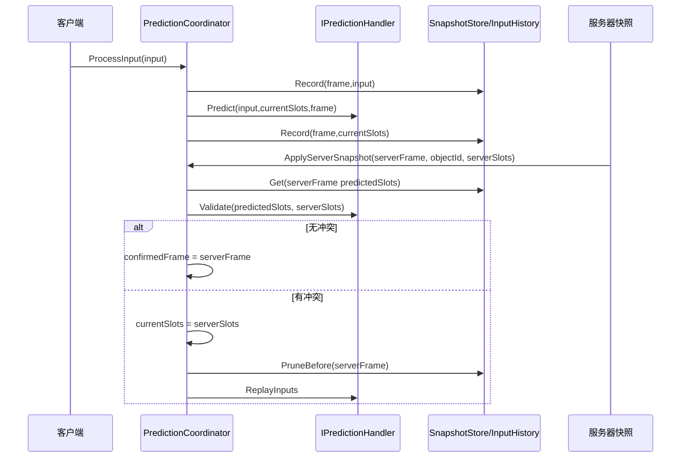
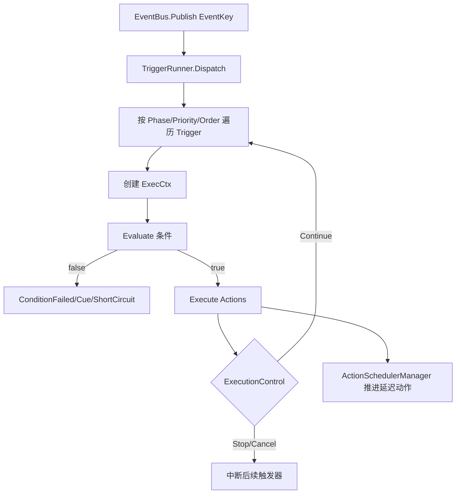
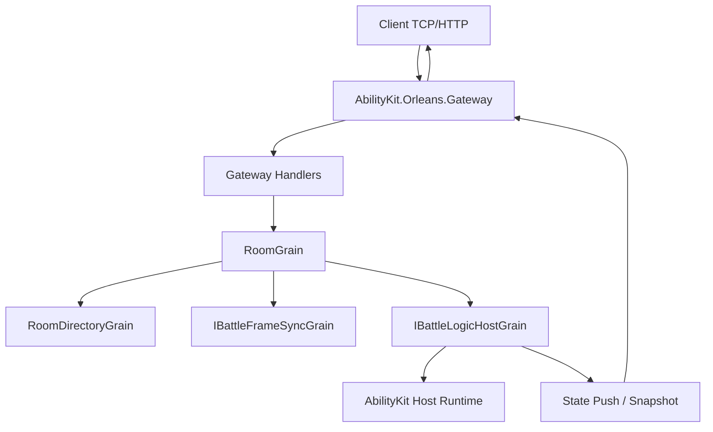
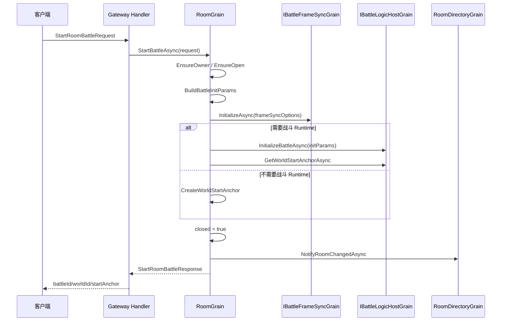

# AbilityKit 能力地图

本文从源码出发说明 AbilityKit 实际提供的能力边界。阅读源码时需要牢记一条工程约束：`Unity/Packages` 是唯一源码位置，`src` 是 .NET SDK 构建和测试工程，`Server/Orleans` 是服务端承载与联机验证工程。

---

## 1. 能力总览

AbilityKit 的核心不是一个孤立的 Skill 类，而是一组可组合能力：



---

## 2. 工程层能力：一份源码，多端构建

### 2.1 设计动机

框架同时服务 Unity 运行时、.NET 测试、服务端 Orleans 承载。若复制源码，会造成 Unity asmdef、.NET csproj、服务端程序集之间行为不一致。因此项目采用“Unity package 存源码，src 工程引用源码”的结构。

### 2.2 分层关系



### 2.3 关键源码入口

| 入口 | 作用 |
|------|------|
| `Unity/Packages/README.md` | 包级文档索引和模块关系 |
| `Unity/Packages/packages-lock.json` | Unity embedded package 依赖图 |
| `src/AbilityKit.sln` | .NET 工程和测试工程地图 |
| `Server/Orleans/README.md` | Orleans 服务端运行说明 |
| `.cursor/rules/src-unity-packages-relation.mdc` | 源码位置约束 |

---

## 3. 运行时底座能力

### 3.1 Core：稳定、低耦合的基础设施

Core 提供跨模块复用的事件、对象池、标识、日志等基础设施。典型源码：

| 类型 | 源码 | 设计意义 |
|------|------|----------|
| EventDispatcher | `Unity/Packages/com.abilitykit.core/Runtime/Event/EventDispatcher.cs` | 支持按事件 ID 和参数类型分 channel，按优先级和注册顺序派发 |
| StableStringIdRegistry | `Unity/Packages/com.abilitykit.core/Runtime/Generic/StableStringIdRegistry.cs` | 把字符串事件/标识稳定映射为整数 ID |
| Pools/ObjectPool | `Unity/Packages/com.abilitykit.core/Runtime` | 降低帧循环中的 GC 压力 |

事件派发主流程：



### 3.2 World.DI：世界级依赖注入

World.DI 用于把一个逻辑世界内的服务、系统、上下文和临时输入隔离在自己的生命周期里。典型源码：

| 类型 | 源码 | 设计意义 |
|------|------|----------|
| WorldContainer | `Unity/Packages/com.abilitykit.world.di/Runtime/World/DI/WorldContainer.cs` | Root 容器，管理 Singleton/Transient，并禁止 Root 解析 Scoped |
| WorldScope | `Unity/Packages/com.abilitykit.world.di/Runtime/World/DI/WorldScope.cs` | 每次流程/阶段创建独立作用域，缓存 Scoped 实例 |
| WorldLifetime | `Unity/Packages/com.abilitykit.world.di/Runtime/World/DI/WorldLifetime.cs` | Singleton/Scoped/Transient 生命周期枚举 |
| IWorldModule | `Unity/Packages/com.abilitykit.world.di/Runtime/World/DI/IWorldModule.cs` | 模块化注册入口 |

依赖解析流程：

```mermaid
flowchart TD
    A[Resolve service] --> B{service 是否注册?}
    B -- 否 --> E[抛出 Service not registered\n包含 Resolve chain]
    B -- 是 --> C{Lifetime}
    C -- Singleton --> D{已有缓存?}
    D -- 是 --> D1[返回 singleton]
    D -- 否 --> D2[Factory(root) 创建]
    D2 --> D3[OnInit]
    D3 --> D4[加入释放顺序]
    C -- Transient --> T1[Factory(root/scope) 创建]
    T1 --> T2[OnInit 后返回]
    C -- Scoped@Root --> S0[禁止 Root 解析 Scoped]
    C -- Scoped@Scope --> S1[scope.GetOrCreate]
    S1 --> S2[Factory(scope) 创建并缓存]
```

设计约束：

- Root 容器不能直接解析 Scoped 服务。
- Singleton 创建过程中不能捕获 Scoped 服务。
- 解析失败会输出 resolve chain，便于定位依赖链。
- `CreateScope(Action<IWorldScopeSeeder>)` 支持在首次解析前播种阶段输入。

### 3.3 Host：世界运行时与连接外壳

Host 是逻辑世界运行、连接管理和消息广播的外壳。典型源码：

| 类型 | 源码 | 设计意义 |
|------|------|----------|
| HostRuntime | `Unity/Packages/com.abilitykit.host/Runtime/Host/Framework/HostRuntime.cs` | 创建/销毁 World，Tick WorldManager，广播 ServerMessage |
| HostRuntimeOptions | `Unity/Packages/com.abilitykit.host/Runtime/Host/Framework/HostRuntimeOptions.cs` | Before/After hooks 和兼容事件 |
| IServerConnectionHost | `Unity/Packages/com.abilitykit.host/Runtime/Host/Transport/IServerConnectionHost.cs` | 连接接入抽象 |
| WorldHostBuilder | `Unity/Packages/com.abilitykit.host/Runtime/Host/Builder/WorldHostBuilder.cs` | 组合 TimeDriver、InputDriver、SnapshotProvider 等部件 |

Host Tick 流程：

```mermaid
sequenceDiagram
    participant Loop as 外部循环/服务器 Tick
    participant Host as HostRuntime
    participant Options as HostRuntimeOptions
    participant Worlds as IWorldManager
    participant World as IWorld

    Loop->>Host: Tick(deltaTime)
    Host->>Options: PreTick hooks
    Host->>Worlds: Tick(deltaTime)
    Worlds->>World: Tick/Execute systems
    World-->>Worlds: 完成本帧逻辑
    Worlds-->>Host: 返回
    Host->>Options: PostTick hooks
```

---

## 4. 逻辑模拟能力

### 4.1 FrameSync：确定性输入帧

FrameSync 把“玩家操作”变成按帧归档的输入命令，然后由逻辑世界在固定步长下消费。相关类型：

| 类型 | 源码 | 说明 |
|------|------|------|
| FrameIndex | `Unity/Packages/com.abilitykit.world.framesync/Runtime` | 帧号值对象 |
| PlayerInputCommand | `Unity/Packages/com.abilitykit.world.framesync/Runtime` | 玩家输入命令 |
| FramePacket | `Unity/Packages/com.abilitykit.world.networkfragments/Runtime/Frames/FramePacket.cs` | 一帧内的输入和可选快照封包 |
| RemoteFrameAggregator | `Unity/Packages/com.abilitykit.world.networkfragments/Runtime/Frames/RemoteFrameAggregator.cs` | 按 frame 聚合远端输入与快照 |

### 4.2 Snapshot：逻辑状态到表现/网络的桥

Snapshot 能力把逻辑世界产生的状态片段封装成 `WorldStateSnapshot`，再由路由器按 opCode 解码并分发给不同表现端或状态同步端。



### 4.3 StateSync + Prediction + Rollback

StateSync 管权威状态，Prediction 管客户端本地预测，Rollback 管按帧保存与恢复逻辑状态。

| 类型 | 源码 | 说明 |
|------|------|------|
| PredictionCoordinator | `Unity/Packages/com.abilitykit.world.statesync/Runtime/StateSync/Prediction/Core/PredictionCoordinator.cs` | 记录输入、执行预测、应用服务器快照、冲突后回滚重演 |
| RollbackCoordinator | `Unity/Packages/com.abilitykit.world.framesync/Runtime/FrameSync/Rollback/RollbackCoordinator.cs` | 捕获、存储、恢复回滚快照 |
| FrameSnapshotDispatcher | `Unity/Packages/com.abilitykit.world.snapshot/Runtime/SnapshotRouting/FrameSnapshotDispatcher.cs` | 快照解码路由与订阅分发 |

预测校验流程：



---

## 5. 玩法表达能力

### 5.1 Triggering：事件-条件-动作的正式主线

Triggering 是 AbilityKit 的“可数据化玩法逻辑执行器”。它不直接写死 Buff、Projectile、AOE，而是提供事件、条件、动作、黑板、数值域、调度器这些通用执行原语。



关键源码：

| 类型 | 源码 | 说明 |
|------|------|------|
| TriggerRunner | `Unity/Packages/com.abilitykit.triggering/Runtime/Triggering/Runner/TriggerRunner.cs` | 主线编排器，负责订阅、排序、条件评估、执行控制和生命周期回调 |
| TriggerPlan | `Unity/Packages/com.abilitykit.triggering/Runtime/Plans` | 数据化触发器计划 |
| FunctionRegistry | `Unity/Packages/com.abilitykit.triggering/Runtime/Triggering/Registry` | 条件函数扩展点 |
| ActionRegistry | `Unity/Packages/com.abilitykit.triggering/Runtime/Triggering/Registry` | 动作扩展点 |

### 5.2 Ability 与 GameplayEffect

Ability 包把 Triggering、Attributes、Projectile、Area 等模块组合成可落地的效果执行体系。

| 能力 | 典型源码 | 说明 |
|------|----------|------|
| 效果实例 | `Unity/Packages/com.abilitykit.ability/Runtime/Ability/Effect/EffectInstance.cs` | 一次效果施加后的运行时状态 |
| 效果容器 | `Unity/Packages/com.abilitykit.ability/Runtime/Ability/Effect/EffectContainer.cs` | 管理效果集合和生命周期 |
| 效果服务 | `Unity/Packages/com.abilitykit.ability/Runtime/Ability/Effect/EffectService.cs` | 对外施加/移除/更新效果的服务入口 |
| 效果规格 | `Unity/Packages/com.abilitykit.ability/Runtime/Ability/Effect/GameplayEffectSpec.cs` | 数据化效果描述 |

### 5.3 Combat：可组合战斗原语

Combat 包拆成多个原语，避免技能系统变成巨型上帝对象。

| 包 | 能力 | 典型源码 |
|----|------|----------|
| Projectile | 投射物生命周期、发射模式、命中策略、回滚 | `Unity/Packages/com.abilitykit.combat.projectile/Runtime/Projectile` |
| Targeting | 候选目标、规则过滤、评分、TopK 选择 | `Unity/Packages/com.abilitykit.combat.targeting/Runtime/SearchTarget` |
| Damage | 伤害上下文、伤害数据、处理器链 | `Unity/Packages/com.abilitykit.combat.damage/Runtime/Damage` |
| Motion | 位移/运动能力 | `Unity/Packages/com.abilitykit.combat.motion/Runtime` |
| EntityManager | 战斗实体管理 | `Unity/Packages/com.abilitykit.combat.entitymanager/Runtime` |

---

## 6. 服务端能力

Orleans 服务端把房间、网关、战斗逻辑和状态同步接到分布式运行模型中。



关键源码：

| 类型 | 源码 | 说明 |
|------|------|------|
| Program | `Server/Orleans/src/AbilityKit.Orleans.Gateway/Program.cs` | Gateway 启动、配置、Orleans Client 和 HTTP/TCP 管线 |
| RoomGrain | `Server/Orleans/src/AbilityKit.Orleans.Grains/Rooms/RoomGrain.cs` | 房间初始化、加入、准备、开战、晚加入、目录通知 |
| Gateway Handlers | `Server/Orleans/src/AbilityKit.Orleans.Gateway/Gateway/Handlers` | CreateRoom/Join/Ready/Start/SubmitInput 等协议入口 |
| ShooterSmokeRunner | `Server/Orleans/src/AbilityKit.Orleans.ShooterSmoke/Runner/ShooterSmokeRunner.cs` | Shooter 远程闭环烟测 |

Room 开战流程：



---

## 7. 后续文档补齐顺序

1. 补齐 `07-NetworkSynchronization`：状态同步、回滚预测、回放、会话协调。
2. 补齐 `08-GameplayModules`：以 Triggering → Ability → Combat 原语为主线重写流程图。
3. 补齐 `03-LogicalWorldHostDesign`：HostRuntime、Host.Extension、BattleHostLifecycleRunner、FrameSyncDriverModule。
4. 补齐 `09-ImplementationExamples`：MOBA、Shooter、ET、Console 的真实闭环。
