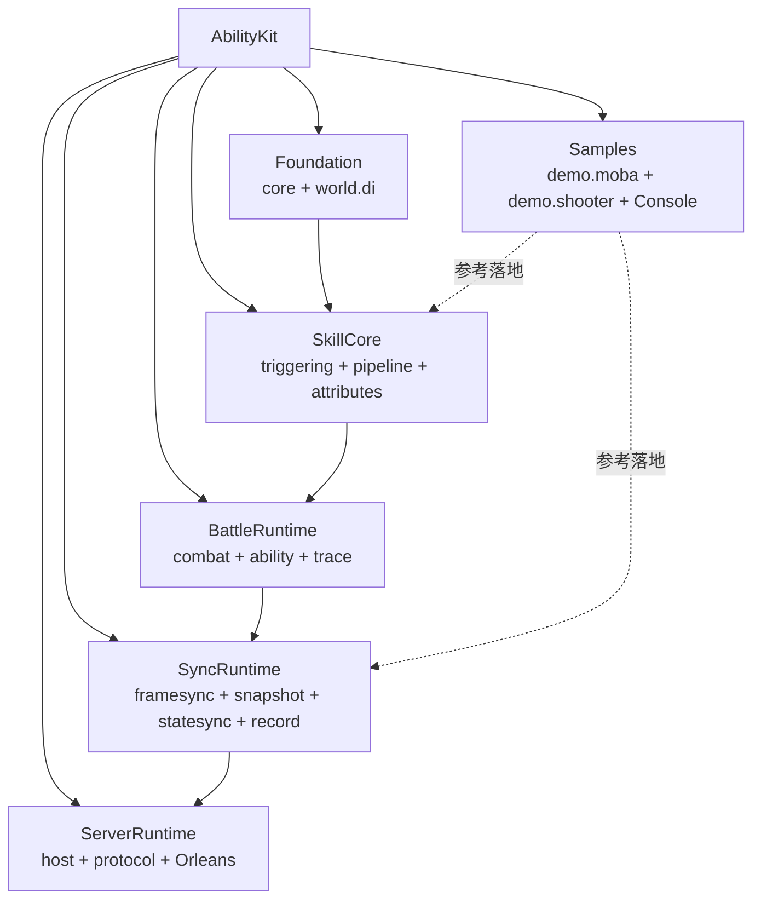
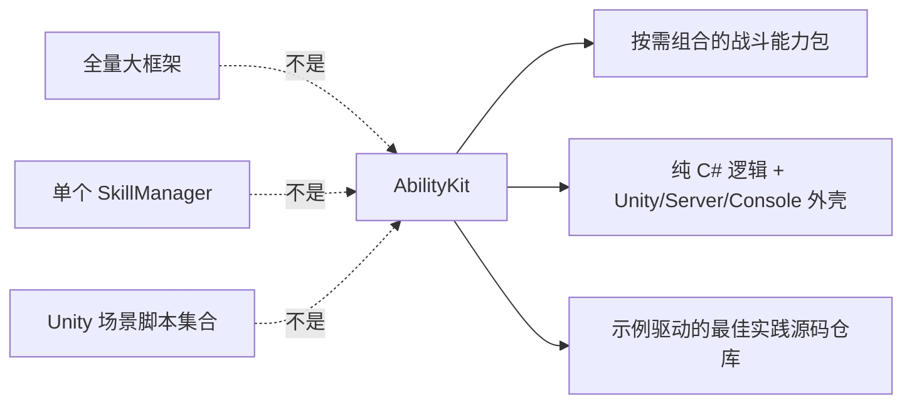
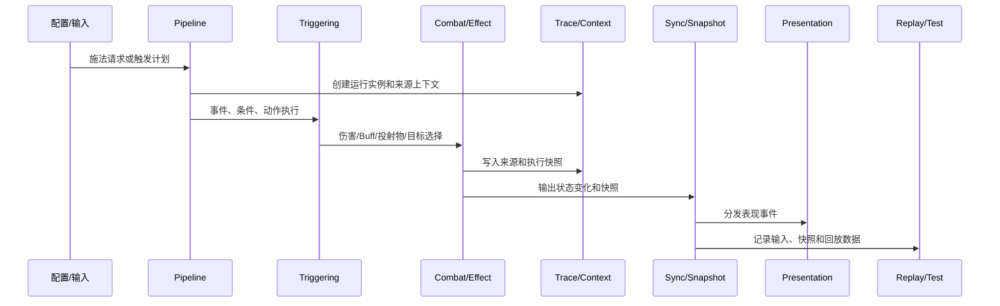
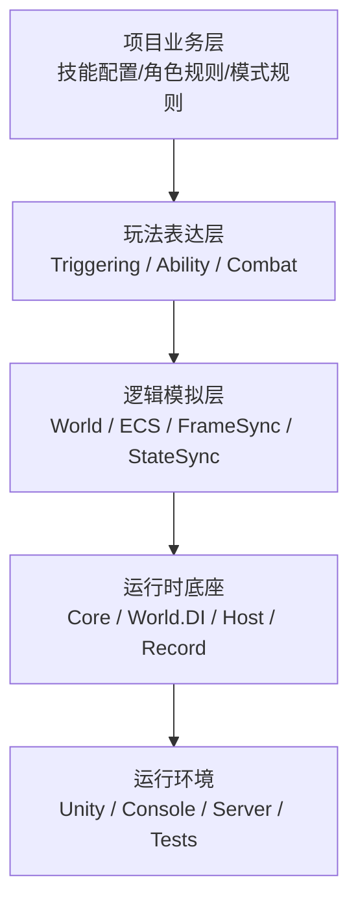
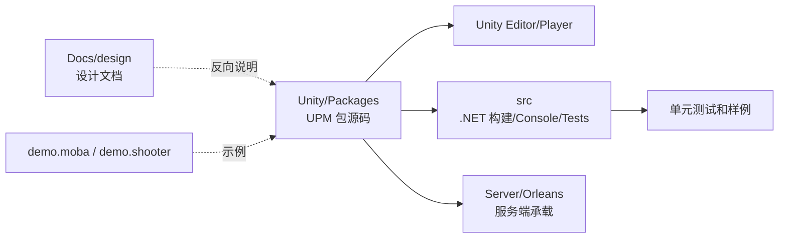
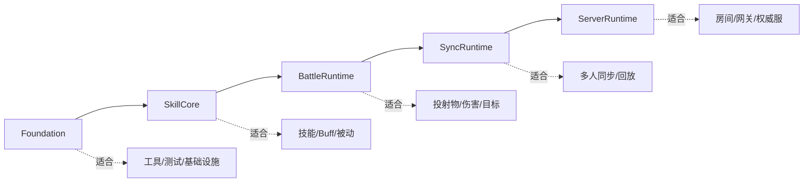
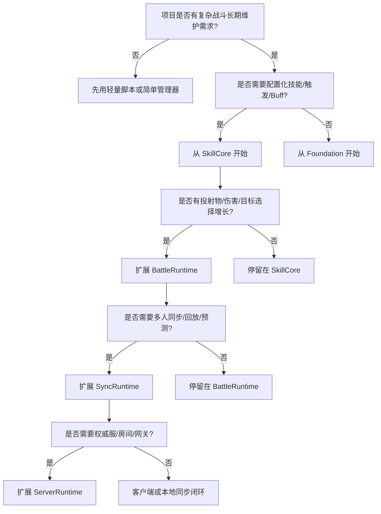
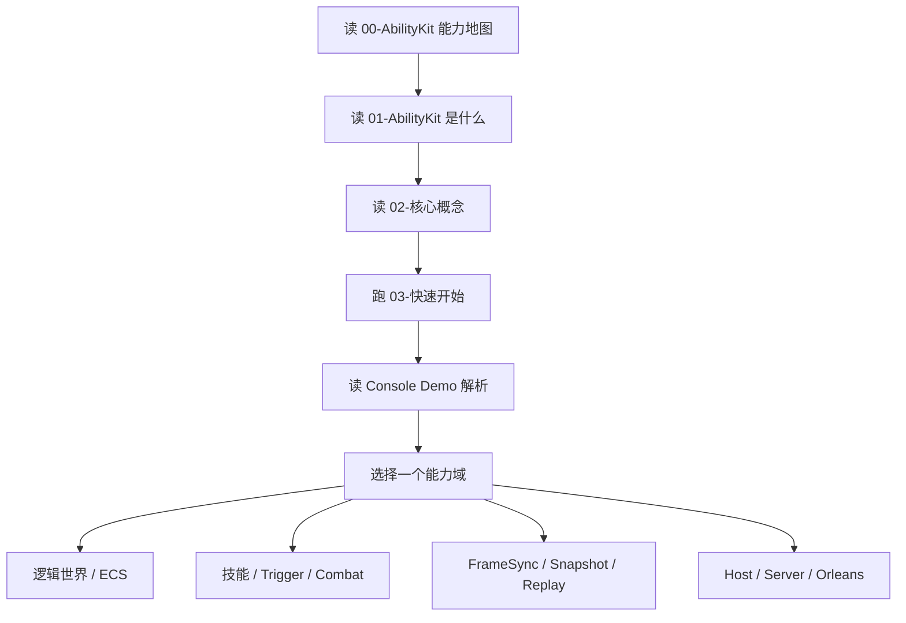

# 1.1 AbilityKit 是什么

> AbilityKit 是一个面向中大型战斗项目的通用游戏战斗工具集合。它不是单一技能类库，也不是必须全量引入的 MOBA 框架，而是一组可以按项目需求组合的 Unity UPM 包、纯 C# 运行时、同步能力、玩法表达模块、示例工程和服务端验证代码。

---

## 目录

- [1.1 AbilityKit 是什么](#11-abilitykit-是什么)
  - [目录](#目录)
  - [1. 一句话定位](#1-一句话定位)
  - [2. 边界判断](#2-边界判断)
  - [3. 它解决的核心问题](#3-它解决的核心问题)
  - [4. 能力分层](#4-能力分层)
  - [5. 源码工程如何组织](#5-源码工程如何组织)
  - [6. 能力组合](#6-能力组合)
  - [7. 适用边界](#7-适用边界)
  - [8. 和行业方案的差异](#8-和行业方案的差异)
  - [9. 源码阅读路径](#9-源码阅读路径)
  - [10. 关联文档](#10-关联文档)

---

## 1. 一句话定位

AbilityKit 的目标是把复杂战斗项目里最容易失控的部分拆成可复用、可测试、可同步、可诊断的模块：技能释放、触发规则、效果执行、Buff、投射物、属性、目标选择、逻辑世界、输入帧、快照、预测回滚、回放和跨端表现。

更具体地说：

| 视角 | 定位 |
|------|------|
| 对游戏程序员 | 一套把技能、触发、效果、同步、回放拆清楚的战斗逻辑底座 |
| 对技术负责人 | 一组可以按复杂度逐步引入的包，而不是一次性绑定全量框架 |
| 对服务端/工具开发 | 可脱离 Unity 运行的纯 C# 逻辑和测试入口 |
| 对策划/内容管线 | 让配置、动作、触发、来源追踪和回放有正式边界 |
| 对 Demo 阅读者 | `demo.moba` 和 `demo.shooter` 是能力展示，不是所有项目必选依赖 |

---

## 2. 边界判断

下列边界用于区分 AbilityKit 的框架定位、示例定位和适用范围。

| 容易混淆的判断 | 设计边界 |
|----------------|----------|
| AbilityKit 是完整 MOBA 游戏框架 | MOBA Demo 是最佳实践示例，框架本身是通用战斗工具集合 |
| 所有项目都要引入所有包 | 推荐按 Foundation、SkillCore、BattleRuntime、SyncRuntime、ServerRuntime 逐级组合 |
| 它只能在 Unity 中跑 | 核心逻辑以纯 C# runtime 组织，可被 `src`、Console、服务器和测试工程复用 |
| 它只是技能系统 | 技能只是入口之一，框架还覆盖 Triggering、Combat、World、Sync、Record、Host 等能力 |
| 它替代所有表现层代码 | 表现层通过事件、快照、View Sink、Binder 接入，Unity/Console/ET 可以各自实现 |
| 它已经是稳定产品包 | 当前处于开发期，包边界、依赖声明、示例和文档还在持续收敛 |

---

## 3. 它解决的核心问题

中大型战斗项目通常不是因为“写不出一个技能”而失控，而是因为技能、Buff、投射物、被动、装备、天赋、表现、同步、回放、诊断长期互相调用，来源不清、生命周期不清、验证不稳定。

AbilityKit 的设计关注这些问题：

| 问题 | 典型症状 | AbilityKit 的处理方式 |
|------|----------|----------------------|
| 技能逻辑散落 | 每个技能单独写脚本，Buff/投射物/伤害重复实现 | 用 Pipeline、Triggering、Action、Effect 拆分执行链路 |
| 来源追踪困难 | 不知道一次伤害来自哪个技能、Buff 或投射物 | 用 Trace、Context、Lineage、RuntimeHandle 记录来源链 |
| 同步侵入玩法 | 输入、快照、网络包写进业务系统 | 用 FrameSync、Snapshot、StateSync、Adapter 隔离同步策略 |
| 回放难复现 | Bug 只在线上出现，缺少输入和状态轨迹 | 用 Record、Replay、FrameSnapshot 保留复现材料 |
| 表现层耦合逻辑 | Unity 特效、Console 输出、服务器逻辑互相污染 | 用 ViewEventSink、SnapshotDispatcher、Presentation Cue 分离表现 |
| 服务生命周期混乱 | 单例、局部状态、临时上下文混用 | 用 World.DI、WorldScope、IWorldModule 管理作用域 |
| 性能压力 | 高频 Tick 分配、查询慢、对象生命周期不可控 | 用对象池、索引、组件查询、流式处理降低成本 |

端到端思路如下：

---

## 4. 能力分层

AbilityKit 的能力可以分为五层。理解这五层之后，再看具体包会清晰很多。

| 层级 | 代表能力 | 设计意图 |
|------|----------|----------|
| 运行时底座 | Core、World.DI、Host、Record | 提供事件、对象池、服务容器、宿主、回放等通用基础设施 |
| 逻辑模拟层 | World、ECS、FrameSync、Snapshot、StateSync、Rollback | 让逻辑世界可以固定步长推进、同步、保存、恢复和验证 |
| 玩法表达层 | Triggering、Pipeline、Ability、Attributes、Combat | 把技能、Buff、伤害、投射物、目标选择拆成可组合规则 |
| 表现接入层 | ViewEventSink、SnapshotDispatcher、Presentation Cue | 让 Unity/Console/ET/服务器观察端以不同方式消费同一逻辑输出 |
| 示例和服务端 | demo.moba、demo.shooter、Server/Orleans | 展示复杂战斗和多人同步的落地组织方式 |

源码里这些层并不是一个大项目，而是多个包组成。根目录 README 也明确说明，真实项目使用时不建议默认全量引入。

---

## 5. 源码工程如何组织

阅读 AbilityKit 要先记住一个工程约束：主要源码在 `Unity/Packages`，`src` 是 .NET SDK 构建和样例工程，`Server/Orleans` 是服务端承载和联机验证工程。

| 目录 | 定位 | 阅读建议 |
|------|------|----------|
| `Unity/Packages` | UPM 包源码和包级文档 | 核心模块边界以这里为准 |
| `src` | .NET 解决方案、Console Demo、测试工程 | 用来验证纯 C# 构建和示例运行 |
| `Server/Orleans` | 房间、网关、战斗宿主等服务端实验 | 关注联机、权威服和 Smoke 验证 |
| `Docs/design` | 跨模块设计文档 | 用来建立地图，再回到源码核对 |
| `LubanConfig` | 配置表和生成素材 | 阅读配置驱动链路时再进入 |
| `tools` | 本地验证、导出、smoke 辅助 | 跑检查和演示时使用 |

包数量很多不是因为项目必须全量使用，而是这个仓库集中保存了工具集合、示例、第三方适配和服务端验证代码。

---

## 6. 能力组合

官方包级索引已经给出了按复杂度推广的组合方式。下表用于说明各组合的引入边界，避免从完整 Demo 反推所有项目都需要的架构。

| 组合 | 包含模块 | 适用场景 | 验收标准 |
|------|----------|----------|----------|
| Foundation | `core` + `world.di` | 新项目启动、基础设施验证、服务作用域验证 | 能纯 C# 或 Unity 运行最小示例，输出日志，不依赖 Demo |
| SkillCore | Foundation + `triggering` + `pipeline` + `attributes` | 技能、Buff、被动、事件规则的最小战斗核心 | 能跑少量技能、Buff、触发规则和对应测试 |
| BattleRuntime | SkillCore + `combat.targeting` + `combat.projectile` + `combat.damage` | 中大型战斗玩法、命中、投射物和伤害链路 | 能验证目标选择、命中、伤害和 Trace 输出 |
| SyncRuntime | BattleRuntime + `framesync` + `snapshot` + `statesync` + `record` + `protocol` | 多人同步、回放、重连、状态恢复 | 能验证输入帧、快照应用、状态哈希和回放 |
| ServerRuntime | `protocol` + `host` + `host.extension` + 服务端适配 | 权威服、房间服、网关服务 | 能启动房间/战斗宿主，并通过 Smoke 验证基础流程 |

这种组合方式的价值在于可控引入：项目可以只停在 SkillCore，也可以继续扩展到 BattleRuntime 或 SyncRuntime。Demo 包只作为参考，不应该成为默认依赖。

---

## 7. 适用边界

AbilityKit 更适合复杂度会持续增长的战斗项目。

| 更适合 | 原因 |
|--------|------|
| MOBA、ARPG、MMO、RTS、多人动作、带复杂技能的 Shooter | 技能、Buff、投射物、被动、属性、目标选择和同步都容易增长 |
| 需要服务端/客户端复用纯 C# 战斗逻辑 | 核心逻辑不依赖 Unity 场景，可被服务器和测试工程复用 |
| 需要配置化技能和可审查规则 | Trigger Plan、Action Schema、Pipeline 可以降低脚本散落风险 |
| 需要战斗日志、回放、自动化测试、预测回滚或状态同步 | 输入、快照、记录和来源链路能帮助复现和诊断 |
| 团队希望长期治理框架边界 | 包、模块、服务、上下文和表现层接入点都有明确边界 |

不建议优先使用的场景：

| 不优先使用 | 原因 |
|------------|------|
| 少量固定技能的小型单机项目 | 简单脚本或轻量管理器更快 |
| 快速原型或一次性交付 | 引入框架的学习和组织成本可能不划算 |
| 不需要同步、回放、来源追踪的项目 | 许多高价值能力暂时用不上 |
| 所有逻辑都可以安全写在 Unity 场景脚本里的项目 | 纯 C# 分层和跨端复用收益有限 |

决策可以按下面流程看：

---

## 8. 和行业方案的差异

AbilityKit 的定位更接近“Unity/C# 生态下的战斗能力工具箱”，而不是某个引擎内建大系统。

| 维度 | Unreal GAS | 常见 Unity 技能框架 | AbilityKit |
|------|------------|--------------------|------------|
| 引擎绑定 | 强绑定 Unreal | 多数绑定 Unity 表现或 MonoBehaviour | 核心逻辑尽量纯 C#，Unity 是一个运行环境 |
| 能力范围 | Ability、Attribute、Effect、Tag 很完整 | 通常聚焦技能、Buff、配置 | 覆盖技能、触发、效果、战斗、同步、回放、Host、示例 |
| 同步支持 | 依赖 Unreal 网络模型 | 往往需要项目自行设计 | 提供 FrameSync、Snapshot、StateSync、Rollback、Record 组合 |
| 引入方式 | 引擎级体系 | 项目级框架 | UPM 包按需组合 |
| 示例定位 | 引擎生态样例 | 通常是单项目 Demo | MOBA/Shooter/Console/Server 多场景参考实现 |
| 可脱离 Unity 运行 | 不适用 | 视实现而定 | 纯 C# 逻辑可以通过 `src` 和服务端工程验证 |

AbilityKit 的优势不在“把每个模块都做成最终形态”，而在于把复杂战斗工程的几个关键边界提前放到同一套源码里：配置执行、运行实例、来源追踪、表现事件、同步快照、回放验证和服务端承载。

---

## 9. 源码阅读路径

源码阅读可按“入口文档 -> 可运行 Demo -> 单个能力源码 -> 专题文档”的顺序推进。

最小阅读路径：

1. `Docs/design/01-OverviewAndGettingStarted/00-AbilityKitCapabilityMap.md`：先看能力边界。
2. `Docs/design/01-OverviewAndGettingStarted/02-CoreConcepts.md`：理解术语和源码边界。
3. `Docs/design/01-OverviewAndGettingStarted/03-QuickStart.md`：跑构建、Console Demo 和测试入口。
4. `Docs/design/09-ImplementationExamples/01-ConsoleDemoAnalysis.md`：看一场可运行战斗如何装配。
5. `Docs/design/02-LogicalWorldDesign/01-WorldOverview.md`：理解 World、服务容器和生命周期。
6. `Docs/design/08-GameplayModules/01-SkillSystemArchitecture.md`：进入技能、触发、效果链路。
7. `Docs/design/07-NetworkSynchronization/01-FrameSync.md`：再进入同步和回放能力。

源码阅读入口：

| 目标 | 入口 |
|------|------|
| 看仓库定位 | `README.md` |
| 看包和组合 | `Unity/Packages/README.md` |
| 看 Console 装配 | `src/AbilityKit.Demo.Moba.Console/Bootstrap/ConsoleBattleBootstrapper.cs` |
| 看轻量 ECS | `src/AbilityKit.World.ECS/Impl/EntityWorld.cs` |
| 看帧同步输入 | `Unity/Packages/com.abilitykit.world.framesync/Runtime/Host/PlayerInputCommand.cs` |
| 看触发器执行 | `Unity/Packages/com.abilitykit.triggering/Runtime/Triggering/Runner/TriggerRunner.cs` |
| 看技能运行时 | `Unity/Packages/com.abilitykit.demo.moba.runtime/Runtime/Application/Services/Skill/Runtime/MobaSkillCastRuntimeService.cs` |
| 看快照分发 | `Unity/Packages/com.abilitykit.world.snapshot/Runtime/SnapshotRouting/FrameSnapshotDispatcher.cs` |
| 看预测回滚 | `Unity/Packages/com.abilitykit.world.statesync/Runtime/StateSync/Prediction/Core/PredictionCoordinator.cs` |
| 看回放容器 | `Unity/Packages/com.abilitykit.record/Runtime/Record/Core/Container/RecordContainer.cs` |

---

## 10. 关联文档

- [能力地图](./00-AbilityKitCapabilityMap.md) - 从源码包和能力域看整体结构。
- [核心概念](./02-CoreConcepts.md) - 理解 World、Entity、Frame、Skill、Trigger、Context、Adapter 等术语。
- [快速开始](./03-QuickStart.md) - 从构建、Demo 和测试入口理解运行闭环。
- [Console Demo 解析](../09-ImplementationExamples/01-ConsoleDemoAnalysis.md) - 从一个完整可运行外壳理解装配链路。

---

*文档版本：v2.0 | 最后更新：2026-07-03*
