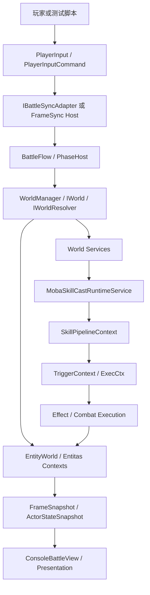
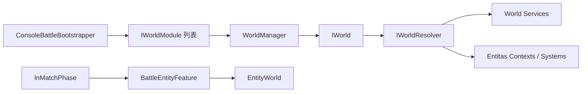
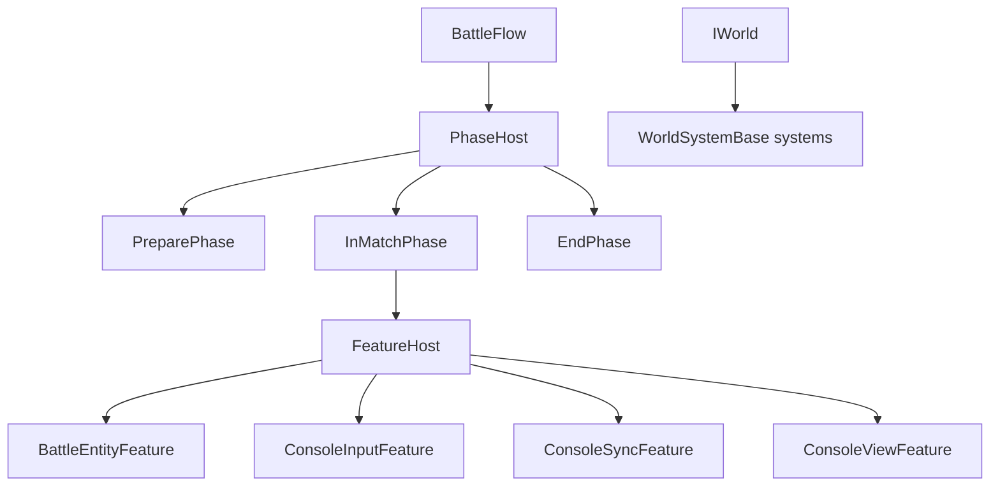
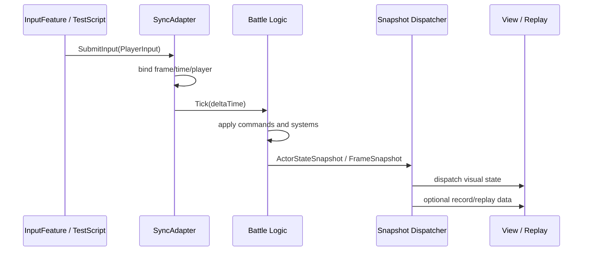
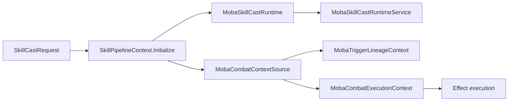
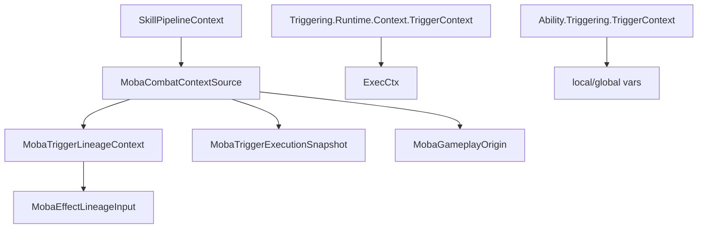
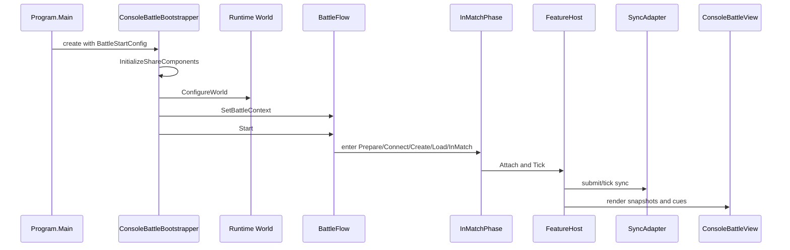
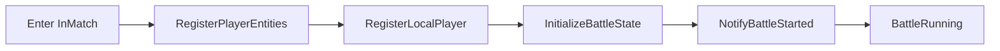
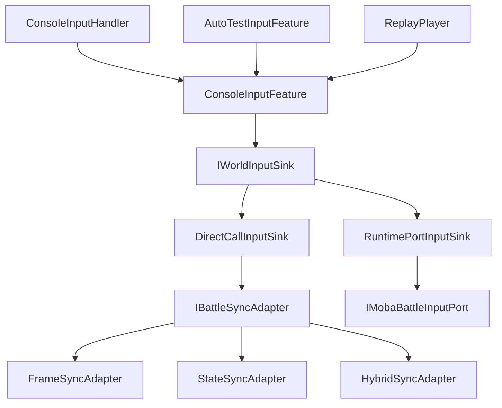
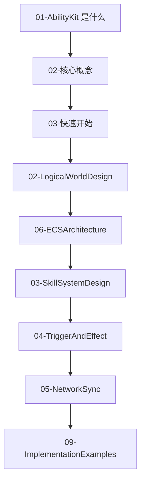

# 1.2 核心概念：从术语到源码边界

> 本文是 AbilityKit 的术语入口。它不按“名词解释”孤立罗列概念，而是把 World、Entity、Frame、Input、Skill、Trigger、Context、Session、Adapter 等词放回真实源码链路中，帮助新手先建立整体地图，再进入后续专题文档。

---

## 目录

1. [先看整体地图](#1-先看整体地图)
2. [World：逻辑世界不是场景对象](#2-world逻辑世界不是场景对象)
3. [Entity 与 Component：实体句柄和数据载体](#3-entity-与-component实体句柄和数据载体)
4. [System 与 Feature：逻辑循环的两层组织方式](#4-system-与-feature逻辑循环的两层组织方式)
5. [Frame、Input、Snapshot：同步层的三件事](#5-frameinputsnapshot同步层的三件事)
6. [Skill、Pipeline、Runtime：一次施法如何被跟踪](#6-skillpipelineruntime一次施法如何被跟踪)
7. [Trigger、Effect、Context：为什么要做上下文传播](#7-triggereffectcontext为什么要做上下文传播)
8. [Session、Flow、Phase：一场战斗怎么启动](#8-sessionflowphase一场战斗怎么启动)
9. [Adapter、Port、Sink：为什么同步和输入要抽象](#9-adapterportsink为什么同步和输入要抽象)
10. [术语表与阅读路线](#10-术语表与阅读路线)

---

## 1. 先看整体地图

AbilityKit 不是单一技能库，而是一组可以组合的战斗能力：逻辑世界负责装配服务和系统，ECS/Entitas/Svelto 负责承载状态，帧同步和状态同步负责推进时间与输入，技能/触发/效果负责表达玩法规则，Demo 外壳负责把这些能力拼成可运行战斗。



这张图里有几个边界要先记住：

| 边界 | 真实含义 | 常见误解 |
|------|----------|----------|
| World | 逻辑世界和服务容器，承载系统、服务、上下文 | 不是 Unity Scene，也不是某个 GameObject |
| Entity | 状态载体的标识或句柄 | 不是一定有业务方法的对象 |
| Component | 可被系统读取或修改的数据 | 不应该塞复杂流程控制 |
| System / Feature | 按 Tick 或阶段执行逻辑的组织单元 | 不是每个模块都必须实现同一个 `IECSystem` |
| Frame | 逻辑推进单位 | 不等于渲染帧 |
| Input | 可同步、可记录、可回放的操作数据 | 不等于直接调用角色移动方法 |
| Context | 跨技能、触发、效果传播的事实集合 | 不只是临时参数袋 |
| Adapter | 把不同同步/网络策略统一成同一调用面 | 不等于具体网络协议 |

---

## 2. World：逻辑世界不是场景对象

在源码里，World 这个词至少有两层含义。

第一层是通用逻辑世界。Console Demo 的启动器会通过 `WorldManager`、`IWorldModule`、`IWorld` 和 `IWorldResolver` 组装运行时世界。这个世界提供服务解析、系统安装、模块引导和生命周期管理。

第二层是状态存储世界。轻量 ECS 的 `EntityWorld` 负责创建实体、存储组件、维护组件索引、父子关系和世界事件。Entitas/Svelto 适配层则承担另一类 ECS 后端的上下文和系统生命周期。



源码入口：

| 文件 | 关注点 |
|------|--------|
| `src/AbilityKit.Demo.Moba.Console/Bootstrap/ConsoleBattleBootstrapper.cs` | Console Demo 如何把配置、世界、同步、视图、输入装配起来 |
| `src/AbilityKit.Demo.Moba.Console/Battle/Flow/BattleFlow.cs` | 战斗流程如何通过 PhaseHost 推进 |
| `Unity/Packages/com.abilitykit.demo.moba.runtime/Runtime/Application/Systems/MobaWorldBootstrapModule.cs` | MOBA 运行时世界模块如何安装系统和服务 |
| `src/AbilityKit.World.ECS/Impl/EntityWorld.cs` | 轻量 ECS 世界如何存实体、组件和索引 |

设计意图是把“战斗怎么跑”和“状态存在哪里”分开。这样 Console Demo、Unity Demo、服务器进程或自动测试都可以复用同一批逻辑服务，而不用把玩法逻辑绑死在某个表现层。

---

## 3. Entity 与 Component：实体句柄和数据载体

AbilityKit 当前不是旧文档里那种 `ActorEntity + ActorTransformComponent + MobaMotionSystem` 的单一路径。真实源码里至少有三种实体视角：

| 视角 | 代表源码 | 用途 |
|------|----------|------|
| 轻量 ECS 句柄 | `IEntity`、`IEntityId`、`EntityWorld` | 包内通用实体组件存储和查询 |
| Demo 战斗实体 | Console Battle ECS EntityFactory/Query | Console Demo 里创建角色、投射物和状态快照 |
| Entitas 实体 | MOBA Entitas contexts/adapters | 复杂 MOBA 运行时系统链路 |

轻量 ECS 的实体不是一个业务对象，而是一个带世界引用和版本化 ID 的值类型句柄。`IEntityId` 用 `Index + Version` 避免槽位复用后旧句柄误操作新实体。

```mermaid
flowchart TD
    Create[EntityWorld.Create] --> Id[IEntityId: Index + Version]
    Id --> Handle[IEntity value handle]
    Handle --> With[With / WithRef]
    With --> Store[object[][] components]
    Store --> Registry[ComponentRegistry: Type -> typeId]
    Store --> Index[_componentIndex: typeId -> entity indices]
    Handle --> Destroy[Destroy]
    Destroy --> Version[Version 增加并释放 Index]
```

一个最小示例：

```csharp
public struct Position
{
    public float X;
    public float Z;
}

public struct MoveSpeed
{
    public float Value;
}

var world = new EntityWorld();

var actor = world.Create("Actor_1")
    .With(new Position { X = 0f, Z = 0f })
    .With(new MoveSpeed { Value = 5f });

world.Query<Position, MoveSpeed>().ForEach((entity, position, speed) =>
{
    position.X += speed.Value * 0.033f;
    entity.With(position);
});
```

这里的关键点是：组件是数据，查询拿到的是当前数据快照，修改值类型组件后需要写回。不要把 `IEntity` 理解成传统面向对象里的角色对象。

---

## 4. System 与 Feature：逻辑循环的两层组织方式

旧文档容易把 System 解释成统一接口，但源码里 System/Feature 是分层的。

| 层次 | 例子 | 职责 |
|------|------|------|
| 轻量 ECS | `EntityQuery<T>` | 只提供实体、组件、查询和事件，不定义统一系统接口 |
| Entitas 世界系统 | `WorldSystemBase` | 提供 Initialize/Execute/Cleanup/TearDown 生命周期 |
| Demo Feature | `FeatureHost`、`ConsoleInputFeature`、`ConsoleSyncFeature` | Console Demo 战斗阶段内每帧执行的功能块 |
| Phase | `PreparePhase`、`InMatchPhase`、`EndPhase` | 管理战斗启动、加载、对局中、结束等阶段 |



为什么要这么分：

| 问题 | 设计处理 |
|------|----------|
| 不同运行环境需要不同外壳 | Demo Feature 负责表现层和输入层，运行时 World 负责通用逻辑 |
| 初始化不是一帧内全完成 | Phase 和 step-based phase 允许分步执行 |
| 不同 ECS 后端系统接口不同 | 用适配层承载 Entitas/Svelto，不让轻量 ECS 强行统一所有系统 |
| 测试需要替换输入或同步 | Feature、Adapter、Sink 可以被替换 |

---

## 5. Frame、Input、Snapshot：同步层的三件事

帧同步层关注的是“在第几帧执行了什么输入，以及如何重放或校验结果”。真实输入命令不是旧文档里的 `EInputType` 枚举，而是 `FrameIndex + PlayerId + OpCode + Payload`。

```csharp
public readonly struct PlayerInputCommand
{
    public readonly FrameIndex Frame;
    public readonly PlayerId Player;
    public readonly int OpCode;
    public readonly byte[] Payload;
}
```

这种设计把“操作类型”留给业务协议解释：移动、技能、停止、攻击都可以变成不同 `OpCode` 和二进制载荷。同步层不需要知道 MOBA 的每个输入细节。



相关术语：

| 术语 | 源码含义 |
|------|----------|
| `FrameIndex` | 逻辑帧号的值类型包装 |
| `PlayerId` | 玩家标识，MemoryPack 可序列化 |
| `PlayerInputCommand` | 帧同步 Host 使用的输入命令 |
| `PlayerInput` | Console SyncAdapter 接口里的简化输入数据 |
| `FrameSnapshot` | 用于回放/记录或同步分发的帧状态快照 |
| `ActorStateSnapshot` | Console Demo 视图层使用的角色状态快照 |

新手要注意：逻辑帧和渲染帧是两件事。同步适配器暴露 `LogicTimeSeconds` 和 `RenderTimeSeconds`，就是为了让逻辑推进和视图插值可以分开处理。

---

## 6. Skill、Pipeline、Runtime：一次施法如何被跟踪

技能不是简单的 `Cast()` 方法。MOBA Demo 里一次施法会被包装成 `SkillCastRequest`，进入 `SkillPipelineContext`，同时由 `MobaSkillCastRuntimeService` 创建和维护运行时对象，用来跟踪阶段、输入更新、子运行时、黑板、诊断和结束条件。



`SkillCastRequest` 承载的是一次施法需要的核心事实：

| 字段 | 含义 |
|------|------|
| `SkillId` / `SkillSlot` | 释放哪个技能，以及来自哪个技能槽 |
| `CasterActorId` / `TargetActorId` | 来源角色和目标角色 |
| `AimPos` / `AimDir` | 瞄准位置和方向 |
| `WorldServices` | 施法期间可解析的世界服务 |
| `EventBus` | 用于技能和触发链路通信的事件总线 |
| `CasterUnit` / `TargetUnit` | 运行时单位门面，屏蔽底层实体实现 |

`SkillPipelineContext` 会把这些事实同步到通用管线接口，同时保留运行时句柄、帧号、施法序号、输入释放状态、时间线事件游标等运行态信息。这样长按技能、持续施法、投射物子节点、延迟效果都能被统一追踪。

---

## 7. Trigger、Effect、Context：为什么要做上下文传播

Trigger 和 Effect 的难点不是“执行一个动作”，而是动作执行时必须知道来源、目标、所有权、根上下文、触发原因和运行时边界。AbilityKit 用多层 Context 解决这个问题。



源码里存在两类容易混淆的 `TriggerContext`：

| 类型 | 位置 | 用途 |
|------|------|------|
| `AbilityKit.Triggering.Runtime.Context.TriggerContext` | `com.abilitykit.triggering` | 聚合黑板、事件总线、帧时钟、随机数、函数/动作注册表，并创建执行上下文 |
| `AbilityKit.Ability.Triggering.TriggerContext` | `com.abilitykit.ability` | Ability 层触发上下文，带对象池、本地/全局变量、Source/Target/Event |

为什么不直接把所有字段塞进一个参数对象：

| 需求 | Context 设计的作用 |
|------|--------------------|
| 伤害、Buff、投射物都要追踪来源 | `MobaCombatContextSource` 和 lineage 结构保留根节点和父节点 |
| 触发器需要读取黑板和表达式 | Runtime TriggerContext 聚合 Resolver、FunctionRegistry、ActionRegistry |
| 长生命周期技能需要诊断 | Runtime handle、generation、blackboard、children 支持扫描和清理 |
| 回放和同步需要确定性 | 上下文显式记录 frame、source id、config id，减少隐式状态依赖 |

---

## 8. Session、Flow、Phase：一场战斗怎么启动

Console Demo 是理解 AbilityKit 的好入口，因为它把一场战斗从配置到运行的链路暴露得比较完整。



`InMatchPhase` 进入对局后会按步骤初始化：



这些阶段不是为了“写得复杂”，而是解决真实战斗启动里的顺序问题：配置要先加载，世界和服务要先建好，实体要先生成，本地玩家要绑定，状态要进入 InMatch，最后才能让输入、同步、表现层开始稳定 Tick。

---

## 9. Adapter、Port、Sink：为什么同步和输入要抽象

AbilityKit 的 Demo 会同时演示本地帧同步、状态同步、混合同步、自动测试、回放等场景。如果输入和同步直接写死到某个系统里，这些场景很快会互相污染。

`IBattleSyncAdapter` 统一了 Console Demo 的同步调用面：

| 成员 | 作用 |
|------|------|
| `Mode` | 当前同步策略 |
| `CurrentFrame` | 当前逻辑帧 |
| `LogicTimeSeconds` | 逻辑时间 |
| `RenderTimeSeconds` | 渲染插值时间 |
| `SubmitInput` | 提交本地输入 |
| `Tick` | 推进同步适配器 |
| `GetAllActorStates` | 给视图层读取当前状态 |
| `OnActorStateSnapshot` | 接收或分发服务器/本地快照 |



这套抽象的收益是：同一份输入意图可以进入本地适配器、运行时输入端口、自动化脚本或回放系统。上层关心“玩家想做什么”，下层决定“这个操作如何同步、记录和应用”。

---

## 10. 术语表与阅读路线

### 10.1 核心术语表

| 术语 | 初学者理解 | 源码边界 |
|------|------------|----------|
| AbilityKit | 战斗技能与同步能力集合 | 多包、多 Demo、多后端的框架族 |
| World | 逻辑运行容器 | `IWorld`、`WorldManager`、`IWorldResolver`、`EntityWorld` |
| Entity | 状态标识或句柄 | `IEntity`、`IEntityId`、Entitas entity、Demo actor/net id |
| Component | 实体上的数据 | 值类型组件、引用组件、Entitas 组件、Demo ECS 组件 |
| System | 按生命周期执行的逻辑 | Entitas `WorldSystemBase`、模块安装系统、业务系统 |
| Feature | Demo 阶段内的可插拔功能 | `FeatureHost` 管理输入、同步、视图、实体等 Feature |
| Frame | 逻辑帧 | `FrameIndex` 或适配器里的 `CurrentFrame` |
| Input | 可同步的玩家操作 | `PlayerInputCommand`、`PlayerInput`、OpCode/Payload |
| Snapshot | 某帧或某刻状态 | `FrameSnapshot`、`ActorStateSnapshot`、表现事件数据 |
| Skill | 技能配置和一次释放行为 | `SkillCastRequest`、pipeline、runtime service |
| Pipeline | 技能执行过程 | `SkillPipelineContext` 管理阶段、时间、输入、上下文 |
| Runtime | 长生命周期运行态 | `MobaSkillCastRuntime`、runtime handle、blackboard、children |
| Trigger | 条件满足后执行动作 | Triggering runtime、Ability trigger context、event bus |
| Effect | 对战斗状态产生影响的动作 | 伤害、Buff、投射物、表现 cue 等下游执行 |
| Context | 跨层传播的事实 | combat source、lineage、origin、execution snapshot |
| Session | 一场战斗的外层会话 | Console session hooks、battle start config/plan |
| Flow | 战斗流程控制 | `BattleFlow`、`PhaseHost`、Phase transitions |
| Adapter | 策略适配层 | 同步适配器、输入 sink、运行时端口 |
| Registry | ID/类型/函数注册表 | ComponentRegistry、FunctionRegistry、ActionRegistry |
| Blackboard | 运行时共享数据区 | Trigger blackboard、Skill runtime blackboard |

### 10.2 推荐阅读路线



建议先按下面顺序读源码：

1. `src/AbilityKit.Demo.Moba.Console/Bootstrap/ConsoleBattleBootstrapper.cs`：看 Demo 如何把配置、世界、输入、同步、视图装起来。
2. `src/AbilityKit.Demo.Moba.Console/Battle/Flow/BattleFlow.cs`：看战斗阶段怎么推进。
3. `src/AbilityKit.Demo.Moba.Console/Battle/Flow/Phases/InMatchPhase.cs`：看进入对局后如何创建实体并启动 Feature。
4. `src/AbilityKit.World.ECS/Impl/EntityWorld.cs`：看轻量 ECS 的真实实体、组件、查询模型。
5. `Unity/Packages/com.abilitykit.world.framesync/Runtime/Host/PlayerInputCommand.cs`：看同步输入的最小数据结构。
6. `Unity/Packages/com.abilitykit.demo.moba.runtime/Runtime/Application/Services/Skill/Pipeline/SkillPipelineContext.cs`：看一次技能释放携带哪些事实。
7. `Unity/Packages/com.abilitykit.demo.moba.runtime/Runtime/Application/Services/Context/Execution/MobaCombatContextSource.cs`：看技能、触发、效果之间如何传播来源。
8. `Unity/Packages/com.abilitykit.triggering/Runtime/Context/TriggerContext.cs`：看触发器运行时依赖哪些服务。

### 10.3 最容易踩的坑

| 误区 | 正确理解 |
|------|----------|
| 把 AbilityKit 当成单一技能系统 | 它同时覆盖世界、ECS、技能、触发、同步、表现、Demo 和测试外壳 |
| 把 World 当 Unity Scene | World 是逻辑容器和服务边界，可以在 Console/服务器/测试环境运行 |
| 把 Entity 当业务对象 | 轻量 ECS 中 Entity 是句柄，数据在组件表中 |
| 认为输入类型一定是枚举 | 真实同步输入是 `OpCode + Payload`，业务自己解释 |
| 混淆逻辑帧和渲染帧 | 同步层推进逻辑时间，视图层可以用渲染时间插值 |
| 把 TriggerContext 当一个类型 | 源码中至少有 Runtime TriggerContext 和 Ability TriggerContext 两类用途 |
| 认为 System 只有一种接口 | 轻量 ECS、Entitas、Feature、Phase 各有不同执行边界 |
| 忽略 Context/Lineage | 没有上下文传播，伤害、Buff、投射物、回放、诊断都很难追踪来源 |

---

## 下一步

- [快速开始](./03-QuickStart.md) - 从构建、Demo、测试入口开始跑起来。
- [逻辑世界概述](../02-LogicalWorldDesign/01-WorldOverview.md) - 深入理解 World、服务、模块和系统装配。
- [ECS 核心概念](../06-ECSArchitecture/01-ECSCoreConcepts.md) - 深入理解 `EntityWorld`、`IEntity`、`IEntityId` 和查询模型。
- [Console Demo 解析](../09-ImplementationExamples/01-ConsoleDemoAnalysis.md) - 从可运行 Demo 反向理解完整链路。

---

*文档版本：v2.0 | 最后更新：2026-07-03*
