# 1.3 快速开始：从源码到第一个可运行闭环

> 本文面向第一次接触 AbilityKit 的开发者。目标不是一次读完所有模块，而是先建立“代码在哪里、怎么运行、运行后看什么、下一步改哪里”的最短路径。本文结论来自 `README.md`、`Unity/Packages/README.md`、`.cursor/rules/src-unity-packages-relation.mdc`、`src/AbilityKit.sln`、Console Demo 启动链路和 P0 相关测试工程。

---

## 1. 快速开始的定位

AbilityKit 不是单个 Unity 插件，而是一组可以在 Unity、纯 .NET、服务端和 Demo 中复用的框架包。第一次上手最容易迷路的原因，是仓库里同时存在三类入口：

| 入口 | 作用 | 新手应该怎么用 |
|------|------|----------------|
| `Unity/Packages` | 唯一源码位置，也是 Unity Package 入口 | 阅读和修改框架源码从这里开始 |
| `src` | .NET SDK 工程，用于构建、测试、Console Demo | 先用它跑通最小闭环 |
| `Server/Orleans` | Orleans 网关、房间、战斗宿主和 Smoke 验证 | 理解多人服务端链路时再进入 |

推荐第一天的目标很具体：

1. 知道源码和工程引用关系。
2. 跑通一个 Console Demo 或测试。
3. 能顺着一次 Tick 看见配置、阶段、输入、逻辑世界、同步适配器、表现输出的流向。
4. 能定位一个基础模块的源码，例如事件、DI、Host、ECS 查询。

---

## 2. 新手上手路线图

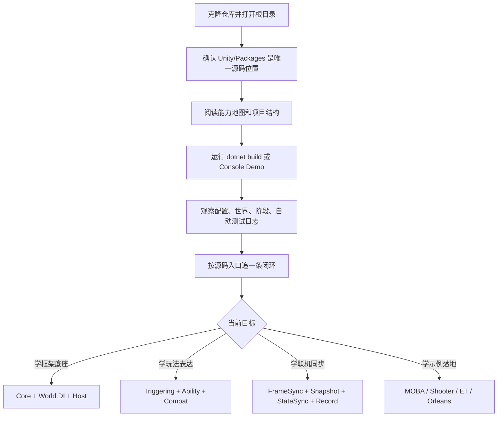

这条路线的核心思想是：先跑起来，再读源码；先读一条闭环，再扩展到所有模块。

---

## 3. 环境与工程入口

### 3.1 推荐先检查这些文件

| 文件/目录 | 说明 |
|-----------|------|
| `README.md` | 仓库级定位、端到端能力管线、推荐阅读路径 |
| `Unity/Packages/README.md` | Package 分级、推荐组合、模块文档索引 |
| `.cursor/rules/src-unity-packages-relation.mdc` | 明确 `Unity/Packages` 是唯一源码位置，`src` 通过项目文件引用源码 |
| `.cursor/rules/ability-package-structure.mdc` | Runtime、Editor、Samples、package 命名和包结构约束 |
| `src/AbilityKit.sln` | .NET 解决方案入口，包含框架、Demo、测试项目 |
| `Docs/design/00-index.md` | 当前设计文档总索引和源码入口索引 |

### 3.2 为什么先从 `src` 跑

Unity Editor 启动慢，且很多逻辑模块不依赖 Unity 场景。AbilityKit 把核心逻辑放在 `Unity/Packages`，再由 `src/*.csproj` 引用这些源码，所以可以用 .NET 快速验证：

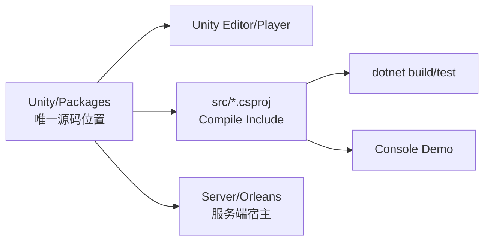

这意味着：

- 读源码时看 `Unity/Packages`。
- 跑测试和 Console Demo 时进 `src` 对应工程。
- 不要在 `src` 里复制一份框架源码。
- 如果 `src` 和 Unity 行为不一致，优先检查 `.csproj` 的 `<Compile Include>` 是否覆盖了真正的 package 源码。

---

## 4. 最小运行路径

### 4.1 构建解决方案

在仓库根目录执行：

```powershell
dotnet build src/AbilityKit.sln
```

这个命令会验证 `.NET` 工程引用的 package 源码能否编译。它适合做第一轮总体验证；如果只想看某个能力，可以直接运行具体测试项目。

### 4.2 运行 MOBA Console Demo

```powershell
dotnet run --project src/AbilityKit.Demo.Moba.Console/AbilityKit.Demo.Moba.Console.csproj
```

该 Demo 的入口是 `src/AbilityKit.Demo.Moba.Console/Program.cs`。默认模式会创建 `ConsoleBattleBootstrapper`，初始化配置和运行时世界，进入战斗阶段，然后由 `AutoTestRunner` 驱动一段完整战斗脚本。

Console Demo 支持几类 CLI 模式：

| 模式 | 命令 | 作用 |
|------|------|------|
| 默认自动测试 | `dotnet run --project src/AbilityKit.Demo.Moba.Console/AbilityKit.Demo.Moba.Console.csproj` | 运行 FullBattleScenario，验证初始化、阶段切换、自动输入 |
| 技能测试 | `dotnet run --project src/AbilityKit.Demo.Moba.Console/AbilityKit.Demo.Moba.Console.csproj -- --skill` | 开启 Trace/Debug 日志，重复执行技能释放场景 |
| 录制 | `dotnet run --project src/AbilityKit.Demo.Moba.Console/AbilityKit.Demo.Moba.Console.csproj -- --record` | 进入记录模式，输出 replay 文件 |
| 回放 | `dotnet run --project src/AbilityKit.Demo.Moba.Console/AbilityKit.Demo.Moba.Console.csproj -- --replay Records/replay_xxx.akrec` | 从指定记录文件回放 |
| 列表 | `dotnet run --project src/AbilityKit.Demo.Moba.Console/AbilityKit.Demo.Moba.Console.csproj -- --list` | 列出现有记录文件 |

同步模式也可以通过环境变量覆盖：

```powershell
$env:SYNC_MODE="SnapshotAuthority"
dotnet run --project src/AbilityKit.Demo.Moba.Console/AbilityKit.Demo.Moba.Console.csproj
```

当前 `ConsoleConfigLoader` 支持的值包括 `Lockstep`、`SnapshotAuthority`、`Hybrid`。如果设置为 `SnapshotAuthority`，`ConsoleBattleBootstrapper.Start()` 会在配置允许时连接 `StateSyncAdapter`。

### 4.3 Console Demo 启动后真实发生什么

源码链路不是“Main 直接创建角色并执行技能”，而是由 bootstrapper、runtime world、phase flow 和 feature host 分层完成：

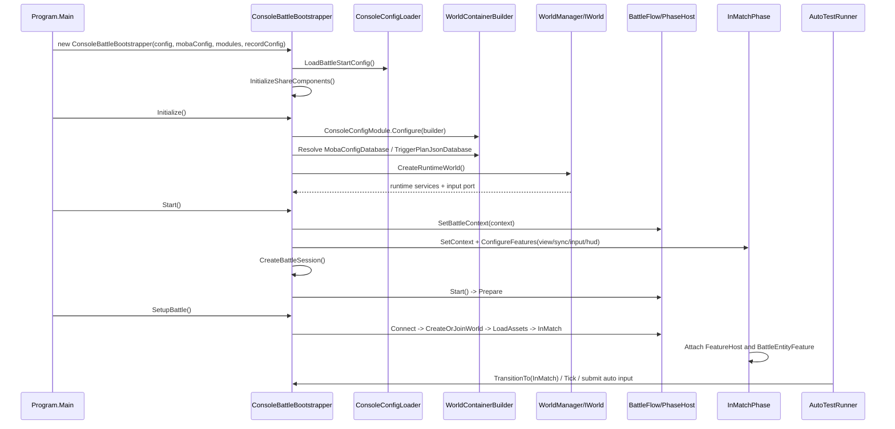

进入 `InMatch` 后，阶段内部还有四步初始化：

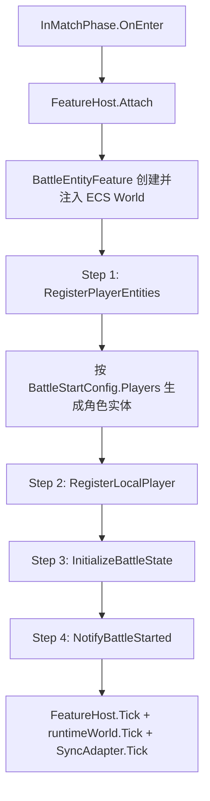

运行后建议观察三类输出：

| 输出 | 用来判断什么 |
|------|--------------|
| 配置加载日志 | `battle_start`、角色、技能、TriggerPlan 是否加载成功 |
| Runtime world 初始化日志 | `WorldManager`、`MobaWorldBootstrapModule`、服务扫描和输入端口是否装配成功 |
| 阶段与自动测试结果 | `Prepare/Connect/CreateOrJoinWorld/LoadAssets/InMatch` 是否正常推进，脚本、初始化、阶段测试是否通过 |

### 4.4 运行指定测试项目

例如只验证 World DI：

```powershell
dotnet test src/AbilityKit.World.DI.Tests/AbilityKit.World.DI.Tests.csproj
```

例如只验证网络运行时：

```powershell
dotnet test src/AbilityKit.Network.Runtime.Tests/AbilityKit.Network.Runtime.Tests.csproj
```

例如只验证 Shooter Runtime：

```powershell
dotnet test src/AbilityKit.Demo.Shooter.Runtime.Tests/AbilityKit.Demo.Shooter.Runtime.Tests.csproj
```

测试项目适合用来学习模块边界，因为它们通常比 Demo 更小，失败信息也更直接。

---

## 5. 第一次读源码建议追的五条链路

### 5.1 Core 事件链路

源码入口：`Unity/Packages/com.abilitykit.core/Runtime/Event/EventDispatcher.cs`、`Unity/Packages/com.abilitykit.core/Runtime/Generic/StableStringIdRegistry.cs`。

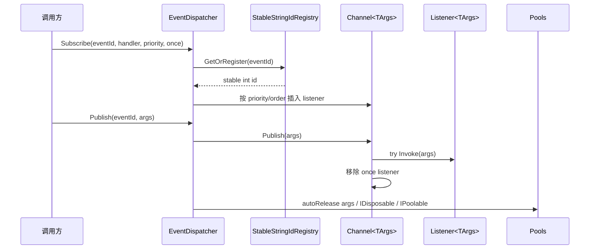

这条链路体现了 AbilityKit 底座的几个倾向：稳定 ID、低分配、容错派发、生命周期自动释放。

### 5.2 World DI 链路

源码入口：`Unity/Packages/com.abilitykit.world.di/Runtime/World/DI/WorldContainer.cs`、`Unity/Packages/com.abilitykit.world.di/Runtime/World/DI/WorldScope.cs`。

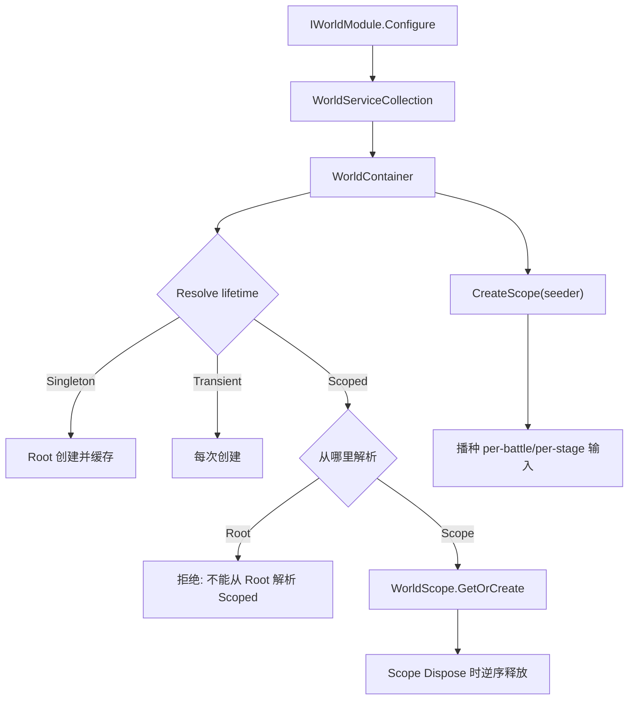

新手需要先记住一句话：`WorldContainer` 管根生命周期，`WorldScope` 管一次世界或一次阶段内的局部生命周期，播种对象由外部持有，不由 scope 释放。

### 5.3 Host Tick 链路

源码入口：`Unity/Packages/com.abilitykit.host/Runtime/Host/Framework/HostRuntime.cs`。

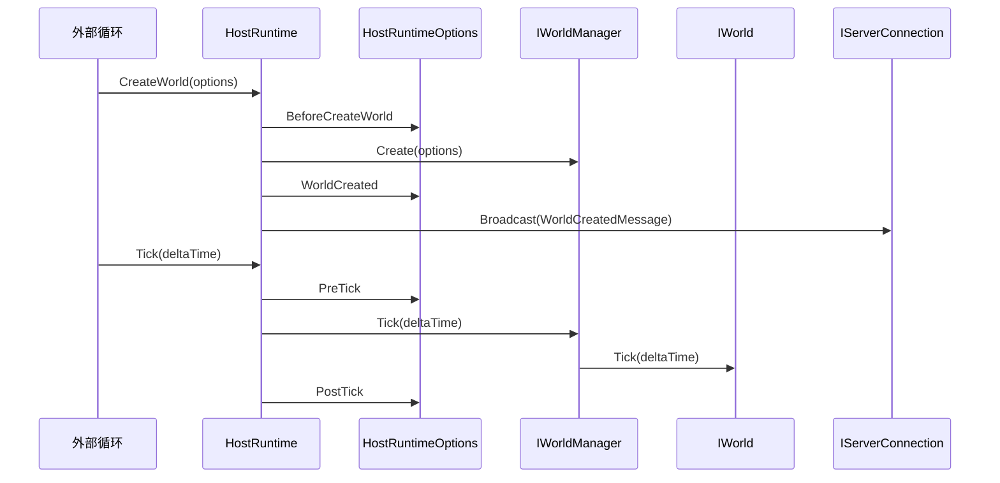

Host 不直接写业务战斗逻辑，它提供世界生命周期、连接管理、消息广播和 Tick Hook。业务模块通过 World、DI、Host.Extension 或 Demo Runtime 接入。

### 5.4 ECS 查询链路

源码入口：`Unity/Packages/com.abilitykit.world.ecs/Runtime/AbilityKit.World.ECS/Core/EntityQuery.cs`、`Unity/Packages/com.abilitykit.world.ecs/Runtime/AbilityKit.World.ECS/Impl/EntityWorld.cs`。

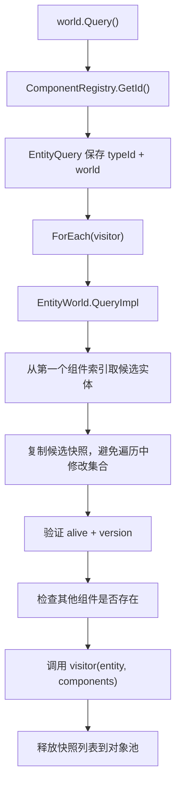

这条链路适合理解 AbilityKit 自研轻量 ECS 的查询思路：用第一个组件索引收窄候选，再在实体组件数组中做类型和存活校验。

### 5.5 Console Demo 一帧 Tick 链路

源码入口：`src/AbilityKit.Demo.Moba.Console/Bootstrap/ConsoleBattleBootstrapper.cs`、`src/AbilityKit.Demo.Moba.Console/Battle/Flow/BattleFlow.cs`、`src/AbilityKit.Demo.Moba.Console/Battle/Flow/Phases/InMatchPhase.cs`。

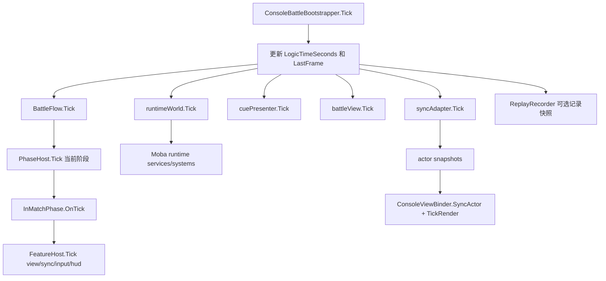

这条链路把“框架源码”和“示例表现”连起来：阶段和 Feature 管 Console 侧流程，Runtime World 管可复用战斗逻辑，SyncAdapter/快照/表现层把逻辑结果投射到可观察输出。

---

## 6. 新人容易混淆的概念

| 概念 | 正确认知 | 常见误解 |
|------|----------|----------|
| `Unity/Packages` | 框架源码唯一位置 | 以为 `src` 也有一份源码可以直接改 |
| `src` | 构建、测试、Console Demo 工程 | 以为它是 Unity 运行时源码根目录 |
| `World` | 逻辑世界和系统执行容器 | 以为它等同 Unity Scene |
| `Host` | 世界运行时外壳和连接外壳 | 以为业务逻辑都写在 `HostRuntime` 里 |
| `WorldScope` | 一段生命周期内的服务解析上下文 | 以为所有服务都应该 Singleton |
| `PhaseHost` | 示例层阶段流，不是通用业务状态机的唯一选择 | 以为所有项目都必须复制 Console 的阶段名 |
| `Snapshot` | 逻辑状态到表现/网络的输出 | 以为表现层可以直接读取逻辑对象 |
| `Demo` | 框架落地参考和验收样板 | 以为业务项目必须完整复制 Demo |

---

## 7. 修改第一个功能时怎么选入口

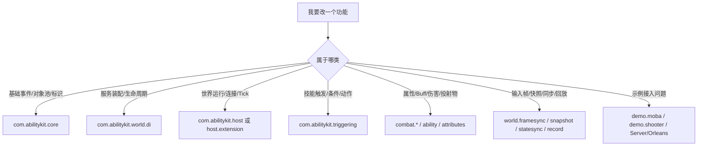

修改前建议先找三件事：

1. 对应 Package 的 `Runtime` 源码。
2. 对应 `src` 工程或测试工程。
3. `Docs/design` 中同能力域的设计文档。

如果只是为了验证框架底座，不要从完整 MOBA Demo 开始改。优先选择 `AbilityKit.World.DI.Tests`、`AbilityKit.Network.Runtime.Tests`、`AbilityKit.Demo.Shooter.Runtime.Tests` 这类更小的测试入口。

---

## 8. 建议的第一周阅读顺序

| 天数 | 阅读目标 | 推荐文档 |
|------|----------|----------|
| 第 1 天 | 建立全局地图，跑通 Demo | `Docs/design/00-index.md`、`Docs/design/01-OverviewAndGettingStarted/00-AbilityKitCapabilityMap.md`、本文 |
| 第 2 天 | 读 World、DI、Host | `Docs/design/02-LogicalWorldDesign/*`、`Docs/design/03-LogicalWorldHostDesign/*` |
| 第 3 天 | 读 Core、事件、对象池、配置 | `Docs/design/05-CommonModules/*` |
| 第 4 天 | 读 Triggering、Skill、Buff、Attribute | `Docs/design/08-GameplayModules/*` |
| 第 5 天 | 读 Snapshot、StateSync、Rollback、Replay | `Docs/design/07-NetworkSynchronization/*` |
| 第 6 天 | 读 MOBA 示例闭环 | `Docs/design/09-ImplementationExamples/03-MOBA%20Demo%20Analysis.md`、`Docs/design/09-ImplementationExamples/MOBA/*` |
| 第 7 天 | 读 Shooter/Orleans 服务端闭环 | `Docs/design/09-ImplementationExamples/04-Shooter%20Demo%20与%20Orleans%20Smoke.md`、`Docs/design/09-ImplementationExamples/Shooter/*` |

---

## 9. 快速开始小结

新手不要从所有包逐个扫起。更有效的方式是：

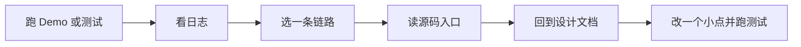

只要理解 `Unity/Packages`、`src`、`World`、`DI`、`Host`、`Snapshot`、`Demo` 这七个入口，后续阅读 Triggering、Ability、Combat、Network 时就不会迷路。
