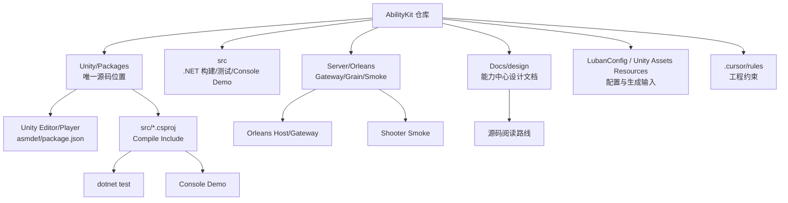
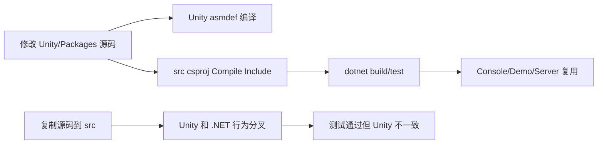
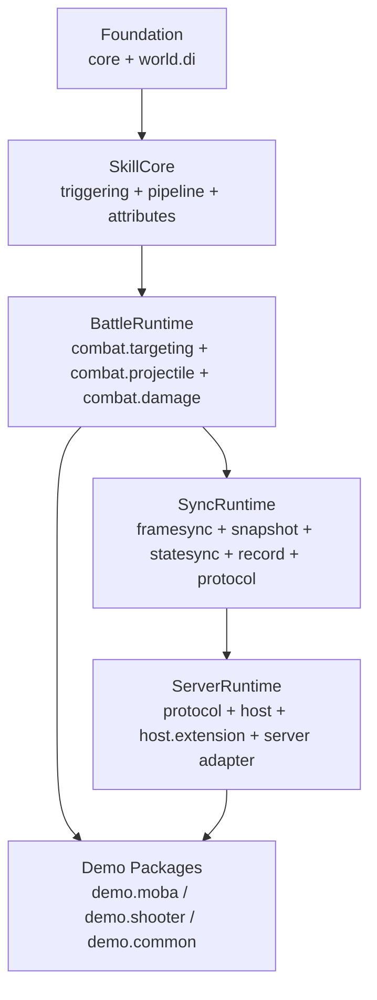
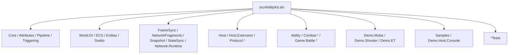
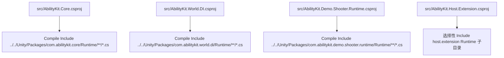
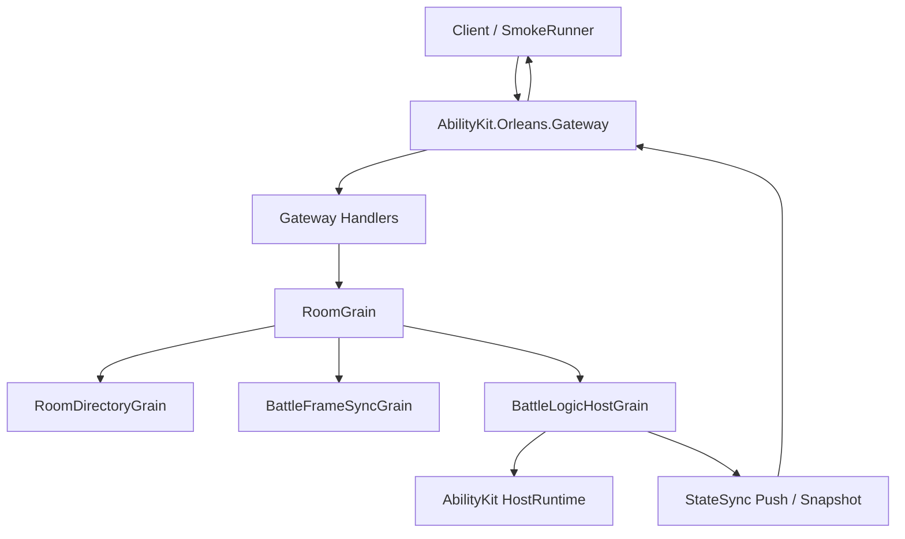
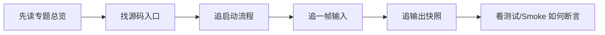
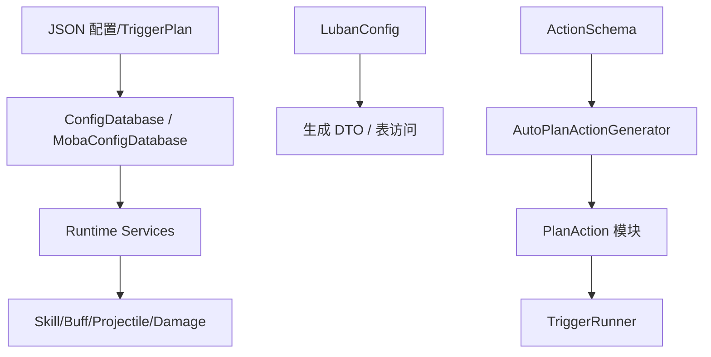
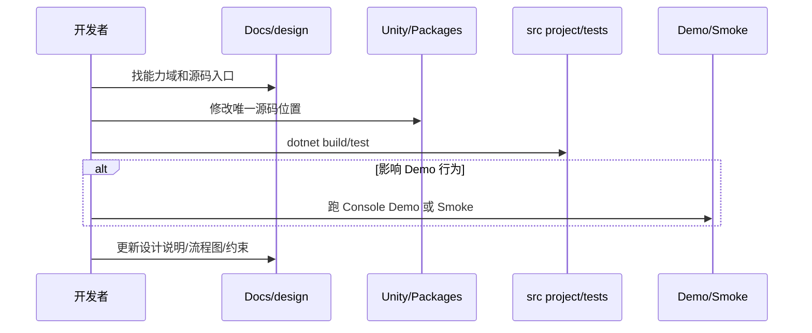
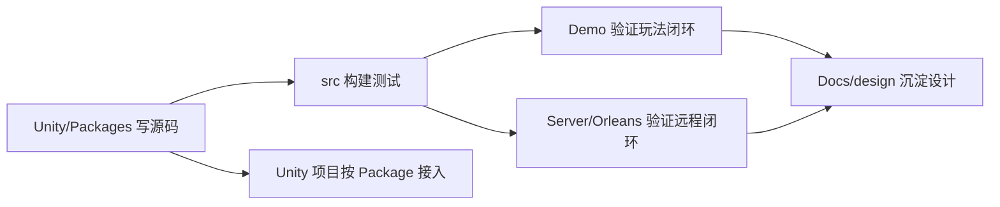

# 1.4 项目结构：Unity Package、.NET 工程、Server 与 Demo 的关系

> 本文解释 AbilityKit 仓库为什么这样组织，以及新人应该如何从目录结构判断“源码在哪里、构建从哪里跑、示例从哪里看、服务端从哪里接”。本文依据 `README.md`、`Unity/Packages/README.md`、`.cursor/rules/src-unity-packages-relation.mdc`、`.cursor/rules/ability-package-structure.mdc`、`src/AbilityKit.sln`、`src/*.csproj` 和 `Server/Orleans/src` 当前目录核对。

---

## 1. 结构设计的核心原则

AbilityKit 当前最重要的工程约束是：`Unity/Packages` 是唯一源码位置，`src` 是 .NET SDK 构建与测试入口，`Server/Orleans` 是服务端验证入口。

这种结构同时满足三件事：Unity 项目按 Package 依赖接入，核心逻辑脱离 Unity Editor 用 `.NET` 快速构建测试，服务端和 Demo 复用同一套框架源码。

---

## 2. 顶层目录职责

| 目录 | 职责 | 什么时候进入 |
|------|------|--------------|
| `Unity/Packages` | 框架源码、Unity asmdef、package.json、Package 文档 | 阅读或修改框架实现时 |
| `src` | `.NET` 解决方案、测试工程、Console Demo、服务端可复用工程 | 构建、测试、纯 C# Demo 调试时 |
| `Server/Orleans` | Gateway、RoomGrain、BattleHost、Shooter Smoke | 研究多人服务端和远程闭环时 |
| `Docs/design` | 按能力域组织的设计文档 | 理解设计意图、流程图、源码入口时 |
| `Unity/Assets` | Unity 项目资源、Demo 资源、Resources 配置 | 在 Unity Editor 中运行 Demo 或查看资源时 |
| `LubanConfig` | 配置生成相关输入 | 研究配置生成和表结构时 |
| `.cursor/rules` | 工程约束和开发规则 | 不确定源码位置、包结构、源码同步关系时 |

不要把 `src` 当成第二份源码根目录。多数 `src/*.csproj` 通过 `<Compile Include="../../Unity/Packages/...">` 直接引用 package 源码，当前核对到数十个工程采用这种模式。

---

## 3. `Unity/Packages`：按能力拆分的唯一源码层

AbilityKit 的包按能力逐层组合，不要求业务项目一次性全量接入。`Unity/Packages/README.md` 当前推荐的组合是：

当前顶层 package 可以按下列能力域阅读：

| 能力域 | 代表 package | 典型源码入口 |
|--------|--------------|--------------|
| 基础设施 | `com.abilitykit.core`、`timer`、`threading`、`trace`、`diagnostics` | `Runtime/Event/EventDispatcher.cs`、`Runtime/Generic/StableStringIdRegistry.cs` |
| 世界与服务 | `com.abilitykit.world.di`、`world.ecs`、`world.entitas`、`world.svelto` | `WorldContainer.cs`、`WorldScope.cs`、`EntityWorld.cs` |
| Host 与协议 | `com.abilitykit.host`、`host.extension`、`protocol.*` | `HostRuntime.cs`、`FramePacketNetAdapter.cs`、协议 DTO |
| 同步与记录 | `world.framesync`、`world.networkfragments`、`world.snapshot`、`world.statesync`、`record` | `FramePacket.cs`、`RemoteFrameAggregator.cs`、`FrameSnapshotDispatcher.cs` |
| 玩法表达 | `triggering`、`pipeline`、`attributes`、`ability`、`modifiers`、`context` | `TriggerRunner.cs`、`EffectContainer.cs`、属性/修饰器运行时 |
| 战斗原语 | `combat.targeting`、`combat.projectile`、`combat.damage`、`combat.motion`、`combat.entitymanager` | `SearchTarget`、`Projectile`、`Damage` 相关目录 |
| 工具与生成 | `actionschema`、`codegen`、`analyzer`、`excel-sync`、`thirdparty.luban.runtime` | SourceGenerator、ActionSchema、Luban runtime |
| 示例与表现 | `demo.moba.*`、`demo.shooter.*`、`game.view.runtime`、`game.battle.*` | Runtime/View/Share 分层源码 |
| AI 与扩展 | `ai.abstractions`、`ai.mlagents.bridge`、`coordinator`、`behavior`、`hfsm` | AI 抽象、协调器、行为/状态机能力 |

Package 内部通常遵循三层目录约束：

| 目录 | 作用 | 约束 |
|------|------|------|
| `Runtime` | 可被 Unity Player、`.NET`、服务端复用的运行时代码 | 不应依赖 Unity Editor |
| `Editor` | Unity 编辑器工具、生成器 UI、调试工具 | 只在编辑器编译 |
| `Samples` 或 `Documentation~` | 示例和包级说明 | 用于学习，不作为核心依赖 |

---

## 4. `src`：构建、测试和 Console Demo 入口

`src` 的价值是把 Unity Package 源码接到标准 `.NET` 工具链里。当前 `src` 包含主解决方案 `AbilityKit.sln`，并按框架、Demo、测试、第三方适配拆分出大量项目。

常用命令：

| 目标 | 命令 |
|------|------|
| 构建全部 `.NET` 工程 | `dotnet build src/AbilityKit.sln` |
| 运行 MOBA Console Demo | `dotnet run --project src/AbilityKit.Demo.Moba.Console/AbilityKit.Demo.Moba.Console.csproj` |
| 运行 World DI 测试 | `dotnet test src/AbilityKit.World.DI.Tests/AbilityKit.World.DI.Tests.csproj` |
| 运行 Shooter Runtime 测试 | `dotnet test src/AbilityKit.Demo.Shooter.Runtime.Tests/AbilityKit.Demo.Shooter.Runtime.Tests.csproj` |
| 运行 Network Runtime 测试 | `dotnet test src/AbilityKit.Network.Runtime.Tests/AbilityKit.Network.Runtime.Tests.csproj` |
| 运行 Game View Runtime 测试 | `dotnet test src/AbilityKit.Game.View.Runtime.Tests/AbilityKit.Game.View.Runtime.Tests.csproj` |

适合新手优先阅读的目录：

| 目录 | 推荐原因 |
|------|----------|
| `src/AbilityKit.Demo.Moba.Console` | 启动链路完整，能看到配置、世界、输入、技能、快照、表现、自动测试、回放 |
| `src/AbilityKit.World.DI.Tests` | 理解服务生命周期最直接 |
| `src/AbilityKit.Network.Runtime.Tests` | 理解时钟、延迟补偿、同步健康事件 |
| `src/AbilityKit.Demo.Shooter.Runtime.Tests` | Shooter Runtime、Svelto、同步和状态 hash 验证更集中 |
| `src/AbilityKit.Game.View.Runtime.Tests` | 表现会话、视图管线和绑定验证更集中 |
| `src/AbilityKit.Samples.Logic` | 更小的逻辑样例，适合学习单个能力 |

### 4.1 `.csproj` 引用源码的常见形态

这种结构的好处是：同一份源码既能被 Unity 编译，也能被 `dotnet test` 编译。它的代价是某些 Unity-only 文件需要在 `.csproj` 里排除，例如 Unity 特定目录、`.asmdef`、Editor 目录或与 .NET 不兼容的实现。

---

## 5. `Server/Orleans`：服务端和远程闭环

Orleans 示例验证 AbilityKit 能脱离 Unity 客户端，运行在服务端 Actor 模型中。当前 `Server/Orleans/src` 主要包含：

| 工程 | 作用 |
|------|------|
| `AbilityKit.Orleans.Contracts` | Gateway、Room、Battle、FrameSync 等服务端协议与契约 |
| `AbilityKit.Orleans.Gateway` | HTTP/TCP Gateway、客户端请求处理入口 |
| `AbilityKit.Orleans.Grains` | RoomGrain、BattleFrameSyncGrain、BattleLogicHostGrain 等 Orleans Grain |
| `AbilityKit.Orleans.Host` / `Hosting` | 服务端宿主和启动装配 |
| `AbilityKit.Orleans.ShooterSmoke` | Shooter 远程闭环 Smoke Runner |
| `*.Tests` | Gateway、Grains、ShooterSmoke 等服务端测试 |
| `AbilityKit.Orleans.CodeGen`、`AbilityKit.Server.Analyzers` | 代码生成和分析辅助 |

推荐顺序是先理解 Host、FrameSync、Snapshot，再进入 Orleans：先读 `Docs/design/07-NetworkSynchronization/*`，再读 `Docs/design/09-ImplementationExamples/Shooter/*`，最后读 `Server/Orleans/src`。

---

## 6. Demo 目录怎么读

Demo 不是业务项目必须复制的模板，而是框架能力的落地样板和验收场景。

| Demo | 证明什么 | 推荐文档 |
|------|----------|----------|
| Console Demo | 纯 C# 下跑战斗流程、自动测试、回放 | `Docs/design/09-ImplementationExamples/01-ConsoleDemoAnalysis.md` |
| MOBA Demo | 技能、Buff、Projectile、Damage、Snapshot、Prediction 的完整战斗闭环 | `Docs/design/09-ImplementationExamples/03-MOBA%20Demo%20Analysis.md`、`Docs/design/09-ImplementationExamples/MOBA/00-Overview.md` |
| Shooter Demo | Svelto、状态同步、Hash、插值预测、Orleans Smoke | `Docs/design/09-ImplementationExamples/04-Shooter%20Demo%20与%20Orleans%20Smoke.md`、`Docs/design/09-ImplementationExamples/Shooter/00-Overview.md` |
| ET Demo | AbilityKit 接入 ET 热更新层和 ViewEventSink | `Docs/design/09-ImplementationExamples/02-ET%20Demo%20Analysis.md` |
| Orleans Smoke | Gateway、RoomGrain、BattleHost、FrameSyncGrain 的远程验收 | `Docs/design/09-ImplementationExamples/Shooter/03-GatewayOrleansSmoke.md` |

---

## 7. 配置与生成目录

AbilityKit 同时支持手写配置、JSON 计划、Luban 表和 SourceGenerator。

| 能力 | 入口 |
|------|------|
| MOBA 配置门面 | `Unity/Packages/com.abilitykit.demo.moba.runtime/Runtime`、`src/AbilityKit.Demo.Moba.Console/Bootstrap` |
| TriggerPlan JSON | `Unity/Packages/com.abilitykit.triggering/Runtime/Triggering/Runtime/Plan/Json` |
| ActionSchema | `Unity/Packages/com.abilitykit.actionschema` |
| SourceGenerator | `Unity/Packages/com.abilitykit.codegen/DotNet~/AbilityKit.SourceGenerator` |
| Luban 配置输入 | `LubanConfig` |

---

## 8. 文档目录与源码目录的对应关系

| 文档域 | 主要源码域 |
|--------|------------|
| `01-OverviewAndGettingStarted` | 全局入口、仓库结构、学习路径 |
| `02-LogicalWorldDesign` | `world.di`、`world.ecs`、世界抽象 |
| `03-LogicalWorldHostDesign` | `host`、`host.extension` |
| `04-PresentationLayerDesign` | `world.snapshot`、Demo View Runtime |
| `05-CommonModules` | `core`、`timer`、配置系统 |
| `06-ECSArchitecture` | `world.ecs`、`world.entitas`、`world.svelto` |
| `07-NetworkSynchronization` | `framesync`、`networkfragments`、`snapshot`、`statesync`、`record`、`network.runtime` |
| `08-GameplayModules` | `triggering`、`ability`、`combat.*`、`attributes`、`pipeline` |
| `09-ImplementationExamples` | `demo.moba.*`、`demo.shooter.*`、`Demo.ET.*`、`Server/Orleans` |
| `10-EngineeringQuality` | `*Tests`、Smoke、DemoHarness、Acceptance、CI 验收流程 |

---

## 9. 一次功能改动的推荐工作流

这个流程的关键不是“所有修改都必须更新文档”，而是当你改变能力边界、生命周期、协议、同步流程、Demo 验收路径时，设计文档需要同步更新，否则新人会按旧路径读错源码。

---

## 10. 常见目录误区

| 误区 | 正确做法 |
|------|----------|
| 在 `src` 里新增框架源码 | 应在 `Unity/Packages/com.abilitykit.*` 新增，再让 `.csproj` 引用 |
| 把 Demo 包当成业务项目必须依赖 | Demo 是参考实现，业务可按 Foundation/SkillCore/BattleRuntime/SyncRuntime 分级接入 |
| 只看 Unity 目录，不跑 `.NET` 测试 | 核心逻辑应优先用 `dotnet test` 快速验证 |
| 只看文档，不看源码入口 | 设计文档应和真实源码互相校验 |
| 从 Orleans 开始学习 | 先理解 Host、FrameSync、Snapshot，再看 Orleans 编排 |
| 把表现层直接塞进逻辑层 | 应通过 ViewEvent、Snapshot、Presentation Cue 输出给表现端 |
| 看到 `src/AbilityKit.Demo.ET.Share/src/.../ET.sln` 就当成主解决方案 | 主入口仍是 `src/AbilityKit.sln`，ET 内部解决方案是示例依赖的一部分 |
| 以为 `Runtime` 都可以直接用于所有平台 | 仍需检查 `.csproj` 排除项、Unity-only 目录、Editor 依赖和 asmdef 边界 |

---

## 11. 项目结构小结

AbilityKit 的结构可以压缩成一句话：

新人只要先记住这条主线，就能在面对几十个 package、多个 Demo、测试工程和服务端目录时保持方向感。
