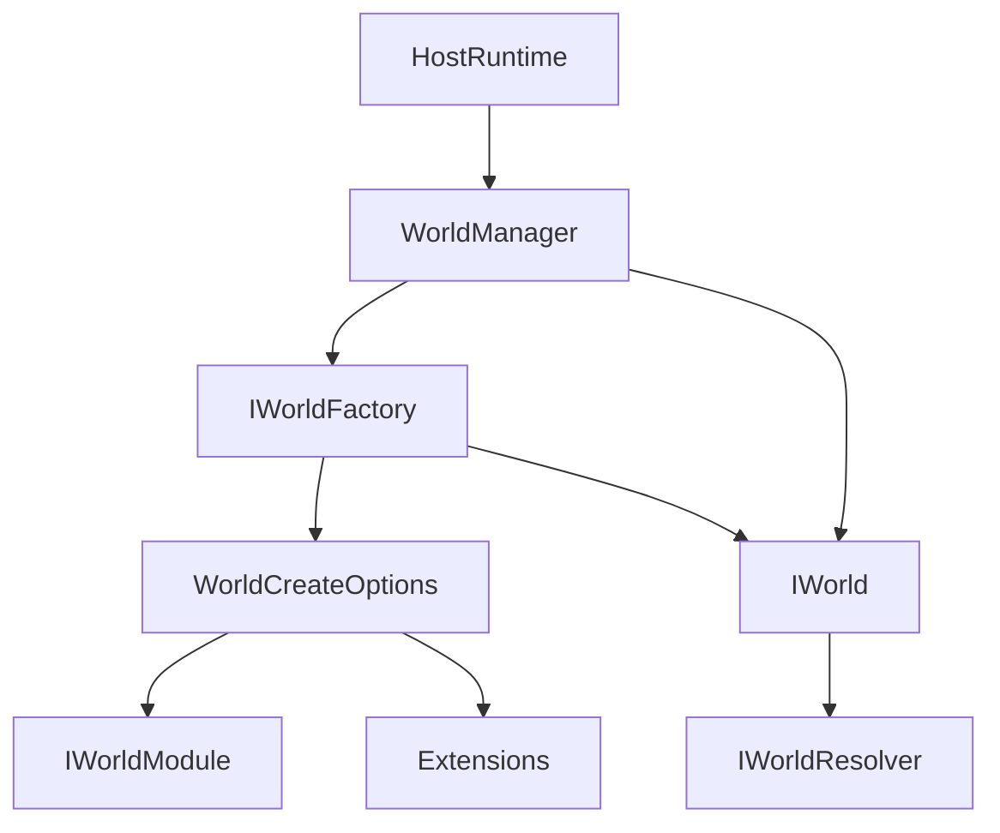
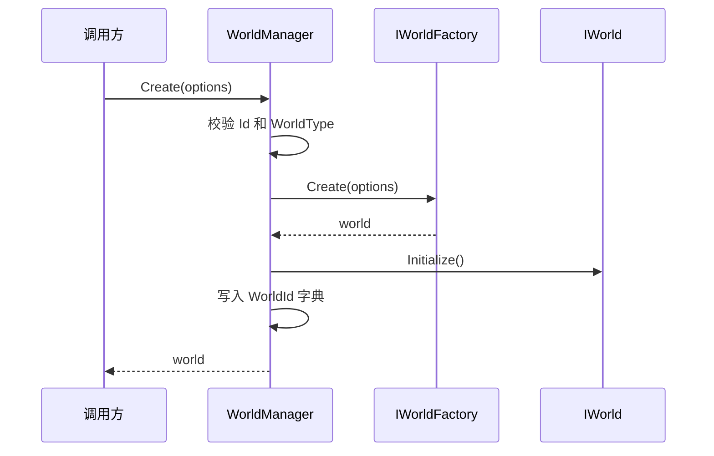
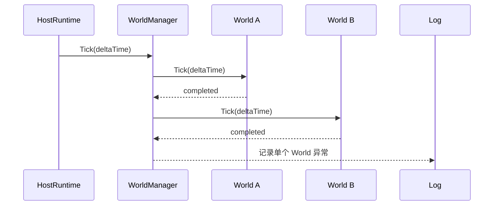
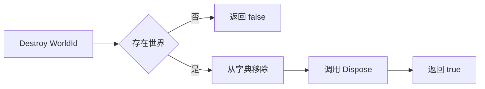

# 2.1 逻辑世界概述：IWorld、WorldManager 与世界生命周期

> 本文从源码解释 AbilityKit 的逻辑世界边界。当前实现里的 `IWorld` 不是一个“实体和系统大接口”，而是 Host 与具体世界实现之间的最小运行时契约：提供身份、服务解析器、初始化、Tick 和释放。

---

## 1. 能力定位

逻辑世界负责把“一场战斗、一局房间、一个模拟实例”的运行上下文收口成可创建、可 Tick、可销毁的对象。它解决的是运行时边界问题，而不是把 ECS、技能、网络、表现层全部塞进同一个接口。

| 职责 | 说明 |
|------|------|
| 世界身份 | 用 `WorldId` 和 `WorldType` 区分不同实例和不同世界类型 |
| 服务访问 | 通过 `IWorldResolver Services` 访问本世界的服务容器或作用域 |
| 生命周期 | `Initialize()`、`Tick(deltaTime)`、`Dispose()` 形成最小运行时闭环 |
| 多世界管理 | `WorldManager` 持有多个 `IWorld`，统一创建、查找、Tick 和销毁 |
| 扩展装配 | `WorldCreateOptions` 携带模块、服务构建器和扩展对象 |

---

## 2. 源码入口

| 源码 | 作用 |
|------|------|
| `Unity/Packages/com.abilitykit.world.di/Runtime/World/Abstractions/IWorld.cs` | 逻辑世界最小接口 |
| `Unity/Packages/com.abilitykit.world.di/Runtime/World/Abstractions/WorldCreateOptions.cs` | 创建世界时传入 ID、类型、服务构建器、模块和扩展 |
| `Unity/Packages/com.abilitykit.world.di/Runtime/World/Abstractions/IWorldFactory.cs` | `WorldManager` 通过工厂创建具体世界 |
| `Unity/Packages/com.abilitykit.world.di/Runtime/World/Management/WorldManager.cs` | 多世界创建、初始化、Tick、销毁 |
| `Unity/Packages/com.abilitykit.world.di/Runtime/World/Services/WorldClock.cs` | 世界逻辑时间服务 |
| `Unity/Packages/com.abilitykit.host/Runtime/Host/Framework/HostRuntime.cs` | Host 调用 `WorldManager.Tick(deltaTime)` 驱动所有世界 |

---

## 3. 真实 IWorld 接口

源码中的 `IWorld` 很小：

```csharp
public interface IWorld : IDisposable
{
    WorldId Id { get; }
    string WorldType { get; }
    IWorldResolver Services { get; }

    void Initialize();
    void Tick(float deltaTime);
}
```

这个设计刻意避免让 Host 知道具体世界内部是否使用 AbilityKit ECS、Entitas、Svelto、Triggering 或项目自定义系统。Host 只需要知道：这个世界是谁、属于什么类型、怎么初始化、怎么推进一帧、怎么释放。

---

## 4. 总体结构



关键依赖方向是 Host 依赖 `IWorld` 抽象，具体世界实现依赖自己的服务、系统和 ECS 适配。这样 Console Demo、Unity Demo、Orleans 服务端和测试都可以用同一套 Host 驱动模型。

---

## 5. 创建流程

`WorldManager.Create(options)` 的真实流程很短，但边界很清晰：



创建阶段有三个保护点：

| 保护点 | 源码行为 | 设计意图 |
|--------|----------|----------|
| `WorldId` 必填 | 空 ID 直接抛异常 | 避免世界无法被查找或销毁 |
| `WorldType` 必填 | 空类型直接抛异常 | 让工厂能选择具体世界实现 |
| ID 不可重复 | 已存在同 ID 直接抛异常 | 避免房间或战斗实例互相覆盖 |

---

## 6. Tick 流程

Host 的 Tick 会下沉到 `WorldManager.Tick(deltaTime)`，再逐个调用世界的 `Tick`。



`WorldManager` 会捕获单个世界 Tick 抛出的异常并记录日志，避免一个世界的失败直接中断管理器后续流程。这个行为适合多房间服务器，也适合测试环境里定位某个世界的异常。

---

## 7. 销毁流程



`WorldManager.Destroy(id)` 先从字典移除，再调用 `Dispose()`。这样即使释放过程中出现外部观察，也不会再从管理器拿到这个世界。

`DisposeAll()` 用于管理器整体关闭，逐个释放当前持有的所有世界，然后清空字典。

---

## 8. WorldCreateOptions 的设计意图

`WorldCreateOptions` 不是简单的参数袋，它把创建世界时的可变输入集中到一个对象里：

| 字段 | 用途 |
|------|------|
| `Id` | 世界实例 ID，通常对应房间、战斗或模拟实例 |
| `WorldType` | 世界类型，供工厂选择具体实现 |
| `ServiceBuilder` | 创建世界时使用的服务注册器 |
| `Modules` | 世界级模块列表，用于装配服务或能力 |
| `Extensions` | 临时扩展数据，给项目侧传入自定义上下文 |

这种设计解决了“Host 不知道具体玩法，但具体玩法创建世界时需要额外参数”的矛盾：Host 只传 options，世界工厂决定如何解释这些选项。

---

## 9. WorldClock 与逻辑时间

`WorldClock` 是逻辑世界常用的时间服务：

```csharp
public sealed class WorldClock : IWorldClock
{
    public float DeltaTime { get; private set; }
    public float Time { get; private set; }

    public void Tick(float deltaTime)
    {
        DeltaTime = deltaTime;
        Time += deltaTime;
    }
}
```

它和真实时间计时器不同，只记录由 Host 或世界驱动传入的逻辑 `deltaTime`。这对帧同步、回放、测试很重要：逻辑时间来自外部驱动，不能偷偷读取系统时间。

---

## 10. 设计取舍

| 取舍 | 说明 |
|------|------|
| `IWorld` 保持小接口 | Host 不关心实体、组件、系统细节，便于接入不同 ECS 或自定义世界 |
| `WorldManager` 不负责服务构建 | 服务装配交给世界工厂和 options，避免管理器变成上帝对象 |
| 创建时立即 Initialize | 管理器返回的世界默认已经可 Tick，减少半初始化状态 |
| Tick 捕获异常 | 多世界场景中，一个世界失败不应阻断其它世界推进 |
| 逻辑时间外部传入 | 支持确定性、测试、回放和服务端统一驱动 |

---

## 11. 新手阅读路线

1. 先读 `IWorld.cs`，确认世界接口只有身份、服务、初始化、Tick 和释放。
2. 再读 `WorldManager.cs`，理解多世界的创建、查找、Tick 和销毁。
3. 接着读 `WorldCreateOptions.cs`，理解世界创建时如何传入模块、服务构建器和扩展对象。
4. 然后读 `WorldContainer.cs` 和 `WorldScope.cs`，理解 `Services` 背后的依赖注入模型。
5. 最后回到 `HostRuntime.cs`，看 Host 如何驱动 `WorldManager.Tick(deltaTime)`。

---

## 12. 常见误区

| 误区 | 正确认知 |
|------|----------|
| `IWorld` 应该暴露实体创建和查询 | 当前源码把世界运行时契约和 ECS 查询能力拆开，Host 不直接依赖实体接口 |
| `WorldManager` 是业务系统调度器 | 它只管理世界实例，具体系统调度在具体世界内部完成 |
| 世界时间应读取系统时钟 | 逻辑世界应由外部传入 `deltaTime`，避免破坏确定性 |
| `WorldType` 只是备注 | 它是工厂选择具体世界实现的重要输入 |

---

## 13. 和其他文档的关系

- [服务容器](05-ServiceContainer.md) 解释 `IWorldResolver`、`WorldContainer`、`WorldScope` 和生命周期。
- [系统设计](04-SystemDesign.md) 解释具体世界内部如何组织系统。
- [Host 运行时](../03-LogicalWorldHostDesign/01-HostRuntime.md) 解释 Host 如何驱动多个世界。
- [ECS 查询与遍历](../06-ECSArchitecture/03-QueryAndIteration.md) 解释具体 ECS 世界里的实体查询。
