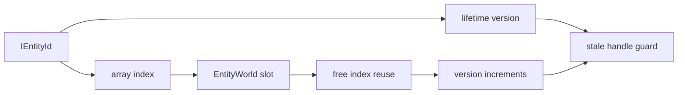
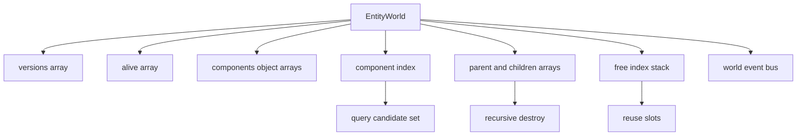
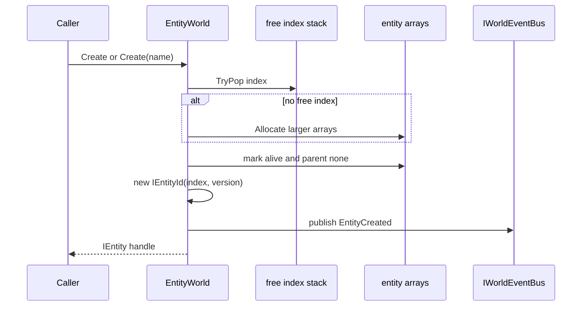
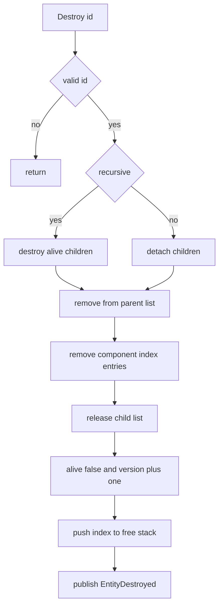
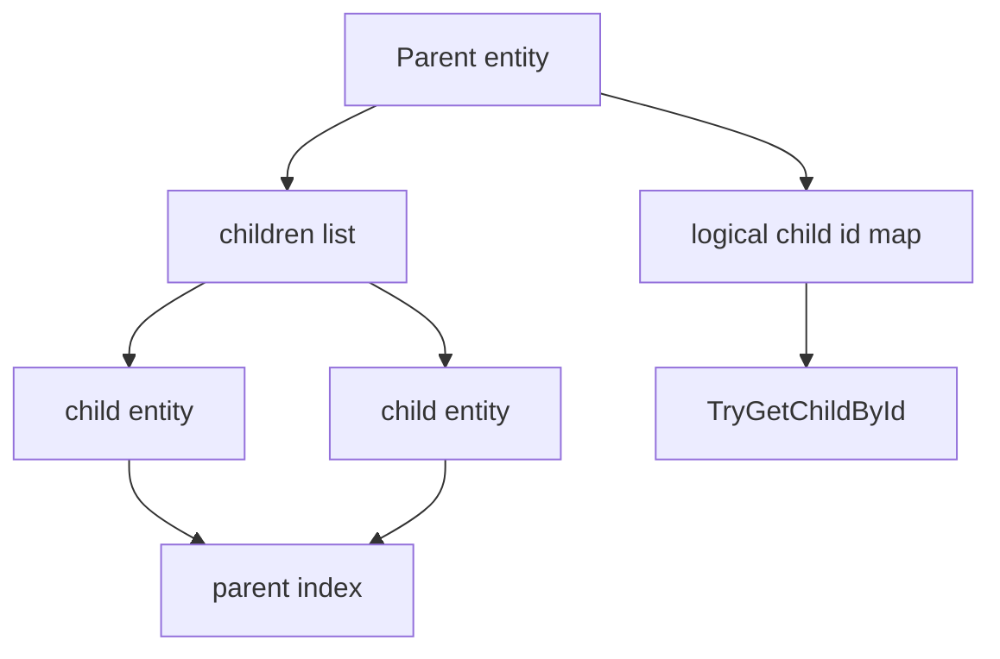

# 2.2 实体设计：IEntity、IEntityId 与 EntityWorld 生命周期

> 本文基于 `Unity/Packages/com.abilitykit.world.ecs` 的真实源码，解释 AbilityKit 基础 ECS 中实体的身份、句柄、创建、销毁、父子关系和事件输出。这里的实体不是逻辑世界 `IWorld` 本身，而是 ECS 适配层提供的数据载体入口。

---

## 目录

- [2.2 实体设计：IEntity、IEntityId 与 EntityWorld 生命周期](#22-实体设计ientityientityid-与-entityworld-生命周期)
  - [目录](#目录)
  - [1. 能力定位](#1-能力定位)
  - [2. 源码入口](#2-源码入口)
  - [3. 实体身份模型](#3-实体身份模型)
  - [4. EntityWorld 内部存储](#4-entityworld-内部存储)
  - [5. 创建流程](#5-创建流程)
  - [6. 销毁流程](#6-销毁流程)
  - [7. 父子关系](#7-父子关系)
  - [8. 事件与调试信息](#8-事件与调试信息)
  - [9. 设计意图与解决的问题](#9-设计意图与解决的问题)
    - [9.1 Index + Version 防止旧句柄误用](#91-index--version-防止旧句柄误用)
    - [9.2 值类型句柄减少对象生命周期压力](#92-值类型句柄减少对象生命周期压力)
    - [9.3 销毁时清理组件索引](#93-销毁时清理组件索引)
    - [9.4 非递归销毁和递归销毁分开](#94-非递归销毁和递归销毁分开)
    - [9.5 事件让表现层和调试工具解耦](#95-事件让表现层和调试工具解耦)
  - [10. 边界判断](#10-边界判断)
  - [11. 源码阅读路径](#11-源码阅读路径)

---

## 1. 能力定位

逻辑世界的 `IWorld` 只定义世界身份、服务容器、初始化、Tick 和释放；实体能力由 ECS 层提供。基础 ECS 的核心实现是 `EntityWorld : IECWorld`，它用数组保存实体槽位、版本、组件和父子关系，并通过 `IEntity` 这个值类型句柄给外部提供链式 API。

| 概念 | 真实源码角色 |
|------|--------------|
| `IWorld` | 世界生命周期最小契约，不负责实体 API |
| `IECWorld` | 基础 ECS 世界接口，负责实体、组件、查询、父子关系和事件 |
| `EntityWorld` | `IECWorld` 默认实现，维护数组存储、组件索引和实体版本 |
| `IEntity` | 值类型实体句柄，持有 `IECWorld` 和 `IEntityId` |
| `IEntityId` | `Index + Version` 组合，避免旧句柄误指向复用槽位 |

---

## 2. 源码入口

| 文件 | 作用 |
|------|------|
| `Unity/Packages/com.abilitykit.world.ecs/Runtime/AbilityKit.World.ECS/Core/IECWorld.cs` | 基础 ECS 世界接口 |
| `Unity/Packages/com.abilitykit.world.ecs/Runtime/AbilityKit.World.ECS/Core/IEntity.cs` | 实体句柄和值类型链式 API |
| `Unity/Packages/com.abilitykit.world.ecs/Runtime/AbilityKit.World.ECS/Core/IEntityId.cs` | 实体 ID，包含 index 和 version |
| `Unity/Packages/com.abilitykit.world.ecs/Runtime/AbilityKit.World.ECS/Impl/EntityWorld.cs` | 实体世界默认实现 |
| `Unity/Packages/com.abilitykit.world.ecs/Runtime/AbilityKit.World.ECS/Events/WorldEvents.cs` | 实体创建、销毁、组件变更和父子关系事件 |
| `Docs/design/06-ECSArchitecture/03-QueryAndIteration.md` | 查询与遍历源码深潜 |

---

## 3. 实体身份模型

源码中的实体 ID 是一个值类型结构，核心字段是 `Index` 和 `Version`。

```csharp
public readonly struct IEntityId : IEquatable<IEntityId>, IComparable<IEntityId>
{
    public readonly int Index;
    public readonly int Version;

    public bool IsValid => Index >= 0;
}
```

`Index` 指向 `EntityWorld` 内部数组槽位，`Version` 用来区分同一个槽位的不同生命周期。实体销毁后槽位会进入空闲栈并可能被复用，但版本号会递增，旧句柄再访问时会因为版本不匹配而失效。



`IEntity` 不是实体对象本体，而是一个值类型句柄：

```csharp
public readonly struct IEntity : IEquatable<IEntity>
{
    private readonly IECWorld _world;
    private readonly IEntityId _id;

    public IEntityId Id => _id;
    public IECWorld World => _world;
    public bool IsValid => _world != null && _world.IsAlive(_id);
}
```

这意味着实体句柄可以被复制、传参、临时保存；真正状态始终在 `EntityWorld` 里。

---

## 4. EntityWorld 内部存储

`EntityWorld` 用多组数组和索引表保存实体状态。

| 字段 | 含义 |
|------|------|
| `_versions` | 每个槽位当前版本号 |
| `_alive` | 每个槽位是否存活 |
| `_components` | 每个实体的组件数组，按 component type id 存储 |
| `_componentIndex` | 组件类型到实体槽位集合的索引，用于查询候选集 |
| `_parentIndex` | 子实体到父实体槽位的映射 |
| `_children` | 父实体到子实体槽位列表的映射 |
| `_childIdToIndex` | 带逻辑 child id 的快速查找表 |
| `_freeIndices` | 已销毁槽位的复用栈 |
| `_listPool` | 查询和递归销毁时复用临时列表 |



数组化存储让实体创建、存活校验、组件定位都能走整数下标；组件索引则避免系统查询时每次全量扫描所有实体。

---

## 5. 创建流程

`Create()` 会分配实体槽位，构造 `IEntity` 句柄，并发布 `EntityCreated` 事件。



源码中的关键步骤：

```csharp
private IEntityId AllocateEntity()
{
    int index;
    if (!_freeIndices.TryPop(out index))
    {
        if (_versions.Length >= _maxCapacity)
            throw new InvalidOperationException($"Entity world capacity exceeded: {_maxCapacity}");
        index = Allocate(_versions.Length == 0 ? 64 : _versions.Length * 2);
    }

    var version = _versions[index];
    _alive[index] = true;
    _parentIndex[index] = -1;
    _aliveCount++;

    return new IEntityId(index, version);
}
```

`Create(string name)` 只在 `UNITY_EDITOR` 或 `DEBUG` 下写入 `_names`，因此名称是调试信息，不应作为运行时逻辑依赖。

---

## 6. 销毁流程

实体销毁前会先通过 `TryValidateId` 校验 index、alive 和 version。校验失败时直接返回，避免旧句柄继续破坏世界状态。



销毁分两种：

| API | 行为 |
|-----|------|
| `Destroy(id)` | 只销毁当前实体，子实体解除父子关系但继续存活 |
| `DestroyRecursive(id)` | 递归销毁当前实体和所有存活子实体 |

核心释放逻辑会做几件事：

1. 如果递归销毁，先对 `_children[index]` 做 snapshot，再逐个销毁子实体。
2. 从父实体的 child list 里移除当前实体。
3. 遍历当前实体组件数组，把每个组件类型对应的 `_componentIndex` 项移除。
4. 释放子级列表到 `_listPool`。
5. 标记 `_alive[index] = false`，递增 `_versions[index]`，压回 `_freeIndices`。
6. 发布 `EntityDestroyed`。

---

## 7. 父子关系

基础 ECS 内置父子关系，适合表达角色和附属物、召唤物、命中区域、表现代理等结构。



相关 API 在 `IECWorld` 和 `IEntity` 上都有入口：

| API | 说明 |
|-----|------|
| `CreateChild(parent)` | 创建实体并设置父级 |
| `CreateChild(parent, logicalChildId)` | 创建带逻辑 child id 的子实体 |
| `SetParent(child, parent)` | 调整已有实体父级 |
| `SetParent(child, parent, logicalChildId)` | 调整父级并建立逻辑 id 索引 |
| `GetParent(id)` | 获取父实体 |
| `GetChild(id, index)` | 按顺序取子实体 |
| `TryGetChildById(parent, logicalChildId, out child)` | 按逻辑 id 查找子实体 |

父子关系变化会发布 `ParentChanged` 事件，方便调试器、表现层或同步层监听结构变化。

---

## 8. 事件与调试信息

`EntityWorld` 构造时可以注入 `IWorldEventBus`，未传入则创建默认事件总线。实体相关事件包括：

| 事件 | 触发时机 |
|------|----------|
| `EntityCreated` | `Create` 或 `Create(string name)` 成功后 |
| `EntityDestroyed` | `InternalDestroy` 完成后 |
| `ComponentSet` | 设置值类型或引用类型组件后 |
| `ComponentRemoved` | 移除组件后 |
| `ParentChanged` | 父子关系调整后 |

调试名称只在编辑器或 Debug 构建中保存：

```csharp
#if UNITY_EDITOR || DEBUG
private string[] _names = Array.Empty<string>();
#endif
```

因此文档和业务代码都不应假定 Release 环境能通过实体名称做逻辑判断。

---

## 9. 设计意图与解决的问题

### 9.1 Index + Version 防止旧句柄误用

如果实体销毁后只复用整数 ID，旧引用可能误操作新实体。`IEntityId` 用版本号把“同一个槽位的不同生命周期”区分开，`IsAlive` 和 `TryValidateId` 都会检查版本。

### 9.2 值类型句柄减少对象生命周期压力

`IEntity` 是 readonly struct，复制成本低，外部不拥有实体状态。这样可以避免大量实体对象被频繁分配和回收。

### 9.3 销毁时清理组件索引

查询依赖 `_componentIndex`，所以销毁实体必须从所有组件索引中移除槽位。否则系统查询会拿到已经死亡的实体候选。

### 9.4 非递归销毁和递归销毁分开

有些场景只想销毁父对象但保留子对象，例如表现代理重挂载；有些场景需要整个层级退出，例如召唤物和挂载物一起消失。两个 API 分开能让调用意图更明确。

### 9.5 事件让表现层和调试工具解耦

实体世界只发布结构变化和组件变化事件，不直接驱动 UI 或网络。表现层、快照层、调试器可以各自订阅事件或从查询路径读取状态。

---

## 10. 边界判断

| 容易混淆的判断 | 设计边界 |
|----------------|----------|
| 以为 `IWorld` 直接提供 `CreateEntity` | 当前实体 API 在 `IECWorld` 和 `EntityWorld`，不是世界生命周期接口 |
| 以为 `IEntity` 是引用对象 | `IEntity` 是值类型句柄，真实状态在 `EntityWorld` |
| 保存 `Index` 就能长期定位实体 | 必须保存完整 `IEntityId`，并用 `IsAlive` 校验版本 |
| 销毁父实体一定销毁子实体 | `Destroy` 不递归，`DestroyRecursive` 才递归 |
| Release 环境可以依赖实体名称 | 名称只在 Debug 或 Unity Editor 下保存 |
| 组件移除只清实体本地数组 | 还必须同步 `_componentIndex`，源码已在 `RemoveComponentById` 中处理 |

---

## 11. 源码阅读路径

1. `IEntityId.cs`：index 和 version。
2. `IEntity.cs`：实体句柄只是 `IECWorld + IEntityId` 的封装。
3. `IECWorld.cs`：实体、组件、查询、父子关系的完整 API。
4. `EntityWorld.cs` 的 `Create`、`AllocateEntity`、`Destroy`、`InternalDestroy`：实体生命周期主路径。
5. `WorldEvents.cs` 与 [查询与遍历源码深潜](../06-ECSArchitecture/03-QueryAndIteration.md)：实体生命周期和系统查询关系。

---

*文档版本：v2.0 | 最后更新：2026-07-03*
