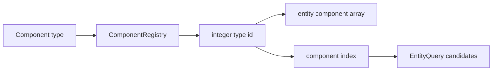
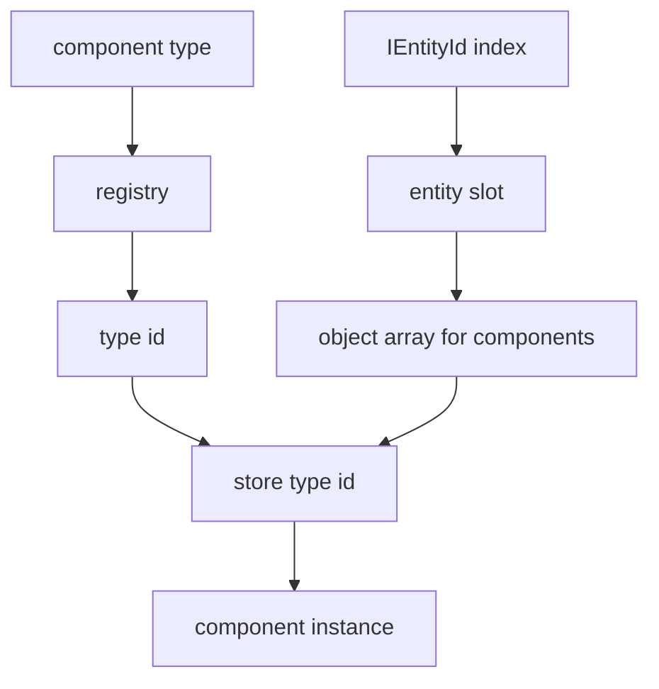
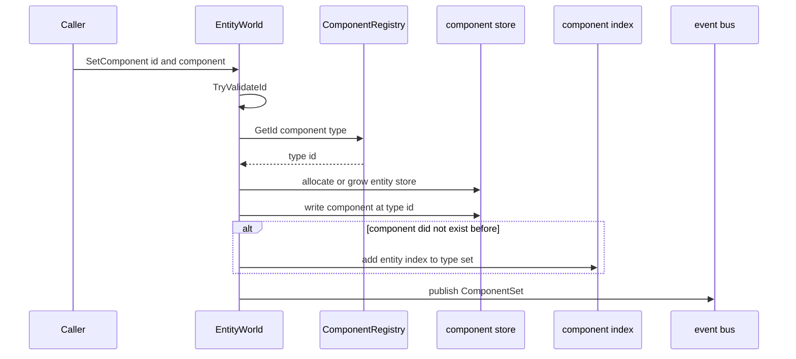
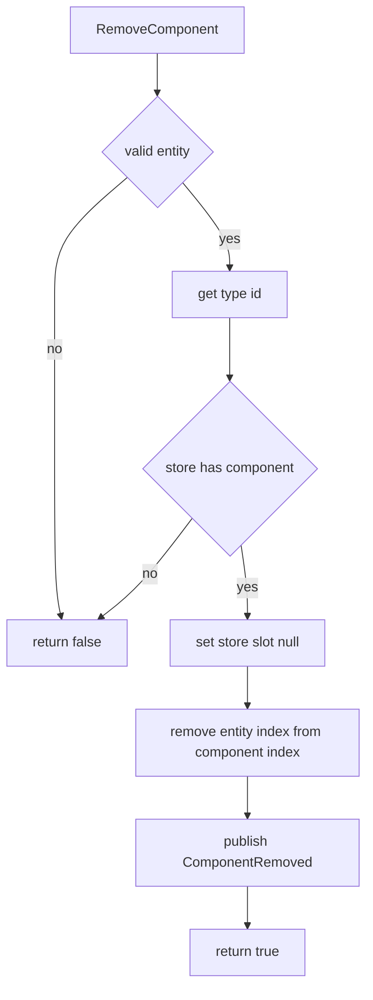
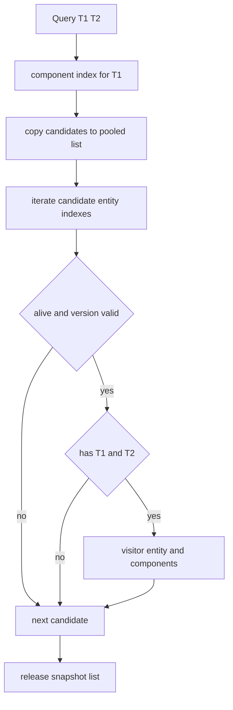

# 2.3 组件设计：ComponentRegistry、TypeId 与组件读写路径

> 本文基于 `Unity/Packages/com.abilitykit.world.ecs` 的真实源码，解释 AbilityKit 基础 ECS 中组件如何定义、注册、存储、索引、查询和释放。当前源码没有 `IECComponent` 标记接口要求，组件类型由 `ComponentRegistry` 映射成整数 type id。

---

## 目录

- [2.3 组件设计：ComponentRegistry、TypeId 与组件读写路径](#23-组件设计componentregistrytypeid-与组件读写路径)
  - [目录](#目录)
  - [1. 能力定位](#1-能力定位)
  - [2. 源码入口](#2-源码入口)
  - [3. 组件类型与注册表](#3-组件类型与注册表)
  - [4. 组件存储结构](#4-组件存储结构)
  - [5. 设置组件流程](#5-设置组件流程)
  - [6. 读取与移除流程](#6-读取与移除流程)
  - [7. 组件索引与查询协作](#7-组件索引与查询协作)
  - [8. 值类型组件和引用类型组件](#8-值类型组件和引用类型组件)
  - [9. 设计意图与解决的问题](#9-设计意图与解决的问题)
    - [9.1 类型安全 API 和整数索引并存](#91-类型安全-api-和整数索引并存)
    - [9.2 共享 ComponentRegistry 保持跨世界一致](#92-共享-componentregistry-保持跨世界一致)
    - [9.3 第一个组件作为查询入口](#93-第一个组件作为查询入口)
    - [9.4 组件事件不直接驱动业务](#94-组件事件不直接驱动业务)
    - [9.5 引用组件和确定性状态分层](#95-引用组件和确定性状态分层)
  - [10. 新手常见误区](#10-新手常见误区)
  - [11. 推荐阅读顺序](#11-推荐阅读顺序)

---

## 1. 能力定位

组件是挂在实体上的状态数据，系统通过组件组合筛选实体并推进逻辑。AbilityKit 基础 ECS 的组件设计目标是：用类型安全 API 给业务层读写组件，同时在内部用整数 type id 和数组降低定位成本。

| 能力 | 源码落点 |
|------|----------|
| 类型到 id 的映射 | `ComponentRegistry.GetId(Type)` |
| 值类型组件写入 | `EntityWorld.SetComponent<T>(id, component)` |
| 引用类型组件写入 | `EntityWorld.SetComponentRef<T>(id, component)` |
| 组件读取 | `GetComponent`、`TryGetComponent`、`GetComponentRef`、`TryGetComponentRef` |
| 组件移除 | `RemoveComponent<T>` 和 `RemoveComponentById` |
| 查询候选集 | `_componentIndex : Dictionary<int, HashSet<int>>` |
| 组件变更事件 | `ComponentSet` 和 `ComponentRemoved` |

---

## 2. 源码入口

| 文件 | 作用 |
|------|------|
| `Unity/Packages/com.abilitykit.world.ecs/Runtime/AbilityKit.World.ECS/Impl/ComponentRegistry.cs` | 默认组件注册表，分配 type id |
| `Unity/Packages/com.abilitykit.world.ecs/Runtime/AbilityKit.World.ECS/Core/IComponentRegistry.cs` | 组件注册表接口 |
| `Unity/Packages/com.abilitykit.world.ecs/Runtime/AbilityKit.World.ECS/Core/IECWorld.cs` | 组件读写和查询 API |
| `Unity/Packages/com.abilitykit.world.ecs/Runtime/AbilityKit.World.ECS/Core/IEntity.cs` | 实体句柄上的链式组件 API |
| `Unity/Packages/com.abilitykit.world.ecs/Runtime/AbilityKit.World.ECS/Impl/EntityWorld.cs` | 组件存储、索引、事件和查询实现 |
| `Unity/Packages/com.abilitykit.world.ecs/Runtime/AbilityKit.World.ECS/Core/EntityQuery.cs` | 查询结果封装 |

---

## 3. 组件类型与注册表

`ComponentRegistry` 将 `System.Type` 映射成自增整数 id。默认使用 `ComponentRegistry.Shared`，让多个 `EntityWorld` 实例共享一致的组件 type id。

```csharp
public sealed class ComponentRegistry : IComponentRegistry
{
    private readonly Dictionary<Type, int> _ids = new Dictionary<Type, int>();
    private readonly Dictionary<int, Type> _types = new Dictionary<int, Type>();
    private int _nextId = 1;

    public int GetId(Type type)
    {
        if (_ids.TryGetValue(type, out var id)) return id;
        id = _nextId++;
        _ids.Add(type, id);
        _types[id] = type;
        return id;
    }
}
```



组件 type id 从 1 开始分配，0 号位不会被默认组件占用。文档和业务代码不应手写 type id；应该始终通过注册表或泛型 API 获取。

---

## 4. 组件存储结构

`EntityWorld` 的组件存储是二维结构：先通过实体 index 找到该实体的组件数组，再用组件 type id 作为数组下标。



内部字段：

```csharp
private object[][] _components = Array.Empty<object[]>();
private readonly Dictionary<int, HashSet<int>> _componentIndex;
```

组件数组是延迟分配的。实体没有组件时，`_components[index]` 可以是 `null`；首次设置组件时创建默认长度为 8 的数组；当 type id 超过数组长度时按倍数扩容。

---

## 5. 设置组件流程

值类型和引用类型组件最终都会进入 `SetComponentInternal`。

```csharp
public void SetComponent<T>(IEntityId id, T component) where T : struct
{
    if (!TryValidateId(id)) return;
    var typeId = _componentRegistry.GetId<T>();
    SetComponentInternal(id.Index, typeId, component);
}

public void SetComponentRef<T>(IEntityId id, T component) where T : class
{
    if (!TryValidateId(id)) return;
    if (component == null)
    {
        RemoveComponentById(id.Index, _componentRegistry.GetId<T>());
        return;
    }
    var typeId = _componentRegistry.GetId<T>();
    SetComponentInternal(id.Index, typeId, component);
}
```



`SetComponentInternal` 会记录写入前是否已有组件。如果之前没有该组件，就把实体 index 加入 `_componentIndex[typeId]`。这一步是后续查询能快速找到候选实体的关键。

---

## 6. 读取与移除流程

读取分为直接读取和 Try 读取。

| API | 组件类型 | 未找到时行为 |
|-----|----------|--------------|
| `GetComponent<T>` | struct | 抛 `KeyNotFoundException` |
| `TryGetComponent<T>` | struct | 返回 `false` 并输出 default |
| `GetComponentRef<T>` | class | 返回 `null` 或引用 |
| `TryGetComponentRef<T>` | class | 返回 bool 和引用 |
| `IEntity.Get<T>` | struct | 转发到 `GetComponent<T>` |
| `IEntity.GetRef<T>` | class | 转发到 `GetComponentRef<T>` |

移除组件会同时清实体本地数组和组件索引。



引用类型组件还有一个额外语义：`SetComponentRef<T>(id, null)` 等价于移除该引用组件。

---

## 7. 组件索引与查询协作

组件索引按 type id 保存拥有该组件的实体 index 集合。

```csharp
private readonly Dictionary<int, HashSet<int>> _componentIndex;
```

查询时，`EntityQuery<T1, T2, T3>` 不直接保存类型，而是保存 type id 和 `EntityWorld` 引用；执行 `ForEach` 时调用 `QueryImpl`。

```csharp
public readonly struct EntityQuery<T1>
    where T1 : struct
{
    private readonly int _typeId1;
    private readonly EntityWorld _world;

    public void ForEach(Action<IEntity, T1> visitor)
    {
        _world.QueryImpl<T1>(_typeId1, visitor);
    }
}
```

查询实现会用第一个组件的索引集合作为候选集，然后逐个校验实体是否存活、组件数组是否存在、其他组件是否存在。



这里使用 snapshot 列表是为了避免遍历过程中组件集合变化导致集合枚举异常，也让查询行为更稳定。

---

## 8. 值类型组件和引用类型组件

基础 ECS 同时支持 struct 组件和 class 引用组件。

| 类型 | API | 适合内容 | 注意点 |
|------|-----|----------|--------|
| 值类型组件 | `SetComponent<T>`、`GetComponent<T>` | 可复制、可快照、可序列化的逻辑状态 | 修改后要重新写回组件 |
| 引用类型组件 | `SetComponentRef<T>`、`GetComponentRef<T>` | 外部句柄、表现绑定、运行时对象 | 不适合做确定性同步核心状态 |

`IEntity` 上提供链式 API：

```csharp
var actor = world.Create("hero")
    .With(new PositionComponent { X = 10, Y = 20 })
    .With(new HealthComponent { Hp = 100 })
    .WithRef(new ViewBinding(viewId));

if (actor.TryGet<HealthComponent>(out var health))
{
    health.Hp -= 10;
    actor.With(health);
}
```

对确定性逻辑来说，核心状态优先使用值类型组件；引用组件更适合桥接表现层、调试器或非确定性外部对象。

---

## 9. 设计意图与解决的问题

### 9.1 类型安全 API 和整数索引并存

业务代码用泛型 API 保持类型安全，内部用 type id 作为数组下标和索引 key。这样避免在业务层暴露字符串 key 或手写整数 id。

### 9.2 共享 ComponentRegistry 保持跨世界一致

默认共享注册表让不同 `EntityWorld` 对同一组件类型得到相同 type id，便于调试、事件、快照和工具层解释组件类型。

### 9.3 第一个组件作为查询入口

`QueryImpl` 以第一个组件的索引集合作为候选集，减少扫描范围。写查询时应把更稀疏、更能筛选目标的组件放在第一个泛型参数。

### 9.4 组件事件不直接驱动业务

`ComponentSet` 和 `ComponentRemoved` 只描述变化，不替业务做调度。系统仍应在固定 Tick 中推进逻辑，事件更适合调试、同步、表现桥接或增量追踪。

### 9.5 引用组件和确定性状态分层

支持引用组件能降低接入 Unity View、外部句柄和调试对象的成本，但它们不应进入需要跨端一致的核心模拟状态。

---

## 10. 新手常见误区

| 误区 | 正确理解 |
|------|----------|
| 组件必须实现 `IECComponent` | 当前基础 ECS 没有这个接口要求，struct/class 类型通过泛型 API 注册 |
| `HasComponent<T>(id)` 检查某个实体 | 源码里的 `HasComponent<T>()` 是世界级存在性检查；实体侧 `Has<T>()` 目前也转发到该方法，使用前要理解这一点 |
| 修改 struct 组件字段后自动写回 | struct 是值复制，修改后需要再次 `SetComponent` 或 `With` |
| 引用组件适合保存同步状态 | 引用组件更适合桥接外部对象，确定性状态优先使用值类型 |
| 查询会扫描全部实体 | 查询先从第一个组件的索引集拿候选，再做存活和组件校验 |
| 手写 type id 能提高性能 | type id 应由 `ComponentRegistry` 管理，手写会破坏一致性 |

---

## 11. 推荐阅读顺序

1. 先读 `ComponentRegistry.cs`，理解类型到 type id 的映射。
2. 再读 `IECWorld.cs` 的组件 API，确认值类型和引用类型两条路径。
3. 再读 `EntityWorld.cs` 的 `SetComponentInternal` 和 `RemoveComponentById`。
4. 再读 `EntityQuery.cs` 和 `EntityWorld.QueryImpl`，理解组件索引如何驱动查询。
5. 最后读 [查询与遍历源码深潜](../06-ECSArchitecture/03-QueryAndIteration.md)，看查询成本、snapshot 和存活校验细节。

---

*文档版本：v2.0 | 最后更新：2026-07-03*
