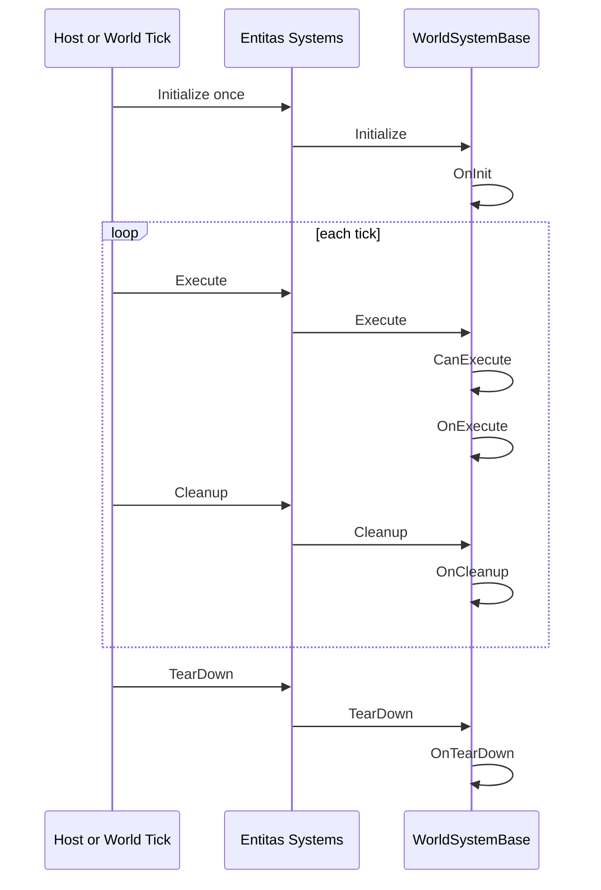
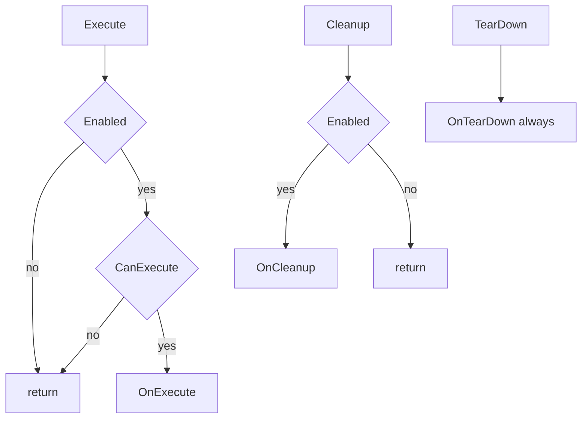
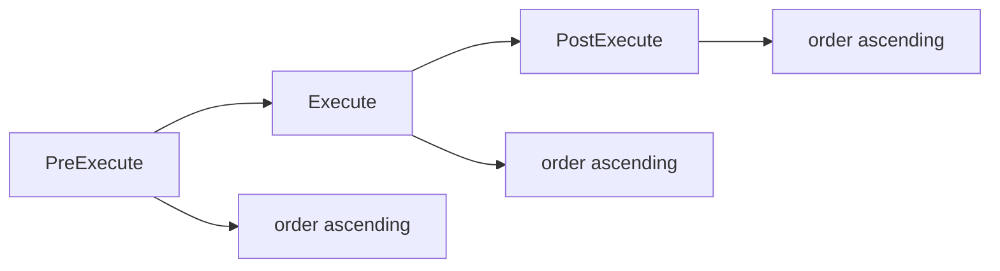
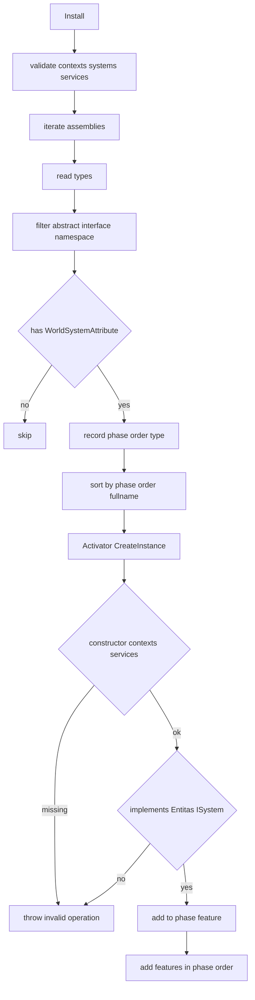
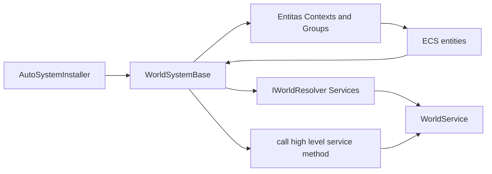
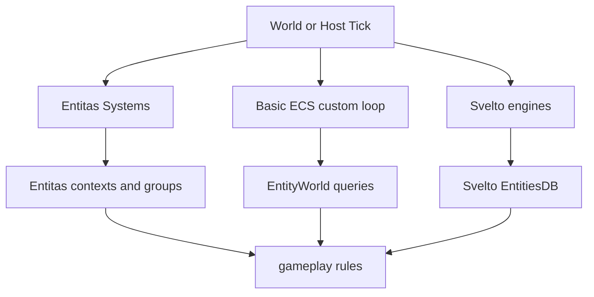

# 2.4 系统设计：WorldSystemBase、阶段排序与自动安装

> 本文基于 `Unity/Packages/com.abilitykit.world.entitas` 和 Demo 系统源码，解释 AbilityKit 中“系统”如何被发现、排序、初始化、执行和清理。当前源码没有独立的 `IECSystem` 接口；系统主线来自 Entitas 生命周期接口与 AbilityKit 的 `WorldSystemBase`、`WorldSystemAttribute`、`AutoSystemInstaller`。

---

## 目录

- [2.4 系统设计：WorldSystemBase、阶段排序与自动安装](#24-系统设计worldsystembase阶段排序与自动安装)
  - [目录](#目录)
  - [1. 能力定位](#1-能力定位)
  - [2. 源码入口](#2-源码入口)
  - [3. 系统生命周期模型](#3-系统生命周期模型)
  - [4. WorldSystemBase](#4-worldsystembase)
  - [5. 属性标记与阶段排序](#5-属性标记与阶段排序)
  - [6. 自动安装流程](#6-自动安装流程)
  - [7. 业务系统如何接入服务容器](#7-业务系统如何接入服务容器)
  - [8. 和基础 ECS 查询的关系](#8-和基础-ecs-查询的关系)
  - [9. 设计意图与解决的问题](#9-设计意图与解决的问题)
    - [9.1 阶段和 order 让系统执行可解释](#91-阶段和-order-让系统执行可解释)
    - [9.2 自动安装降低模块接入成本](#92-自动安装降低模块接入成本)
    - [9.3 构造函数约束让依赖入口统一](#93-构造函数约束让依赖入口统一)
    - [9.4 System/Service 分层让业务能力可复用](#94-systemservice-分层让业务能力可复用)
    - [9.5 WorldSystemBase 把生命周期差异收敛到模板方法](#95-worldsystembase-把生命周期差异收敛到模板方法)
    - [9.6 多 ECS 路径保持开放](#96-多-ecs-路径保持开放)
  - [10. 边界判断](#10-边界判断)
  - [11. 源码阅读路径](#11-源码阅读路径)

---

## 1. 能力定位

系统负责在世界 Tick 中推进逻辑：读取输入和组件，执行确定性规则，写回组件、事件、快照或表现层消息。AbilityKit 不是只绑定一种 ECS，它同时存在基础 ECS、Entitas、Svelto 和 Demo 业务系统；其中当前逻辑世界目录应重点理解 Entitas 适配层的系统组织方式，以及它如何通过 World DI 形成“ECS System 负责时序与遍历，Service 负责业务能力”的组合开发模式。

| 层级 | 角色 |
|------|------|
| Entitas 生命周期接口 | `IInitializeSystem`、`IExecuteSystem`、`ICleanupSystem`、`ITearDownSystem` |
| `WorldSystemBase` | 封装 Entitas 生命周期，并提供 `Contexts`、`Services`、`Enabled` 和可重写方法 |
| `WorldSystemAttribute` | 标记系统阶段和顺序，供自动安装器发现 |
| `AutoSystemInstaller` | 扫描程序集和命名空间，把系统按阶段与顺序加入 `Entitas.Systems` |
| Demo 系统 | 例如 MOBA 的移动、技能、Buff、投射物、伤害、同步系统 |
| World DI 服务 | 由系统通过 `Services` 解析，承载技能、Buff、实体索引、诊断、配置等可复用业务能力 |

---

## 2. 源码入口

| 文件 | 作用 |
|------|------|
| `Unity/Packages/com.abilitykit.world.entitas/Runtime/World/Base/WorldSystemBase.cs` | 系统基类，封装四类 Entitas 生命周期 |
| `Unity/Packages/com.abilitykit.world.entitas/Runtime/World/Attributes/WorldSystemAttribute.cs` | 系统标记、阶段和 order |
| `Unity/Packages/com.abilitykit.world.entitas/Runtime/World/Attributes/WorldSystemOrder.cs` | 通用顺序常量 |
| `Unity/Packages/com.abilitykit.world.entitas/Runtime/World/Modules/AutoSystemInstaller.cs` | 自动扫描和安装系统 |
| `Unity/Packages/com.abilitykit.world.entitas/Runtime/World/Interfaces/IEntitasSystemsInstaller.cs` | 模块安装系统的扩展接口 |
| `Unity/Packages/com.abilitykit.demo.moba.runtime/Runtime/Application/Systems/MobaSystemOrder.cs` | MOBA 示例系统顺序常量 |
| `Unity/Packages/com.abilitykit.demo.moba.runtime/Runtime/Application/Systems/MobaWorldSystemExecution.cs` | MOBA 系统执行组织 |

---

## 3. 系统生命周期模型

Entitas 的系统容器会按生命周期调用系统。AbilityKit 的 `WorldSystemBase` 同时实现四个接口，再把实际逻辑分发到可重写方法。



| 生命周期 | 触发含义 | `WorldSystemBase` 回调 |
|----------|----------|------------------------|
| Initialize | 系统加入世界后初始化 | `OnInit()` |
| Execute | 每帧或每逻辑 Tick 执行 | `CanExecute()` 和 `OnExecute()` |
| Cleanup | 每帧执行后的清理阶段 | `OnCleanup()` |
| TearDown | 世界销毁或系统容器释放 | `OnTearDown()` |

---

## 4. WorldSystemBase

`WorldSystemBase` 构造函数接收 Entitas contexts 和世界服务解析器。

```csharp
protected WorldSystemBase(global::Entitas.IContexts contexts, IWorldResolver services)
{
    Contexts = contexts ?? throw new ArgumentNullException(nameof(contexts));
    Services = services ?? throw new ArgumentNullException(nameof(services));
}
```

系统内部可以通过：

| 属性 | 用途 |
|------|------|
| `Contexts` | 访问 Entitas 生成的上下文和实体分组 |
| `Services` | 从 World DI 解析世界服务 |
| `Priority` | 系统优先级字段，主要用于手动设置或调试 |
| `Enabled` | 禁用后跳过 Initialize、Execute、Cleanup |

执行逻辑如下：



`TearDown` 不受 `Enabled` 控制，这保证禁用过的系统仍有机会释放资源。

---

## 5. 属性标记与阶段排序

`WorldSystemAttribute` 用来标记系统的阶段和顺序。

```csharp
[AttributeUsage(AttributeTargets.Class, Inherited = false, AllowMultiple = false)]
public sealed class WorldSystemAttribute : MarkerAttribute
{
    public int Order { get; }
    public WorldSystemPhase Phase { get; set; } = WorldSystemPhase.Execute;

    public WorldSystemAttribute(int order = 0)
    {
        Order = order;
    }
}
```

阶段枚举只有三类：

| 阶段 | 值 | 含义 |
|------|----|------|
| `PreExecute` | 0 | 主逻辑前，例如输入同步、实体索引同步 |
| `Execute` | 1 | 主逻辑阶段，例如移动、技能、Buff、伤害 |
| `PostExecute` | 2 | 主逻辑后，例如清理、快照、表现输出 |



`WorldSystemOrder` 提供了通用间隔：

| 常量 | 值 | 用途 |
|------|----|------|
| `ModuleStep` | 1000 | 模块间间隔 |
| `Early` | 100 | 模块内早期 |
| `Normal` | 500 | 模块内默认 |
| `Late` | 900 | 模块内晚期 |
| `CoreBase` | 0 | 核心模块基准 |
| `DebugBase` | 9000 | 调试模块基准 |

业务项目可以像 MOBA Demo 一样定义自己的 `MobaSystemOrder`，避免系统之间抢同一个 order 数字。

---

## 6. 自动安装流程

`AutoSystemInstaller.Install` 负责扫描程序集和命名空间前缀，发现带 `WorldSystemAttribute` 的系统类，并把它们放进 Entitas 系统容器。



排序规则直接决定系统执行顺序：

1. 先按 `WorldSystemPhase` 排序。
2. 再按 `Order` 排序。
3. 最后按类型全名排序，保证同阶段同 order 时仍稳定。

创建系统实例时要求构造函数形态是：

```csharp
public SomeSystem(global::Entitas.IContexts contexts, IWorldResolver services)
    : base(contexts, services)
{
}
```

如果缺少这个构造函数，自动安装器会抛出明确异常，指出系统必须提供 `(Entitas.IContexts contexts, IWorldResolver services)` 构造函数。

---

## 7. 业务系统如何接入服务容器

系统通过 `Services` 解析 World DI 中注册的服务。自动安装器要求系统构造函数必须是 `(Entitas.IContexts contexts, IWorldResolver services)`，因此每个自动安装的 `WorldSystemBase` 都天然有两个入口：`Contexts` 负责 ECS 读写，`Services` 负责访问世界级服务。

```csharp
[WorldSystem(order: WorldSystemOrder.CoreBase + WorldSystemOrder.Normal, Phase = WorldSystemPhase.Execute)]
public sealed class ExampleDamageSystem : WorldSystemBase
{
    private IDamageService _damage;
    private global::Entitas.IGroup<global::ActorEntity> _group;

    public ExampleDamageSystem(global::Entitas.IContexts contexts, IWorldResolver services)
        : base(contexts, services)
    {
    }

    protected override void OnInit()
    {
        Services.TryResolve(out _damage);
        _group = Contexts.Actor().GetGroup(global::ActorMatcher.AllOf(global::ActorComponentsLookup.ActorId));
    }

    protected override void OnExecute()
    {
        if (_damage == null || _group == null) return;

        var entities = _group.GetEntities();
        for (int i = 0; i < entities.Length; i++)
        {
            var e = entities[i];
            if (e == null || !e.hasActorId) continue;
            _damage.Step(e.actorId.Value);
        }
    }
}
```

这条路径把“系统调度”和“服务实现”分开：系统负责阶段顺序、实体查询、批量遍历、异常边界和指标采样；服务负责可复用业务能力，例如伤害计算、技能管线、投射物调度、Buff 调和、配置读取和诊断策略。



MOBA 示例里这个模式已经实际落地：

| System | 主要 System 职责 | 主要 Service 职责 |
|--------|------------------|-------------------|
| `MobaGameplayTickSystem` | 读取 `IWorldClock`，检查运行门禁，按 Tick 调用服务 | `MobaGameplayService` 维护玩法阶段、配置、触发绑定和生命周期事件 |
| `MobaSkillPipelineStepSystem` | 遍历 actor group，逐个调用 `Step(actorId)`，记录诊断 | `SkillCastCoordinator` 处理输入校验、释放准备、策略解析、runner 生命周期 |
| `MobaBuffCommandDrainSystem` | 在固定 order 调用 `DrainPending(256)` | `MobaBuffService` 管理命令队列、重入保护、Buff 生命周期、异常和指标 |
| `MobaEntityManagerSyncSystem` | PreExecute 遍历 Entitas actor 并同步索引 | `MobaEntityManager` 保存 actorId 到实体的运行时索引 |
| `MobaEffectsStepSystem` | 遍历 actor，构造 effect 执行上下文并兜底异常 | Unit effect runtime 和相关服务执行效果状态推进 |

这个模式不是要求每个系统都只有一行代码。像 `MobaMotionTickSystem` 仍然会在系统内完成 motion pipeline tick、transform 写回和 motion 组件替换，因为这些操作直接依赖 Entitas 组件局部性；`MobaProjectileSyncSystem` 也承担事件路由职责。判断边界的关键是：跨系统复用、可测试、需要配置/诊断/生命周期的规则放进 Service；紧贴 ECS phase、group、component 写回的逻辑留在 System。

---

## 8. 和基础 ECS 查询的关系

基础 ECS 的 `EntityWorld.Query<T>()` 与 Entitas 系统不是同一个 API 层。它们解决的问题类似，但落在不同适配路径：

| 路径 | 查询对象 | 典型使用 |
|------|----------|----------|
| 基础 ECS | `EntityWorld.Query<T1, T2>()` | 轻量 ECS world、自定义逻辑世界、工具层 |
| Entitas | `Contexts`、Group、Matcher | MOBA Demo、Entitas 生成代码、复杂业务系统 |
| Svelto | `EntitiesDB`、engines | Shooter/Svelto 性能路径 |



文档中的“系统设计”重点讲 AbilityKit 目前已有的系统装配模式；具体查询细节要结合 [查询与遍历源码深潜](../06-ECSArchitecture/03-QueryAndIteration.md) 阅读。

---

## 9. 设计意图与解决的问题

### 9.1 阶段和 order 让系统执行可解释

战斗逻辑通常要求输入、移动、技能、效果、伤害、死亡、快照有稳定顺序。`Phase + Order + FullName` 的排序规则把隐式执行顺序变成显式元数据。

### 9.2 自动安装降低模块接入成本

模块只需要提供程序集和命名空间前缀，系统类加上 `WorldSystemAttribute`，就能被自动发现并加入容器。新增系统不需要手工维护一个巨大列表。

### 9.3 构造函数约束让依赖入口统一

自动安装器强制 `(contexts, services)` 构造函数，系统就能同时访问 Entitas 上下文和 World DI 服务。这样业务系统不必依赖全局单例，也不必把服务解析散落到静态入口里。

### 9.4 System/Service 分层让业务能力可复用

System 的生命周期来自 Entitas，天然适合表达 phase、order、group 和 component 写回；Service 的生命周期来自 World DI，天然适合表达业务规则、状态机、配置访问、事件发布、验证、诊断和测试替身。二者组合后，一个功能可以在稳定 Tick 顺序中运行，同时把主要规则收敛到可替换的服务单元里。

### 9.5 WorldSystemBase 把生命周期差异收敛到模板方法

子类只需要重写 `OnInit`、`OnExecute`、`OnCleanup`、`OnTearDown`，不用每个系统重复写 Enabled 检查和 Entitas 接口胶水代码。

### 9.6 多 ECS 路径保持开放

AbilityKit 没有把所有业务强行塞进一个系统接口，而是让基础 ECS、Entitas、Svelto 各自保留适合的调度模型。文档阅读时要先确认自己正在看的系统属于哪条路径。

---

## 10. 边界判断

| 容易混淆的判断 | 设计边界 |
|----------------|----------|
| 以为存在统一 `IECSystem` 接口 | 当前主线是 Entitas 生命周期接口和 `WorldSystemBase` |
| 只看 order，不看 phase | 自动安装先按 phase 排，再按 order 排 |
| 系统可以任意构造函数 | 自动安装要求 `(Entitas.IContexts, IWorldResolver)` 构造函数 |
| 把所有业务都塞进 System | 推荐把跨系统复用、可测试、依赖配置/诊断/生命周期的规则放进 Service |
| 以为 System 必须完全没有逻辑 | 贴近 ECS group、component 写回和 phase 的局部逻辑可以留在 System |
| Disabled 后 TearDown 也不执行 | `TearDown` 始终调用，用于释放资源 |
| 所有查询都用 `EntityWorld.Query` | Entitas 系统通常通过 `Contexts` 和 Matcher/Group 查询 |
| 同 order 系统顺序随机 | 源码会再按类型全名排序，保证稳定性 |

---

## 11. 源码阅读路径

1. `WorldSystemAttribute.cs`：`Phase` 和 `Order`。
2. `WorldSystemBase.cs`：系统生命周期模板方法。
3. `AutoSystemInstaller.cs`：发现、排序、构造和加入 `Entitas.Systems` 的流程。
4. `MobaSystemOrder.cs` 与 MOBA `Application/Systems` 目录：业务项目如何划分系统顺序。
5. [服务容器](05-ServiceContainer.md) 与 [查询与遍历源码深潜](../06-ECSArchitecture/03-QueryAndIteration.md)：系统如何解析服务并读写实体状态。

---

*文档版本：v2.1 | 最后更新：2026-07-04*
