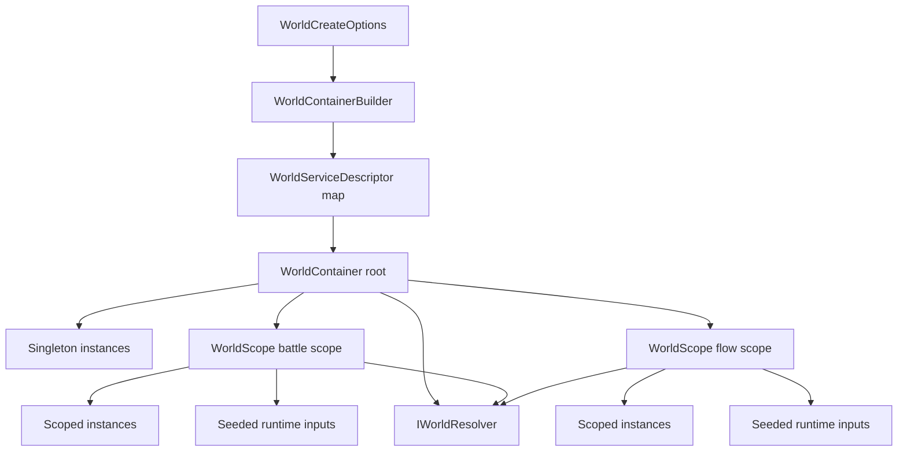
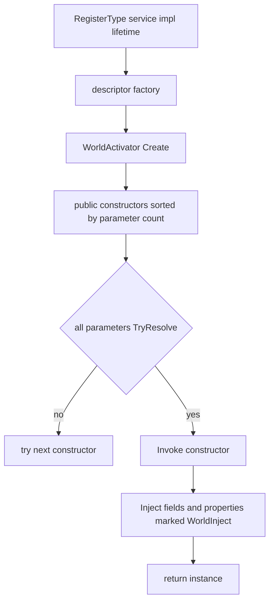
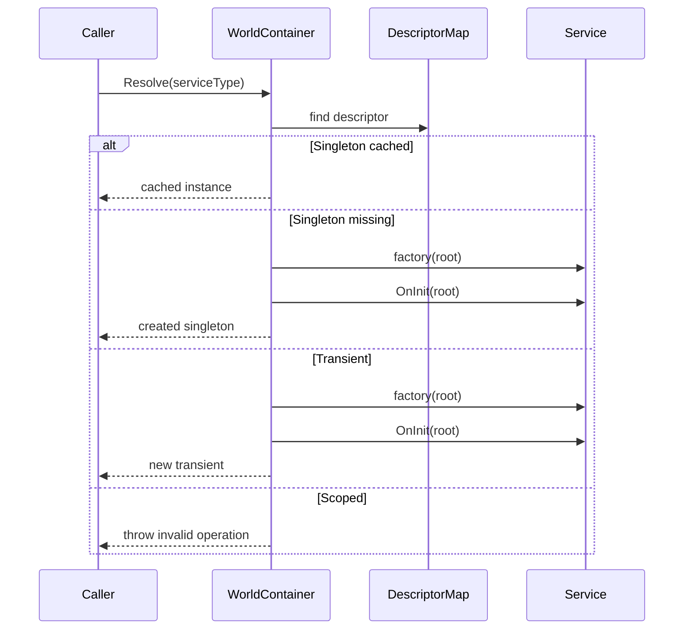
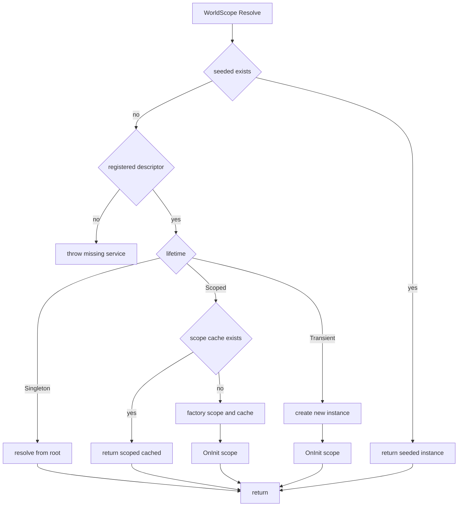
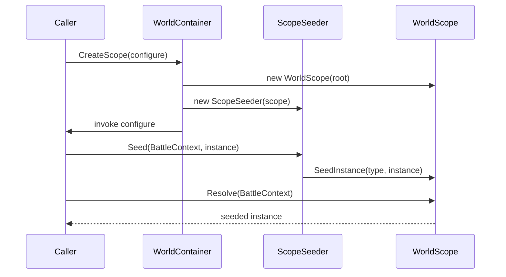
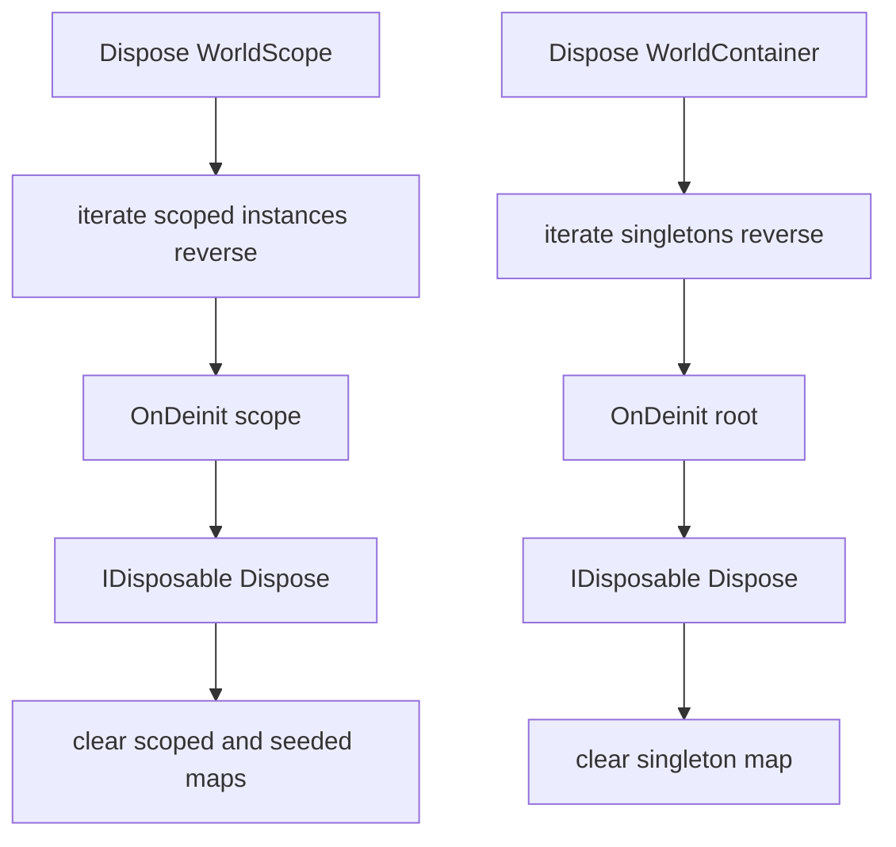
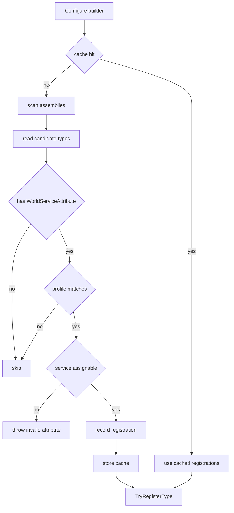

# 2.5 服务容器：WorldContainer、WorldScope 与世界级依赖注入

> 本文基于 `Unity/Packages/com.abilitykit.world.di` 的真实源码，解释 AbilityKit 的世界级依赖注入容器如何注册、解析、初始化和销毁服务。这里的容器不是通用 IOC 框架，而是围绕一个逻辑世界的生命周期做的轻量装配层。

---

## 目录

1. [能力定位](#1-能力定位)
2. [源码入口](#2-源码入口)
3. [整体结构](#3-整体结构)
4. [注册模型](#4-注册模型)
5. [解析流程](#5-解析流程)
6. [作用域与播种](#6-作用域与播种)
7. [生命周期回调与销毁顺序](#7-生命周期回调与销毁顺序)
8. [属性扫描模块](#8-属性扫描模块)
9. [设计意图与解决的问题](#9-设计意图与解决的问题)
10. [新手常见误区](#10-新手常见误区)
11. [推荐阅读顺序](#11-推荐阅读顺序)

---

## 1. 能力定位

`World DI` 解决的是“一个逻辑世界内服务如何装配”的问题。它提供注册、解析、作用域、实例播种、构造函数注入、`[WorldInject]` 成员注入、初始化回调和销毁回调，但刻意不做通用 IOC 框架的复杂特性，例如集合解析、拦截器、条件绑定或运行时热替换。

| 问题 | 容器提供的答案 |
|------|----------------|
| 世界启动时要装配哪些服务 | `WorldContainerBuilder` 收集描述符，最后 `Build()` 生成根容器 |
| 服务生命周期怎么表达 | `WorldLifetime.Singleton`、`Scoped`、`Transient` |
| 一局战斗内的临时上下文怎么传入 | `WorldContainer.CreateScope(configure)` 通过 `IWorldScopeSeeder` 播种实例 |
| 服务什么时候初始化 | 创建实例后，如果实现 `IWorldInitializable` 就调用 `OnInit` |
| 服务什么时候释放 | 容器或作用域释放时，逆序调用 `IWorldDeinitializable` 和 `IDisposable` |
| 框架默认服务和项目覆盖怎么共存 | 框架用 `TryRegister`，项目用 `Register` 覆盖 |

---

## 2. 源码入口

| 文件 | 作用 |
|------|------|
| `Unity/Packages/com.abilitykit.world.di/Runtime/World/DI/WorldContainerBuilder.cs` | 注册 API，构建 `WorldContainer` |
| `Unity/Packages/com.abilitykit.world.di/Runtime/World/DI/WorldContainer.cs` | 根容器，保存描述符和单例实例 |
| `Unity/Packages/com.abilitykit.world.di/Runtime/World/DI/WorldScope.cs` | 作用域容器，保存 scoped 实例和 seeded 实例 |
| `Unity/Packages/com.abilitykit.world.di/Runtime/World/DI/WorldActivator.cs` | 根据 `IWorldResolver` 选择构造函数并注入 `[WorldInject]` 成员 |
| `Unity/Packages/com.abilitykit.world.di/Runtime/World/DI/WorldLifetime.cs` | 生命周期枚举 |
| `Unity/Packages/com.abilitykit.world.di/Runtime/World/DI/IWorldResolver.cs` | 解析接口 |
| `Unity/Packages/com.abilitykit.world.di/Runtime/World/DI/IWorldScopeSeeder.cs` | 作用域播种接口 |
| `Unity/Packages/com.abilitykit.world.di/Runtime/World/Services/IWorldInitializable.cs` | 服务初始化回调 |
| `Unity/Packages/com.abilitykit.world.di/Runtime/World/Services/IWorldDeinitializable.cs` | 服务反初始化回调 |
| `Unity/Packages/com.abilitykit.world.di/Runtime/World/Services/Attributes/WorldServiceAttribute.cs` | 服务属性声明、生命周期、profile 与默认标记 |
| `Unity/Packages/com.abilitykit.world.di/Runtime/World/Services/Attributes/WorldInjectAttribute.cs` | 字段/属性注入标记，支持 required/optional |
| `Unity/Packages/com.abilitykit.world.di/Runtime/World/Services/Attributes/AttributeWorldServicesModule.cs` | 基于属性扫描注册世界服务 |

---

## 3. 整体结构



一个世界通常只有一个根 `WorldContainer`。根容器持有注册表和单例缓存；每次需要隔离一段运行流程时，再创建 `WorldScope`。作用域持有自己的 scoped 实例和 seeded 实例，释放作用域时不会影响根容器里的单例。

---

## 4. 注册模型

`WorldContainerBuilder` 内部使用 `Dictionary<Type, WorldServiceDescriptor>` 保存注册项。相同服务类型重复注册时，`Register` 会覆盖旧描述符，`TryRegister` 只在不存在时写入。

```csharp
var builder = new WorldContainerBuilder();

builder.Register<ICombatLog>(WorldLifetime.Singleton, r => new CombatLog());
builder.TryRegister<IWorldClock>(WorldLifetime.Singleton, r => new WorldClock());
builder.RegisterType<IDamageService, DamageService>(WorldLifetime.Scoped);
builder.RegisterInstance<IStaticConfig>(config);
builder.AddModule(new BattleWorldModule());

var container = builder.Build();
```

注册 API 的真实形态如下。

| API | 行为 |
|-----|------|
| `Register(type, lifetime, factory)` | 写入或覆盖服务描述符 |
| `TryRegister(type, lifetime, factory)` | 仅在服务类型未注册时写入 |
| `RegisterInstance(instance)` | 注册现成实例，生命周期是 singleton |
| `RegisterType(service, impl, lifetime)` | 通过 `WorldActivator.Create(impl, resolver)` 创建实现类型，支持可解析构造函数和 `[WorldInject]` 成员注入 |
| `TryRegisterType(service, impl, lifetime)` | 为框架默认实现提供可覆盖注册 |
| `AddModule(module)` | 调用模块的 `Configure(builder)` 聚合注册逻辑 |
| `Build()` | 把描述符集合固化为 `WorldContainer` |

默认无生命周期重载注册为 scoped，这一点对新手很重要：如果没有显式传入 `WorldLifetime.Singleton` 或 `Transient`，服务往往是作用域级别的。

`WorldActivator` 的构造策略不是“必须有无参构造函数”。它会缓存类型计划，按参数数量从多到少检查 public 构造函数，只要构造函数的每个参数都能通过当前 resolver `TryResolve` 成功，就选中该构造函数创建实例；创建后再处理标记了 `[WorldInject]` 的字段和属性。



这让 Service 可以把稳定、必要依赖放在构造函数里，把可选协作对象放在 `[WorldInject(required: false)]` 成员上。MOBA 的 `SkillCastCoordinator` 就是构造函数注入的典型例子，`MobaBuffService` 则主要使用成员注入。

---

## 5. 解析流程

根容器的解析入口是 `WorldContainer.Resolve(Type)`。它只允许直接解析 singleton 和 transient；如果请求 scoped，会抛出异常，防止 scoped 服务被根容器或 singleton 长期持有。



作用域解析入口是 `WorldScope.Resolve(Type)`，实际会委托到根容器的 `ResolveScoped`。它会按以下顺序处理：先看 seeded 实例，再按生命周期解析。



`TryResolve` 不会把未注册服务当作异常路径；但 seeded 实例即使没有注册描述符，也可以被 `TryResolve` 找到。这让调用方可以把“本次战斗输入”“本次技能上下文”一类运行时对象注入到作用域里。

---

## 6. 作用域与播种

`WorldContainer.CreateScope()` 创建普通作用域；`CreateScope(Action<IWorldScopeSeeder>)` 创建作用域后立即播种外部实例。

```csharp
using var scope = container.CreateScope(seed =>
{
    seed.Seed<BattleContext>(battleContext);
    seed.Seed<ICommandBuffer>(commandBuffer);
});

var damage = scope.Resolve<IDamageService>();
```

播种数据保存在 `WorldScope` 的 `_seeded` 字典里，和 `_scoped` 缓存分开。这是一个关键设计：播种对象通常由外部拥有，作用域释放时只清空引用，不会把它们加入作用域销毁队列。



播种时会校验实例能否赋值给服务类型。如果传入的实例类型不匹配，`SeedInstance` 会抛出参数异常，避免后续解析时才暴露错误。

---

## 7. 生命周期回调与销毁顺序

容器创建实例后会调用 `TryInit`。同一个实例只初始化一次，因为根容器用引用相等集合记录已初始化对象。

```csharp
public interface IWorldInitializable
{
    void OnInit(IWorldResolver services);
}

public interface IWorldDeinitializable
{
    void OnDeinit(IWorldResolver services);
}
```

销毁时使用逆序释放。作用域先逆序处理 scoped 实例，根容器逆序处理 singleton 实例。每个实例先调用 `OnDeinit`，再调用 `Dispose`。



逆序释放能让“后创建、依赖更多”的对象先退出，减少释放阶段访问已销毁依赖的概率。释放过程中异常会记录日志，但不会中断后续实例释放。

---

## 8. 属性扫描模块

`AttributeWorldServicesModule` 用于把标记了 `WorldServiceAttribute` 的类型批量注册到容器。它会扫描指定程序集或当前已加载程序集，按 namespace 前缀和 profile 过滤，然后调用 `TryRegisterType` 写入默认服务。



它使用 `TryRegisterType` 而不是 `RegisterType`，说明属性扫描是“框架默认装配”而不是强制覆盖项目配置。项目可以在扫描前或扫描后用 `Register` 明确覆盖具体服务。

`WorldServiceAttribute` 当前会把 `ServiceType`、`Lifetime`、`IsDefault` 和 `Profile` 记录进扫描结果；其中 `Profile` 会参与过滤，`IsDefault` 目前只是登记元数据，`AttributeWorldServicesModule.Configure` 应用注册时统一走 `TryRegisterType`，不会根据 `IsDefault` 分支覆盖已有注册。

---

## 9. 设计意图与解决的问题

### 9.1 根容器和作用域分离

如果根容器允许直接解析 scoped 服务，singleton 很容易在创建时捕获 scoped 对象，导致战斗结束后仍持有一局战斗的临时状态。源码中对此有明确防线：根容器解析 scoped 会抛错；如果 singleton 创建链路中尝试解析 scoped，会输出 resolve chain 诊断。

### 9.2 Register 和 TryRegister 分工

`Register` 是项目显式决策，应该覆盖旧值；`TryRegister` 是框架默认补位，不能覆盖项目选择。这让模块默认服务、属性扫描服务和业务自定义实现可以共存。

### 9.3 播种对象不参与销毁

`WorldScope` 把 seeded 和 scoped 分开，是为了表达所有权。scoped 是容器创建的，容器负责释放；seeded 是外部传入的，容器只负责让它在作用域内可解析。

### 9.4 构造函数注入和成员注入分工

`RegisterType` 会走 `WorldActivator`，因此服务可以使用 public 构造函数声明必要依赖。构造函数选择只基于“参数是否都能从当前 resolver 解析”，并优先使用参数更多的可解析构造函数；如果没有任何构造函数满足条件，会抛出包含缺失依赖诊断的异常。

`[WorldInject]` 则适合补充协作对象：字段和属性可以指定 `ServiceType`，也可以用成员自身类型；`required: true` 时解析失败会抛错，`required: false` 时保持默认值。这比在业务方法内部到处 `Resolve` 更容易看出服务边界。

### 9.5 初始化回调使用 resolver 参数

`OnInit(IWorldResolver services)` 让服务在实例创建后再做二阶段准备，例如根据完整容器创建内部执行器、订阅事件或注册验证器。这样也能支持按生命周期选择 root resolver 或 scope resolver。

### 9.6 轻量容器更适合确定性逻辑世界

AbilityKit 的世界容器支持必要的构造函数选择和成员注入，但没有引入自动集合解析、拦截器、条件绑定和复杂生命周期图。好处是行为更容易推断，错误更接近注册和解析现场，对需要跨端一致的逻辑世界更友好。

---

## 10. 新手常见误区

| 误区 | 正确理解 |
|------|----------|
| 以为有 `RegisterSingleton`、`RegisterTransient` | 源码使用 `Register(..., WorldLifetime.Singleton)` 或 `RegisterType(..., WorldLifetime.Transient)` |
| 以为 `RegisterType` 只能调用无参构造函数 | 实际通过 `WorldActivator` 选择所有参数都可解析的 public 构造函数，并优先选择参数更多的候选 |
| 在根容器解析 scoped 服务 | scoped 必须从 `WorldScope` 解析 |
| 把一局战斗上下文注册成 singleton | 用 `CreateScope(seed => seed.Seed(...))` 传入运行时上下文 |
| 认为 `TryResolve` 会自动创建未注册服务 | 未注册服务返回 false；只有 seeded 实例可以不依赖注册描述符 |
| 认为属性扫描会覆盖项目服务 | 属性扫描用 `TryRegisterType`，默认不覆盖已有注册 |
| 认为 `[WorldInject(required: false)]` 一定会有值 | optional 注入失败会保留默认值，使用前仍要判空或提供降级路径 |
| 忘记释放作用域 | scoped 服务的 `OnDeinit` 和 `Dispose` 依赖 `WorldScope.Dispose()` |

---

## 11. 推荐阅读顺序

1. 先读 `WorldContainerBuilder.cs`，确认真实注册 API。
2. 再读 `WorldActivator.cs`，理解构造函数选择和 `[WorldInject]` 成员注入。
3. 再读 `WorldContainer.cs`，理解根容器如何处理 singleton、transient 和禁止 root-scoped 解析。
4. 再读 `WorldScope.cs`，理解 scoped 缓存、seeded 实例和作用域释放。
5. 再读 `AttributeWorldServicesModule.cs`，理解框架默认服务如何批量注册。
6. 最后结合 [逻辑世界概述](01-WorldOverview.md)、[系统设计](04-SystemDesign.md) 和 [Host 运行时](../03-LogicalWorldHostDesign/01-HostRuntime.md)，看容器如何接入世界创建、System 安装与 Tick。

---

*文档版本：v2.1 | 最后更新：2026-07-04*
