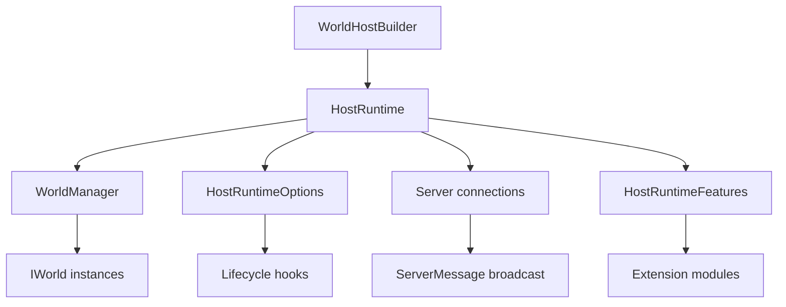
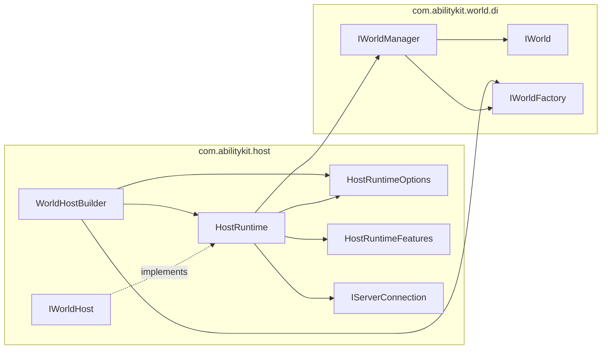
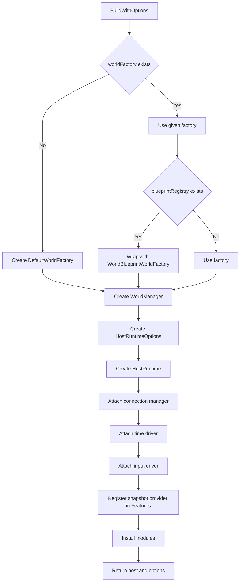
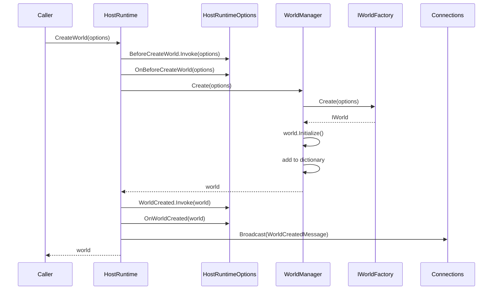
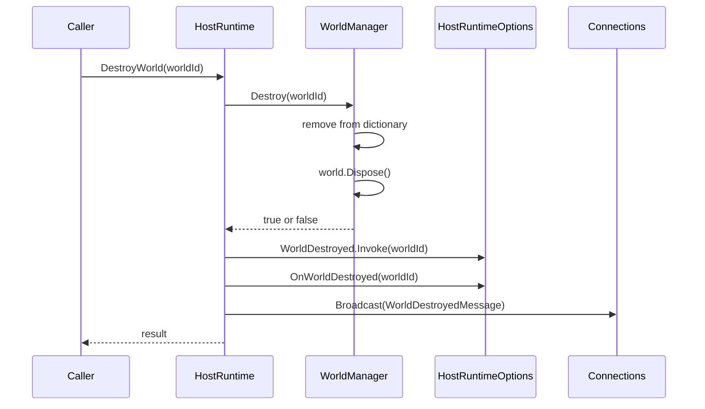
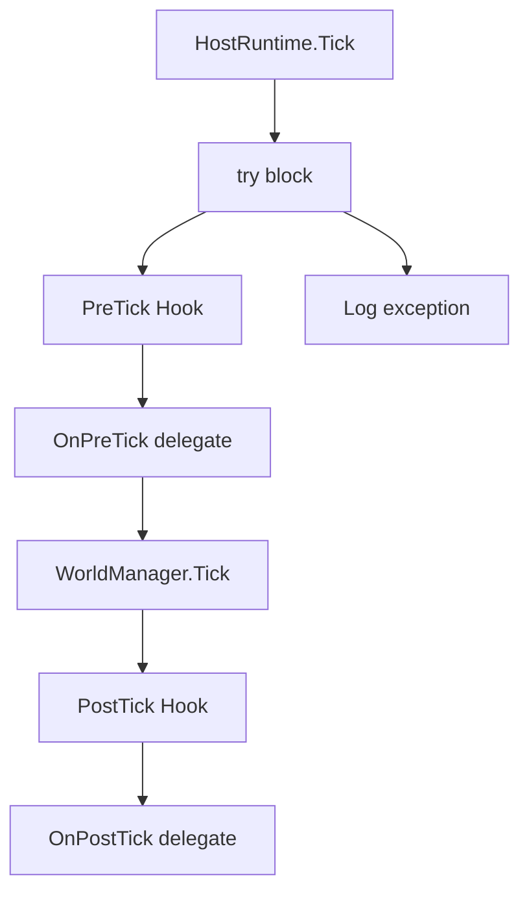
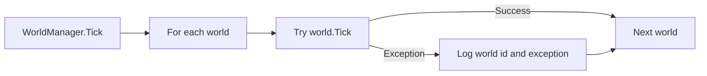
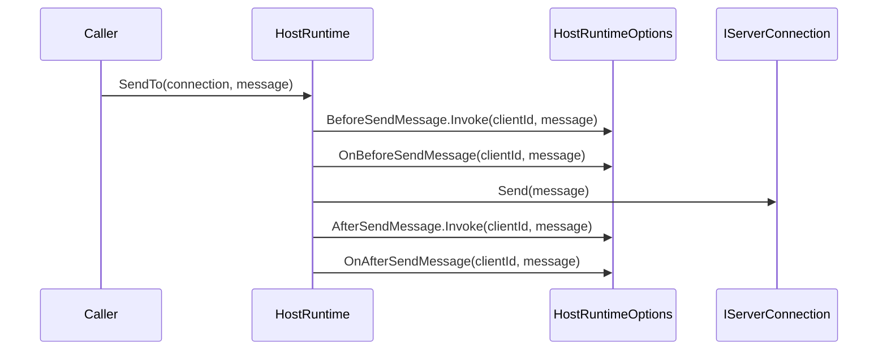
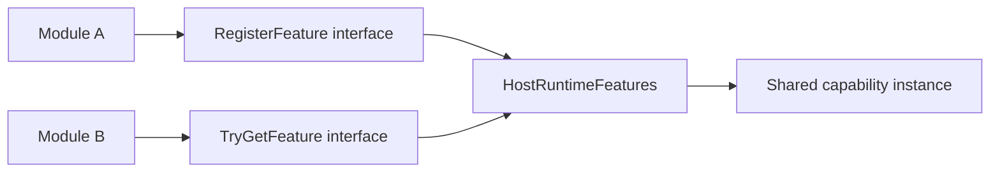

# 3.1 Host 运行时：HostRuntime、WorldHost 与连接广播

> 本文基于 `Unity/Packages/com.abilitykit.host` 与 `Unity/Packages/com.abilitykit.host.extension` 的真实源码，解释 HostRuntime 如何把世界管理、生命周期 Hook、连接管理、消息广播和扩展模块组织成一个可组合的运行时入口。

---

## 目录

- [3.1 Host 运行时：HostRuntime、WorldHost 与连接广播](#31-host-运行时hostruntimeworldhost-与连接广播)
  - [目录](#目录)
  - [1. 能力定位](#1-能力定位)
  - [2. 源码入口](#2-源码入口)
  - [3. 核心对象关系](#3-核心对象关系)
  - [4. 真实接口边界](#4-真实接口边界)
  - [5. HostRuntime 创建与装配流程](#5-hostruntime-创建与装配流程)
  - [6. 世界创建与销毁流程](#6-世界创建与销毁流程)
    - [6.1 CreateWorld](#61-createworld)
    - [6.2 DestroyWorld](#62-destroyworld)
  - [7. Tick 流程与 Hook 扩展](#7-tick-流程与-hook-扩展)
  - [8. 连接、发送与广播](#8-连接发送与广播)
  - [9. Features 与模块协作](#9-features-与模块协作)
  - [10. 设计意图与解决的问题](#10-设计意图与解决的问题)
  - [11. 新手常见误区](#11-新手常见误区)
  - [12. 阅读路线](#12-阅读路线)

---

## 1. 能力定位

Host 是逻辑世界外层的运行时门面。它不直接实现战斗规则，也不替代 `IWorld` 或 ECS，而是负责把下面几类能力串起来：

| 能力 | Host 侧职责 | 不负责的内容 |
|------|-------------|--------------|
| 世界管理 | 创建、查找、销毁、统一 Tick 世界 | 世界内部系统如何执行 |
| 生命周期扩展 | 在创建世界、Tick、发消息前后触发 Hook | 具体玩法逻辑 |
| 连接管理 | 记录客户端连接、广播 ServerMessage | 网络协议栈、可靠传输 |
| 模块协作 | 给模块提供 Hook 与 Feature 注册表 | 自动调度每个模块的 OnTick |
| 构建入口 | 通过 WorldHostBuilder 组合工厂、驱动、模块 | 业务世界类型的完整实现 |

Host 的定位可以理解为：



---

## 2. 源码入口

| 源码 | 说明 |
|------|------|
| `Unity/Packages/com.abilitykit.host/Runtime/Host/IWorldHost.cs` | Host 对外暴露的世界管理与 Tick 接口 |
| `Unity/Packages/com.abilitykit.host/Runtime/Host/Framework/HostRuntime.cs` | HostRuntime 主实现，持有 WorldManager、Options、Features、连接表 |
| `Unity/Packages/com.abilitykit.host/Runtime/Host/Framework/HostRuntimeOptions.cs` | 世界创建、销毁、Tick、消息发送 Hook 集合 |
| `Unity/Packages/com.abilitykit.host/Runtime/Host/Hooks/Hook.cs` | 有序 Hook 列表，支持 Add、Remove、Invoke |
| `Unity/Packages/com.abilitykit.host/Runtime/Host/Framework/HostRuntimeFeatures.cs` | 模块之间共享能力的 Type -> object 注册表 |
| `Unity/Packages/com.abilitykit.host/Runtime/Host/Builder/WorldHostBuilder.cs` | Host 构建器，装配 WorldFactory、驱动、快照提供器和模块 |
| `Unity/Packages/com.abilitykit.host/Runtime/Host/Transport/ServerMessage.cs` | Host 内置世界创建/销毁消息 |
| `Unity/Packages/com.abilitykit.world.di/Runtime/World/Management/WorldManager.cs` | 多世界容器和 Tick/Dispose 管理 |

---

## 3. 核心对象关系



关键点：

| 对象 | 源码事实 |
|------|----------|
| `HostRuntime` | 实现 `IWorldHost` 与 `IServerConnectionHost`，不是单纯的世界管理器 |
| `WorldManager` | 只关心 `IWorldFactory`、`IWorld` 字典和 Tick/Dispose，不知道连接 |
| `HostRuntimeOptions` | 是 Host 的扩展总线，模块通过它订阅生命周期 |
| `HostRuntimeFeatures` | 是模块之间发现协作能力的轻量注册表 |
| `WorldHostBuilder` | 把默认工厂、蓝图、连接管理、时间驱动、输入驱动、快照提供器和模块按顺序装配 |

---

## 4. 真实接口边界

当前源码中的 `IWorldHost` 很小：

```csharp
public interface IWorldHost
{
    IWorldManager Worlds { get; }

    IWorld CreateWorld(WorldCreateOptions options);
    bool DestroyWorld(WorldId id);
    bool TryGetWorld(WorldId id, out IWorld world);

    void Tick(float deltaTime);
}
```

需要注意两点：

| 误解 | 源码事实 |
|------|----------|
| Host 有 `Start()` / `Stop()` | 当前 `IWorldHost` 没有 Start/Stop；驱动由外部调用 `Tick` 或由 `FixedStepTimeDriver` 定时调用 |
| Host 直接保存模块列表并每帧调 `OnTick` | 模块安装时把处理器挂到 `HostRuntimeOptions` 的 Hook 上，Host Tick 时只触发 Hook |

---

## 5. HostRuntime 创建与装配流程

`WorldHostBuilder.BuildWithOptions()` 是推荐从组件创建 Host 的入口。



对应源码顺序：

| 步骤 | 行为 |
|------|------|
| 1 | 选择 `IWorldFactory`，未指定时使用 `DefaultWorldFactory` |
| 2 | 如果同时传入 `IWorldBlueprintRegistry`，用蓝图工厂包装已有工厂 |
| 3 | 创建 `WorldManager` |
| 4 | 创建 `HostRuntimeOptions` |
| 5 | 创建 `HostRuntime` |
| 6 | 依次 Attach 连接管理、时间驱动、输入驱动 |
| 7 | 快照提供器注册到 `runtime.Features` |
| 8 | 按添加顺序调用模块 `Install(runtime, options)` |

---

## 6. 世界创建与销毁流程

### 6.1 CreateWorld



`HostRuntime.CreateWorld` 在 `WorldManager.Create` 前后都提供扩展点：

| 扩展点 | 典型用途 |
|--------|----------|
| `BeforeCreateWorld` | 模块修改 `WorldCreateOptions`，例如注册 `IFrameTime` |
| `WorldCreated` | 模块建立世界会话，例如 `FrameSyncDriverModule` 为世界创建输入缓冲 |
| `WorldCreatedMessage` | 通知连接方世界已经创建 |

### 6.2 DestroyWorld



---

## 7. Tick 流程与 Hook 扩展

`HostRuntime.Tick(deltaTime)` 的真实顺序是：



`WorldManager.Tick` 会遍历所有世界，并且单个世界异常只记录日志，不让整个 Host Tick 直接中断：



这使 Host 具备两个层面的容错：

| 层级 | 容错方式 |
|------|----------|
| HostRuntime.Tick | 捕获整个 Tick 外层异常 |
| WorldManager.Tick | 捕获单个世界 Tick 异常并继续遍历 |

---

## 8. 连接、发送与广播

`HostRuntime` 内部维护 `Dictionary<ServerClientId, IServerConnection>`。

| API | 行为 |
|-----|------|
| `Connect(connection)` | 以 `connection.ClientId` 作为 key 注册或覆盖连接 |
| `Disconnect(clientId)` | 从连接表移除连接 |
| `Broadcast(message)` | 遍历当前连接并调用 `SendTo` |
| `SendTo(connection, message)` | 触发发送前后 Hook，再调用 `connection.Send(message)` |

发送流程：



广播中的单个连接发送失败会记录日志并继续发给其他连接。

---

## 9. Features 与模块协作

`HostRuntimeFeatures` 是一个按 `Type` 注册对象的轻量容器：



典型例子：

| 模块 | 注册或读取的 Feature | 用途 |
|------|---------------------|------|
| `FrameSyncDriverModule` | 注册 `IFrameSyncInputHub` | 允许外部提交帧输入 |
| `FrameSyncDriverModule` | 注册 `IFrameSyncDriverEvents` | 允许时间、回滚模块订阅输入 flush 与帧后事件 |
| `ServerFrameTimeModule` | 读取 `IFrameSyncDriverEvents` | 如果帧同步模块存在，就跟随帧同步 PostStep 更新时间 |
| `SimpleSnapshotProvider` | 注册快照能力 | 给 Host 或模块提供快照读取入口 |

这套设计避免模块之间互相持有具体类型，依赖接口即可协作。

---

## 10. 设计意图与解决的问题

| 设计 | 解决的问题 |
|------|------------|
| `IWorldHost` 保持很小 | 让 Host 可以在 Unity、Console、Server 中复用 |
| Hook 集中在 `HostRuntimeOptions` | 模块不需要改 HostRuntime 源码就能介入生命周期 |
| `HostRuntimeFeatures` | 模块之间通过能力接口协作，避免强耦合 |
| `WorldManager` 独立在 World DI 包 | Host 只组合，不吞掉世界生命周期底座 |
| `Broadcast` 使用抽象 `ServerMessage` | Host 可以表达运行时事件，但不绑定具体网络协议 |
| `WorldHostBuilder` | 把常见装配路径标准化，减少示例和业务重复装配 |

---

## 11. 新手常见误区

| 误区 | 正确理解 |
|------|----------|
| HostRuntime 是游戏主循环本身 | HostRuntime 只是 Tick 入口；谁调用 Tick 由外部驱动决定 |
| 模块有 Priority 并自动按优先级 Tick | 当前模块没有 Priority；安装顺序由 Builder 添加顺序决定，运行顺序由 Hook order 和 Hook 类型决定 |
| `HostRuntimeOptions.OnPostTick` 和 `PostTick` 是二选一 | 源码同时支持 Hook 对象和旧式 delegate，Host Tick 会都调用 |
| `Features` 是 DI 容器 | Features 只是 Host 级能力注册表，不管理生命周期，也不做构造注入 |
| `Broadcast` 等于网络协议 | Broadcast 只是遍历 `IServerConnection.Send`，可靠性和编码在连接实现之外 |

---

## 12. 阅读路线

1. 先读 `IWorldHost`，确认 Host 对外边界。
2. 读 `HostRuntime`，理解创建世界、Tick、连接广播三条主路径。
3. 读 `HostRuntimeOptions` 和 `Hook`，理解模块接入点。
4. 读 `HostRuntimeFeatures`，理解模块间共享能力。
5. 读 `WorldHostBuilder`，理解推荐装配顺序。
6. 接着读 [Host 模块系统](./02-HostModules.md)，看扩展模块如何使用 Hook 和 Features。
7. 最后读 [World 管理器](./03-WorldManager.md)，把 Host 外层与世界生命周期底座连起来。

---

*文档版本：v2.0 | 最后更新：2026-07-03*
