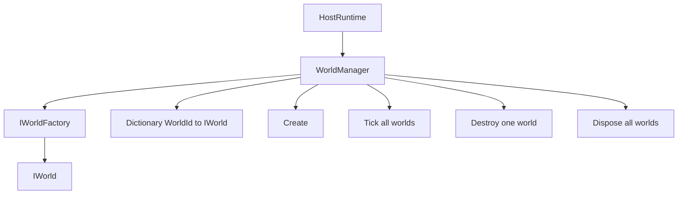
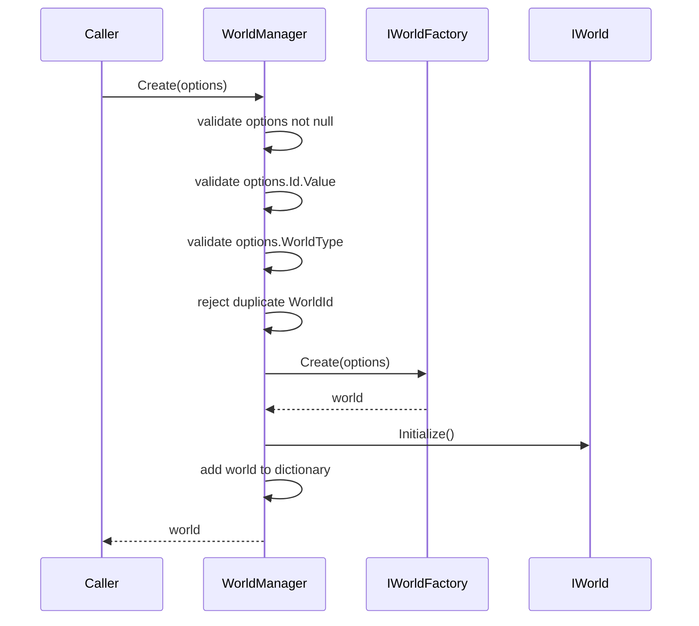
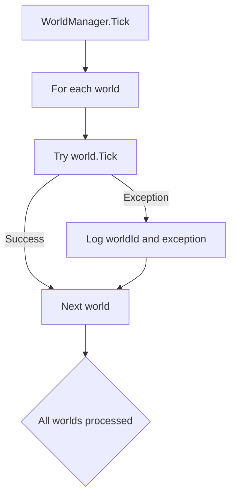
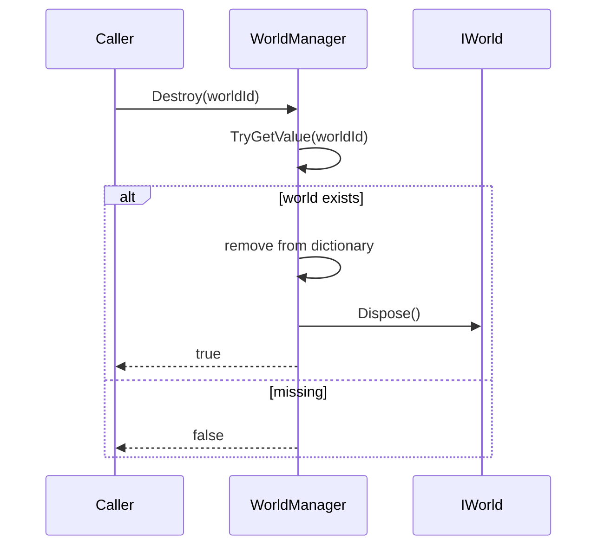
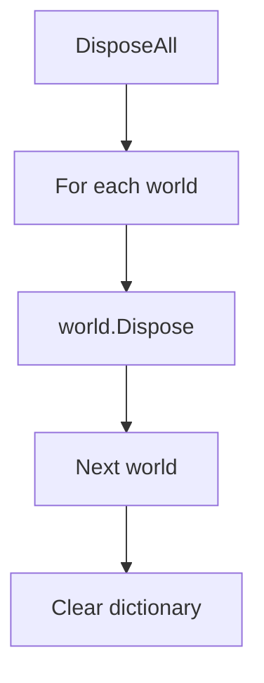
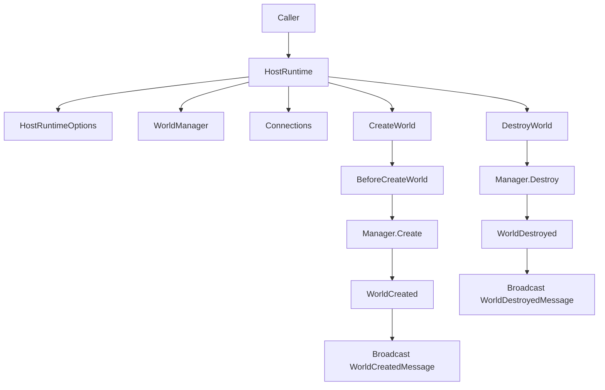
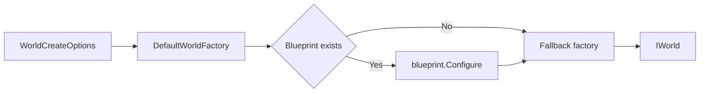
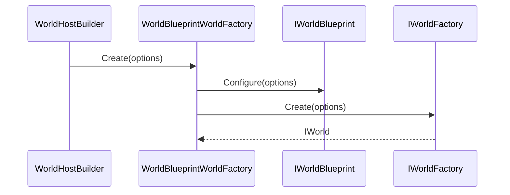

# 3.3 World 管理器：IWorldManager、WorldManager 与多世界生命周期

> 本文基于 `Unity/Packages/com.abilitykit.world.di` 与 `Unity/Packages/com.abilitykit.host` 的真实源码，解释 WorldManager 如何管理多个 `IWorld`，以及 HostRuntime 如何在它外层补充 Hook、连接广播和模块扩展。

---

## 目录

- [3.3 World 管理器：IWorldManager、WorldManager 与多世界生命周期](#33-world-管理器iworldmanagerworldmanager-与多世界生命周期)
  - [目录](#目录)
  - [1. 能力定位](#1-能力定位)
  - [2. 源码入口](#2-源码入口)
  - [3. 真实接口](#3-真实接口)
  - [4. WorldManager 内部结构](#4-worldmanager-内部结构)
  - [5. Create 生命周期](#5-create-生命周期)
  - [6. Tick 生命周期](#6-tick-生命周期)
  - [7. Destroy 与 DisposeAll](#7-destroy-与-disposeall)
    - [7.1 Destroy 单个世界](#71-destroy-单个世界)
    - [7.2 DisposeAll 全部释放](#72-disposeall-全部释放)
  - [8. 与 HostRuntime 的关系](#8-与-hostruntime-的关系)
  - [9. WorldFactory 与 Blueprint](#9-worldfactory-与-blueprint)
    - [9.1 DefaultWorldFactory](#91-defaultworldfactory)
    - [9.2 WorldBlueprintWorldFactory](#92-worldblueprintworldfactory)
  - [10. 设计意图与解决的问题](#10-设计意图与解决的问题)
  - [11. 新手常见误区](#11-新手常见误区)
  - [12. 阅读路线](#12-阅读路线)

---

## 1. 能力定位

`WorldManager` 是 World DI 包里的多世界容器。它的职责很窄：用 `WorldId` 管理多个 `IWorld`，通过 `IWorldFactory` 创建世界，统一调用 `Tick`，并在销毁时调用 `Dispose`。

它不负责：

| 不负责的内容 | 对应位置 |
|--------------|----------|
| 连接和广播 | `HostRuntime` |
| Host 模块安装 | `WorldHostBuilder` 与 `IHostRuntimeModule` |
| 世界内部服务生命周期 | `WorldContainer`、`WorldScope` |
| 具体 ECS 或系统执行细节 | `IWorld.Tick` 内部实现 |
| 世界类型如何构造 | `IWorldFactory`、`WorldTypeRegistry`、Blueprint |

整体关系：



---

## 2. 源码入口

| 源码 | 说明 |
|------|------|
| `Unity/Packages/com.abilitykit.world.di/Runtime/World/Management/IWorldManager.cs` | 多世界管理接口 |
| `Unity/Packages/com.abilitykit.world.di/Runtime/World/Management/WorldManager.cs` | `WorldManager` 默认实现 |
| `Unity/Packages/com.abilitykit.world.di/Runtime/World/Abstractions/IWorldFactory.cs` | 世界工厂接口 |
| `Unity/Packages/com.abilitykit.world.di/Runtime/World/Abstractions/IWorld.cs` | 世界最小生命周期接口 |
| `Unity/Packages/com.abilitykit.world.di/Runtime/World/Abstractions/WorldCreateOptions.cs` | 创建世界所需选项 |
| `Unity/Packages/com.abilitykit.host/Runtime/Host/Framework/HostRuntime.cs` | Host 外层调用 `WorldManager` 并补充 Hook/广播 |
| `Unity/Packages/com.abilitykit.host/Runtime/Host/Builder/DefaultWorldFactory.cs` | Host 默认工厂包装入口 |
| `Unity/Packages/com.abilitykit.host/Runtime/Host/WorldBlueprints/WorldBlueprintWorldFactory.cs` | Blueprint 介入世界创建选项的包装工厂 |

---

## 3. 真实接口

当前 `IWorldManager` 接口是：

```csharp
public interface IWorldManager
{
    IReadOnlyDictionary<WorldId, IWorld> Worlds { get; }

    IWorld Create(WorldCreateOptions options);
    bool TryGet(WorldId id, out IWorld world);
    bool Destroy(WorldId id);

    void Tick(float deltaTime);
    void DisposeAll();
}
```

和早期占位文档相比，需要修正两点：

| 旧说法 | 当前源码事实 |
|--------|--------------|
| `GetAll()` 返回所有世界 | 当前通过 `IReadOnlyDictionary<WorldId, IWorld> Worlds` 暴露只读字典 |
| 管理器负责启动/停止世界 | 管理器只有创建、Tick、销毁和全部释放；是否被驱动取决于 Host 或外部循环 |

---

## 4. WorldManager 内部结构

`WorldManager` 的状态非常直接：

```csharp
private readonly IWorldFactory _factory;
private readonly Dictionary<WorldId, IWorld> _worlds = new Dictionary<WorldId, IWorld>();
```

这对应两个核心约束：

| 字段 | 设计含义 |
|------|----------|
| `_factory` | `WorldManager` 不知道具体世界类型，只把创建委托给工厂 |
| `_worlds` | `WorldId` 是多世界索引 key，创建重复 id 会被拒绝 |

运行结构：


---

## 5. Create 生命周期

`WorldManager.Create(options)` 的流程是：



源码里的校验顺序体现了几个关键决策：

| 校验 | 失败行为 | 解决的问题 |
|------|----------|------------|
| `options == null` | `ArgumentNullException` | 避免工厂收到空输入 |
| `options.Id.Value` 为空 | `ArgumentException` | 世界必须可索引 |
| `options.WorldType` 为空 | `ArgumentException` | 工厂必须知道创建哪类世界 |
| `_worlds.ContainsKey(options.Id)` | `InvalidOperationException` | 防止覆盖正在运行的世界 |

`world.Initialize()` 在加入字典之前执行。这样可以避免一个初始化失败的世界进入管理器；只有成功初始化后才成为可查询和可 Tick 的世界。

---

## 6. Tick 生命周期

`WorldManager.Tick(deltaTime)` 会遍历当前字典中的所有世界并调用 `IWorld.Tick`。



重要细节：单个世界 Tick 异常不会终止整个管理器 Tick。源码会记录：

```csharp
Log.Exception(ex, $"[WorldManager] World.Tick failed: worldId={kv.Key}");
```

这对多房间服务器很重要：一个房间逻辑报错，不应该直接阻断其他房间 Tick。

但也要注意：`WorldManager` 没有快照字典再遍历，也没有锁。如果在 Tick 遍历期间修改 `_worlds`，可能触发集合枚举问题。通常应由 Host 主线程或明确的调度点创建/销毁世界。

---

## 7. Destroy 与 DisposeAll

### 7.1 Destroy 单个世界



`Destroy` 先从字典移除，再调用 `world.Dispose()`。这样做的效果是：即使 Dispose 内部触发一些回调或查询，也不会再把该世界视为管理器中的活跃世界。

### 7.2 DisposeAll 全部释放



`DisposeAll` 用于 Host 或测试退出时清理所有世界。它不像 `DestroyWorld` 那样触发 HostRuntime 的 `WorldDestroyed` Hook 或广播消息，因为它是 `WorldManager` 自身的底层释放能力。

---

## 8. 与 HostRuntime 的关系

`HostRuntime` 是 `WorldManager` 的外层门面：



对比两层职责：

| 操作 | WorldManager | HostRuntime |
|------|--------------|-------------|
| 创建世界 | 校验、工厂创建、Initialize、存字典 | 创建前后触发 Hook，并广播 `WorldCreatedMessage` |
| 查找世界 | `TryGet` | `TryGetWorld` 代理到 `WorldManager.TryGet` |
| 销毁世界 | 移除字典并 Dispose | 销毁后触发 Hook，并广播 `WorldDestroyedMessage` |
| Tick | 遍历所有世界 | Tick 前后触发 Hook，外层捕获异常 |
| 连接 | 不知道连接 | 管理连接并发送消息 |

---

## 9. WorldFactory 与 Blueprint

`WorldManager` 只依赖 `IWorldFactory`，这让世界类型创建策略可以被替换。

### 9.1 DefaultWorldFactory

`DefaultWorldFactory` 支持可选的 `IWorldBlueprintRegistry`。如果存在蓝图，会先让蓝图修改 `WorldCreateOptions`，再委托 fallback factory 创建世界。



默认 fallback 只注册了一个会抛异常的 `default` 类型，用于提醒使用者必须提供真实世界工厂或蓝图：

```csharp
registry.Register("default", options => throw new InvalidOperationException(
    "No world factory registered. Please use BlueprintRegistry or register a world factory."));
```

### 9.2 WorldBlueprintWorldFactory

当使用者同时提供 `IWorldFactory` 和 `IWorldBlueprintRegistry` 时，`WorldHostBuilder` 会用 `WorldBlueprintWorldFactory` 包装原工厂：



这使蓝图可以统一补充模块、服务或扩展字段，而具体世界创建仍由业务工厂负责。

---

## 10. 设计意图与解决的问题

| 设计 | 解决的问题 |
|------|------------|
| `WorldManager` 只依赖 `IWorldFactory` | 多世界管理不绑定具体世界类型 |
| `WorldId` 做字典 key | 多房间、多副本、多测试世界可并存 |
| Create 时先 Initialize 后入表 | 初始化失败的世界不会进入活跃集合 |
| Destroy 时先移除再 Dispose | 防止正在销毁的世界仍被查询为活跃 |
| Tick 单世界异常隔离 | 一个世界失败不直接阻断其他世界 |
| HostRuntime 包装 WorldManager | 底层生命周期保持纯粹，Host 层再加 Hook、广播、模块 |
| Blueprint 包装工厂 | 允许配置化修改创建选项，而不侵入业务工厂 |

---

## 11. 新手常见误区

| 误区 | 正确理解 |
|------|----------|
| `WorldManager` 是 Host | `WorldManager` 只管理世界；HostRuntime 才处理连接、Hook 和广播 |
| `WorldManager` 有 `GetAll()` | 当前接口暴露 `Worlds` 只读字典 |
| `Destroy` 会广播世界销毁消息 | 广播是 `HostRuntime.DestroyWorld` 的职责 |
| `DisposeAll` 等同于逐个 `DestroyWorld` | `DisposeAll` 不触发 HostRuntime Hook 或消息广播 |
| 可以在世界 Tick 中随意创建/销毁世界 | 当前遍历没有快照和锁，创建/销毁应放在明确调度点 |
| 默认工厂能直接创建业务世界 | 默认 fallback 会抛异常，项目需要注册真实工厂或 Blueprint |

---

## 12. 阅读路线

1. 先读 `IWorldManager`，确认当前真实接口。
2. 读 `WorldManager.Create`，理解校验、工厂创建和 Initialize 顺序。
3. 读 `WorldManager.Tick`，理解多世界 Tick 的异常隔离。
4. 读 `WorldManager.Destroy` 和 `DisposeAll`，理解释放边界。
5. 回到 `HostRuntime.CreateWorld` 和 `DestroyWorld`，理解 Host 对管理器的包装。
6. 读 `DefaultWorldFactory` 与 `WorldBlueprintWorldFactory`，理解 Host Builder 如何注入世界创建策略。
7. 结合 [Host 运行时](./01-HostRuntime.md) 和 [Host 模块系统](./02-HostModules.md) 看完整 Host 层设计。

---

*文档版本：v2.0 | 最后更新：2026-07-03*
