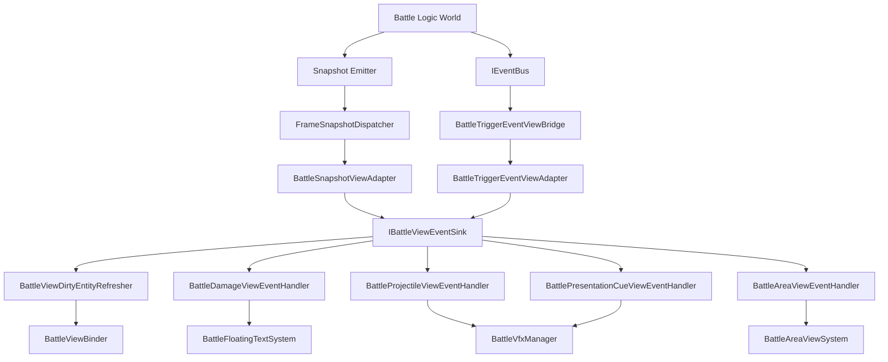
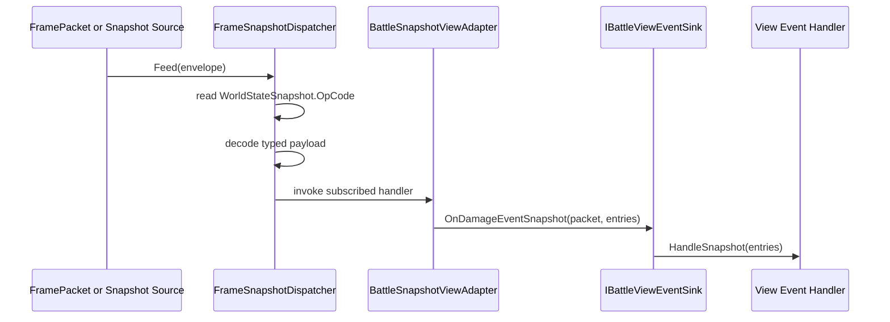
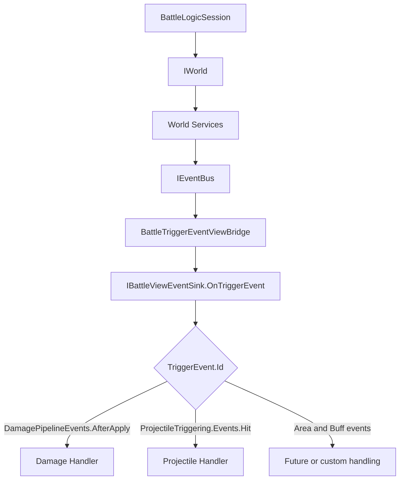
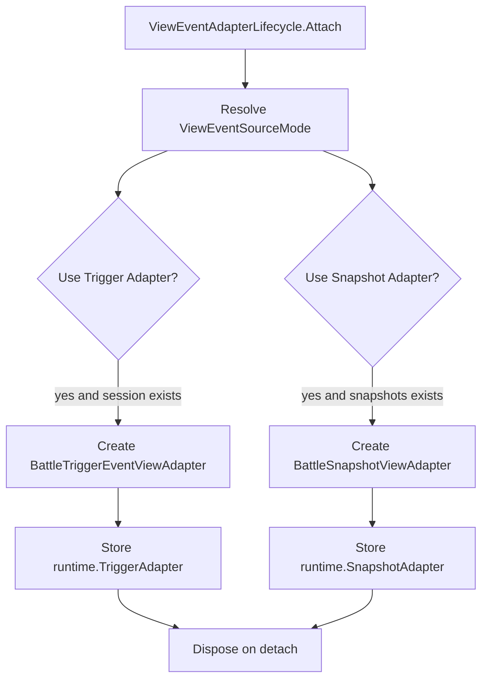
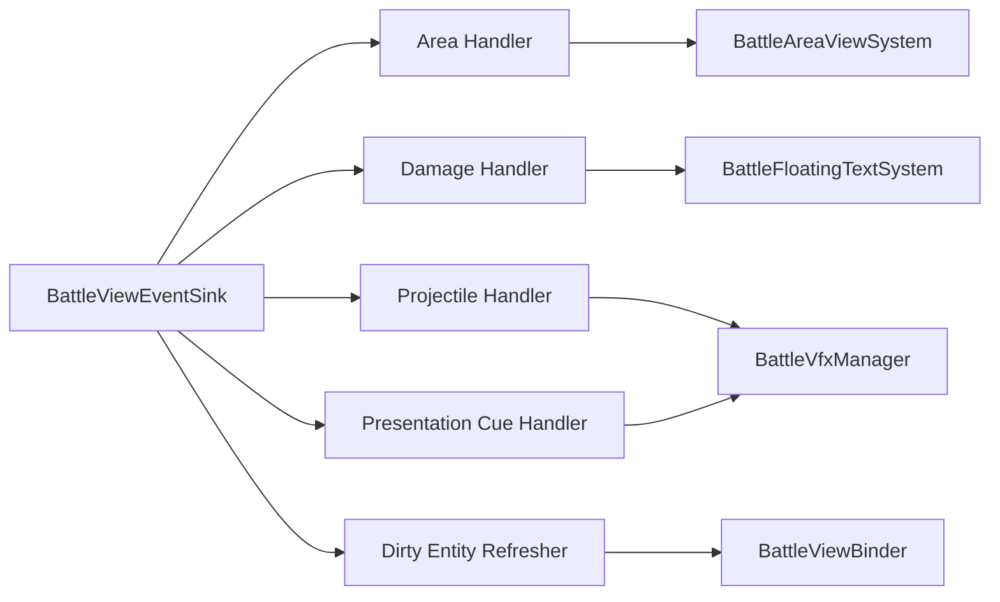
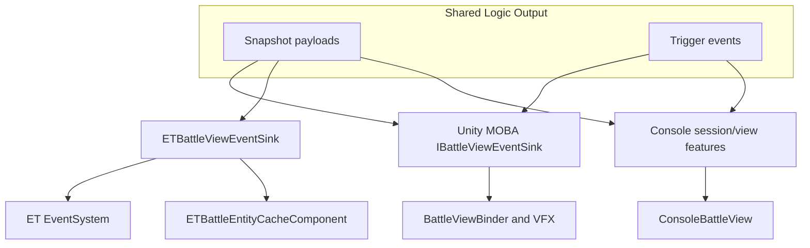

# 4.1 视图事件抽象：Sink、Adapter 与表现副作用边界

> 本文基于当前 MOBA View Runtime 源码说明表现层事件抽象。当前主线由 `IBattleViewEventSink` 承接快照路由与触发事件，再把表现副作用分发到 View Binder、VFX、浮字、区域表现和脏刷新处理器。

---

## 1. 这一层解决什么问题

表现层事件抽象的目标不是让逻辑层直接调用 Unity、Console 或 ET 的渲染对象，而是在逻辑世界与平台表现之间建立一条可替换的事件边界。

| 问题 | 设计处理 |
|------|----------|
| 逻辑层不能依赖 Unity GameObject | 逻辑层只产出 TriggerEvent、WorldStateSnapshot 或 FrameSnapshotData |
| 不同平台表现方式不同 | 平台侧实现自己的 View Sink 或 View Feature |
| 快照和即时触发事件都可能驱动表现 | 通过 ViewEventSourceMode 选择 SnapshotOnly、TriggerOnly 或 Hybrid |
| 表现对象需要与 ECS 实体重新绑定 | BattleViewBinder 负责实体到 MonoViewHandle 的绑定和重建 |
| 表现副作用不能污染确定性模拟 | Sink 只处理 VFX、浮字、区域、Dirty Sync、平台事件发布 |

---

## 2. 源码入口

| 源码 | 作用 |
|------|------|
| `Unity/Packages/com.abilitykit.demo.moba.view.runtime/Runtime/Game/Battle/Presentation/ViewEvents/IBattleViewEventSink.cs` | MOBA View Runtime 当前表现事件入口接口 |
| `Unity/Packages/com.abilitykit.demo.moba.view.runtime/Runtime/Game/Battle/Presentation/ViewEvents/BattleViewEventSink.cs` | Unity/MOBA 主表现 Sink，分发到伤害、投射物、区域、Cue、Dirty View |
| `Unity/Packages/com.abilitykit.demo.moba.view.runtime/Runtime/Game/Battle/Presentation/Features/View/Shared/ViewEventAdapterLifecycle.cs` | 根据 ViewEventSourceMode 挂接 Snapshot Adapter 和 Trigger Adapter |
| `Unity/Packages/com.abilitykit.demo.moba.view.runtime/Runtime/Game/Battle/Presentation/ViewEvents/Snapshot/BattleSnapshotViewAdapter.cs` | 订阅 FrameSnapshotDispatcher 的 opCode，转发到 Sink |
| `Unity/Packages/com.abilitykit.demo.moba.view.runtime/Runtime/Game/Battle/Presentation/ViewEvents/Triggering/BattleTriggerEventViewAdapter.cs` | 从 World DI 中解析 IEventBus，挂接触发事件桥 |
| `Unity/Packages/com.abilitykit.demo.moba.view.runtime/Runtime/Game/Battle/Presentation/View/BattleViewBinder.cs` | 表现对象绑定、同步、插值、重绑和销毁处理 |
| `src/AbilityKit.Demo.Moba.Console/View/ConsoleBattleView.cs` | Console 平台的表现对象与渲染入口 |
| `src/AbilityKit.Demo.ET.Logic/Model/Presentation/Sinks/ETBattleViewEventSink.cs` | ET 平台把视图事件转成 ET EventSystem 事件和缓存更新 |

---

## 3. 当前真实接口

当前 MOBA Unity View Runtime 的 `IBattleViewEventSink` 面向两类输入：

1. `TriggerEvent`：来自触发器/EventBus 的即时事件。
2. `ISnapshotEnvelope + payload`：来自快照路由解码后的 typed payload。

```csharp
public interface IBattleViewEventSink
{
    void OnTriggerEvent(in TriggerEvent evt);

    void OnEnterGameSnapshot(ISnapshotEnvelope packet, EnterMobaGameRes res);

    void OnActorTransformSnapshot(ISnapshotEnvelope packet, MobaActorTransformSnapshotEntry[] entries);

    void OnProjectileEventSnapshot(ISnapshotEnvelope packet, MobaProjectileEventSnapshotEntry[] entries);

    void OnAreaEventSnapshot(ISnapshotEnvelope packet, MobaAreaEventSnapshotEntry[] entries);

    void OnDamageEventSnapshot(ISnapshotEnvelope packet, MobaDamageEventSnapshotEntry[] entries);

    void OnPresentationCueSnapshot(ISnapshotEnvelope packet, PresentationCueData[] entries);
}
```

表现层事件边界不围绕 `OnActorSpawn(in ActorSpawnData)` 这类通用事件定义。当前主线把网络/同步层的 opCode payload 解码后交给 View Sink，Sink 再决定如何更新 Unity 表现对象、播放 VFX 或刷新可见实体。

---

## 4. 总体对象关系



设计意图是把输入来源和表现副作用拆开：Adapter 只负责订阅与转发，Sink 只负责事件分类，具体表现处理器负责更新对象、生成 VFX、浮字或区域表现。

---

## 5. Snapshot 事件进入表现层

`BattleSnapshotViewAdapter` 在构造时订阅多个快照 opCode。每个订阅都绑定到 `IBattleViewEventSink` 的一个方法。



以 `BattleSnapshotViewAdapter` 为例，它订阅的快照包括：

| opCode | payload | Sink 方法 |
|--------|---------|----------|
| `MobaOpCodes.Snapshot.EnterGame` | `EnterMobaGameRes` | `OnEnterGameSnapshot` |
| `MobaOpCodes.Snapshot.ActorTransform` | `MobaActorTransformSnapshotEntry[]` | `OnActorTransformSnapshot` |
| `MobaOpCodes.Snapshot.ProjectileEvent` | `MobaProjectileEventSnapshotEntry[]` | `OnProjectileEventSnapshot` |
| `MobaOpCodes.Snapshot.AreaEvent` | `MobaAreaEventSnapshotEntry[]` | `OnAreaEventSnapshot` |
| `MobaOpCodes.Snapshot.DamageEvent` | `MobaDamageEventSnapshotEntry[]` | `OnDamageEventSnapshot` |
| `MobaOpCodes.Snapshot.PresentationCue` | `MobaPresentationCueSnapshotEntry[]` | map 后调用 `OnPresentationCueSnapshot` |

Presentation Cue 额外经过 `PresentationCueSnapshotMapper.Map(entries)`，原因是协议层数据结构不直接等同于 View Runtime 的 `PresentationCueData`。

---

## 6. Trigger 事件进入表现层

Trigger 通道通过 `BattleTriggerEventViewAdapter` 从当前 `BattleLogicSession` 拿到 `IWorld`，再从 `world.Services` 解析 `IEventBus`。解析成功后创建 `BattleTriggerEventViewBridge`。



`BattleTriggerEventViewBridge` 订阅的事件包括：

| 事件来源 | 事件 |
|----------|------|
| Damage Pipeline | `DamagePipelineEvents.AfterApply` |
| Buff Triggering | `ApplyOrRefresh`、`Remove` |
| Area Triggering | `Spawn`、`Enter`、`Exit`、`Expire` |
| Projectile Triggering | `Hit` |

当前 `BattleViewEventSink.OnTriggerEvent` 对 Damage 和 Projectile Hit 有明确处理：

```csharp
public void OnTriggerEvent(in TriggerEvent evt)
{
    if (evt.Id == null) return;

    if (evt.Id == DamagePipelineEvents.AfterApply)
    {
        if (evt.Payload is DamageResult result)
        {
            _damageEvents.HandleDamageResult(result);
        }

        return;
    }

    if (evt.Id == ProjectileTriggering.Events.Hit)
    {
        _projectileEvents.HandleTriggerHit(evt);
    }
}
```

---

## 7. ViewEventSourceMode 的意义

`ViewEventAdapterLifecycle` 会根据 `BattleContext.Plan.Sync.ViewEventSourceMode` 决定启用哪些 Adapter。



| 模式 | 触发事件 Adapter | 快照 Adapter | 适用场景 |
|------|------------------|--------------|----------|
| `SnapshotOnly` | 不启用 | 启用 | 远端同步、回放、以权威快照驱动表现 |
| `TriggerOnly` | 启用 | 不启用 | 本地逻辑直连、即时表现验证 |
| `Hybrid` | 启用 | 启用 | 需要即时反馈，同时用快照校正表现 |

这个策略解决的是“同一套表现层如何同时服务本地 Demo、远端同步、预测回滚和回放”的问题。

---

## 8. Sink 内部如何隔离表现副作用

`BattleViewEventSink` 本身不直接操作所有 View 对象，而是组合多个 handler：

| Handler | 输入 | 主要职责 |
|---------|------|----------|
| `BattleAreaViewEventHandler` | Area snapshot | 生成、更新或移除区域表现 |
| `BattleDamageViewEventHandler` | Damage snapshot / DamageResult | 浮字、伤害反馈 |
| `BattleProjectileViewEventHandler` | Projectile snapshot / Trigger hit | 投射物 VFX 和命中特效 |
| `BattlePresentationCueViewEventHandler` | PresentationCueData | 播放或停止表现 Cue |
| `BattleViewDirtyEntityRefresher` | EnterGame / Transform snapshot | 触发实体显示刷新 |



这种拆分让每种表现副作用都有单独的生命周期和测试边界，也避免 `IBattleViewEventSink` 变成巨大的渲染类。

---

## 9. 与 BattleViewBinder 的边界

`BattleViewBinder` 负责“实体到表现对象”的绑定与同步，包括：

| 能力 | 相关方法 |
|------|----------|
| 同步实体表现 | `Sync(entity)`、`Sync(entity, ctx)` |
| 插值更新 | `TickInterpolation(ctx, deltaTime)` |
| 查询表现对象 | `TryGetShellGameObject`、`TryGetAttachRoot` |
| 销毁处理 | `OnDestroyed`、`Clear` |
| 世界重绑 | `RebindAll(world)`、`RebindAll(world, ctx)` |

Sink 不应该自己维护实体和 GameObject 的主映射。它应通过 Binder、AreaViews、VfxManager 等对象完成表现副作用。

---

## 10. 平台适配关系



不同平台的接口形状可能不完全一致。Unity MOBA View Runtime 使用 `ISnapshotEnvelope + typed payload`；ET 示例中的 `ETBattleViewEventSink` 仍面向 `FrameSnapshotData`。这不是矛盾，而是不同演进阶段和平台适配层的结果。设计说明需要区分“共享意图”和“当前源码主线”，避免把某个平台的旧接口写成全框架统一接口。

---

## 11. 设计意图

1. **表现事件是边界，不是领域模型**
   - 领域状态来自逻辑世界、ECS、Buff、Projectile、Damage、Snapshot。
   - View Event 只负责把这些状态转成可见副作用。

2. **Adapter 负责接入来源**
   - Snapshot Adapter 关心 opCode、payload 和订阅释放。
   - Trigger Adapter 关心 IEventBus 和事件桥接。
   - Sink 不需要知道输入来自网络、回放、本地世界还是预测层。

3. **Sink 负责分类，不负责所有渲染细节**
   - 伤害、区域、投射物、Cue、Dirty Refresh 分散到独立 handler。
   - 更容易替换某一类表现，不影响其他事件。

4. **View Binder 统一处理实体表现映射**
   - 表现对象创建、同步、插值、销毁、重绑集中处理。
   - 回放、重连、预测校正时可以重建表现状态。

5. **平台适配层保留自由度**
   - Unity 可以驱动 GameObject/VFX。
   - Console 可以绘制字符视图。
   - ET 可以发布 ET EventSystem 事件并更新本地缓存。

---

## 12. 边界判断

| 容易混淆的判断 | 设计边界 |
|----------------|----------|
| `IBattleViewEventSink` 是逻辑层服务 | 它是表现边界，应放在 View Runtime 或平台适配层 |
| View Sink 可以改逻辑状态 | 不应该；它处理表现副作用和本地缓存 |
| 快照分发器会主动收集世界状态 | 当前 `FrameSnapshotDispatcher` 只负责 `Feed` 后按 opCode 解码和分发 |
| Snapshot 和 Trigger 只能二选一 | 当前通过 `ViewEventSourceMode` 支持 SnapshotOnly、TriggerOnly、Hybrid |
| 所有平台都必须实现同一个具体 Sink 类 | 平台可有不同适配层，但应保持逻辑输出和表现副作用分离 |

---

## 13. 源码阅读路径

1. `IBattleViewEventSink`：当前 View Runtime 的事件入口。
2. `BattleSnapshotViewAdapter`：快照 opCode 如何转成 Sink 方法。
3. `BattleTriggerEventViewAdapter` 与 `BattleTriggerEventViewBridge`：TriggerEvent 如何接入。
4. `BattleViewEventSink`：事件如何分发到具体 handler。
5. `BattleViewBinder`、Console View 与 ET Sink：不同平台如何落地。

---

## 14. 关联文档

- [快照分发](./02-SnapshotDispatch.md) - FrameSnapshotDispatcher 与 SnapshotPipeline
- [跨平台实现](./03-CrossPlatform.md) - Unity、Console、ET、Server 表现边界
