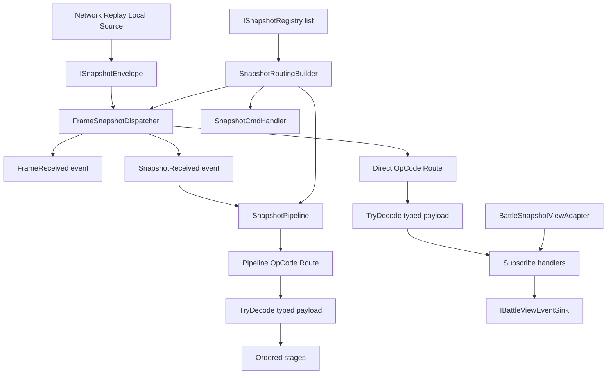
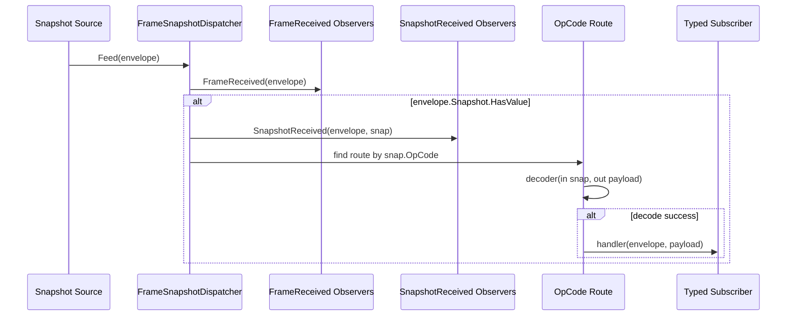
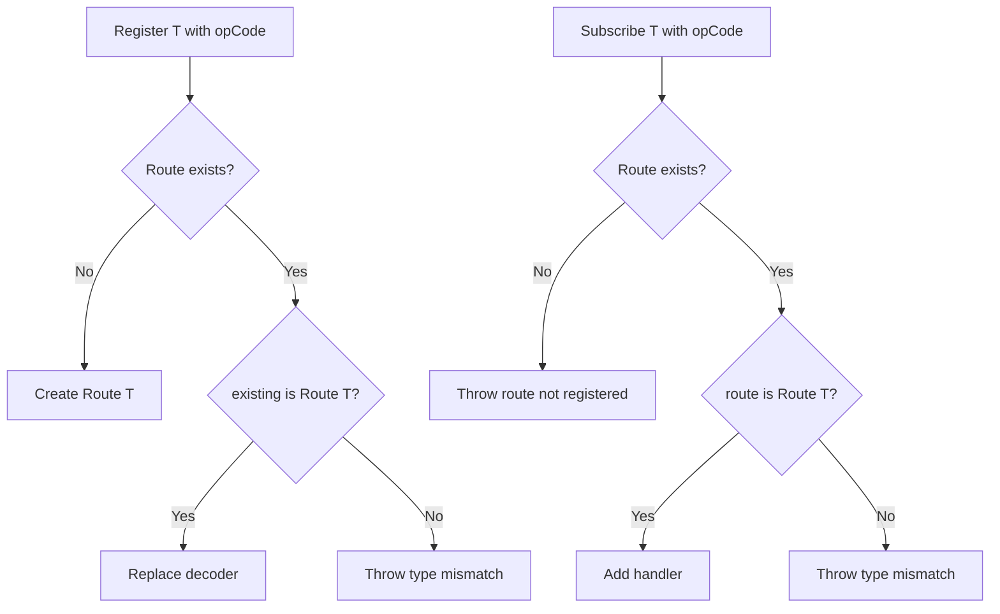
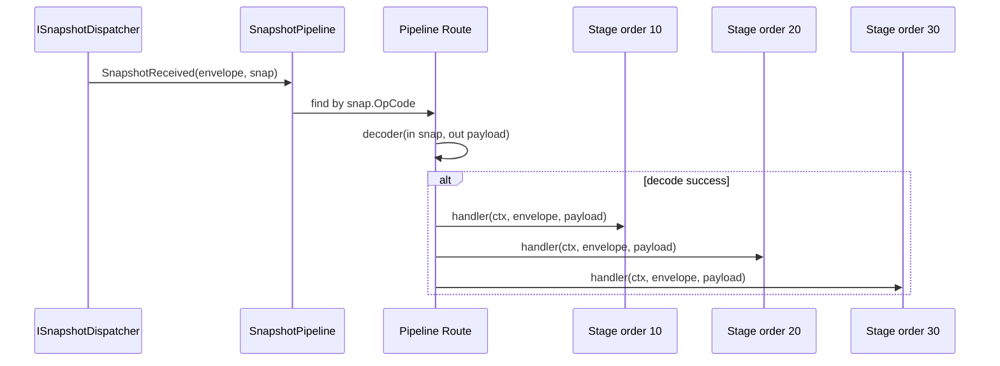
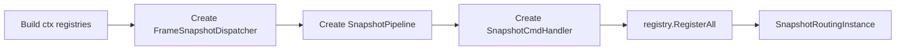
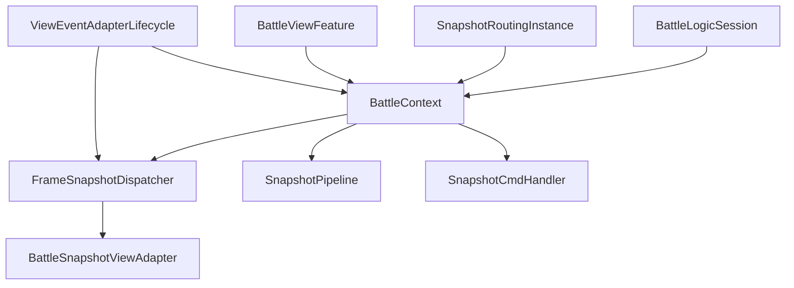
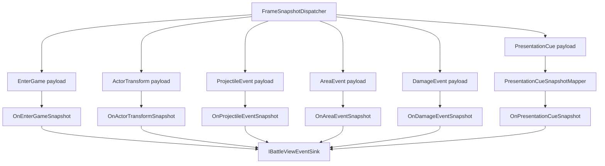
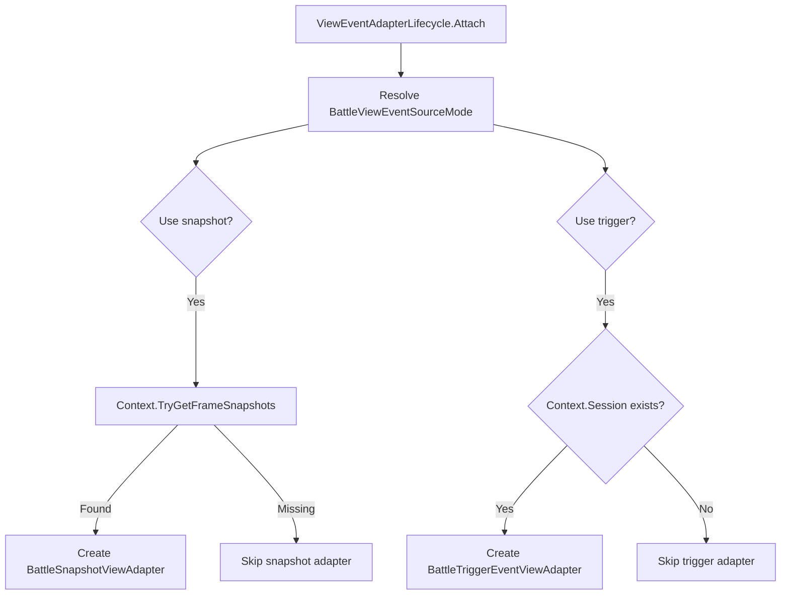
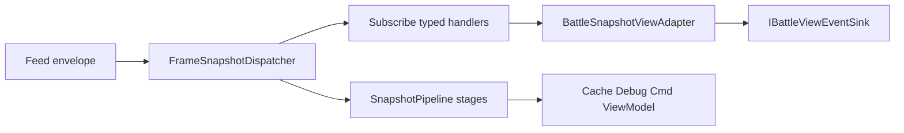

# 4.2 快照分发：FrameSnapshotDispatcher、SnapshotPipeline 与 OpCode 路由

> 本文基于 `Unity/Packages/com.abilitykit.world.snapshot/Runtime/SnapshotRouting` 与 MOBA View Runtime 源码重写。当前实现里，快照分发器不负责“采集世界快照”，也不直接知道网络连接、Unity 对象或 Console 渲染；它只做一件事：接收 `ISnapshotEnvelope`，按 `WorldStateSnapshot.OpCode` 解码并路由给订阅者或有序管线。

---

## 4.2.1 这一层解决什么问题

逻辑世界每帧可能产生很多种表现相关数据：进房结果、角色位置、投射物事件、范围事件、伤害事件、表现 Cue 等。表现层不能直接依赖逻辑系统内部对象，否则会出现几个问题：

1. **传输和表现耦合**：网络包、回放包、本地模拟包都要写一套表现分发逻辑。
2. **事件类型失控**：所有快照都用一个大结构传递，表现侧需要到处判断字段是否为空。
3. **处理顺序不清晰**：同一个快照既要更新缓存，又要驱动表现，又要触发调试统计时，调用顺序容易变成隐式约定。
4. **平台难复用**：Unity、Console、ET、Server 观察者需要不同表现实现，但它们可以共享“按 OpCode 分流”的基础设施。

当前源码把这件事拆成三层：

| 层级 | 源码入口 | 职责 |
| --- | --- | --- |
| 原始帧入口 | `FrameSnapshotDispatcher` | 接收 `ISnapshotEnvelope`，触发帧级事件，按 `OpCode` 解码并直接通知订阅者 |
| 有序处理管线 | `SnapshotPipeline` | 监听 `SnapshotReceived`，按 `order` 执行多个阶段处理器 |
| 装配入口 | `SnapshotRoutingBuilder` | 创建 dispatcher、pipeline、cmd handler，并让 registry 批量注册解码器和处理器 |
| MOBA 表现订阅 | `BattleSnapshotViewAdapter` | 把 MOBA OpCode 映射到 `IBattleViewEventSink` 的强类型方法 |
| BattleContext 绑定 | `BattleContext.Snapshot.cs` | 保存当前战斗上下文里的 snapshot routing 实例，供 View Feature 读取 |

---

## 4.2.2 核心对象关系



这个图里最重要的边界是：`FrameSnapshotDispatcher` 不主动从世界收集数据，只接受外部输入的 `ISnapshotEnvelope`。采集、传输、重放、录制都在它的外侧；路由、解码、订阅在它的内侧。

---

## 4.2.3 FrameSnapshotDispatcher 的真实职责

源码入口：

- `FrameSnapshotDispatcher.cs`
- `ISnapshotDispatcher`
- `ISnapshotDecoderRegistry`

核心类型签名如下：

```csharp
public sealed class FrameSnapshotDispatcher : IDisposable, ISnapshotDecoderRegistry, ISnapshotDispatcher
{
    private readonly Dictionary<int, IRoute> _routes = new Dictionary<int, IRoute>();

    public event Action<ISnapshotEnvelope> FrameReceived;
    public event Action<ISnapshotEnvelope, WorldStateSnapshot> SnapshotReceived;

    public delegate bool TryDecode<T>(in WorldStateSnapshot snap, out T value);
}
```

它暴露三个关键动作：

| 方法/事件 | 作用 | 设计含义 |
| --- | --- | --- |
| `Register<T>(int opCode, TryDecode<T> decoder)` | 为某个 `OpCode` 注册解码器 | `OpCode` 和 payload 类型必须一一对应 |
| `Subscribe<T>(int opCode, Action<ISnapshotEnvelope, T> handler)` | 订阅某类快照 | 返回 `IDisposable`，调用方负责生命周期释放 |
| `Feed(ISnapshotEnvelope envelope)` | 输入一帧快照信封 | 外部推送模型，分发器不关心快照来源 |
| `FrameReceived` | 收到任意 envelope 时触发 | 适合统计、录制、调试、原始帧观察 |
| `SnapshotReceived` | envelope 内有 `WorldStateSnapshot` 时触发 | `SnapshotPipeline` 依赖这个事件继续执行有序阶段 |

分发器边界不包含快照采集和统一订阅者接口。以下接口形态不属于当前模型：

```csharp
public interface IFrameSnapshotDispatcher
{
    void CollectSnapshot(int frame, IWorld world);
    void Dispatch();
    void Subscribe(ISnapshotSubscriber subscriber);
    void Unsubscribe(ISnapshotSubscriber subscriber);
}
```

当前模型通过外部 `Feed` 输入和按 `OpCode` 路由的 typed subscriber 完成分发：



这个设计让分发器可以同时服务网络客户端、回放系统、本地 Demo、测试驱动和 Unity 表现层。

---

## 4.2.4 OpCode 路由和类型保护

`FrameSnapshotDispatcher.Register<T>` 的关键约束是：同一个 `OpCode` 只能绑定一种 payload 类型。如果已经注册过 `Route<T>`，再次注册同类型会替换 decoder；如果类型不同，会直接抛出异常。

```csharp
public void Register<T>(int opCode, TryDecode<T> decoder)
{
    if (decoder == null) throw new ArgumentNullException(nameof(decoder));

    if (_routes.TryGetValue(opCode, out var existing))
    {
        if (existing is Route<T> typed)
        {
            typed.Decoder = decoder;
            return;
        }

        throw new InvalidOperationException(
            $"Snapshot route type mismatch: opCode={opCode} existing={existing.PayloadType.FullName} new={typeof(T).FullName}");
    }

    _routes[opCode] = new Route<T>(decoder);
}
```

`Subscribe<T>` 也做同样的类型检查。订阅方声明的 `T` 必须和注册时一致，否则会抛出 `Snapshot route type mismatch`。这比“所有订阅者收到一个 object 自己强转”更早暴露配置错误。



这种防御服务于多人项目的协议演进：协议层新增一个 `OpCode` 后，如果表现层用错 payload 类型，会在注册或订阅时失败，而不是在战斗中随机出现空表现或强转异常。

---

## 4.2.5 Route 内部如何派发

`Route<T>` 内部保存一个 decoder 和多个 handler。派发时先解码 `WorldStateSnapshot`，解码失败就停止；成功后把 payload 交给当前 handler 列表。

```csharp
public void Dispatch(ISnapshotEnvelope envelope, in WorldStateSnapshot snap)
{
    if (Decoder == null) return;
    if (!Decoder(in snap, out var payload)) return;

    for (int i = 0; i < _handlers.Count; i++)
    {
        _handlers[i]?.Invoke(envelope, payload);
    }
}
```

这里有两个容易忽略的设计点：

| 设计点 | 影响 |
| --- | --- |
| decoder 返回 `bool` | 解码失败不会继续污染表现层，调用方可以把兼容性判断放在 decoder 里 |
| handler 接收 `ISnapshotEnvelope` 和 payload | 表现层既能使用强类型数据，也能读取帧号、序号、世界标识等 envelope 元信息 |

---

## 4.2.6 SnapshotPipeline：为什么还需要有序管线

`FrameSnapshotDispatcher.Subscribe<T>` 适合“一类快照直接转给一个消费者”。但有些场景需要多个阶段按固定顺序执行，例如：

1. 先写入本地缓存。
2. 再更新实体或 ViewModel。
3. 再触发表现特效。
4. 最后记录调试统计。

这就是 `SnapshotPipeline` 的职责。它同样实现 `ISnapshotDecoderRegistry`，并通过 `AddStage<T>` 注册有序处理器。

```csharp
public sealed class SnapshotPipeline : IDisposable, ISnapshotDecoderRegistry, ISnapshotPipelineStageRegistry
{
    private readonly object _ctx;
    private readonly ISnapshotDispatcher _dispatcher;
    private readonly Dictionary<int, IRoute> _routes = new Dictionary<int, IRoute>();
}
```

它在构造时订阅 dispatcher 的 `SnapshotReceived`，因此不需要外部再手动 `Feed` 它：



`AddStage<T>` 的真实签名：

```csharp
public IDisposable AddStage<T>(int opCode, int order, Action<object, ISnapshotEnvelope, T> handler)
```

和直接订阅相比，它多了两个东西：

| 参数 | 作用 |
| --- | --- |
| `order` | 控制同一个 `OpCode` 下多个阶段的执行顺序 |
| `ctx` | 构造 `SnapshotPipeline` 时传入，所有 stage 共享的上下文对象 |

`Route<T>.Add` 会按 `Order` 插入 stage：

```csharp
public void Add(Stage<T> stage)
{
    int idx = _stages.Count;
    for (int i = 0; i < _stages.Count; i++)
    {
        if (stage.Order < _stages[i].Order)
        {
            idx = i;
            break;
        }
    }
    _stages.Insert(idx, stage);
}
```

因此 `SnapshotPipeline` 适合做“可组合的快照处理链”，而不是替代 `FrameSnapshotDispatcher`。二者的关系是：dispatcher 是快照入口和直接广播，pipeline 是挂在 `SnapshotReceived` 后面的有序处理器。

---

## 4.2.7 SnapshotRoutingBuilder：统一装配入口

`SnapshotRoutingBuilder` 是快照路由对象的工厂。最常见的构造流程是：

```csharp
public static SnapshotRoutingInstance Build(object ctx, IEnumerable<ISnapshotRegistry> registries)
{
    var snapshots = new FrameSnapshotDispatcher();
    var pipeline = new SnapshotPipeline(ctx, snapshots);
    var cmdHandler = new SnapshotCmdHandler(ctx, snapshots);

    if (registries != null)
    {
        foreach (var reg in registries)
        {
            if (reg == null) continue;
            reg.RegisterAll(snapshots, pipeline, pipeline, cmdHandler);
        }
    }

    return new SnapshotRoutingInstance(snapshots, pipeline, cmdHandler);
}
```

构建过程可以拆成四步：



`RegisterAll` 同时拿到多个注册口：

| 注册口 | 用途 |
| --- | --- |
| `ISnapshotDecoderRegistry` for dispatcher | 注册直接订阅所需 decoder |
| `ISnapshotDecoderRegistry` for pipeline | 注册 pipeline stage 所需 decoder |
| `ISnapshotPipelineStageRegistry` | 注册有序 stage |
| `ISnapshotCmdRegistry` | 注册快照命令处理器 |

`SnapshotRoutingBuilder` 也支持外部传入 `ISnapshotDispatcher`：

```csharp
public static SnapshotRoutingInstance Build(object ctx, ISnapshotDispatcher externalDispatcher, IEnumerable<ISnapshotRegistry> registries)
```

这让 Server、客户端、测试或回放系统可以复用同一套 pipeline 和 registry，同时替换快照入口。

---

## 4.2.8 BattleContext 如何持有快照路由

在 MOBA View Runtime 中，`BattleContext` 负责保存当前战斗的 snapshot routing 实例：

```csharp
internal void BindSnapshotRouting(
    FrameSnapshotDispatcher snapshots,
    SnapshotPipeline pipeline,
    SnapshotCmdHandler cmdHandler)
{
    _frameSnapshots = snapshots;
    _snapshotPipeline = pipeline;
    _cmdHandler = cmdHandler;
}

internal bool TryGetFrameSnapshots(out FrameSnapshotDispatcher snapshots)
{
    snapshots = _frameSnapshots;
    return snapshots != null;
}
```

表现层不会自己 new 一个 dispatcher，而是从 `BattleContext` 取已经绑定好的路由对象。这保证同一场战斗只有一套快照入口，避免多个表现模块分别消费不同来源的数据。



---

## 4.2.9 BattleSnapshotViewAdapter：表现层订阅示例

`BattleSnapshotViewAdapter` 是快照分发在 Unity MOBA 表现层里的具体消费者。它不解码二进制协议，也不直接操作 GameObject；它只把已解码的 MOBA payload 转成 `IBattleViewEventSink` 方法调用。

```csharp
public sealed class BattleSnapshotViewAdapter : IDisposable
{
    private readonly FrameSnapshotDispatcher _snapshots;
    private readonly IBattleViewEventSink _sink;
    private readonly BattleSubscriptionGroup _subscriptions = new BattleSubscriptionGroup(6);
}
```

订阅关系如下：

```csharp
_subscriptions.Add(_snapshots.Subscribe<EnterMobaGameRes>(
    MobaOpCodes.Snapshot.EnterGame,
    _sink.OnEnterGameSnapshot));

_subscriptions.Add(_snapshots.Subscribe<MobaActorTransformSnapshotEntry[]>(
    MobaOpCodes.Snapshot.ActorTransform,
    _sink.OnActorTransformSnapshot));

_subscriptions.Add(_snapshots.Subscribe<MobaProjectileEventSnapshotEntry[]>(
    MobaOpCodes.Snapshot.ProjectileEvent,
    _sink.OnProjectileEventSnapshot));

_subscriptions.Add(_snapshots.Subscribe<MobaAreaEventSnapshotEntry[]>(
    MobaOpCodes.Snapshot.AreaEvent,
    _sink.OnAreaEventSnapshot));

_subscriptions.Add(_snapshots.Subscribe<MobaDamageEventSnapshotEntry[]>(
    MobaOpCodes.Snapshot.DamageEvent,
    _sink.OnDamageEventSnapshot));
```

`PresentationCue` 多一个映射步骤，因为协议层 entry 和表现层使用的 `PresentationCueData` 不是同一个结构：

```csharp
private void OnPresentationCueSnapshot(ISnapshotEnvelope packet, MobaPresentationCueSnapshotEntry[] entries)
{
    _sink.OnPresentationCueSnapshot(packet, PresentationCueSnapshotMapper.Map(entries));
}
```

这体现了表现层 Adapter 的边界：协议 payload 可以在这里被整理成表现友好的数据，但后续 GameObject、VFX、飘字、区域表现由 `IBattleViewEventSink` 和 handler 继续处理。



---

## 4.2.10 ViewEventAdapterLifecycle 如何接入快照

表现层是否使用快照事件，不由 `BattleSnapshotViewAdapter` 自己决定，而是由 `ViewEventAdapterLifecycle` 根据 `BattleViewEventSourceMode` 决定：

```csharp
if (_modePolicy.ShouldUseSnapshotAdapter(mode)
    && runtime.Context != null
    && runtime.Context.TryGetFrameSnapshots(out var snapshots))
{
    runtime.SnapshotAdapter = _adapters.CreateSnapshot(snapshots, runtime.EventSink);
}
```

策略如下：

| 模式 | 使用快照 Adapter | 使用触发事件 Adapter | 适用场景 |
| --- | --- | --- | --- |
| `SnapshotOnly` | 是 | 否 | 网络客户端、回放、只信任同步快照的表现层 |
| `TriggerOnly` | 否 | 是 | 本地调试、直接观察逻辑事件的开发场景 |
| `Hybrid` | 是 | 是 | 需要快照校准，同时保留本地触发事件即时反馈的场景 |



这个接入点说明：快照分发层是表现输入之一，不是表现层的全部。它和触发事件桥接共同构成表现事件来源。

---

## 4.2.11 设计意图总结

### 1. 分发器只负责路由，不负责生产

`Feed(ISnapshotEnvelope)` 的外部推送模型让 `FrameSnapshotDispatcher` 可以接收来自网络、回放、本地测试或其他系统的快照。它不依赖 `IWorld`，因此不会把逻辑世界生命周期绑进表现分发。

### 2. OpCode 和类型绑定，提前暴露错误

`Register<T>` 与 `Subscribe<T>` 都检查 route 类型。新增协议时，如果 `MobaOpCodes.Snapshot.DamageEvent` 被错误订阅成 `MobaAreaEventSnapshotEntry[]`，系统会在订阅阶段失败。

### 3. 直接订阅和有序管线分离

直接订阅适合 Adapter 这种“把某个快照转给 sink”的场景；`SnapshotPipeline` 适合多个 stage 共享同一上下文并按顺序执行。

### 4. registry 负责批量装配

`SnapshotRoutingBuilder` 不硬编码具体 MOBA OpCode。具体协议、decoder、stage、cmd handler 由 `ISnapshotRegistry` 提供。这让通用 snapshot 包可以服务多个游戏 Demo。

### 5. 表现层通过 Adapter 消费强类型 payload

`BattleSnapshotViewAdapter` 把快照系统和表现系统隔开。`FrameSnapshotDispatcher` 不知道 `IBattleViewEventSink` 的内部 handler，`BattleViewEventSink` 也不需要理解 route 字典和 decoder 细节。

---

## 4.2.12 源码阅读路径

1. `FrameSnapshotDispatcher.cs`：`Feed -> FrameReceived -> SnapshotReceived -> Route.Dispatch`。
2. `SnapshotPipeline.cs`：订阅 `SnapshotReceived` 的方式，以及 `order` 如何控制 stage 顺序。
3. `SnapshotRoutingBuilder.cs`：dispatcher、pipeline、cmd handler 和 registry 如何一起装配。
4. `BattleContext.Snapshot.cs`：战斗上下文如何保存这套路由对象。
5. `BattleSnapshotViewAdapter.cs`：MOBA 表现层如何把 `OpCode` 订阅到 `IBattleViewEventSink`。

---

## 4.2.13 边界判断

| 容易混淆的判断 | 设计边界 |
| --- | --- |
| `FrameSnapshotDispatcher` 会从 `IWorld` 采集快照 | 它只接收 `ISnapshotEnvelope`，采集和传输在外部完成 |
| 每个表现系统都应该直接订阅网络包 | 表现侧应通过 dispatcher/pipeline 或 adapter 消费强类型 payload |
| `SnapshotPipeline` 替代了 dispatcher | pipeline 挂在 dispatcher 的 `SnapshotReceived` 后面，是有序 stage 层 |
| 一个 `OpCode` 可以在不同地方解释成不同类型 | 当前实现会抛出 type mismatch，要求 `OpCode -> payload type` 稳定 |
| 订阅后不用释放 | `Subscribe` 和 `AddStage` 都返回 `IDisposable`，Feature detach 或 adapter dispose 时应释放 |
| `BattleSnapshotViewAdapter` 是通用快照系统的一部分 | 它是 MOBA View Runtime 的表现适配器，通用层只到 `FrameSnapshotDispatcher` / `SnapshotPipeline` |

---

## 4.2.14 最小心智模型

可以把当前快照分发理解成一句话：

> 外部把 `ISnapshotEnvelope` 喂给 `FrameSnapshotDispatcher`；dispatcher 触发帧级事件并按 `OpCode` 解码；直接订阅者立即收到强类型 payload；`SnapshotPipeline` 监听同一份 `SnapshotReceived` 并按 `order` 执行阶段；MOBA 表现层通过 `BattleSnapshotViewAdapter` 把这些 payload 转给 `IBattleViewEventSink`。



掌握这个模型后，再去看跨平台表现层，就能区分哪些代码属于“快照路由基础设施”，哪些代码属于“某个平台的表现实现”。
