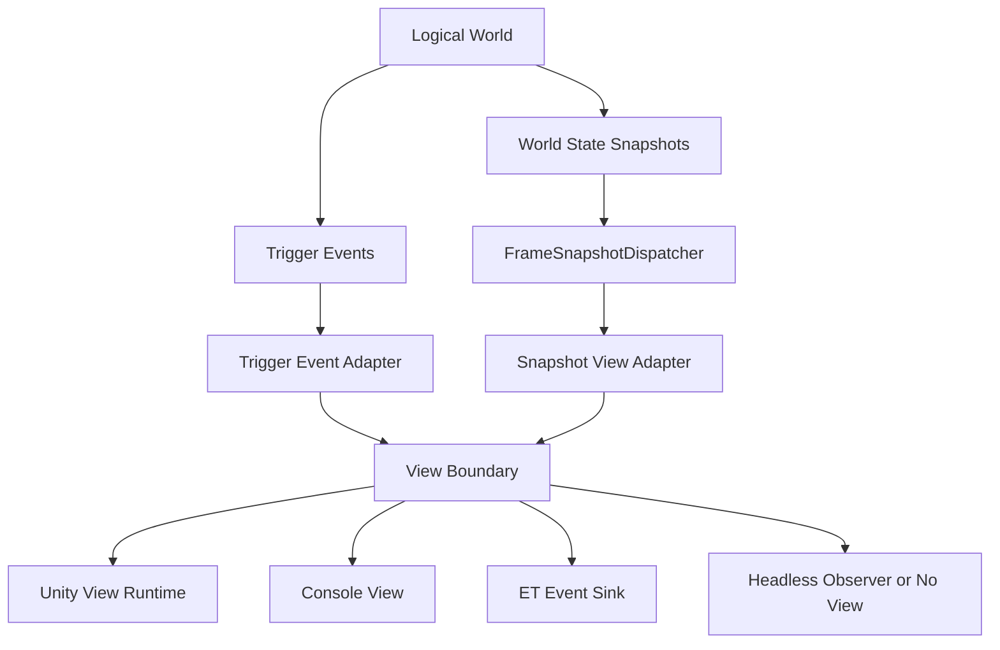
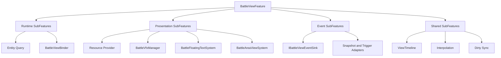
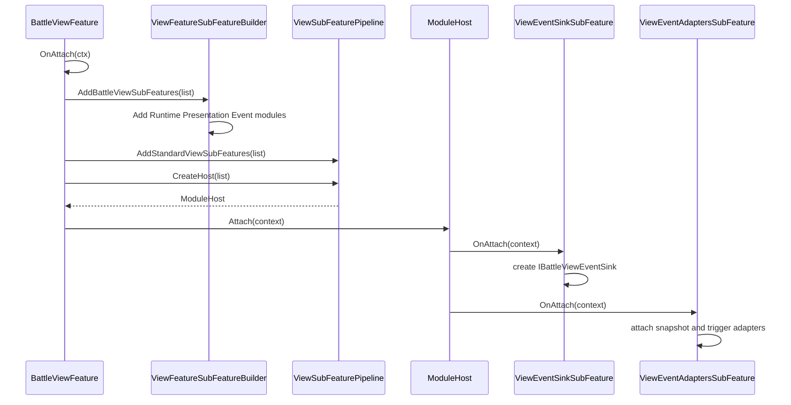
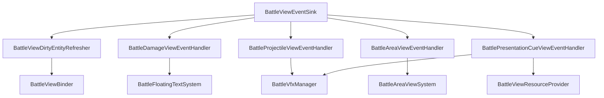
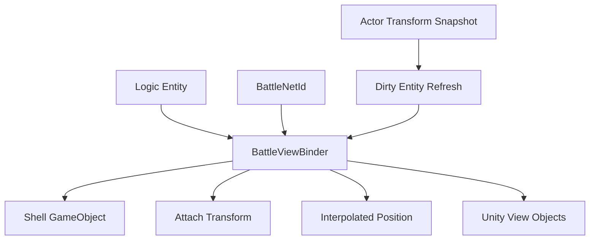
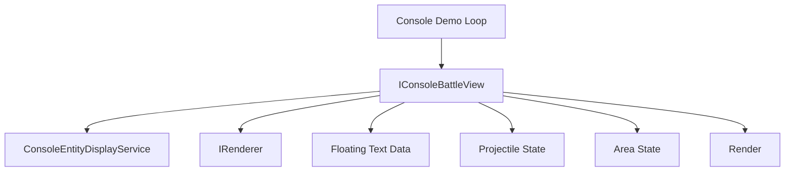
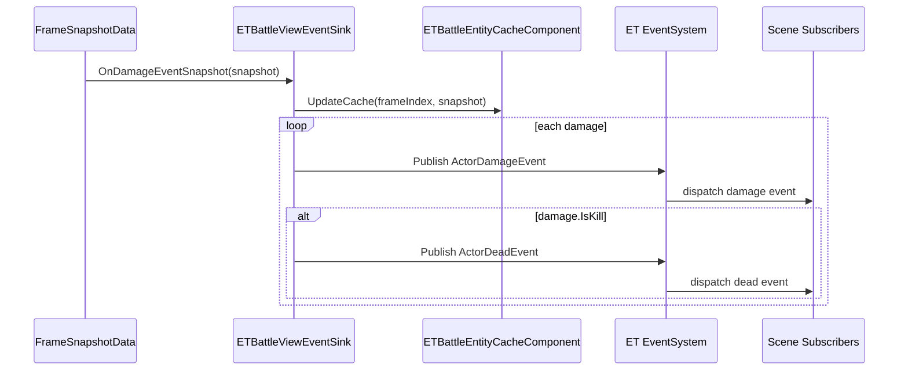
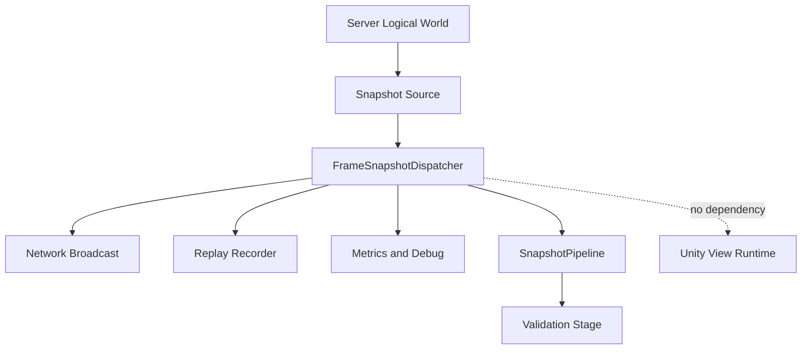
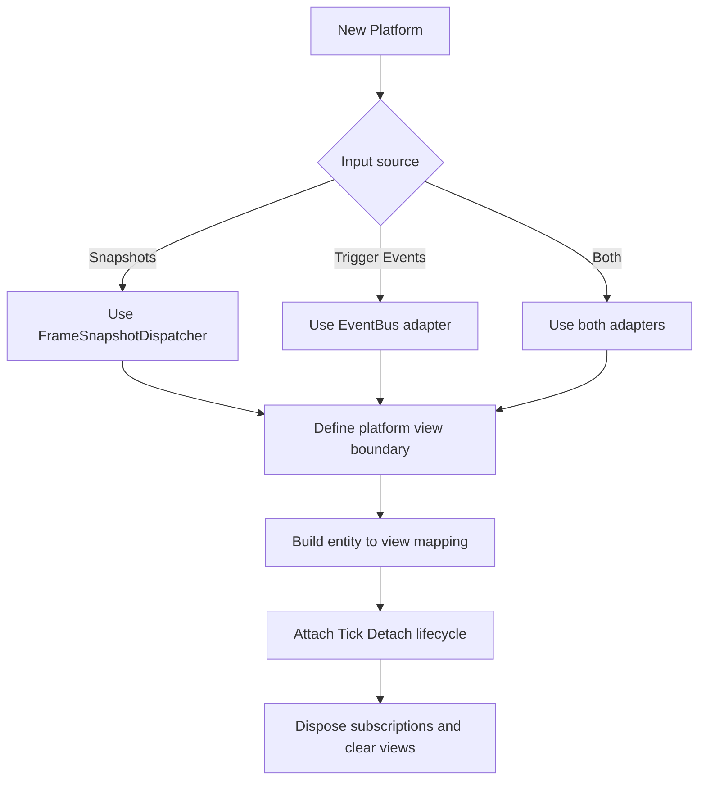
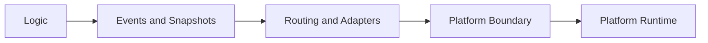

# 4.3 跨平台实现：Unity、Console、ET 与无表现运行时的适配边界

> 本文基于当前源码重写。AbilityKit 的表现层不是一个所有平台都必须实现的统一大接口，而是围绕“逻辑世界输出稳定数据、快照/触发事件负责传递、各平台在边界处适配表现对象”这一原则组织。Unity、Console、ET 和 Server/Headless 的代码形态不同，但它们共享同一个核心目标：不要让逻辑世界依赖具体渲染框架。

---

## 4.3.1 跨平台表现层要解决什么

同一套战斗逻辑通常要跑在多个环境里：

| 环境 | 需要表现吗 | 主要用途 | 典型约束 |
| --- | --- | --- | --- |
| Unity Client | 需要完整表现 | 玩家可见的 GameObject、VFX、UI、插值、飘字 | 对象生命周期复杂，需和 Unity 主线程/资源系统配合 |
| Console Demo | 需要轻量表现 | 本地演示、调试、文本/终端渲染 | 不依赖 Unity，不应引入 GameObject 概念 |
| ET Demo | 需要桥接表现事件 | 接入 ET 框架事件系统和实体缓存 | 事件发布模型不同，历史接口形态和 Unity 新接口不完全一致 |
| Server/Headless | 通常不需要表现 | 权威逻辑、同步、回放、压测 | 不能依赖客户端资源和渲染 API |

跨平台设计的关键不是把所有平台强行塞进同一个实现类，而是保持边界清楚：



这个结构让平台差异集中在“View Boundary”之后：逻辑世界和快照路由不需要知道最终是 Unity 预制体、Console 文本、ET 事件，还是服务端统计。

---

## 4.3.2 当前源码里的平台分层

| 层级 | Unity/MOBA 源码 | Console 源码 | ET 源码 | 职责 |
| --- | --- | --- | --- | --- |
| 表现输入边界 | `IBattleViewEventSink` | `IConsoleBattleView` | `ETBattleViewEventSink` | 把逻辑/快照数据转成平台可处理的表现调用 |
| 快照接入 | `BattleSnapshotViewAdapter` | 可由 Demo 驱动层转调 | `FrameSnapshotData` 旧模型 | 消费同步数据 |
| 触发事件接入 | `BattleTriggerEventViewAdapter` | 可由 Demo 逻辑直接转调 | ET 事件发布 | 消费即时逻辑事件 |
| 对象绑定 | `BattleViewBinder` | Console entity display/cache | ET component/cache | 把逻辑实体映射到平台表现对象 |
| 生命周期装配 | `BattleViewFeature` + SubFeature | Console app loop | ET component/system | Attach、Tick、Detach、Dispose |

Unity/MOBA View Runtime 代表当前更完整的表现层架构；ET 示例保留了不同形态的接口和数据结构，适合作为“外部框架如何适配 AbilityKit 数据”的参考，而不是当前 Unity 接口的一比一复制。

---

## 4.3.3 Unity：以 View Feature 组织完整表现运行时

Unity 侧的表现入口是 `BattleViewFeature`：

```csharp
public sealed partial class BattleViewFeature : ViewFeatureRuntimeHostBase, IGamePhaseFeature
{
    private BattleContext _ctx;

    private readonly List<IViewSubFeature<BattleViewFeature>> _subFeatures = new List<IViewSubFeature<BattleViewFeature>>(8);
    private readonly ViewFeatureSubFeatureBuilder _subFeatureBuilder = new ViewFeatureSubFeatureBuilder();
    private readonly ViewSubFeaturePipeline _subFeaturePipeline = new ViewSubFeaturePipeline();
    private ModuleHost<FeatureModuleContext<BattleViewFeature>, IViewSubFeature<BattleViewFeature>> _subFeatureHost;
}
```

它不是简单的“收到事件然后播放特效”的类，而是一个 View Runtime 宿主，内部通过子功能拆分职责：



生命周期入口在 `BattleViewFeature.Lifecycle.cs`：

```csharp
public void OnAttach(in GamePhaseContext ctx)
{
    ctx.Features.TryGet(out _ctx);
    SetRuntimeQuery(_ctx?.EntityQuery);
    BindPresentationSession(ctx);

    EnsureSubFeaturesCreated();
    _subFeatureHost?.Attach(new FeatureModuleContext<BattleViewFeature>(ctx, this));
    OnAllSubFeaturesAttached(ctx);
}
```

它的设计意图是：

1. `BattleViewFeature` 只负责把 View Runtime 挂到游戏阶段。
2. 子功能负责创建具体对象，例如查询器、Binder、VFX 管理器、事件 Sink、Adapter。
3. `ModuleHost` 统一调用子功能的 attach/detach/tick，避免所有表现初始化都堆在一个巨型类里。

---

## 4.3.4 Unity 子功能装配流程

默认子功能由 `ViewFeatureSubFeatureBuilder`、`ViewSubFeatureModuleFactory` 和 `ViewSubFeaturePipeline` 组合出来：

```csharp
public IReadOnlyList<IViewSubFeatureModule<TFeature>> CreateDefaultModules<TFeature>()
    where TFeature : class, IViewFeatureRuntime
{
    return new IViewSubFeatureModule<TFeature>[]
    {
        new ViewRuntimeSubFeatureModule<TFeature>(),
        new ViewPresentationSubFeatureModule<TFeature>(),
        new ViewEventSubFeatureModule<TFeature>(),
    };
}
```

`ViewEventSubFeatureModule` 会加入两个关键子功能：

```csharp
public void AddTo(List<IViewSubFeature<TFeature>> subFeatures)
{
    subFeatures.Add(new ViewEventSinkSubFeature<TFeature>());
    subFeatures.Add(new ViewEventAdaptersSubFeature<TFeature>());
}
```

完整装配流程如下：



这个设计让新平台接入时可以选择复用“事件边界 + 子功能管线”的思想，而不需要复用 Unity 的所有具体类。

---

## 4.3.5 Unity View Event Sink：平台表现的第一道门

`ViewEventSinkFactory` 创建当前 Unity/MOBA 的表现事件 Sink：

```csharp
public IBattleViewEventSink Create(IViewFeatureRuntime runtime)
{
    if (runtime == null) return null;

    return new BattleViewEventSink(
        runtime.Context,
        runtime.Query,
        runtime.Binder,
        runtime.Vfx,
        runtime.VfxNode,
        runtime.FloatingTexts,
        runtime.AreaViews,
        runtime.Resources);
}
```

`BattleViewEventSink` 再把不同事件交给专门 handler：

| 输入 | 处理者 | 典型输出 |
| --- | --- | --- |
| 角色位置/进房快照 | `BattleViewDirtyEntityRefresher` | 刷新实体 View 绑定和表现状态 |
| 伤害事件 | `BattleDamageViewEventHandler` | 飘字、血量表现、伤害反馈 |
| 投射物事件 | `BattleProjectileViewEventHandler` | 子弹生成、命中、过期 VFX |
| 范围事件 | `BattleAreaViewEventHandler` | 范围提示、区域效果 |
| Presentation Cue | `BattlePresentationCueViewEventHandler` | 通用表现 Cue、VFX、音效等 |



这里的核心边界是：`IBattleViewEventSink` 是 Unity/MOBA 表现运行时的输入门面，真正的对象查询、VFX、飘字、区域表现由更小的 handler 和 service 完成。

---

## 4.3.6 Unity 对象绑定：BattleViewBinder 的平台职责

Unity 表现和逻辑实体之间需要一个映射层。`BattleViewBinder` 承担这个角色，它知道如何把 ECS 实体、网络 ID、Unity `GameObject`、挂点、插值控制器联系起来。

它暴露的能力包括：

```csharp
public bool TryGetShellGameObject(EC.IEntityId id, out GameObject go)
public bool TryGetInterpolatedPos(EC.IEntityId id, out Vector3 pos)
public bool TryGetAttachRoot(BattleNetId netId, out Transform transform)
public void Sync(EC.IEntity entity)
public void TickInterpolation(BattleContext ctx, float deltaTime)
public void OnDestroyed(EC.IEntityId id)
public void Clear()
public void RebindAll(EC.IECWorld world, BattleContext ctx)
```

它解决的是 Unity 专有问题：

| 问题 | Binder 作用 |
| --- | --- |
| 逻辑实体不是 Unity 对象 | 建立 entity id 到 `GameObject`/handle 的映射 |
| 网络 ID 和本地实体 ID 不同 | 提供 `BattleNetId` 到挂点/表现对象的查询 |
| 快照更新和渲染帧频率不同 | 维护插值位置和延迟参数 |
| 实体销毁后 View 需要清理 | 处理 `OnDestroyed`、`Clear`、`RebindAll` |



这也是跨平台最容易误解的点：`BattleViewBinder` 不是通用逻辑层的一部分，它是 Unity View Runtime 的平台绑定层。Console 或 ET 可以实现自己的实体显示缓存，不应该强行引入 Unity Binder。

---

## 4.3.7 Console：轻量表现，不实现 Unity Sink

Console Demo 使用的是自己的接口 `IConsoleBattleView`：

```csharp
public interface IConsoleBattleView : IDisposable
{
    void OnGameStart(int playerCount);
    void UpdateActorPosition(int actorId, float x, float y, float z);
    void ShowFloatingText(int targetActorId, string text, bool isHeal);
    void ShowProjectileSpawn(int projectileId, int templateId, float x, float y, float z);
    void ShowProjectileHit(int templateId, float x, float y, float z);
    void ShowProjectileExpire(int projectileId);
    void ShowAreaEffectStart(int areaId, int templateId, float centerX, float centerZ, float radius);
    void ShowAreaEffectEnd(int areaId);
    void ShowBuffApply(int targetId, int buffId, int casterId);
    void ShowBuffRemove(int targetId, int buffId);
    void RegisterEntity(int actorId, string name, string type, float hp, float maxHp, float x, float y, float z);
    void UpdateEntityHp(int actorId, float hp, float maxHp);
    void Tick(float deltaTime);
    void Render();

    ConsoleEntityDisplayService EntityDisplay { get; }
}
```

它没有实现 Unity/MOBA 的 `IBattleViewEventSink`，这是合理的。Console 的目标是展示战斗状态和关键事件，而不是复刻 Unity 表现运行时。

Console 侧心智模型：



它的优势是依赖极少，适合做：

| 用途 | 原因 |
| --- | --- |
| 快速验证逻辑流程 | 不需要启动 Unity 场景 |
| 调试实体状态 | `RegisterEntity`、`UpdateEntityHp`、`UpdateActorPosition` 足够直观 |
| 演示投射物/范围/飘字 | 用轻量状态和终端渲染即可表达 |
| 自动化或手工 smoke test | 没有客户端资源加载成本 |

跨平台设计在这里体现为：Console 可以消费同样的逻辑输出，但用自己的 View API 表达，不需要继承 Unity 的对象模型。

---

## 4.3.8 ET：把快照转成 ET 事件系统

ET 示例里的 `ETBattleViewEventSink` 展示了另一种适配方式：它接收快照数据后，更新 ET 组件缓存，并通过 ET 的 `EventSystem` 发布事件。

```csharp
public class ETBattleViewEventSink : IBattleViewEventSink
{
    private readonly ETBattleComponent _battleComponent;
    private readonly ETBattleEntityCacheComponent _cacheComponent;
}
```

它使用的参数是 `FrameSnapshotData`，这和当前 Unity/MOBA View Runtime 的 `ISnapshotEnvelope + typed payload` 接口不同。阅读时应把它理解为 ET 接入样例，而不是 Unity sink 的同版本实现。

典型处理流程：

```csharp
public void OnActorTransformSnapshot(in FrameSnapshotData snapshot)
{
    var scene = _battleComponent.Scene();
    if (scene == null)
        return;

    if (_cacheComponent != null)
    {
        _cacheComponent.UpdateCache(snapshot.FrameIndex, snapshot);
    }

    if (snapshot.ActorTransforms != null)
    {
        foreach (var transform in snapshot.ActorTransforms)
        {
            EventSystem.Instance.Publish<Scene, ActorMoveEvent>(
                scene,
                new ActorMoveEvent
                {
                    ActorId = transform.ActorId,
                    X = transform.PositionX,
                    Y = transform.PositionY,
                    Z = transform.PositionZ,
                    Rotation = transform.RotationY
                });
        }
    }
}
```

伤害事件同样会被转成 ET 事件：



ET 适配的设计含义是：AbilityKit 不要求外部框架放弃自己的事件系统。只要在边界处把快照/触发事件翻译成框架原生事件，就能把逻辑层复用到不同运行时。

---

## 4.3.9 Server 和 Headless：不需要表现，但仍可观察快照

服务端或 Headless 环境通常不需要 `BattleViewBinder`、VFX、飘字、Unity 资源，也不应该引用这些模块。它们更常见的需求是：

1. 权威逻辑 Tick。
2. 收集或广播同步快照。
3. 记录回放。
4. 做调试统计。
5. 执行压测或 smoke test。

这种环境可以复用 snapshot routing 的外层能力，例如订阅 `FrameReceived` / `SnapshotReceived` 做录制和统计，或通过 `SnapshotPipeline` 添加调试 stage。它不需要创建 Unity 的 `IBattleViewEventSink`。



设计原则是：服务端可以观察和分发快照，但不要把“表现对象”引入服务端生命周期。

---

## 4.3.10 平台差异对照

| 维度 | Unity/MOBA | Console | ET | Server/Headless |
| --- | --- | --- | --- | --- |
| 主要入口 | `BattleViewFeature` | `ConsoleBattleView` | `ETBattleViewEventSink` | Host/World/Snapshot pipeline |
| 表现边界 | `IBattleViewEventSink` | `IConsoleBattleView` | `IBattleViewEventSink` 旧形态 + ET events | 无 View Sink 或 Observer |
| 对象模型 | GameObject、Transform、VFX、UI | 文本/终端状态 | ET Scene/Component/EventSystem | 无表现对象 |
| 快照模型 | `ISnapshotEnvelope` + typed payload | Demo 驱动转调 | `FrameSnapshotData` | envelope、snapshot、pipeline |
| 生命周期 | GamePhase Feature attach/tick/detach | Console loop tick/render/dispose | ET component/system | Host/world tick/dispose |
| 适配重点 | 资源、插值、对象绑定 | 简洁可视化和调试 | 框架事件桥接 | 权威运行、录制、统计 |

---

## 4.3.11 新平台接入约束

新平台接入表现层时，应先确定输入边界、平台 View Boundary、实体映射和生命周期，不应默认复制 Unity 的完整 `BattleViewFeature`。



落地时可以按四步做：

| 步骤 | 说明 |
| --- | --- |
| 定义输入 | 明确平台消费快照、触发事件，还是二者混合 |
| 定义 View Boundary | 可以是 `IBattleViewEventSink`，也可以像 Console 一样定义平台专用接口 |
| 建立实体映射 | Unity 用 `BattleViewBinder`，其他平台应建立自己的缓存/映射结构 |
| 管理生命周期 | 订阅返回的 `IDisposable` 必须在 detach/dispose 时释放 |

---

## 4.3.12 边界判断

| 容易混淆的判断 | 设计边界 |
| --- | --- |
| 所有平台都必须实现 Unity 的 `IBattleViewEventSink` | 不需要。Console 使用自己的 `IConsoleBattleView`，ET 也有框架适配形态 |
| `BattleViewBinder` 是逻辑世界的一部分 | 不是。它是 Unity View Runtime 的表现对象绑定层 |
| 服务端也应该创建表现 Sink | 服务端通常只需要快照广播、录制、统计或验证，不需要表现对象 |
| ET 和 Unity sink 接口不同说明设计冲突 | 更准确地说，它们代表不同接入阶段/框架适配方式，文档应明确差异而不是强行统一 |
| 跨平台等于完全相同 API | 跨平台的关键是稳定边界和数据语义，而不是所有平台类名和方法完全一致 |
| 表现事件可以直接修改逻辑状态 | 表现层应消费逻辑输出，避免反向污染权威逻辑 |

---

## 4.3.13 最小心智模型

AbilityKit 的跨平台表现层可以用下面一句话理解：

> 逻辑世界只输出事件和快照；通用快照/事件适配层负责把数据送到表现边界；Unity、Console、ET、Server 根据自己的运行时选择不同的 View Boundary 和对象映射方式。



跨平台表现层的核心约束是不要把 Unity 的 `GameObject`、Console 的文本显示、ET 的 `EventSystem` 和服务端快照广播混在同一层。它们都是“表现边界之后”的平台实现，前面的逻辑数据和路由语义才是跨平台复用的核心。
