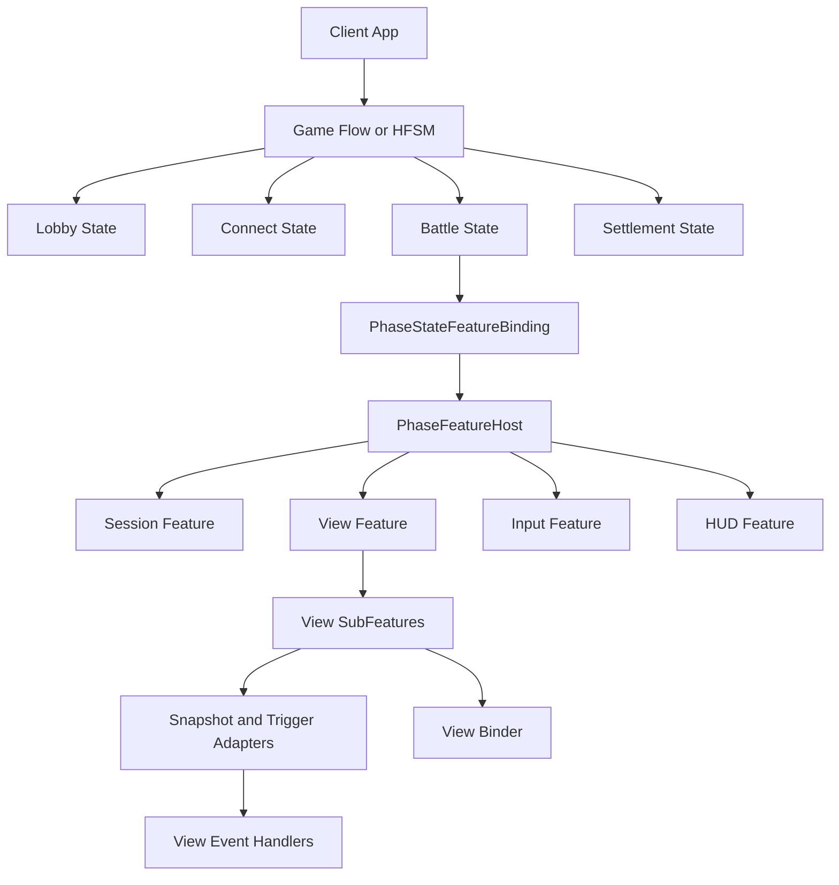
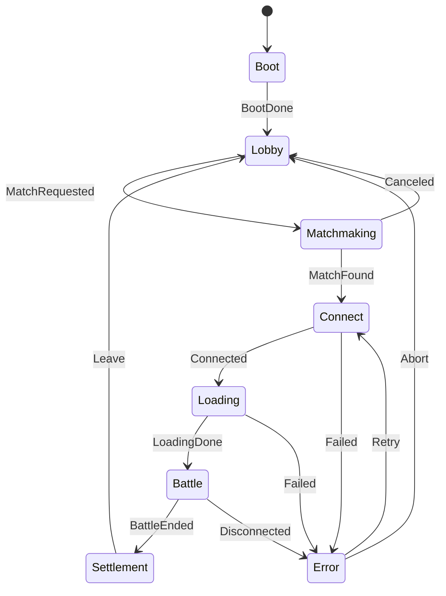
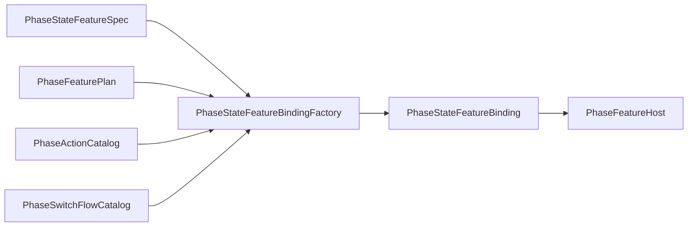
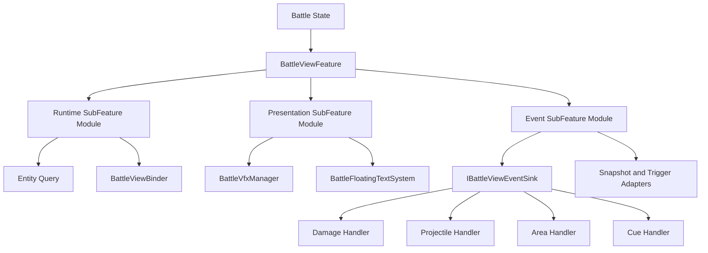
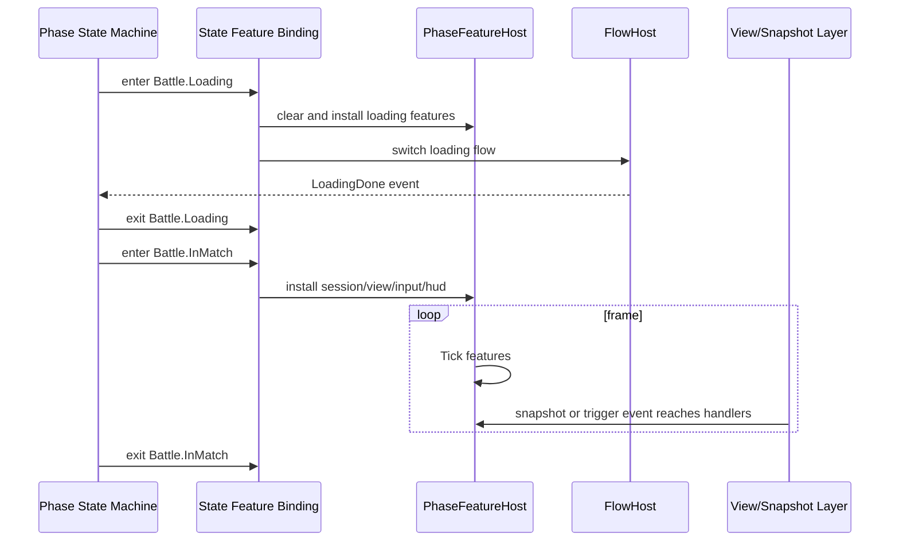

# 4.4 客户端游戏流程与表现层阶段架构

> 现有表现层文档已经覆盖 ViewEvent、Snapshot Dispatch 和 Unity/Console/ET 跨平台适配，但还缺少一篇说明“客户端如何规划游戏流程”的总览。本文把顶层游戏状态、状态内 feature 装配、subfeature/handler 拆分、Flow/HFSM 分工，以及 ET/GameFramework 风格流程管理的取舍放在同一张设计图里，作为 AbilityKit 客户端表现层后续治理规则。

---

## 1. 现有覆盖与缺口

| 已有文档 | 已覆盖 | 仍缺少 |
| --- | --- | --- |
| [01-视图事件抽象](01-ViewEventAbstraction.md) | Trigger/Snapshot 如何进入表现副作用边界 | 不负责游戏处于 Lobby、Connect、Battle、Settlement 等宏观状态 |
| [02-快照分发](02-SnapshotDispatch.md) | OpCode 解码、订阅、有序 SnapshotPipeline | 不决定某个状态应该启用哪些表现/会话功能 |
| [03-跨平台实现](03-CrossPlatform.md) | Unity View Feature、Console、ET、Headless 的适配边界 | 没有把客户端状态机、状态 feature 和跨平台流程放成统一规范 |
| [05-Flow 流程引擎](../05-CommonModules/05-FlowEngine.md) | 可组合流程树、Stage contributor、等待/超时/finally | Flow 是流程节点引擎，不直接表达长期驻留的游戏状态 |
| [06-HFSM 分层状态机](../05-CommonModules/06-HFSMStateMachine.md) | 分层状态、转移、exit time、图编辑 | HFSM 是通用状态机能力，不规定客户端表现层模块怎么挂载 |

结论：需要一层“客户端游戏流程架构”把通用能力组合起来。它不替代 ViewEvent/Snapshot，也不替代 Flow/HFSM，而是规定什么时候使用状态机，什么时候使用 Flow，状态进入后如何挂 feature，feature 内部如何继续拆 subfeature 和 handler。

---

## 2. 分层职责

客户端流程建议分成四层：

| 层级 | 职责 | 典型对象 | 生命周期 |
| --- | --- | --- | --- |
| Game Flow / Phase State Machine | 管理宏观游戏状态和合法转移 | `PhaseStateMachineSpec<TKey,TEvent>`、HFSM `StateMachine`、MOBA `MobaBattleState` | 应用或玩法会话级 |
| State Feature Binding | 定义某个状态进入时安装哪些 feature、执行哪些 enter/exit action、是否清空旧 feature | `PhaseStateFeatureSpec`、`PhaseStateFeatureBinding`、`PhaseStateFeatureBindingFactory` | 状态级 |
| Feature / Module Host | 承载状态内可 Tick、可 Attach/Detach 的功能集合 | `IPhaseFeature<TContext>`、`IPhaseGuiFeature<TContext>`、`PhaseFeatureHost`、MOBA `BattleViewFeature` | 状态驻留期 |
| SubFeature / Handler | 处理某个功能内的资源、事件、表现副作用或平台对象 | View subfeature、`BattleDamageViewEventHandler`、`BattleProjectileViewEventHandler`、`BattleViewBinder` | feature 内部 |

这张图的关键边界是：顶层状态机只回答“现在在哪个状态、能否转移”；状态 feature binding 回答“进入这个状态要装哪些功能”；feature 和 subfeature 回答“这个状态内每帧和事件该做什么”。

---

## 3. 顶层状态机：管理宏观状态

客户端顶层状态不应该散落在 MonoBehaviour bool、网络回调和 UI 按钮里，而应收敛为显式状态机。MOBA 当前已经出现这样的雏形：`MobaBattleAdvanceDecider` 把 Prepare、Connect、CreateOrJoinWorld、LoadAssets、InMatch、End 的推进决策抽成纯逻辑；`BattleWorldScopeHost` 把 per-battle scope 生命周期从流程域里拆出来。

推荐状态模型：

| 状态 | 进入动作 | 驻留功能 | 退出动作 |
| --- | --- | --- | --- |
| Boot | 初始化 SDK、配置、基础服务 | 启动画面、日志、版本检查 | 切到 Lobby 或 Login |
| Lobby | 加载大厅 UI、房间列表、账号信息 | UI、匹配、社交、资源预热 | 清理大厅临时订阅 |
| Matchmaking | 发起匹配或建房 | 网络请求、取消按钮、超时处理 | 停止匹配请求 |
| Connect | 连接 Gateway/Room/Battle | reconnect、握手、首帧等待 | 释放连接阶段临时对象 |
| Loading | 创建/加入 world，加载战斗资源 | loading UI、资源句柄、进度 | 交接资源给 Battle scope |
| Battle | 输入、表现、同步、HUD、诊断 | session、snapshot、view、input、prediction | 停输入、停表现、停同步、写回结算数据 |
| Settlement | 展示结果、上传统计、回大厅 | 结算 UI、replay 保存 | 释放 battle scope |
| Error/Recover | 错误展示、重试或回退 | retry、fallback、report | 根据策略回到 Connect/Lobby |

如果状态层级继续变大，外层可以用 HFSM：例如 App 层是 Boot/Login/Lobby/BattleShell，BattleShell 内部再有 Connect/Loading/InMatch/Settlement。这样全局转移和战斗内转移不会互相污染。

---

## 4. 状态内 feature 绑定

`Game.View.Flow` 中的 `PhaseStateFeatureSpec` 和 `PhaseStateFeatureBindingFactory` 已经提供了状态到 feature 的声明式绑定能力：

| 能力 | 含义 | 适用场景 |
| --- | --- | --- |
| `AddFeature` | 状态进入时按 id 安装 feature | Battle 状态安装 session/view/input/hud |
| `ClearBeforeEnter` | 进入前清空旧 feature host | 从 Loading 切 Battle 时替换功能集合 |
| `AddEnterBeforeAction` | feature 安装前执行动作 | begin scope、播种 bootstrapper、记录埋点 |
| `AddEnterAfterAction` | feature 安装后执行动作 | 首帧补判、打开 UI、启动诊断 |
| `AddExitAction` | 状态退出时执行动作 | end scope、停止网络订阅、写回结算 |
| `AddSwitchFlow` | 状态进入后触发另一个长流程 | connect 完成后启动 loading flow |

推荐把状态声明写成“状态 spec + feature plan + action catalog”三件事：

这样状态配置可以被验证、测试和导出。`PhaseStateMachineValidator` 负责检查状态、起点和转移引用；`PhaseStateFeatureValidator` 可以继续检查 feature/action/switch flow id 是否存在。相比把所有逻辑写在 `OnEnterBattle()`，这种模型更容易做自动化测试和可视化。

---

## 5. Feature、SubFeature、Handler 的拆分规则

状态内不建议只有一个巨型 feature。建议按以下边界拆分：

| 单元 | 应该包含 | 不应该包含 |
| --- | --- | --- |
| Module | 一组 feature 的装配规则或默认组合 | 具体业务事件处理细节 |
| Feature | 状态内可独立 attach/detach/tick 的能力，如 BattleSession、BattleView、BattleInput、BattleHud | 过多平台对象创建细节、每种事件的具体表现逻辑 |
| SubFeature | 某个 feature 内的子能力，如 View runtime、Presentation、Event adapter、Interpolation | 顶层状态转移和跨 feature 协调 |
| Handler | 处理单类输入到单类副作用，如 Damage、Projectile、Area、Cue | 生命周期装配、状态跳转、跨模块 orchestration |

MOBA View Runtime 的 `BattleViewFeature` 是当前最接近的例子：feature 挂到 battle phase；内部通过 view subfeature module 创建 runtime、presentation、event adapter；事件进入 `IBattleViewEventSink` 后再分给 `BattleDamageViewEventHandler`、`BattleProjectileViewEventHandler`、`BattleAreaViewEventHandler` 和 cue handler。

拆分判断标准：如果一个类同时决定状态跳转、创建资源、订阅快照、处理伤害表现、更新 UI，它就跨越了至少三层，应该拆成 state action、feature/subfeature 和 handler。

---

## 6. Flow、HFSM、Phase Binding 的分工

这三类能力容易混用，需要明确边界：

| 能力 | 最适合 | 不适合 |
| --- | --- | --- |
| HFSM / Phase State Machine | 长期驻留状态、合法转移、全局打断、状态层级 | 顺序等待很多异步步骤的细节 |
| Flow | 有开始和结束的过程，如连接、加载、重试、超时、finally 清理 | 表达整个客户端长期状态 |
| Phase Feature Binding | 状态进入/退出时安装功能、执行动作、切换附属 flow | 复杂条件转移和每帧行为逻辑 |
| Feature Host | 调用 attach/detach/tick/gui，保持功能集合顺序 | 判断是否从 Battle 切到 Settlement |
| ViewEvent/Snapshot | 把逻辑输出转成表现输入 | 管理游戏状态和资源生命周期 |

推荐组合方式是：

这个组合让状态机保持干净：它接收事件并转移；Flow 处理短生命周期异步过程；FeatureHost 管状态内功能；Snapshot/ViewEvent 管表现数据输入。

---

## 7. 与 ET、GameFramework 风格的对比

AbilityKit 不需要完整复制 ET 或 GameFramework，但可以吸收它们对流程治理的经验。

| 维度 | ET 常见做法 | GameFramework 常见做法 | AbilityKit 推荐 |
| --- | --- | --- | --- |
| 顶层流程 | Scene/Component/System 和事件驱动，流程常散在组件系统中 | Procedure/Fsm 明确表达启动、登录、大厅、战斗等状态 | 用 Phase/HFSM 显式表达客户端宏观状态 |
| 状态职责 | Component 保存状态，System 响应事件推进 | Procedure.OnEnter/OnUpdate/OnLeave 承载状态逻辑 | 状态只做 feature binding 和 action 调度，重逻辑下沉 feature/flow |
| 功能装配 | 依赖 Entity/Component 生命周期和 EventSystem | 依赖 GameEntry 组件、Procedure 内启停模块 | 用 `PhaseFeatureHost` 管 attach/detach/tick，用 DI scope 管 per-battle 生命周期 |
| 异步流程 | 协程/Task/事件组合，项目约定较多 | Procedure 内部调用资源/网络模块并等待回调 | 长流程用 Flow 节点，支持等待、超时、finally 和诊断 |
| 表现适配 | ETUnit、缓存组件、事件系统桥接 | Unity GameObject/UI 模块强绑定 | ViewEvent/Snapshot 作为平台边界，Unity/Console/ET 各自适配 |
| 可测试性 | 取决于是否把决策抽成纯逻辑 | Procedure 往往依赖 Unity 运行环境 | 推进决策、状态 spec、feature binding 都可纯 C# 测试 |

ET 的价值在于“业务对象和事件系统统一”，GameFramework 的价值在于“Procedure/Fsm 管游戏流程很直观”。AbilityKit 应采用后者的显式流程表达，同时保留自身的纯 C# 测试、跨平台快照边界和 feature 组合能力。

---

## 8. 推荐落地规范

1. 客户端必须有一个显式顶层状态机。禁止把 Lobby/Connect/Battle/Settlement 状态只保存在多个 bool 或 UI 页面显隐里。
2. 状态枚举和状态事件要稳定命名。状态事件来自网络、资源、用户操作、错误恢复时，应先进入 decider 或 condition catalog，再触发状态机。
3. 状态进入只做装配，不直接写大量业务逻辑。业务逻辑进入 feature、subfeature、handler 或 Flow node。
4. 每个长期状态都有 `PhaseStateFeatureSpec`。状态要声明 feature ids、enter before/after actions、exit actions 和 switch flows。
5. Battle 类状态必须有独立 scope。进入 battle 前 begin scope，退出 battle 后 end scope，避免一局资源泄漏到下一局。
6. 状态内 feature 按职责拆分：session、sync、input、view、hud、diagnostics 不要混在同一个类。
7. View feature 内继续拆 subfeature 和 handler。Snapshot/Trigger 事件处理不能反向驱动顶层状态转移，状态推进应走事件/decider。
8. 异步连接、加载、重试、超时、资源预热使用 Flow；不要把这些过程写成状态机内部的大量临时字段。
9. 状态机 spec、feature spec、action/switch flow catalog 必须可验证。新增状态或 feature 时补纯 C# 单元测试。
10. ET/Console/Headless 接入只能替换 View Boundary 或 Feature 实现，不应改变逻辑世界、快照协议和顶层状态语义。

---

## 9. 源码阅读路径

| 主题 | 源码/文档 |
| --- | --- |
| Phase 契约 | `Unity/Packages/com.abilitykit.game.view.runtime/Runtime/Flow/PhaseContracts.cs` |
| 状态机 spec 与校验 | `Unity/Packages/com.abilitykit.game.view.runtime/Runtime/Flow/PhaseStateMachineSpec.cs`、`PhaseStateMachineValidator.cs` |
| 状态 feature 声明 | `Unity/Packages/com.abilitykit.game.view.runtime/Runtime/Flow/PhaseStateFeatureSpec.cs` |
| 状态 feature 绑定 | `Unity/Packages/com.abilitykit.game.view.runtime/Runtime/Flow/PhaseStateFeatureBinding.cs`、`PhaseStateFeatureBindingFactory.cs` |
| feature host | `Unity/Packages/com.abilitykit.game.view.runtime/Runtime/Flow/PhaseFeatureHost.cs` |
| per-battle scope | `Unity/Packages/com.abilitykit.demo.moba.view.runtime/Runtime/Game/App/Flow/Core/BattleWorldScopeHost.cs` |
| battle 推进决策 | `Unity/Packages/com.abilitykit.demo.moba.view.runtime/Runtime/Game/App/Flow/Core/MobaBattleAdvanceDecider.cs` |
| MOBA 联机会话 | `Docs/design/09-ImplementationExamples/MOBA/15-OnlineSessionAndProtocolContract.md` |
| MOBA 快照表现 | `Docs/design/09-ImplementationExamples/MOBA/04-SnapshotPresentationPrediction.md` |
| Shooter 表现会话 | `Docs/design/09-ImplementationExamples/Shooter/10-PresentationSessionAndViewDeepDive.md` |
| ET 宿主 | `Docs/design/09-ImplementationExamples/02-ET Demo Analysis.md` |

---

## 10. 与其他文档的关系

- 本文定义客户端游戏流程规划方法；[01-视图事件抽象](01-ViewEventAbstraction.md) 解释事件进入表现层后的副作用边界。
- 本文把 Snapshot 当作状态内 feature 的输入；[02-快照分发](02-SnapshotDispatch.md) 解释快照 opCode、decoder 和 pipeline。
- 本文给出跨平台流程治理规则；[03-跨平台实现](03-CrossPlatform.md) 解释 Unity、Console、ET、Headless 的具体适配。
- 本文使用 Flow/HFSM 的能力边界；[05-Flow 流程引擎](../05-CommonModules/05-FlowEngine.md) 和 [06-HFSM 分层状态机](../05-CommonModules/06-HFSMStateMachine.md) 是底层机制说明。
- MOBA/Shooter 示例文档应引用本文作为客户端流程治理原则，再在各自专题里说明具体 feature、session 和 view pipeline。
