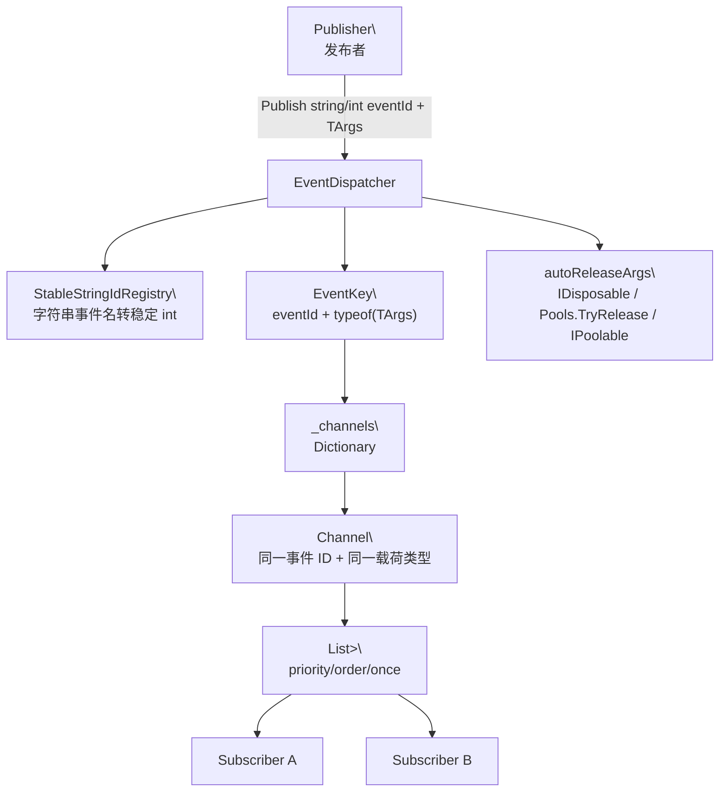
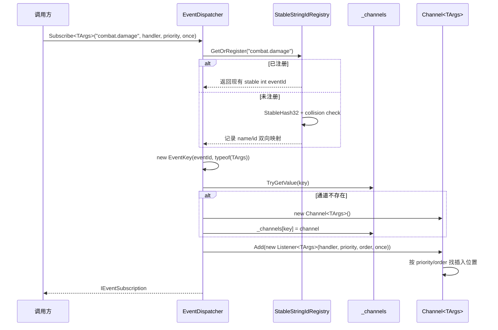
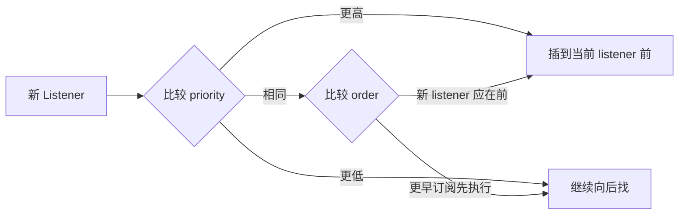
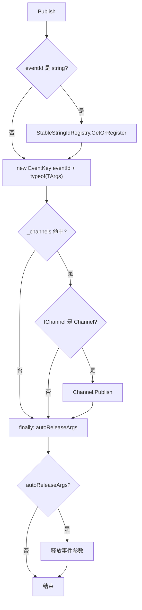
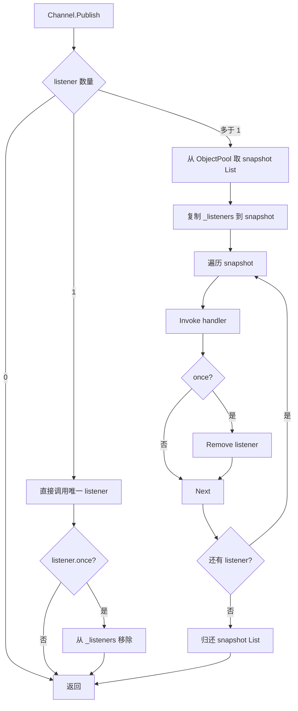
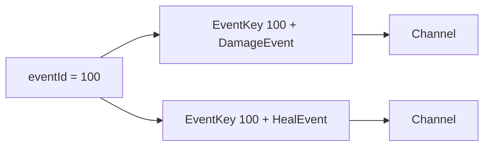
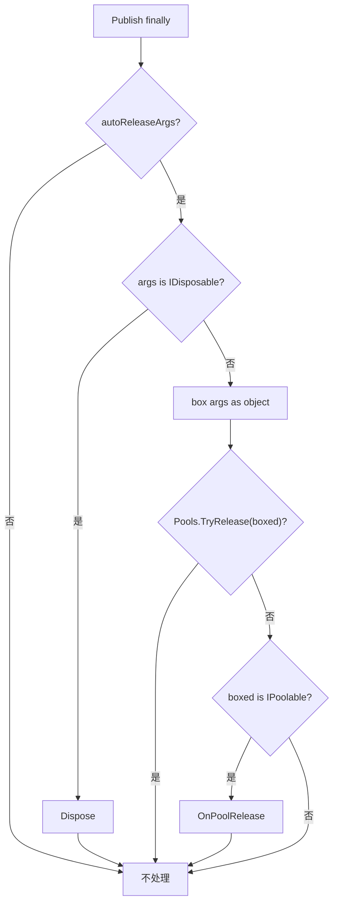
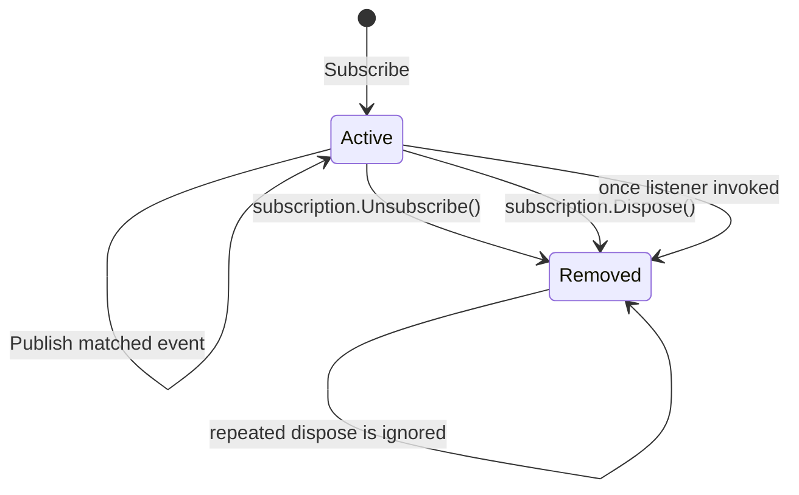

# 5.1 事件系统：EventDispatcher 的发布订阅、优先级与事件载荷回收

> 本文从源码解释 AbilityKit Core 事件系统。它不是一个全局消息总线的概念草图，而是由 `EventDispatcher`、`EventKey`、`Channel<TArgs>`、`IEventSubscription` 和 `StableStringIdRegistry` 组成的轻量运行时通信机制。

---

## 1. 能力定位

事件系统解决的是“模块之间需要通知，但不应该互相持有具体对象”的问题。

它适合：

- 战斗逻辑向表现层发出伤害、治疗、命中、技能释放等通知。
- Triggering、Ability、Combat 等模块之间传递轻量领域事件。
- Demo 或工具层监听框架事件，做日志、表现、录制、调试。
- 发布者不关心监听者数量，监听者可以按生命周期自主退订。

它不负责：

- 跨网络同步。网络同步应走帧同步、快照或状态同步模块。
- 事件持久化。需要回放时应进入 Record/Replay 体系。
- 多线程事件调度。当前实现主要面向单世界 Tick 中的同步派发。

源码入口：

| 源码 | 作用 |
|------|------|
| `Unity/Packages/com.abilitykit.core/Runtime/Event/EventDispatcher.cs` | 事件订阅、派发、监听者管理和事件参数自动释放 |
| `Unity/Packages/com.abilitykit.core/Runtime/Event/EventKey.cs` | 用 `eventId + argsType` 组成事件通道键 |
| `Unity/Packages/com.abilitykit.core/Runtime/Event/IEventSubscription.cs` | 订阅句柄，调用 `Dispose()` 或 `Unsubscribe()` 退订 |
| `Unity/Packages/com.abilitykit.core/Runtime/Generic/StableStringIdRegistry.cs` | 将字符串事件名稳定映射为 int ID，并检测哈希冲突 |
| `Unity/Packages/com.abilitykit.core/Runtime/Pooling/Core/Pools.cs` | 事件参数自动释放和派发快照列表池化依赖 |

---

## 2. 总体结构



核心设计点有三个：

| 设计点 | 说明 |
|--------|------|
| 事件 ID 和载荷类型共同隔离 | 同一个 `eventId` 可以对应不同 `TArgs`，实际通道键是 `EventKey(eventId, typeof(TArgs))` |
| 派发顺序确定 | 监听者按 `priority` 降序，同优先级按订阅顺序执行 |
| 发布后自动回收载荷 | `Publish` 默认 `autoReleaseArgs = true`，减少事件对象泄漏和 GC 压力 |

---

## 3. 订阅流程

`EventDispatcher` 提供字符串和整数两类订阅入口：

```csharp
var subscription = dispatcher.Subscribe<DamageEvent>(
    eventId: "combat.damage",
    handler: OnDamage,
    priority: 100,
    once: false);
```

字符串事件名会先进入 `StableStringIdRegistry.GetOrRegister(string)`，再转成整数事件 ID。这样做的目的不是让字符串在每次派发时到处比较，而是把可读名称稳定压缩成整数。

`StableStringIdRegistry` 的实现很小，但它是事件名稳定性的关键边界：

- `_nameToId` 使用 `StringComparer.Ordinal`，避免不同区域性导致字符串比较结果漂移。
- `StableHash32` 使用固定 offset 和 prime 的 32 位滚动哈希，不依赖 .NET 运行时的随机化字符串哈希。
- `_idToName` 会反查生成后的整数 ID。如果两个不同字符串得到同一个 ID，会立即抛出 hash collision 异常，而不是静默把两个事件合并到同一通道。
- `TryGetId` 只查询已注册名称，不会隐式创建；`GetOrRegister` 才会建立双向映射。



`Channel<TArgs>.Add` 不在发布时排序，而是在订阅时通过 `FindInsertIndex(priority, order)` 插入到正确位置。这意味着常见的 `Publish` 路径不用为排序付费。

排序规则：



---

## 4. 发布流程

发布入口也支持字符串和整数：

```csharp
dispatcher.Publish("combat.damage", damageEvent);
dispatcher.Publish(GameEvents.Damage, damageEvent, autoReleaseArgs: false);
```

真实执行链路：



`EventDispatcher.Publish<TArgs>` 使用 `try/finally`，即使监听者抛异常，事件参数的释放路径仍然会执行。监听者异常在 `Channel<TArgs>.Publish` 内部被捕获并吞掉，避免一个监听者阻断后续监听者。

---

## 5. Channel<TArgs> 的派发策略

源码里 `Channel<TArgs>` 对单监听者和多监听者做了不同处理。



这个设计有几个重要后果：

| 场景 | 行为 |
|------|------|
| 监听者在回调中退订自己 | 多监听者路径遍历的是 snapshot，不会破坏正在遍历的列表；当前回调结束后订阅会被移除 |
| 监听者在回调中退订别人 | 本次派发已经复制到 snapshot 的监听者仍可能继续执行，退订主要影响后续派发 |
| `once = true` | 第一次执行后立即移除；如果多监听者 snapshot 已经生成，移除不会改变当前发布周期 snapshot 的遍历结构 |
| 只有一个监听者 | 不租借 snapshot 列表，走更短路径 |

多监听者 snapshot 列表本身也来自对象池：

```csharp
private static readonly ObjectPool<List<Listener<TArgs>>> _snapshotPool = Pools.GetPool(
    createFunc: () => new List<Listener<TArgs>>(32),
    onRelease: list => list.Clear(),
    defaultCapacity: 32,
    maxSize: 256,
    collectionCheck: false);
```

这说明事件系统和对象池不是孤立模块。事件派发为了遍历稳定性需要临时列表，但通过池化把临时分配控制住。这里的“稳定”指当前发布周期的迭代集合稳定，不表示每次回调前都会重新检查监听者是否仍在 `_listeners`。

---

## 6. EventKey 为什么包含 TArgs 类型

如果事件键只有 `eventId`，下面两段代码会进入同一个通道：

```csharp
dispatcher.Subscribe<DamageEvent>(GameEvents.Combat, OnDamage);
dispatcher.Subscribe<HealEvent>(GameEvents.Combat, OnHeal);
```

AbilityKit 的实现用 `EventKey(eventId, typeof(TArgs))` 隔离通道：



这样可以保留整数 ID 的轻量性，也避免不同事件参数类型误投递。代价是：发布和订阅必须使用完全一致的 `TArgs` 类型，否则会命中另一个通道或根本没有监听者。

---

## 7. 自动释放事件参数

`Publish<TArgs>` 默认 `autoReleaseArgs = true`。发布结束后，释放顺序如下：



这条路径需要明确以下约束：

- 如果事件参数是池化对象，并且由 `Pools.Get` 或某个 `PoolScope.Get` 取出，`Pools.TryRelease` 可以把它归还到对应对象池。
- 如果对象只实现 `IPoolable`，但没有被 `PoolManager` 记录归还句柄，则只会调用 `OnPoolRelease()`，不会进入某个具体池。
- 如果事件参数归属外部生命周期，应显式传 `autoReleaseArgs: false`。

示例：

```csharp
var evt = Pools.Get(() => new DamageEvent());
evt.AttackerId = attackerId;
evt.TargetId = targetId;
evt.Value = damage;

// 发布后默认尝试归还 evt。监听者不要长期持有 evt 引用。
dispatcher.Publish("combat.damage", evt);
```

---

## 8. 订阅句柄与生命周期

订阅返回 `IEventSubscription`。调用 `Unsubscribe()` 或 `Dispose()` 都会退订。



订阅句柄应绑定到拥有者生命周期：

```csharp
private IEventSubscription _damageSubscription;

public void Initialize(EventDispatcher dispatcher)
{
    _damageSubscription = dispatcher.Subscribe<DamageEvent>(
        "combat.damage",
        OnDamage,
        priority: 100);
}

public void Dispose()
{
    _damageSubscription?.Dispose();
    _damageSubscription = null;
}
```

这样可以避免世界销毁、UI 关闭、系统卸载后仍然收到事件。

---

## 9. 使用约束

| 约束 | 原因 |
|------|------|
| 用常量保存事件名或事件 ID | 避免字符串拼写错误导致发布和订阅进入不同通道；字符串名最终会被稳定哈希成 int |
| 事件参数类型保持稳定 | `EventKey` 包含 `typeof(TArgs)`，类型变化会改变通道 |
| 高频事件优先使用池化对象 | 发布后自动释放可以和 `Pools.TryRelease` 联动 |
| 监听者回调保持短小 | 当前派发是同步调用，长耗时会阻塞发布者 |
| 需要跨帧保存事件数据时复制字段 | 默认自动释放后，池化事件对象可能被复用 |
| 模块卸载时释放订阅句柄 | `IEventSubscription` 是生命周期边界 |

---

## 10. 边界判断

### 10.1 以为同一个 eventId 一定是同一类事件

不是。实际通道还包含 `TArgs`。

```csharp
// 这是两个不同通道。
dispatcher.Subscribe<DamageEvent>(100, OnDamage);
dispatcher.Subscribe<HealEvent>(100, OnHeal);
```

### 10.2 在监听者里长期保存事件参数引用

如果发布者使用默认 `autoReleaseArgs = true`，事件参数可能在发布结束后被归还池。监听者需要保存时应复制必要字段。

### 10.3 把 EventDispatcher 当异步队列

当前实现是同步派发：`Publish` 调用栈内直接执行监听者。需要排队、跨帧、网络传输时，应使用对应运行时模块。

### 10.4 以为退订能阻止当前 snapshot 中的后续回调

多监听者路径会先复制 `_listeners` 到 snapshot，再遍历 snapshot。某个监听者在回调中退订另一个监听者时，被退订者如果已经在当前 snapshot 中，仍可能在当前发布周期被调用。需要强制阻止当前发布周期的后续逻辑时，应在事件参数或监听者自身状态里加显式有效性判断。

---

## 11. 源码阅读路径

1. `EventDispatcher.Subscribe<TArgs>`：事件 ID、`EventKey` 和 `Channel<TArgs>` 的关系。
2. `Channel<TArgs>.Add`：优先级和订阅顺序。
3. `Channel<TArgs>.Publish`：单监听者快路径、多监听者 snapshot 和 once 移除。
4. `Publish<TArgs>` 的 `finally`：事件参数为什么会自动释放。
5. [对象池](./02-ObjectPool.md)：`Pools.TryRelease` 和事件系统的关系。

---

## 12. 和其他文档的关系

- [对象池](./02-ObjectPool.md)：解释事件 snapshot 列表和事件参数自动释放背后的池化机制。
- [定时器框架](./03-TimerFramework.md)：解释需要跨时间推进的任务为什么不应塞进同步事件派发。
- [触发器系统](../08-GameplayModules/02-TriggeringSystem.md)：事件可以作为触发来源，但触发计划、条件、动作执行由 Triggering 模块负责。
- [表现层事件抽象](../04-PresentationLayerDesign/01-ViewEventAbstraction.md)：表现层事件是更高层的跨端视图抽象，不等同于 Core 同步事件分发器。

---

*文档版本：v2.1 | 最后更新：2026-07-04*
