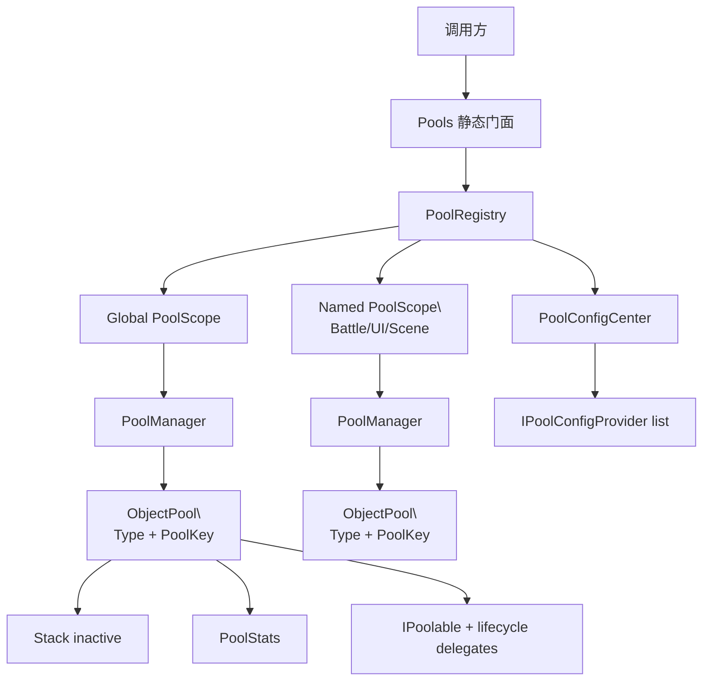
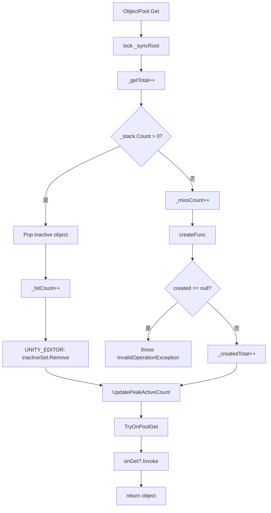
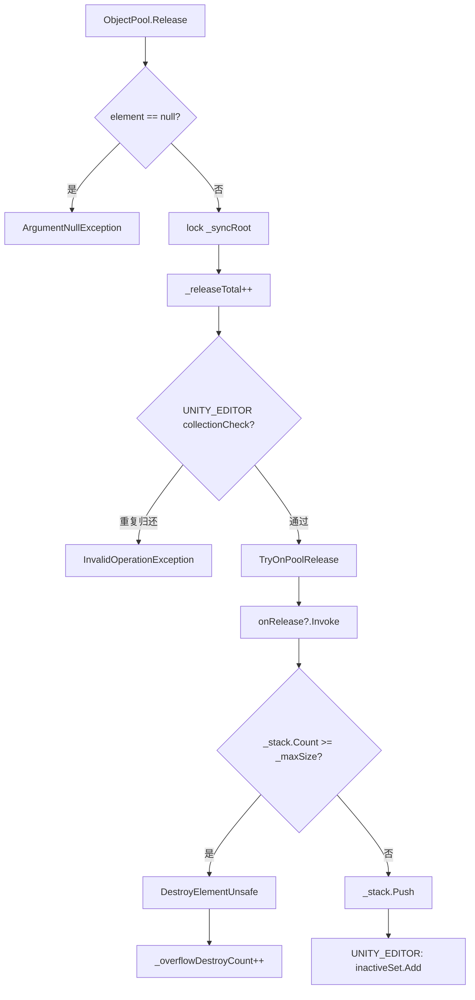
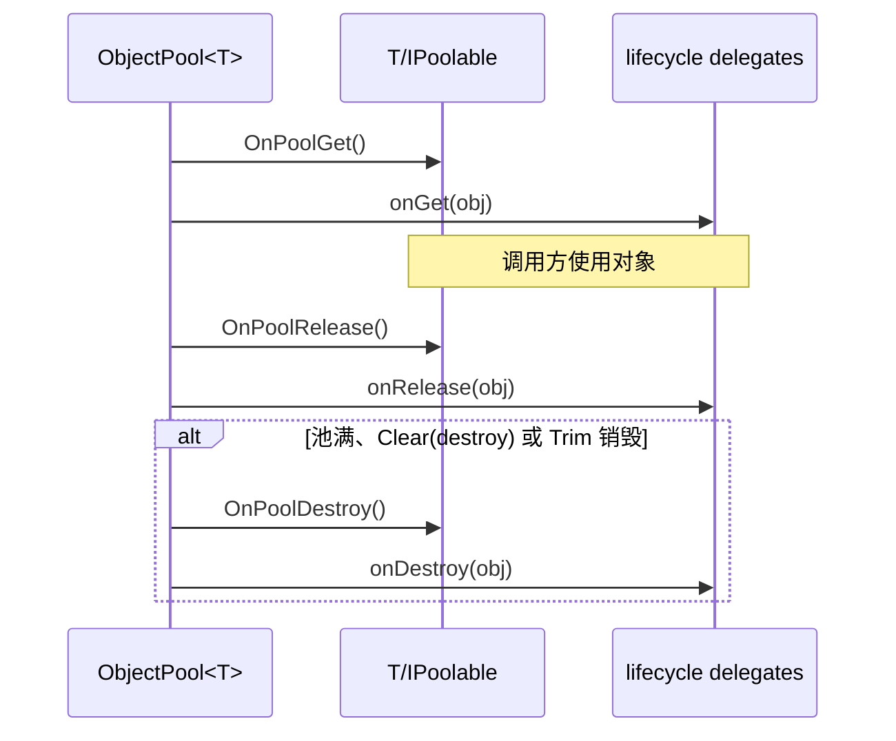
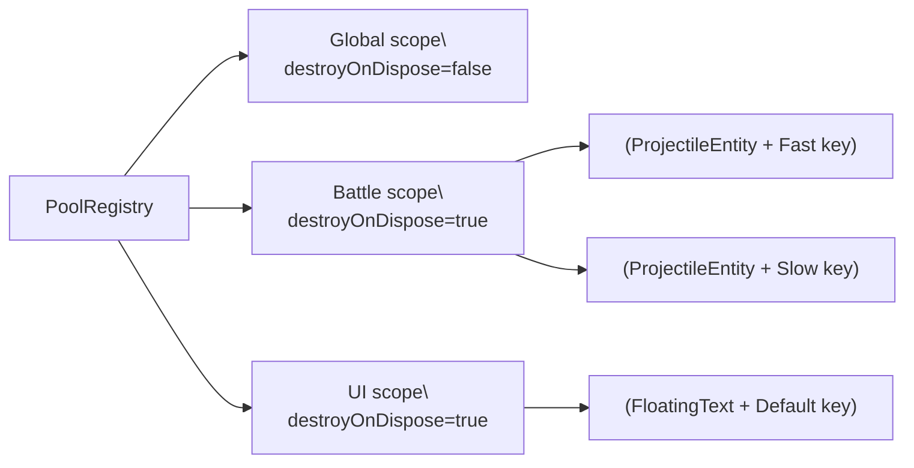
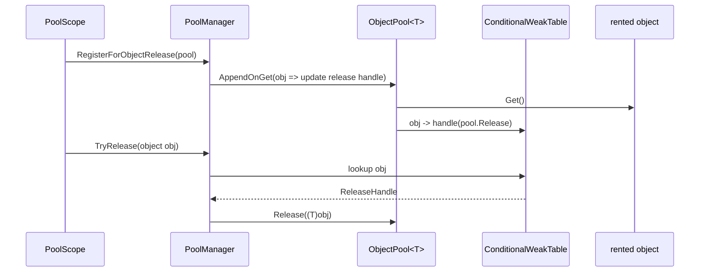
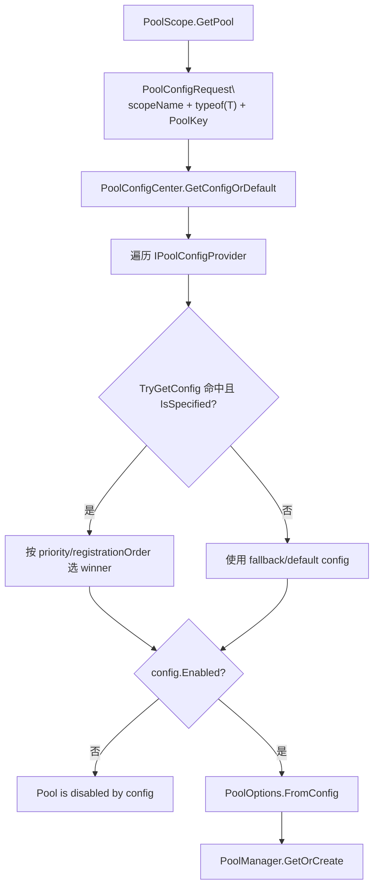
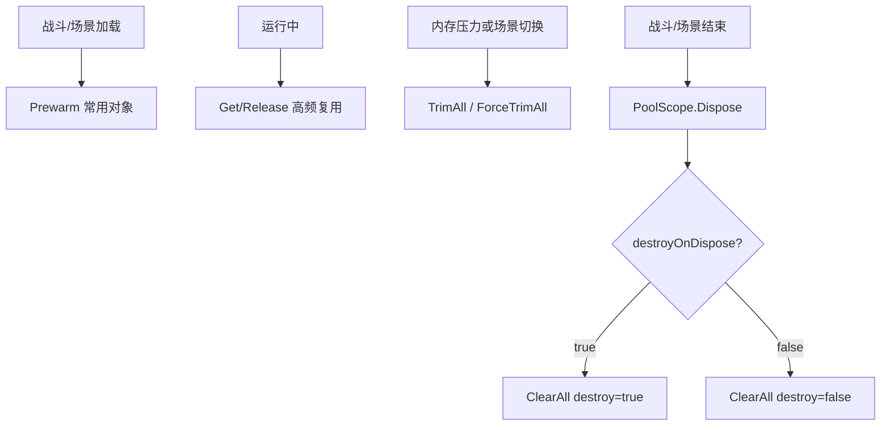
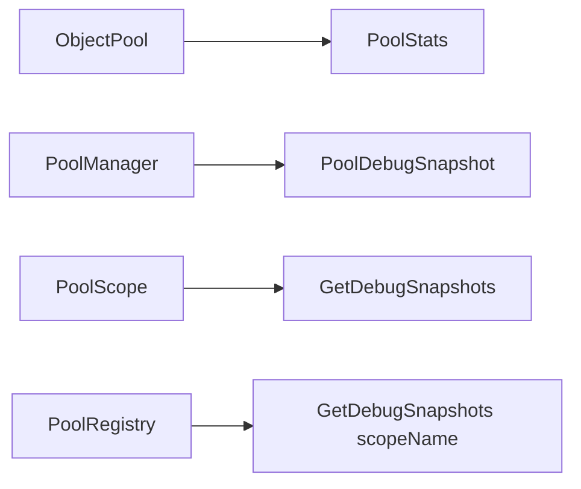
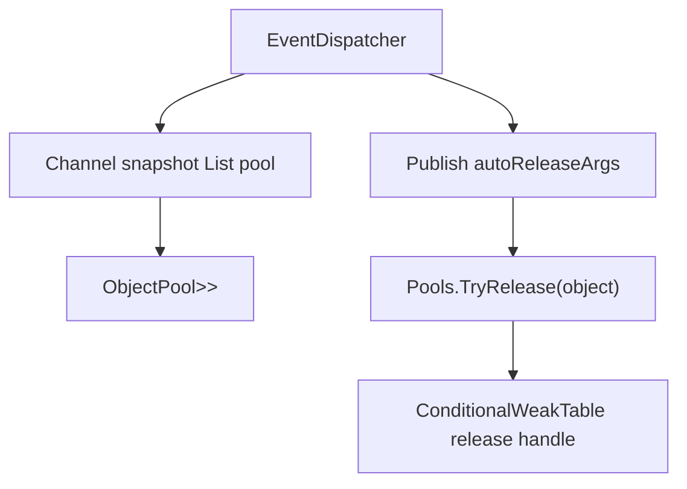

# 5.2 对象池：Pools、PoolScope、ObjectPool 与配置化复用

> 本文从源码解释 AbilityKit Core 对象池。它不是简单的 `Rent/Return` 包装，而是一套包含全局门面、命名作用域、类型+Key 分池、弱表反向归还、生命周期钩子、配置仲裁和调试统计的复用体系。

---

## 1. 能力定位

对象池解决的是高频短生命周期对象反复分配导致的 GC 抖动问题。

在 AbilityKit 中，它主要用于：

- 事件参数、临时列表、快照列表等短生命周期运行时对象。
- 投射物、Buff、伤害事件、表现事件等频繁创建和归还的对象。
- 需要按战斗、场景、UI、功能域拆分生命周期的缓存对象。
- 编辑器或诊断工具读取对象池统计，定位池容量和泄漏风险。

它不适合：

- 生命周期很长、数量很少的对象。
- 状态清理成本高于重新创建成本的对象。
- 持有外部资源且销毁语义复杂的对象，除非明确实现 `onDestroy` 或 `IPoolable.OnPoolDestroy()`。

源码入口：

| 源码 | 作用 |
|------|------|
| `Unity/Packages/com.abilitykit.core/Runtime/Pooling/Core/Pools.cs` | 全局静态门面，默认使用 `PoolRegistry.Global` |
| `Unity/Packages/com.abilitykit.core/Runtime/Pooling/Core/PoolRegistry.cs` | 管理全局 scope、命名 scope、配置 provider 和调试快照 |
| `Unity/Packages/com.abilitykit.core/Runtime/Pooling/Core/PoolScope.cs` | 一个作用域内的一组池，负责生命周期和配置解析 |
| `Unity/Packages/com.abilitykit.core/Runtime/Pooling/Core/PoolManager.cs` | 按 `(Type, PoolKey)` 保存池，并用 `ConditionalWeakTable` 记录对象归还句柄 |
| `Unity/Packages/com.abilitykit.core/Runtime/Pooling/Core/ObjectPool.cs` | 单个类型对象池，负责 Get/Release/Prewarm/Trim/Clear/Stats |
| `Unity/Packages/com.abilitykit.core/Runtime/Pooling/Core/PooledObject.cs` | `IDisposable` 归还句柄，用于 `using` 风格自动归还 |
| `Unity/Packages/com.abilitykit.core/Runtime/Pooling/Core/IPoolable.cs` | 对象池生命周期钩子 |
| `Unity/Packages/com.abilitykit.core/Runtime/Pooling/Config/PoolConfigCenter.cs` | 配置提供者仲裁、优先级、诊断报告 |
| `Unity/Packages/com.abilitykit.core/Runtime/Pooling/Config/PoolConfigModule.cs` | 字典式配置模块和 `PoolConfigBuilder` 构建器 |
| `Unity/Packages/com.abilitykit.core/Runtime/Pooling/Config/PoolItemConfig.cs` | 单个池的 enabled、capacity、prewarm、trim、neverTrim 配置 |
| `Unity/Packages/com.abilitykit.core/Runtime/Pooling/Config/PoolConfigRequest.cs` | 配置查询键：scopeName + elementType + PoolKey |

---

## 2. 总体结构



这个结构把三类问题分开：

| 层级 | 负责内容 |
|------|----------|
| `Pools` | 给调用方提供最短入口，默认走全局池 |
| `PoolRegistry` | 管理 scope 和配置 provider |
| `PoolScope` | 决定对象池生命周期边界，解析配置并创建池 |
| `PoolManager` | 管理 `(Type, PoolKey)` 到具体池的映射，支持按对象实例反向归还 |
| `ObjectPool<T>` | 单池 Get/Release/Trim/Prewarm/Clear 和统计 |

---

## 3. 最短使用路径

源码中的真实 API 使用 `Get`/`Release`，不是传统示例里的 `Rent`/`Return`。

```csharp
var evt = Pools.Get(
    createFunc: () => new DamageEvent(),
    onRelease: e => e.Reset(),
    defaultCapacity: 32,
    maxSize: 256);

evt.AttackerId = attackerId;
evt.TargetId = targetId;
evt.Value = damage;

Pools.Release(evt);
```

也可以先拿到池对象：

```csharp
var pool = Pools.GetPool(
    createFunc: () => new DamageEvent(),
    onRelease: e => e.Reset(),
    defaultCapacity: 32,
    maxSize: 256);

var evt = pool.Get();
try
{
    evt.Value = 100;
}
finally
{
    pool.Release(evt);
}
```

如果希望作用域结束时归还，可以使用 `PooledObject<T>`：

```csharp
using var rented = Pools.GetPooled(() => new DamageEvent(), onRelease: e => e.Reset());
var evt = rented.Value;
evt.Value = damage;
```

`PooledObject<T>` 是 `readonly struct`，`Dispose()` 直接调用创建它的 `ObjectPool<T>.Release(Value)`。它没有已归还标记，也不会清空 `Value`；复制 struct、手动重复 `Dispose()` 或把副本传出作用域都可能重复归还同一对象。它适合局部、不可复制的 `using` 用法，不是幂等所有权句柄。

---

## 4. Get 流程

`ObjectPool<T>` 内部使用 `Stack<T>` 保存未激活对象，并用 `_syncRoot` 保护单池状态。`createFunc`、`IPoolable.OnPoolGet()` 和 `onGet` 都在该锁内执行；因此这里的锁只说明单个池的字段访问被串行化，不代表整个 PoolRegistry/PoolManager 体系线程安全，也不代表用户回调位于锁外。



调用顺序非常明确：

1. 在锁内先递增 get、hit/miss、created 和峰值等统计。
2. 从池里取出或调用 `createFunc` 创建对象。
3. 如果对象实现 `IPoolable`，调用 `OnPoolGet()`。
4. 调用创建池时传入的 `onGet` 委托。
5. 返回对象给调用方。

这些步骤不是事务。对象从 stack 弹出后，`OnPoolGet()` 或 `onGet` 抛异常会直接传播，对象不会自动重新入栈；统计也不会回滚。`createFunc` 和生命周期回调都在 monitor 内，同线程可以重入同一池，但重入会改变 stack 和统计的观察顺序，跨池锁嵌套还需要调用方自行避免锁顺序问题。

---

## 5. Release 流程

归还路径会先清理对象状态，再决定入栈还是销毁。



这条顺序决定了一个重要约束：对象状态清理发生在是否溢出销毁之前。即使池已满，对象也会先走 `OnPoolRelease()` 和 `onRelease`，再走销毁逻辑。release 生命周期和销毁生命周期同样全部位于单池锁内。

生命周期异常不会被捕获。`OnPoolRelease()` 或 `onRelease` 抛异常时，对象可能既没有重新入栈，也没有执行销毁；已递增的 release 统计不会回滚。该路径不是事务，调用方需要让清理回调可重复、短小且尽量不抛异常。

`DestroyElementUnsafe` 会先递增 `_destroyedTotal`，再调用销毁钩子：

1. `_destroyedTotal++`。
2. `element.TryOnPoolDestroy()`，即 `IPoolable.OnPoolDestroy()`。
3. `_onDestroy?.Invoke(element)`。

---

## 6. IPoolable 生命周期

`IPoolable` 是对象自己感知池生命周期的方式：

```csharp
public interface IPoolable
{
    void OnPoolGet();
    void OnPoolRelease();
    void OnPoolDestroy();
}
```

它和委托生命周期共同生效：



`Prewarm` 也不是单纯 `create + push`：它会在锁内创建对象，执行 `OnPoolRelease()` 和 `onRelease`，再放入 inactive stack。预热回调抛异常时，构造池或显式预热会失败，已创建对象和统计不会事务回滚。

推荐分工：

| 位置 | 推荐职责 |
|------|----------|
| `OnPoolGet()` | 重置运行态标记、重新启用对象 |
| `onGet` | 注入外部上下文或统计埋点 |
| `OnPoolRelease()` | 清空引用、重置字段、防止旧状态污染下次使用 |
| `onRelease` | 模块级清理、列表 Clear、解绑外部关系 |
| `OnPoolDestroy()` / `onDestroy` | 释放非托管资源、断开最终引用 |

---

## 7. Scope 与 PoolKey

`PoolScope` 用来表达“这一组池一起创建、一起清理”。例如：

```csharp
var battleScope = Pools.GetOrCreateScope("Battle:1001");
var projectile = battleScope.Get(
    key: new PoolKey("Projectile.Fast"),
    createFunc: () => new ProjectileEntity(),
    defaultCapacity: 128,
    maxSize: 512);

battleScope.Release(new PoolKey("Projectile.Fast"), projectile);
```

作用域设计：



同一个类型可以通过不同 `PoolKey` 拆成多个池。适合以下情况：

- 同一类型对象有不同容量和清理策略。
- 同一类型对象用于不同玩法域，不希望互相争抢池容量。
- 需要按配置区分默认容量、最大容量、裁剪策略。

---

## 8. PoolManager 的反向归还

`PoolManager` 有一个关键细节：`ConditionalWeakTable<object, ReleaseHandle>`。

当池被 `RegisterForObjectRelease` 注册后，`PoolManager` 会向池追加一个 `onGet`：



这就是 `Pools.TryRelease(object)` 能工作的基础。事件系统发布后自动释放事件参数时，会调用 `Pools.TryRelease(boxed)`。只要对象是从已注册池里取出的，弱表里通常能找到对应池的归还句柄。

需要注意两个所有权边界：

- `PoolManager.Remove`、manager `ClearAll` 或 scope 销毁不会遍历并清除 `ConditionalWeakTable` 中的旧句柄。仍被业务持有的旧对象之后可能继续归还到已经从 manager 映射移除的旧池实例。
- 相同 `(Type, PoolKey)` 后续创建新池时，旧对象的句柄仍指向旧池；只有对象再次从某个已注册池 `Get` 时，句柄才会被替换。

这也解释了为什么不要把“自己 new 出来的对象”直接交给 `Pools.TryRelease`：没有归还句柄时它会返回 `false`。弱表不延长对象本身的生命周期，但它也不等价于 scope 已销毁后旧租约自动失效。

---

## 9. 配置中心

`PoolScope.GetPool` 不只是直接使用传入容量，它会构造 `PoolConfigRequest` 并查询 `PoolConfigCenter`。



仲裁规则：

| 规则 | 说明 |
|------|------|
| 优先级更高者胜出 | `PoolConfigProviderInfo.Priority` 数值越大越优先 |
| 优先级相同时后注册者胜出 | `RegistrationOrder` 更大者覆盖旧 provider |
| 同一 provider 实例重复注册 | 不新增记录；返回的 registration 仍可尝试注销该实例 |
| 可输出冲突报告 | `TryGetConfigReport` 会返回所有候选和最终 winner，并为候选集合分配 List |
| 可输出快照 | `TryGetConfigSnapshot` 返回最终配置和来源 provider |

这套配置链让框架可以在不改调用点的情况下，按包、模块、场景或调试工具统一调整池容量。

`PoolConfigModule` 是内置的字典式 provider。`PoolRegistry.RegisterConfigModule` 会创建 `PoolConfigBuilder`，让外部模块用强类型方式声明配置：

```csharp
PoolRegistry.RegisterConfigModule(
    builder => builder
        .Add<DamageEvent>(defaultCapacity: 64, maxSize: 256, prewarmCount: 64)
        .Add<ProjectileEvent>("Battle", "FastProjectile", defaultCapacity: 128, maxSize: 512),
    defaultScopeName: "Global",
    moduleName: "CombatRuntime",
    source: "com.abilitykit.combat",
    priority: 100);
```

配置请求的键是 `PoolConfigRequest(scopeName, typeof(T), key)`。`scopeName` 为空时会归一化为 `Global`，`PoolKey` 为空时会归一化为 `PoolKey.Default`，因此同一个类型在不同 scope 或不同 key 下可以拿到不同配置。

`PoolOptions.FromConfig` 还有一个容易忽略的细节：它会把 `ObjectPoolOptions.DefaultCapacity` 设置为 `Math.Max(config.DefaultCapacity, config.PrewarmCount)`。因为 `ObjectPool<T>` 构造函数会执行 `Prewarm(options.DefaultCapacity)`，所以配置里的 `prewarmCount` 实际通过扩大初始容量影响预热数量。`PoolItemConfig` 中 `prewarmCount < 0` 时会回落到 `defaultCapacity`。

配置只在同一 scope 中首次创建 `(Type, PoolKey)` 池时决定 options。后续 `GetPool` 即使传入不同委托、容量或命中新 provider，`PoolManager.GetOrCreate` 仍返回已有池，新的 options 不会热更新现有实例。配置 provider 查询在 `PoolConfigCenter` 的全局锁内执行，provider 异常会向调用方传播；provider 回调中重入配置中心或修改 provider 集合会增加锁内语义复杂度，不应把 provider 当作任意业务回调。

---

## 10. Prewarm、Trim 与 Clear

对象池提供三类容量操作：

| API | 行为 |
|-----|------|
| `Prewarm(int count)` | 预创建对象并放入 inactive stack，直到达到指定数量或 `maxSize` |
| `Trim()` / `Trim(policy)` | 按裁剪策略移除一部分 inactive 对象 |
| `ForceTrim(policy)` | 强制按传入策略裁剪，即使池本身配置为 never trim 也会尝试 |
| `Clear(bool destroy)` | 清空 inactive 对象；`destroy=true` 时执行销毁钩子 |

典型流程：



`PoolRegistry.DestroyScope(name, destroy)` 会移除命名 scope 并调用 `scope.Dispose(destroy)`。Dispose 后的 `PoolScope` API 会抛 `ObjectDisposedException`。全局 scope 不会被移除，销毁全局 scope 时只会清空其中的池；registry 级 `ClearAll` 也只是清空各 scope 的池，不会移除命名 scope。

裁剪策略由 `PoolTrimPolicy.ResolveTargetInactiveCount(defaultCapacity)` 决定：未指定策略时保留 `defaultCapacity`，`KeepNone` 会裁到 0，`KeepAll` 和 `KeepDefaultCapacity` 在当前实现中都会至少保留 `defaultCapacity` 且没有上限。`ObjectPool<T>.Trim()` 会尊重 `NeverTrim`，`ForceTrim(policy)` 则绕过 `NeverTrim` 判断，按传入策略强制裁剪 inactive 对象。

---

## 11. 统计与调试

`ObjectPool<T>.Stats` 包含创建、获取、释放、命中、未命中、溢出销毁、裁剪、清理等计数。编辑器下还可以读取 `PoolDebugSnapshot`。



这些数据能回答：

- 池是否频繁 miss，说明默认容量太小或预热不足。
- 是否频繁 overflow destroy，说明最大容量太小或归还节奏异常。
- active 峰值是否明显高于预期，说明对象生命周期可能泄漏。
- trim/clear 是否发生在错误时机，导致后续重新创建。

---

## 12. 与事件系统的关系

事件系统有两处依赖池化：



这意味着：

- 多监听者事件派发时，临时 snapshot 列表不会每次分配新列表。
- 池化事件参数可以在发布后自动归还。
- 监听者如果需要跨帧保存事件内容，必须复制字段，不能长期持有池化事件对象引用。

---

## 13. 线程、重入与失败边界

| 边界 | 当前事实 |
|------|----------|
| 单池并发 | `ObjectPool<T>` 的栈、统计和容量操作受 `_syncRoot` 保护，但所有用户生命周期回调也在锁内执行 |
| 管理层并发 | `PoolManager.GetOrCreate` 使用 `_gate`，但 `TryGet`、`Remove`、`RegisterForObjectRelease` 等路径没有统一锁住同一批字典/集合，不能声明 manager/registry 整体线程安全 |
| 回调重入 | monitor 允许同线程重入；回调再次 Get/Release 会改变当前操作期间的 stack 和统计，跨池调用还可能形成锁顺序问题 |
| 异常传播 | create、get/release/destroy、config provider 异常通常直接传播；对象位置与统计不会事务回滚 |
| 重复归还检查 | collection check 仅在 `UNITY_EDITOR` 编译条件下维护 inactive set；Player 构建不能依赖它阻止同一引用被重复压栈 |

默认工程策略应是按世界或主线程串行操作管理层，把回调写成短小、可重复且不抛异常的状态重置逻辑。需要跨线程租借时，应在外层建立明确的调度和所有权协议，并单独验证 manager 与 scope 生命周期，而不能只依据 `ObjectPool<T>` 内部存在锁。

---

## 14. 边界判断

### 14.1 以为 `Pools.Release(obj)` 可以归还任何对象

不一定。对象必须来自对应池，否则 `PoolScope.Release(object)` 会找不到归还句柄并抛异常，`TryRelease` 则返回 `false`。

### 14.2 只清字段，不清引用

池化对象最容易出现旧引用污染。`OnPoolRelease()` 或 `onRelease` 应清掉集合、引用、回调和外部句柄。

### 14.3 所有对象都池化

池化有复杂度成本。低频、长生命周期、状态复杂的对象直接创建更清晰。

### 14.4 忽略作用域

全局池适合跨场景复用的底层对象。战斗、UI、场景对象更适合命名 scope，结束时统一销毁，避免残留。

### 14.5 配了 prewarmCount 却以为它独立于 defaultCapacity

当前配置转换会把 `DefaultCapacity` 提升到 `Max(DefaultCapacity, PrewarmCount)`，而构造池时会按 `DefaultCapacity` 预热。因此 `prewarmCount` 的效果是提高初始预热数量，同时也影响未指定裁剪策略时的保留基线。

### 14.6 把 `PooledObject<T>` 当作可复制的幂等句柄

它是没有 disposed 状态的 readonly struct。每个副本都会对同一 `Value` 调用 `Release`；编辑器可能抛重复归还异常，Player 构建则可能把同一引用多次压入栈。应限制为单一局部变量的 `using` 生命周期，不手动重复释放，也不复制或装箱后传递。

### 14.7 认为移除池会让旧对象无法归还

manager 映射被移除不代表旧 weak-table release handle 被撤销。旧租约可能回到旧池实例，而不是同 key 的新池。scope 销毁前应先收回租约；如果无法做到，业务层应让过期对象显式失效，而不是依赖 registry 删除映射。

---

## 15. 生产证据与测试成熟度

| 证据 | 当前结论 |
|------|----------|
| Flow、Pipeline、FrameSync rollback | 多个运行时直接用 Core 池复用流程节点、阶段执行器和回滚临时对象，证明池是共享生产基础设施 |
| Combat 与 Demo | Targeting、Projectile、Motion、MOBA runtime、Shooter view 等存在直接池化调用，覆盖全局池、显式 `ObjectPool<T>` 和生命周期委托 |
| `FoundationStarter.cs` | 提供 Core 对象池的可执行最小样例 |
| `PoolConfigSample.cs` | 覆盖配置 module、override provider、snapshot/report 和命名 scope，可作为配置链样例证据 |
| 独立测试 | 当前未找到以 Core `ObjectPool`、`PoolManager` 或 `PoolConfigCenter` 命名的独立契约测试；上层模块测试只能证明特定使用路径 |

优先补测：生命周期顺序、回调异常后的统计/对象位置、Player 重复归还、`PooledObject<T>` 副本、并发 GetOrCreate/Remove/Register、scope 销毁后的旧 release handle、同 key 配置首次创建固化，以及 provider 异常与同优先级后注册覆盖。

---

## 16. 源码阅读路径

1. `Pools.cs`：全局门面的 API 视图。
2. `PoolScope.cs`：scope、config 和 `PoolKey`。
3. `ObjectPool.cs`：`Get()`、`Release()`、`Prewarm()`、`Trim()` 的池对象生命周期。
4. `PoolManager.cs`：对象实例如何通过 `TryRelease(object)` 反向归还。
5. `PoolConfigCenter.cs` 与 `PoolConfigModule.cs`：配置 provider 的优先级、注册顺序、强类型配置构建和诊断报告。

---

## 17. 和其他文档的关系

- [事件系统](./01-EventSystem.md)：事件参数自动释放和 snapshot 列表池化都依赖本模块。
- [定时器框架](./03-TimerFramework.md)：调度器当前使用任务对象和内部数组列表，未来若需要高频任务复用，可接入本池化体系。
- [配置系统](./04-ConfigurationSystem.md)：池化配置 provider 是运行时配置思想在 Core 层的一个轻量版本。
- [投射物系统](../08-GameplayModules/04-ProjectileSystem.md)：投射物是最典型的短生命周期高频对象，适合按战斗 scope 管理。

---

*文档版本：v2.2 | 最后更新：2026-07-15*
