# 5.3 定时器框架：SystemTimer、DefaultScheduler 与任务状态机

> 本文从源码解释 AbilityKit 的时间与调度能力。当前实现不是传统的 `Delay/Loop/FrameDelay + ITimerHandle` 体系，而是分成轻量计时器、调度器、调度任务和世界时钟几层，各自服务不同场景。

---

## 1. 能力定位

定时器框架解决的是“在 Tick 推进中按时间执行任务”的问题。

它适合：

- 延迟执行一次回调。
- 按固定周期重复执行回调。
- 每帧或每个逻辑 Tick 持续执行回调，直到外部完成或超时。
- 在非 Unity 环境中使用 `Stopwatch` 做轻量计时。
- 把世界时间推进和任务调度从具体玩法系统里拆出来。

它不负责：

- 网络帧同步的权威帧推进。帧同步应由 FrameSync/Host 驱动。
- 复杂技能生命周期编排。技能、Buff、持续行为应由 Triggering/Ability/Gameplay 模块表达。
- 多线程调度。`DefaultScheduler.Tick(deltaTime)` 是同步遍历任务列表。

源码入口：

| 源码 | 作用 |
|------|------|
| `Unity/Packages/com.abilitykit.timer/Runtime/Core/Interfaces/ITimer.cs` | 轻量计时器接口，只暴露 `Elapsed` 和 `Reset()` |
| `Unity/Packages/com.abilitykit.timer/Runtime/Core/Timer/SystemTimer.cs` | 基于 `Stopwatch` 的系统计时器 |
| `Unity/Packages/com.abilitykit.timer/Runtime/Core/Interfaces/IScheduler.cs` | 调度器接口，负责创建和 Tick 调度任务 |
| `Unity/Packages/com.abilitykit.timer/Runtime/Core/Scheduler/DefaultScheduler.cs` | 默认调度器，内部持有 `TaskList` |
| `Unity/Packages/com.abilitykit.timer/Runtime/Core/Scheduler/TaskList.cs` | 内部数组任务列表，删除时用尾元素覆盖 |
| `Unity/Packages/com.abilitykit.timer/Runtime/Core/Interfaces/IScheduledTask.cs` | 调度任务契约，暴露状态、取消、更新、完成 |
| `Unity/Packages/com.abilitykit.timer/Runtime/Core/Interfaces/TaskState.cs` | 任务状态枚举 |
| `Unity/Packages/com.abilitykit.timer/Runtime/Core/Tasks/DelayTask.cs` | 延迟任务 |
| `Unity/Packages/com.abilitykit.timer/Runtime/Core/Tasks/PeriodicTask.cs` | 周期任务 |
| `Unity/Packages/com.abilitykit.timer/Runtime/Core/Tasks/ContinuousTask.cs` | 持续任务 |
| `Unity/Packages/com.abilitykit.world.di/Runtime/World/Services/IWorldClock.cs` | 世界时间服务接口，记录 `DeltaTime` 和累计 `Time` |
| `Unity/Packages/com.abilitykit.host/Runtime/Host/Framework/HostRuntime.cs` | Host Tick 入口，驱动世界 Tick |

---

## 2. 四层时间模型

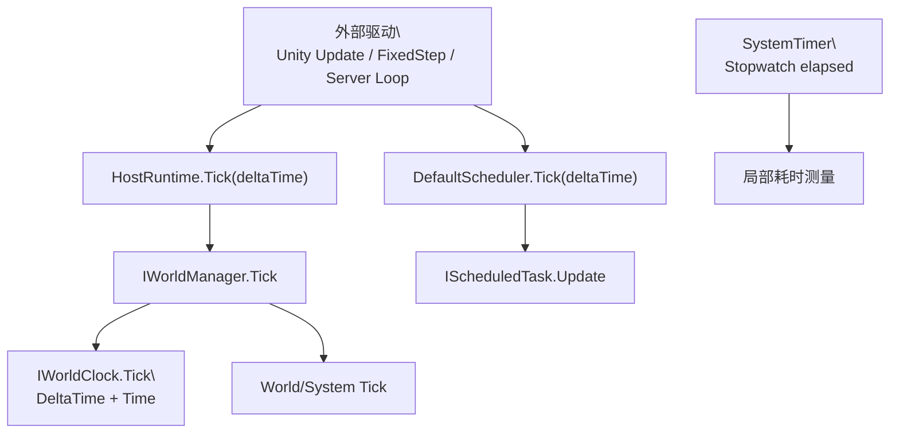

这几层不要混用：

| 层 | 解决的问题 | 典型使用 |
|----|------------|----------|
| `SystemTimer` | 测量真实经过时间 | 工具、非 Unity 环境、性能测量、超时判断 |
| `IWorldClock` | 世界内累计逻辑时间 | 系统读取当前世界时间和本帧 `DeltaTime` |
| `DefaultScheduler` | 在 Tick 中推进任务 | 延迟、周期、持续回调 |
| `HostRuntime.Tick` | 驱动世界运行 | Demo、Server、Unity Adapter 调用统一入口 |

---

## 3. ITimer 与 SystemTimer

源码中的 `ITimer` 非常小：

```csharp
public interface ITimer
{
    float Elapsed { get; }
    void Reset();
}
```

`SystemTimer` 使用 `System.Diagnostics.Stopwatch`：

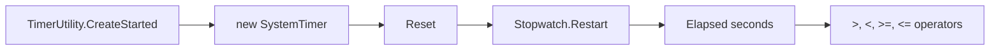

适合的用法：

```csharp
var timer = TimerUtility.CreateStarted();

// some work

if (timer > 0.5f)
{
    // elapsed more than 0.5 seconds
}
```

`SystemTimer` 测量真实系统时间，不属于世界逻辑帧时间。帧同步、回放、确定性模拟不应依赖真实时间决定逻辑结果。

`SystemTimer` 虽然是 struct，但内部字段是引用类型 `Stopwatch`。首次 `Reset()` 会创建该对象；复制一个已启动的 `SystemTimer` 会让两个 struct 副本共享同一个 `Stopwatch`，任一副本再次 `Reset()` 都会影响另一副本观察到的时间。不要把它当作复制后相互独立的值计时器。

---

## 4. 世界时钟 IWorldClock

世界时钟只保存两个值：

```csharp
public interface IWorldClock
{
    float DeltaTime { get; }
    float Time { get; }
    void Tick(float deltaTime);
}
```

`WorldClock.Tick(deltaTime)` 的实现是：

```csharp
DeltaTime = deltaTime;
Time += deltaTime;
```

它的定位是“世界服务”，不是任务调度器：

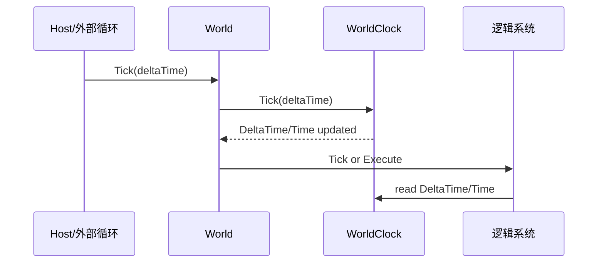

如果系统只需要知道“这一帧过了多久、当前世界时间是多少”，读取 `IWorldClock` 即可。如果系统需要“2 秒后执行一个回调、每 0.5 秒执行一次回调”，应使用 `IScheduler`。

---

## 5. IScheduler 的真实 API

源码中的调度器接口：

```csharp
public interface IScheduler
{
    string Name { get; set; }
    int Count { get; }

    IScheduledTask ScheduleDelay(Action callback, float delaySeconds);
    IScheduledTask SchedulePeriodic(Action callback, float periodSeconds, float durationSeconds = -1, int maxExecutions = -1);
    IScheduledTask ScheduleContinuous(Action<float> onTick, Action onComplete = null, float durationSeconds = -1);

    void CancelAll();
    void CancelByName(string name);
    void Tick(float deltaTime);
}
```

三类任务对应三种行为：

| API | 任务类型 | 行为 |
|-----|----------|------|
| `ScheduleDelay` | `DelayTask` | 累计时间达到 delay 后执行一次回调并完成 |
| `SchedulePeriodic` | `PeriodicTask` | 每累计一个 period 执行一次；`maxExecutions` 可限制次数，当前 `duration` 实现不能视为可靠的总持续时间 |
| `ScheduleContinuous` | `ContinuousTask` | 每次 Tick 调用 `onTick(deltaTime)`，可由 duration 或外部 `Complete()` 结束 |

接口注释中的“Tick 返回值不分配”只说明 `Tick` 没有返回集合，并不等于调度体系整体零分配：每次 Schedule 都会创建任务对象，`TaskList` 超过当前容量时还会分配两倍容量的新数组并复制。接口也没有按名称查询或枚举任务的公开 API，不能把注释中的“任务检索能力”当作已实现契约。

---

## 6. DefaultScheduler.Tick 流程

`DefaultScheduler` 内部只有一个 `TaskList _tasks = new(16)`。Tick 时从后往前遍历：

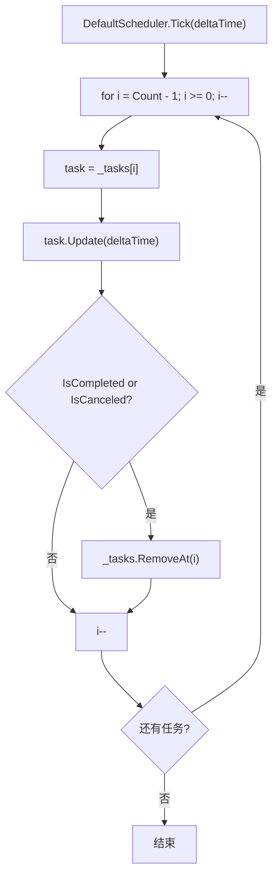

从后往前遍历加上 `TaskList.RemoveAt` 的尾元素覆盖删除，可以避免删除当前任务后还要整体搬移数组。

`TaskList.RemoveAt(index)` 的行为：

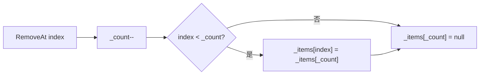

这也意味着任务顺序不是稳定队列语义。调度器适合推进一组任务，不适合依赖任务在列表中的相对顺序表达玩法逻辑。

---

## 7. 任务状态机

`IScheduledTask` 暴露状态、取消、完成和更新：

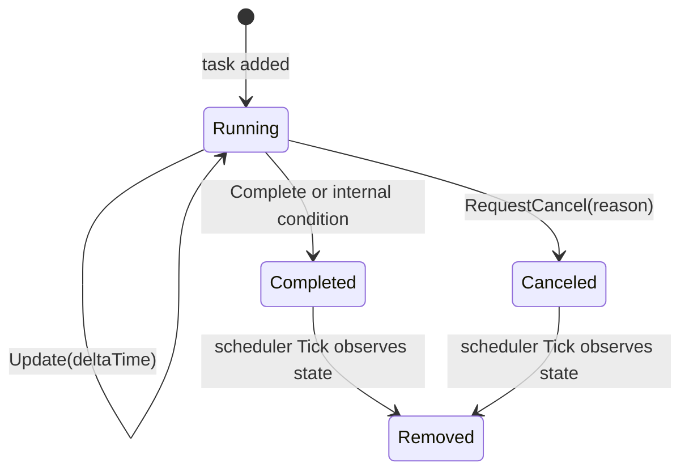

`TaskState` 定义了 `Pending`、`Running`、`Completed`、`Canceled`、`TimedOut`。当前三个内置任务只产生 `Running`、`Completed`、`Canceled`；`Pending` 和 `TimedOut` 是枚举预留值，没有内置状态路径。Schedule 后任务已报告 `Running`，取消和外部完成只是写标记，通常要到 scheduler 的遍历检查才从列表移除。

`ScheduledTaskBase` 保存公共字段：

| 字段/属性 | 说明 |
|-----------|------|
| `Name` | 用于 `CancelByName` 的任务名 |
| `StartTime` | 起始时间戳，由外部设置，当前默认调度器不主动赋值 |
| `CancelReason` | 取消原因 |
| `_canceled` | 取消标记 |
| `_completed` | 完成标记 |

---

## 8. DelayTask

`DelayTask` 的行为很直接：累计 `_elapsed`，到达 `_delay` 后调用回调并完成。

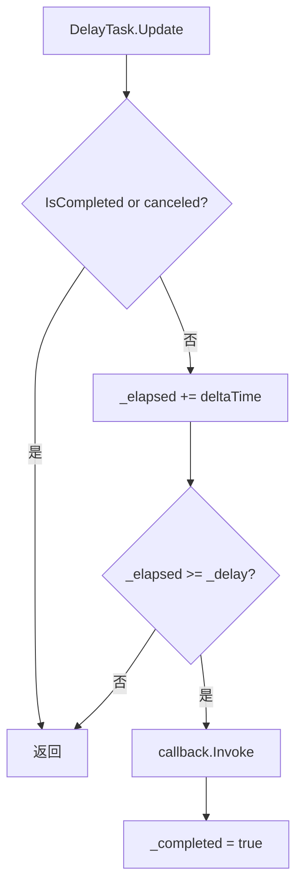

使用示例：

```csharp
var scheduler = new DefaultScheduler();

scheduler.ScheduleDelay(() =>
{
    // execute once after 2 seconds of scheduler Tick time
}, 2f);

scheduler.Tick(deltaTime);
```

---

## 9. PeriodicTask

`PeriodicTask` 负责固定间隔重复执行：

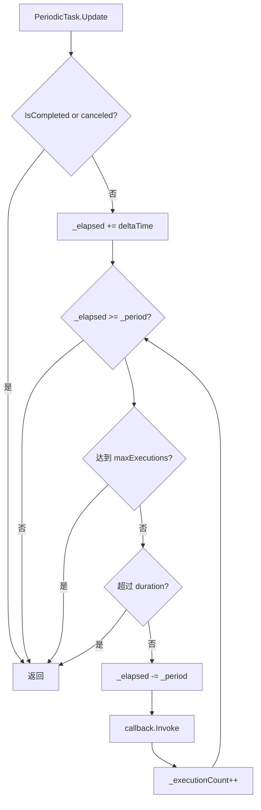

关键细节：它使用 `while (_elapsed >= _period)` 补执行周期回调。如果某一帧 `deltaTime` 很大，可能在同一个 Tick 中执行多次周期回调。

该行为影响逻辑正确性：

- 好处：低帧率下不会永久丢失周期次数。
- 风险：单帧可能集中执行多次回调，回调应保持轻量，并注意玩法上是否允许补帧。
- `periodSeconds <= 0` 没有被拒绝。无限次数配置下，while 条件可持续成立；负 period 还会在减法后增大 `_elapsed`，造成 Tick 不返回。
- `durationSeconds` 和周期余量共用 `_elapsed`。每次回调前都会减去 period，正常小步长下 elapsed 会反复回落，正 duration 可能长期无法达到完成阈值；大 delta 又可能在第一次回调前被 duration 判断直接截断。因此当前 duration 行为存在实现缺陷，不能作为可靠的周期任务截止条件。

在该缺陷修复并有契约测试前，需要有限周期任务时优先使用正 period 和正 `maxExecutions`，或由回调持有独立累计时间并显式取消。不要只依赖 `durationSeconds` 保证终止。

---

## 10. ContinuousTask

持续任务每次更新都会调用 `onTick(deltaTime)`：

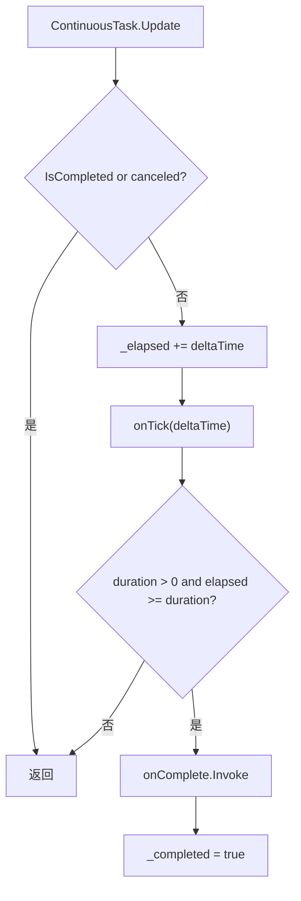

持续任务适合：

- 逐帧更新一个过渡值。
- 在固定持续时间内执行某个采样或检查。
- 由外部调用 `Complete()` 主动结束。

`onComplete` 只在 `ContinuousTask.Update()` 检测到 duration 到期时调用。继承自基类的外部 `Complete()` 只写完成标记，取消也只写取消标记，两条路径都不会调用 `onComplete`。因此清理工作不能只放在 completion callback 中；若提前完成也需要收尾，调用方应先显式收尾，再调用 `Complete()`。

```csharp
var task = scheduler.ScheduleContinuous(
    onTick: dt => UpdateChanneling(dt),
    onComplete: () => FinishChanneling(),
    durationSeconds: 3f);

// 提前结束时，Complete() 本身不会调用 onComplete。
FinishChanneling();
task.Complete();
```

---

## 11. 取消与命名

调度器支持取消所有任务或按名称取消：

```csharp
var task = scheduler.ScheduleDelay(Explode, 1.5f);
task.Name = "Projectile:42:Explode";

scheduler.CancelByName("Projectile:42:Explode");
```

取消流程：

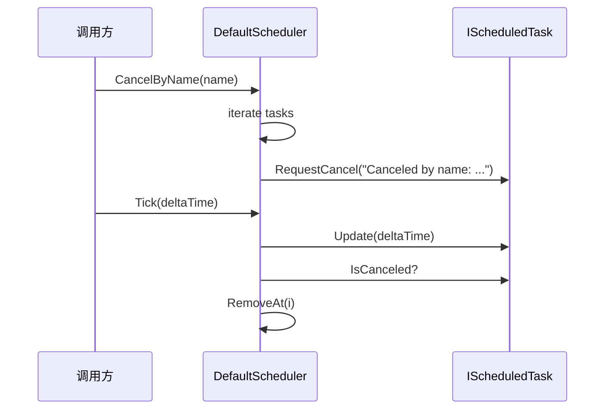

`CancelByName` 只为任务写入取消标记。真正从 `TaskList` 移除发生在下一次或当前 Tick 遍历检查时。`CancelAll` 具有相同语义；两者都没有取消回调，也不会清空任务对象持有的委托。

---

## 12. 和 Host Tick 的关系

Host 层源码中 `HostRuntime.Tick(deltaTime)` 的职责是驱动世界：

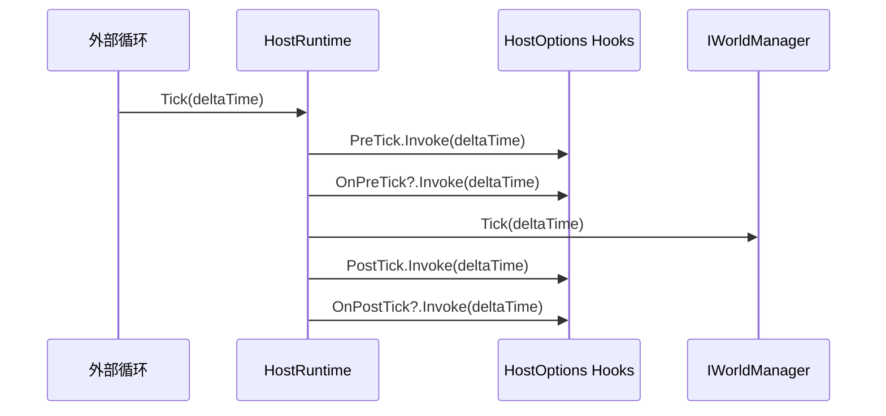

`DefaultScheduler` 是否在 Host Tick 内运行，取决于具体系统如何接入。设计上可以有两种常见方式：

| 接入方式 | 说明 |
|----------|------|
| 世界服务持有 scheduler | 某个世界系统在自己的 Tick 中调用 `scheduler.Tick(clock.DeltaTime)` |
| 外部运行时持有 scheduler | Demo、工具或 Adapter 在外部循环里直接 Tick scheduler |

确定性要求高的逻辑应使用统一的逻辑 `deltaTime`，并由 Host/World 驱动。工具计时、加载等待、非确定性 UI 反馈可以使用 `SystemTimer`。

---

## 13. 参数、异常与分配边界

### 13.1 参数由调用方保证

当前构造和 Schedule 入口不校验 callback、delay、period、duration、maxExecutions 或 `Tick(deltaTime)`。实际边界包括：

| 输入 | 当前结果 |
|------|----------|
| null callback | 任务仍可推进并完成，只是不执行回调 |
| `delaySeconds <= 0` | 首次 Update 的 guard 已把任务视为完成，callback 不执行，随后被移除 |
| `periodSeconds <= 0` | 可进入不终止的 while 循环 |
| 负 `deltaTime` | elapsed 会倒退，没有异常或诊断 |
| 非正 duration | 被解释为无限期，而不是立即完成 |
| 非正 maxExecutions | 被解释为无限次数 |

框架边界当前偏向低开销工具，而不是防御式公共 API。配置和外部输入必须在调用 scheduler 前验证。

### 13.2 回调异常直接传播

任务回调、持续回调和完成回调都没有异常隔离，异常会直接穿透 `DefaultScheduler.Tick()`：

1. 当前 Tick 立即中断，尚未遍历到的低索引任务不会更新。
2. `DelayTask` 在 callback 返回后才写完成标记；callback 抛异常时，任务保持未完成，后续 Tick 会再次调用。
3. `PeriodicTask` 在 callback 返回后才增加执行次数；异常时当前周期既未计数，任务也未完成。
4. `ContinuousTask` 的 `onTick` 或 `onComplete` 抛异常时，完成标记同样可能尚未写入。

若回调来自不可信插件或业务模块，调用方应在回调边界自行捕获、记录并决定取消；当前 scheduler 不提供“单任务失败不影响其他任务”的保证。

### 13.3 分配模型

scheduler 初始化时创建容量 16 的数组。Schedule 创建新的 class 任务；容量满时 `TaskList` 创建两倍容量数组并复制。Tick 的正常遍历和尾部覆盖删除不主动创建集合，但委托闭包、任务创建、扩容及业务回调仍可能产生 GC。高频玩法热路径应先做 profile，再决定复用回调、预留更大容量或引入池化，而不是依据接口注释声明零 GC。

---

## 14. 接入与成熟度证据

| 证据面 | 当前事实 | 结论 |
|--------|----------|------|
| 包源码 | 有完整的 timer、scheduler 和三种任务实现 | 可作为基础工具审阅和接入 |
| 自动 Host/World 接入 | 未发现默认模块自动 Tick scheduler | 所有权和 Tick 时机由接入方负责 |
| 生产调用 | 当前仓库搜索未发现 `DefaultScheduler` 的生产运行时调用 | 尚不能声明为生产验证能力 |
| 自动测试 | package 中没有 Tests 目录或独立测试工程 | 参数、补执行、异常和终态缺少回归保护 |
| 示例 | package 注释和 Samples 中有示例字符串 | 只说明预期用法，不等于可执行验收 |

优先补充 `PeriodicTask` 非正 period、duration 截止、回调异常重试、外部 Complete/onComplete、取消移除时机、尾部覆盖顺序和扩容分配测试。周期 duration 缺陷修复前，不应把该参数用于关键玩法终止保证。

---

## 15. 边界判断

### 15.1 把 ITimer 当成调度器

`ITimer` 只有 `Elapsed` 和 `Reset()`，不创建任务。需要延迟、周期、持续回调时使用 `IScheduler`。

### 15.2 以为任务会自动随世界 Tick

`DefaultScheduler` 不会自己运行。必须有外部调用 `Tick(deltaTime)`。

### 15.3 在帧同步逻辑里使用真实时间

`SystemTimer` 基于 `Stopwatch`，不同机器和回放环境下真实时间不可作为权威逻辑输入。帧同步逻辑应使用框架传入的逻辑 delta 或帧号。

### 15.4 依赖任务执行顺序

`TaskList.RemoveAt` 会用尾元素覆盖删除位置，任务列表不是稳定顺序容器。玩法顺序应由系统设计或计划执行器表达。

### 15.5 忽略大 delta 和非法 period

`PeriodicTask` 会在一个 Tick 内用 `while` 补足多个周期。周期回调要能承受一次 Tick 多次调用，period 必须在入口保证大于零。

### 15.6 把 Complete 当作完成事件

外部 `Complete()` 只是状态写入，不调用 `ContinuousTask.onComplete`。需要统一完成通知时，应在 scheduler 之上定义自己的终止协议。

---

## 16. 源码阅读路径

1. `ITimer.cs` 与 `SystemTimer.cs`：计时器只测量经过时间。
2. `IScheduler.cs`：调度器公开能力。
3. `DefaultScheduler.Tick` 与 `TaskList.RemoveAt`：任务更新和移除方式。
4. `ScheduledTaskBase` 与 `TaskState`：状态和取消语义。
5. `DelayTask`、`PeriodicTask`、`ContinuousTask`：不同任务行为。
6. `IWorldClock` 与 `HostRuntime.Tick`：世界时间如何被外部驱动。

---

## 17. 和其他文档的关系

- [事件系统](./01-EventSystem.md)：事件派发是同步通知；跨时间推进的逻辑应放到 scheduler 或世界系统中。
- [对象池](./02-ObjectPool.md)：当前任务对象由调度器直接创建；如果未来高频创建任务，可考虑接入池化。
- [Host 运行时](../03-LogicalWorldHostDesign/01-HostRuntime.md)：Host 是世界 Tick 的统一入口。
- [触发器系统](../08-GameplayModules/02-TriggeringSystem.md)：复杂玩法持续行为通常应由 Triggering/Ability 表达，scheduler 更适合作为底层时间工具。
- [帧同步机制](../07-NetworkSynchronization/01-FrameSync.md)：确定性推进应以帧同步模块的逻辑帧为准，而不是 `SystemTimer` 的真实时间。

---

*文档版本：v2.1 | 最后更新：2026-07-15*
