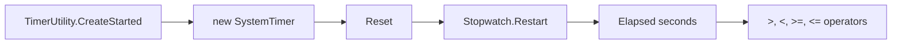
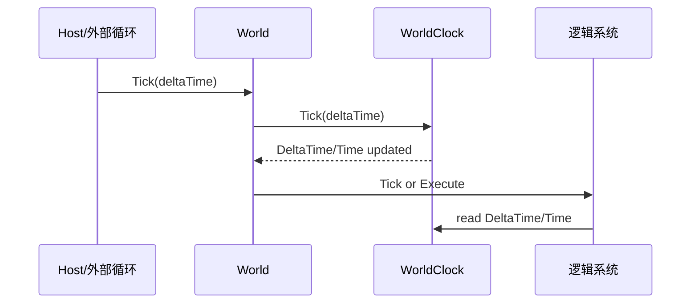
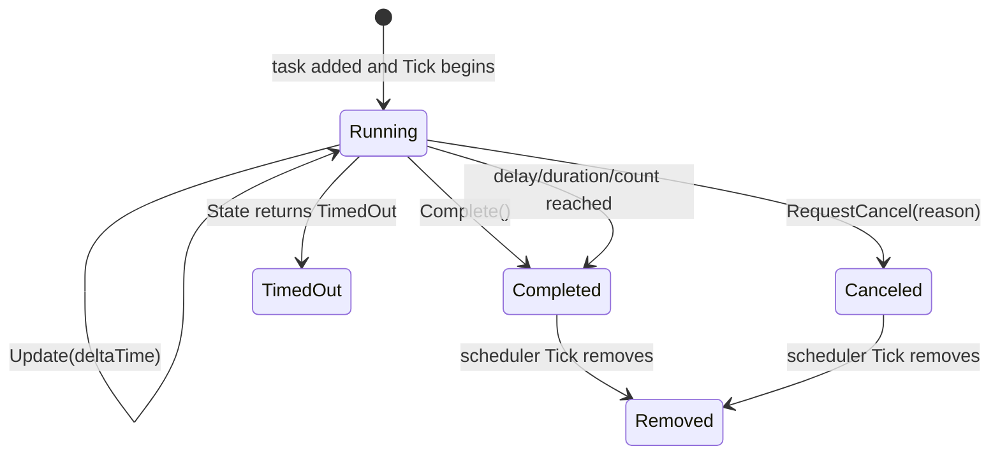
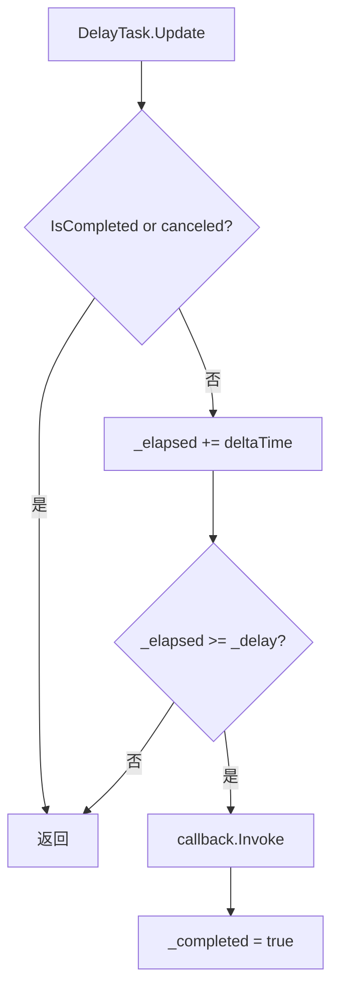
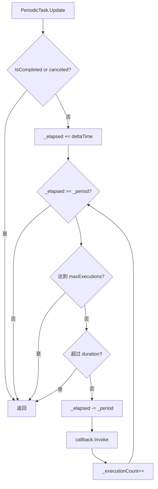
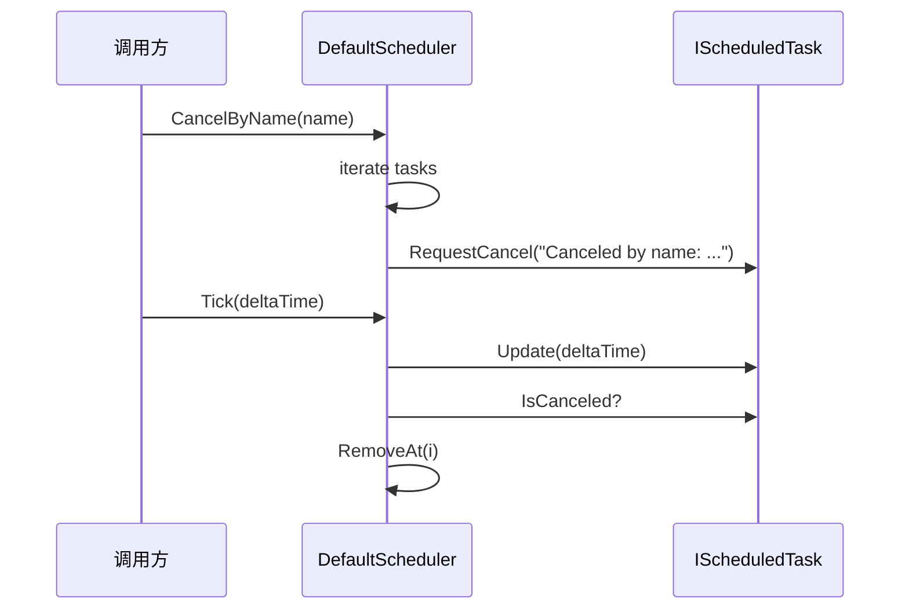
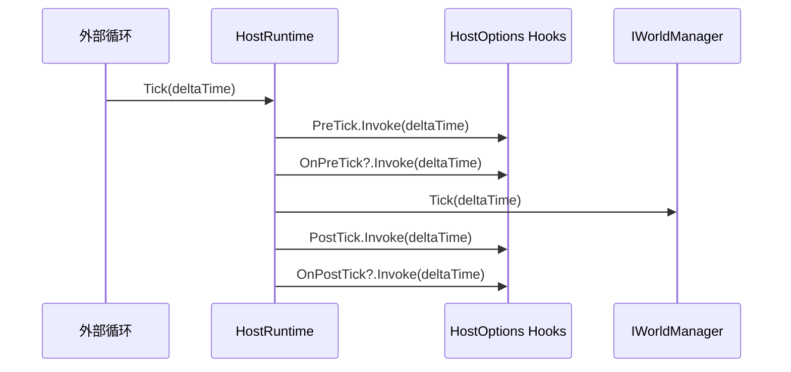

# 5.3 定时器框架：SystemTimer、DefaultScheduler 与任务状态机

> 本文从源码解释 AbilityKit 的时间与调度能力。当前实现不是传统的 `Delay/Loop/FrameDelay + ITimerHandle` 体系，而是分成轻量计时器、调度器、调度任务和世界时钟几层，各自服务不同场景。

---

## 1. 能力定位

定时器框架解决的是“在 Tick 推进中按时间执行任务”的问题。

它适合：

- 延迟执行一次回调。
- 按固定周期重复执行回调。
- 每帧或每个逻辑 Tick 持续执行回调，直到外部完成或超时。
- 在非 Unity 环境中使用 `Stopwatch` 做轻量计时。
- 把世界时间推进和任务调度从具体玩法系统里拆出来。

它不负责：

- 网络帧同步的权威帧推进。帧同步应由 FrameSync/Host 驱动。
- 复杂技能生命周期编排。技能、Buff、持续行为应由 Triggering/Ability/Gameplay 模块表达。
- 多线程调度。`DefaultScheduler.Tick(deltaTime)` 是同步遍历任务列表。

源码入口：

| 源码 | 作用 |
|------|------|
| `Unity/Packages/com.abilitykit.timer/Runtime/Core/Interfaces/ITimer.cs` | 轻量计时器接口，只暴露 `Elapsed` 和 `Reset()` |
| `Unity/Packages/com.abilitykit.timer/Runtime/Core/Timer/SystemTimer.cs` | 基于 `Stopwatch` 的系统计时器 |
| `Unity/Packages/com.abilitykit.timer/Runtime/Core/Interfaces/IScheduler.cs` | 调度器接口，负责创建和 Tick 调度任务 |
| `Unity/Packages/com.abilitykit.timer/Runtime/Core/Scheduler/DefaultScheduler.cs` | 默认调度器，内部持有 `TaskList` |
| `Unity/Packages/com.abilitykit.timer/Runtime/Core/Scheduler/TaskList.cs` | 内部数组任务列表，删除时用尾元素覆盖 |
| `Unity/Packages/com.abilitykit.timer/Runtime/Core/Interfaces/IScheduledTask.cs` | 调度任务契约，暴露状态、取消、更新、完成 |
| `Unity/Packages/com.abilitykit.timer/Runtime/Core/Interfaces/TaskState.cs` | 任务状态枚举 |
| `Unity/Packages/com.abilitykit.timer/Runtime/Core/Tasks/DelayTask.cs` | 延迟任务 |
| `Unity/Packages/com.abilitykit.timer/Runtime/Core/Tasks/PeriodicTask.cs` | 周期任务 |
| `Unity/Packages/com.abilitykit.timer/Runtime/Core/Tasks/ContinuousTask.cs` | 持续任务 |
| `Unity/Packages/com.abilitykit.world.di/Runtime/World/Services/IWorldClock.cs` | 世界时间服务接口，记录 `DeltaTime` 和累计 `Time` |
| `Unity/Packages/com.abilitykit.host/Runtime/Host/Framework/HostRuntime.cs` | Host Tick 入口，驱动世界 Tick |

---

## 2. 四层时间模型

```mermaid
flowchart TB
    Driver[外部驱动\nUnity Update / FixedStep / Server Loop] --> Host[HostRuntime.Tick(deltaTime)]
    Host --> Worlds[IWorldManager.Tick]
    Worlds --> Clock[IWorldClock.Tick\nDeltaTime + Time]
    Worlds --> Systems[World/System Tick]

    Driver --> Scheduler[DefaultScheduler.Tick(deltaTime)]
    Scheduler --> Tasks[IScheduledTask.Update]

    Utility[SystemTimer\nStopwatch elapsed] --> LocalMeasure[局部耗时测量]
```

这几层不要混用：

| 层 | 解决的问题 | 典型使用 |
|----|------------|----------|
| `SystemTimer` | 测量真实经过时间 | 工具、非 Unity 环境、性能测量、超时判断 |
| `IWorldClock` | 世界内累计逻辑时间 | 系统读取当前世界时间和本帧 `DeltaTime` |
| `DefaultScheduler` | 在 Tick 中推进任务 | 延迟、周期、持续回调 |
| `HostRuntime.Tick` | 驱动世界运行 | Demo、Server、Unity Adapter 调用统一入口 |

---

## 3. ITimer 与 SystemTimer

源码中的 `ITimer` 非常小：

```csharp
public interface ITimer
{
    float Elapsed { get; }
    void Reset();
}
```

`SystemTimer` 使用 `System.Diagnostics.Stopwatch`：



适合的用法：

```csharp
var timer = TimerUtility.CreateStarted();

// some work

if (timer > 0.5f)
{
    // elapsed more than 0.5 seconds
}
```

注意：`SystemTimer` 测的是真实系统时间，不是世界逻辑帧时间。帧同步、回放、确定性模拟不应依赖真实时间决定逻辑结果。

---

## 4. 世界时钟 IWorldClock

世界时钟只保存两个值：

```csharp
public interface IWorldClock
{
    float DeltaTime { get; }
    float Time { get; }
    void Tick(float deltaTime);
}
```

`WorldClock.Tick(deltaTime)` 的实现是：

```csharp
DeltaTime = deltaTime;
Time += deltaTime;
```

它的定位是“世界服务”，不是任务调度器：



如果系统只需要知道“这一帧过了多久、当前世界时间是多少”，读取 `IWorldClock` 即可。如果系统需要“2 秒后执行一个回调、每 0.5 秒执行一次回调”，应使用 `IScheduler`。

---

## 5. IScheduler 的真实 API

源码中的调度器接口：

```csharp
public interface IScheduler
{
    string Name { get; set; }
    int Count { get; }

    IScheduledTask ScheduleDelay(Action callback, float delaySeconds);
    IScheduledTask SchedulePeriodic(Action callback, float periodSeconds, float durationSeconds = -1, int maxExecutions = -1);
    IScheduledTask ScheduleContinuous(Action<float> onTick, Action onComplete = null, float durationSeconds = -1);

    void CancelAll();
    void CancelByName(string name);
    void Tick(float deltaTime);
}
```

三类任务对应三种行为：

| API | 任务类型 | 行为 |
|-----|----------|------|
| `ScheduleDelay` | `DelayTask` | 累计时间达到 delay 后执行一次回调并完成 |
| `SchedulePeriodic` | `PeriodicTask` | 每累计一个 period 执行一次，可受 duration 或 maxExecutions 限制 |
| `ScheduleContinuous` | `ContinuousTask` | 每次 Tick 调用 `onTick(deltaTime)`，可由 duration 或外部 `Complete()` 结束 |

---

## 6. DefaultScheduler.Tick 流程

`DefaultScheduler` 内部只有一个 `TaskList _tasks = new(16)`。Tick 时从后往前遍历：

```mermaid
flowchart TB
    Start[DefaultScheduler.Tick(deltaTime)] --> Loop[for i = Count - 1; i >= 0; i--]
    Loop --> Task[task = _tasks[i]]
    Task --> Update[task.Update(deltaTime)]
    Update --> Done{IsCompleted or IsCanceled?}
    Done -->|是| Remove[_tasks.RemoveAt(i)]
    Done -->|否| Next[i--]
    Remove --> Next
    Next --> More{还有任务?}
    More -->|是| Loop
    More -->|否| End[结束]
```

从后往前遍历加上 `TaskList.RemoveAt` 的尾元素覆盖删除，可以避免删除当前任务后还要整体搬移数组。

`TaskList.RemoveAt(index)` 的行为：

```mermaid
flowchart LR
    Remove[RemoveAt index] --> Dec[_count--]
    Dec --> Check{index < _count?}
    Check -->|是| Move[_items[index] = _items[_count]]
    Check -->|否| Clear
    Move --> Clear[_items[_count] = null]
```

这也意味着任务顺序不是稳定队列语义。调度器适合推进一组任务，不适合依赖任务在列表中的相对顺序表达玩法逻辑。

---

## 7. 任务状态机

`IScheduledTask` 暴露状态、取消、完成和更新：



`TaskState` 定义了 `Pending`、`Running`、`Completed`、`Canceled`、`TimedOut`。当前三个内置任务主要返回 `Running`、`Completed`、`Canceled`，`TimedOut` 是接口层预留状态。

`ScheduledTaskBase` 保存公共字段：

| 字段/属性 | 说明 |
|-----------|------|
| `Name` | 用于 `CancelByName` 的任务名 |
| `StartTime` | 起始时间戳，由外部设置，当前默认调度器不主动赋值 |
| `CancelReason` | 取消原因 |
| `_canceled` | 取消标记 |
| `_completed` | 完成标记 |

---

## 8. DelayTask

`DelayTask` 的行为很直接：累计 `_elapsed`，到达 `_delay` 后调用回调并完成。



使用示例：

```csharp
var scheduler = new DefaultScheduler();

scheduler.ScheduleDelay(() =>
{
    // execute once after 2 seconds of scheduler Tick time
}, 2f);

scheduler.Tick(deltaTime);
```

---

## 9. PeriodicTask

`PeriodicTask` 负责固定间隔重复执行：



关键细节：它使用 `while (_elapsed >= _period)` 补执行周期回调。如果某一帧 `deltaTime` 很大，可能在同一个 Tick 中执行多次周期回调。

这对逻辑正确性很重要：

- 好处：低帧率下不会永久丢失周期次数。
- 风险：单帧可能集中执行多次回调，回调应保持轻量，并注意玩法上是否允许补帧。

---

## 10. ContinuousTask

持续任务每次更新都会调用 `onTick(deltaTime)`：

```mermaid
flowchart TB
    Start[ContinuousTask.Update] --> Guard{IsCompleted or canceled?}
    Guard -->|是| End[返回]
    Guard -->|否| Add[_elapsed += deltaTime]
    Add --> Tick[onTick(deltaTime)]
    Tick --> Duration{duration > 0 and elapsed >= duration?}
    Duration -->|否| End
    Duration -->|是| CompleteCallback[onComplete.Invoke]
    CompleteCallback --> Complete[_completed = true]
```

持续任务适合：

- 逐帧更新一个过渡值。
- 在固定持续时间内执行某个采样或检查。
- 由外部调用 `Complete()` 主动结束。

示例：

```csharp
var task = scheduler.ScheduleContinuous(
    onTick: dt => UpdateChanneling(dt),
    onComplete: () => FinishChanneling(),
    durationSeconds: 3f);

// 外部条件提前结束
task.Complete();
```

---

## 11. 取消与命名

调度器支持取消所有任务或按名称取消：

```csharp
var task = scheduler.ScheduleDelay(Explode, 1.5f);
task.Name = "Projectile:42:Explode";

scheduler.CancelByName("Projectile:42:Explode");
```

取消流程：



注意：`CancelByName` 只是给任务打取消标记。真正从 `TaskList` 移除发生在下一次或当前 Tick 遍历检查时。

---

## 12. 和 Host Tick 的关系

Host 层源码中 `HostRuntime.Tick(deltaTime)` 的职责是驱动世界：



`DefaultScheduler` 是否在 Host Tick 内运行，取决于具体系统如何接入。设计上可以有两种常见方式：

| 接入方式 | 说明 |
|----------|------|
| 世界服务持有 scheduler | 某个世界系统在自己的 Tick 中调用 `scheduler.Tick(clock.DeltaTime)` |
| 外部运行时持有 scheduler | Demo、工具或 Adapter 在外部循环里直接 Tick scheduler |

确定性要求高的逻辑应使用统一的逻辑 `deltaTime`，并由 Host/World 驱动。工具计时、加载等待、非确定性 UI 反馈可以使用 `SystemTimer`。

---

## 13. 新手常见误区

### 13.1 把 ITimer 当成调度器

`ITimer` 只有 `Elapsed` 和 `Reset()`，不创建任务。需要延迟、周期、持续回调时使用 `IScheduler`。

### 13.2 以为任务会自动随世界 Tick

`DefaultScheduler` 不会自己运行。必须有外部调用 `Tick(deltaTime)`。

### 13.3 在帧同步逻辑里使用真实时间

`SystemTimer` 基于 `Stopwatch`，不同机器和回放环境下真实时间不可作为权威逻辑输入。帧同步逻辑应使用框架传入的逻辑 delta 或帧号。

### 13.4 依赖任务执行顺序

`TaskList.RemoveAt` 会用尾元素覆盖删除位置，任务列表不是稳定顺序容器。玩法顺序应由系统设计或计划执行器表达。

### 13.5 忽略大 delta 下的周期补执行

`PeriodicTask` 会在一个 Tick 内用 `while` 补足多个周期。周期回调要能承受一次 Tick 多次调用。

---

## 14. 推荐阅读顺序

1. 先读 `ITimer.cs` 和 `SystemTimer.cs`，明确计时器只是测量经过时间。
2. 再读 `IScheduler.cs`，理解调度器公开能力。
3. 再读 `DefaultScheduler.Tick` 和 `TaskList.RemoveAt`，理解任务更新和移除方式。
4. 再读 `ScheduledTaskBase` 与 `TaskState`，理解状态和取消语义。
5. 最后分别读 `DelayTask`、`PeriodicTask`、`ContinuousTask`，对照不同任务行为。
6. 配合阅读 `IWorldClock` 和 `HostRuntime.Tick`，理解世界时间如何被外部驱动。

---

## 15. 和其他文档的关系

- [事件系统](./01-EventSystem.md)：事件派发是同步通知；跨时间推进的逻辑应放到 scheduler 或世界系统中。
- [对象池](./02-ObjectPool.md)：当前任务对象由调度器直接创建；如果未来高频创建任务，可考虑接入池化。
- [Host 运行时](../03-LogicalWorldHostDesign/01-HostRuntime.md)：Host 是世界 Tick 的统一入口。
- [触发器系统](../08-GameplayModules/02-TriggeringSystem.md)：复杂玩法持续行为通常应由 Triggering/Ability 表达，scheduler 更适合作为底层时间工具。
- [帧同步机制](../07-NetworkSynchronization/01-FrameSync.md)：确定性推进应以帧同步模块的逻辑帧为准，而不是 `SystemTimer` 的真实时间。

---

*文档版本：v2.0 | 最后更新：2026-07-03*
