# 5.4 配置系统

> 基于真实源码说明 AbilityKit 的配置体系：通用 `AbilityKit.Ability.Config` 配置数据库、MOBA 运行时配置门面、Luban/JSON/字节混合加载、离线导表链路、TriggerPlan 与 ActionSchema 校验、Source Generator 自动注册，以及 Console/ET/Unity 多端接入方式。

---

## 目录

1. [系统定位](#1-系统定位)
2. [源码入口](#2-源码入口)
3. [总体架构](#3-总体架构)
4. [通用配置数据库](#4-通用配置数据库)
5. [MOBA 配置门面](#5-moba-配置门面)
6. [Luban 与多源加载](#6-luban-与多源加载)
7. [TriggerPlan 与 ActionSchema](#7-triggerplan-与-actionschema)
8. [配置验证与启动阻断](#8-配置验证与启动阻断)
9. [多端接入流程](#9-多端接入流程)
10. [热重载与版本模型](#10-热重载与版本模型)
11. [扩展指南](#11-扩展指南)

---

## 1. 系统定位

AbilityKit 的配置系统不是一个单一的 `JsonConfigLoader`，而是一组分层能力：

| 层级 | 主要职责 | 代表类型 |
|------|----------|----------|
| 通用配置内核 | 定义配置表元数据、加载源、反序列化、DTO/运行时表构建、版本提交与热重载事件 | `ConfigDatabase`、`ConfigTableDefinition`、`IConfigSource`、`IConfigGroup` |
| 业务配置门面 | 为 MOBA Demo 暴露强类型查询方法，并屏蔽 DTO/MO/多源加载细节 | `MobaConfigDatabase`、`MobaConfigRegistry`、`MobaConfigLoadPipeline` |
| 数据导入适配 | 支持 JSON 文本、字节、混合源、Luban 配置组、DTO Provider 与 Resources 文本加载 | `LubanConfigGroup`、`LubanConfigGroupLoader`、`LubanConfigGroupDeserializer` |
| 行为配置 | 将配置中的触发计划、条件、动作与调度转换为运行时可执行计划 | `TriggerPlanConfig`、`ConfigToExecutableConverter`、`TriggerPlanJsonDatabase` |
| Action 参数 Schema | 将配置中的具名参数转换为强类型 Action 参数，并用于启动校验 | `IActionSchema<TActionArgs, TCtx>`、`ActionSchemaRegistry`、`NamedArgsPlanActionModuleBase` |
| 自动注册与代码生成 | 扫描 `AutoPlanAction` 子类，生成注册表、Schema 和 Action 委托注册代码 | `AutoPlanAction`、`IAutoPlanActionRegistration`、`AutoPlanActionGenerator` |
| 运行时验证 | 在战斗启动前检查配置引用、触发计划、Action Schema、数值引用与事件绑定 | `MobaBattleConfigReferenceValidator`、`MobaTriggerPlanIntegrityValidator` |

系统目标可以概括为：

- **策划数据与代码解耦**：角色、技能、Buff、投射物、召唤物、表现模板、Gameplay 等均从配置表进入运行时。
- **DTO 与运行时 MO 分离**：加载阶段保留 DTO 表，同时构造运行时 MO 表，避免业务代码直接依赖导表结构。
- **多平台加载统一**：Unity Resources、Console 文件系统、ET 逻辑层和测试环境都通过相同配置数据库抽象接入。
- **配置驱动行为**：TriggerPlan 将事件、条件、动作、调度和 Cue 配成数据，ActionSchema 保证动作参数可解析、可校验。
- **可热重载与可观测**：配置库维护 `Version`，重载结果通过 `ConfigReloadBus` 发布，并携带全量/增量与变更 ID 信息。

---

## 2. 源码入口

### 2.1 通用配置内核

| 文件 | 说明 |
|------|------|
| [ConfigDatabase.cs](../../../Unity/Packages/com.abilitykit.ability/Runtime/Ability/Config/Database/ConfigDatabase.cs) | 通用配置数据库，负责加载、反序列化、构表、提交、版本递增、热重载事件发布。 |
| [IConfigTableRegistry.cs](../../../Unity/Packages/com.abilitykit.ability/Runtime/Ability/Config/Core/IConfigTableRegistry.cs) | 配置表元数据 `ConfigTableDefinition` 和注册器接口。 |
| [IConfigSource.cs](../../../Unity/Packages/com.abilitykit.ability/Runtime/Ability/Config/Core/IConfigSource.cs) | 抽象文本/字节配置源。 |
| [IConfigGroup.cs](../../../Unity/Packages/com.abilitykit.ability/Runtime/Ability/Config/Core/IConfigGroup.cs) | 抽象配置组、配置组加载器和配置组反序列化器。 |
| [IntKeyConfigTable.cs](../../../Unity/Packages/com.abilitykit.ability/Runtime/Ability/Config/Database/IntKeyConfigTable.cs) | 以 int ID 为主键的运行时配置表。 |

### 2.2 MOBA 配置体系

| 文件 | 说明 |
|------|------|
| [MobaConfigDatabase.cs](../../../Unity/Packages/com.abilitykit.demo.moba.runtime/Runtime/Infrastructure/Config/Core/MobaConfigDatabase.cs) | MOBA 配置门面，包装通用 `ConfigDatabase`，提供 `GetSkill`、`TryGetBuff` 等强类型访问。 |
| [MobaConfigRegistry.cs](../../../Unity/Packages/com.abilitykit.demo.moba.runtime/Runtime/Infrastructure/Config/BattleDemo/MobaConfigRegistry.cs) | 声明 MOBA 所有运行时表：角色、属性、技能、Buff、投射物、AOE、召唤、表现、Gameplay 等。 |
| [MobaConfigLoadPipeline.cs](../../../Unity/Packages/com.abilitykit.demo.moba.runtime/Runtime/Infrastructure/Config/Core/MobaConfigLoadPipeline.cs) | 将 Source、DTO Provider、Resources 三类加载入口统一成可注入 Pipeline。 |
| [IMobaConfigLoadProfile.cs](../../../Unity/Packages/com.abilitykit.demo.moba.runtime/Runtime/Infrastructure/Config/Core/IMobaConfigLoadProfile.cs) | 定义 Resources、Source、DTO Provider 三种加载 Profile。 |
| [LubanConfigGroup.cs](../../../Unity/Packages/com.abilitykit.demo.moba.runtime/Runtime/Infrastructure/Config/Core/LubanConfigGroup.cs) | 将 Luban 导出的配置组织为 `IConfigGroup`。 |
| [LubanConfigGroupLoader.cs](../../../Unity/Packages/com.abilitykit.demo.moba.runtime/Runtime/Infrastructure/Config/Core/LubanConfigGroupLoader.cs) | 通过 `ITextAssetLoader` 尝试多种路径格式加载 Luban JSON。 |
| [LubanConfigGroupDeserializer.cs](../../../Unity/Packages/com.abilitykit.demo.moba.runtime/Runtime/Infrastructure/Config/Core/LubanConfigGroupDeserializer.cs) | 将 Luban JSON 映射成 MOBA DTO，处理 `Code` 到 `Id` 等字段差异。 |

### 2.3 TriggerPlan、Schema 与生成器

| 文件 | 说明 |
|------|------|
| [TriggerPlanConfig.cs](../../../Unity/Packages/com.abilitykit.triggering/Runtime/Config/Plans/TriggerPlanConfig.cs) | 静态触发计划配置：事件、阶段、优先级、条件、动作、调度、Cue、Scope。 |
| [ConfigToExecutableConverter.cs](../../../Unity/Packages/com.abilitykit.triggering/Runtime/Executables/Conversion/ConfigToExecutableConverter.cs) | 将正式 `ExecutableConfig` 转换成运行时可执行节点。 |
| [ActionArgs.cs](../../../Unity/Packages/com.abilitykit.triggering/Runtime/Plans/Model/ActionArgs.cs) | 定义 Action 具名参数、Action Schema 与 PlanAction 模块接口。 |
| [ActionSchemaRegistry.cs](../../../Unity/Packages/com.abilitykit.triggering/Runtime/Plans/Execution/ActionSchemaRegistry.cs) | 全局 Action Schema 注册表，供配置解析与完整性校验使用。 |
| [NamedArgsPlanActionModuleBase.cs](../../../Unity/Packages/com.abilitykit.triggering/Runtime/Plans/Execution/NamedArgsPlanActionModuleBase.cs) | 具名参数 Action 模块基类，注册 Action 委托和 Schema。 |
| [AutoPlanAction.cs](../../../Unity/Packages/com.abilitykit.triggering/Runtime/Plans/Attributes/AutoPlanAction.cs) | 自动 PlanAction 基类，支持运行时注册和 Source Generator 注册。 |
| [AutoPlanActionGenerator.cs](../../../Unity/Packages/com.abilitykit.codegen/DotNet~/AbilityKit.SourceGenerator/Generator/AutoPlanActionGenerator.cs) | Roslyn Source Generator，扫描 `AutoPlanAction` 子类并生成注册代码。 |

### 2.4 验证与多端接入

| 文件 | 说明 |
|------|------|
| [MobaBattleConfigReferenceValidator.cs](../../../Unity/Packages/com.abilitykit.demo.moba.runtime/Runtime/Application/Services/Validation/MobaBattleConfigReferenceValidator.cs) | 校验战斗配置跨表引用、数值合法性、触发器引用、技能流结构等。 |
| [MobaTriggerPlanIntegrityValidator.cs](../../../Unity/Packages/com.abilitykit.demo.moba.runtime/Runtime/Application/Services/Validation/MobaTriggerPlanIntegrityValidator.cs) | 校验 TriggerPlan 数据库、事件订阅、Action Schema、Action 参数和数值引用。 |
| [ConsoleConfigModule.cs](../../../src/AbilityKit.Demo.Moba.Console/Bootstrap/ConsoleConfigModule.cs) | Console 端 DI 注册配置加载器、MOBA 配置库、Luban 加载器和 TriggerPlan JSON 数据库。 |
| [ConsoleLubanConfigLoader.cs](../../../src/AbilityKit.Demo.Moba.Console/Bootstrap/ConsoleLubanConfigLoader.cs) | Console 端 Luban `cfg.Tables` 加载与适配。 |
| [PlayerSpawnBuilder.cs](../../../src/AbilityKit.Demo.ET.Logic/Model/Driver/Player/PlayerSpawnBuilder.cs) | ET 逻辑层通过 `MobaConfigDatabase` 构造玩家出生数据。 |
| [export_moba_configs.ps1](../../../LubanConfig/Moba/export_moba_configs.ps1) | 离线运行 Luban，导出 JSON 数据和 C# 代码，并复制到 Unity Resources、Console Configs 与 runtime `LubanGen`。 |
| [convert_to_source_format.ps1](../../../LubanConfig/Moba/convert_to_source_format.ps1) | 将运行时 Trigger JSON 转成 source authoring 格式，补充 schema、metadata、actions 与 conditions。 |
| [split_trigger_configs.ps1](../../../LubanConfig/Moba/split_trigger_configs.ps1) | 将聚合 Trigger 配置拆分成按业务分类存放的单触发器 JSON，可输出运行时格式或 source 格式。 |

---

## 3. 总体架构

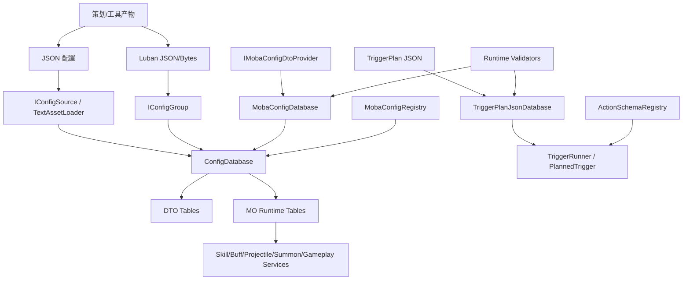

这个结构体现了两个核心设计：

1. **数据加载和业务查询分离**：通用 `ConfigDatabase` 只知道 DTO 类型、Entry 类型、文件路径和反序列化器；MOBA 业务通过 `MobaConfigDatabase` 提供语义化访问。
2. **配置数据和行为执行分离**：TriggerPlan JSON 只描述事件、条件、动作和调度；运行时依赖 `ActionRegistry` 与 `ActionSchemaRegistry` 将它们解析为可执行行为。

---

## 4. 通用配置数据库

### 4.1 表元数据

`ConfigTableDefinition` 是配置表的最小元数据单元：

| 字段 | 含义 |
|------|------|
| `FilePath` | 配置文件路径，不含扩展名。 |
| `FileWithoutExt` | `FilePath` 的别名，便于增量重载匹配。 |
| `DtoType` | 导入层 DTO 类型。 |
| `EntryType` | 运行时使用的 MO/Entry 类型。 |
| `GroupName` | 可选配置组名。 |

`IConfigTableRegistry` 提供 `Tables`、`GetTable(filePath)`、`TryGetTable(filePath, out definition)`，让配置数据库不依赖具体业务表集合。

### 4.2 加载源抽象

通用配置源有两类：

- `IConfigSource`：同时支持 `TryGetText(path, out text)` 与 `TryGetBytes(path, out bytes)`。
- `IConfigGroup`：把一组表绑定到一个 `IConfigGroupLoader` 和一个 `IConfigGroupDeserializer`，适合 Luban 或不同来源混合加载。

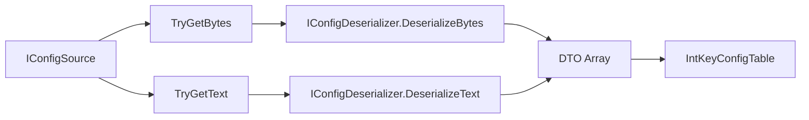

### 4.3 构表与提交

`ConfigDatabase` 的完整重载遵循“先构建下一版本、再一次性提交”的模式：

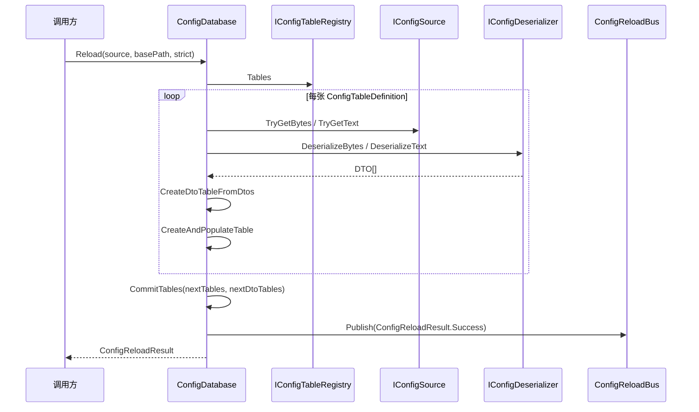

构表时，数据库会：

1. 根据 `DtoType` 反序列化出 DTO 数组。
2. 使用 `CreateDtoTableFromDtos` 构建原始 DTO 表。
3. 使用反射调用 `new EntryType(dto)` 构造运行时 Entry/MO。
4. 读取 DTO 的 `Id` 字段或属性作为主键；若没有 `Id`，则 fallback 到 Luban 常用的 `Code`。
5. 写入 `IntKeyConfigTable<TEntry>`。
6. 提交后递增 `Version` 并发布 `ConfigReloadResult`。

`Reload` 的失败路径采用提交前构表策略：数据库在循环中先填充 `nextTables` 与 `nextDtoTables`，只有所有注册表都加载、反序列化和构表成功后才调用 `CommitTables(nextTables, nextDtoTables)`。strict 模式下任一表缺失会立即发布 `ConfigReloadResult.Fail` 并返回，此时旧 `_tables`、旧 `_dtoTables` 和旧 `Version` 都保持不变；非 strict 模式下缺失表会以空 DTO 数组补齐。

`TryLoadFromSource` 的查找顺序是 bytes、fullPath text、原始 `definition.FilePath` text。这个 fallback 让 `basePath` 和裸表名两种资源组织方式可以共存，但也意味着同一张表在多个路径同时存在时，bytes 优先级最高，随后才是带 `basePath` 的文本。

### 4.4 支持的加载模式

| 模式 | 入口 | 特点 |
|------|------|------|
| Source 全量加载 | `Reload(IConfigSource source, string basePath, bool strict)` | 同时尝试 bytes 与 text，适合统一资源源。 |
| 文本字典加载 | `ReloadFromTexts(IReadOnlyDictionary<string, string> texts, string basePath)` | 测试、工具或内存构造配置。 |
| 字节字典加载 | `ReloadFromBytes(IReadOnlyDictionary<string, byte[]> bytesByKey, string basePath)` | 适合二进制导表产物。 |
| 混合加载 | `ReloadFromMixed(bytesByKey, textsByKey, bytesBasePath, textsBasePath, strict)` | 优先字节，缺失时回落文本。 |
| 配置组加载 | `ReloadFromGroups(IReadOnlyList<IConfigGroup> groups)` | 多组按顺序查找并用组级反序列化器解析。 |
| DTO 数组加载 | `ReloadFromDtoArrays(IReadOnlyDictionary<Type, Array> dtoArraysByType, bool strict)` | 测试环境、工具生成和运行时内存注入。 |
| 增量加载 | `ReloadIncremental(IReadOnlyList<IncrementalChange> changes)` | 按表更新并发布变更 ID；删除表仍要求全量重载。 |

---

## 5. MOBA 配置门面

`MobaConfigDatabase` 是 MOBA Runtime 对通用配置系统的业务封装。它内部持有：

| 字段 | 作用 |
|------|------|
| `_innerDb` | 真正存储表和执行重载的通用 `ConfigDatabase`。 |
| `_registry` | 默认使用 `MobaConfigRegistry.Instance`，决定要加载哪些表。 |
| `_deserializer` | JSON DTO 反序列化器，默认 `JsonNetMobaConfigDtoDeserializer.Instance`。 |
| `_bytesDeserializer` | 可选字节反序列化器，如 `LubanMobaConfigDtoBytesDeserializer`。 |
| `_textAssetLoader` | 平台相关文本加载器，默认 `NullTextAssetLoader.Instance`。 |

### 5.1 MOBA 表注册

`MobaRuntimeConfigTableRegistry.Tables` 注册了战斗运行时需要的表：

| 分类 | 表 |
|------|----|
| 角色与属性 | Characters、AttributeTemplates、AttributeTypes |
| 技能 | Skills、PassiveSkills、SkillFlows、SkillLevelTables、SkillButtonTemplates |
| Buff 与标签 | Buffs、TagTemplates、ContinuousTagTemplates |
| 投射物与区域 | ProjectileLaunchers、Projectiles、Aoes、Emitters |
| 召唤与组件 | Summons、ComponentTemplates、SpawnSummonActionTemplates |
| 表现与玩法 | Models、PresentationTemplates、Gameplays、SearchQueryTemplates |

### 5.2 业务访问 API

业务系统不直接调用通用 `ConfigDatabase.GetTable<T>()`，而是通过语义化方法访问：

- `GetCharacter(id)` / `TryGetCharacter(id, out mo)`
- `GetSkill(id)` / `TryGetSkill(id, out mo)`
- `GetBuff(id)` / `TryGetBuff(id, out mo)`
- `GetProjectile(id)` / `TryGetProjectile(id, out mo)`
- `TryGetTagTemplateByName(name, out mo)`
- `TryGetGameplay(id, out mo)`

这种门面可以把“表类型是什么、表在哪里、配置如何加载”从技能、Buff、投射物、召唤物、ET 生成逻辑等业务模块中隔离出去。

### 5.3 MOBA 加载流程

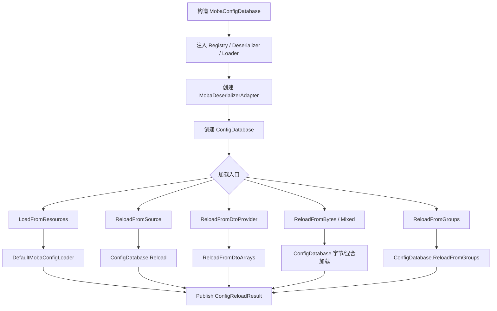

`MobaConfigDatabase` 的每个 `Reload*` 成功或失败后都会发布 MOBA 级 `ConfigReloadResult`，配置 Key 固定为 `moba.config`，用于运行时监听配置变化。

---

## 6. Luban 与多源加载

### 6.1 Luban 配置组

`LubanConfigGroup` 将 Luban 导出的 JSON 包装成 `IConfigGroup`：

- `Name` 固定为 `Luban` 或自定义名称。
- `Loader` 使用 `LubanConfigGroupLoader`。
- `Deserializer` 使用 `LubanConfigGroupDeserializer.Instance`。
- `Tables` 使用 `MobaRuntimeConfigTableRegistry.Tables`。

`LubanConfigGroupLoader.TryLoad(tableName, out bytes, out text)` 会尝试三种路径：

1. `resourcesDir/tableName`
2. `resourcesDir/underscore_case(tableName)`
3. `tableName`

这使导表命名可以在 PascalCase 与 snake_case 之间兼容。

### 6.2 Luban 字段映射

`LubanConfigGroupDeserializer` 处理 Luban JSON 与框架 DTO 的字段差异，最典型的是：

| Luban 字段 | 框架 DTO 字段 | 说明 |
|------------|---------------|------|
| `Code` | `Id` | Luban 表主键映射到运行时统一 ID。 |
| `ActiveSkills` | `SkillIds` / `ActiveSkills` | 角色与属性模板中的技能列表映射。 |
| `PassiveSkills` | `PassiveSkillIds` / `PassiveSkills` | 被动技能列表映射。 |
| `Modifiers.AttrTypeId` | `TargetId` | Buff Modifier 缺省目标修正。 |
| 数字或对象形式 | `NumericRefDTO` | 技能 Handler 参数支持常量或结构化引用。 |

反序列化器为 Character、AttributeTemplate、Skill、PassiveSkill、Buff、Projectile、Aoe、Emitter、Summon、SkillFlow、PresentationTemplate 等表都提供了专门映射逻辑。

当前 `LubanConfigGroupDeserializer` 是 JSON 文本适配器：`DeserializeFromText` 解析 `JArray`，逐行映射到框架 DTO；`DeserializeFromBytes` 会抛出 `NotSupportedException`，因此 `LubanConfigGroup` 路径不要被理解为直接支持 Luban bytes。字节导表仍然走 `MobaConfigDatabase.ReloadFromBytes`、`ReloadFromMixed` 或注入的 `IMobaConfigDtoBytesDeserializer` 路径。

### 6.3 离线导表链路

`LubanConfig/Moba` 下的脚本描述了配置进入运行时资源目录的离线链路：

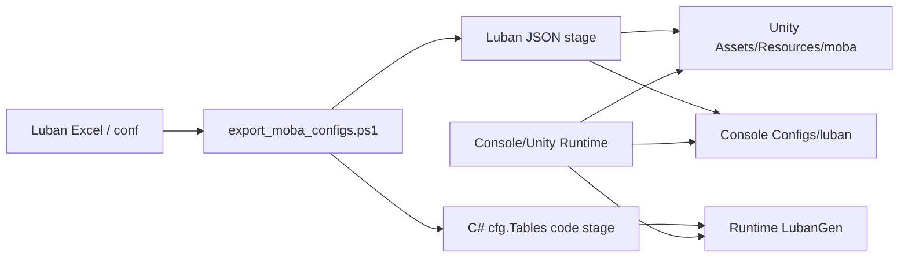

`export_moba_configs.ps1` 读取 `MiniTemplate/luban.conf`，对 `all` target 运行 Luban JSON 导出和 `cs-newtonsoft-json` 代码生成，然后复制 JSON 到 Unity Resources 与 Console 配置目录，并复制生成代码到 runtime package 的 `LubanGen`。脚本参数里保留了 bytes 输出目录和复制步骤，但当前读到的命令只显式生成 JSON 数据与 C# 代码；是否真正产出 bytes 取决于后续脚本或 Luban 命令扩展。

Trigger 配置还有两条工具链：`convert_to_source_format.ps1` 把运行时 JSON 转成带 `$schema`、metadata、actions、conditions 的 authoring source 格式；`split_trigger_configs.ps1` 将聚合 Trigger JSON 拆成 `skills`、`buffs`、`passives`、`misc` 等目录下的单文件，并可选择输出 source 格式或运行时格式。

### 6.4 多源选择策略

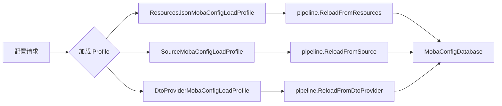

`IMobaConfigLoadProfile` 的意义是把“加载策略”变成可注入对象：

- Unity/Console 默认可以使用 Resources JSON。
- 测试环境可以使用 DTO Provider。
- ET 或服务端可以传入自己的 `IConfigSource`。

Console 端还存在一条独立的 Luban generated-code 加载路径：`ConsoleLubanConfigLoader.LoadAll` 构造 `cfg.Tables`，通过 `Func<string, JArray>` 从 `resourcesDir/tableName` 或 `resourcesDir/underscore_case(tableName)` 读取 JSON。这条路径服务于 Luban 生成代码的表访问，不等同于 `ConfigDatabase` 的 DTO/MO 构表主链路；正式业务读取仍应优先通过 `MobaConfigDatabase` 门面。

---

## 7. TriggerPlan 与 ActionSchema

AbilityKit 的配置系统不仅加载静态数值表，也加载“行为配置”。TriggerPlan 描述了在某个事件发生时应该检查什么条件、执行哪些动作、采用什么调度方式。

### 7.1 TriggerPlanConfig 模型

`TriggerPlanConfig` 包含：

| 字段 | 作用 |
|------|------|
| `TriggerId` | 触发计划业务 ID。 |
| `EventId` / `EventName` | 绑定的事件。 |
| `Phase`、`Priority`、`InterruptPriority` | 执行阶段、排序和中断优先级。 |
| `Predicate` | 条件配置。 |
| `Actions` | Action 调用配置列表。 |
| `Schedule` | Transient、Delayed、Periodic 等调度配置。 |
| `Cue` | 表现 Cue 配置。 |
| `Scope` | Global、OwnerBound 等作用域。 |

### 7.2 Action 参数 Schema

`IActionSchema<TActionArgs, TCtx>` 定义每个配置动作的参数契约：

- `ActionId`：动作 ID。
- `ArgsType`：强类型参数结构。
- `ParseArgs(namedArgs, ctx)`：从配置具名参数解析成强类型参数。
- `TryValidateArgs(args, out error)`：启动前校验参数完整性与范围。

具名参数由 `ActionArgValue` 表示，内部包含：

- `Name`：参数名，如 `damage_value`。
- `Ref`：`NumericValueRef`，可以是常量、黑板、PayloadField、变量或表达式。

### 7.3 具名参数 Action 模块

`NamedArgsPlanActionModuleBase<TActionArgs, TCtx, TModule>` 将业务 Action 模块标准化：

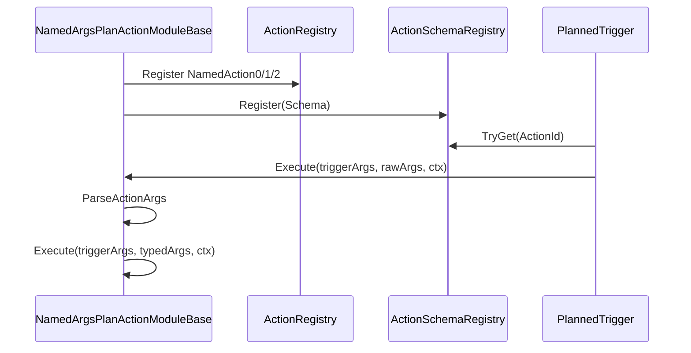

这使配置中的动作参数可以保持为具名数据，而业务执行时仍然获得强类型结构，例如伤害动作中的 `GiveDamageArgs`。

### 7.4 AutoPlanAction 与 Source Generator

`AutoPlanAction` 提供另一条低样板路径：

1. 用户继承 `AutoPlanAction`。
2. 重写 `ActionId` 与 `Execute(triggerArgs, ctx)`。
3. 可选重写 `ParseFrom(namedArgs, ctx)` 与 `TryValidateArgs`。
4. 运行时通过内置 `AutoSchemaImpl` 注册，或由 Source Generator 生成静态注册代码。

`AutoPlanActionGenerator` 会扫描继承 `AutoPlanAction` 的类，并生成：

- `AutoPlanActionRegistry.RegisterAll(actions, services)`
- 每个 Action 的 partial 注册实现
- 每个 Action 的 Schema 类型
- `NamedAction0/1/2` 委托注册

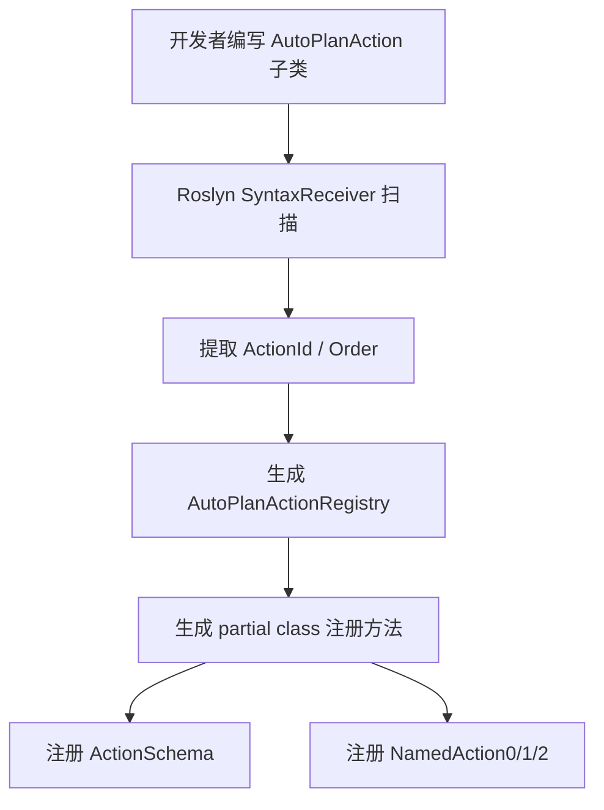

生成器的职责边界要明确：它负责把 `AutoPlanAction` 子类发现出来，按 `Order` 排序，生成 `AutoPlanActionRegistry.RegisterAll(actions, services)`、partial 注册实现、Schema 类型和 `NamedAction0/1/2` 注册代码；但当前生成的 Schema `TryValidateArgs` 直接返回 `true`。如果某个自动 Action 需要严格参数校验，不能只依赖生成代码，应该在运行时 fallback 的 `AutoPlanAction.TryValidateArgs` 路径中实现校验，或改为显式 `IActionSchema<TActionArgs, TCtx>` + `NamedArgsPlanActionModuleBase`。

> 当前源码中的 `ActionSchemaRegistry.ParseArgs` 仍是保守占位，直接返回具名参数字典；实际强类型解析主要由 `NamedArgsPlanActionModuleBase` 调用具体 Schema 的 `ParseArgs` 完成，或由 `AutoPlanAction` 实例的 `ParseFrom` 完成。

---

## 8. 配置验证与启动阻断

配置加载后并不直接进入战斗，而是通过运行时验证器检查。验证器把配置错误归类为 Error / Warning，并可标记 `blocksStartup`。

### 8.1 战斗配置引用校验

`MobaBattleConfigReferenceValidator` 覆盖范围很广：

| 校验对象 | 典型校验内容 |
|----------|--------------|
| 属性模板 | HP、MaxHP 非负，HP 不超过 MaxHP，技能/被动引用存在。 |
| 角色 | Model、AttributeTemplate、Skill、PassiveSkill 引用存在。 |
| 技能 | Button、LevelTable、PreCastFlow、CastFlow 引用存在，冷却与范围非负。 |
| 被动技能 | TriggerIds 存在且作用域符合要求。 |
| Buff | 持续时间、叠层、间隔、表现模板、持续标签模板、Modifier 目标合法。 |
| 投射物 | OnHit/OnSpawn/OnTick/OnExit Trigger 引用存在，速度、生命周期、距离合法。 |
| 发射器 | EmitterType、Duration/Interval、CountPerShot 合法。 |
| 召唤物 | Model、AttributeTemplate、Skill、PassiveSkill、ComponentTemplate、属性缩放引用合法。 |
| AOE | Model、Trigger 引用与半径、延迟、间隔等合法。 |
| Gameplay | 全局 Trigger 引用和默认时长合法。 |
| 技能流 | 禁用旧 Handler/Checks 阶段，校验 Timeline、RulePlan、Sequence、Parallel、Repeat、Delay。 |

### 8.2 TriggerPlan 完整性校验

`MobaTriggerPlanIntegrityValidator` 主要检查行为配置是否能被运行时执行：

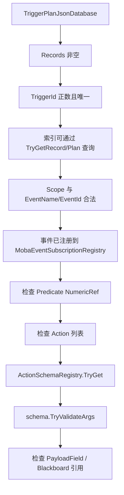

Action Schema 校验是 TriggerPlan 的启动门禁：如果配置里声明了某个动作 ID，但没有业务模块注册 Schema，验证器会报告 `moba.trigger.plan.action_schema_missing`。这能在启动阶段发现“配置引用了不存在动作”的问题，而不是等战斗中触发时才失败。

`ValidateActionArgs` 的执行顺序是先通过 `ActionSchemaRegistry.TryGet(action.Id, out schema)` 建立 Schema 门禁，再把 `ActionCallPlan.Args` 转成 `KeyValuePair<string, ActionArgValue>[]` 调用 `schema.TryValidateArgs`。如果老式 positional `Arg0` / `Arg1` 仍在使用，校验器会按 `arg0`、`arg1` 名称转换；最后还会逐个检查参数里的 `NumericValueRef`，确认 `PayloadField`、`Blackboard` 等引用在启动期不会明显失效。深度参数校验取决于具体业务 Schema；自动生成 Schema 当前只提供存在性注册，不提供参数语义检查。

---

## 9. 多端接入流程

### 9.1 Console 端

`ConsoleConfigModule` 在 World DI 中注册：

- `ITextAssetLoader` → `ConsoleTextAssetLoader`
- `IMobaConfigTableRegistry` → `MobaConfigRegistry.Instance`
- `IMobaConfigDtoDeserializer` → `JsonNetMobaConfigDtoDeserializer.Instance`
- `IMobaConfigDtoBytesDeserializer` → `LubanMobaConfigDtoBytesDeserializer`
- `DefaultMobaConfigLoader`
- `LubanConfigGroup`
- `ILubanConfigLoader` → `ConsoleLubanConfigLoader`
- `MobaConfigDatabase`
- `TriggerPlanJsonDatabase`

TriggerPlan JSON 加载流程如下：

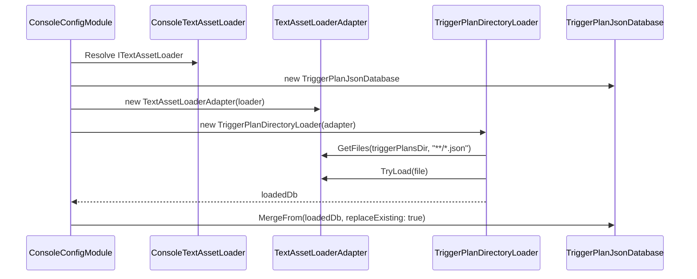

### 9.2 ET 逻辑层

`PlayerSpawnBuilder` 展示了 ET 侧如何复用正式 MOBA 配置：

1. 创建 `MobaConfigDatabase`，注入 `MobaConfigRegistry`、JSON 反序列化器、Luban 字节反序列化器和平台 `ITextAssetLoader`。
2. 创建 `MobaConfigLoadPipeline`。
3. 使用 `ResourcesJsonMobaConfigLoadProfile.Default.Load(configDatabase, loadPipeline)` 加载配置。
4. 读取 `CharacterMO` 与 `BattleAttributeTemplateMO`，构造 `ETPlayerSpawnData`。

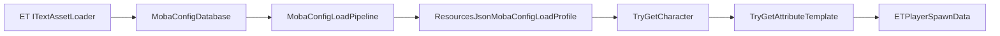

### 9.3 测试与工具

测试环境通常不需要真实文件系统，可以走 DTO Provider 或 DTO 数组加载：

- `ReloadFromDtoProvider(provider, strict)` 会遍历注册表所有 `DtoType`，要求 Provider 返回对应 DTO 数组。
- `ReloadFromDtoArrays(dtoArraysByType, strict)` 可直接从内存表构建运行时配置库。
- strict 为 `false` 时，缺失表会以空数组补齐，适合最小化单元测试。

---

## 10. 热重载与版本模型

### 10.1 全量重载

全量重载会构建完整的新表集合，成功后清空旧表并替换为新表：

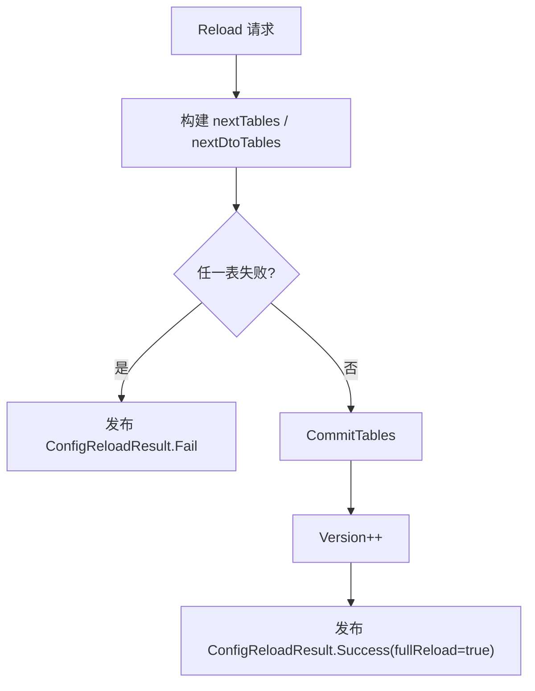

这避免了加载过程中部分表成功、部分表失败导致运行时读到半更新状态。

### 10.2 增量重载

`ConfigDatabase.ReloadIncremental` 支持按表变更：

- 根据 `IncrementalChange.TableName` 匹配 `FileWithoutExt` 或 `FilePath`。
- 重新反序列化指定表。
- 收集变更 DTO 的 ID。
- 成功后 `Version++`，发布 `fullReload=false` 和 `changedIds`。
- 删除表暂不支持直接增量删除，需要全量重载。

### 10.3 重载事件

通用库使用 `ConfigReloadBus.Publish(result)` 发布结果，MOBA 门面会将内部结果转换为 `moba.config` 的业务级结果。监听方可以根据：

- `Succeeded`
- `Version`
- `FullReload`
- `ChangedIds`
- `Error`

判断是否刷新缓存、重建技能管线、重新校验或阻断启动。

---

## 11. 扩展指南

### 11.1 新增一张业务配置表

1. 定义导入层 DTO，确保存在 int `Id` 或 `Code` 字段/属性。
2. 定义运行时 MO，并提供 `MO(DTO dto)` 构造函数。
3. 在 `MobaRuntimeConfigTableRegistry.Tables` 新增 `Entry(file, typeof(DTO), typeof(MO))`。
4. 如来自 Luban 且字段不一致，在 `LubanConfigGroupDeserializer.DeserializeItem` 增加专门映射。
5. 在 `MobaConfigDatabase` 增加 `GetXxx` / `TryGetXxx` 业务访问方法。
6. 在 `MobaBattleConfigReferenceValidator` 中补充跨表引用与数值范围校验。

### 11.2 新增配置驱动 Action

显式 Schema 路径：

1. 定义强类型 Args 结构体。
2. 实现 `IActionSchema<TActionArgs, IWorldResolver>`，负责参数解析和验证。
3. 继承 `NamedArgsPlanActionModuleBase<TActionArgs, IWorldResolver, TModule>`。
4. 在 `Register` 期间注册 Action 委托和 Schema。
5. 为 TriggerPlan JSON 增加对应 actionId 与 args。
6. 通过 `MobaTriggerPlanIntegrityValidator` 在启动时确认 Schema 和参数合法。

低样板路径可以使用 `AutoPlanAction`，但复杂业务更适合显式 Schema，因为它能更清晰地表达参数结构、Payload 依赖和验证规则。

### 11.3 新增平台加载方式

新增平台通过以下接口实现或组合加载能力：

- `ITextAssetLoader`：从平台资源系统读取文本。
- `IConfigSource`：如需统一支持 bytes/text。
- `IMobaConfigLoadProfile`：封装默认加载策略。
- `IConfigGroup`：如需接入新的导表工具或分组策略。

业务系统仍然只依赖 `MobaConfigDatabase`，不需要知道底层资源来自 Unity Resources、Console 文件系统、ET 资源系统还是测试内存。

---

## 12. 关联文档

- [事件系统](01-EventSystem.md) - 配置热重载与 TriggerPlan 执行都依赖事件/发布订阅能力。
- [触发器系统](../08-GameplayModules/02-TriggeringSystem.md) - 深入理解 TriggerPlan 如何执行。
- [技能系统架构](../08-GameplayModules/01-SkillSystemArchitecture.md) - 理解技能配置、技能流和规则计划的运行时协作。

---

*文档版本：v2.1 | 最后更新：2026-07-04*
