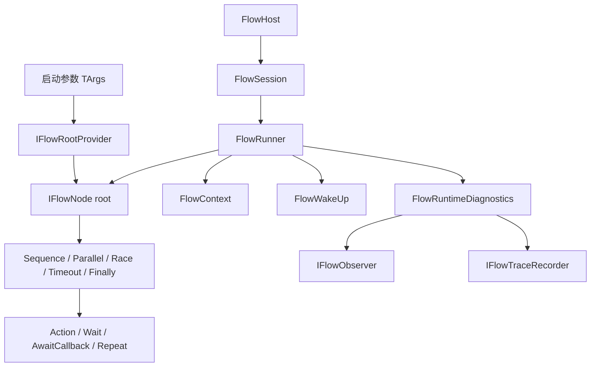
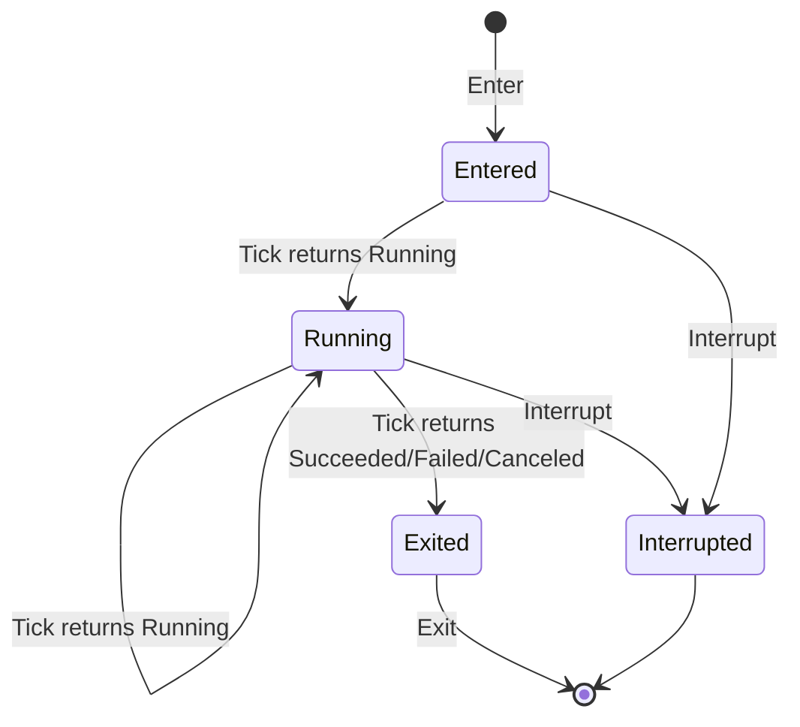
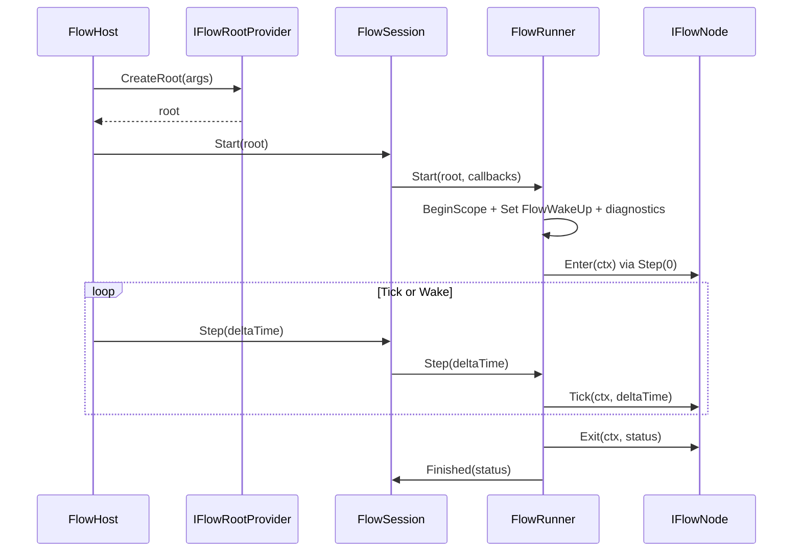
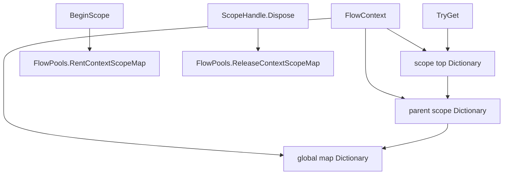
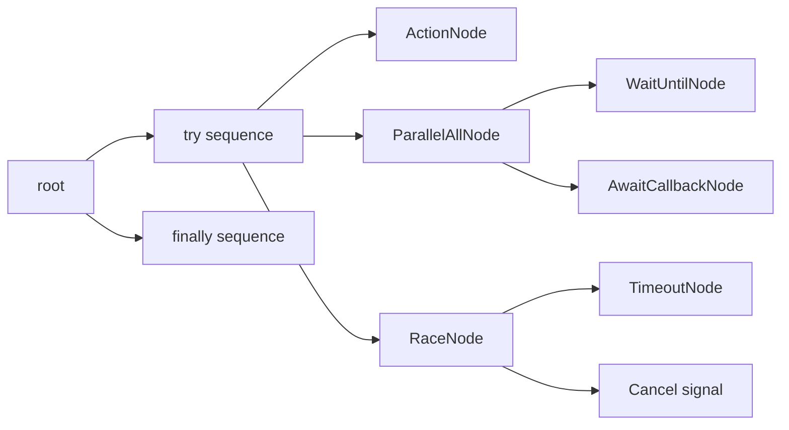
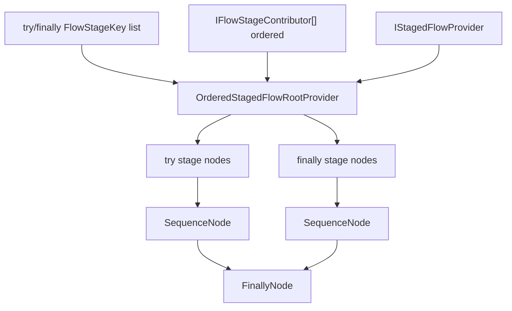
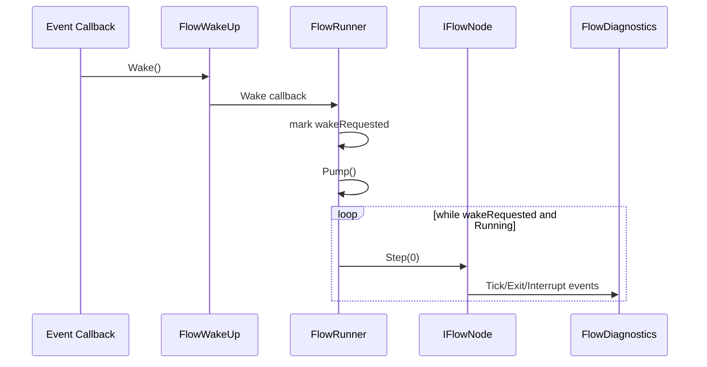

# 5.5 Flow 流程引擎

> 本文基于 `Unity/Packages/com.abilitykit.flow/Runtime` 源码说明 AbilityKit Flow 的运行模型。Flow 不是 Console Demo 里的 `BattleFlow` 命名约定，而是一套通用流程节点引擎：用 `IFlowNode` 表达可进入、可推进、可退出、可中断的流程节点，用 `FlowRunner` 承载运行状态，用 `FlowContext` 传播作用域数据，用 block 和 stage provider 组合出顺序、并行、竞速、超时和 finally 等控制结构。

---

## 目录

- [5.5 Flow 流程引擎](#55-flow-流程引擎)
  - [目录](#目录)
  - [1. 能力定位](#1-能力定位)
  - [2. 源码入口](#2-源码入口)
  - [3. 总体结构](#3-总体结构)
  - [4. 节点生命周期](#4-节点生命周期)
  - [5. Runner、Session 与 Host](#5-runnersession-与-host)
  - [6. FlowContext 与作用域数据](#6-flowcontext-与作用域数据)
  - [7. 控制结构与组合节点](#7-控制结构与组合节点)
  - [8. 阶段贡献模型](#8-阶段贡献模型)
  - [9. 唤醒、泵循环与诊断](#9-唤醒泵循环与诊断)
  - [10. 和 Pipeline、Triggering、Demo Flow 的边界](#10-和-pipelinetriggeringdemo-flow-的边界)
  - [11. 扩展边界](#11-扩展边界)
  - [12. 和其他文档的关系](#12-和其他文档的关系)

---

## 1. 能力定位

Flow 解决的是“一个可被外部 Tick 或事件唤醒推进的流程，如何用小节点组合、隔离上下文、统一中断和诊断”的问题。它适合表达：

| 场景 | Flow 负责 | 不负责 |
|------|-----------|--------|
| 会话入场 | 按顺序连接、加载、创建上下文、进入运行态 | 网络协议、房间状态本身 |
| 战斗启动 | 把准备、校验、资源创建、finally 清理组合成流程 | ECS System 的每帧业务遍历 |
| 长流程等待 | 等回调、等条件、等秒数、超时失败 | 具体条件语义和业务动作 |
| 工具或测试脚本 | 用节点复用顺序、并行、竞速、重复逻辑 | 断言框架或外部测试报告 |

设计上，Flow 的核心不是“状态机”，而是“可组合流程树”。每个节点只需要实现四段生命周期，组合节点负责把多个子节点编排成控制流。

---

## 2. 源码入口

| 类型 | 源码 | 职责 |
|------|------|------|
| `IFlowNode` | [IFlowNode.cs](../../../Unity/Packages/com.abilitykit.flow/Runtime/Flow/IFlowNode.cs) | 节点四段生命周期接口 |
| `FlowRunner` | [FlowRunner.cs](../../../Unity/Packages/com.abilitykit.flow/Runtime/Flow/FlowRunner.cs) | 单次流程运行器，维护根节点、状态、上下文、唤醒和诊断 |
| `FlowSession` | [FlowSession.cs](../../../Unity/Packages/com.abilitykit.flow/Runtime/Flow/FlowSession.cs) | 对外会话包装，复用 runner 并暴露 Started/Finished 事件 |
| `FlowHost<TArgs>` | [FlowHost.cs](../../../Unity/Packages/com.abilitykit.flow/Runtime/Flow/FlowHost.cs) | 将参数化 root provider 和 session 组合成可启动宿主 |
| `FlowContext` | [FlowContext.cs](../../../Unity/Packages/com.abilitykit.flow/Runtime/Flow/FlowContext.cs) | 按类型存取运行时对象，支持作用域栈 |
| `FlowWakeUp` | [FlowWakeUp.cs](../../../Unity/Packages/com.abilitykit.flow/Runtime/Flow/FlowWakeUp.cs) | 事件回调唤醒 runner 的轻量句柄 |
| `FlowDiagnostics` | [FlowDiagnostics.cs](../../../Unity/Packages/com.abilitykit.flow/Runtime/Flow/FlowDiagnostics.cs) | 包装 Enter/Tick/Exit/Interrupt 并记录观察事件 |
| `ParallelAllNode` | [ParallelAllNode.cs](../../../Unity/Packages/com.abilitykit.flow/Runtime/Flow/Blocks/ParallelAllNode.cs) | 所有子节点完成才结束，任一失败则整体失败 |
| `RaceNode` | [RaceNode.cs](../../../Unity/Packages/com.abilitykit.flow/Runtime/Flow/Blocks/RaceNode.cs) | 任一子节点完成后结束，并中断其他仍在运行的子节点 |
| `TimeoutNode` | [TimeoutNode.cs](../../../Unity/Packages/com.abilitykit.flow/Runtime/Flow/Blocks/TimeoutNode.cs) | 子节点超过时间后中断并失败 |
| `OrderedStagedFlowRootProvider<TArgs>` | [OrderedStagedFlowRootProvider.cs](../../../Unity/Packages/com.abilitykit.flow/Runtime/Flow/Stages/OrderedStagedFlowRootProvider.cs) | 将阶段、贡献者和核心 provider 编译成根节点 |

---

## 3. 总体结构

这条链路的关键边界是：

1. `FlowHost<TArgs>` 只知道如何从参数创建 root，不关心 root 内部结构。
2. `FlowSession` 只包装一次运行会话和外部事件，不持有业务状态。
3. `FlowRunner` 是唯一推进者，负责状态转换、异常处理、唤醒泵循环和 finally 清理。
4. `IFlowNode` 是组合单位，普通节点和 block 节点使用同一生命周期。
5. `FlowContext` 是运行时数据总线，避免把 runner、diagnostics、wake handle 等依赖塞进每个节点构造函数。

---

## 4. 节点生命周期

`IFlowNode` 的接口非常小：

| 方法 | 调用时机 | 语义 |
|------|----------|------|
| `Enter(ctx)` | 节点开始运行前 | 初始化节点本次运行状态、订阅事件、创建资源 |
| `Tick(ctx, deltaTime)` | runner 或父节点推进时 | 返回 `Running`、`Succeeded`、`Failed` 或 `Canceled` |
| `Exit(ctx)` | 节点正常结束后 | 清理正常路径资源，交给父节点或 runner 记录完成状态 |
| `Interrupt(ctx)` | 父节点、runner、超时或竞速失败时 | 撤销订阅、取消等待、释放未完成资源 |

组合节点通过同一套接口嵌套子节点。例如 `ParallelAllNode` 在 `Enter` 时进入所有子节点，在每次 `Tick` 时推进仍处于 `Running` 的子节点；`RaceNode` 在第一个子节点完成后中断其他仍在运行的子节点；`TimeoutNode` 在超时时调用子节点的 `Interrupt` 并返回失败。

---

## 5. Runner、Session 与 Host

`FlowRunner` 的 `Start` 会先清理旧流程，再创建根作用域、注入 `FlowWakeUp` 和 `FlowRuntimeDiagnostics`，把状态置为 `Running`，最后立即 `Step(0f)` 一次。

立即 prime 的意义是让根节点和子节点尽早执行 `Enter`，这样等待回调、订阅事件、注册唤醒句柄等逻辑不需要等到下一帧才生效。

`FlowSession` 和 `FlowHost<TArgs>` 都是 thin wrapper。它们的价值在于把外部 API 稳定下来：调用方只需要订阅 Started、StatusChanged、Finished、UnhandledException，再选择显式 `Step` 或由事件唤醒推进。

---

## 6. FlowContext 与作用域数据

`FlowContext` 是按 `Type` 存取的运行时对象表，并带有 scope 栈。`Set<T>` 在有 scope 时写入栈顶 scope，没有 scope 时写入全局 map；`TryGet<T>` 从当前 scope 栈向下查找，再回退到全局 map。

这个模型适合三类数据：

| 数据 | 生命周期 | 例子 |
|------|----------|------|
| Runner 注入的基础能力 | 一次 flow run | `FlowWakeUp`、`FlowRuntimeDiagnostics` |
| 外部业务上下文 | 由 host 或 root provider 决定 | 会话对象、启动参数、服务定位器、测试上下文 |
| 局部节点数据 | 某个 composite 或 stage 内部 | 临时资源、finally 清理所需的句柄 |

需要注意的是，`FlowContext` 是按类型索引，不适合同时放入多个同类型但语义不同的对象。多个同类型数据应包装成语义化上下文类型，或由调用方显式组织为一个 aggregate 对象。

---

## 7. 控制结构与组合节点

Flow 的 block 节点把常见控制结构做成可复用节点，而不是让业务流程到处手写状态字段。

| 节点 | 控制语义 | 关键行为 |
|------|----------|----------|
| `SequenceNode` | 顺序执行 | 当前子节点成功后进入下一个，失败则整体失败 |
| `ParallelAllNode` | 全部完成 | 所有子节点结束才完成，任一非成功状态使整体失败 |
| `RaceNode` | 竞速 | 第一个完成的子节点决定整体状态，其余运行中子节点被中断 |
| `TimeoutNode` | 超时保护 | 超过指定秒数后中断子节点并返回失败 |
| `FinallyNode` | 清理保障 | try 节点结束后执行 finally 节点 |
| `RepeatUntilNode` | 条件重复 | 适合轮询等待或脚本化重试 |
| `AwaitCallbackNode` | 回调等待 | 外部回调通过 wake handle 推进流程 |
| `WaitSecondsNode` / `WaitUntilNode` | 时间和条件等待 | 每帧 Tick 或被唤醒时检查完成条件 |

这些结构让 Flow 更像“流程控制语法树”，而不是单个长方法。节点的进入、中断和退出都经过 `FlowDiagnostics`，所以组合后仍能保持一致的 trace 和 observer 语义。

---

## 8. 阶段贡献模型

`OrderedStagedFlowRootProvider<TArgs>` 把阶段列表、核心 provider 和外部 contributor 合成根节点。它的构建顺序是：

1. 按 `IFlowStageContributor<TArgs>.Order` 排序 contributor。
2. 对每个 `FlowStageKey` 依次询问 contributor 是否能贡献节点。
3. 追加核心 provider 对该阶段创建的节点。
4. 多个节点包装成 `SequenceNode`，没有节点则用空 `DoNode`。
5. try stages 和 finally stages 最终包装为 `FinallyNode`。

这个模型适合做模块化启动流程。例如核心流程声明固定阶段，业务包或测试包通过 contributor 在某些阶段插入校验、日志、资源创建、mock 替换或清理节点，而不需要修改核心 provider。

---

## 9. 唤醒、泵循环与诊断

Flow 支持两种推进方式：

| 推进方式 | 入口 | 适用场景 |
|----------|------|----------|
| 外部 Tick | `FlowRunner.Step(deltaTime)` | 定时等待、每帧条件检查、宿主主循环 |
| 事件唤醒 | `FlowWakeUp.Wake()` | 回调完成、异步事件到达、不希望持续 Tick 的流程 |

`FlowRunner` 的 wake 模型有两个保护点：

1. wake 只在 `Running` 状态有效，已完成或已释放 runner 不会继续泵循环。
2. `MaxPumpIterationsPerWake` 默认限制为 128，防止一个 wake 链条不断同步触发新的 wake 导致死循环。

诊断由 `FlowRuntimeDiagnostics`、`IFlowObserver` 和 `IFlowTraceRecorder` 组成。Runner 在 run started、status changed、node enter/tick/exit/interrupt、pump limit exceeded 等关键点记录事件。这样 Flow 可以用于测试和工具，不只是运行时业务流程。

---

## 10. 和 Pipeline、Triggering、Demo Flow 的边界

| 能力 | 主要职责 | 典型使用 |
|------|----------|----------|
| Flow | 通用流程树、等待、并行、竞速、finally、事件唤醒 | 会话流程、启动流程、工具流程、脚本化测试 |
| Pipeline | 业务阶段管线，强调 context、phase、运行实例、pause/interruption/registry | 技能释放、效果阶段、持续运行时 |
| Triggering | 事件-条件-动作执行，强调事件订阅、排序、条件、动作计划和调度 | 技能规则、Buff 阶段效果、被动触发 |
| Console `BattleFlow` | 示例层阶段机，组织 Prepare/Connect/InMatch 等 Demo 阶段 | Console Demo 启动和自动测试 |

Flow 可以被业务层使用，但它本身不规定“技能阶段”或“触发器计划”的语义。若流程需要强业务上下文、运行实例查询、暂停恢复和 registry，Pipeline 更合适；若流程本质是事件触发和动作执行，Triggering 更合适；若只是示例中几个固定战斗阶段，Demo 自己的 `BattleFlow` 已经足够。

---

## 11. 扩展边界

- 新增基础流程能力时，优先实现新的 `IFlowNode`，保持节点只关心自身生命周期。
- 需要组合多个节点时，优先做 block 节点，不要把大量子节点状态散落在业务 service 中。
- 需要给标准阶段插入能力时，优先实现 `IFlowStageContributor<TArgs>`，避免修改核心 staged provider。
- 需要等待外部事件时，应在 `Enter` 中订阅，在 `Interrupt` 和 `Exit` 中解除订阅，并通过 `FlowWakeUp` 唤醒 runner。
- 长时间运行节点要明确中断语义，避免 `RaceNode`、`TimeoutNode` 或外部 `Stop` 后遗留回调。
- 放入 `FlowContext` 的对象应是语义化类型，避免同类型对象互相覆盖。
- 对可能同步连锁唤醒的节点，应保留 runner 的 pump iteration 限制，并让诊断输出足够定位是哪类节点反复 wake。

---

## 12. 和其他文档的关系

| 文档 | 关系 |
|------|------|
| [核心概念](../01-OverviewAndGettingStarted/02-CoreConcepts.md) | 该文解释 Session、Flow、Phase 等入门术语，本文补充通用 Flow 引擎源码模型 |
| [技能系统架构](../08-GameplayModules/01-SkillSystemArchitecture.md) | 该文解释技能 Pipeline，本文说明 Flow 与 Pipeline 的边界 |
| [触发器系统](../08-GameplayModules/02-TriggeringSystem.md) | Triggering 负责事件条件动作，Flow 负责流程树和等待控制 |
| [Console Demo 解析](../09-ImplementationExamples/01-ConsoleDemoAnalysis.md) | Console `BattleFlow` 是示例阶段流，不等于通用 Flow 引擎 |
