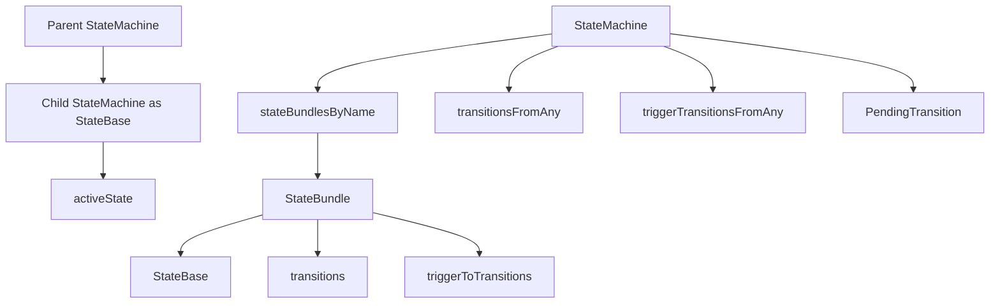
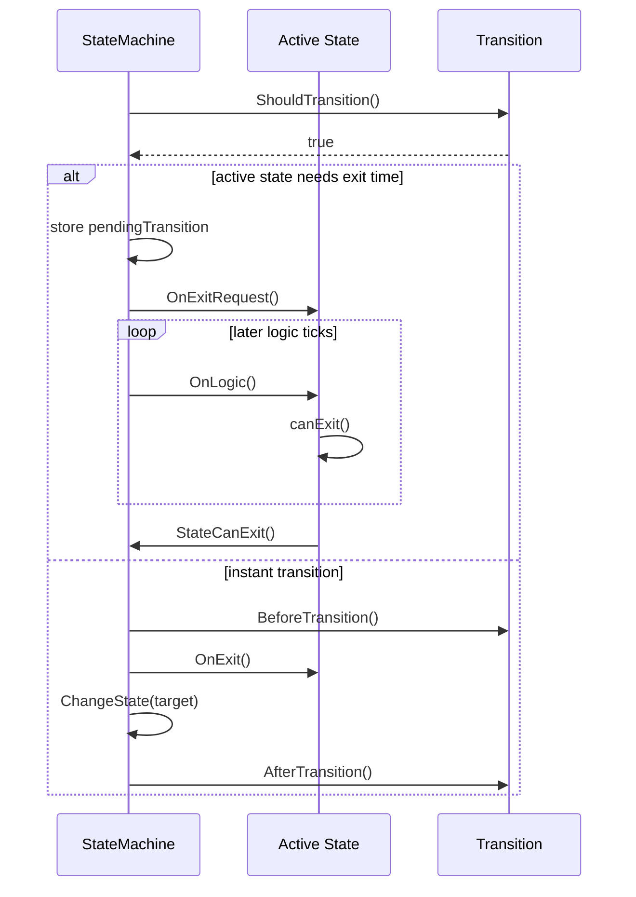
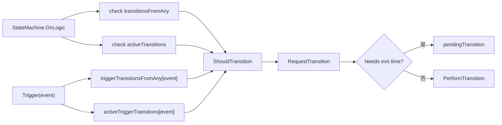
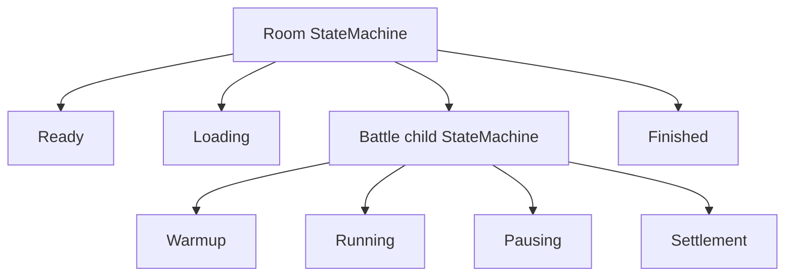
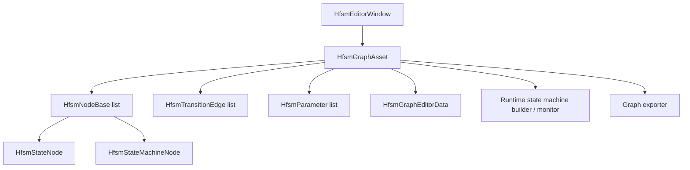
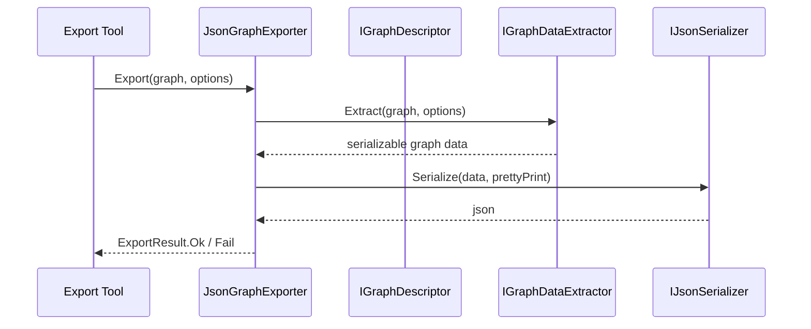

# 5.6 HFSM 分层状态机

> 本文基于 `Unity/Packages/com.abilitykit.hfsm` 源码说明 AbilityKit 的 HFSM 能力。HFSM 来自 UnityHFSM 风格的分层有限状态机，并在包内扩展了 Unity Graph Asset、编辑器、导出器、运行时可视化和 ActionBehavior 体系。它适合表达具有明确状态、转移条件、退出时间和可视化编辑需求的运行时行为。

---

## 目录

- [5.6 HFSM 分层状态机](#56-hfsm-分层状态机)
  - [目录](#目录)
  - [1. 能力定位](#1-能力定位)
  - [2. 源码入口](#2-源码入口)
  - [3. 运行时核心结构](#3-运行时核心结构)
  - [4. 状态生命周期与退出时间](#4-状态生命周期与退出时间)
  - [5. 转移模型](#5-转移模型)
  - [6. 分层状态机](#6-分层状态机)
  - [7. Unity Graph Asset 与编辑器链路](#7-unity-graph-asset-与编辑器链路)
  - [8. 导出与描述器边界](#8-导出与描述器边界)
  - [9. 和 Flow、Pipeline、Service 状态的边界](#9-和-flowpipelineservice-状态的边界)
  - [10. 扩展边界](#10-扩展边界)
  - [11. 和其他文档的关系](#11-和其他文档的关系)

---

## 1. 能力定位

HFSM 解决的是“对象或系统在有限状态之间切换，且状态可能嵌套、转移需要条件和退出时间”的问题。它和普通 enum switch 的差异在于：

| 需求 | HFSM 提供的能力 |
|------|-----------------|
| 状态有进入、逻辑、退出回调 | `State<TStateId,TEvent>` 的 `OnEnter`、`OnLogic`、`OnExit` |
| 转移有条件 | `Transition<TStateId>.ShouldTransition()` |
| 状态不能立即退出 | `needsExitTime`、`canExit`、pending transition |
| 任意状态都可能跳转 | transitions from any |
| 事件触发转移 | trigger transitions by event |
| 状态机可以嵌套 | `StateMachine<TOwnId,TStateId,TEvent>` 继承 `StateBase<TOwnId>` |
| 需要工具可视化 | `HfsmGraphAsset`、editor window、runtime monitor、exporter |

HFSM 的设计重点是“状态归属清晰、转移可解释、退出时间可控”。如果只是顺序执行几个步骤，Flow 更轻；如果是技能阶段和上下文推进，Pipeline 更贴近业务；如果是对象行为模式切换、AI 状态、表现状态或房间阶段，HFSM 更直接。

---

## 2. 源码入口

| 类型 | 源码 | 职责 |
|------|------|------|
| `StateMachine<TOwnId,TStateId,TEvent>` | [StateMachine.cs](../../../Unity/Packages/com.abilitykit.hfsm/Runtime/HFSM/Core/StateMachine/StateMachine.cs) | 分层状态机核心，管理状态、转移、pending transition、active state |
| `State<TStateId,TEvent>` | [State.cs](../../../Unity/Packages/com.abilitykit.hfsm/Runtime/HFSM/Core/States/State.cs) | 普通状态实现，封装 enter/logic/exit/canExit/timer |
| `Transition<TStateId>` | [Transition.cs](../../../Unity/Packages/com.abilitykit.hfsm/Runtime/HFSM/Core/Transitions/Transition.cs) | 条件转移，支持 before/after transition 回调 |
| `TransitionBase<TStateId>` | [TransitionBase.cs](../../../Unity/Packages/com.abilitykit.hfsm/Runtime/HFSM/Core/Transitions/TransitionBase.cs) | 转移基类，保存 from/to/forceInstantly 等基础信息 |
| `HfsmGraphAsset` | [HfsmGraphAsset.cs](../../../Unity/Packages/com.abilitykit.hfsm/Runtime/HFSM/Unity/Graph/HfsmGraphAsset.cs) | Unity ScriptableObject 图资产，保存节点、边、参数、编辑器数据 |
| `JsonGraphExporter` | [JsonGraphExporter.cs](../../../Unity/Packages/com.abilitykit.hfsm/Editor/Export/JsonGraphExporter.cs) | 将 graph descriptor 导出为 JSON，用于运行时加载和调试 |
| `HfsmEditorWindow` | [HfsmEditorWindow.cs](../../../Unity/Packages/com.abilitykit.hfsm/Editor/Window/HfsmEditorWindow.cs) | Unity 编辑器窗口入口 |
| `RuntimeMonitor` | [RuntimeMonitor.cs](../../../Unity/Packages/com.abilitykit.hfsm/Editor/Runtime/RuntimeMonitor.cs) | 编辑器运行时监控入口 |

---

## 3. 运行时核心结构

`StateMachine<TOwnId,TStateId,TEvent>` 自身也是一个 `StateBase<TOwnId>`，因此父状态机可以把子状态机当作一个普通状态挂载。这是分层状态机的核心。

运行时字段体现了几个关键设计：

| 字段 | 作用 |
|------|------|
| `stateBundlesByName` | 以状态 ID 保存状态对象、普通转移和事件转移 |
| `activeState` | 当前正在运行的状态 |
| `activeTransitions` | 当前状态可用的普通转移列表 |
| `activeTriggerTransitions` | 当前状态可用的事件转移索引 |
| `transitionsFromAny` | 从任意状态都可判定的普通转移 |
| `triggerTransitionsFromAny` | 从任意状态都可响应的事件转移 |
| `pendingTransition` | 因退出时间未满足而挂起的转移 |
| `startState` | 初始状态 |
| `rememberLastState` | 状态机重入时是否恢复上次状态 |

---

## 4. 状态生命周期与退出时间

`State<TStateId,TEvent>` 把状态行为压缩成四类回调：

| 回调 | 来源 | 作用 |
|------|------|------|
| `onEnter` | 构造注入 | 进入状态时执行，并重置 timer |
| `onLogic` | 构造注入 | 每次状态机 logic tick 时执行 |
| `onExit` | 构造注入 | 离开状态时执行 |
| `canExit` | 构造注入 | 判断 pending transition 是否可以真正执行 |

退出时间是 HFSM 相比简单状态机更重要的部分。状态如果声明需要 exit time，状态机不会在转移条件满足时立刻切走，而是把目标转移写入 `pendingTransition`。随后状态的 `OnLogic` 或 `OnExitRequest` 在 `canExit` 返回 true 时调用 `fsm.StateCanExit()`。

这个机制适合动画收尾、技能前摇后摇、房间阶段确认、AI 行为退出保护等场景。转移条件可以先满足，但状态可以决定何时真正放行。

---

## 5. 转移模型

`Transition<TStateId>` 由四部分组成：

| 成员 | 作用 |
|------|------|
| `from` | 来源状态 |
| `to` | 目标状态 |
| `condition` | 返回 true 时允许转移 |
| `beforeTransition` / `afterTransition` | 转移前后回调 |
| `forceInstantly` | 必要时绕过退出等待，直接执行转移 |

状态转移的设计要点：

1. 普通转移适合每次 logic tick 判定。
2. trigger 转移适合外部事件直接驱动。
3. from any 转移适合全局打断，例如死亡、断线、战斗结束。
4. before/after 回调适合记录诊断、清理外部资源或发送状态变更事件。
5. force instant 应谨慎使用，它会绕过 exit-time 语义。

---

## 6. 分层状态机

分层状态机让复杂状态拆成多个层级。例如战斗房间可以把 Ready、Loading、InBattle、Finished 放在外层；InBattle 内部再有 Warmup、Running、Pausing、Settlement；某个 AI actor 内部还可以有 Patrol、Chase、Cast、Retreat。

分层的收益是：

| 收益 | 说明 |
|------|------|
| 局部转移收敛 | 子状态机只处理自己层级内的转移，父层不需要知道每个细节状态 |
| 父层可整体打断 | 父状态离开时，子状态机作为 state 一起退出 |
| 重用状态组 | 某些行为状态机可以在多个父状态下复用 |
| 运行时观察更清晰 | 当前活跃路径能表达为父状态到子状态的链路 |

---

## 7. Unity Graph Asset 与编辑器链路

`HfsmGraphAsset` 是 Unity 侧的图资产。它保存：

| 数据 | 字段 | 说明 |
|------|------|------|
| 图名称 | `_graphName` | 编辑器和导出显示名 |
| 节点 | `_nodes` | 多态节点集合，包含普通状态节点和状态机节点 |
| 序列化节点辅助 | `_serializedStateNodes`、`_serializedStateMachineNodes` | Unity 多态序列化兼容数据 |
| 边 | `_edges` | 状态转移边 |
| 参数 | `_parameters` | 条件和行为可引用的参数 |
| 根状态机 | `_rootStateMachineId` | 图的运行时入口 |
| 编辑器数据 | `_editorData` | zoom、pan、节点位置等视图状态 |

Graph asset 层有两个职责边界：

1. 保存 authoring 数据和编辑器视图数据。
2. 提供节点、边、参数的增删查和 GraphChanged 事件。

它不应该直接承载具体业务逻辑。业务行为应通过状态回调、ActionBehavior、参数绑定或运行时构建器接入。

---

## 8. 导出与描述器边界

`JsonGraphExporter` 不是直接读取 Unity 对象字段然后拼 JSON，而是依赖 `IGraphDescriptor`、`IGraphDataExtractor` 和 `IJsonSerializer`：

这个边界让导出器可以服务三类场景：

| 场景 | 价值 |
|------|------|
| 编辑器导出 | 将 ScriptableObject 图变成可检查的 JSON artifact |
| 运行时加载 | 为非 Unity 或热更新路径提供中间描述格式 |
| 调试与验收 | 导出图结构后可做版本比较、静态检查和自动化验证 |

导出失败会返回 `ExportResult.Fail`，不会把异常直接抛给调用方。这更适合编辑器工具链，因为工具面板可以展示错误而不是中断整个编辑器流程。

---

## 9. 和 Flow、Pipeline、Service 状态的边界

| 能力 | 适合表达 | 不适合表达 |
|------|----------|------------|
| HFSM | 状态、转移、退出时间、分层行为、可视化状态图 | 纯顺序脚本、大量一次性节点组合 |
| Flow | 顺序、并行、等待、竞速、finally、事件唤醒 | 长期状态归属和复杂转移图 |
| Pipeline | 带上下文的业务阶段执行、暂停恢复、中断、运行实例查询 | 通用图形化状态 authoring |
| Service 内部状态 | 简单业务阶段、少量 enum、局部生命周期 | 复杂分层转移和可视化调试 |

判断是否该用 HFSM，可以看三点：

1. 是否有稳定的状态集合和状态间转移关系。
2. 是否需要等待状态自己确认可以退出。
3. 是否需要在编辑器或运行时观察当前状态路径。

如果答案是否定的，直接使用 service 字段、Flow 节点或 Pipeline phase 通常更轻。

---

## 10. 扩展边界

- 新增状态行为时，优先封装为状态回调或 ActionBehavior，不要让状态机核心知道业务服务类型。
- 需要全局打断时，使用 from any transition，但要控制优先级和触发条件，避免普通状态转移被意外覆盖。
- 需要动画、技能后摇、网络确认等退出保护时，使用 exit-time/pending transition，而不是在外部强行切状态。
- Graph Asset 应保存 authoring 数据，运行时对象应由 builder 或 adapter 创建，避免编辑器资产直接持有运行时实例。
- 导出链路应通过 descriptor/extractor/serializer 组合扩展，避免每种格式都直接依赖 Unity 序列化字段。
- 分层状态机不要过度嵌套。超过两到三层后，应检查是否有一部分其实是 Flow 或 Pipeline。
- 运行时监控和 trace 应读取状态机公开检查接口，不应反射修改内部字段。

---

## 11. 和其他文档的关系

| 文档 | 关系 |
|------|------|
| [核心概念](../01-OverviewAndGettingStarted/02-CoreConcepts.md) | 该文只提到状态机类概念，本文补充 HFSM runtime 和 Unity 工具链 |
| [系统设计](../02-LogicalWorldDesign/04-SystemDesign.md) | Service 可以维护简单状态，HFSM 适合复杂状态图和退出时间 |
| [Flow 流程引擎](05-FlowEngine.md) | Flow 负责流程树，HFSM 负责状态图，两者都可用于启动和行为编排但边界不同 |
| [技能系统架构](../08-GameplayModules/01-SkillSystemArchitecture.md) | 技能 Pipeline 适合释放阶段，HFSM 适合长期行为或表现/AI 状态 |
| [测试流程](../10-EngineeringQuality/01-TestingWorkflow.md) | HFSM 包有独立测试入口，状态机变更应纳入 Unity 包内回归 |
