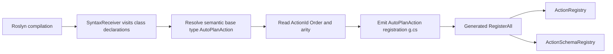
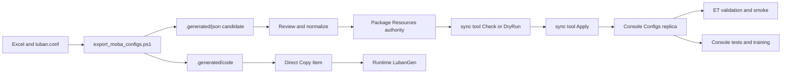

# CodeGen 与 Luban 生产链路

> 本文说明 AbilityKit 的生成时与发布时供应链：生成资产由谁拥有、Roslyn Source Generator 与运行时 CodeGen API 各自做什么、Luban JSON/C# 如何进入候选区和生产目录，以及当前可执行门禁与尚未闭合的故障边界。
>
> 运行时配置加载、`ConfigDatabase` 原子换表、MOBA 强类型查询、TriggerPlan 与 ActionSchema 执行语义见 [配置系统](04-ConfigurationSystem.md)。本文不重复这些运行时职责。

---

## 1. 能力定位与边界

这条链路解决的是“源码或策划数据如何转化为可编译、可评审、可发布资产”，而不是“战斗运行时如何消费配置”。当前仓库实际存在三条相邻但没有完全统一的能力面：

| 能力面 | 输入 | 输出 | 当前定位 |
|--------|------|------|----------|
| Roslyn Source Generator | C# 语法树与语义模型 | 编译期 `.g.cs` | 为 `AutoPlanAction`、`AutoPredicate` 生成注册代码 |
| 运行时 CodeGen API | `GeneratorContext`、Attribute、手动注册的 `ICodeGenerator` | `GenerationResult` 与 `OutputFile` | 提供工具层抽象，不自动扫描、调度或落盘 |
| Luban 导出与发布 | Excel、`luban.conf`、生成参数 | 候选 JSON、生成 C#、生产 JSON 副本 | 将策划数据转换为运行资产，并维持 package 权威源与 Console 副本 |

本文负责：

- 生成器源码、Analyzer DLL、生成 C# 和 JSON 的所有权；
- 编译期生成、运行时生成抽象和 Luban 导出的实际调用边界；
- 候选、权威内容和发布副本之间的晋升关系；
- 构建失败、生成失败、漂移和业务配置校验的传播方式；
- 当前可执行验证以及必须继续补齐的门禁。

本文不负责：

- `MobaConfigDatabase` 的查询、reload 和 DTO/MO 映射；
- TriggerPlan 的运行时解析与 Action 执行；
- Protocol Editor 等专用生成器；
- 把尚未接线的 API 描述成完整生产框架。

---

## 2. 源码与工具入口

### 2.1 CodeGen

| 入口 | 职责 |
|------|------|
| [AbilityKit.SourceGenerator.csproj](../../../Unity/Packages/com.abilitykit.codegen/DotNet~/AbilityKit.SourceGenerator/AbilityKit.SourceGenerator.csproj) | Roslyn 生成器工程，目标框架为 `netstandard2.0`，构建后复制 DLL 到 package 根目录。 |
| [AutoPlanActionGenerator.cs](../../../Unity/Packages/com.abilitykit.codegen/DotNet~/AbilityKit.SourceGenerator/Generator/AutoPlanActionGenerator.cs) | 扫描 `AutoPlanAction` 子类，生成 Action 委托、Schema 和批量注册入口。 |
| [AutoPredicateGenerator.cs](../../../Unity/Packages/com.abilitykit.codegen/DotNet~/AbilityKit.SourceGenerator/Generator/AutoPredicateGenerator.cs) | 扫描 `AutoPredicate` 子类，生成条件类型注册入口。 |
| [GeneratorRegistry.cs](../../../Unity/Packages/com.abilitykit.codegen/Runtime/AbilityKit.CodeGen/Registration/GeneratorRegistry.cs) | 运行时/工具层生成器注册表和 `SubFeatureGeneratorBase`。 |
| [GeneratorContext.cs](../../../Unity/Packages/com.abilitykit.codegen/Runtime/AbilityKit.CodeGen/Core/GeneratorContext.cs) | 描述符号、Attribute、声明类型、程序集、编译和取消令牌。 |
| [GenerationResult.cs](../../../Unity/Packages/com.abilitykit.codegen/Runtime/AbilityKit.CodeGen/Core/GenerationResult.cs) | 表达成功、失败、诊断、输出文件和生成目标。 |
| [包内 CodeGen 设计文档](../../../Unity/Packages/com.abilitykit.codegen/Document/Codegen代码生成模块开发设计文档.md) | 包级 API 摘要；本文补充跨工具生产链和当前实现状态。 |

### 2.2 Luban 与发布

| 入口 | 职责 |
|------|------|
| [luban.conf](../../../LubanConfig/Moba/MiniTemplate/luban.conf) | 定义 `c`、`s`、`e` 分组和 `server`、`client`、`all` 导出目标。 |
| [export_moba_configs.ps1](../../../LubanConfig/Moba/export_moba_configs.ps1) | 生成候选 JSON 和 C#，并将 C# 复制到 runtime `LubanGen`。 |
| [sync_moba_json_configs.ps1](../../../tools/sync_moba_json_configs.ps1) | 检查或发布 package 权威 JSON 到 Console 副本。 |
| [run_et_battle_smoke.ps1](../../../tools/run_et_battle_smoke.ps1) | 默认在 ET smoke 前执行生产配置样例校验，可显式跳过。 |
| [ET App Program.cs](../../../src/AbilityKit.Demo.ET.App/Program.cs) | 实现 `--validate-config-only`，校验文件形状和 ET smoke 所需业务引用。 |
| [MOBA 测试工程](../../../src/AbilityKit.Demo.Moba.Tests/AbilityKit.Demo.Moba.Tests.csproj) | 将 Console `Configs` 发布副本复制到测试输出；多数配置单测仍使用内存 DTO。 |

---

## 3. 生成资产所有权

生成目录不能只按“文件存在”判断是否可发布。必须先识别资产角色：

| 资产 | 位置 | 所有权与变更规则 |
|------|------|------------------|
| 生成器源码 | `com.abilitykit.codegen/DotNet~/AbilityKit.SourceGenerator` | 人工维护源码，是 Analyzer DLL 的构建输入。 |
| Analyzer DLL | `com.abilitykit.codegen/AbilityKit.SourceGenerator.dll` | 构建产物；应由生成器工程重建，不应独立手改。 |
| Luban authoring input | `LubanConfig/Moba/MiniTemplate` | Excel、schema 和 `luban.conf` 等导出输入。 |
| 候选 JSON | `LubanConfig/Moba/.generated/json` | 评审区，不是生产权威源，不能直接宣称已发布。 |
| 候选 C# | `LubanConfig/Moba/.generated/code` | 临时生成区；当前脚本随后直接复制其内容。 |
| Luban runtime C# | `com.abilitykit.demo.moba.runtime/.../LubanGen` | 运行时生成代码副本，必须与生成输入和所用生成器版本一致。 |
| 生产 JSON 权威源 | `com.abilitykit.demo.moba.view.runtime/Resources/moba` 与 `ability` | 唯一生产内容源；评审通过的候选先晋升到这里。 |
| Console JSON 副本 | `src/AbilityKit.Demo.Moba.Console/Configs/moba` 与 `ability` | 由同步工具从 package 发布，禁止反向覆盖权威源。 |

`.generated/json` 的“生成成功”和生产 JSON 的“评审通过”是两个不同事件。前者只证明 Luban 产生了候选文件，后者才允许将内容合入 package 权威目录。

---

## 4. Roslyn Source Generator

### 4.1 接入方式

`AbilityKit.SourceGenerator.csproj` 引用 Roslyn 3.9.0，并在 `CustomAfterBuild` 中将 `AbilityKit.SourceGenerator.dll` 复制到 package 根目录。Unity 生成的项目通过 Analyzer 引用消费该 DLL，因此稳定维护入口是生成器工程和 package DLL，而不是手工修改 Unity 生成的 `.csproj`。

包描述声称提供 incremental generation support，但当前两个业务生成器实现的是传统 `ISourceGenerator`，使用 `RegisterForSyntaxNotifications` 与 `ISyntaxContextReceiver`，并非 `IIncrementalGenerator`。能力说明应以源码为准。

### 4.2 AutoPlanAction 生成流程



生成器按 `Order` 排序 Action，并根据参数数量生成零、一、二参数委托，同时生成对应 `IActionSchema`。当前有四个必须保守描述的边界：

1. `ActionId` 和 `Order` 只读取可直接解析的 literal expression；复杂常量表达式可能退回默认值。
2. 生成 Action 委托捕获执行异常并写日志，不把异常继续传播给调用者。
3. 生成 Schema 的 `TryValidateArgs` 当前无条件返回成功，不能替代业务 Action 自身的严格参数校验。
4. 生成的 `RegisterAll` 使用进程级静态 `_registered`。第一次注册后，后续不同 `ActionRegistry` 实例也会被跳过，测试隔离和多世界注册不能假设实例独立。

### 4.3 AutoPredicate 生成流程

`AutoPredicateGenerator` 扫描 `AutoPredicate` 子类，生成 `AutoPredicateRegistry.RegisterAll()`，再向 `TriggerConditionRegistry.Instance` 注册类型字符串和实现类型。它同样使用静态 `_registered`，因此注册状态跨调用方共享。

仓库源码搜索没有发现 `AutoPlanActionRegistry.RegisterAll` 或 `AutoPredicateRegistry.RegisterAll` 的调用点。即使生成代码存在，也不能据此证明运行时已经执行注册；启动装配必须提供显式调用证据。

### 4.4 当前构建状态

当前执行以下命令会失败：

```powershell
dotnet build "Unity\Packages\com.abilitykit.codegen\DotNet~\AbilityKit.SourceGenerator\AbilityKit.SourceGenerator.csproj" --configuration Release --nologo
```

两个生成器文件在同一命名空间都定义了 `SyntaxReceiver`，产生 `CS0101` 和 `CS0111`。这会阻断由源码重建 Analyzer DLL，也意味着 package 中已有 DLL 不能仅凭存在就证明与当前源码一致。

工程文件还存在两个构建配置风险：

- Release 的 `OutputPath` 仍指向 `obj/Debug`；
- `IncludeBuildOutput` 重复声明。

这些问题不会替代重复类型这个直接编译错误，但会降低产物溯源清晰度，修复生成器时应一并治理。

---

## 5. 运行时 CodeGen API

### 5.1 注册与查询

`GeneratorRegistry` 维护两套全局索引：按生成器 ID 查询，以及按 Trigger Attribute 类型查询。注册行为包括：

- 相同 ID 重复注册时抛出 `InvalidOperationException`；
- 同一 Attribute 下按 `Priority` 降序排列；
- `GetGeneratorsForAttribute` 返回列表快照；
- `Clear` 清空全局状态，测试需要自行隔离；
- `Generators` 暴露内部 dictionary 的只读接口视图，getter 锁释放后不应假设并发枚举稳定。

### 5.2 结果语义

`GenerationResult` 区分三种结果：

| 工厂方法 | `Success` | 输出 | 语义 |
|----------|-----------|------|------|
| `SuccessResult` | `true` | 可包含多个 `OutputFile` | 生成完成 |
| `FailureResult` | `false` | 通常无输出 | 生成失败并携带错误信息 |
| `DiagnosticResult` | `true` | 可以无输出 | 只报告诊断，不等同于失败 |

因此调用方不能用“输出文件数为零”推断失败，也不能只看 `Success` 就忽略 diagnostics。

### 5.3 尚未打通的边界

运行时 CodeGen API 与 Roslyn Source Generator 共享“生成”概念，但当前没有自动桥接证据：

- `RegisterFromType(Type)` 验证 `RegisterGeneratorAttribute` 后直接返回 `null`，尚未完成实例化和注册；
- 没有发现程序集自动扫描入口；
- 没有统一调度器把 `GeneratorContext` 分发给匹配生成器；
- 没有统一输出落盘、冲突处理或事务提交实现；
- 没有发现该 API 驱动 Roslyn generators 或 Luban 的调用链。

所以当前应把它定位为“可供工具层手动组装的模型”，而不是生产中自动运行的 CodeGen 平台。

---

## 6. Luban 候选、晋升与发布

### 6.1 非对称导出链路



`luban.conf` 的 `all` target 包含 `c`、`s`、`e` 三组。导出脚本对同一 target 分两次调用 Luban：

1. `-d json` 输出到 `.generated/json`，仅作为 review candidate；
2. `-c cs-newtonsoft-json` 输出到 `.generated/code`，随后直接复制到 runtime `LubanGen`。

这是一个有意保留的非对称模型：JSON 需要评审和晋升，C# 当前直接发布。原因是现有 MiniTemplate 不能代表完整生产 JSON；若让候选区直接覆盖 package，会删除或降级不在模板中的生产内容。

### 6.2 JSON 同步工具

`sync_moba_json_configs.ps1` 只允许 package `Resources` 作为 source，并只管理 `moba` 与 `ability` 两个 publication directory。模式语义如下：

| 模式 | 行为 |
|------|------|
| 默认 / `-Check` | 解析并规范化 JSON，检测 changed、missing、extra、invalid，不写文件。 |
| `-DryRun` | 展示将发生的发布变化，不写文件。 |
| `-Apply` | 从 package 权威源发布到 Console 副本。 |
| `-DeleteExtra` | 仅在受管目录范围内删除副本多余项。 |

脚本拒绝将 Console 指向 Unity，也拒绝非 package 权威源。比较基于解析后的规范化 JSON，不会把纯格式差异误判为语义变化。漂移时 Check 返回退出码 2，非法 JSON 返回退出码 3，适合接入 CI。

### 6.3 ET 配置验证

ET App 的 `--validate-config-only` 从 ET App `Configs` 副本读取：

- `moba/characters.json`；
- `moba/attribute_templates.json`；
- `moba/skills.json`；
- `moba/gameplays.json`；
- `ability/triggers/skills/trigger_10001.json`。

校验覆盖 JSON 根形状、英雄 1001、属性模板 1001、三个 smoke 技能、CastFlow、冷却、基础攻击，以及 trigger 10001 的启用状态和正数 `give_damage` Action。失败返回 4，未捕获异常由主入口返回 1。

这是 ET smoke 所需业务样例的内容门禁，不是所有 MOBA 表和所有引用的全量完整性验证。`run_et_battle_smoke.ps1` 默认先执行该命令并检查 `$LASTEXITCODE`，但 `-SkipConfigValidation` 可以显式跳过。

---

## 7. 失败传播与恢复边界

| 阶段 | 当前行为 | 风险或恢复动作 |
|------|----------|----------------|
| Source Generator 构建 | 重复 `SyntaxReceiver` 导致编译失败 | 修复类型命名后重建 DLL，并验证生成代码；不能继续信任旧 DLL 与源码一致。 |
| Roslyn 生成注册 | 生成静态 `RegisterAll`，但仓库未发现调用点 | 在明确启动边界调用，并增加注册结果测试。 |
| Action Schema 生成 | `TryValidateArgs` 无条件成功 | 关键 Action 必须实现或保留业务级严格校验。 |
| runtime `RegisterFromType` | 返回 `null` | 调用方不得依赖该快捷入口；完成实现前只能显式构造并 `Register`。 |
| Luban 输入/DLL 缺失 | 导出脚本在调用前退出 1 | 修复路径或工具安装后重跑。 |
| Luban 原生进程失败 | 两次 `dotnet` 后未检查 `$LASTEXITCODE` | 当前可能继续生成下一阶段并复制旧/部分 C#；发布前人工检查，后续应显式失败即停。 |
| staging 已有旧文件 | 脚本只创建目录，不预清理、不验证输出集合 | 不能用目录非空证明本次生成完整；应清理 staging 或写 manifest 后再发布。 |
| 候选 JSON 生成 | 只进入 `.generated/json` | 评审后人工晋升到 package，禁止直接当作生产数据。 |
| JSON 副本漂移 | 同步工具 Check 非零退出 | 使用 `-DryRun` 审阅，再用 `-Apply` 发布并复查。 |
| ET 样例配置无效 | 校验返回 4，smoke wrapper 抛错 | 修复 package 权威源，重新发布副本，再执行校验。 |

`$ErrorActionPreference = "Stop"` 主要控制 PowerShell 错误，不能替代对原生 `dotnet` 进程退出码的检查。导出脚本当前的两次 Luban 调用必须被视为失败传播缺口。

---

## 8. 当前验证矩阵

| 验证目标 | 命令 | 当前证据 |
|----------|------|----------|
| package 与 Console JSON 语义一致 | `powershell -ExecutionPolicy Bypass -File tools\sync_moba_json_configs.ps1 -Check` | 可执行的漂移与非法 JSON门禁。 |
| ET smoke 所需生产配置可用 | `dotnet run --project src\AbilityKit.Demo.ET.App\AbilityKit.Demo.ET.App.csproj -- --validate-config-only` | 检查五类文件和固定业务样例，失败有非零退出码。 |
| ET smoke 连同默认配置前置校验 | `powershell -ExecutionPolicy Bypass -File tools\run_et_battle_smoke.ps1` | 默认先校验配置；可被 `-SkipConfigValidation` 跳过。 |
| MOBA 测试工程 | `dotnet test src\AbilityKit.Demo.Moba.Tests\AbilityKit.Demo.Moba.Tests.csproj` | 工程复制 Console 配置副本，但多数配置单测使用内存 DTO，不等价于全量生产文件测试。 |
| Source Generator 可重建 | `dotnet build Unity\Packages\com.abilitykit.codegen\DotNet~\AbilityKit.SourceGenerator\AbilityKit.SourceGenerator.csproj -c Release` | 当前失败：重复 `SyntaxReceiver`，应保持红灯直到修复。 |

当前 `.github` workflow 搜索未发现 CodeGen、Luban 导出、JSON 同步或 ET 配置校验的接入。上述命令是可执行入口，但尚不能宣称已形成持续集成门禁。

2026-07-15 本批实测基线：

- ET `--validate-config-only` 通过，加载 5 个文件并检查 6 个业务项；构建过程仍输出既有依赖漏洞、兼容性和可空性警告。
- JSON 同步 `-Check` 返回 2：56 个 changed、51 个 missing、6 个 extra、0 个 invalid。当前 package 权威源与 Console 副本存在语义漂移，未自动执行 `-Apply`，避免覆盖未评审的并行配置变更。
- Source Generator Release 构建失败：重复 `SyntaxReceiver` 产生 `CS0101`、`CS0111`，0 个 warning、2 个 error。

---

## 9. 生产化收敛顺序

按风险和依赖关系，建议依次完成：

1. 修复两个 Source Generator 的 receiver 类型冲突，整理 Release 输出路径并重建 Analyzer DLL。
2. 为两个生成器增加 Roslyn compilation tests，断言生成源码、诊断、排序、Schema 和重复注册行为。
3. 在明确的启动装配点调用生成的两个 `RegisterAll`，并用测试证明 Action/Predicate 可解析。
4. 完成或删除 `RegisterFromType`，避免公开 API 返回 `null` 的半实现状态。
5. 为 Luban 导出脚本增加每次原生进程退出码检查、staging 预清理和输出 manifest/完整性校验。
6. 保持 JSON 的候选评审模型，并将 `sync_moba_json_configs.ps1 -Check` 接入 CI。
7. 将 ET `--validate-config-only` 作为业务 smoke 门禁，同时另建覆盖所有生产表与跨表引用的完整性测试。
8. 对生成器源码、Analyzer DLL、Luban 版本、authoring input 和生成产物记录可比对的版本或 hash。

收敛完成前，CodeGen 与 Luban 应被描述为“已有局部生产链和明确权威源，但自动注册、生成器构建与 CI 闭环仍不完整”。
