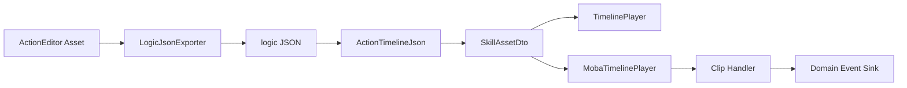
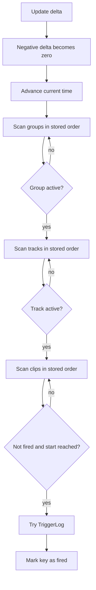

# ActionTimeline 数据协议与播放边界

> 本文描述 `com.abilitykit.actionschema` 的真实职责：它是 ActionEditor 与运行时之间的时间线 DTO、JSON 加载器和最小播放 helper，不是 Triggering 的 Action 参数 Schema，也不是完整的动画或技能时间线引擎。

## 1. 能力定位

ActionTimeline 把编辑器资产压缩为纯 C# 数据协议，使 Unity 编辑器导出的逻辑 JSON 可以被 Unity Runtime 和 `.NET` 工程共同读取。

公共包提供：

- `SkillAssetDto`、`GroupDto`、`TrackDto`、`ClipDto` 等共享 DTO。
- `ActionTimelineJson` 文件与字符串反序列化入口。
- `TimelinePlayer` 单次触发扫描器。
- `ITimelineEventSink` 的 TriggerLog 输出边界。

公共包不提供：

- TriggerPlan 中 Action 参数的 schema、绑定或校验。
- 通用 clip handler 注册器和业务动作执行。
- clip 区间进入、持续、退出、blend 或嵌套时间线。
- seek、倒放、排序、循环、暂停和自动结束。
- 资源版本迁移、业务校验、异常隔离和完整回滚状态。

因此该模块应被声明为“动作时间线数据协议与最小触发 helper”。MOBA 的 handler registry、event buffer 和 Ability phase 属于领域层扩展。

## 2. 源码与验证入口

| 内容 | 路径 |
|------|------|
| Unity Runtime DTO | `Unity/Packages/com.abilitykit.actionschema/Runtime/Ability/Share/ActionSchema/ActionTimelineDtos.cs` |
| JSON 与公共播放器 | `Unity/Packages/com.abilitykit.actionschema/Runtime/Ability/Share/ActionSchema/ActionTimelineRuntime.cs` |
| .NET 镜像工程 | `src/AbilityKit.ActionSchema/AbilityKit.ActionSchema.csproj` |
| ActionEditor 导出 | `Unity/Packages/com.abilitykit.thirdparty.actioneditor/ActionEditor/Editor/LogicJsonExporter.cs` |
| MOBA 播放器 | `Unity/Packages/com.abilitykit.demo.moba.runtime/Runtime/Domain/ActionTimeline/MobaTimelinePlayer.cs` |
| MOBA handler registry | `Unity/Packages/com.abilitykit.demo.moba.runtime/Runtime/Domain/ActionTimeline/MobaClipHandlerRegistry.cs` |
| Ability Pipeline phase | `Unity/Packages/com.abilitykit.demo.moba.runtime/Runtime/Domain/Ability/Pipeline/Timeline/AbilityTimelinePhase.cs` |
| View 直接播放示例 | `Unity/Packages/com.abilitykit.demo.moba.view.runtime/Runtime/Game/Test/TimelineLogicRunner.cs` |
| View Pipeline 示例 | `Unity/Packages/com.abilitykit.demo.moba.view.runtime/Runtime/Game/Test/SkillPipelineDemoRunner.cs` |

`.NET` 工程直接链接 package Runtime 源码，是公共协议的无 Unity 构建入口。ActionEditor、MOBA Runtime 和 View Runner 是 Unity 侧真实生产与消费证据。

## 3. 数据协议与所有权



DTO 层级为 Asset、Group、Track、Clip。核心字段包括：

| 层级 | 数据 |
|------|------|
| Asset | `length`、`groups` |
| Group | `name`、`actorId`、active/locked/collapsed、`tracks` |
| Track | `type`、`name`、active/locked、`clips` |
| Clip | `type`、`start`、`length`、`blendIn`、`blendOut`、字符串 `args` |

DTO 使用可变 public 字段和可变集合。加载器和播放器不复制数据；调用方持有并共享同一对象图。播放期间修改 group、track、clip 或 args 会立即影响后续扫描，没有冻结、并发保护或版本戳。

协议没有显式 `schemaVersion`。Newtonsoft.Json 默认可容忍额外字段，但缺字段、null 集合、负时间、重复 clip 和未知类型不会在加载阶段被业务校验。

## 4. 编辑器导出契约

`LogicJsonExporter` 将 ActionEditor Asset 映射为共享 DTO，并输出同名 `.logic.json`：

1. 复制 asset length 和 group/track/clip 层级。
2. 将 track 与 clip 的 CLR `FullName` 写入 `type`。
3. 仅当 clip 实现 `ILogicJsonExportable` 时写入 args。
4. 使用 Newtonsoft.Json 格式化序列化。
5. 直接 `File.WriteAllText` 到目标文件。

CLR 全名因此成为持久化协议。重命名命名空间、类型或程序集映射可能让旧 JSON 无法匹配 handler，必须作为数据迁移处理，而不能视为普通重构。

导出不是原子替换：没有临时文件、校验后 rename 或旧文件备份。进程中断和磁盘错误可能留下不完整文件；生产流水线应在外层增加临时输出、反序列化校验和原子发布。

## 5. 公共播放器的真实语义



`TimelinePlayer.Update` 先把负 delta 钳为零，再推进时间并全量扫描。所有满足 `clip.start <= Time + epsilon` 的未触发 clip 都会在当前 tick 触发，因此大步长会补触发跨过的 clip。

公共播放器只识别 `AbilityKit.ActionEditorImpl.TriggerLog` 或以 `.TriggerLog` 结尾的类型。未知类型、null sink 和不匹配类型都不会输出事件，但仍会被标记 fired，不会在注册 sink 或能力后重试。

播放器不读取 asset length 来完成或停止；View 示例在外部比较 `Time >= asset.length` 并选择 reset。`length`、blendIn、blendOut 和 clip length 在公共播放算法中均不参与计算。

## 6. Clip identity 与 Reset

播放器用以下字段拼接 fired key：

```text
group.name | track.name | clip.type | clip.start | clip.length
```

key 不包含 group/track/clip 索引、actorId、args 或稳定 GUID。相同 group name、track name、type、start、length 的不同 clip 会碰撞，只触发一次。协议也没有转义分隔符，名称中的 `|` 会进一步扩大歧义。

`Reset(time)` 只设置当前时间并清空 fired 集合。若 reset 到非零时间，下一次 update 即使 delta 为零，也会补触发所有 start 不晚于该时间的 active clip。它不是 seek 语义，也不保存“目标时间之前已消费”的状态。

需要稳定回放时，应在数据协议中加入不可变 clip ID，并显式区分 restart、seek 与 restore；在此之前不要依赖同字段 clip 的独立触发。

## 7. MOBA 领域播放器与 Ability Phase

`MobaTimelinePlayer` 复用公共播放器的扫描和 fired key 规则，但把执行扩展为 `MobaClipHandlerRegistry`：

- registry 按精确字符串键保存 handler，重复注册覆盖旧值。
- 默认 registry 只注册 `TriggerLogHandler`。
- handler 缺失、sink 为 null 或 handler 返回 false 时，clip 仍被标记 fired。
- handler 异常没有统一捕获，会从 Update 向调用方传播。

`AbilityTimelinePhase` 负责把领域播放器接入技能 Pipeline：

1. 从构造参数或 context 取得 asset。
2. 从 context 取得 registry；缺失时创建默认 registry。
3. 从 context 取得 sink；缺失时创建并写回 `AbilityTimelineEventBuffer`。
4. 创建播放器并 reset 到零。
5. 每 tick 更新播放器。
6. 当 player time 不小于 asset length 时完成 phase。

asset length 的完成语义属于 Ability phase，不属于公共播放器。中断、错误和 reset 只清除 phase 对 player/asset 的引用；event buffer、外部 sink 已产生的副作用和 handler 内状态不会自动回滚。

## 8. 时间、顺序与确定性边界

当前结果依赖 DTO 中 group、track、clip 的存储顺序。播放器不会按 start 排序；同一 tick 到期的 clip 按对象图顺序执行。JSON 数组顺序通常可保留，但编辑器导出、人工修改和数据迁移都必须把顺序视为协议的一部分。

浮点时间使用累计加法和固定 epsilon，没有 tick index、定点数或量化。若用于帧同步、预测或回放：

- 上层必须固定 delta 和加载数据版本。
- handler 必须确定性且不依赖 Unity 非确定 API。
- sink 副作用必须可记录、去重或重演。
- 需要独立 hash/replay 证据，不能仅凭 DTO 为纯 C# 就声明确定性。

公共播放器每 tick 全量扫描所有 active clip，复杂度随时间线规模线性增长。它没有游标、按时间索引或已结束 track 裁剪，适合小型逻辑时间线和示例，不应未经基准直接用于大规模并发实体。

## 9. 失败传播与成熟度

| 环节 | 当前失败语义 |
|------|--------------|
| 文件读取 | IO 异常直接传播 |
| JSON 解析 | 空字符串返回 null；格式异常直接传播 |
| DTO 业务校验 | 不存在 |
| 公共 sink | 回调异常直接传播 |
| MOBA handler/sink | 异常直接传播 |
| 未知 clip | 静默跳过并标记 fired |
| phase error | Pipeline error 路径处理，但已产生副作用不回滚 |

截至 2026-07-15，ActionSchema package 内没有 NUnit `[Test]` 或 `[UnityTest]`。已有证据是 `.NET` 镜像工程、ActionEditor 导出器、两个 View Runner 和 MOBA Ability Pipeline 的真实调用。它证明模块已被接入，不等同于边界行为已有自动回归保护。

优先补充：

1. DTO 缺字段、未知字段、null 集合和非法时间的兼容测试。
2. 跳帧、零/负 delta、非零 reset 和未排序 clip 测试。
3. fired key 碰撞与稳定 clip identity 测试。
4. null sink、未知 handler、handler false 和异常传播测试。
5. asset length 为零或负数，以及 phase 中断/错误后的 event buffer 语义。
6. 编辑器导出到 runtime load 的 golden JSON 契约测试。

## 10. 采用结论

ActionTimeline 已形成编辑器导出、共享 DTO、Unity/.NET 加载、MOBA handler 和 Ability phase 的最小闭环。生产采用可以复用其数据协议和简单一次性触发模型，但应补齐 schema version、稳定 clip ID、原子导出、加载校验、异常策略和契约测试。

它不能被描述为通用 Timeline 引擎，也不能与 Triggering Action 参数 Schema 混为一谈。需要持续区间、blend、seek、倒放、动画同步或大规模调度时，应由独立执行层实现，并把 ActionTimeline DTO 仅作为输入格式或先升级协议。

## 11. 关联文档

- [配置系统](04-ConfigurationSystem.md)：运行时配置数据库、TriggerPlan 与 Action 参数 Schema。
- [CodeGen 与 Luban 生产链路](07-CodeGenAndLubanProductionPipeline.md)：配置生成、候选晋升与发布边界。
- [Pipeline 与 Ability Runtime](../08-GameplayModules/08-PipelineAndAbilityRuntime.md)：phase/run 生命周期与终止语义。
- [技能系统架构](../08-GameplayModules/01-SkillSystemArchitecture.md)：Timeline phase 在技能执行链中的位置。
