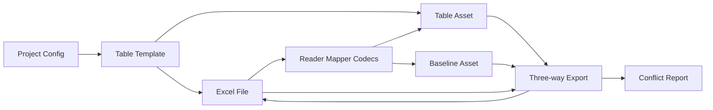
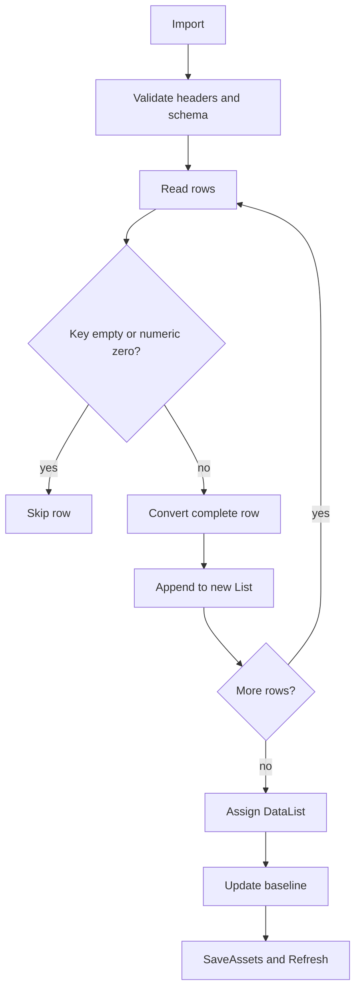
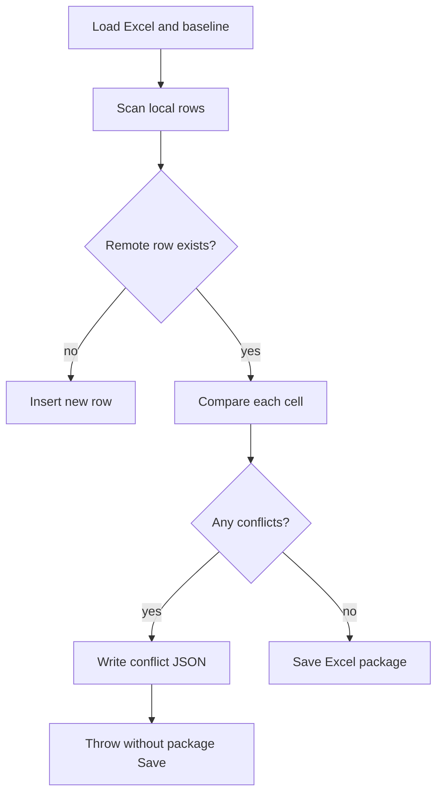

# Excel 与 ScriptableObject 编辑器同步

> 本文描述 `com.abilitykit.excel-sync` 的 Unity Editor authoring 工具链：它负责 Excel 表与 ScriptableObject DataList 的导入、基线记录和安全导出，不是运行时配置数据库，也不属于 Luban 的候选晋升与发布链。

## 1. 能力定位

Excel Sync 面向“策划维护 Excel、Unity 编辑器维护 ScriptableObject”的双向编辑场景，提供模板定位、反射转换、可扩展 codec、导入基线、Base/Local/Remote 三方导出，以及 Editor Row/Table 代码生成。

它不负责运行时加载、热重载、Luban schema 与发布、跨文件事务或业务引用校验。核心 asmdef 仅包含 Editor 平台，并依赖 UnityEditor、Odin、Newtonsoft.Json 和包内 EPPlus DLL；Runtime asmdef 当前为空壳，不能把该包声明为 Player、Server 或纯 `.NET` 配置能力。

## 2. 源码入口

| 内容 | 路径 |
|------|------|
| 表模板与默认参数 | `Unity/Packages/com.abilitykit.excel-sync/Editor/Core/ExcelSyncTableTemplate.cs` |
| 单资产同步核心 | `Unity/Packages/com.abilitykit.excel-sync/Editor/Core/ScriptableObjectExcelSync.cs` |
| Baseline Asset | `Unity/Packages/com.abilitykit.excel-sync/Editor/Core/ExcelSoSyncBaselineAsset.cs` |
| 模板与批处理服务 | `Unity/Packages/com.abilitykit.excel-sync/Editor/Core/ExcelSyncTemplateService.cs` |
| Codec registry | `Unity/Packages/com.abilitykit.excel-sync/Editor/Codecs/ExcelCodecRegistry.cs` |
| EPPlus backend | `Unity/Packages/com.abilitykit.excel-sync/Editor/Backends/EpplusTableReaderWriter.cs` |
| 批量菜单 | `Unity/Packages/com.abilitykit.excel-sync/Editor/Menus/ExcelSyncBatchMenu.cs` |
| Editor asmdef | `Unity/Packages/com.abilitykit.excel-sync/Editor/com.abilitykit.excel-sync.editor.asmdef` |

默认表头为第 6 行、数据从第 8 行开始、空 sheet 名表示首个 sheet、主键列为 `code`，模板可覆盖这些值。

## 3. 数据所有权

Project Config 持有启用模板和默认路径；Template 持有单表参数及 Table Asset 引用；Table Asset 持有本地 DataList；Baseline Asset 保存最近一次导入时的 Excel 路径、sheet、headers 和按主键索引的字符串行。

Baseline 是导出比较依据，不是运行时配置或完整文件快照。它不带源文件 hash、mtime、schema version 或提交 ID。`BaselineStatus` 只检查资产是否存在，不能证明它与当前 Excel、schema 或 Table Asset 对齐。

## 4. Schema 与 Codec

表头按大小写不敏感方式匹配。同步会拒绝重复表头和缺失主键列，并要求目标行类型的所有可导出 public 字段、可读写 public 属性都存在；Excel 额外列可以保留。这是结构校验，不保证主键唯一、外键存在、枚举值或业务范围合法。

可选 Editor/Runtime schema 校验要求成员集合一致，并允许 Editor `string` 对 Runtime `JObject`、识别出的 HotUpdate custom type，以及递归兼容的 `List<T>`。复杂值的正确性仍取决于 codec 和后续业务校验。

默认 `ExcelCodecRegistry` 按顺序注册 primitive、宽松 JObject、List 和宽松 JSON object codec。List 默认接受逗号、分号、竖线和空格，导出默认使用逗号。Registry 是进程级可变单例，追加 codec 和按列分隔符会持续影响同一 Editor 进程；团队应集中注册并固定顺序。

## 5. 导入与提交边界

导入先构造完整的新 `List<T>`，转换异常发生在赋值前时，旧 DataList 保持不变。行对象若实现 `ISerializationCallbackReceiver`，会调用 `OnAfterDeserialize()`。

空主键、空白字符串主键和数值零主键会跳过。重复主键不会阻断：DataList 可包含多条相同 key，而 baseline map 只保留第一次出现的行，后续三方比较因此失去一一对应关系。生产表必须增加唯一性 gate。

导入不是事务。DataList 赋值、资产 dirty、baseline 更新、SaveAssets 和 Refresh 是连续副作用；赋值后的异常可能形成资产已改但 baseline 未更新，或 baseline 与资产保存状态不一致。

## 6. Safe Export

导出要求 Table Asset 已绑定、Excel 文件已存在，并且 baseline 已由导入建立。每个单元格执行：

| 条件 | 行为 |
|------|------|
| Local 等于 Base | 本地未改，不写 Remote |
| Local 已改，Remote 等于 Base | 写入 Local |
| Local 已改，Remote 等于 Local | 无冲突 |
| Local 与 Remote 都偏离 Base 且彼此不同 | 记录冲突 |

冲突检测期间 workbook 修改只在内存中；有冲突时先写 `.conflicts.json` 再抛异常，不调用 `package.Save()`，所以该次 Excel 不会提交部分单元格修改。报告写入、资产操作和外部并发写不在同一事务中，不能扩大为全链路原子保证。

当前导出还具有这些语义：

- 新 Local 行会插入 Excel。
- Remote-only 行不会因 Local 缺失而删除。
- 没有 baseline row 的已有 Remote 行不会被 Local 覆盖。
- 只有 Local 相对 Base 改变的单元格才参与写入。
- 成功保存后不刷新 baseline。

连续导出仍以最近一次 import 为 Base，比较语义会滞后。推荐成功导出并确认后重新导入；更完整的实现应在 Excel 保存成功后原子更新 baseline。

## 7. 生成与批处理

`GenerateCode` 创建输出目录，仅在缺失时生成 Row partial 壳类，每次重写 Table ScriptableObject 壳类；已绑定资产时还生成 partial raw 字段，然后 Refresh。Table 文件会直接覆盖，生成目录不能存放手写同名类；写入没有临时文件或批次回滚。

`GenerateAllCode`、`ImportAll` 和 `ExportAll` 逐模板执行并汇总错误，不因单表失败停止其余模板。`ExportAll` 会跳过 baseline 缺失的模板。

`GenerateAndImportAll` 实际执行生成代码、创建未绑定资产、批量导入。虽然注释写“等待编译”，实现没有等待 Unity compilation pipeline；首次生成新类型时可能无法解析类型，随后继续汇总未绑定错误。首次接入应拆成生成、等待编译成功、创建/绑定资产、导入四步。

## 8. Backend 与并发边界

EPPlus reader 在 sheet 名为空时选择首个 sheet，指定 sheet 不存在时也回退首个 sheet，并支持读取合并单元格左上角值。writer 可创建缺失 sheet，但高层 safe export 仍要求文件存在。空 workbook、损坏文件和 IO 错误会抛异常。

导出只有显式 Save 才提交。工具没有文件锁协议、并发写检测或原子 replace；应避免 Excel 客户端、版本控制合并工具和 Unity 同时写同一文件。

单表模板服务捕获异常、记录 `Debug.LogException` 并返回失败结果；批处理通过 `BatchResult` 继续汇总。底层同步 API 多数直接抛异常。批量成功只表示步骤返回成功，不证明代码已编译、业务引用有效或运行时发布完成。

## 9. 测试与验证

截至 2026-07-15：

- package 内没有 NUnit `[Test]` 或 `[UnityTest]`。
- 没有独立 `.NET` 镜像工程，核心依赖 UnityEditor、Odin 和 EPPlus。
- 当前批次未启动 Unity Editor Test Runner，也没有执行真实 Excel 往返验收。

最低人工验证应使用临时表和临时资产：

1. 导入合法表，核对 DataList 与 baseline。
2. 分别只改 Local、只改 Remote，验证保留规则。
3. 同一单元格同时修改，确认报告生成且 Excel hash 不变。
4. 验证新增 Local 行、Remote-only 行和无 baseline 的 Remote 行。
5. 构造重复主键并由外部 gate 阻断。
6. 成功导出后再次导出，观察 baseline 滞后，再重新导入。
7. 首次生成新类型时分阶段等待 Unity 编译。

优先自动化覆盖 schema 大小写与重复列、主键过滤/重复、codec round-trip、赋值前失败、三方合并真值表、冲突不保存、baseline 更新失败、连续导出和 batch 部分失败。

## 10. 生产工作流

推荐顺序是：锁定目标 Excel 和生成目录；首次接入生成代码并等待编译；创建或绑定资产；导入并运行唯一主键及业务校验；编辑 Local；safe export；处理 conflict report；审查 Excel/资产 diff；重新导入刷新 baseline；最后再进入 ConfigDatabase、Luban 或项目打包链。

Excel Sync 输出只是 authoring 资产。若运行时使用 ConfigDatabase 或 Luban，必须建立明确的下一阶段转换和门禁，不能让 Editor Table Asset 自动成为未经验证的线上权威源。

## 11. 采用结论

Excel Sync 已具备模板、反射映射、codec、baseline 和三方冲突检测的完整编辑器工具面。冲突时不保存 EPPlus package 是有效保护，但重复主键、非事务导入、baseline 不刷新、无删除传播、无编译等待和无自动测试仍限制成熟度。

生产声明应限定为“受版本控制和人工审查保护的 Unity Editor 双向同步工具”，不能称为无人值守配置发布系统或跨端运行时配置方案。

## 12. 关联文档

- [配置系统](04-ConfigurationSystem.md)：ConfigDatabase、运行时加载和原子换表。
- [CodeGen 与 Luban 生产链路](07-CodeGenAndLubanProductionPipeline.md)：生成资产权威源、候选晋升和发布门禁。
- [ActionTimeline 数据协议与播放边界](08-ActionTimelineDataAndPlayback.md)：另一条独立的编辑器导出与运行时消费协议。
- [公司级采用与模块治理规范](../10-EngineeringQuality/04-CompanyAdoptionAndModuleGovernance.md)：成熟度、owner、回滚和准入证据。
