# 6.1 ECS 核心概念：EntityWorld、IEntity 与组件索引

> 本文档解释 AbilityKit 轻量 ECS 的核心模型：以 `EntityWorld` 为存储中心、`IEntity` 为值类型句柄、`IEntityId` 为版本化 ID、`EntityQuery` 为类型安全查询入口的轻量实体组件世界。

---

## 1. 能力定位

AbilityKit 同时存在几类 ECS/世界相关能力：

| 层级 | 代表源码 | 解决的问题 |
|------|----------|------------|
| 轻量 ECS | `Unity/Packages/com.abilitykit.world.ecs/Runtime/AbilityKit.World.ECS`、`src/AbilityKit.World.ECS` | 提供不依赖 Unity/Entitas/Svelto 的实体、组件、查询、层级和事件能力 |
| Entitas 适配 | `Unity/Packages/com.abilitykit.world.entitas/Runtime`、`src/AbilityKit.World.Entitas` | 接入 Entitas contexts、systems、composer 和 World DI |
| Svelto 适配 | `Unity/Packages/com.abilitykit.world.svelto/Runtime`、`src/AbilityKit.World.Svelto` | 接入 Svelto `EnginesRoot`、`EntitiesDB` 和性能模式 |
| 逻辑世界 | `Unity/Packages/com.abilitykit.world/Runtime`、`src/AbilityKit.World` | 管理世界生命周期、模块、系统、服务容器和 Tick |

本篇聚焦“ECS 核心概念”本身，也就是轻量 ECS 如何表达实体和组件。Entitas 与 Svelto 的差异见后续专题。

---

## 2. 源码入口

| 源码 | 作用 |
|------|------|
| `Unity/Packages/com.abilitykit.world.ecs/Runtime/AbilityKit.World.ECS/Core/IECWorld.cs` | ECS 世界接口，定义实体生命周期、组件操作、查询、父子关系、元数据、事件和统计 |
| `Unity/Packages/com.abilitykit.world.ecs/Runtime/AbilityKit.World.ECS/Core/IEntity.cs` | 值类型实体句柄，封装 `IEntityId` 和所属 `IECWorld`，提供链式 API |
| `Unity/Packages/com.abilitykit.world.ecs/Runtime/AbilityKit.World.ECS/Core/IEntityId.cs` | `Index + Version` 组成的实体 ID，防止实体槽位复用后旧引用误命中 |
| `Unity/Packages/com.abilitykit.world.ecs/Runtime/AbilityKit.World.ECS/Impl/EntityWorld.cs` | 轻量 ECS 的核心实现，负责槽位、组件数组、组件索引、父子关系和事件发布 |
| `Unity/Packages/com.abilitykit.world.ecs/Runtime/AbilityKit.World.ECS/Core/EntityQuery.cs` | 类型安全查询结构，支持 1 到 3 个组件组合 |
| `Unity/Packages/com.abilitykit.world.ecs/Runtime/AbilityKit.World.ECS/Core/IComponentRegistry.cs` | 组件类型到整数 ID 的注册接口 |
| `Unity/Packages/com.abilitykit.world.ecs/Runtime/AbilityKit.World.ECS/Impl/ComponentRegistry.cs` | 默认组件注册表，提供全局共享 ID 分配 |
| `Unity/Packages/com.abilitykit.world.ecs/Runtime/AbilityKit.World.ECS/Core/IWorldEventBus.cs` | ECS 世界事件总线接口 |
| `Unity/Packages/com.abilitykit.world.ecs/Runtime/AbilityKit.World.ECS/Events/WorldEvents.cs` | `EntityCreated`、`EntityDestroyed`、`ComponentSet`、`ComponentRemoved`、`ParentChanged` 事件 |
| `Unity/Packages/com.abilitykit.world.entitas/Runtime/World/Base/WorldSystemBase.cs` | Entitas 系统基类，不属于轻量 ECS，但说明 AbilityKit 的 System 层更多由适配器承载 |

---

## 3. 一张图理解当前 ECS

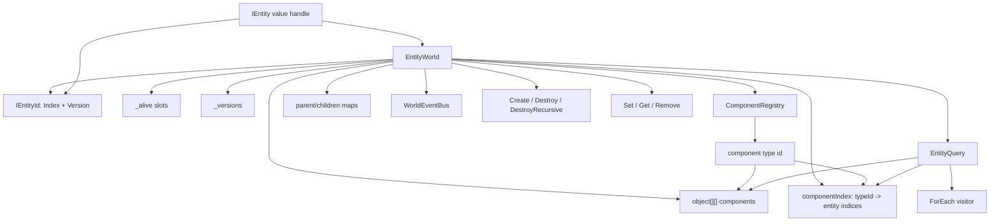

核心结论：

| 概念 | 当前源码中的真实形态 |
|------|----------------------|
| Entity | `IEntity` 是值类型句柄，不是保存数据的对象 |
| EntityId | `IEntityId` 是 `Index + Version`，用于校验槽位是否仍是同一代实体 |
| Component | 值类型用 `SetComponent<T>`，引用类型用 `SetComponentRef<T>`，最终都放入 `object[][]` |
| System | 轻量 ECS 不定义旧式 `IECSystem`；系统层由逻辑世界、Entitas/Svelto 适配和具体玩法模块承载 |
| Query | `EntityQuery<T1/T2/T3>` 通过组件类型 ID 和组件索引遍历匹配实体 |
| Event | 世界在创建、销毁、组件设置/移除、父子关系变化时发布强类型事件 |

---

## 4. EntityWorld 是存储中心

`EntityWorld` 的数据结构不是“每个实体一个对象，里面挂组件列表”。它采用数组槽位和索引表：

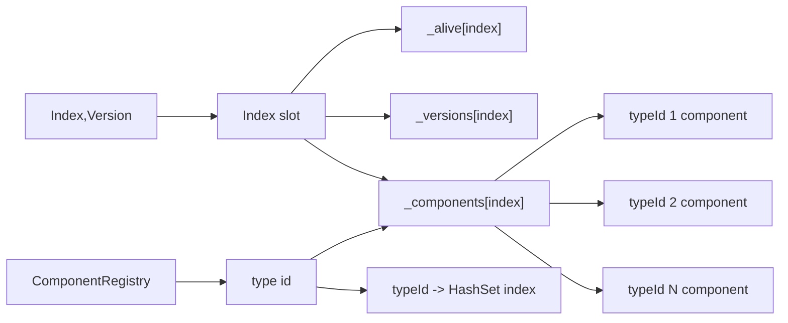

主要字段可以这样读：

| 字段 | 作用 |
|------|------|
| `_versions` | 每个实体槽位的版本号，销毁时递增 |
| `_alive` | 槽位是否存活 |
| `_components` | 每个实体槽位上的组件数组，数组下标是组件类型 ID |
| `_componentIndex` | 从组件类型 ID 到实体索引集合，用于查询入口收窄候选集 |
| `_parentIndex` / `_children` | 父子层级关系 |
| `_childIds` / `_childIdToIndex` | 逻辑子 ID 到子实体索引的映射 |
| `_freeIndices` | 已销毁槽位回收栈 |
| `_listPool` | 查询和递归销毁时复用临时列表 |

这个结构的目标是：实体句柄轻、组件访问直接、查询可以从组件索引进入，而不是扫描全部实体。

---

## 5. IEntityId：为什么要有 Version

`IEntityId` 的定义非常短：

```csharp
public readonly struct IEntityId : IEquatable<IEntityId>, IComparable<IEntityId>
{
    public readonly int Index;
    public readonly int Version;
}
```

它解决的是实体槽位复用问题。

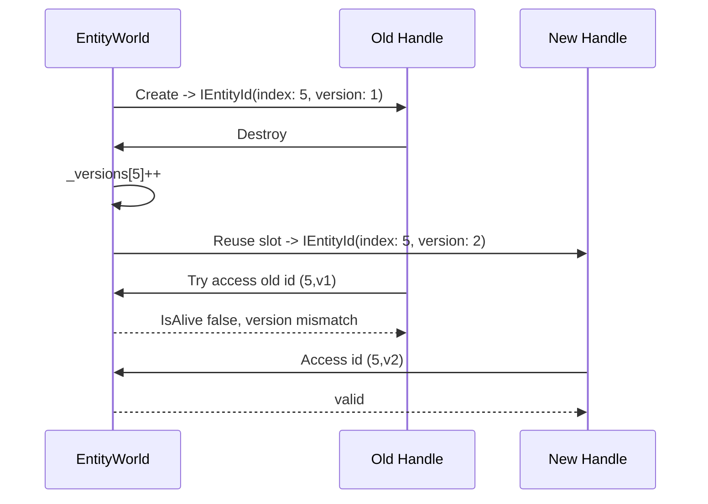

如果只有 `Index`，旧实体句柄在槽位复用后可能误操作新实体。`Version` 让 `IsAlive(id)` 同时检查下标、存活位和版本号。

---

## 6. IEntity：值类型句柄，不是实体对象

`IEntity` 是只读结构体，内部保存：

| 字段 | 含义 |
|------|------|
| `_world` | 所属 `IECWorld` |
| `_id` | `IEntityId` |

它提供链式 API：

```csharp
var actor = world.Create("Actor_1001")
    .With(new TransformComponent { X = 0, Z = 0 })
    .WithRef(new RuntimeActorState());
```

调用链实际会回到 `EntityWorld`：

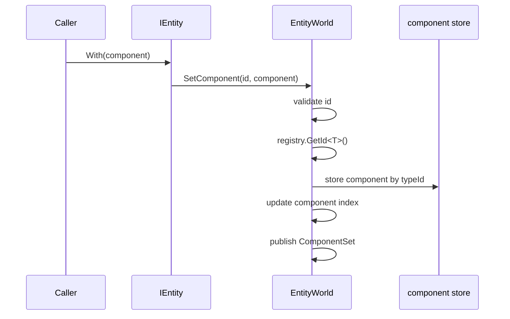

因此不要把 `IEntity` 理解成“实体实例对象”。它更像一个带世界引用的安全句柄，所有真实数据仍在 `EntityWorld` 中。

---

## 7. Component：值类型和引用类型两条路径

`IECWorld` 提供两套组件 API：

| API | 类型约束 | 用途 |
|-----|----------|------|
| `SetComponent<T>` / `GetComponent<T>` / `TryGetComponent<T>` | `where T : struct` | 值类型组件，适合纯数据和高频逻辑 |
| `SetComponentRef<T>` / `GetComponentRef<T>` / `TryGetComponentRef<T>` | `where T : class` | 引用类型组件，适合运行时对象、服务桥接或复杂状态 |

内部存储统一进入 `object[][]`：

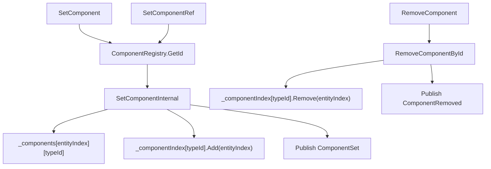

这个设计给轻量 ECS 一个折中点：对外保持类型安全 API，对内用整数 typeId 做紧凑索引。

---

## 8. ComponentRegistry：为什么要类型 ID

`ComponentRegistry` 负责把组件类型映射成整数 ID：

```csharp
private readonly Dictionary<Type, int> _ids = new Dictionary<Type, int>();
private readonly Dictionary<int, Type> _types = new Dictionary<int, Type>();
private int _nextId = 1;
```

默认使用 `ComponentRegistry.Shared`，目的是让不同 `EntityWorld` 实例拿到一致的组件类型 ID。

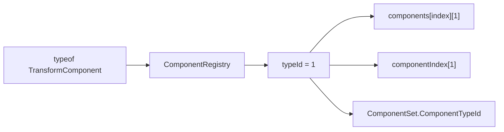

类型 ID 的好处是：

| 好处 | 说明 |
|------|------|
| 查询快 | 查询可以从 `_componentIndex[typeId]` 直接取候选实体 |
| 存储直接 | 每个实体的组件数组用 typeId 作为下标 |
| 事件轻 | `ComponentSet` 和 `ComponentRemoved` 可以只带整数 typeId |
| 调试可还原 | `TryGetType(typeId, out type)` 可以反查组件类型 |

---

## 9. Query：从组件索引进入，而不是全表扫描

`EntityWorld.Query<T>()`、`Query<T1,T2>()`、`Query<T1,T2,T3>()` 返回 `EntityQuery` 值类型。真正遍历时会调用内部 `QueryImpl`。

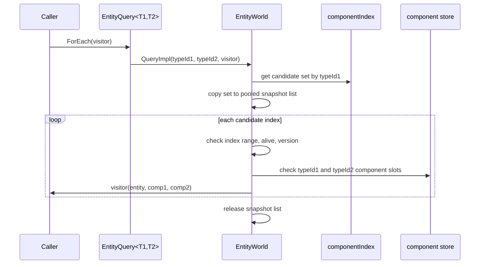

查询实现包含以下关键约束：

| 细节 | 原因 |
|------|------|
| 只支持 1 到 3 个组件泛型查询 | API 简洁，避免泛型组合爆炸；复杂查询可组合或走更专门的 ECS 适配 |
| 第一个组件类型是候选集入口 | `QueryImpl` 先取 `_componentIndex[typeId1]`，然后检查其他组件 |
| 遍历前复制 snapshot | 避免 visitor 中增删组件导致集合枚举失效 |
| 每次访问都校验 `IsAlive` | 防止旧句柄或遍历中销毁实体导致错误访问 |
| `Count()` 和 `Any()` 也是遍历 | 当前实现没有缓存计数，调用成本接近一次查询 |

---

## 10. 父子关系：实体层级不是 Transform 层级

轻量 ECS 支持父子实体：

| API | 行为 |
|-----|------|
| `CreateChild(parent)` | 创建实体并设置父级 |
| `CreateChild(parent, logicalChildId)` | 创建实体并用逻辑子 ID 建立索引 |
| `SetParent(child, parent)` | 移动父子关系 |
| `TryGetChildById(parent, logicalChildId, out child)` | 通过业务 ID 找子实体 |
| `DestroyRecursive(id)` | 递归销毁子树 |

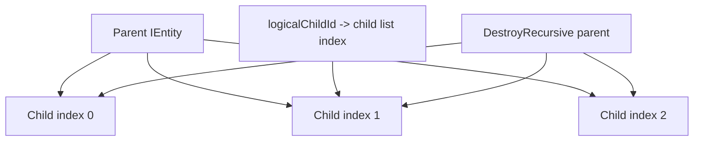

它解决的是“实体组织关系”，不是直接替代 Unity Transform。比如 Console Demo 中 `BattleEntityFeature` 会创建 `BattleEntities` 根节点，再把角色实体作为子实体创建。

---

## 11. 事件总线：世界变化的观察点

`EntityWorld` 在关键变化时发布事件：

| 事件 | 触发时机 |
|------|----------|
| `EntityCreated` | `Create()` / `Create(name)` 成功后 |
| `EntityDestroyed` | 实体销毁完成后 |
| `ComponentSet` | 设置值类型或引用类型组件后 |
| `ComponentRemoved` | 组件被移除后 |
| `ParentChanged` | 父子关系变化后 |

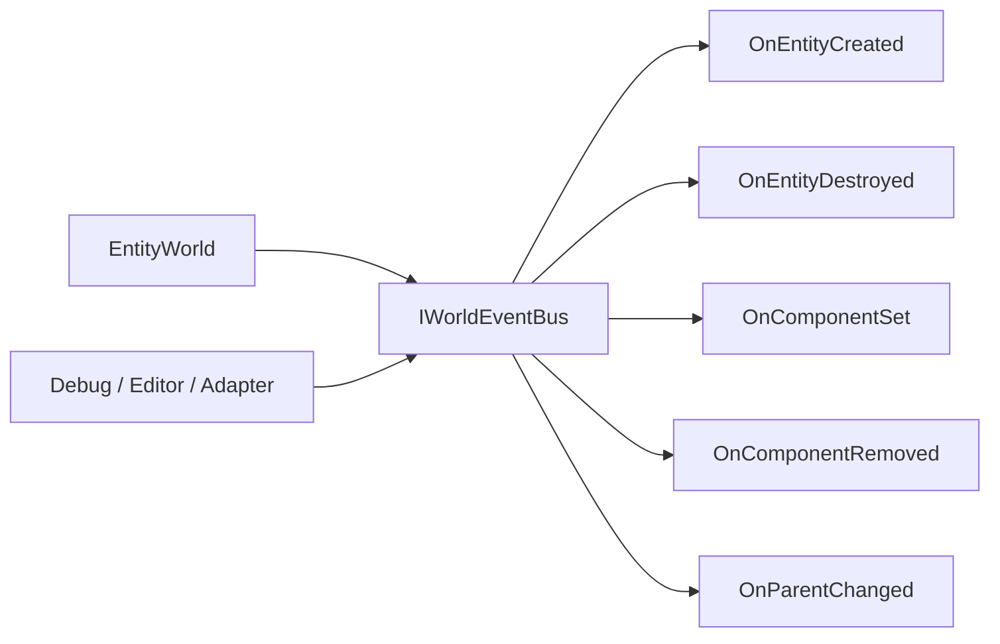

`WorldEventBus.Publish` 会先复制订阅者列表再派发，避免派发过程中订阅集合被修改影响遍历。

---

## 12. System 在 AbilityKit 中的层次

当前 AbilityKit 的 System 模型不是轻量 ECS 内部的统一接口，而是由不同运行层承担：

| 层次 | 当前形态 |
|------|----------|
| 轻量 ECS | 提供实体、组件、查询，不定义统一 `IECSystem` |
| 逻辑世界 | 由世界模块、系统安装器、生命周期和 Tick 管理具体系统 |
| Entitas 适配 | `WorldSystemBase` 封装 `IInitializeSystem`、`IExecuteSystem`、`ICleanupSystem`、`ITearDownSystem` |
| Svelto 适配 | Svelto engine、group、EntitiesDB 和提交调度器承担系统执行模型 |
| 玩法模块 | Skill、Buff、Projectile、Damage 等模块按各自管线和服务组织逻辑 |

`WorldSystemBase` 的职责是 Entitas 生命周期封装：

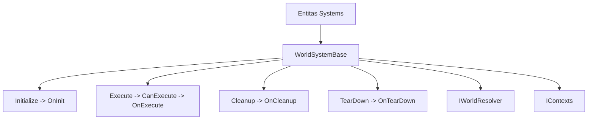

因此，本页的 ECS 核心边界是“数据和查询底座”，不应和 Entitas/Svelto 的系统调度模型混为一谈。

---

## 13. 一个最小使用流程

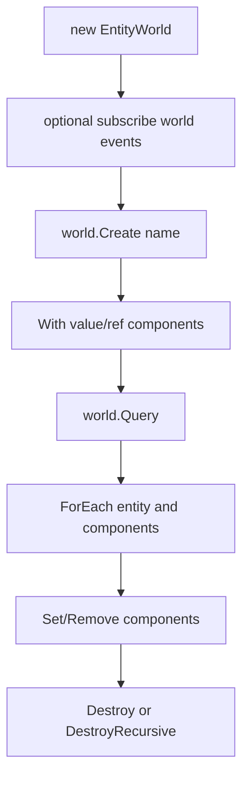

示例代码按当前 API 应该写成：

```csharp
public struct Position
{
    public float X;
    public float Z;
}

public struct MoveSpeed
{
    public float Value;
}

var world = new EntityWorld();

var actor = world.Create("Actor_1")
    .With(new Position { X = 0f, Z = 0f })
    .With(new MoveSpeed { Value = 5f });

world.Query<Position, MoveSpeed>().ForEach((entity, position, speed) =>
{
    position.X += speed.Value * 0.033f;
    entity.With(position);
});

actor.Destroy();
```

这段代码体现了三个关键点：

1. 组件是数据，逻辑写在查询 visitor 或外部系统中。
2. 修改 struct 组件后要 `entity.With(position)` 写回。
3. `actor` 是句柄，销毁后 `actor.IsValid` 会变成 false。

---

## 14. 设计取舍

| 设计 | 收益 | 代价 |
|------|------|------|
| `Index + Version` ID | 避免旧句柄误命中新实体 | 每次访问都要校验版本 |
| `object[][]` 组件存储 | 同时支持值类型和引用类型，API 简洁 | 值类型会装箱，适合轻量 ECS 而非极致性能 ECS |
| 组件类型 ID | 查询和事件可以用整数索引 | 需要维护注册表一致性 |
| 组件索引 `HashSet<int>` | 查询不用扫描全部实体 | 设置/移除组件时要维护索引 |
| 查询前复制 snapshot | visitor 中增删组件更安全 | 每次查询需要临时列表，不过通过池复用降低分配 |
| 只内置 1 到 3 组件查询 | API 简洁、实现可控 | 更多组件组合需要拆分查询或使用其他 ECS 适配 |
| 父子实体关系 | 支持对象树和逻辑子 ID | 需要处理递归销毁和解除关系 |
| 强类型事件总线 | 调试、编辑器、适配层可以观察变化 | 事件订阅需要及时 Dispose |

---

## 15. 边界判断

| 容易混淆的判断 | 设计边界 |
|----------------|----------|
| `IEntity` 是保存组件数据的对象 | `IEntity` 是值类型句柄，数据在 `EntityWorld` 的组件数组里 |
| 实体 ID 只要一个 int 就够 | 当前源码用 `Index + Version` 防止槽位复用导致旧引用误命中 |
| `Has<T>()` 判断某个实体是否有组件 | 当前 `IEntity.Has<T>()` 委托到 `IECWorld.HasComponent<T>()`，语义更接近世界内是否存在该组件类型；单实体读取建议用 `TryGet<T>` |
| `GetComponent<T>` 找不到会返回 default | 当前实现找不到会抛 `KeyNotFoundException`，安全路径是 `TryGetComponent<T>` |
| 查询一定零成本 | 查询复用了列表池，但 `Count()` / `Any()` 仍会遍历，visitor 捕获闭包也可能产生额外成本 |
| 轻量 ECS 自带完整 System 调度 | 轻量 ECS 只提供数据和查询；系统调度由逻辑世界、Entitas/Svelto 适配或玩法模块承担 |
| 父子关系等于 Unity Transform | 这里只是实体层级和逻辑子 ID，不直接表达空间变换 |
| 引用组件和 struct 组件完全一样 | 引用组件通过 `SetComponentRef` 路径，null 表示移除；struct 组件通过 `SetComponent` 路径 |

---

## 16. 源码阅读路径

1. `IEntityId`：版本化 ID 为什么存在。
2. `IEntity`：实体只是句柄。
3. `IECWorld`：实体生命周期、组件、查询、层级、事件 API 全貌。
4. `ComponentRegistry`：类型 ID 来源。
5. `EntityWorld` 的 `Create`、`SetComponent`、`QueryImpl`、`Destroy`：轻量 ECS 的核心读写路径。
6. `EntityQuery`：查询 API 的外壳边界。
7. `WorldEvents` 与 `WorldEventBus`：实体和组件变化的观察点。
8. `02-EntitasImplementation.md`、`03-QueryAndIteration.md`、`03-SveltoImplementation.md`：不同 ECS 适配的差异。

---

## 17. 和其他文档的关系

| 文档 | 关系 |
|------|------|
| `02-EntitasImplementation.md` | 解释 Entitas adapter 如何把系统生命周期、contexts 和 DI 接入 AbilityKit |
| `03-QueryAndIteration.md` | 深入展开 `EntityWorld.QueryImpl`、snapshot、存活校验、Entitas/Svelto 查询差异 |
| `03-SveltoImplementation.md` | 解释 Svelto adapter 的 `EnginesRoot`、`EntitiesDB` 和提交调度器 |
| `04-QueryAndTraversal.md` | 从总览角度比较 EntityQuery、Entitas Group、Svelto 查询策略 |
| `../02-LogicalWorldDesign/02-EntityDesign.md` | 从逻辑世界角度解释实体生命周期、父子关系和事件 |
| `../02-LogicalWorldDesign/03-ComponentDesign.md` | 从组件注册、组件索引和存储角度进一步拆解实现 |
| `../02-LogicalWorldDesign/04-SystemDesign.md` | 解释 AbilityKit 的系统安装、阶段排序和 World DI 集成 |

---

*文档版本：v2.0 | 最后更新：2026-07-03*
