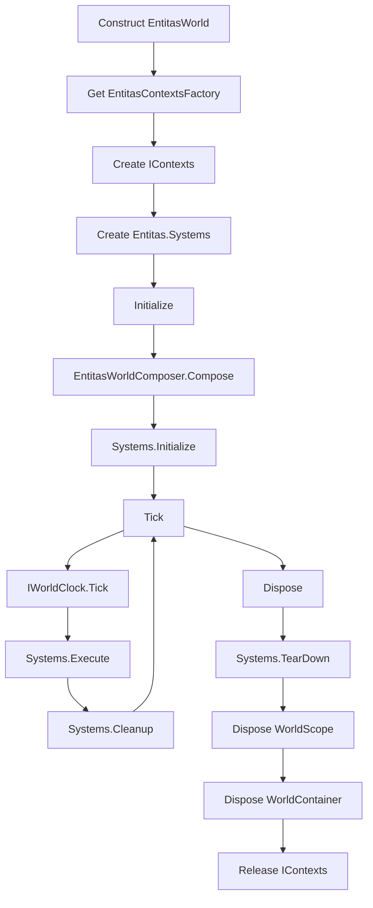
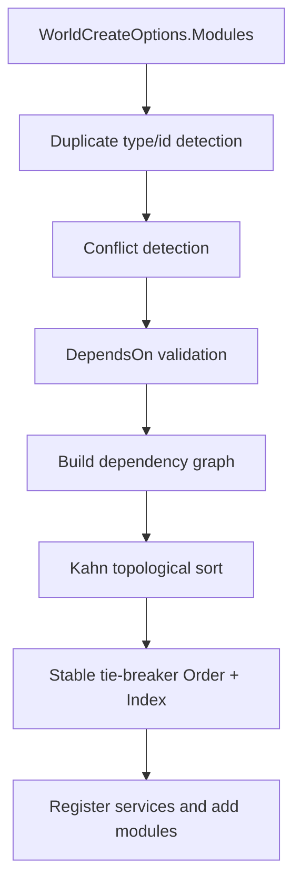
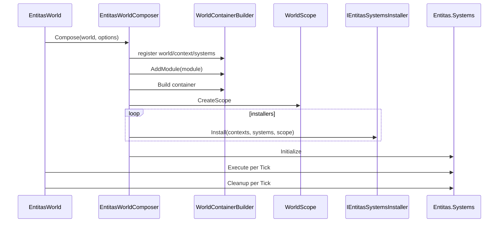

# 6.2 Entitas 实现

> 本文说明 AbilityKit 如何把 Entitas 上下文、系统容器、World.DI、模块治理与生命周期组合成一个 `IWorld` 实现。

---

## 目录

- [6.2 Entitas 实现](#62-entitas-实现)
  - [目录](#目录)
  - [1. 能力定位](#1-能力定位)
  - [2. 源码入口](#2-源码入口)
  - [3. 世界生命周期](#3-世界生命周期)
    - [3.1 构造阶段](#31-构造阶段)
    - [3.2 初始化阶段](#32-初始化阶段)
    - [3.3 Tick 阶段](#33-tick-阶段)
    - [3.4 Dispose 阶段](#34-dispose-阶段)
  - [4. 模块组合与治理](#4-模块组合与治理)
  - [5. 系统安装与 Tick](#5-系统安装与-tick)
  - [6. 设计约束与扩展点](#6-设计约束与扩展点)
    - [6.1 约束](#61-约束)
    - [6.2 扩展点](#62-扩展点)
  - [7. 关联文档](#7-关联文档)

---

## 1. 能力定位

Entitas 实现层的目标是让 AbilityKit 的通用世界抽象可以落到 Entitas ECS 上，同时保持 Host、DI、服务、系统生命周期的统一。它的边界如下：

| 能力 | Entitas 实现职责 |
|------|------------------|
| 世界身份 | 暴露 `WorldId` 与 `WorldType` |
| ECS 上下文 | 创建并持有 `Entitas.IContexts` |
| 系统容器 | 创建并驱动 `Entitas.Systems` |
| 服务解析 | 通过 `WorldContainer` / `WorldScope` 暴露 `IWorldResolver` |
| 模块扩展 | 执行 `IWorldModule` 与 `IEntitasSystemsInstaller` |
| 诊断 | 输出 `WorldCompositionReport` 到 `WorldDebugRegistry` |

---

## 2. 源码入口

| 类型 | 源码 | 说明 |
|------|------|------|
| `EntitasWorld` | `Unity/Packages/com.abilitykit.world.entitas/Runtime/World/Core/EntitasWorld.cs` | Entitas 版 `IWorld` 实现 |
| `EntitasWorldComposer` | `Unity/Packages/com.abilitykit.world.entitas/Runtime/World/Core/EntitasWorldComposer.cs` | 模块排序、服务注册、系统安装 |
| `EntitasWorldContext` | `Unity/Packages/com.abilitykit.world.entitas/Runtime/World/Core/EntitasWorldContext.cs` | 向系统暴露世界上下文 |
| `IEntitasSystemsInstaller` | `Unity/Packages/com.abilitykit.world.entitas/Runtime/World/Core` | 模块安装 Entitas Systems 的扩展点 |

---

## 3. 世界生命周期

`EntitasWorld` 的生命周期分为构造、初始化、Tick、释放四个阶段。



### 3.1 构造阶段

构造函数从 `WorldCreateOptions` 中读取：

- `Id`
- `WorldType`
- Entitas contexts factory
- world modules
- optional service builder

然后立即创建 Entitas contexts 和 systems：

```csharp
_contexts = _contextsFactory.Create();
Systems = new global::Entitas.Systems();
```

这意味着 Entitas 原生对象在 `Initialize` 前已经存在，但服务容器和系统安装要等到 `Compose` 阶段。

### 3.2 初始化阶段

`Initialize` 是幂等的，重复调用会直接返回。它会调用 `EntitasWorldComposer.Compose`，如果组合失败，会释放已经创建的 scope/container 并回滚 `_initialized`，避免半初始化世界残留。

### 3.3 Tick 阶段

每帧 Tick 的顺序固定：

1. 如果还未初始化则返回。
2. 懒解析 `IWorldClock`。
3. 推进世界时钟。
4. 执行 `Systems.Execute()`。
5. 执行 `Systems.Cleanup()`。

这个顺序保证时间服务在系统执行前更新，cleanup 在系统执行后统一处理。

### 3.4 Dispose 阶段

释放顺序是：

1. `Systems.TearDown()`。
2. 释放 `WorldScope`。
3. 释放 `WorldContainer`。
4. `IEntitasContextsFactory.Release(_contexts)`。

系统 TearDown 放在容器释放前，因此系统仍有机会在 TearDown 阶段访问必要上下文。

---

## 4. 模块组合与治理

`EntitasWorldComposer` 在真正注册模块前会进行治理：

| 步骤 | 目的 |
|------|------|
| 去重 | 同类型模块不能重复；有 `Id` 的模块也不能重复 |
| 冲突检测 | `IWorldModuleInfo.ConflictsWith` 命中的模块不能共存 |
| 依赖检查 | `DependsOn` 指向的模块必须存在 |
| 拓扑排序 | 根据依赖形成稳定执行顺序 |
| 稳定排序 | 同层按 `Order` 和原始 Index 排序 |
| 环检测 | 如果有依赖环，输出模块链路用于诊断 |



这种治理可以让复杂玩法模块按声明式依赖组合，避免“注册顺序恰好正确”的隐式约束。

---

## 5. 系统安装与 Tick

组合阶段会向 DI 容器注册基础对象：

- `WorldId`
- `string WorldType`
- `IWorld`
- `IEntitasWorld`
- `Entitas.IContexts`
- `Entitas.Systems`
- `IEntitasWorldContext`
- `IWorldContext`

然后对所有模块执行：

1. `builder.AddModule(module)` 注册模块服务。
2. `container.Build()`。
3. `container.CreateScope()`。
4. 对实现 `IEntitasSystemsInstaller` 的模块调用 `Install(contexts, systems, scope)`。
5. `world.Systems.Initialize()`。



---

## 6. 设计约束与扩展点

### 6.1 约束

- `IEntitasContextsFactory` 必须能创建非空 contexts。
- 模块类型不能重复；模块 `Id` 不能重复。
- 模块依赖必须形成无环图。
- Entitas systems 的安装只能发生在 `Initialize` 期间。
- `Tick` 不负责异常隔离，系统内部应自行保证错误边界。

### 6.2 扩展点

| 扩展点 | 说明 |
|--------|------|
| `IEntitasContextsFactory` | 替换 Entitas contexts 创建/释放方式 |
| `IWorldModule` | 注册世界服务，如配置、输入、快照、玩法服务 |
| `IWorldModuleInfo` | 声明模块 Id、Order、DependsOn、ConflictsWith |
| `IEntitasSystemsInstaller` | 向 `Entitas.Systems` 安装 Execute/Cleanup/Reactive 系统 |
| `IWorldClock` | 提供统一逻辑时间 |
| `WorldDebugRegistry` | 接入世界组合诊断和模块审计 |

---

## 7. 关联文档

- [ECS 核心概念](./01-ECSCoreConcepts.md) - Entity/Component/System 的统一抽象
- [Svelto 实现](./03-SveltoImplementation.md) - Svelto 上下文与模块适配
- [查询与遍历](./04-QueryAndTraversal.md) - Query、Group、Matcher 策略

---

*文档版本：v1.0 | 最后更新：2026-06-23*
