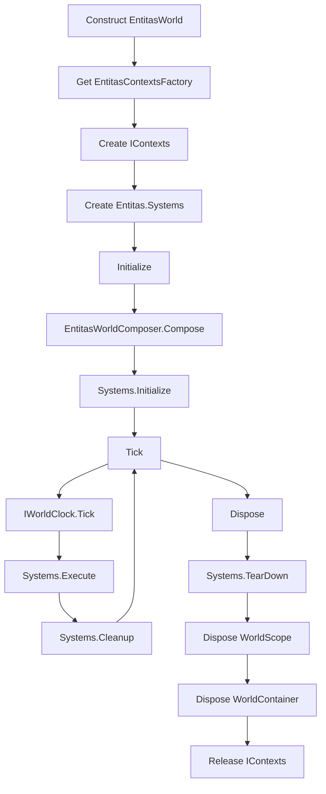
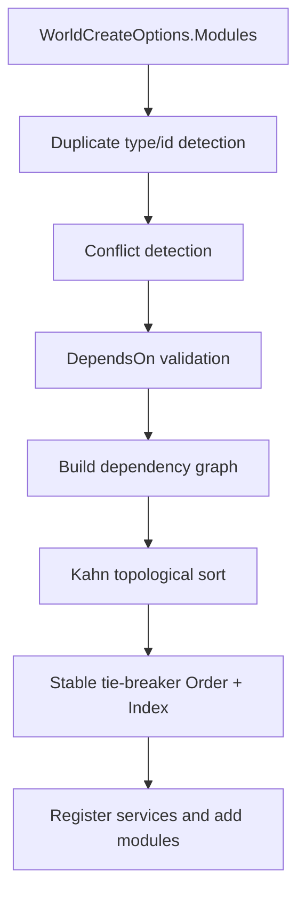
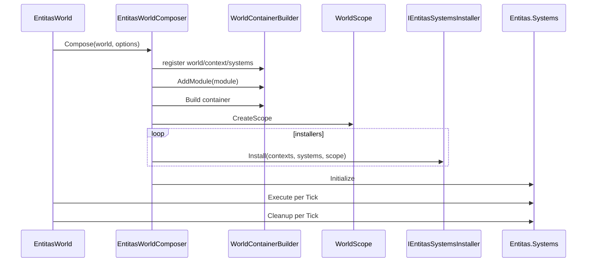

# 6.2 Entitas 实现

> 本文说明 AbilityKit 如何把 Entitas 上下文、系统容器、World.DI、模块治理与生命周期组合成一个 `IWorld` 实现，并记录当前实现的所有权与失败边界。

---

## 目录

- [6.2 Entitas 实现](#62-entitas-实现)
  - [目录](#目录)
  - [1. 能力定位](#1-能力定位)
  - [2. 源码入口](#2-源码入口)
  - [3. 世界生命周期](#3-世界生命周期)
    - [3.1 构造阶段](#31-构造阶段)
    - [3.2 初始化阶段](#32-初始化阶段)
    - [3.3 Tick 阶段](#33-tick-阶段)
    - [3.4 Dispose 阶段](#34-dispose-阶段)
  - [4. 模块组合与治理](#4-模块组合与治理)
  - [5. 系统安装与 Tick](#5-系统安装与-tick)
  - [6. 自动安装与响应式系统](#6-自动安装与响应式系统)
  - [7. MOBA 生产接入](#7-moba-生产接入)
  - [8. 设计约束与风险边界](#8-设计约束与风险边界)
  - [9. 验证与成熟度](#9-验证与成熟度)
  - [10. 关联文档](#10-关联文档)

---

## 1. 能力定位

Entitas 实现层的目标是让 AbilityKit 的通用世界抽象可以落到 Entitas ECS 上，同时保持 Host、DI、服务、系统生命周期的统一。它的边界如下：

| 能力 | Entitas 实现职责 |
|------|------------------|
| 世界身份 | 暴露 `WorldId` 与 `WorldType` |
| ECS 上下文 | 创建并持有 `Entitas.IContexts` |
| 系统容器 | 创建并驱动 `Entitas.Systems` |
| 服务解析 | 通过 `WorldContainer` / `WorldScope` 暴露 `IWorldResolver` |
| 模块扩展 | 执行 `IWorldModule` 与 `IEntitasSystemsInstaller` |
| 诊断 | 输出 `WorldCompositionReport` 到 `WorldDebugRegistry` |

---

## 2. 源码入口

| 类型 | 源码 | 说明 |
|------|------|------|
| `EntitasWorld` | [EntitasWorld.cs](../../../Unity/Packages/com.abilitykit.world.entitas/Runtime/World/Core/EntitasWorld.cs) | Entitas 版 `IWorld` 实现 |
| `EntitasWorldComposer` | [EntitasWorldComposer.cs](../../../Unity/Packages/com.abilitykit.world.entitas/Runtime/World/Core/EntitasWorldComposer.cs) | 模块排序、服务注册、系统安装与组合报告 |
| `EntitasWorldContext` | [EntitasWorldContext.cs](../../../Unity/Packages/com.abilitykit.world.entitas/Runtime/World/Core/EntitasWorldContext.cs) | 向系统暴露世界上下文 |
| `IEntitasSystemsInstaller` | [IEntitasSystemsInstaller.cs](../../../Unity/Packages/com.abilitykit.world.entitas/Runtime/World/Interfaces/IEntitasSystemsInstaller.cs) | 模块安装 Entitas Systems 的扩展点 |
| `AutoSystemInstaller` | [AutoSystemInstaller.cs](../../../Unity/Packages/com.abilitykit.world.entitas/Runtime/World/Modules/AutoSystemInstaller.cs) | 按特性扫描、排序并实例化系统 |
| `ReactiveWorldSystemBase<TEntity>` | [ReactiveWorldSystemBase.cs](../../../Unity/Packages/com.abilitykit.world.entitas/Runtime/World/Base/ReactiveWorldSystemBase.cs) | Group 与组件替换事件适配 |
| .NET 构建入口 | [AbilityKit.World.Entitas.csproj](../../../src/AbilityKit.World.Entitas/AbilityKit.World.Entitas.csproj) | 直接编译 package Runtime 源码 |

---

## 3. 世界生命周期

`EntitasWorld` 的生命周期分为构造、初始化、Tick、释放四个阶段。



### 3.1 构造阶段

构造函数从 `WorldCreateOptions` 中读取：

- `Id`
- `WorldType`
- Entitas contexts factory
- world modules
- optional service builder

然后立即创建 Entitas contexts 和 systems：

```csharp
_contexts = _contextsFactory.Create();
Systems = new global::Entitas.Systems();
```

这意味着 Entitas 原生对象在 `Initialize` 前已经存在，但服务容器和系统安装要等到 `Compose` 阶段。contexts 的所有权从 factory `Create()` 成功返回时即转给 world；调用方不能把“尚未 Initialize”理解为“无需 Dispose”。

### 3.2 初始化阶段

`Initialize` 对成功路径幂等，重复调用会直接返回。它在进入组合前先设置 `_initialized = true`，随后调用 `EntitasWorldComposer.Compose`；异常路径会尝试释放已创建的 scope/container、将引用清空并回滚 `_initialized`，然后原样抛出组合异常。

这个回滚不是完整事务：installer 可能已向 `Systems` 加入系统，`Systems.Initialize()` 也可能只完成了一部分；catch 分支不会调用 `Systems.TearDown()`，也不会释放构造期 contexts。失败后再次调用 `Initialize()` 会复用同一 `Systems` 与 contexts，因此当前实现不承诺安全重试。生产代码应把初始化失败视为 world 创建失败并整体丢弃；底层仍需补充失败注入测试和完整回滚。

### 3.3 Tick 阶段

每帧 Tick 的顺序固定：

1. 如果还未初始化则返回。
2. 懒解析 `IWorldClock`。
3. 推进世界时钟。
4. 执行 `Systems.Execute()`。
5. 执行 `Systems.Cleanup()`。

这个顺序保证时间服务在系统执行前更新，cleanup 在系统执行后统一处理。`Execute()` 或 `Cleanup()` 的异常不会在 world 层隔离；如果 `Execute()` 抛出，本 Tick 的 `Cleanup()` 不会执行，异常直接传播给 Host。

### 3.4 Dispose 阶段

正常初始化后的释放顺序是：

1. `Systems.TearDown()`，异常被记录后继续。
2. 释放 `WorldScope`。
3. 释放 `WorldContainer`。
4. `IEntitasContextsFactory.Release(_contexts)`，异常被记录后继续。

系统 TearDown 放在容器释放前，因此系统仍有机会在 TearDown 阶段访问必要上下文。但 scope/container 的 `Dispose()` 没有独立 try/catch：任一处抛错都会中断后续释放。另一个当前缺口是：若 world 从未成功建立 container/scope，`Dispose()` 会提前返回，构造期 contexts 不会交还 factory。文档将其列为风险，不把它描述为可靠释放保证。

---

## 4. 模块组合与治理

`EntitasWorldComposer` 在真正注册模块前会进行治理：

| 步骤 | 目的 |
|------|------|
| 去重 | 同类型模块不能重复；有 `Id` 的模块也不能重复 |
| 冲突检测 | `IWorldModuleInfo.ConflictsWith` 命中的模块不能共存 |
| 依赖检查 | `DependsOn` 指向的模块必须存在 |
| 拓扑排序 | 根据依赖形成稳定执行顺序 |
| 稳定排序 | 同层按 `Order` 和原始 Index 排序 |
| 环检测 | 如果有依赖环，输出模块链路用于诊断 |



这种治理可以让复杂玩法模块按声明式依赖组合，避免“注册顺序恰好正确”的隐式约束。

---

## 5. 系统安装与 Tick

组合阶段会向 DI 容器注册基础对象：

- `WorldId`
- `string WorldType`
- `IWorld`
- `IEntitasWorld`
- `Entitas.IContexts`
- `Entitas.Systems`
- `IEntitasWorldContext`
- `IWorldContext`

然后对所有模块执行：

1. `builder.AddModule(module)` 注册模块服务。
2. `container.Build()`。
3. `container.CreateScope()`。
4. 对实现 `IEntitasSystemsInstaller` 的模块调用 `Install(contexts, systems, scope)`。
5. `world.Systems.Initialize()`。



---

## 6. 自动安装与响应式系统

`AutoSystemInstaller` 只扫描显式传入的 assemblies 和 namespace prefixes，并只选择带 `[WorldSystem]`、非抽象且非接口的类型。候选顺序固定为 `Phase -> Order -> Type.FullName`；不同 phase 被包装为独立 `Entitas.Systems` feature，再按 `PreExecute` 到 `PostExecute` 加入根 systems。

自动构造不是通用 DI 构造器：每个候选必须具有 `(Entitas.IContexts contexts, IWorldResolver services)` 构造函数，并实现 `Entitas.ISystem`。缺少构造函数、类型不实现接口或构造函数内部抛错都会使组合失败。

`ReactiveWorldSystemBase<TEntity>` 在 Initialize 时：

1. 创建 group，订阅 `OnEntityAdded` / `OnEntityRemoved`。
2. 对 group 现有实体订阅 `Entity.OnComponentReplaced` 并加入 `_pending`。
3. Execute 时把 `HashSet` pending 复制到复用 buffer/array 后调用 `OnEntityChanged`。
4. TearDown 时解除 group 和实体事件订阅。

pending 使用 `HashSet<TEntity>`，因此同一帧重复变化会合并，但处理顺序没有稳定排序保证；数组扩容时仍会分配。实体一旦移出 group 会立即触发 `OnEntityRemovedFromGroup`，并从 pending 移除，不会再进入本帧 changed 回调。

## 7. MOBA 生产接入

MOBA blueprint 在启用 EntitasContexts feature 时设置 [MobaEntitasContextsFactory.cs](../../../Unity/Packages/com.abilitykit.demo.moba.runtime/Runtime/Infrastructure/Entitas/MobaEntitasContextsFactory.cs)，创建 generated `Contexts`；release 调用 `Contexts.Reset()`，并在 factory 内记录且吞掉 reset 异常。

[MobaWorldBootstrapModule.cs](../../../Unity/Packages/com.abilitykit.demo.moba.runtime/Runtime/Application/Systems/MobaWorldBootstrapModule.cs) 同时安装 MOBA 与 Projectile assemblies 的标记系统，再安装 Flow bootstrap。虽然 world 层接口只要求 `IContexts`，MOBA 多处代码会转换为 generated `Contexts`；[EntitasEcsWorldModule.cs](../../../Unity/Packages/com.abilitykit.demo.moba.runtime/Runtime/Common/Shared/ECS/Entitas/EntitasEcsWorldModule.cs) 在首次解析服务时会验证该类型，不匹配则失败。因此替换 factory 必须同时满足业务 generated-context 契约。

生产查询并非只靠逐帧扫描。`EntitasActorIdLookup` 和 [ActorIdIndex.cs](../../../Unity/Packages/com.abilitykit.demo.moba.runtime/Runtime/Application/Services/Actor/ActorIdIndex.cs) 都基于 ActorId group 维护字典，并监听 add/remove/replace；多个 motion、skill、buff、collision 系统也缓存 `IGroup<ActorEntity>`。这说明 Group 是长生命周期查询边界，订阅解绑属于 world scope/service Dispose 的所有权范围。

## 8. 设计约束与风险边界

| 项目 | 当前契约 |
|------|----------|
| contexts factory | 必须创建非空 contexts；业务模块可以进一步要求 generated 类型 |
| 模块拓扑 | 类型/Id 不重复、冲突不命中、依赖存在且无环；同层按 Order 和源 Index 稳定排序 |
| 系统安装 | 只应在 Initialize 组合期执行；自动安装按 Phase/Order/FullName 排序 |
| Tick 失败 | world 不隔离系统异常；Execute 失败会跳过本帧 Cleanup |
| 初始化失败 | 回滚 DI 容器，但不保证 systems/contexts 完整回滚，也不保证可重试 |
| 释放失败 | TearDown 与 factory release 会记录异常；scope/container 抛错可能截断后续释放 |
| 响应式顺序 | 同帧事件去重，但 HashSet pending 不提供确定性处理顺序 |

扩展点仍包括 `IEntitasContextsFactory`、`IWorldModule`、`IWorldModuleInfo`、`IEntitasSystemsInstaller`、`IWorldClock` 与 `WorldDebugRegistry`。扩展时应优先保留上述失败传播和所有权边界，而不是只满足接口签名。

## 9. 验证与成熟度

- .NET 构建入口直接编译 package Runtime 源，可用于验证适配层编译一致性。
- MOBA Console/Session 通过 world type registry 创建 `EntitasWorld`，业务系统、ActorId 索引和 smoke 流程提供生产接入证据。
- 当前未发现覆盖构造后未初始化释放、Compose 部分失败、installer 排序、Tick 异常或 reactive 解绑的专门自动测试。
- 因此本模块可视为“已生产接入、底层失败路径测试不足”；初始化回滚与 Dispose 完整性在补测试和实现修复前不得标记为已保证。

---

## 10. 关联文档

- [ECS 核心概念](./01-ECSCoreConcepts.md) - Entity/Component/System 的统一抽象
- [Svelto 实现](./03-SveltoImplementation.md) - Svelto 上下文与模块适配
- [查询与遍历](./04-QueryAndTraversal.md) - Query、Group、Matcher 策略

---

*文档版本：v1.1 | 最后更新：2026-07-15*
