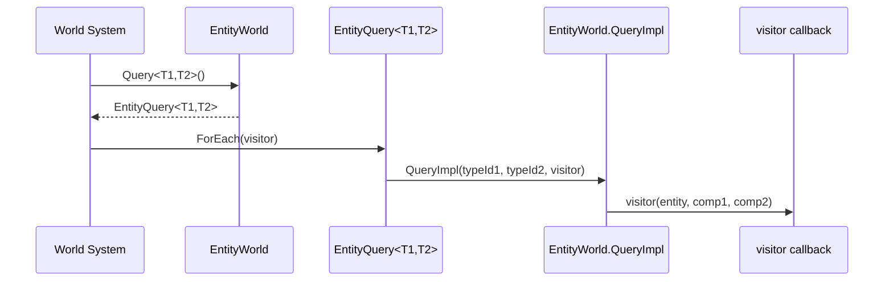
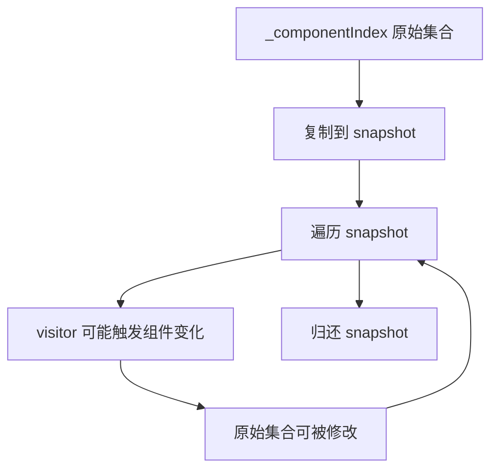
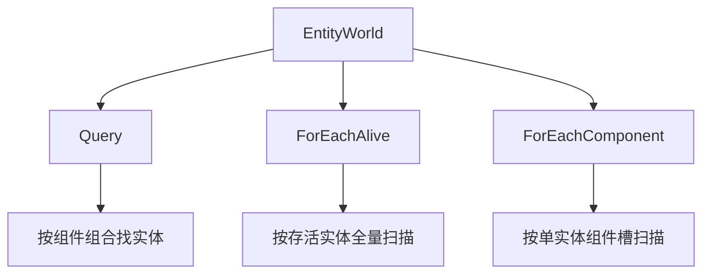
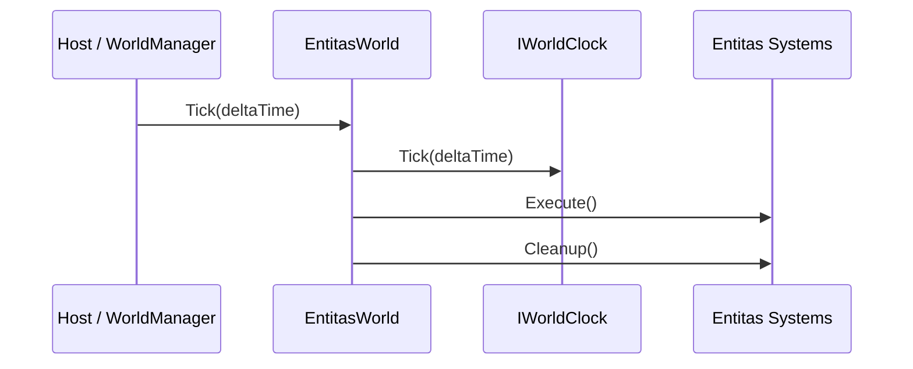
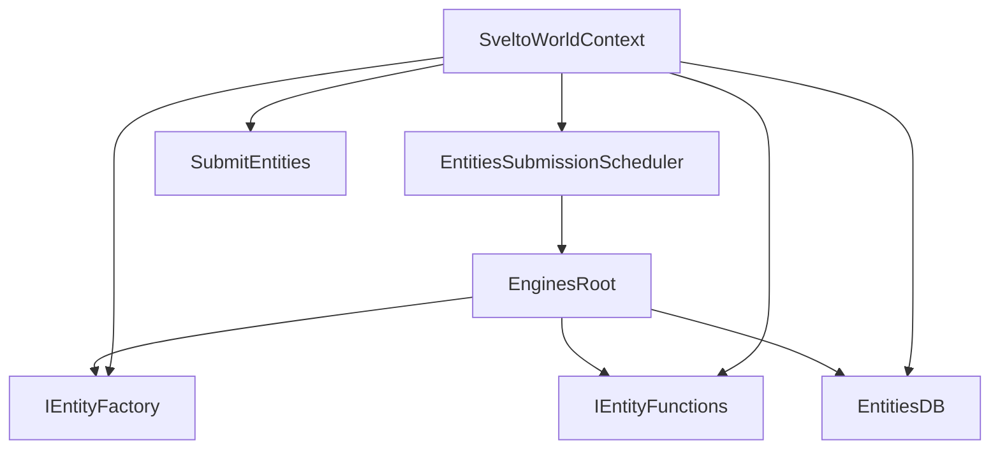
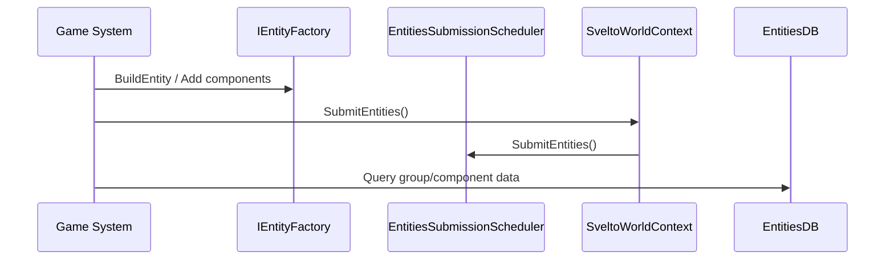
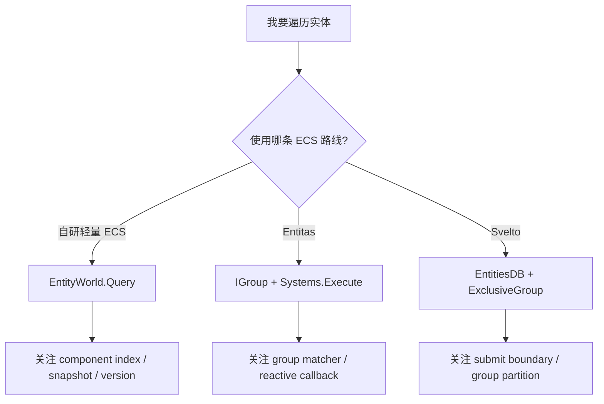

# 6.3 查询与遍历：从 EntityWorld.Query 到系统读路径

> 本文面向第一次阅读 AbilityKit ECS 源码的开发者。目标是把“查询怎么写”进一步拆成“查询为什么这样设计、源码从哪里进入、遍历时如何保证稳定、不同 ECS 适配层各自适合什么场景”。

---

## 1. 能力定位

ECS 查询是逻辑世界的读路径。系统每一帧要回答的问题通常不是“给我某个对象”，而是“给我所有同时拥有若干组件、当前仍然存活、可以被本系统处理的实体”。AbilityKit 里这条路径分成三种实现视角：

| 实现 | 查询入口 | 适合场景 | 设计重点 |
|------|----------|----------|----------|
| 自研 `EntityWorld` | `EntityWorld.Query<T1..T3>()` | 轻量逻辑、测试、框架内部稳定抽象 | 类型安全、少分配、版本校验、源码容易追踪 |
| Entitas 适配 | `IGroup<TEntity>`、`Systems.Execute()` | 以 group/reactive system 组织的项目 | 成熟生态、响应式系统、上下文分层 |
| Svelto 适配 | `EntitiesDB`、`ExclusiveGroupStruct` | 大规模数据和明确分组的模拟 | group 内结构化访问、提交调度、性能边界清晰 |

新手先理解自研 `EntityWorld`，再看 Entitas 和 Svelto，会更容易分清框架抽象与第三方 ECS 风格的边界。

---

## 2. 源码入口

| 目标 | 源码 | 先看什么 |
|------|------|----------|
| 查询 API 外壳 | `Unity/Packages/com.abilitykit.world.ecs/Runtime/AbilityKit.World.ECS/Core/EntityQuery.cs` | `EntityQuery<T1>`、`EntityQuery<T1,T2>`、`EntityQuery<T1,T2,T3>` |
| 查询执行实现 | `Unity/Packages/com.abilitykit.world.ecs/Runtime/AbilityKit.World.ECS/Impl/EntityWorld.cs` | `Query<T>()`、`QueryImpl<T>()`、`ForEachAlive()` |
| 实体有效性 | `Unity/Packages/com.abilitykit.world.ecs/Runtime/AbilityKit.World.ECS/Impl/EntityWorld.cs` | `IsAlive()`、`TryValidateId()`、`AllocateEntity()` |
| 组件索引维护 | `Unity/Packages/com.abilitykit.world.ecs/Runtime/AbilityKit.World.ECS/Impl/EntityWorld.cs` | `SetComponentInternal()`、`RemoveComponentById()` |
| Entitas 世界推进 | `Unity/Packages/com.abilitykit.world.entitas/Runtime/World/Core/EntitasWorld.cs` | `Tick()` 中的 `Systems.Execute()` / `Systems.Cleanup()` |
| Entitas 响应式系统 | `Unity/Packages/com.abilitykit.world.entitas/Runtime/World/Base/ReactiveWorldSystemBase.cs` | `CreateGroup()`、`OnEntityAddedToGroup()`、`OnEntityRemovedFromGroup()` |
| Svelto 上下文 | `Unity/Packages/com.abilitykit.world.svelto/Runtime/Svelto/SveltoWorldContext.cs` | `EntitiesDB`、`EntityFactory`、`SubmitEntities()` |
| Svelto DI 注册 | `Unity/Packages/com.abilitykit.world.svelto/Runtime/Svelto/SveltoWorldModule.cs` | `EntitiesDB`、`IEntityFactory`、`IEntityFunctions` 的注册 |

---

## 3. 自研 EntityWorld 的查询心智模型

### 3.1 API 看起来短，实际分成两层

业务或系统代码通常只接触这一层：

```csharp
world.Query<Position, Velocity>().ForEach((entity, position, velocity) =>
{
    // read components and update simulation intent
});
```

源码里它分成两步：

1. `EntityWorld.Query<T1,T2>()` 只创建一个轻量 `EntityQuery<T1,T2>`。
2. `EntityQuery<T1,T2>.ForEach(...)` 才调用 `EntityWorld.QueryImpl<T1,T2>(...)` 真正遍历。



这个设计让查询对象本身保持很薄：它只保存组件类型 id 和世界引用，不保存实体列表，也不提前分配结果集合。

### 3.2 为什么只支持 1 到 3 个组件

`EntityQuery<T1>`、`EntityQuery<T1,T2>`、`EntityQuery<T1,T2,T3>` 是固定泛型维度。它牺牲了一部分通用性，换来更简单的热路径：

| 设计选择 | 收益 | 代价 |
|----------|------|------|
| 固定 1-3 组件查询 | 调用简单、类型完整、无反射 | 超过 3 个组件需要拆系统或扩展重载 |
| `struct` 组件约束 | 值类型组件更适合热路径存储 | 引用组件走 `SetComponentRef`，不进泛型 query |
| `Action` visitor | API 易读，适合 Demo 与框架学习 | 极端性能场景可继续演进为无委托分配模式 |

新手写系统时，优先让一个系统处理一个清晰的组件组合。如果发现经常需要 `T1,T2,T3,T4,T5`，通常说明系统职责可能过宽，或者需要先用 tag/component 把候选集切小。

---

## 4. QueryImpl 的真实执行流程

以 `QueryImpl<T1,T2>()` 为例，它的核心流程是：

```mermaid
flowchart TD
    A[QueryImpl<T1,T2>] --> B{_componentIndex 有 typeId1?}
    B -- 否 --> Z[直接返回]
    B -- 是 --> C[从 _listPool 获取 snapshot]
    C --> D[复制 typeId1 的实体索引集合]
    D --> E[遍历 snapshot]
    E --> F{index 合法且 _alive[index]?}
    F -- 否 --> E
    F -- 是 --> G[构造 IEntityId(index, version)]
    G --> H{IsAlive(id)?}
    H -- 否 --> E
    H -- 是 --> I{组件数组存在且边界合法?}
    I -- 否 --> E
    I -- 是 --> J{store[typeId1] is T1 且 store[typeId2] is T2?}
    J -- 否 --> E
    J -- 是 --> K[调用 visitor(new IEntity, comp1, comp2)]
    K --> E
    E --> L[finally 归还 snapshot]
```

这段流程里有几个关键设计点。

### 4.1 第一个组件是候选集入口

内部使用 `_componentIndex[typeId1]` 找到拥有第一个组件的实体索引集合，然后再检查第二、第三个组件是否存在。

```mermaid
flowchart LR
    Index[_componentIndex[typeId1]] --> Candidate[候选实体索引]
    Candidate --> Check1[存活/version 校验]
    Check1 --> Check2[组件数组边界]
    Check2 --> Check3[typeId2/typeId3 类型匹配]
    Check3 --> Visitor[visitor]
```

因此组件顺序会影响扫描范围。如果某个组件非常常见，而另一个组件更稀有，把稀有组件放在 `T1` 通常能减少候选集。

示例：

```csharp
// 如果 Damageable 比 Position 更少，优先让 Damageable 成为第一个组件。
world.Query<Damageable, Position>().ForEach((entity, damageable, position) =>
{
});
```

### 4.2 snapshot 列表用于稳定遍历

查询不会直接 foreach `_componentIndex[typeId]` 的原始集合，而是先复制到池化的 snapshot 列表。



这样做的目的不是鼓励遍历时随意改结构，而是让系统更稳健：即使组件索引集合在回调里发生变化，也不会破坏当前枚举器。

推荐规则：

| 行为 | 建议 |
|------|------|
| 读取组件并计算结果 | 推荐 |
| 修改当前实体的普通状态 | 可以，但要理解组件是值类型拷贝还是引用状态 |
| 添加/删除当前 query 依赖的组件 | 谨慎，最好延迟到命令队列或阶段尾 |
| Destroy 当前实体 | 谨慎，当前遍历不会崩，但后续系统会受影响 |

### 4.3 存活校验保护实体句柄

AbilityKit 的实体 id 不只包含数组下标，还包含版本号。查询每次从 index 构造 `IEntityId(index, _versions[index])` 后，还会再次走 `IsAlive(id)`。

```mermaid
flowchart LR
    Index[index] --> Version[_versions[index]]
    Version --> Id[IEntityId]
    Id --> Alive{_alive && version match}
    Alive -- true --> Wrap[new IEntity]
    Alive -- false --> Skip[跳过]
```

这个版本校验解决的是“老句柄指向新实体”的问题。一个实体销毁后，数组槽位可能被复用；如果只看 index，旧引用可能误操作新实体。

---

## 5. Count 与 Any 的真实成本

`EntityQuery.Count()` 和 `EntityQuery.Any()` 都是基于 `ForEach` 实现的便利 API。

```mermaid
flowchart LR
    Count[Count()] --> ForEach1[ForEach 遍历命中项]
    ForEach1 --> Inc[count++]
    Any[Any()] --> ForEach2[ForEach 遍历命中项]
    ForEach2 --> Flag[found = true]
```

这意味着它们不是读取预先维护的计数器。

| API | 适合用途 | 注意点 |
|-----|----------|--------|
| `Count()` | 调试、测试、小规模统计 | 热路径频繁调用会重复遍历 |
| `Any()` | 判断是否存在目标 | 当前实现仍会走完整 `ForEach` 回调链，不是短路索引查询 |
| `ForEach()` | 系统主路径 | 把实际业务处理放在一次遍历里完成 |

如果一个系统先 `Any()` 再 `ForEach()`，就可能做了两次查询。更稳妥的写法是在一次 `ForEach()` 中统计和处理。

---

## 6. ForEachAlive 与 ForEachComponent

除了按组件组合查询，`EntityWorld` 还提供两个更底层的遍历入口。

| API | 作用 | 适合场景 |
|-----|------|----------|
| `ForEachAlive(Action<IEntity>)` | 遍历所有存活实体 | 诊断、全局清理、导出快照前扫描 |
| `ForEachComponent(IEntityId, Action<int, object>)` | 遍历某个实体上的所有组件槽 | 调试、序列化、编辑器检查 |



推荐优先级是：业务系统用 `Query<T...>()`，诊断工具用 `ForEachAlive()` 和 `ForEachComponent()`。

---

## 7. Entitas 查询视角

Entitas 适配层不是复刻 `EntityWorld.Query<T>()`，而是保持 Entitas 自己的 group/system 风格。

`EntitasWorld.Tick(deltaTime)` 中每帧执行：



响应式系统基类的心智模型是：

```mermaid
flowchart TD
    A[ReactiveWorldSystemBase.Initialize] --> B[CreateGroup(Contexts)]
    B --> C[订阅 Group.OnEntityAdded]
    B --> D[订阅 Group.OnEntityRemoved]
    C --> E[OnEntityAddedToGroup(entity)]
    D --> F[OnEntityRemovedFromGroup(entity)]
    G[Dispose] --> H[取消订阅]
```

和自研 `EntityWorld` 相比，Entitas 更强调“组变化驱动系统”。你不一定每次都主动 query 一遍世界，而是先定义 group，再让系统响应实体进入/离开 group。

---

## 8. Svelto 查询视角

Svelto 适配层的核心上下文是 `SveltoWorldContext`。它在构造时建立：

| 对象 | 作用 |
|------|------|
| `EntitiesSubmissionScheduler` | 控制实体提交时机 |
| `EnginesRoot` | Svelto 引擎根对象 |
| `IEntityFactory` | 创建实体 |
| `IEntityFunctions` | 修改/移除实体 |
| `EntitiesDB` | 查询实体数据 |



Svelto 的重要习惯是：创建和修改实体后，变更通常要通过 `SubmitEntities()` 进入可查询状态。对新人来说，可以先记住这条边界：写入侧通过 factory/functions/scheduler，读取侧通过 `EntitiesDB` 和 group。



---

## 9. 三种查询模型怎么选

| 问题 | 优先看 |
|------|--------|
| 我只是想理解 AbilityKit ECS 最小实现 | 自研 `EntityWorld` |
| 我想知道一帧里系统怎么被调度 | `EntitasWorld.Tick()` 或对应 world module |
| 我需要响应“实体进入某个组件组合” | Entitas `ReactiveWorldSystemBase` |
| 我需要大规模实体、明确 group、性能边界 | Svelto `EntitiesDB` + `ExclusiveGroup` |
| 我在写框架文档或测试 | 自研 `EntityWorld` 最容易源码级解释 |
| 我在读 Shooter Demo | Svelto 路线更重要 |
| 我在读旧 Entitas 风格 Demo | Entitas group/system 路线更重要 |



---

## 10. 新手常见误区

| 误区 | 正确认知 |
|------|----------|
| `Query<T>()` 立即生成实体列表 | 它只返回查询视图，`ForEach` 才执行遍历 |
| `Count()` 是 O(1) | 当前实现通过遍历计数 |
| 组件泛型顺序无所谓 | 第一个组件决定候选索引集合，顺序会影响扫描范围 |
| snapshot 代表可以随意结构修改 | snapshot 保证当前枚举稳定，不代表结构修改没有业务副作用 |
| `IEntityId` 只要 index | 版本号同样重要，用来避免老句柄误命中新实体 |
| 自研 ECS、Entitas、Svelto 是同一套查询 API | 它们是三种实现视角，框架文档需要分别解释 |

---

## 11. 推荐阅读顺序

1. 先读 `EntityQuery.cs`，理解查询外壳很薄。
2. 再读 `EntityWorld.Query<T...>()`，确认泛型组件 id 怎么进入查询。
3. 再读 `QueryImpl<T1>()`、`QueryImpl<T1,T2>()`、`QueryImpl<T1,T2,T3>()`，重点看 `_componentIndex`、snapshot、`IsAlive()`。
4. 再读 `SetComponentInternal()` 和 `RemoveComponentById()`，理解索引集合如何被维护。
5. 最后再对照 `EntitasWorld.Tick()`、`ReactiveWorldSystemBase`、`SveltoWorldContext`，建立不同 ECS 适配的差异。

---

## 12. 和其他文档的关系

| 下一步 | 说明 |
|--------|------|
| [ECS 核心概念](./01-ECSCoreConcepts.md) | 回到 Entity/Component/System 的基本概念 |
| [Entitas 实现](./02-EntitasImplementation.md) | 深入 EntitasWorld 和系统组合方式 |
| [Svelto 实现](./03-SveltoImplementation.md) | 深入 SveltoWorldContext、EnginesRoot、EntitiesDB |
| [查询与遍历总览](./04-QueryAndTraversal.md) | 更短的总览版本，适合快速复习 |
| [项目结构](../01-OverviewAndGettingStarted/04-ProjectStructure.md) | 确认 Unity Package 与 .NET 工程关系 |

---

*文档版本：v1.0 | 最后更新：2026-07-03*
