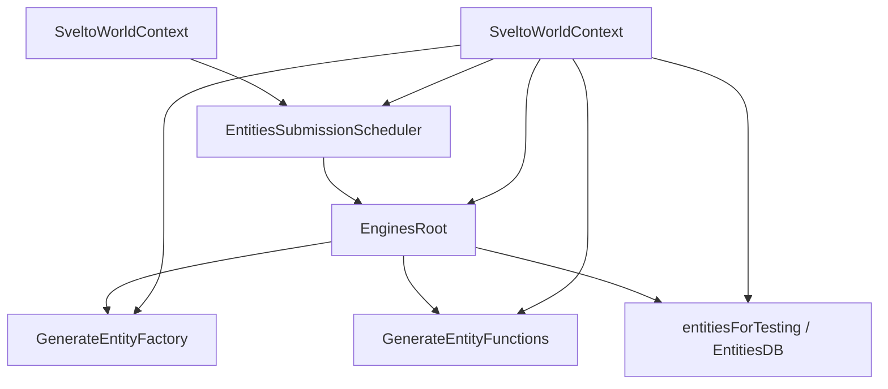
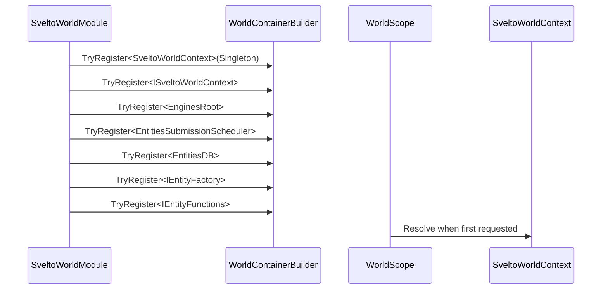
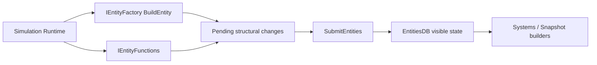
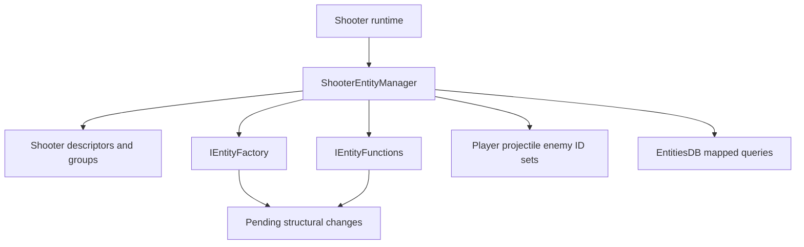
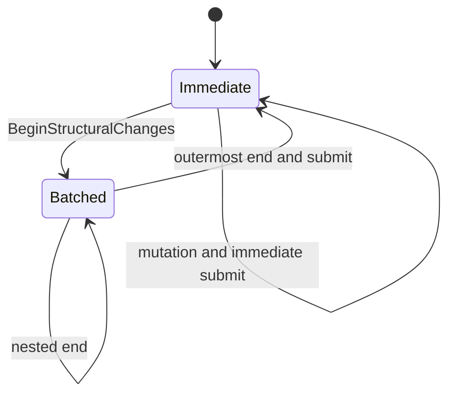
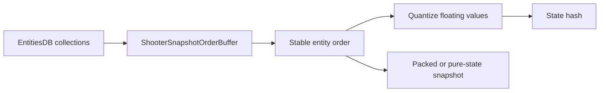

# 6.3 Svelto 实现

> 本文说明 AbilityKit 如何通过 `SveltoWorldModule` 与 `SveltoWorldContext` 将 Svelto ECS 接入 World.DI，并为 Shooter 等高性能示例提供实体数据库、工厂、函数和提交调度器。

---

## 目录

- [6.3 Svelto 实现](#63-svelto-实现)
  - [目录](#目录)
  - [1. 能力定位](#1-能力定位)
  - [2. 源码入口](#2-源码入口)
  - [3. 上下文组成](#3-上下文组成)
  - [4. 模块注册流程](#4-模块注册流程)
  - [5. 运行与释放](#5-运行与释放)
    - [5.1 实体提交](#51-实体提交)
    - [5.2 释放顺序](#52-释放顺序)
  - [6. Shooter 生产接入](#6-shooter-生产接入)
    - [6.1 实体布局与所有权](#61-实体布局与所有权)
    - [6.2 结构变更批处理](#62-结构变更批处理)
    - [6.3 查询、快照与状态哈希](#63-查询快照与状态哈希)
  - [7. 设计约束与扩展点](#7-设计约束与扩展点)
  - [8. 验证证据与成熟度](#8-验证证据与成熟度)
  - [9. 关联文档](#9-关联文档)

---

## 1. 能力定位

AbilityKit 的 Svelto 接入层不是重新封装完整 ECS，而是把 Svelto 的核心运行对象注册进世界级 DI，让玩法 Runtime 可以按需解析：

| 对象 | 作用 |
|------|------|
| `SveltoWorldContext` | 持有一个 Svelto 世界上下文 |
| `EnginesRoot` | Svelto engine 生命周期根对象 |
| `EntitiesSubmissionScheduler` | 结构变更提交调度器 |
| `EntitiesDB` | 查询实体和组件的只读/运行时数据库 |
| `IEntityFactory` | 创建实体 |
| `IEntityFunctions` | 删除、移动、修改实体 |

这种设计适合 Shooter 等需要高性能结构化模拟的示例：AbilityKit 保持 Host、网络、快照、玩法服务统一，而局部模拟可以使用 Svelto 的 group、engine、component 体系。

---

## 2. 源码入口

| 类型 | 源码 | 说明 |
|------|------|------|
| `SveltoWorldModule` | [SveltoWorldModule.cs](../../../Unity/Packages/com.abilitykit.world.svelto/Runtime/Svelto/SveltoWorldModule.cs) | 向 World.DI 注册 Svelto 核心对象 |
| `SveltoWorldContext` | [SveltoWorldContext.cs](../../../Unity/Packages/com.abilitykit.world.svelto/Runtime/Svelto/SveltoWorldContext.cs) | 创建并持有 Svelto 上下文 |
| `ISveltoWorldContext` | [ISveltoWorldContext.cs](../../../Unity/Packages/com.abilitykit.world.svelto/Runtime/Svelto/ISveltoWorldContext.cs) | 上下文接口 |
| `ShooterEntityManager` | [ShooterEntityManager.cs](../../../Unity/Packages/com.abilitykit.demo.shooter.runtime/Runtime/Application/Services/EntityManager/ShooterEntityManager.cs) | Shooter 实体 ID、容量和结构提交所有者 |
| `ShooterSveltoEntityLayout` | [ShooterSveltoEntityLayout.cs](../../../Unity/Packages/com.abilitykit.demo.shooter.runtime/Runtime/Infrastructure/Ecs/Svelto/ShooterSveltoEntityLayout.cs) | player、projectile、gameplay target 的 descriptor/group 布局 |
| `ShooterStateHasher` | [ShooterStateHasher.cs](../../../Unity/Packages/com.abilitykit.demo.shooter.runtime/Runtime/Application/Synchronization/ShooterStateHasher.cs) | 查询 DB、稳定排序、量化并生成状态 hash |
| Svelto thirdparty | [Runtime](../../../Unity/Packages/com.abilitykit.thirdparty.svelto/Runtime) | Svelto ECS 源码与扩展 |

---

## 3. 上下文组成

`SveltoWorldContext` 构造时会创建完整的 Svelto 基础对象：



`EntitiesDB` 的实际来源是把 `EnginesRoot` 转为 `IUnitTestingInterface` 后读取 `entitiesForTesting`。该上游成员虽带 testing 命名，但当前 AbilityKit 适配层通过 `ISveltoWorldContext.EntitiesDB` 将其作为正式查询入口公开，Shooter 运行时和状态哈希也依赖这一入口。升级 Svelto 版本时，应把该内部接口兼容性列为显式迁移风险。

字段语义：

| 字段 | 语义 |
|------|------|
| `EnginesRoot` | 添加 engine、管理 engine 生命周期 |
| `Scheduler` | 提交实体结构变化；未提交前实体创建/删除不会完全反映到查询侧 |
| `EntitiesDB` | 查询组件数组、group、entity collection |
| `EntityFactory` | 构建实体，通常配合 descriptor 和 `EGID` |
| `EntityFunctions` | 删除、swap group、操作实体生命周期 |

---

## 4. 模块注册流程

`SveltoWorldModule.Configure` 使用 `TryRegister` 注册单例对象。注册顺序体现了对象依赖：

1. 先注册 `SveltoWorldContext`。
2. 再把 `ISveltoWorldContext` 映射到同一个 context。
3. 从 context 暴露 `EnginesRoot`。
4. 从 context 暴露 `EntitiesSubmissionScheduler`。
5. 从 context 暴露 `EntitiesDB`。
6. 从 context 暴露 `IEntityFactory`。
7. 从 context 暴露 `IEntityFunctions`。



`TryRegister` 只保证“不覆盖同一服务键”，不保证替换其中一个注册就能替换整组对象。例如只预注册 `ISveltoWorldContext` 时，模块仍可能创建默认 `SveltoWorldContext`，并让 `EnginesRoot`、Scheduler、DB、Factory 和 Functions 继续从具体 context 解析。需要整体替换默认世界时，应在模块装配顺序中覆盖具体 context 及所有依赖映射，或提供一个统一的替代模块；不能把单个接口预注册视为整套 Svelto context 的替换开关。

---

## 5. 运行与释放

### 5.1 实体提交

`SveltoWorldContext.SubmitEntities` 只是薄封装：

```csharp
Scheduler.SubmitEntities();
```

在 Svelto 中，创建/删除/移动实体通常先进入待提交队列，再由 scheduler 统一提交。AbilityKit 将 scheduler 暴露到 DI 后，系统或 runtime 可以明确控制提交点。普通组件字段的 mapped query 原地写回不是结构变更，Shooter 不会为每次字段更新调用提交；把两种写入混为一谈会引入多余同步点。



### 5.2 释放顺序

`Dispose` 阶段：

1. 防止重复释放。
2. `EnginesRoot.Dispose()`。
3. `Scheduler.Dispose()`。

`ThrowIfDisposed` 保证释放后不能再提交实体。

---

## 6. Shooter 生产接入

### 6.1 实体布局与所有权

Shooter 没有把 Svelto 对象直接散落给所有玩法服务。`ShooterSveltoEntityLayout` 固定 descriptor/group，`ShooterEntityManager` 再维护 player、projectile、enemy 的 ID 集合和容量约束，成为创建、删除和按 ID 查询的业务所有者。



这些 ID 集合是 Shooter 的业务索引，不是 Svelto DB 的替代品。结构操作需要同时维护 Svelto 实体与集合；容量达到上限时，调用方还要遵守 Shooter 自己的拒绝或截断语义，不能只根据 DB 是否可创建来判断成功。

### 6.2 结构变更批处理

`ShooterEntityManager` 使用 `_structuralChangeDepth` 和 `_hasPendingStructuralChanges` 合并嵌套结构操作：

1. `BeginStructuralChanges` 增加深度。
2. 批处理中创建或删除只标记 pending。
3. `EndStructuralChanges` 减少深度；最外层结束时统一 `SubmitEntities`。
4. 非批处理路径的结构操作直接提交。



该 API 不是严格配对验证器：深度已经为 0 时调用 `EndStructuralChanges` 仍会走直接提交，不会抛出未配对错误。因此调用方仍需用 `try/finally` 保证批处理边界，测试也不应依赖错误配对自动失败。

### 6.3 查询、快照与状态哈希

Shooter 的 snapshot/hash 直接从 `EntitiesDB` 读取组件，但不会把 collection 原始遍历顺序当作确定性保证。`ShooterStateHasher` 为 player、projectile、enemy 构造稳定顺序，再将浮点值量化后进入 FNV 风格 hash。



因此，新增 group、改变实体布局或修改 snapshot 字段时，需要同时复核排序键、量化规则、hash 字段和恢复测试。Svelto collection 在一次运行中的可遍历性，不等于跨运行、跨端或回滚重演的稳定顺序契约。

---

## 7. 设计约束与扩展点

| 维度 | 约束或扩展边界 |
|------|----------------|
| 世界所有权 | `SveltoWorldContext` 是世界级单例，不应跨世界共享 |
| 结构写入 | 创建、删除、移动实体后需要提交；普通组件 mapped write 不需要结构提交 |
| 查询职责 | `EntitiesDB` 用于查询，不替代 Factory/Functions 做结构变化 |
| 注册替换 | 替换完整 context 时必须处理具体类型和全部派生服务映射 |
| 布局 | descriptor/group 由玩法层定义，和 AbilityKit world/entity 不一一映射 |
| Engine | 模拟逻辑可通过 `EnginesRoot.AddEngine` 注册，并服从 root 生命周期 |
| Snapshot | 从 DB 读取时必须建立显式稳定顺序和量化规则 |
| 性能 | 批量结构变化应合并提交，并避免热路径分配和跨 group 随机访问 |

---

## 8. 验证证据与成熟度

| 证据 | 入口 | 覆盖范围 |
|------|------|----------|
| .NET 编译 | `dotnet build src/AbilityKit.World.Svelto/AbilityKit.World.Svelto.csproj -c Release` | package-linked 适配层、World.DI 和 thirdparty Svelto 依赖 |
| World 模块测试 | `src/AbilityKit.Demo.Shooter.Runtime.Tests/Worlds/ShooterWorldModuleTests.cs` | Shooter world 模块装配和 Svelto 服务解析 |
| Gameplay scenario 测试 | `src/AbilityKit.Demo.Shooter.Runtime.Tests/Gameplay/ShooterSveltoGameplayScenarioRunnerTests.cs` | Svelto 场景运行和玩法结果 |
| Snapshot/hash/恢复测试 | `src/AbilityKit.Demo.Shooter.Runtime.Tests` 下 snapshot、reconciliation、rollback 与 protocol 测试 | 稳定排序、状态 hash、恢复和确定性集成证据 |

当前基础 `com.abilitykit.world.svelto` 适配层未发现独立单元测试工程；现有强证据主要来自 Shooter 集成测试，不能等同于所有模块注册替换、释放后访问和 Svelto 升级兼容性都已被隔离验证。后续应为 `TryRegister` 组合、`EntitiesDB` 上游接口来源、重复 Dispose/提交和结构批处理配对增加聚焦契约测试。

---

## 9. 关联文档

- [ECS 核心概念](./01-ECSCoreConcepts.md) - ECS 抽象基础
- [Entitas 实现](./02-EntitasImplementation.md) - Entitas 版世界生命周期
- [查询与遍历](./04-QueryAndTraversal.md) - 多 ECS 查询策略对比
- [Shooter Runtime、Svelto 装配与恢复边界](../09-ImplementationExamples/Shooter/01-RuntimeSveltoSimulation.md) - Shooter 运行时装配与结构提交
- [Shooter Snapshot、Hash 与同步模型](../09-ImplementationExamples/Shooter/02-SnapshotHashSync.md) - 确定性排序、hash 和同步消费

---

*文档版本：v1.1 | 最后更新：2026-07-15*
