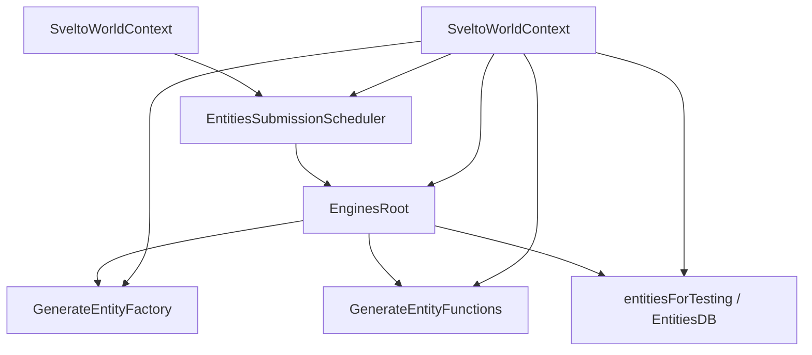
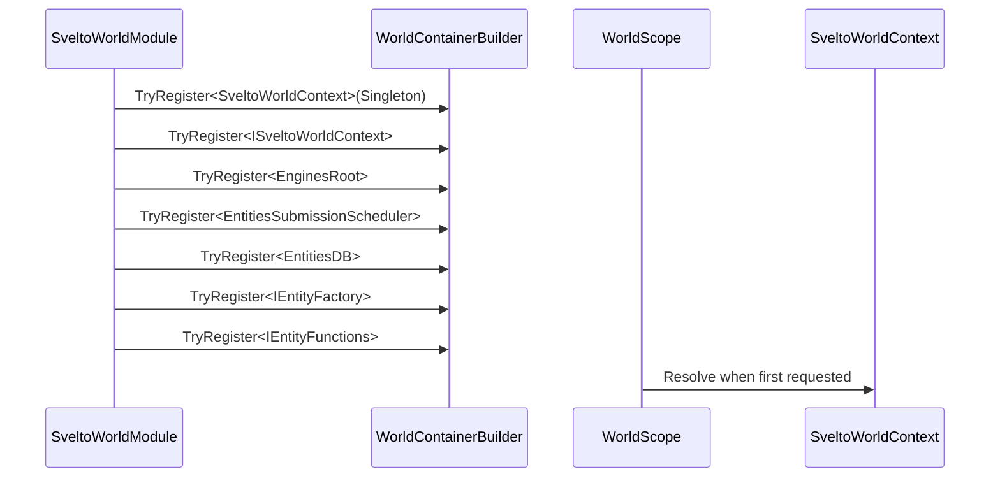
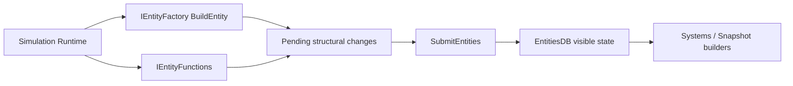

# 6.3 Svelto 实现

> 本文说明 AbilityKit 如何通过 `SveltoWorldModule` 与 `SveltoWorldContext` 将 Svelto ECS 接入 World.DI，并为 Shooter 等高性能示例提供实体数据库、工厂、函数和提交调度器。

---

## 目录

- [6.3 Svelto 实现](#63-svelto-实现)
  - [目录](#目录)
  - [1. 能力定位](#1-能力定位)
  - [2. 源码入口](#2-源码入口)
  - [3. 上下文组成](#3-上下文组成)
  - [4. 模块注册流程](#4-模块注册流程)
  - [5. 运行与释放](#5-运行与释放)
    - [5.1 实体提交](#51-实体提交)
    - [5.2 释放顺序](#52-释放顺序)
  - [6. 设计约束与扩展点](#6-设计约束与扩展点)
    - [6.1 约束](#61-约束)
    - [6.2 扩展点](#62-扩展点)
  - [7. 关联文档](#7-关联文档)

---

## 1. 能力定位

AbilityKit 的 Svelto 接入层不是重新封装完整 ECS，而是把 Svelto 的核心运行对象注册进世界级 DI，让玩法 Runtime 可以按需解析：

| 对象 | 作用 |
|------|------|
| `SveltoWorldContext` | 持有一个 Svelto 世界上下文 |
| `EnginesRoot` | Svelto engine 生命周期根对象 |
| `EntitiesSubmissionScheduler` | 结构变更提交调度器 |
| `EntitiesDB` | 查询实体和组件的只读/运行时数据库 |
| `IEntityFactory` | 创建实体 |
| `IEntityFunctions` | 删除、移动、修改实体 |

这种设计适合 Shooter 等需要高性能结构化模拟的示例：AbilityKit 保持 Host、网络、快照、玩法服务统一，而局部模拟可以使用 Svelto 的 group、engine、component 体系。

---

## 2. 源码入口

| 类型 | 源码 | 说明 |
|------|------|------|
| `SveltoWorldModule` | `Unity/Packages/com.abilitykit.world.svelto/Runtime/Svelto/SveltoWorldModule.cs` | 向 World.DI 注册 Svelto 核心对象 |
| `SveltoWorldContext` | `Unity/Packages/com.abilitykit.world.svelto/Runtime/Svelto/SveltoWorldContext.cs` | 创建并持有 Svelto 上下文 |
| `ISveltoWorldContext` | `Unity/Packages/com.abilitykit.world.svelto/Runtime/Svelto/ISveltoWorldContext.cs` | 上下文接口 |
| Svelto thirdparty | `Unity/Packages/com.abilitykit.thirdparty.svelto/Runtime` | Svelto ECS 源码与扩展 |

---

## 3. 上下文组成

`SveltoWorldContext` 构造时会创建完整的 Svelto 基础对象：



字段语义：

| 字段 | 语义 |
|------|------|
| `EnginesRoot` | 添加 engine、管理 engine 生命周期 |
| `Scheduler` | 提交实体结构变化；未提交前实体创建/删除不会完全反映到查询侧 |
| `EntitiesDB` | 查询组件数组、group、entity collection |
| `EntityFactory` | 构建实体，通常配合 descriptor 和 `EGID` |
| `EntityFunctions` | 删除、swap group、操作实体生命周期 |

---

## 4. 模块注册流程

`SveltoWorldModule.Configure` 使用 `TryRegister` 注册单例对象。注册顺序体现了对象依赖：

1. 先注册 `SveltoWorldContext`。
2. 再把 `ISveltoWorldContext` 映射到同一个 context。
3. 从 context 暴露 `EnginesRoot`。
4. 从 context 暴露 `EntitiesSubmissionScheduler`。
5. 从 context 暴露 `EntitiesDB`。
6. 从 context 暴露 `IEntityFactory`。
7. 从 context 暴露 `IEntityFunctions`。



`TryRegister` 的使用表示：如果上层已经注册了自定义 Svelto 上下文或替代对象，模块不会强制覆盖。这为测试、性能模式、专用 runtime 提供了替换入口。

---

## 5. 运行与释放

### 5.1 实体提交

`SveltoWorldContext.SubmitEntities` 只是薄封装：

```csharp
Scheduler.SubmitEntities();
```

在 Svelto 中，创建/删除/移动实体通常先进入待提交队列，再由 scheduler 统一提交。AbilityKit 将 scheduler 暴露到 DI 后，系统或 runtime 可以明确控制提交点。



### 5.2 释放顺序

`Dispose` 阶段：

1. 防止重复释放。
2. `EnginesRoot.Dispose()`。
3. `Scheduler.Dispose()`。

`ThrowIfDisposed` 保证释放后不能再提交实体。

---

## 6. 设计约束与扩展点

### 6.1 约束

- `SveltoWorldContext` 是世界级单例，不应跨世界共享。
- 创建/删除实体后需要明确调用 `SubmitEntities`。
- `EntitiesDB` 偏查询视角，不应替代 `IEntityFactory` / `IEntityFunctions` 做结构变化。
- Svelto group 与 AbilityKit world/entity 概念不是一一映射，需要在示例层定义桥接规则。
- 高性能模式下应避免频繁分配和跨 group 随机访问。

### 6.2 扩展点

| 扩展点 | 说明 |
|--------|------|
| 自定义 `SveltoWorldContext` | 可替换 scheduler 或注入测试用 context |
| 自定义 `IWorldModule` | 在 Svelto 基础对象之上注册玩法服务 |
| Svelto Engine | 通过 `EnginesRoot.AddEngine` 注册模拟逻辑 |
| Entity Descriptor | 定义实体组件布局 |
| Exclusive Group | 定义阵营、生命周期、场景分区、兴趣范围等分组 |
| Snapshot Builder | 从 `EntitiesDB` 读取组件生成网络快照 |

---

## 7. 关联文档

- [ECS 核心概念](./01-ECSCoreConcepts.md) - ECS 抽象基础
- [Entitas 实现](./02-EntitasImplementation.md) - Entitas 版世界生命周期
- [查询与遍历](./04-QueryAndTraversal.md) - 多 ECS 查询策略对比

---

*文档版本：v1.0 | 最后更新：2026-06-23*
