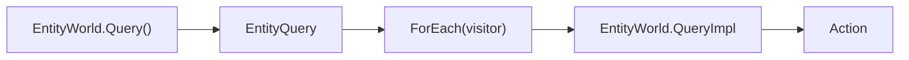
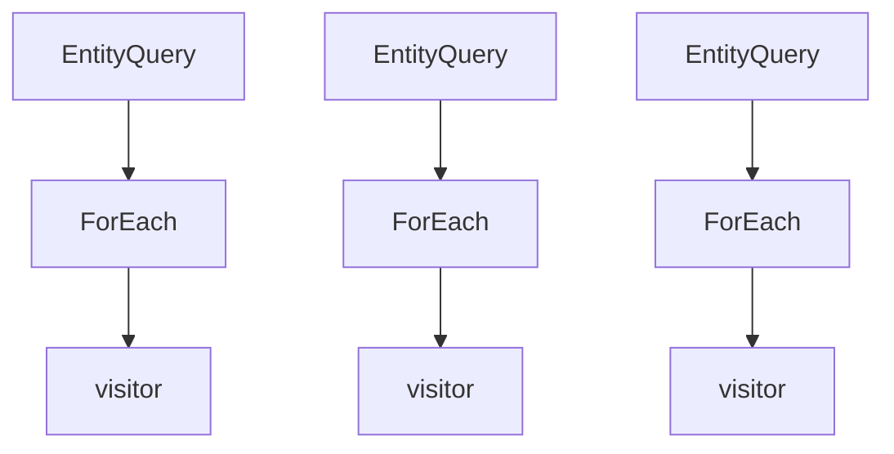
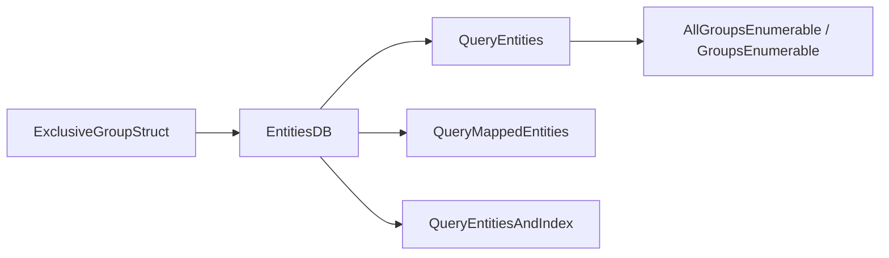

# 6.4 查询与遍历

> 本文说明 AbilityKit 在 ECS 层如何做类型安全、低分配、按组/按组件的查询与遍历，并解释 Entitas、Svelto 与自研 `EntityWorld` 的性能和确定性边界。

---

## 目录

1. [能力定位](#1-能力定位)
2. [源码入口](#2-源码入口)
3. [自研 EntityWorld 查询模型](#3-自研-entityworld-查询模型)
4. [Entitas 与 Svelto 的查询视角](#4-entitas-与-svelto-的查询视角)
5. [修改、分配与确定性边界](#5-修改分配与确定性边界)
6. [设计约束与扩展点](#6-设计约束与扩展点)
7. [验证与成熟度](#7-验证与成熟度)
8. [关联文档](#8-关联文档)

---

## 1. 能力定位

查询与遍历是 ECS 架构里的核心读路径。AbilityKit 需要同时支持三类场景：

| 场景 | 需求 |
|------|------|
| 逻辑模拟 | 以组件组合遍历活跃实体 |
| 网络同步 | 以快照、group、entity id 精准读取目标集合 |
| 表现与诊断 | 在不污染业务状态的前提下收集统计和可视化数据 |

本文覆盖的重点不是“怎么写一个 foreach”，而是查询模型如何影响性能、分配、稳定性和系统组织方式。

---

## 2. 源码入口

| 类型 | 源码 | 说明 |
|------|------|------|
| `EntityQuery<T1..T3>` | [EntityQuery.cs](../../../Unity/Packages/com.abilitykit.world.ecs/Runtime/AbilityKit.World.ECS/Core/EntityQuery.cs) | 类型安全惰性查询视图 |
| Unity `EntityWorld.QueryImpl` | [EntityWorld.cs](../../../Unity/Packages/com.abilitykit.world.ecs/Runtime/AbilityKit.World.ECS/Impl/EntityWorld.cs) | package 内查询执行 |
| .NET `EntityWorld.QueryImpl` | [EntityWorld.cs](../../../src/AbilityKit.World.ECS/Impl/EntityWorld.cs) | .NET 构建实际使用的镜像实现 |
| .NET 构建入口 | [AbilityKit.World.ECS.csproj](../../../src/AbilityKit.World.ECS/AbilityKit.World.ECS.csproj) | 排除 package `EntityWorld` 并编译本地镜像 |
| Entitas group 观察 | [ReactiveWorldSystemBase.cs](../../../Unity/Packages/com.abilitykit.world.entitas/Runtime/World/Base/ReactiveWorldSystemBase.cs) | Group 与组件替换事件适配 |
| Svelto 生产布局 | [ShooterSveltoEntityLayout.cs](../../../Unity/Packages/com.abilitykit.demo.shooter.runtime/Runtime/Infrastructure/Ecs/Svelto/ShooterSveltoEntityLayout.cs) | ExclusiveGroup 与 mapped query 生产示例 |

---

## 3. 自研 EntityWorld 查询模型

### 3.1 查询结果是惰性遍历视图

`EntityWorld.Query<T>()` 不直接返回实体集合，而是返回一个 `EntityQuery<T>` 值类型结果。它只持有：

- 组件类型 id。
- 指向 `EntityWorld` 的引用。

真正遍历发生在 `ForEach(...)` 调用时。

### 3.2 查询实现以组件索引为入口

`EntityWorld.QueryImpl` 的基本流程：

1. 通过 `_componentIndex` 找到候选实体索引集合；双/三组件查询固定使用 `T1` 的索引，不会自动选择最稀疏组件。
2. 从对象池取出一个 `List<int>` snapshot，将候选 `HashSet<int>` 复制进去。
3. 遍历 snapshot，对每个索引检查范围、`_alive`、当前 version 和组件存在性。
4. 读取当前组件值并调用 visitor。
5. 在 `finally` 中清空并归还 snapshot。

这意味着查询具有以下特性：

- **类型安全**：由泛型和 struct 约束保证值类型组件签名。
- **惰性视图**：创建 `EntityQuery` 不执行查询，每次 `ForEach` 都读取实时 world。
- **候选集合隔离**：visitor 增删组件或销毁实体不会修改正在枚举的 snapshot。
- **非冻结快照**：snapshot 只复制 index；后续实体存活性和组件值仍按访问时状态读取。
- **候选效率依赖参数顺序**：`Query<Rare, Common>()` 通常比 `Query<Common, Rare>()` 扫描更少，但结果集合语义相同。

### 3.3 单/双/三组件查询的取舍

`EntityQuery<T1>`、`EntityQuery<T1, T2>`、`EntityQuery<T1, T2, T3>` 提供固定 arity 的查询接口：

- 好处：调用简单，编译期类型完整，遍历路径固定。
- 代价：维度超过三时需要扩展更多重载，灵活性较弱。

这类接口适合热点路径和玩法系统，不适合通用反射式数据查询。

### 3.4 存活性检查是查询的一部分

`ForEachAlive` 与 `QueryImpl` 都明确检查 `_alive[index]`、由当前 `_versions[index]` 构造的 id、组件数组边界和组件存在性。它们会跳过已经销毁的候选，但 snapshot 只保存 index，不保存捕获时的 version：若 visitor 销毁某实体并在同一 index 上创建新实体，后续访问会针对该 index 的当前实体重新判断，而不是保证“查询开始时实体集合”的版本一致性。

因此该机制防止直接读取无效槽位，但不是事务快照或并发读视图。`EntityWorld` 的注释也明确实际模型是单线程使用；`ConcurrentStack` 只用于空闲索引存储，不代表整个 world 线程安全。

---

## 4. Entitas 与 Svelto 的查询视角

### 4.1 Entitas 偏 group/Reactive

在 Entitas 侧，Matcher 定义集合条件，Context 缓存对应 Group；业务系统通常长期持有 `IGroup<TEntity>`，逐帧调用 `GetEntities()`，或订阅 add/remove/update 事件维护派生索引。

`ReactiveWorldSystemBase` 创建 group 后订阅 add/remove，并为组内实体订阅组件 replace。变化先进入 `HashSet<TEntity>` pending，同帧重复变化会合并，Execute 再复制到复用 buffer/array。该 pending 的枚举顺序没有稳定排序保证，`GetEntities()` 和执行数组扩容也不能被描述为无条件零分配。

MOBA 的 [EntitasActorIdLookup.cs](../../../Unity/Packages/com.abilitykit.demo.moba.runtime/Runtime/Common/Shared/ECS/Entitas/EntitasActorIdLookup.cs) 与 [ActorIdIndex.cs](../../../Unity/Packages/com.abilitykit.demo.moba.runtime/Runtime/Application/Services/Actor/ActorIdIndex.cs) 通过 group 事件维护 `actorId -> entity` 字典，说明稳定业务键查询应使用显式二级索引，而不是反复扫描 Group。

### 4.2 Svelto 偏 `EntitiesDB` + group 扩展

Svelto 侧常见查询形式是：

- `EntitiesDB.QueryEntities<T>(group)`
- `EntitiesDB.QueryMappedEntities<T>(groups)`
- `EntitiesDB.QueryEntitiesAndIndex<T>(egid)`
- `AllGroupsEnumerable<T>` / `GroupsEnumerable<T1..T4>`

Svelto 的重点是：

1. 通过 `ExclusiveGroupStruct` 切分逻辑域。
2. 在 group 内按组件查询。
3. 使用多组枚举器减少重复样板代码。
4. 通过 `QueryMappedEntities` 和 `QueryNativeMappedEntities` 支持跨组映射。

Shooter 生产实现使用固定 ExclusiveGroup 和 mapped component 查询，但 collection/group 的原始枚举顺序不等于跨运行确定性。需要稳定快照或 hash 时，应先按业务稳定键排序，再量化浮点值；详见 [Svelto 实现](./03-SveltoImplementation.md)。

### 4.3 设计上的共同点

虽然 Entitas 和 Svelto 的 API 不同，但它们都以结构化存储为中心，通过 group/context 缩小扫描范围，并鼓励复用查询对象或集合。它们都不自动提供业务排序、事务快照或跨线程一致性，这些能力必须由上层显式建立。

---

## 5. 修改、分配与确定性边界

| 维度 | 自研 EntityWorld | Entitas | Svelto |
|------|------------------|---------|--------|
| 查询候选 | `T1` 组件索引的池化 snapshot | Matcher 对应缓存 Group | ExclusiveGroup + component storage |
| 遍历中结构修改 | 候选集合已复制，可修改 world；后续读取反映当前状态 | Group 事件同步更新，具体迭代安全性取决于所用 API | 遵守 submission/structural change 边界，不在 storage 枚举中直接改结构 |
| 分配边界 | query struct 本身不分配；List 首次创建/扩容、捕获 delegate 可分配 | `GetEntities()`/buffer 扩容及业务临时集合可能分配 | 查询 API 可低分配，但映射、临时集合和调用方式仍需实测 |
| 顺序保证 | HashSet snapshot 顺序未声明 | Group/pending 顺序不作为业务契约 | group/storage 顺序不作为跨运行契约 |
| 稳定输出 | 显式按业务键排序 | 显式二级索引或排序 | 显式排序后再做 snapshot/hash |

旧文档中的“零分配”和“遍历稳定”只能作为目标方向，不能作为无条件保证。特别是 `EntityQuery.Count()` / `Any()` 使用捕获局部变量的 lambda，并且 `Any()` 当前不会短路，会完整遍历全部候选。

## 6. 设计约束与扩展点

### 6.1 约束

- 热路径查询优先使用固定 arity 接口，并把更稀疏的组件放在 `T1`。
- 自研 Query visitor 可以修改 world，但必须接受后续候选读取实时状态、索引复用不具事务快照语义。
- Entitas/Svelto 遍历遵守各自结构修改边界；需要写入时优先使用框架既有 command/submission 模型。
- 组件查询必须尊重实体存活版本；跨组查询必须明确 group/context 范围。
- 网络快照、hash 和回放比较必须按稳定业务键排序，不能依赖底层集合枚举顺序。
- 查询与写入阶段可按系统管线分离以降低推理复杂度，但当前框架没有强制读写隔离。

### 6.2 扩展点

| 扩展点 | 说明 |
|--------|------|
| 新 arity 查询 | 可扩展到 4 组件或更多固定重载 |
| 诊断遍历 | 给查询过程加统计、耗时、命中数 |
| Group 策略 | 在 Svelto 侧调整 group 划分以缩小查询范围 |
| Reactive 适配 | 为 Entitas 增加更多 group 响应式系统 |
| Snapshot 查询 | 以快照视图替代实时世界视图做只读分析 |

---

## 7. 验证与成熟度

- `AbilityKit.World.ECS` 的 .NET 工程排除 package 内 `EntityWorld.cs`，改为编译 `src` 镜像；两份查询实现当前一致，但修改后必须同步核验。
- 当前未发现直接覆盖 `QueryImpl` 的候选选择、遍历中销毁/重建、pool 扩容、`Any()` 全遍历或分配预算的专门自动测试。
- Entitas 查询有 MOBA 系统、ActorId 索引和 smoke 流程的生产证据；Svelto 查询有 Shooter 集成和稳定 hash 证据，但都不能替代底层查询契约测试。
- 当前成熟度应记录为“生产使用充分、性能与结构修改边界主要由源码审计确认”；涉及热点优化时需补 Benchmark/Allocation 测量，而不是从 API 形态推断零分配。

本文是跨实现总览；自研索引、snapshot 和版本检查的逐行解释由 [查询与遍历源码深潜](./03-QueryAndIteration.md) 承担，避免两篇重复维护同一层细节。

## 8. 关联文档

- [ECS 核心概念](./01-ECSCoreConcepts.md)
- [Entitas 实现](./02-EntitasImplementation.md)
- [查询与遍历源码深潜](./03-QueryAndIteration.md)
- [Svelto 实现](./03-SveltoImplementation.md)

---

*文档版本：v1.1 | 最后更新：2026-07-15*
