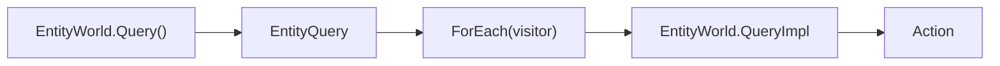
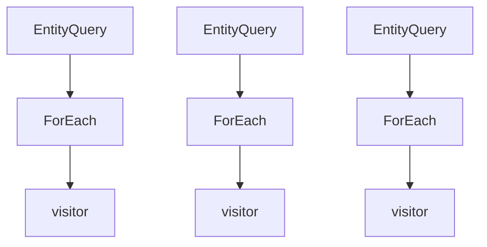
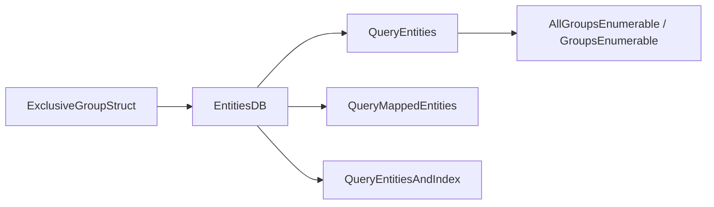

# 6.4 查询与遍历

> 本文说明 AbilityKit 在 ECS 层如何做类型安全、零分配、按组/按组件的查询与遍历，并解释 Entitas、Svelto 与自研 `EntityWorld` 的差异。

---

## 目录

1. [能力定位](#1-能力定位)
2. [源码入口](#2-源码入口)
3. [自研 EntityWorld 查询模型](#3-自研-entityworld-查询模型)
4. [Entitas 与 Svelto 的查询视角](#4-entitas-与-svelto-的查询视角)
5. [设计约束与扩展点](#5-设计约束与扩展点)

---

## 1. 能力定位

查询与遍历是 ECS 架构里的核心读路径。AbilityKit 需要同时支持三类场景：

| 场景 | 需求 |
|------|------|
| 逻辑模拟 | 以组件组合遍历活跃实体 |
| 网络同步 | 以快照、group、entity id 精准读取目标集合 |
| 表现与诊断 | 在不污染业务状态的前提下收集统计和可视化数据 |

本文覆盖的重点不是“怎么写一个 foreach”，而是查询模型如何影响性能、分配、稳定性和系统组织方式。

---

## 2. 源码入口

| 类型 | 源码 | 说明 |
|------|------|------|
| `EntityQuery<T1..T3>` | `Unity/Packages/com.abilitykit.world.ecs/Runtime/AbilityKit.World.ECS/Core/EntityQuery.cs` | 类型安全查询结果 |
| `EntityWorld.QueryImpl` | `Unity/Packages/com.abilitykit.world.ecs/Runtime/AbilityKit.World.ECS/Impl/EntityWorld.cs` | 内部查询执行 |
| `EntitiesDB` 扩展 | `Unity/Packages/com.abilitykit.thirdparty.svelto/Runtime/ecs/Extensions/*` | Svelto 的 group/entity 查询方式 |
| Entitas group 观察 | `Unity/Packages/com.abilitykit.world.entitas/Runtime/World/Base/ReactiveWorldSystemBase.cs` | 基于 group 的响应式视角 |

---

## 3. 自研 EntityWorld 查询模型

### 3.1 查询结果是惰性遍历视图

`EntityWorld.Query<T>()` 不直接返回实体集合，而是返回一个 `EntityQuery<T>` 值类型结果。它只持有：

- 组件类型 id。
- 指向 `EntityWorld` 的引用。

真正遍历发生在 `ForEach(...)` 调用时。

### 3.2 查询实现以组件索引为入口

`EntityWorld.QueryImpl` 的基本流程：

1. 通过 `_componentIndex` 找到拥有该组件类型的实体索引集合。
2. 从对象池取出一个 `snapshot` 列表。
3. 将索引集合复制到 `snapshot`，避免遍历期间修改源集合。
4. 对每个索引做存活性检查。
5. 从 `_components[index]` 中取出组件并调用 visitor。
6. 遍历结束后归还临时列表。

这意味着查询具有以下特性：

- **类型安全**：由泛型保证组件类型。
- **零额外查询对象分配**：查询结果是 struct，只有内部临时 snapshot 使用池化列表。
- **遍历稳定**：避免对源集合直接迭代导致的并发修改问题。

### 3.3 单/双/三组件查询的取舍

`EntityQuery<T1>`、`EntityQuery<T1, T2>`、`EntityQuery<T1, T2, T3>` 提供固定 arity 的查询接口：

- 好处：调用简单，编译期类型完整，遍历路径固定。
- 代价：维度超过三时需要扩展更多重载，灵活性较弱。

这类接口适合热点路径和玩法系统，不适合通用反射式数据查询。

### 3.4 存活性检查是查询的一部分

`ForEachAlive` 与 `QueryImpl` 都明确检查：

- `_alive[index]`
- `IsAlive(id)`
- 组件数组边界
- 组件是否存在

这保证遍历不会踩到已释放或版本不匹配的实体。

---

## 4. Entitas 与 Svelto 的查询视角

### 4.1 Entitas 偏 group/Reactive

在 Entitas 侧，查询通常体现为 group 观察和响应式系统：

- `ReactiveWorldSystemBase` 通过 `IGroup<TEntity>` 订阅实体加入/移除。
- `CreateGroup(Contexts)` 决定观察范围。
- `OnEntityAddedToGroup` / `OnEntityRemovedFromGroup` 是响应式入口。

它更适合“某类实体状态变化时触发行为”的风格。

### 4.2 Svelto 偏 `EntitiesDB` + group 扩展

Svelto 侧常见查询形式是：

- `EntitiesDB.QueryEntities<T>(group)`
- `EntitiesDB.QueryMappedEntities<T>(groups)`
- `EntitiesDB.QueryEntitiesAndIndex<T>(egid)`
- `AllGroupsEnumerable<T>` / `GroupsEnumerable<T1..T4>`

Svelto 的重点是：

1. 通过 `ExclusiveGroupStruct` 切分逻辑域。
2. 在 group 内按组件查询。
3. 使用多组枚举器减少重复样板代码。
4. 通过 `QueryMappedEntities` 和 `QueryNativeMappedEntities` 支持跨组映射。

### 4.3 设计上的共同点

虽然 Entitas 和 Svelto 的 API 不同，但它们都在强调：

- 以结构化存储为中心，而不是以对象树为中心。
- 通过稳定的分组或上下文缩小扫描范围。
- 避免在热路径中频繁分配临时集合。

---

## 5. 设计约束与扩展点

### 5.1 约束

- 热路径查询应尽量使用固定 arity 的泛型接口。
- 遍历回调不应在内部修改当前枚举的集合结构。
- 组件查询必须尊重实体存活版本。
- 跨组查询应明确 group/上下文边界，否则容易退化为全表扫描。
- 查询系统应与写系统分离，避免读写互相干扰。

### 5.2 扩展点

| 扩展点 | 说明 |
|--------|------|
| 新 arity 查询 | 可扩展到 4 组件或更多固定重载 |
| 诊断遍历 | 给查询过程加统计、耗时、命中数 |
| Group 策略 | 在 Svelto 侧调整 group 划分以缩小查询范围 |
| Reactive 适配 | 为 Entitas 增加更多 group 响应式系统 |
| Snapshot 查询 | 以快照视图替代实时世界视图做只读分析 |

---

## 下一步

- [ECS 核心概念](./01-ECSCoreConcepts.md)
- [Entitas 实现](./02-EntitasImplementation.md)
- [Svelto 实现](./03-SveltoImplementation.md)

---

*文档版本：v1.0 | 最后更新：2026-06-23*
