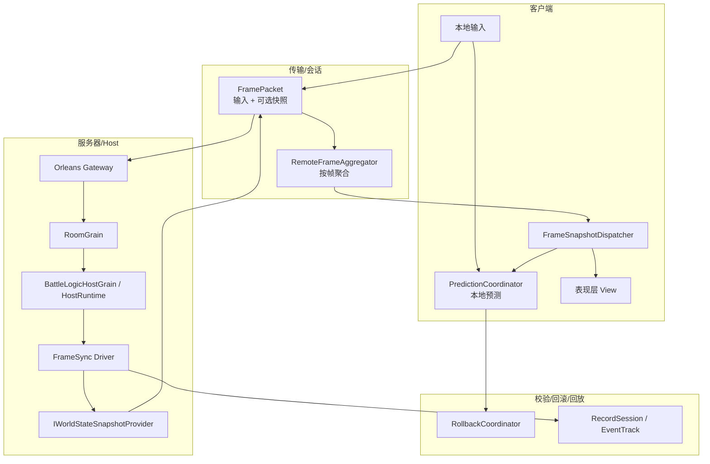
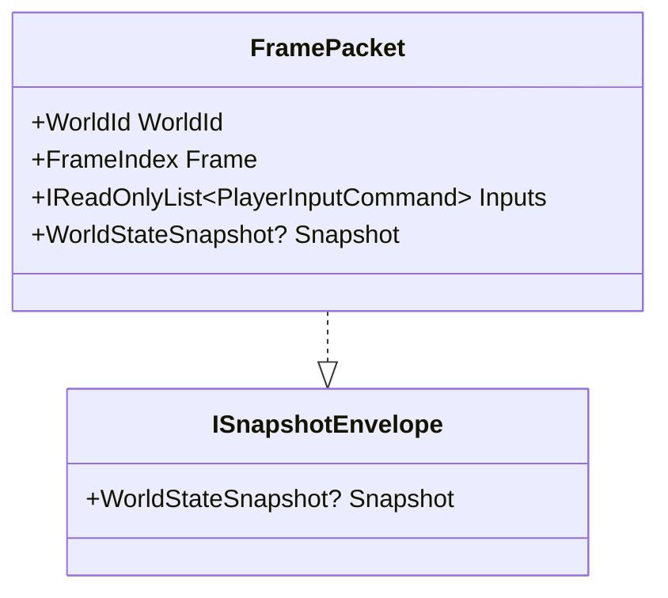
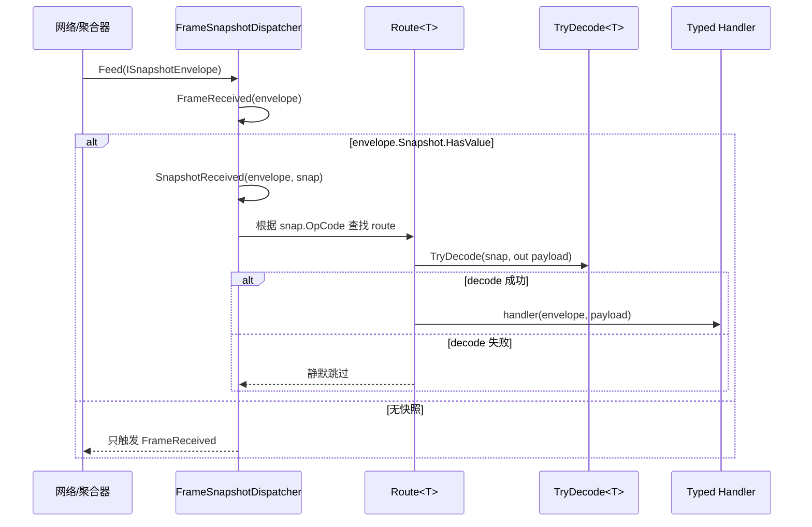
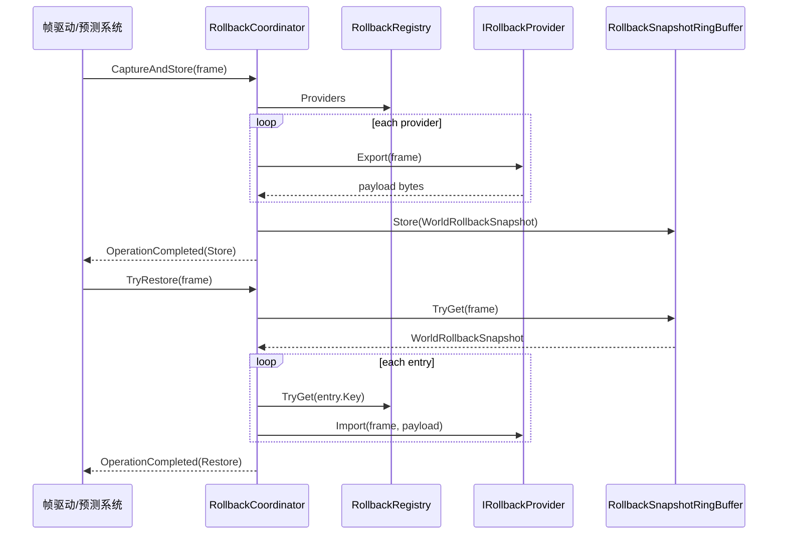
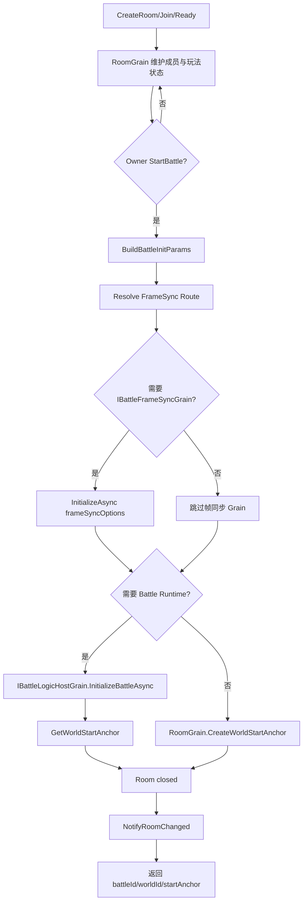

# 网络同步能力地图

AbilityKit 的同步能力由多层组成：输入帧同步负责确定性推进，快照负责状态投递，状态同步负责权威状态修正，预测和回滚负责弱网体验，Record 负责回放与问题复现，Orleans 负责远端房间和战斗承载。

---

## 1. 同步能力分层



---

## 2. 关键源码入口

| 能力 | 源码 | 说明 |
|------|------|------|
| 输入帧值对象 | `Unity/Packages/com.abilitykit.world.framesync/Runtime` | FrameIndex、PlayerInputCommand、RemoteInputFrame 等 |
| 网络帧封包 | `Unity/Packages/com.abilitykit.world.networkfragments/Runtime/Frames/FramePacket.cs` | 一帧内携带输入列表和可选 WorldStateSnapshot |
| 远端帧聚合 | `Unity/Packages/com.abilitykit.world.networkfragments/Runtime/Frames/RemoteFrameAggregator.cs` | 将乱序/批量收到的 FramePacket 按 frame 分类 |
| 快照路由 | `Unity/Packages/com.abilitykit.world.snapshot/Runtime/SnapshotRouting/FrameSnapshotDispatcher.cs` | 按 opCode 注册 decoder 和 typed handler |
| 预测协调 | `Unity/Packages/com.abilitykit.world.statesync/Runtime/StateSync/Prediction/Core/PredictionCoordinator.cs` | 记录输入、预测、应用服务器快照、冲突回滚 |
| 回滚协调 | `Unity/Packages/com.abilitykit.world.framesync/Runtime/FrameSync/Rollback/RollbackCoordinator.cs` | 捕获、存储、恢复 WorldRollbackSnapshot |
| 回放记录 | `Unity/Packages/com.abilitykit.record/Runtime/Record` | RecordContainer、EventTrack、ReplayController |
| 房间协调 | `Server/Orleans/src/AbilityKit.Orleans.Grains/Rooms/RoomGrain.cs` | 房间、成员、开战、晚加入、目录通知 |
| Gateway | `Server/Orleans/src/AbilityKit.Orleans.Gateway` | HTTP/TCP 协议入口、session、handler |

---

## 3. FramePacket：输入和快照的统一帧信封

`FramePacket` 的设计非常小：它只保存 WorldId、Frame、Inputs 和可选 Snapshot。这样它既可以表示“纯输入帧”，也可以表示“状态快照帧”，还可以同时携带两者。



设计收益：

- 同一个传输信封支持帧同步和状态同步。
- Snapshot 模块只依赖 `ISnapshotEnvelope`，不依赖具体网络协议。
- `RemoteFrameAggregator` 可以同时聚合输入和快照，供不同消费者读取。

---

## 4. RemoteFrameAggregator：远端帧聚合

```mermaid
flowchart TD
    A[收到 FramePacket] --> B{Frame 是否有效?}
    B -- 否 --> X[丢弃]
    B -- 是 --> C{Inputs 是否非空?}
    C -- 是 --> D[_inputsByFrame[frame].AddRange]
    C -- 否 --> E[跳过输入]
    D --> F{Snapshot.HasValue?}
    E --> F
    F -- 是 --> G[_envelopesByFrame[frame].Add(packet)]
    F -- 否 --> H[结束]
    G --> H

    I[BuildInputFrame(frame)] --> J{有输入?}
    J -- 是 --> K[返回 RemoteInputFrame(frame, inputs)]
    J -- 否 --> L[返回空输入帧]

    M[BuildSnapshotFrame(frame)] --> N{有快照?}
    N -- 是 --> O[返回 RemoteSnapshotFrame(frame, envelopes)]
    N -- 否 --> P[返回空快照帧]
```

这个设计让网络层不必保证每帧立即完整到达：接收端可以先收集，再按本地逻辑帧读取对应输入和快照。

---

## 5. Snapshot Dispatch：从二进制/通用快照到类型化表现事件

`FrameSnapshotDispatcher` 维护一个 `opCode -> Route<T>` 表，每个 route 包含 decoder 和 handlers。



设计边界：

- Dispatcher 不关心传输协议，不关心 Unity/Console/ET 表现层。
- opCode 是快照的稳定路由键。
- handler 异常被捕获并记录，避免一个表现订阅者影响其它订阅者。

---

## 6. PredictionCoordinator：客户端预测与服务器修正

```mermaid
flowchart TD
    A[ProcessInput] --> B[currentFrame + 1]
    B --> C[InputHistory.Record]
    C --> D[遍历 IPredictionHandler]
    D --> E{Strategy != None?}
    E -- 是 --> F[handler.Predict]
    E -- 否 --> G[跳过]
    F --> H[SnapshotStore.Record predicted slots]
    G --> H
    H --> I[OnPredictionApplied]

    J[ApplyServerSnapshot] --> K{objectId == localPlayerId?}
    K -- 否 --> X[忽略]
    K -- 是 --> L[读取 serverFrame 对应 predictedSlots]
    L --> M[ValidateAll]
    M --> N{ConflictLevel}
    N -- None --> O[confirmedFrame = serverFrame]
    N -- Conflict --> P[通知 OnRollbackStarted]
    P --> Q[currentSlots.OverwriteFrom(serverSlots)]
    Q --> R[confirmedFrame = serverFrame]
    R --> S[PruneBefore + ReplayInputs]
    O --> T[OnServerStateApplied]
    S --> T
```

当前源码中的 `PredictionCoordinator` 是通用实现，不依赖具体业务对象。业务通过 `IPredictionHandler` 定义某类状态如何预测、如何校验。

---

## 7. RollbackCoordinator：快照捕获与恢复

Rollback 关注的是“世界内哪些系统愿意导出/导入状态”。这些系统以 provider 形式注册到 `RollbackRegistry`，再由 `RollbackCoordinator` 统一捕获和恢复。



设计约束：

- `RollbackRegistry.Seal()` 后 provider 集合固定，避免运行中结构变化导致回滚不一致。
- 快照包含版本号，恢复时会检查 `WorldRollbackSnapshotCodec.CurrentVersion`。
- Provider 缺失和 Provider 导入失败会产生不同的 operation status，便于诊断。

---

## 8. Orleans 房间到战斗的同步闭环

`RoomGrain` 是房间域的聚合根，负责从 Lobby 行为进入 Battle 行为。



这条链路说明 AbilityKit 的网络同步不是单一类完成的，而是由 Gateway 协议入口、RoomGrain 生命周期、BattleHost 逻辑世界和 Snapshot/FrameSync 包共同完成。

---

## 9. 后续需要补充的专题

| 专题 | 目标文档 |
|------|----------|
| 状态同步权威快照 | `07-NetworkSynchronization/02-StateSync.md` |
| 客户端预测和回滚 | `07-NetworkSynchronization/03-RollbackPrediction.md` |
| Record 录制/回放 | `07-NetworkSynchronization/04-ReplaySystem.md` |
| Session/房间/战斗协调 | `07-NetworkSynchronization/05-SessionCoordination.md` |
| Orleans Gateway 协议闭环 | `09-ImplementationExamples/04-ShooterOrleansSmoke.md` |
