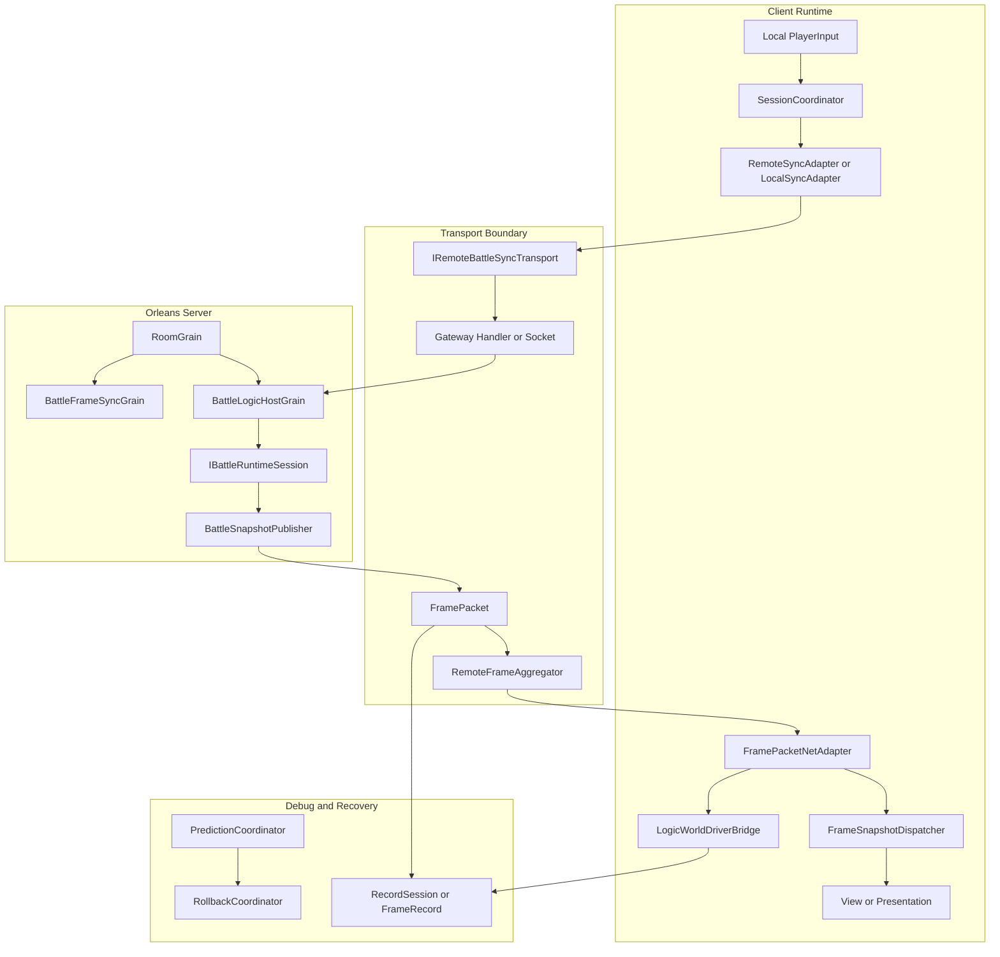
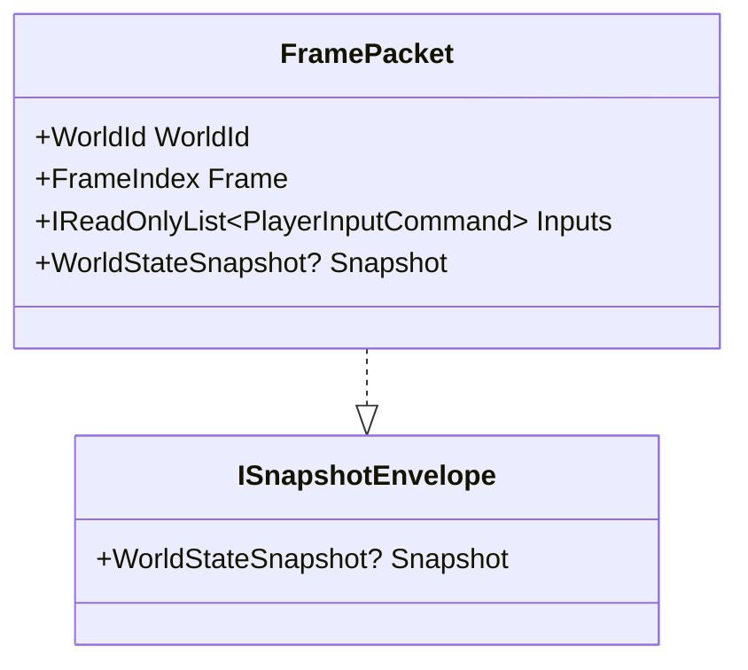
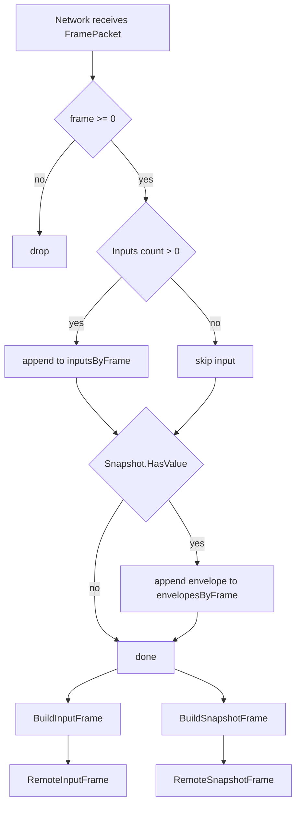
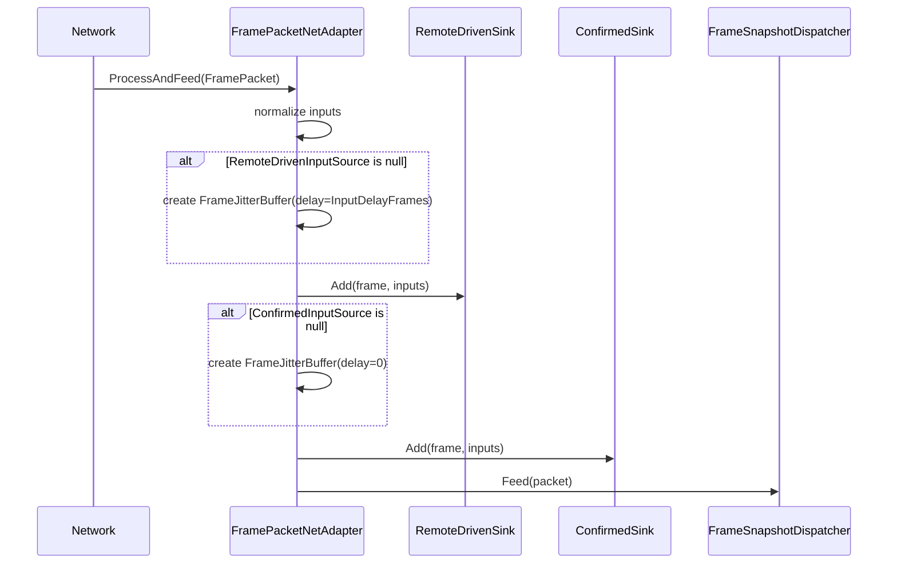
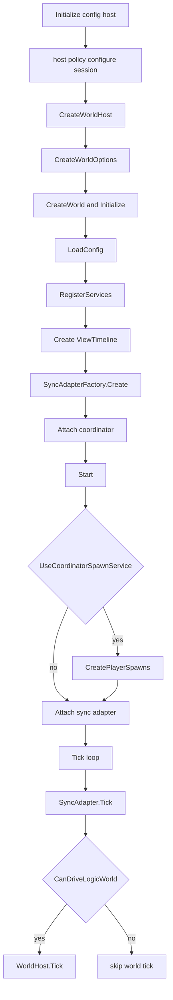
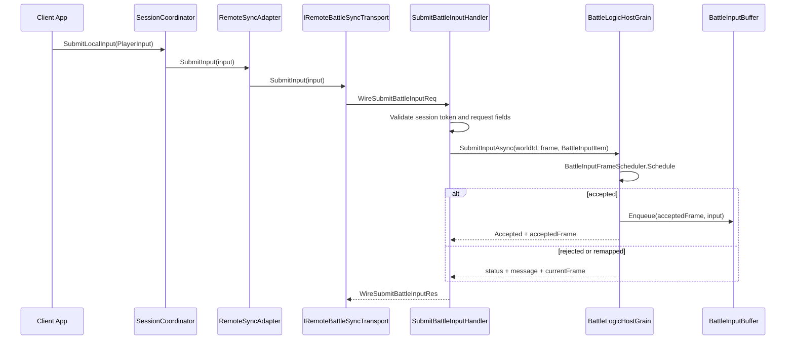
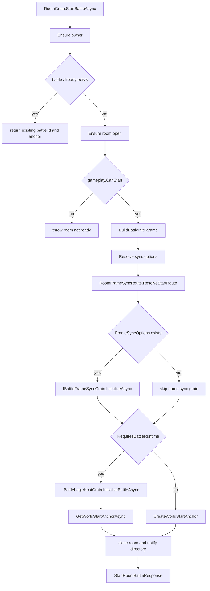
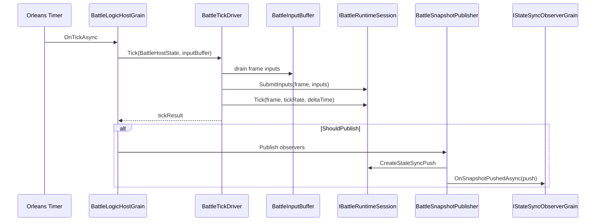

# 网络同步能力地图

> 本文从源码角度梳理 AbilityKit 的网络同步能力边界。它不是单一“帧同步类”或“状态同步类”，而是由输入帧、快照信封、会话协调、远端传输端口、Room/Battle 服务端 Grain、回放记录和 Demo 接入层共同组成。源码入口以 `Unity/Packages` 为准，`src` 只是 .NET SDK 构建入口。

---

## 目录

1. [能力定位](#1-能力定位)
2. [同步能力分层](#2-同步能力分层)
3. [源码入口](#3-源码入口)
4. [核心对象关系](#4-核心对象关系)
5. [端到端同步链路](#5-端到端同步链路)
6. [能力选型](#6-能力选型)
7. [设计意图](#7-设计意图)
8. [风险与检查点](#8-风险与检查点)
9. [源码阅读路径](#9-源码阅读路径)

---

## 1. 能力定位

AbilityKit 网络同步层解决的是“多人战斗怎么从本地输入变成可验证、可恢复、可回放的远端会话”的问题。源码中可以拆成七类能力：

| 能力 | 解决的问题 | 关键源码 |
|------|------------|----------|
| 帧值对象 | 用稳定帧号描述输入、快照、回滚点 | `Unity/Packages/com.abilitykit.world.framesync/Runtime` |
| 网络帧信封 | 用一个对象同时承载输入和可选快照 | `Unity/Packages/com.abilitykit.world.networkfragments/Runtime/Frames/FramePacket.cs` |
| 远端帧聚合 | 接收端按帧聚合输入和快照，抵抗乱序/批量到达 | `Unity/Packages/com.abilitykit.world.networkfragments/Runtime/Frames/RemoteFrameAggregator.cs` |
| 会话协调 | 统一创建/复用 world、选择 sync adapter、连接 transport、驱动 Tick | `Unity/Packages/com.abilitykit.coordinator/Runtime/Core/SessionCoordinator.cs` |
| 网络适配 | 把 `FramePacket` 写入 remote-driven/confirmed 双输入源并路由快照 | `Unity/Packages/com.abilitykit.host.extension/Runtime/Session/FramePacketNetAdapter.cs` |
| 服务端承载 | Room 管理成员和开战，Battle Host 管理权威 Tick、输入缓冲和快照推送 | `Server/Orleans/src/AbilityKit.Orleans.Grains` |
| 记录回放 | 记录输入、状态 hash、快照，用于复盘、调试、回归 | `Unity/Packages/com.abilitykit.record/Runtime/Record` |

这组能力的边界很清晰：

- `FramePacket` 和 `RemoteFrameAggregator` 只关心帧数据，不关心 TCP、HTTP、Orleans 或 Unity。
- `SessionCoordinator` 只协调世界、同步适配器和外部 transport，不直接写 Gateway 协议。
- `IRemoteBattleSyncTransport` 是环境提供的端口，具体环境可以接 Orleans Gateway、Socket、测试替身或本地模拟器。
- `RoomGrain` 管成员、准备、晚加入、恢复和开战入口；`BattleLogicHostGrain` 管权威战斗推进。
- `Record` 不绑定某个 Demo。Console/MOBA 可以有自己的文件格式，但通用记录系统仍然按 frame/track/event 组织。

---

## 2. 同步能力分层

这张图里的关键点是：

1. 本地输入先进入 `SessionCoordinator.SubmitLocalInput`，再交给当前 `ISyncAdapter`。
2. 远端模式下 `RemoteSyncAdapter` 只通过 `IRemoteBattleSyncTransport` 连接外部网络，不直接依赖 Gateway 类型。
3. Gateway 把输入转发到 `BattleLogicHostGrain.SubmitInputAsync`，服务端通过调度器决定输入落在哪一帧。
4. 服务端快照通过 observer 或 transport 回到客户端，客户端再转成 `FramePacket` 或 `SnapshotEntityState[]` 消费。
5. `FramePacketNetAdapter` 是端侧输入/快照进入逻辑世界与表现层的桥。

---

## 3. 源码入口

### 3.1 Unity/Package 侧

| 模块 | 源码 | 阅读重点 |
|------|------|----------|
| FrameSync | `Unity/Packages/com.abilitykit.world.framesync/Runtime` | `FrameIndex`、输入命令、远端帧源、回滚快照 |
| NetworkFragments | `Unity/Packages/com.abilitykit.world.networkfragments/Runtime/Frames` | `FramePacket`、`RemoteFrameAggregator`、`RemoteInputFrame`、`RemoteSnapshotFrame` |
| Snapshot | `Unity/Packages/com.abilitykit.world.snapshot/Runtime/SnapshotRouting` | `FrameSnapshotDispatcher` 的 opCode 路由与 typed handler |
| StateSync | `Unity/Packages/com.abilitykit.world.statesync/Runtime/StateSync` | 预测、服务器修正、状态槽、快照应用 |
| Coordinator | `Unity/Packages/com.abilitykit.coordinator/Runtime` | 会话生命周期、sync adapter、remote transport 端口 |
| Host Extension | `Unity/Packages/com.abilitykit.host.extension/Runtime/Session` | `FramePacketNetAdapter`、`RoomGatewaySessionFlow` |
| Record | `Unity/Packages/com.abilitykit.record/Runtime/Record` | 通用容器、事件轨道、固定步长回放、按帧记录文件 |
| Demo View | `Unity/Packages/com.abilitykit.demo.moba.view.runtime/Runtime/Game/Battle/Client/Session` | `BattleSessionNetAdapter` 如何复用通用 `FramePacketNetAdapter` |
| Shooter View | `Unity/Packages/com.abilitykit.demo.shooter.view.runtime/Runtime/Hosting` | `ShooterCoordinatorSessionHost` 如何复用已有 world |

### 3.2 Server/Orleans 侧

| 模块 | 源码 | 阅读重点 |
|------|------|----------|
| Room | `Server/Orleans/src/AbilityKit.Orleans.Grains/Rooms/RoomGrain.cs` | 加入、准备、恢复、晚加入、开战 |
| Battle Host | `Server/Orleans/src/AbilityKit.Orleans.Grains/Battle/BattleLogicHostGrain.cs` | 初始化运行时、输入调度、Tick、快照推送 |
| FrameSync Grain | `Server/Orleans/src/AbilityKit.Orleans.Grains/FrameSync/BattleFrameSyncGrain.cs` | 纯帧同步广播、输入按帧缓存、catch-up tick |
| Gateway Handler | `Server/Orleans/src/AbilityKit.Orleans.Gateway/Gateway/Handlers/SubmitBattleInputHandler.cs` | 请求校验、session token、输入转发 |
| Contracts | `Server/Orleans/src/AbilityKit.Orleans.Contracts` | Room/Battle/FrameSync/StateSync 契约 |

### 3.3 Console/回放侧

| 模块 | 源码 | 阅读重点 |
|------|------|----------|
| Console Replay Controller | `src/AbilityKit.Demo.Moba.Console/Replay/ReplayController.cs` | 录制/回放状态切换、writer/driver 生命周期 |
| Console Record Writer | `src/AbilityKit.Demo.Moba.Console/Replay/ConsoleRecordWriter.cs` | `.akrec` 文件写出、命令和快照收集 |
| Console Replay Driver | `src/AbilityKit.Demo.Moba.Console/Replay/ConsoleReplayDriver.cs` | 文件加载、按帧索引、播放/暂停/寻址 |
| Console Record Types | `src/AbilityKit.Demo.Moba.Console/Replay/RecordTypes.cs` | `AKRC` 文件头、MemoryPack 命令/快照序列化 |

---

## 4. 核心对象关系

### 4.1 `FramePacket` 是输入和快照的统一信封

`FramePacket` 的源码字段只有四个：

| 字段 | 含义 |
|------|------|
| `WorldId` | 目标逻辑世界 |
| `Frame` | 输入或快照所属帧 |
| `Inputs` | 当前帧的玩家输入列表，空时为 `Array.Empty<PlayerInputCommand>()` |
| `Snapshot` | 可选 `WorldStateSnapshot` |

`FramePacket` 同时实现 `ISnapshotEnvelope`，所以快照路由层可以只认 `ISnapshotEnvelope`，不用依赖具体网络消息类型。

### 4.2 `RemoteFrameAggregator` 把网络到达顺序改成逻辑帧读取顺序

`RemoteFrameAggregator.AddPacket` 做三件事：

1. 忽略空包和负帧号。
2. 有输入时追加到 `_inputsByFrame[frame]`。
3. 有快照时把 `FramePacket` 当作 `ISnapshotEnvelope` 追加到 `_envelopesByFrame[frame]`。

之后消费者按帧调用：

- `BuildInputFrame(FrameIndex frame)` 得到 `RemoteInputFrame`。
- `BuildSnapshotFrame(FrameIndex frame)` 得到 `RemoteSnapshotFrame`。
- `TrimBefore(int minFrameInclusive)` 清掉旧帧，避免长连接无限增长。

### 4.3 `FramePacketNetAdapter` 把同一份输入写入两条语义不同的输入源

`FramePacketNetAdapter.ProcessAndFeed` 的真实流程是：

1. 调用 `ProcessInput(packet)`。
2. 如果上下文有 world，就把 `packet.Inputs` 转成数组。
3. 如果 `RemoteDrivenInputSource` 为空，创建带 `InputDelayFrames` 的 `FrameJitterBuffer`。
4. 把输入写入 `RemoteDrivenSink`。
5. 如果 `ConfirmedInputSource` 为空，创建 0 延迟 `FrameJitterBuffer`。
6. 把同一份输入写入 `ConfirmedSink`。
7. 用 `Snapshots.Feed(packet)` 路由可选快照。

双输入源的设计意义：

| 输入源 | 延迟 | 用途 |
|--------|------|------|
| `RemoteDriven` | `InputDelayFrames` | 给远端驱动、插值、预测前平滑消费 |
| `Confirmed` | 0 | 给服务器确认输入、对账、回滚修正 |

### 4.4 `SessionCoordinator` 是客户端会话总装器

`SessionCoordinator.Initialize` 真实做的事包括：

1. 校验状态必须是 `Idle`。
2. 让 host 有机会通过 `ISessionCoordinatorConfigPolicy.ConfigureSession` 修改配置。
3. `host.CreateWorldHost(config)`。
4. 创建 `WorldCreateOptions` 并让 host 调整。
5. `worldHost.CreateWorld(options)`，再 `world.Initialize()`。
6. `host.LoadConfig`、`host.RegisterServices`。
7. 创建 `ViewTimeline`。
8. `SyncAdapterFactory.Create(world, config)`。
9. `syncAdapter.Attach(this)`。
10. 触发 session starting hook。

`Start` 阶段再处理可选 player spawn，重新 attach sync adapter，并触发 session started/first frame hook。`Tick` 阶段顺序是 hook、sub-feature pre tick、sync adapter tick、world host tick、sub-feature post tick、hook。

### 4.5 `RemoteSyncAdapter` 只依赖传输端口

`RemoteSyncAdapter` 构造时从 world services 解析 `IRemoteBattleSyncTransport`，没有解析到就使用 `NullRemoteBattleSyncTransport`。这使远端模式可以在没有真实网络时保持确定性断开状态。

关键行为：

| 方法 | 行为 |
|------|------|
| `Connect(endpoint, roomId, playerId)` | 保存端点和身份，调用 transport 的 `Connect` |
| `SubmitInput(PlayerInput input)` | 仅在 transport 已连接时提交输入 |
| `Tick(float deltaTime)` | 推进 render time 并 tick transport |
| `FeedServerSnapshot(int serverFrame, SnapshotEntityState[] states)` | 缓存最新状态，触发 `OnServerSnapshot` 和 `OnFrameSync` |
| `Dispose()` | 断开 transport、解绑事件、清空快照 |

---

## 5. 端到端同步链路

### 5.1 客户端输入到服务端权威帧

服务端调度不是“客户端说第几帧就是第几帧”。`BattleLogicHostGrain.SubmitInputAsync` 会检查：

- battle 是否初始化。
- `worldId` 是否匹配。
- input 是否为空。
- `BattleInputFrameScheduler.Schedule` 是否接受、重映射或拒绝该帧。
- `BattleInputBuffer.Enqueue` 是否成功。

### 5.2 Room 到 Battle 的开战链路

Room 的职责是会话域：成员、玩法房间状态、准备、恢复、晚加入、目录通知。Battle 的职责是战斗域：运行时 session、输入缓冲、权威 Tick、快照推送。

### 5.3 Battle Host 的权威 Tick

`BattleLogicHostGrain` 只知道 `IBattleRuntimeSession` 接口。具体 MOBA、Shooter 或其他玩法运行时通过 `BattleRuntimeAdapter` 注册和创建，这保持了服务端 Host 与玩法实现的解耦。

### 5.4 Gateway Session Flow 是客户端入场脚本，不是底层网络协议

`RoomGatewaySessionFlow` 面向 `IRoomGatewaySessionClient`，提供三条高层路径：

| 方法 | 场景 | 步骤 |
|------|------|------|
| `CreateReadyStartAndSubscribeAsync` | 房主创建并开局 | create room -> join -> ready -> start battle -> subscribe state sync |
| `JoinReadyStartAndSubscribeAsync` | 加入已有房间或运行中战斗 | join；如果已在 battle 则直接 subscribe，否则 ready/start/subscribe |
| `RestoreRoomAsync` | 断线恢复到运行中战斗 | restore room -> 校验 active battle -> subscribe state sync |

它输出 `RoomGatewaySessionFlowResult`，包含 `RoomId`、`BattleId`、`WorldId`、`PlayerId`、`WorldStartAnchor`、`EntryKind`、是否订阅成功等字段。这个对象是客户端会话恢复和时间对齐的重要锚点。

---

## 6. 能力选型

| 目标 | 推荐能力 | 不建议一开始引入的能力 |
|------|----------|--------------------------|
| 单机或本地验证战斗逻辑 | `FrameIndex`、本地 `ISyncAdapter`、Console Demo | Orleans Gateway、Room/Battle Grain |
| 本地模拟远端输入 | `FramePacket`、`RemoteFrameAggregator`、`FramePacketNetAdapter` | 真实 Gateway 协议 |
| 客户端接入权威服 | `SessionCoordinator`、`RemoteSyncAdapter`、`IRemoteBattleSyncTransport` | 直接在业务层调用 Gateway handler |
| 已有 world 接入 Coordinator | `ExistingWorldSessionCoordinatorHost` | 再创建第二套 world |
| 状态同步表现 | `FrameSnapshotDispatcher`、StateSync snapshot handler | 把快照解析写死在 transport 层 |
| 服务端房间和战斗 | `RoomGrain`、`BattleLogicHostGrain`、contracts | 把准备/晚加入/恢复塞进 Battle runtime |
| 回放和问题复现 | `RecordSession`、`FrameRecordFile`、Console `.akrec` | 只保存日志文本 |

---

## 7. 设计意图

### 7.1 传输协议不穿透到战斗逻辑

`IRemoteBattleSyncTransport` 的注释明确说明：Coordinator 管同步编排，具体环境管 grain call、gateway request、socket 或 test double。这让 Unity 客户端、Console、Shooter、Orleans Smoke 都能复用同一套会话模型。

### 7.2 输入和快照共享帧信封

`FramePacket` 既可纯输入、纯快照，也可两者同时携带。这样网络层只需要传输“某个 world 的某一帧发生了什么”，消费层再决定是否构造成输入帧、快照帧或表现事件。

### 7.3 Room 和 Battle 分层

Room 维护成员身份、在线状态、准备、恢复、晚加入和开战入口。Battle Host 维护权威帧推进、输入缓冲、运行时 session 和状态推送。这个分层避免大厅逻辑影响战斗 Tick，也避免战斗 runtime 直接承担账号/房间生命周期。

### 7.4 回放按帧组织历史，而不是复制运行时对象

通用 Record 用 track/event/payload 组织历史数据；FrameRecord 用 frame/input/hash/snapshot 组织调试数据；Console `.akrec` 用二进制命令和快照快速落地。三者目标不同，但共同点是帧索引必须稳定。

---

## 8. 风险与检查点

| 风险 | 表现 | 检查点 |
|------|------|--------|
| 输入帧语义混乱 | 客户端输入落点和服务端接受帧不一致 | 检查 `BattleInputFrameScheduler` 返回的 `AcceptedFrame` 和 `Status` |
| 双输入源混用 | 预测、确认、远端驱动互相污染 | 区分 `RemoteDriven` 和 `Confirmed` 的消费方 |
| 聚合器不裁剪 | 长连接内存增长 | 定期调用 `RemoteFrameAggregator.TrimBefore` |
| transport 缺失 | 远端模式看似启动但永远不连接 | 检查 world services 是否注入 `IRemoteBattleSyncTransport` |
| 已有 world 重复创建 | Shooter/View 层出现两个逻辑世界 | 使用 `ExistingWorldSessionCoordinatorHost` 或专用 host |
| 快照 handler 耦合协议 | 表现层依赖 Gateway DTO | 让 transport 产出 `FramePacket`、`SnapshotEntityState[]` 或 envelope，再交给 dispatcher |
| 回放格式分裂 | 通用 Record 和 Demo `.akrec` 混用 | 在文档/工具中标清使用哪种格式和适用场景 |

---

## 9. 源码阅读路径

1. `07-NetworkSynchronization/01-FrameSync.md`：帧号、输入源和基础帧同步。
2. `07-NetworkSynchronization/02-StateSync.md`：快照和状态修正。
3. `07-NetworkSynchronization/03-RollbackPrediction.md`：预测、回滚和确认帧。
4. `07-NetworkSynchronization/05-SessionCoordination.md`：客户端会话和 Orleans Room/Battle。
5. `07-NetworkSynchronization/04-ReplaySystem.md`：同步过程的记录和复现。
6. `09-ImplementationExamples/Shooter/03-GatewayOrleansSmoke.md` 与 `09-ImplementationExamples/Shooter/08-NetworkModulesDeepDive.md`：Shooter 远端闭环验收。

---

*文档版本：v2.0 | 最后更新：2026-07-04*
