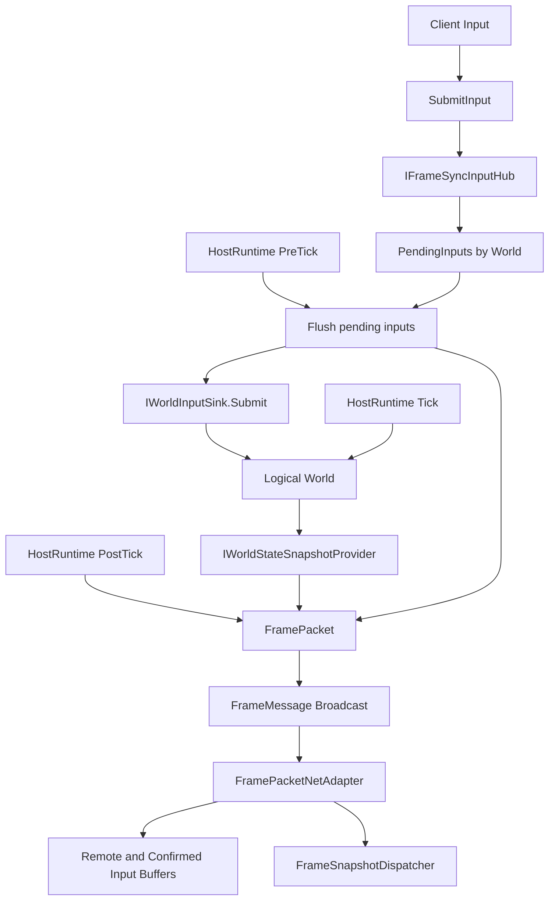
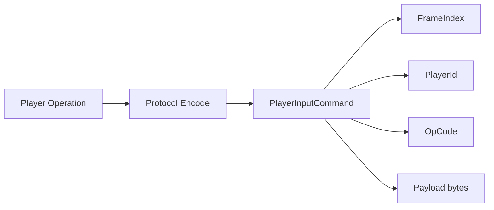
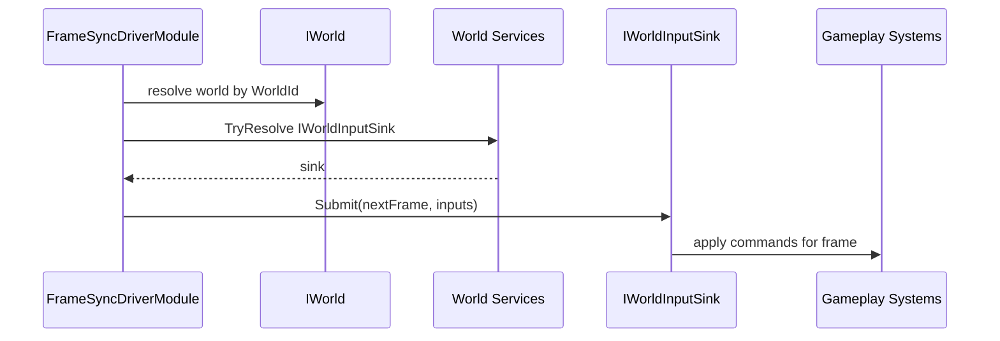
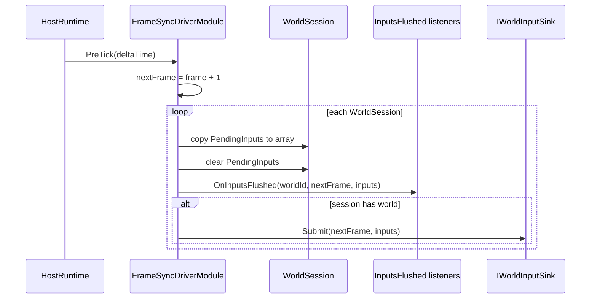
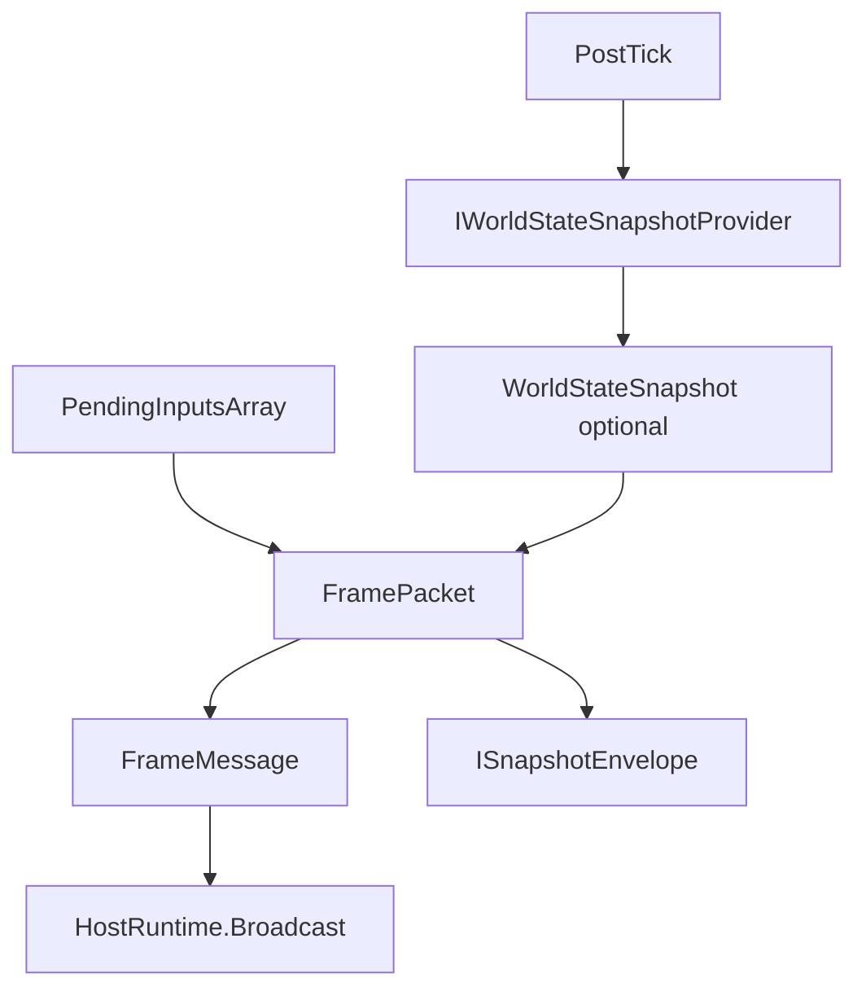
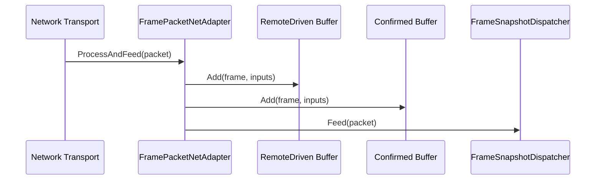
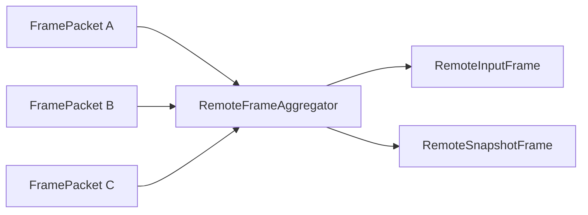
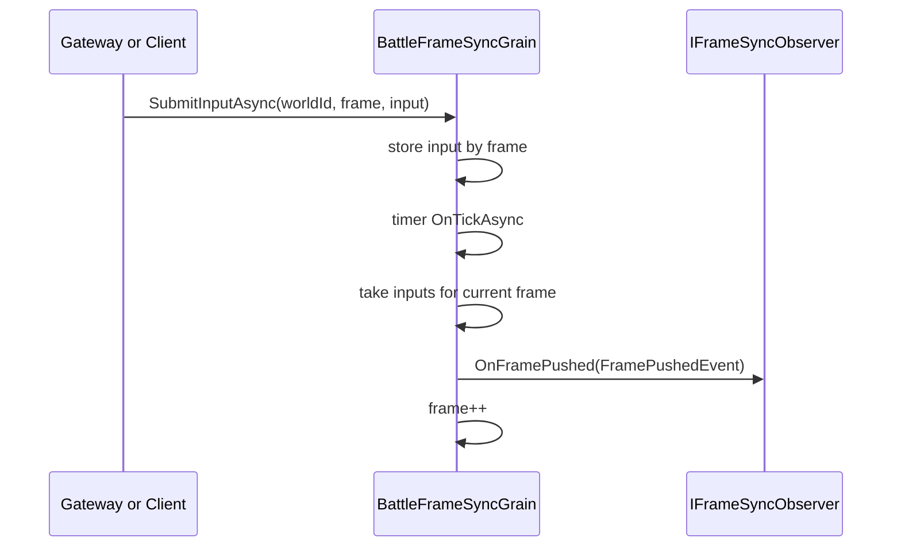
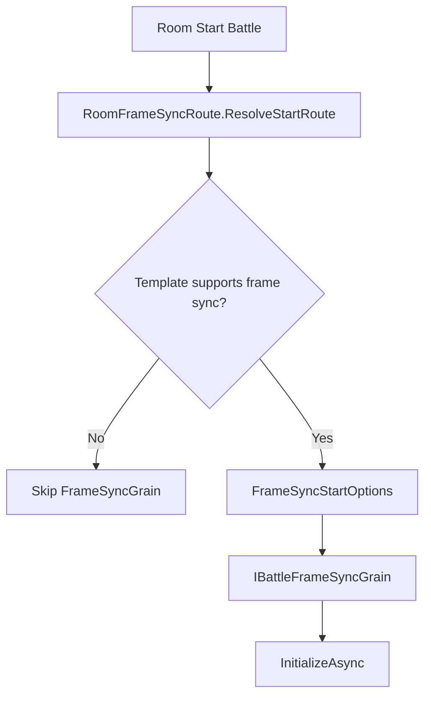
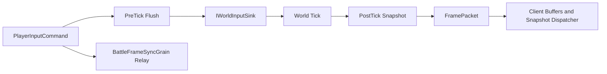

# 7.1 帧同步机制：输入帧、Host 驱动与 Orleans Relay

> 本文基于当前 `Unity/Packages/com.abilitykit.world.framesync`、`Unity/Packages/com.abilitykit.host.extension`、`Unity/Packages/com.abilitykit.world.networkfragments` 与 `Server/Orleans/src/AbilityKit.Orleans.*` 源码重写。当前 AbilityKit 的帧同步不是单纯的“所有客户端每帧 Tick 一次”概念文档，而是一条从输入命令、Host Hook、World Input Sink、快照打包、网络帧包到 Orleans FrameSync Grain 的完整链路。

---

## 7.1.1 帧同步在 AbilityKit 里解决什么

帧同步的目标不是每帧同步完整世界状态，而是让多个运行端在相同帧号上消费同一批输入，并按固定步长推进同一套逻辑。AbilityKit 把这件事拆成几个边界：

| 边界 | 源码入口 | 职责 |
| --- | --- | --- |
| 帧号 | `FrameIndex` | 用一个轻量值对象标识逻辑帧 |
| 玩家输入 | `PlayerInputCommand` | 保存 `Frame`、`Player`、`OpCode`、`Payload` |
| 世界输入入口 | `IWorldInputSink` | Host 在 PreTick 阶段把输入提交给逻辑世界 |
| Host 驱动 | `FrameSyncDriverModule` | 收集输入、提交世界、PostTick 打包并广播 `FramePacket` |
| 帧时间 | `ServerFrameTimeModule` | 为每个 World 注入 `IFrameTime`，跟随帧同步 PostStep 更新 |
| 网络帧包 | `FramePacket` | 同时承载 `Inputs` 和可选 `WorldStateSnapshot` |
| 客户端适配 | `FramePacketNetAdapter` | 把远端帧包拆到输入缓冲，并把快照喂给 dispatcher |
| Orleans Relay | `BattleFrameSyncGrain` | 按 TickRate 推进帧，把收集到的输入推送给观察者 |

整体思路是：Host/Server 负责确定帧节奏和输入归并，World 只通过 `IWorldInputSink` 接收某帧输入，表现和网络层通过 `FramePacket` 观察输入与快照。

---

## 7.1.2 总体链路



这条链路的关键点是：输入在 `PreTick` 前被归并并提交，逻辑世界随后 Tick，快照在 `PostTick` 采集并和输入一起打包广播。

---

## 7.1.3 基础类型：FrameIndex 和 PlayerInputCommand

当前源码里的 `FrameIndex` 很简单：

```csharp
public readonly struct FrameIndex
{
    public readonly int Value;

    public FrameIndex(int value)
    {
        Value = value;
    }

    public override string ToString() => Value.ToString();
}
```

`PlayerInputCommand` 也不是旧文档里的 `Type` 枚举模型，而是以 `OpCode` 加二进制 payload 表达不同输入：

```csharp
public readonly struct PlayerInputCommand
{
    public readonly FrameIndex Frame;
    public readonly PlayerId Player;
    public readonly int OpCode;
    public readonly byte[] Payload;

    public PlayerInputCommand(FrameIndex frame, PlayerId player, int opCode, byte[] payload)
    {
        Frame = frame;
        Player = player;
        OpCode = opCode;
        Payload = payload;
    }
}
```

这意味着框架层不关心输入语义是移动、技能、停止还是交互。不同 Demo 或协议包通过 `OpCode` 和 `Payload` 自己解释输入内容。



---

## 7.1.4 World 输入边界：IWorldInputSink

逻辑世界不直接依赖 Host 的连接、客户端、Orleans Grain 或网络包。Host 只需要在世界服务容器里找到 `IWorldInputSink`：

```csharp
public interface IWorldInputSink : IService
{
    void Submit(FrameIndex frame, IReadOnlyList<PlayerInputCommand> inputs);
}
```

这个接口是帧同步和玩法逻辑的关键分界线：

| 一侧 | 另一侧 |
| --- | --- |
| Host、连接、网络、输入缓冲 | World 内部输入系统、技能系统、移动系统 |
| 负责归并输入和决定帧号 | 负责把输入应用到逻辑实体 |
| 不理解具体技能/移动语义 | 不理解输入来自哪个连接或 Grain |



---

## 7.1.5 FrameSyncDriverModule 的安装与 Feature 暴露

Host 侧主实现是 `FrameSyncDriverModule`。它实现了三个角色：

```csharp
public sealed class FrameSyncDriverModule : IHostRuntimeModule, IFrameSyncInputHub, IFrameSyncDriverEvents
```

安装时，它订阅 Host Hook，并把自己注册到 `runtime.Features`：

```csharp
public void Install(HostRuntime runtime, HostRuntimeOptions options)
{
    _runtime = runtime;
    _options = options;

    _frame = new FrameIndex(0);

    options.WorldCreated.Add(_onWorldCreated);
    options.WorldDestroyed.Add(_onWorldDestroyed);
    options.PreTick.Add(_onPreTick);
    options.PostTick.Add(_onPostTick);

    runtime.Features.RegisterFeature<IFrameSyncInputHub>(this);
    runtime.Features.RegisterFeature<IFrameSyncDriverEvents>(this);
}
```

两个 Feature 的接口很小：

```csharp
public interface IFrameSyncInputHub
{
    bool SubmitInput(ServerClientId clientId, WorldId worldId, PlayerInputCommand input);
}
```

```csharp
public interface IFrameSyncDriverEvents
{
    void AddInputsFlushed(Action<WorldId, FrameIndex, PlayerInputCommand[]> handler);
    void RemoveInputsFlushed(Action<WorldId, FrameIndex, PlayerInputCommand[]> handler);

    void AddPostStep(Action<FrameIndex, float> handler);
    void RemovePostStep(Action<FrameIndex, float> handler);
}
```

这种设计让其他模块不需要持有 `FrameSyncDriverModule` 具体类型，只要通过 `HostRuntimeFeatures` 取 `IFrameSyncInputHub` 或 `IFrameSyncDriverEvents` 即可。

---

## 7.1.6 Session 与输入提交

`FrameSyncDriverModule` 内部按 `WorldId` 维护 `WorldSession`：

```csharp
private sealed class WorldSession
{
    public readonly List<PlayerInputCommand> PendingInputs = new List<PlayerInputCommand>(16);

    public bool HasWorld;
    public FrameIndex PendingFrame;
    public PlayerInputCommand[] PendingInputsArray;
}
```

世界创建时自动注册 session：

```csharp
private void OnWorldCreated(IWorld world)
{
    if (world == null) return;
    RegisterSession(world.Id, hasWorld: true);
}
```

输入提交只做校验和暂存：

```csharp
public bool SubmitInput(ServerClientId clientId, WorldId worldId, PlayerInputCommand input)
{
    if (_runtime == null) return false;
    if (!_sessions.TryGetValue(worldId, out var session))
    {
        Log.Error($"[FrameSyncDriverModule] SubmitInput rejected: session not found. worldId={worldId}, clientId={clientId.Value}, opCode={input.OpCode}");
        return false;
    }

    session.PendingInputs.Add(input);
    return true;
}
```

这里没有立即修改世界状态。输入会等到下一次 `PreTick` 被批量 flush，保证同一帧输入在统一时机进入逻辑世界。

---

## 7.1.7 PreTick：归并输入并提交给 World

`OnPreTick` 是输入进入逻辑世界的时机。它计算 `nextFrame = _frame + 1`，把每个 session 的 `PendingInputs` 转成数组，清空 pending 列表，然后通知监听者并提交给 `IWorldInputSink`。



对应源码核心逻辑：

```csharp
var nextFrame = new FrameIndex(_frame.Value + 1);

if (session.PendingInputs.Count > 0)
{
    inputs = session.PendingInputs.ToArray();
    session.PendingInputs.Clear();
}
else
{
    inputs = Array.Empty<PlayerInputCommand>();
}

session.PendingFrame = nextFrame;
session.PendingInputsArray = inputs;
```

随后提交给世界服务：

```csharp
if (world.Services.TryResolve<IWorldInputSink>(out var sink) && sink != null)
{
    sink.Submit(nextFrame, inputs);
}
```

设计含义：

| 行为 | 目的 |
| --- | --- |
| 输入在 PreTick 统一提交 | 保证本帧逻辑使用稳定输入集合 |
| 空输入也提交空数组 | 缺帧不等于跳帧，逻辑仍可推进 |
| `InputsFlushed` 先于世界 Tick | 记录、回滚、服务端模块可以观察权威输入 |
| `PendingFrame` 暂存到 session | PostTick 打包时使用同一个帧号 |

---

## 7.1.8 PostTick：采集快照并广播 FramePacket

Host Tick 完成后，`OnPostTick` 会尝试从世界服务中解析 `IWorldStateSnapshotProvider`，拿到当前帧快照，并和本帧输入一起封成 `FramePacket`：

```csharp
WorldStateSnapshot? state = null;
if (session.HasWorld && world.Services != null && world.Services.TryResolve<IWorldStateSnapshotProvider>(out var provider) && provider != null)
{
    if (provider.TryGetSnapshot(frame, out var snapshot))
    {
        state = snapshot;
    }
}

var packet = new FramePacket(worldId, frame, inputs, state);
_runtime.Broadcast(new FrameMessage(packet));
```

`FramePacket` 本身实现 `ISnapshotEnvelope`：

```csharp
public sealed class FramePacket : ISnapshotEnvelope
{
    public WorldId WorldId { get; }
    public FrameIndex Frame { get; }
    public IReadOnlyList<PlayerInputCommand> Inputs { get; }
    public WorldStateSnapshot? Snapshot { get; }
}
```

因此同一个对象可以同时被：

1. 作为帧同步广播消息发送给连接。
2. 作为 snapshot envelope 喂给 `FrameSnapshotDispatcher`。
3. 作为回放/录制中的帧数据来源。



---

## 7.1.9 ServerFrameTimeModule：把帧时间注入世界

帧同步需要一个稳定的帧时间来源。`ServerFrameTimeModule` 会在创建世界前注入 `IFrameTime`：

```csharp
private void OnBeforeCreateWorld(WorldCreateOptions options)
{
    if (options.ServiceBuilder == null)
    {
        options.ServiceBuilder = WorldServiceContainerFactory.CreateDefaultOnly();
    }

    if (!_times.TryGetValue(options.Id, out var time) || time == null)
    {
        time = new FrameTime();
        _times[options.Id] = time;
    }

    if (_fixedDeltaSeconds > 0f)
    {
        time.Reset(new FrameIndex(0), time: 0f, fixedDelta: _fixedDeltaSeconds);
    }

    options.ServiceBuilder.RegisterInstance<IFrameTime>(time);
}
```

如果 Host 安装了 `FrameSyncDriverModule`，它会通过 `IFrameSyncDriverEvents.AddPostStep` 跟随帧同步驱动更新；否则退回到 Host `PostTick` 自己递增帧号。

```mermaid
flowchart TB
    Install[ServerFrameTimeModule Install] --> HasEvents{Has IFrameSyncDriverEvents?}
    HasEvents -->|Yes| AddPostStep[Subscribe AddPostStep]
    HasEvents -->|No| PostTick[Subscribe Host PostTick]

    BeforeCreate[BeforeCreateWorld] --> FrameTime[Create FrameTime]
    FrameTime --> Register[Register IFrameTime]

    AddPostStep --> StepTo[FrameTime.StepTo(frame, delta)]
    PostTick --> StepTo
```

这让逻辑系统可以通过 `IFrameTime` 获取当前帧、delta 和累计时间，而不直接依赖 Host 模块顺序。

---

## 7.1.10 客户端网络适配：FramePacketNetAdapter

客户端收到 `FramePacket` 后，并不是直接 Tick 世界。`FramePacketNetAdapter` 负责把输入送入远端/确认输入缓冲，并把快照喂给 snapshot dispatcher：

```csharp
public FramePacket ProcessAndFeed(FramePacket packet)
{
    packet = ProcessInput(packet);
    _ctx.Snapshots?.Feed(packet);
    return packet;
}
```

处理输入时，它会建立两个 `FrameJitterBuffer<PlayerInputCommand[]>`：

| 缓冲 | 延迟 | 用途 |
| --- | --- | --- |
| `RemoteDrivenInputSource` | `InputDelayFrames` | 远端驱动世界使用，可抵抗抖动 |
| `ConfirmedInputSource` | 0 | 权威确认输入，用于预测/回滚对账 |

```csharp
_ctx.RemoteDrivenSink?.Add(frame, inputs);
_ctx.ConfirmedSink?.Add(frame, inputs);
```

处理快照时，`FramePacket` 由于实现了 `ISnapshotEnvelope`，可以直接进入快照路由：



这个适配层把网络包拆成两个方向：输入方向进入帧缓冲，快照方向进入表现/状态同步路由。

---

## 7.1.11 RemoteFrameAggregator：按帧聚合输入和快照

`RemoteFrameAggregator` 用于把多个 `FramePacket` 按帧聚合成输入帧和快照帧：

```csharp
public void AddPacket(FramePacket packet)
{
    var frame = packet.Frame.Value;

    if (packet.Inputs != null && packet.Inputs.Count > 0)
    {
        // append inputs by frame
    }

    if (packet.Snapshot.HasValue)
    {
        // append snapshot envelope by frame
    }
}
```

读取时分别构造：

```csharp
public RemoteInputFrame BuildInputFrame(FrameIndex frame)
public RemoteSnapshotFrame BuildSnapshotFrame(FrameIndex frame)
```

这对客户端很实用：输入和快照可能从网络上分批到达，但最终都要按逻辑帧对齐消费。



---

## 7.1.12 Orleans：BattleFrameSyncGrain 作为帧同步 Relay

服务端 Orleans 路径里，`BattleFrameSyncGrain` 是帧同步通道。合约很小：

```csharp
public interface IBattleFrameSyncGrain : IGrainWithStringKey
{
    Task InitializeAsync(FrameSyncStartOptions options);

    Task SubscribeAsync(IFrameSyncObserver observer);

    Task UnsubscribeAsync(IFrameSyncObserver observer);

    Task SubmitInputAsync(ulong worldId, int frame, FrameInputItem input);
}
```

相关模型：

```csharp
public sealed record FrameSyncStartOptions(
    ulong RoomId,
    ulong WorldId,
    int TickRate,
    string? BattleId,
    string? SyncTemplateId);

public sealed record FrameInputItem(
    uint PlayerId,
    int OpCode,
    byte[] Payload);

public sealed record FramePushedEvent(
    ulong RoomId,
    ulong WorldId,
    int Frame,
    List<FrameInputItem> Inputs);
```

Grain 收到输入后按帧暂存：

```csharp
public Task SubmitInputAsync(ulong worldId, int frame, FrameInputItem input)
{
    if (!_inputsByFrame.TryGetValue(frame, out var list))
    {
        list = new List<FrameInputItem>(8);
        _inputsByFrame[frame] = list;
    }

    list.Add(input);
    return Task.CompletedTask;
}
```

定时器 Tick 时按当前 `_frame` 推送 `FramePushedEvent`：



它的定位更像“权威帧节奏与输入 Relay”，不一定自己运行完整战斗世界。是否启动战斗运行时由房间和玩法模板决定。

---

## 7.1.13 Room 到 FrameSyncGrain 的启动路径

房间启动时会根据玩法同步模板决定是否启用 FrameSync。当前源码中的 `RoomFrameSyncRoute` 会检查模板是否支持帧同步；如果支持，则生成 `FrameSyncStartOptions`，由 `RoomGrain` 初始化 `IBattleFrameSyncGrain`。



这也解释了为什么文档不能把帧同步描述成唯一网络模式。AbilityKit 里帧同步、状态同步、快照同步可以根据 gameplay profile 并存或选择。

---

## 7.1.14 Host 本地帧同步与 Orleans Relay 的区别

| 维度 | Host `FrameSyncDriverModule` | Orleans `BattleFrameSyncGrain` |
| --- | --- | --- |
| 是否 Tick 逻辑世界 | 是，通过 HostRuntime Tick 和 `IWorldInputSink` | 通常作为输入帧 Relay，不直接等同于战斗逻辑 Tick |
| 输入存储 | `WorldSession.PendingInputs` | `_inputsByFrame` 字典 |
| 帧推进 | Host `PreTick` / `PostTick` | Orleans timer 按 TickRate 推进 |
| 输出 | `FrameMessage(FramePacket)` | `FramePushedEvent` 给 observer |
| 快照 | 可从 `IWorldStateSnapshotProvider` 采集 | 合约只推输入帧事件，快照由其他运行时/同步路径提供 |
| 适用场景 | 本地 Host、服务端战斗运行时、Demo 内存传输 | Gateway/Room 分发输入帧、远程客户端协同 |

两者都叫帧同步，但所在层级不同：Host 模块是“运行时驱动器”，Orleans Grain 是“分布式帧通道”。

---

## 7.1.15 设计意图总结

### 1. 输入语义交给协议层，框架只管帧和 payload

`PlayerInputCommand` 使用 `OpCode` 和 `byte[] Payload`，避免框架硬编码 MOBA、Shooter 或其他游戏的输入枚举。

### 2. PreTick 输入，PostTick 输出

输入进入逻辑世界和快照输出被放在 Host 生命周期的两个固定点，减少“输入晚到半帧”或“快照对应错帧”的问题。

### 3. `IWorldInputSink` 隔离 Host 与玩法逻辑

Host 不知道技能、移动、施法，只把帧输入交给世界服务。逻辑层可以独立测试输入应用。

### 4. `FramePacket` 同时服务同步、表现和回放

因为 `FramePacket` 实现了 `ISnapshotEnvelope`，同一个帧包可以被网络层广播，也能进入快照分发和表现层。

### 5. Feature 化事件让模块之间弱耦合

`IFrameSyncDriverEvents` 让 `ServerFrameTimeModule`、Rollback、Record 等模块观察输入 flush 和 post step，不需要反向依赖具体 driver。

### 6. Orleans Relay 和 Host Driver 分层

Orleans 负责分布式房间里的输入帧推进和观察者推送；Host Driver 负责实际世界 Tick 和快照广播。两者可以协作，但不应混为一个类。

---

## 7.1.16 常见误区

| 误区 | 正确认知 |
| --- | --- |
| 帧同步就是同步每帧完整状态 | AbilityKit 的帧同步核心是同步帧输入，快照是校准、表现或状态同步的补充 |
| `PlayerInputCommand` 有固定 `EInputType` 枚举 | 当前源码使用 `OpCode` 和 `Payload`，输入语义由协议/Demo 定义 |
| 输入提交后立即 Tick 世界 | 输入先进入 `PendingInputs`，在下一次 Host `PreTick` 统一提交 |
| 空输入帧可以跳过 | 空输入也会生成空数组并推进逻辑帧，避免不同端帧号分叉 |
| `BattleFrameSyncGrain` 等同完整战斗服务器 | 它是 Orleans 帧通道/Relay，是否运行战斗逻辑取决于玩法模板和 runtime adapter |
| 客户端收到 `FramePacket` 只用于表现 | 它同时可写入输入缓冲、确认缓冲，并喂给 `FrameSnapshotDispatcher` |

---

## 7.1.17 新手阅读路线

建议按这个顺序读源码：

1. `FrameIndex.cs` 和 `PlayerInputCommand.cs`：先理解帧号和输入命令的最小结构。
2. `IWorldInputSink.cs`：理解 Host 和逻辑世界之间的输入边界。
3. `FrameSyncDriverModule.cs`：重点读 `Install`、`SubmitInput`、`OnPreTick`、`OnPostTick`。
4. `FramePacket.cs` 和 `FrameMessage.cs`：理解输入与快照如何打包广播。
5. `ServerFrameTimeModule.cs`：理解 `IFrameTime` 如何跟随帧同步更新。
6. `FramePacketNetAdapter.cs` 和 `RemoteFrameAggregator.cs`：理解客户端如何缓冲远端输入和快照。
7. `BattleFrameSyncGrain.cs` 与 `FrameSyncModels.cs`：理解 Orleans 侧按 TickRate 推送输入帧的 relay 模型。

---

## 7.1.18 最小心智模型

可以把 AbilityKit 当前帧同步理解成一句话：

> 客户端或网关提交 `PlayerInputCommand`；Host 的 `FrameSyncDriverModule` 在 `PreTick` 把某帧输入提交给 `IWorldInputSink`，世界 Tick 后在 `PostTick` 采集快照并广播 `FramePacket`；客户端通过 `FramePacketNetAdapter` 把输入写入缓冲并把快照喂给 dispatcher；Orleans 的 `BattleFrameSyncGrain` 则在分布式房间里按 TickRate 做输入帧 relay。



掌握这条链路后，再阅读状态同步、回滚预测和回放系统时，就能判断每个模块是在“生产输入”、“消费输入”、“保存帧状态”，还是“根据权威帧修正本地预测”。
