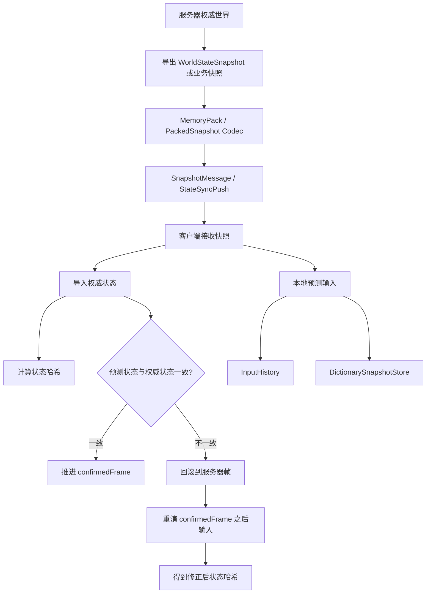
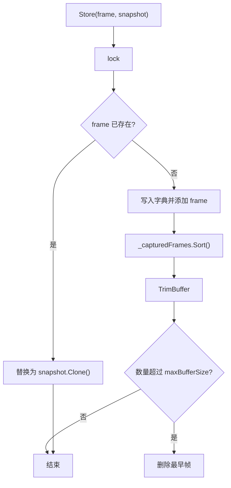
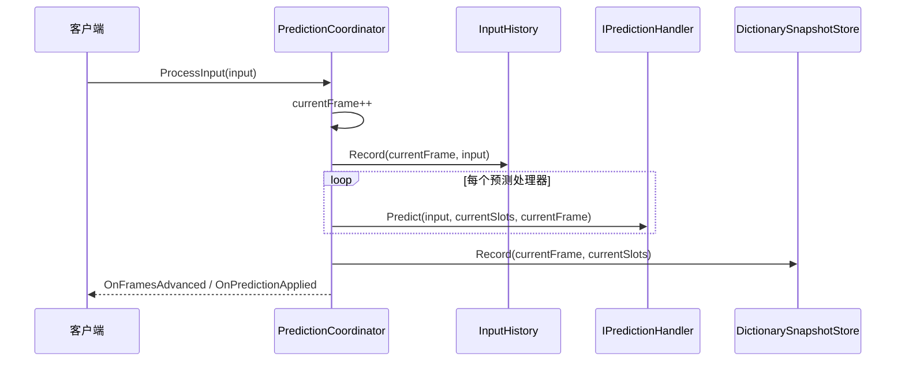
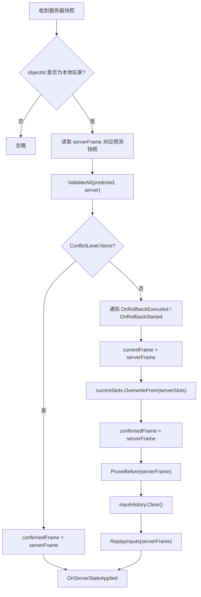
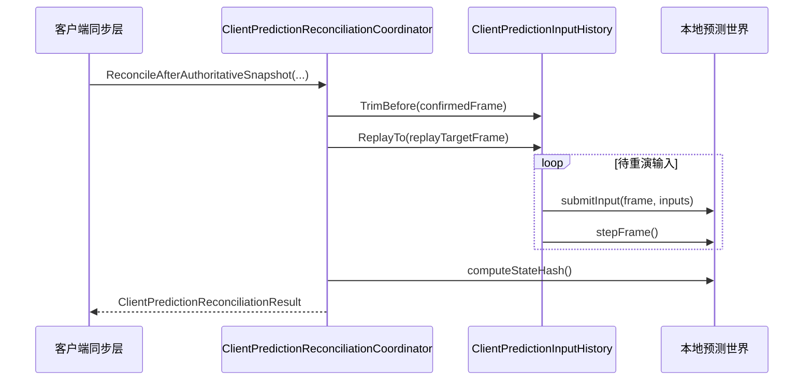
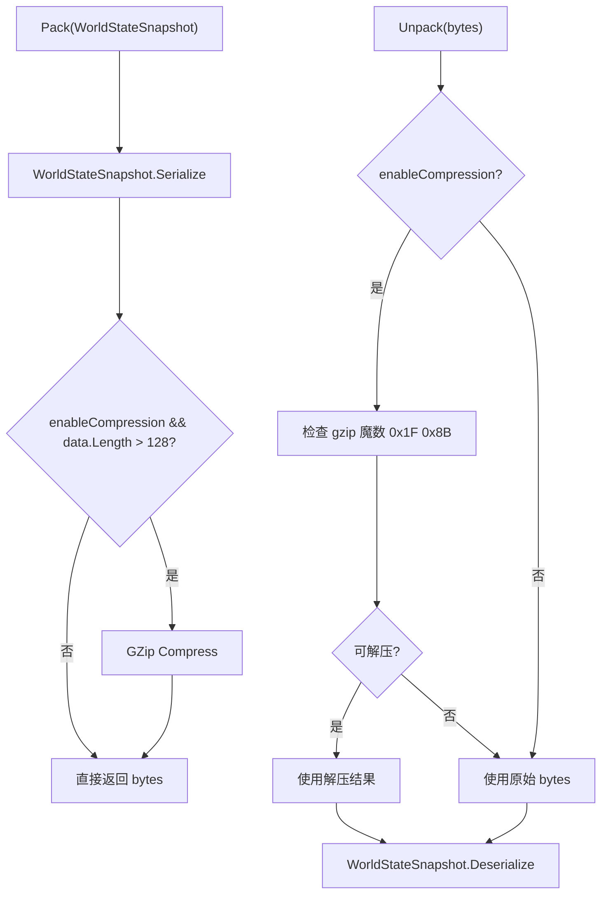
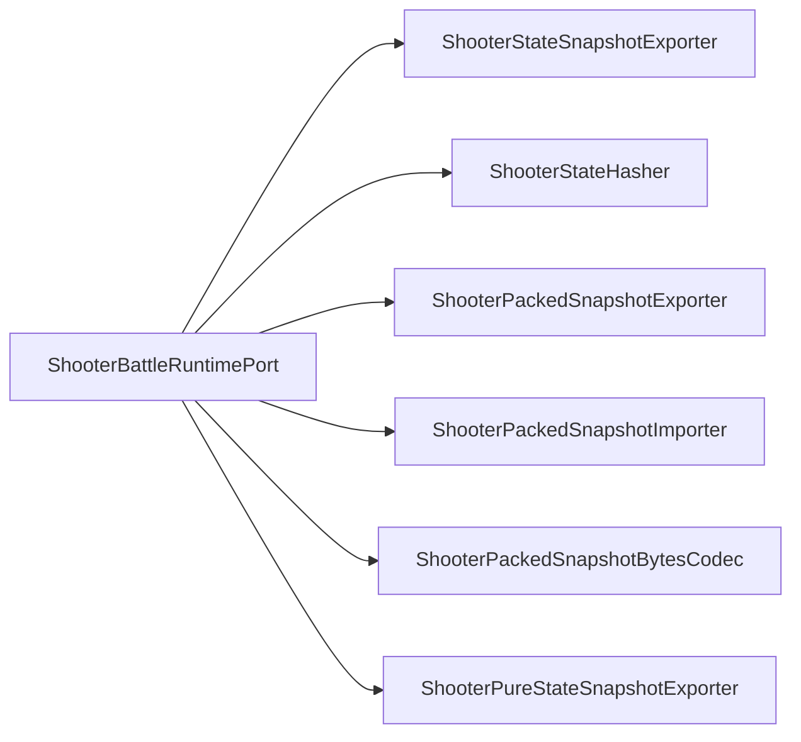
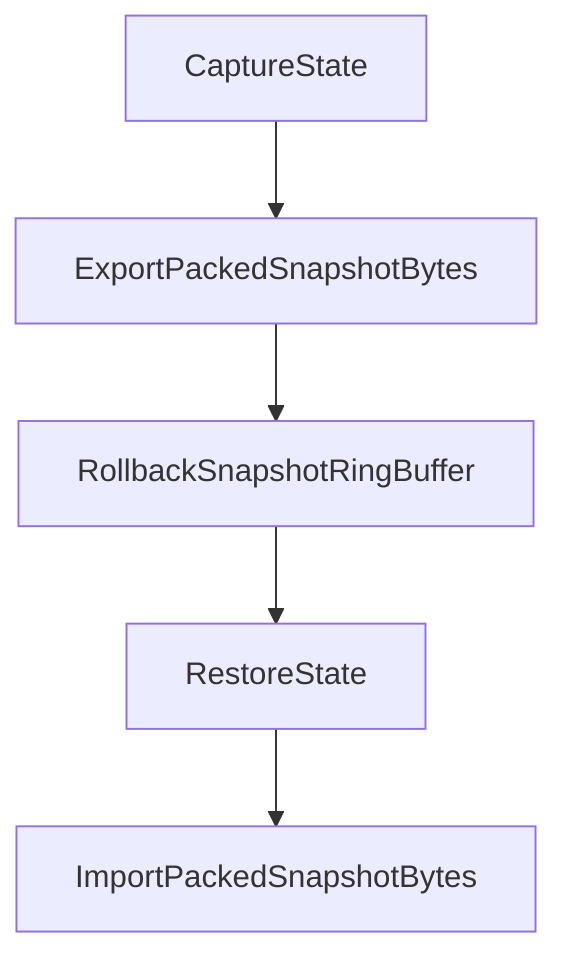

# 7.2 状态同步

> 基于真实源码说明 AbilityKit 的状态同步能力：通用 `WorldStateSnapshot`、快照缓存、网络快照消息、MemoryPack 打包、客户端预测协调，以及 Demo Shooter 中权威快照与预测重演的落地路径。

---

## 目录

1. [能力定位](#1-能力定位)
2. [源码入口](#2-源码入口)
3. [总体结构](#3-总体结构)
4. [核心数据结构](#4-核心数据结构)
5. [快照缓存](#5-快照缓存)
6. [预测协调与服务器修正](#6-预测协调与服务器修正)
7. [网络快照消息与打包](#7-网络快照消息与打包)
8. [Shooter 状态同步落地](#8-shooter-状态同步落地)
9. [设计约束与查漏补缺](#9-设计约束与查漏补缺)

---

## 1. 能力定位

AbilityKit 的状态同步不是一个独立网络协议，而是围绕“权威状态修正客户端”的一组能力：

| 能力 | 作用 | 代表类型 |
|------|------|----------|
| 通用快照 | 用跨端可序列化的数据结构描述世界状态元信息 | `WorldStateSnapshot`、`Vec3`、`Quat` |
| 快照缓存 | 按帧保存最近若干帧快照，支持读取、裁剪、清理 | `SnapshotBuffer` |
| 网络消息 | 将快照、快照请求、状态哈希封装为网络传输对象 | `SnapshotMessage`、`SnapshotRequestMessage`、`StateHashMessage` |
| 快照打包 | 将快照序列化为字节，必要时压缩 | `ISnapshotPacker`、`MemoryPackSnapshotPacker` |
| 客户端预测 | 本地先执行输入，并保存预测状态与输入历史 | `PredictionCoordinator`、`InputHistory`、`StateSlots` |
| 冲突修正 | 收到服务器快照后校验预测状态，必要时回滚并重演 | `IPredictionHandler`、`PredictionResult`、`ConflictLevel` |
| Demo 落地 | Shooter 通过专用 packed/pure-state 快照和状态哈希实现权威推送 | `ShooterPackedSnapshotExporter`、`ShooterPackedSnapshotImporter`、`ShooterStateHasher` |

状态同步与帧同步的差异：

- 帧同步要求所有端以相同输入推进相同逻辑。
- 状态同步允许客户端本地预测，但服务器快照拥有最终权威。
- 状态同步需要处理乱序、旧帧、哈希不一致、快照压缩、增量快照和重演成本。

---

## 2. 源码入口

### 2.1 通用 StateSync 包

| 文件 | 说明 |
|------|------|
| [WorldStateSnapshot.cs](../../../Unity/Packages/com.abilitykit.world.statesync/Runtime/StateSync/Snapshot/WorldStateSnapshot.cs) | 通用世界状态快照，包含世界 ID、版本、帧号、时间戳、标志位、完整/增量标记、序列化、克隆、哈希。 |
| [SnapshotBuffer.cs](../../../Unity/Packages/com.abilitykit.world.statesync/Runtime/StateSync/Buffer/SnapshotBuffer.cs) | 线程安全的帧快照缓存，内部按帧号索引并维护有序帧列表。 |
| [SnapshotMessage.cs](../../../Unity/Packages/com.abilitykit.world.statesync/Runtime/StateSync/Network/SnapshotMessage.cs) | 网络传输用快照消息、快照请求消息和状态哈希消息。 |
| [ISnapshotPacker.cs](../../../Unity/Packages/com.abilitykit.world.statesync/Runtime/StateSync/Network/ISnapshotPacker.cs) | 快照打包器接口与 `MemoryPackSnapshotPacker` 默认实现。 |
| [PredictionCoordinator.cs](../../../Unity/Packages/com.abilitykit.world.statesync/Runtime/StateSync/Prediction/Core/PredictionCoordinator.cs) | 通用预测协调器，管理处理器、输入历史、快照存储和服务器确认帧。 |
| [StateSlots.cs](../../../Unity/Packages/com.abilitykit.world.statesync/Runtime/StateSync/Prediction/Core/StateSlots.cs) | 预测状态槽位、预测处理器、监听器、快照存储和输入历史。 |

### 2.2 Host Extension 与 Shooter 落地

| 文件 | 说明 |
|------|------|
| [ClientPredictionReconciliationCoordinator.cs](../../../Unity/Packages/com.abilitykit.host.extension/Runtime/Client/FrameSync/ClientPredictionReconciliationCoordinator.cs) | 客户端收到权威快照后裁剪输入历史，并重演确认帧之后的本地输入。 |
| [ShooterBattleRuntimePort.cs](../../../Unity/Packages/com.abilitykit.demo.shooter.runtime/Runtime/Application/Runtime/ShooterBattleRuntimePort.cs) | Shooter 战斗运行时端口，提供快照导出、导入、状态哈希、纯状态快照等能力。 |
| [ShooterPackedSnapshotExporter.cs](../../../Unity/Packages/com.abilitykit.demo.shooter.runtime/Runtime/Application/Synchronization/ShooterPackedSnapshotExporter.cs) | Shooter packed 快照导出，构造带实体 chunk 的快照载荷。 |
| [ShooterPackedSnapshotImporter.cs](../../../Unity/Packages/com.abilitykit.demo.shooter.runtime/Runtime/Application/Synchronization/ShooterPackedSnapshotImporter.cs) | Shooter packed 快照导入，将权威实体状态写回运行时。 |
| [ShooterStateHasher.cs](../../../Unity/Packages/com.abilitykit.demo.shooter.runtime/Runtime/Application/Synchronization/ShooterStateHasher.cs) | 对玩家、子弹、敌人等状态按稳定顺序计算哈希。 |
| [ShooterPackedSnapshotRollbackProvider.cs](../../../Unity/Packages/com.abilitykit.demo.shooter.runtime/Runtime/Application/Rollback/ShooterPackedSnapshotRollbackProvider.cs) | 将 Shooter packed 快照接入回滚状态提供器。 |

---

## 3. 总体结构

这张图对应两层实现：

1. 通用层提供快照、缓存、预测、打包抽象。
2. 业务层决定实际快照内容、实体排序、压缩格式、哈希规则和如何把快照写回世界。

---

## 4. 核心数据结构

### 4.1 `WorldStateSnapshot`

`WorldStateSnapshot` 是框架级快照元信息结构：

| 字段 | 含义 |
|------|------|
| `WorldId` | 世界 ID，用于区分房间/战斗实例。 |
| `Version` | 快照结构版本，默认 `CurrentVersion = 1`。 |
| `Frame` | 快照所属逻辑帧。 |
| `Timestamp` | 生成时间戳。 |
| `WorldFlags` | 世界状态标志位。 |
| `IsFullSnapshot` | 是否为完整快照；`false` 表示增量快照。 |

它提供四类基础能力：

- `Serialize` / `Deserialize`：通过 MemoryPack 转字节。
- `ToBytes` / `FromBytes`：实例级和静态字节转换。
- `ComputeHash`：委托 `StateHashComputer` 计算状态哈希。
- `Clone`：通过序列化再反序列化复制快照。

### 4.2 序列化向量类型

`WorldStateSnapshot.cs` 中还定义了独立于引擎的 `Vec3` 和 `Quat`：

- 它们是 `MemoryPackable` 类型，适合网络传输。
- 它们不是 `AbilityKit.Core.Mathematics.Vec3` / `Quat` 本体。
- 代码提供 `FromCoreVec3`、`ToCoreVec3`、`FromCoreQuat`、`ToCoreQuat` 显式转换，避免业务层误把运行时数学结构直接当网络结构使用。

---

## 5. 快照缓存

`SnapshotBuffer` 是一个按帧缓存 `WorldStateSnapshot` 的线程安全容器：

关键行为：

- `Store` 总是保存 `snapshot.Clone()`，避免外部继续修改同一对象。
- `TryGet` 返回 clone，调用方拿到的是副本。
- `GetCapturedFrames` 返回数组副本。
- `RemoveBefore` / `RemoveAfter` 可用于确认帧之前裁剪或回滚后清理未来帧。
- `TrimBuffer` 通过删除最早帧控制内存上限。

---

## 6. 预测协调与服务器修正

### 6.1 `StateSlots` 与 `IPredictionHandler`

`StateSlots` 是通用预测状态容器，按字符串槽位保存状态值。它支持：

- `Set` / `Remove` 修改槽位并增加版本。
- `GetFloat`、`GetInt`、`GetBool`、`GetPosition`、`GetQuaternion` 等常用读取。
- `Clone` 复制槽位字典。
- `OverwriteFrom` 用服务器状态覆盖当前状态。
- `ComputeHash` 对槽位键值计算哈希。

`IPredictionHandler` 负责把输入作用到槽位：

| 方法 | 作用 |
|------|------|
| `Predict` | 根据输入预测本地状态。 |
| `Validate` | 比较预测状态与服务器状态。 |
| `ApplyServerState` | 将服务器状态写入当前状态。 |

### 6.2 `PredictionCoordinator.ProcessInput`

本地输入处理的核心是：先推进本地预测帧，再记录输入，然后让所有非 `PredictionStrategy.None` 的处理器修改 `StateSlots`，最后保存预测快照。

### 6.3 `PredictionCoordinator.ApplyServerSnapshot`

需要注意一个源码事实：当前通用 `PredictionCoordinator` 在冲突分支中会执行 `_inputHistory.Clear()`，随后调用 `ReplayInputs(serverFrameObj)`。这意味着通用层的重演链路更像“接口与流程骨架”，具体业务若需要保留并重演确认帧之后的输入，应使用或扩展 Host Extension 里的 `ClientPredictionReconciliationCoordinator<TInput>` 这类更明确的输入历史裁剪/重演器。

### 6.4 客户端预测重整

`ClientPredictionReconciliationCoordinator<TInput>` 的职责更聚焦：收到权威快照后裁剪已确认输入，再重演剩余本地输入。

返回结果中包含：

- 修正前预测帧和预测哈希。
- 权威帧、权威哈希和导入后哈希。
- 权威哈希是否匹配导入后哈希。
- 重演 tick 数、最终帧和最终哈希。
- 修正前、裁剪后、重演后的待处理输入数量。

---

## 7. 网络快照消息与打包

### 7.1 `SnapshotMessage`

`SnapshotMessage` 是通用网络消息：

| 字段 | 含义 |
|------|------|
| `WorldId` | 世界 ID。 |
| `Frame` | 快照帧。 |
| `Timestamp` | 消息时间戳。 |
| `IsFullSnapshot` | 是否完整快照。 |
| `IsCompressed` | 是否压缩。 |
| `SnapshotData` | 快照字节。 |
| `StateHash` | 状态哈希。 |

它提供：

- `Create<T>`：用 MemoryPack 序列化任意快照对象。
- `ParseSnapshot<T>`：解析 `SnapshotData`。
- `Pack` / `Unpack`：把整个 `SnapshotMessage` 打成网络字节或从字节恢复。

### 7.2 请求和哈希消息

- `SnapshotRequestMessage`：请求某个世界从 `FromFrame` 到 `ToFrame` 的快照，可指定是否请求完整快照。
- `StateHashMessage`：传输某帧状态哈希和可选状态数据，用于检测分歧。

### 7.3 `MemoryPackSnapshotPacker`

默认打包器只负责通用 `WorldStateSnapshot`。Shooter 等业务模块因为需要实体 chunk、兴趣管理和更紧凑的结构，会实现自己的 packed/pure-state 快照编码。

---

## 8. Shooter 状态同步落地

Shooter Demo 展示了比通用 `WorldStateSnapshot` 更完整的业务状态同步实现。

### 8.1 运行时端口

`ShooterBattleRuntimePort` 同时实现多个端口：

- `IShooterSimulationClock`：帧推进。
- `IShooterSnapshotReadPort`：导出完整业务快照。
- `IShooterStateHashProvider`：计算状态哈希。
- `IShooterPackedSnapshotPort`：导出/导入 packed 快照与字节。
- `IShooterPureStateSnapshotPort`：导出纯状态快照。
- `IShooterBotAiPort`：Bot AI 输入。

### 8.2 Packed 快照

`ShooterPackedSnapshotExporter` 会导出：

- 版本、世界 ID、当前帧。
- 完整/增量/keyframe/authorityOverride 标志。
- `StateHash`。
- 玩家、子弹、敌人等实体 chunk。
- 按稳定顺序排序后的实体数据。

`ShooterPackedSnapshotImporter` 根据 chunk 写回实体状态：

- full 快照可重建基线。
- delta 快照可更新实体位置、血量、分数、剩余帧等字段。
- 导入后再计算状态哈希，可与权威哈希比较。

### 8.3 Pure State 快照

`ShooterPureStateSnapshotExporter` 面向状态同步推送和兴趣管理，支持：

- full baseline、delta、low frequency 三类快照。
- `MaxEntityCount`、`ActiveSyncBudget` 等预算控制。
- `ShooterPureStateInterestScope` 按观察者位置和半径裁剪实体。
- `VisibilityHint` 和实体优先级，帮助客户端选择重要实体。

### 8.4 回滚接入

`ShooterPackedSnapshotRollbackProvider` 将 packed 快照包装为 `IRollbackStateProvider`：

这说明状态同步和回滚不是互斥能力：状态同步用于网络权威修正，回滚用同一种快照字节实现恢复点。

---

## 9. 设计约束与查漏补缺

### 9.1 已有设计约束

- 通用 `WorldStateSnapshot` 只保存框架级元信息，业务状态应由 partial 扩展或业务专用快照承载。
- `SnapshotBuffer` 返回 clone，降低外部误修改缓存的风险，但也带来序列化复制成本。
- `StateSlots.ComputeHash` 遍历字典，若用于严格确定性校验，需要确保键顺序和哈希策略稳定；Shooter 使用专用 `ShooterStateHasher` 规避该问题。
- 通用 `PredictionCoordinator` 具备预测/校验/回滚事件骨架，但复杂业务更适合接入业务专用输入历史和快照导入器。
- MemoryPack 打包器只处理通用快照对象；跨语言或 Web 端需要额外协议映射。

### 9.2 后续文档补齐建议

- 在 [回滚预测](03-RollbackPrediction.md) 中进一步说明 `RollbackCoordinator`、`RollbackSnapshotRingBuffer` 与 `IRollbackStateProvider`。
- 在 [会话协调](05-SessionCoordination.md) 中说明 Orleans `StateSyncObserverGrain` 如何把 `StateSyncPush` 通过 Gateway 推给账号连接。
- 在 Shooter Demo 文档中补充 packed snapshot、pure state、兴趣管理和 smoke 测试闭环。

---

## 下一步

- [帧同步机制](01-FrameSync.md) - 理解输入帧如何推进逻辑。
- [回滚预测](03-RollbackPrediction.md) - 理解快照恢复与输入重演。
- [网络同步能力地图](00-SynchronizationCapabilityMap.md) - 回到同步能力总览。

---

*文档版本：v2.0 | 最后更新：2026-06-23*
